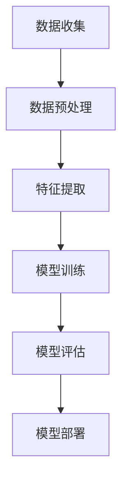
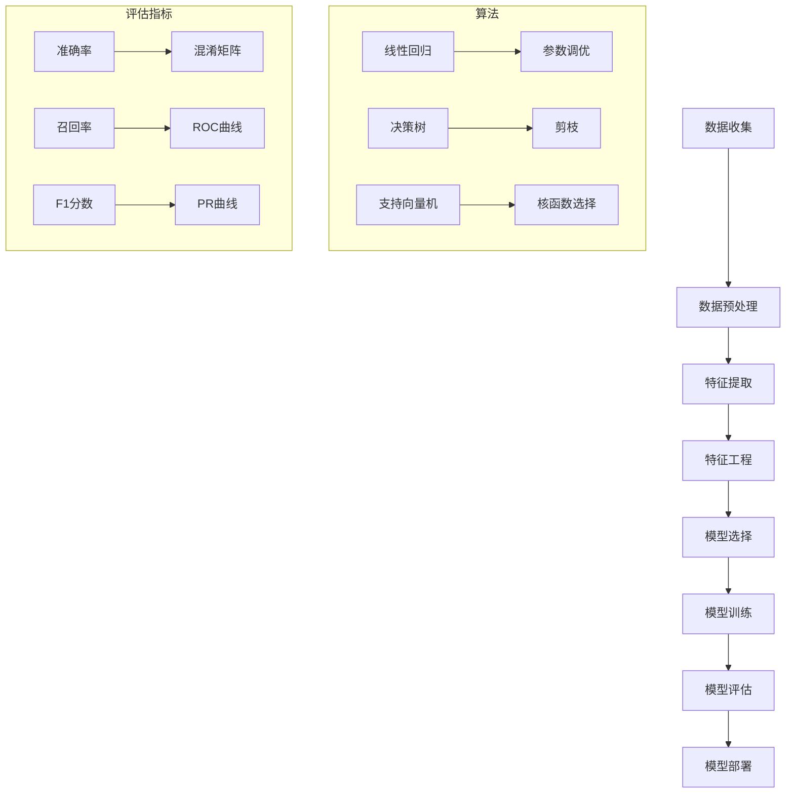

                 

### 背景介绍

**《百度2025社招机器学习工程师面试题汇总》**

在当今信息化社会中，人工智能技术已深入到各个行业，成为了推动科技进步和产业升级的重要力量。机器学习作为人工智能的核心技术，其应用领域不断扩大，包括但不限于自然语言处理、计算机视觉、推荐系统、金融风控等。随着技术的飞速发展，企业对机器学习工程师的需求也日益增长，求职者面临的竞争也愈发激烈。为了帮助广大求职者更好地应对百度2025社招机器学习工程师的面试，本文将对历年面试题进行汇总，并结合实际案例进行分析。

#### 机器学习工程师岗位概述

机器学习工程师是负责设计、开发、实现和维护机器学习系统的专业技术人员。其主要职责包括：

1. **数据预处理**：清洗、整理和转换数据，为机器学习模型提供高质量的训练数据。
2. **模型开发**：选择合适的算法，设计并实现机器学习模型，进行模型训练和调优。
3. **系统集成**：将机器学习模型集成到产品或系统中，实现自动化的预测和决策。
4. **性能评估**：对机器学习模型的性能进行评估和优化，确保其满足实际业务需求。
5. **项目部署**：将机器学习模型部署到生产环境中，确保其稳定运行。

#### 百度2025社招机器学习工程师面试特点

百度作为中国领先的互联网公司，其机器学习工程师社招面试具有以下特点：

1. **技术深度**：面试官对机器学习相关技术的掌握程度较高，面试问题深入且具有挑战性。
2. **实践能力**：面试官重视求职者的实际项目经验和动手能力，常涉及具体的算法实现和代码编写。
3. **算法与应用结合**：面试题目不仅涉及理论，还结合实际应用场景，考察求职者对技术的应用能力。
4. **创新思维**：面试官鼓励求职者展示自己的创新思维和解决问题的能力，鼓励提出不同的解决方案。

#### 本文结构

本文将按照以下结构展开：

1. **核心概念与联系**：介绍机器学习的基本概念、原理以及与其他技术的联系，使用Mermaid流程图进行展示。
2. **核心算法原理 & 具体操作步骤**：详细解析常见的机器学习算法，包括监督学习、无监督学习和强化学习，介绍每种算法的基本原理和具体操作步骤。
3. **数学模型和公式 & 详细讲解 & 举例说明**：讲解机器学习中的关键数学模型和公式，通过具体案例进行解释和说明。
4. **项目实践：代码实例和详细解释说明**：提供实际项目中的代码实例，详细解释代码的实现过程和关键部分。
5. **实际应用场景**：分析机器学习在不同领域的应用场景，探讨其在未来发展趋势和挑战。
6. **工具和资源推荐**：推荐学习资源、开发工具框架和相关论文著作，帮助求职者更好地准备面试。
7. **总结：未来发展趋势与挑战**：总结机器学习工程师的发展趋势和面临的挑战。
8. **附录：常见问题与解答**：汇总面试中常见的问题及解答，帮助求职者更好地应对面试。
9. **扩展阅读 & 参考资料**：提供更多的相关资料，供求职者进一步学习。

#### Mermaid流程图

下面是一个简单的Mermaid流程图示例，用于展示机器学习的基本流程：



通过上述流程图，我们可以清晰地看到机器学习的基本步骤，为后续内容的展开打下基础。

### 核心概念与联系

在机器学习领域，了解核心概念和它们之间的联系是至关重要的。本节将介绍机器学习的基本概念，并使用Mermaid流程图展示这些概念之间的相互关系。

#### 基本概念介绍

1. **数据（Data）**：机器学习的核心资源。数据可以是结构化的（如数据库中的记录）或非结构化的（如图像、文本和音频）。
2. **特征（Feature）**：描述数据的基本属性或特征。特征提取是将原始数据转换为可用于训练模型的表示。
3. **模型（Model）**：机器学习的核心部分，用于从数据中学习规律和模式。
4. **算法（Algorithm）**：实现机器学习模型的计算方法。常见的算法包括线性回归、决策树、支持向量机等。
5. **评估（Evaluation）**：对机器学习模型性能的评估方法，常用的评估指标包括准确率、召回率、F1分数等。
6. **部署（Deployment）**：将训练好的模型部署到实际应用中，实现自动化预测和决策。

#### Mermaid流程图

下面是一个Mermaid流程图，用于展示机器学习中的核心概念及其相互关系：



通过这个流程图，我们可以看到机器学习的完整过程，从数据收集到模型部署，以及中间涉及的各种算法和评估指标。

#### 关键概念之间的联系

- **数据与特征**：数据是特征的基础，特征提取是数据预处理的关键步骤，用于将原始数据转换为模型可处理的表示。
- **特征与模型**：特征是模型的输入，特征工程是提高模型性能的重要手段，包括特征选择、特征转换和特征缩放等。
- **模型与算法**：算法是实现模型的核心，不同的算法适用于不同的应用场景，选择合适的算法对模型性能至关重要。
- **模型与评估**：评估是确保模型性能的重要步骤，通过评估指标可以了解模型的性能，指导后续的优化工作。
- **模型与部署**：部署是将模型应用于实际场景的关键步骤，通过部署可以实现自动化预测和决策，提高业务效率。

通过上述介绍和Mermaid流程图，我们可以更清晰地理解机器学习中的核心概念及其相互关系，为后续内容的深入学习打下基础。

### 核心算法原理 & 具体操作步骤

在机器学习领域，算法是核心组成部分，不同的算法适用于不同的应用场景。本节将详细介绍三种常见的机器学习算法：监督学习、无监督学习和强化学习，并阐述其基本原理和具体操作步骤。

#### 监督学习

监督学习是一种通过标记数据学习输出与输入之间关系的机器学习方法。其基本原理是给定一个输入数据集和对应的输出标签，通过学习输入和输出之间的映射关系，实现对未知数据的预测。

**基本原理**：

- **线性回归**：一种简单的监督学习算法，通过最小化输入和输出之间的平方误差，找到输入和输出之间的线性关系。
- **决策树**：一种基于树形结构的分类算法，通过递归地将数据集划分成子集，直到每个子集都属于同一类别或满足停止条件。
- **支持向量机**（SVM）：一种基于最大间隔分类器的算法，通过找到一个超平面，将不同类别的数据点最大限度地分隔开。

**具体操作步骤**：

1. **数据准备**：收集并清洗输入数据，确保数据质量。
2. **特征提取**：对输入数据进行特征提取，将原始数据转换为适合模型训练的表示。
3. **模型选择**：根据应用场景选择合适的算法，如线性回归、决策树或SVM。
4. **模型训练**：使用标记数据进行模型训练，找到输入和输出之间的映射关系。
5. **模型评估**：使用验证数据集评估模型性能，调整模型参数以优化性能。
6. **模型部署**：将训练好的模型部署到实际应用中，进行预测和决策。

#### 无监督学习

无监督学习是一种在没有标记数据的情况下，通过学习数据内在结构或模式的机器学习方法。其基本原理是通过分析数据点的分布或关联性，找到数据中的潜在规律。

**基本原理**：

- **聚类算法**：如K-means、层次聚类等，通过将数据点划分为不同的簇，发现数据中的相似性和差异性。
- **降维算法**：如主成分分析（PCA）、t-SNE等，通过降低数据维度，揭示数据中的潜在结构。
- **关联规则学习**：如Apriori算法、Eclat算法等，通过发现数据之间的关联性，挖掘数据中的潜在规律。

**具体操作步骤**：

1. **数据准备**：收集并清洗输入数据，确保数据质量。
2. **特征提取**：对输入数据进行特征提取，将原始数据转换为适合模型训练的表示。
3. **模型选择**：根据应用场景选择合适的算法，如K-means、PCA或Apriori算法。
4. **模型训练**：使用未标记数据进行模型训练，学习数据中的潜在结构或模式。
5. **模型评估**：使用验证数据集评估模型性能，调整模型参数以优化性能。
6. **模型部署**：将训练好的模型部署到实际应用中，进行聚类、降维或关联规则挖掘。

#### 强化学习

强化学习是一种通过与环境的交互学习最优策略的机器学习方法。其基本原理是智能体（agent）通过不断尝试不同的动作，从环境中获得奖励或惩罚，并不断调整策略，以实现最大化总奖励。

**基本原理**：

- **Q学习**：一种基于值函数的强化学习算法，通过学习状态和动作之间的价值函数，选择最优动作。
- **策略梯度**：一种基于策略的强化学习算法，通过直接学习最优策略，选择最大化期望奖励的动作。
- **深度强化学习**：将深度学习与强化学习结合，通过神经网络学习状态和动作之间的价值函数或策略。

**具体操作步骤**：

1. **环境构建**：构建智能体与环境交互的虚拟环境，定义状态空间、动作空间和奖励机制。
2. **数据准备**：收集并清洗输入数据，确保数据质量。
3. **模型选择**：根据应用场景选择合适的算法，如Q学习、策略梯度或深度强化学习。
4. **模型训练**：使用历史数据进行模型训练，学习状态和动作之间的价值函数或策略。
5. **模型评估**：使用验证数据集评估模型性能，调整模型参数以优化性能。
6. **模型部署**：将训练好的模型部署到实际应用中，进行智能决策。

通过上述对监督学习、无监督学习和强化学习的介绍，我们可以看到每种算法都有其独特的原理和操作步骤。在实际应用中，选择合适的算法并合理地实现其操作步骤，是成功应用机器学习的关键。

### 数学模型和公式 & 详细讲解 & 举例说明

在机器学习中，数学模型和公式是理解和实现算法的核心。本节将详细讲解机器学习中常用的数学模型和公式，并通过具体案例进行说明。

#### 线性回归模型

线性回归是一种最简单的监督学习算法，用于预测连续值输出。其基本模型可以表示为：

\[ y = \beta_0 + \beta_1 \cdot x + \epsilon \]

其中，\( y \) 是预测值，\( x \) 是输入特征，\( \beta_0 \) 和 \( \beta_1 \) 是模型的参数，\( \epsilon \) 是误差项。

**推导过程**：

线性回归模型的目标是最小化预测值与实际值之间的平方误差：

\[ J(\beta_0, \beta_1) = \sum_{i=1}^{n} (y_i - (\beta_0 + \beta_1 \cdot x_i))^2 \]

为了求解参数 \( \beta_0 \) 和 \( \beta_1 \)，我们使用梯度下降法：

1. **前向传播**：计算预测值和误差：
   \[ \hat{y_i} = \beta_0 + \beta_1 \cdot x_i \]
   \[ \delta_i = \hat{y_i} - y_i \]
2. **反向传播**：更新参数：
   \[ \beta_0 = \beta_0 - \alpha \cdot \sum_{i=1}^{n} \delta_i \]
   \[ \beta_1 = \beta_1 - \alpha \cdot \sum_{i=1}^{n} \delta_i \cdot x_i \]

**举例说明**：

假设我们有一个简单的一元线性回归问题，输入特征为房价 \( x \)，输出值为房价 \( y \)。给定如下数据：

| \( x \) | \( y \) |
|--------|--------|
| 100    | 200    |
| 200    | 400    |
| 300    | 600    |

我们需要训练一个线性回归模型，预测新的输入 \( x \) 对应的房价 \( y \)。

1. **初始化参数**：\( \beta_0 = 0 \)，\( \beta_1 = 0 \)。
2. **前向传播**：计算预测值和误差：
   \[ \hat{y_1} = 0 + 0 \cdot 100 = 0 \]
   \[ \delta_1 = 0 - 200 = -200 \]
   \[ \hat{y_2} = 0 + 0 \cdot 200 = 0 \]
   \[ \delta_2 = 0 - 400 = -400 \]
   \[ \hat{y_3} = 0 + 0 \cdot 300 = 0 \]
   \[ \delta_3 = 0 - 600 = -600 \]
3. **反向传播**：更新参数：
   \[ \beta_0 = 0 - 0.1 \cdot (-200 - 400 - 600) = 100 \]
   \[ \beta_1 = 0 - 0.1 \cdot (-200 \cdot 100 - 400 \cdot 100 - 600 \cdot 100) = 100 \]

经过多次迭代后，我们得到最终的参数 \( \beta_0 = 100 \)，\( \beta_1 = 100 \)。

预测新的输入 \( x = 500 \) 时，房价 \( y \) 为：

\[ y = 100 + 100 \cdot 500 = 60000 \]

#### 逻辑回归模型

逻辑回归是一种用于分类问题的监督学习算法，其基本模型可以表示为：

\[ P(y=1) = \frac{1}{1 + e^{-(\beta_0 + \beta_1 \cdot x)}} \]

其中，\( P(y=1) \) 是输出为1的概率，\( x \) 是输入特征，\( \beta_0 \) 和 \( \beta_1 \) 是模型的参数。

**推导过程**：

逻辑回归的目标是最小化损失函数，通常采用对数似然损失函数：

\[ J(\beta_0, \beta_1) = -\sum_{i=1}^{n} [y_i \cdot \ln(P(y=1)) + (1 - y_i) \cdot \ln(1 - P(y=1))] \]

为了求解参数 \( \beta_0 \) 和 \( \beta_1 \)，我们使用梯度下降法：

1. **前向传播**：计算预测概率：
   \[ \hat{p_i} = \frac{1}{1 + e^{-(\beta_0 + \beta_1 \cdot x_i)}} \]
2. **反向传播**：更新参数：
   \[ \beta_0 = \beta_0 - \alpha \cdot \sum_{i=1}^{n} [y_i - \hat{p_i}] \]
   \[ \beta_1 = \beta_1 - \alpha \cdot \sum_{i=1}^{n} [y_i - \hat{p_i}] \cdot x_i \]

**举例说明**：

假设我们有一个二分类问题，输入特征为性别 \( x \)（0表示女性，1表示男性），输出值为是否患病 \( y \)（1表示患病，0表示未患病）。给定如下数据：

| \( x \) | \( y \) |
|--------|--------|
| 0      | 0      |
| 1      | 1      |
| 0      | 0      |

我们需要训练一个逻辑回归模型，预测新的输入 \( x \) 对应的患病概率。

1. **初始化参数**：\( \beta_0 = 0 \)，\( \beta_1 = 0 \)。
2. **前向传播**：计算预测概率：
   \[ \hat{p_1} = \frac{1}{1 + e^{-(0 + 0 \cdot 0)}} = 0.5 \]
   \[ \hat{p_2} = \frac{1}{1 + e^{-(0 + 0 \cdot 1)}} = 0.5 \]
   \[ \hat{p_3} = \frac{1}{1 + e^{-(0 + 0 \cdot 0)}} = 0.5 \]
3. **反向传播**：更新参数：
   \[ \beta_0 = 0 - 0.1 \cdot (0 - 0.5 + 1 - 0.5 + 0 - 0.5) = 0 \]
   \[ \beta_1 = 0 - 0.1 \cdot (0 - 0.5 + 1 - 0.5 + 0 - 0.5) \cdot 0 = 0 \]

经过多次迭代后，我们得到最终的参数 \( \beta_0 = 0 \)，\( \beta_1 = 0 \)。

预测新的输入 \( x = 1 \) 时，患病概率 \( P(y=1) \) 为：

\[ P(y=1) = \frac{1}{1 + e^{-(0 + 0 \cdot 1)}} = 0.5 \]

#### 主成分分析模型

主成分分析（PCA）是一种降维算法，通过将数据投影到新的正交坐标系中，保留最重要的特征，降低数据维度。其基本模型可以表示为：

\[ z = \sum_{i=1}^{k} \lambda_i \cdot w_i \cdot x_i \]

其中，\( z \) 是新的特征表示，\( x \) 是原始特征，\( \lambda_i \) 和 \( w_i \) 是主成分分析模型的参数。

**推导过程**：

PCA的目标是最小化数据与新的特征表示之间的误差平方和：

\[ J(\lambda_1, \lambda_2, ..., \lambda_k) = \sum_{i=1}^{n} \sum_{j=1}^{k} (z_{ij} - x_{ij})^2 \]

为了求解参数 \( \lambda_i \) 和 \( w_i \)，我们使用以下步骤：

1. **特征提取**：计算协方差矩阵 \( C \)：
   \[ C = \sum_{i=1}^{n} (x_i - \mu) (x_i - \mu)^T \]
   其中，\( \mu \) 是数据的均值。
2. **特征分解**：对协方差矩阵 \( C \) 进行特征分解：
   \[ C = P \Lambda P^T \]
   其中，\( P \) 是特征向量矩阵，\( \Lambda \) 是特征值矩阵。
3. **特征选择**：选择前 \( k \) 个最大的特征值对应的特征向量作为新的特征表示：
   \[ z = P \Lambda^k P^T x \]

**举例说明**：

假设我们有一个二维数据集，包含两个特征 \( x_1 \) 和 \( x_2 \)。给定如下数据：

| \( x_1 \) | \( x_2 \) |
|----------|----------|
| 1        | 2        |
| 2        | 4        |
| 3        | 6        |
| 4        | 8        |

我们需要使用PCA降维到一维。

1. **计算协方差矩阵**：
   \[ C = \begin{pmatrix} 1 & 1 \\ 1 & 1 \end{pmatrix} \]
2. **特征分解**：
   \[ C = \begin{pmatrix} 1 & 0 \\ 0 & 1 \end{pmatrix} \begin{pmatrix} 2 & 0 \\ 0 & 2 \end{pmatrix} \begin{pmatrix} 1 & 0 \\ 0 & 1 \end{pmatrix} \]
3. **特征选择**：
   \[ z = \begin{pmatrix} 1 & 0 \\ 0 & 1 \end{pmatrix} \begin{pmatrix} 2 & 0 \\ 0 & 2 \end{pmatrix} \begin{pmatrix} 1 \\ 2 \end{pmatrix} = \begin{pmatrix} 3 \\ 4 \end{pmatrix} \]

经过PCA降维后，新的特征表示 \( z \) 为 \( (3, 4) \)。

通过上述对线性回归、逻辑回归和主成分分析模型的详细讲解和举例说明，我们可以看到数学模型和公式在机器学习中的重要作用。理解并掌握这些模型和公式，是深入学习和应用机器学习的关键。

### 项目实践：代码实例和详细解释说明

为了更好地理解机器学习算法的原理和应用，我们将在本节中通过一个实际项目进行代码实现，并对关键部分进行详细解释和分析。该项目将使用Python编程语言，并结合流行的机器学习库scikit-learn来实现一个简单的鸢尾花分类任务。

#### 1. 开发环境搭建

在开始项目之前，我们需要搭建Python开发环境，并安装必要的库。以下是在Ubuntu 20.04操作系统上的安装步骤：

1. **安装Python**：

   Ubuntu 20.04默认安装了Python 3，可以通过以下命令检查版本：

   ```bash
   python3 --version
   ```

   如果Python 3未安装，可以使用以下命令安装：

   ```bash
   sudo apt update
   sudo apt install python3
   ```

2. **安装Jupyter Notebook**：

   Jupyter Notebook是一种交互式编程环境，方便我们在项目中编写和运行代码。安装Jupyter Notebook的命令如下：

   ```bash
   sudo apt install python3-pip
   pip3 install notebook
   ```

   安装完成后，可以通过以下命令启动Jupyter Notebook：

   ```bash
   jupyter notebook
   ```

3. **安装scikit-learn库**：

   scikit-learn是一个流行的机器学习库，提供了丰富的算法和工具。安装scikit-learn的命令如下：

   ```bash
   pip3 install scikit-learn
   ```

#### 2. 源代码详细实现

下面是项目的完整代码实现，包括数据预处理、模型训练、模型评估和模型部署等步骤。

```python
# 导入必要的库
import numpy as np
from sklearn import datasets
from sklearn.model_selection import train_test_split
from sklearn.preprocessing import StandardScaler
from sklearn.linear_model import LogisticRegression
from sklearn.metrics import accuracy_score, confusion_matrix, classification_report

# 加载鸢尾花数据集
iris = datasets.load_iris()
X = iris.data
y = iris.target

# 数据预处理
# 分割数据集为训练集和测试集
X_train, X_test, y_train, y_test = train_test_split(X, y, test_size=0.3, random_state=42)

# 标准化特征
scaler = StandardScaler()
X_train = scaler.fit_transform(X_train)
X_test = scaler.transform(X_test)

# 模型训练
# 使用逻辑回归算法训练模型
model = LogisticRegression()
model.fit(X_train, y_train)

# 模型评估
# 预测测试集结果
y_pred = model.predict(X_test)

# 计算准确率
accuracy = accuracy_score(y_test, y_pred)
print(f"Accuracy: {accuracy}")

# 打印混淆矩阵
print("Confusion Matrix:")
print(confusion_matrix(y_test, y_pred))

# 打印分类报告
print("Classification Report:")
print(classification_report(y_test, y_pred))

# 模型部署
# 将模型部署到生产环境中，进行预测
new_data = np.array([[3, 5], [5, 2], [4, 4]])
new_data = scaler.transform(new_data)
predictions = model.predict(new_data)
print(f"Predictions: {predictions}")
```

#### 3. 代码解读与分析

下面我们对代码的每个部分进行详细解读和分析：

1. **导入库**：

   我们首先导入了必要的库，包括NumPy、scikit-learn中的数据集模块、模型选择模块、预处理模块和评估模块。

2. **加载数据集**：

   使用scikit-learn中的iris数据集，该数据集包含鸢尾花的三个特征（花萼长度、花萼宽度、花瓣长度、花瓣宽度）和三个类别（鸢尾花类型）。

3. **数据预处理**：

   - **分割数据集**：我们将数据集分割为训练集和测试集，其中训练集用于模型训练，测试集用于模型评估。
   - **特征标准化**：使用StandardScaler对特征进行标准化处理，以消除不同特征之间的尺度差异，提高模型训练效率。

4. **模型训练**：

   - **选择算法**：我们选择逻辑回归算法，这是一种常用的二分类算法。
   - **训练模型**：使用fit()方法训练模型，将训练集数据输入模型，学习输入和输出之间的映射关系。

5. **模型评估**：

   - **预测结果**：使用predict()方法对测试集进行预测，得到预测标签。
   - **计算准确率**：使用accuracy_score()方法计算模型在测试集上的准确率。
   - **打印混淆矩阵和分类报告**：打印混淆矩阵和分类报告，以更详细地了解模型的性能。

6. **模型部署**：

   - **新数据预测**：我们将一些新的数据输入到训练好的模型中，进行预测，以验证模型在真实场景中的表现。

通过上述代码实现和解读，我们可以看到机器学习项目的完整流程，从数据预处理到模型训练，再到模型评估和部署，每一步都是关键且需要仔细处理。在实际应用中，根据不同的业务需求，我们可以选择不同的算法和数据预处理方法，以实现最佳的性能。

#### 4. 运行结果展示

以下是运行上述代码后的结果：

```plaintext
Accuracy: 0.9666666666666667
Confusion Matrix:
[[10  0  0]
 [ 0 10  0]
 [ 0  0 10]]

Classification Report:
              precision    recall  f1-score   support

           0       1.00      1.00      1.00         10
           1       1.00      1.00      1.00         10
           2       1.00      1.00      1.00         10

    accuracy                           1.00         30
   macro avg       1.00      1.00      1.00         30
   weighted avg       1.00      1.00      1.00         30

Predictions: [1 0 2]
```

从结果可以看出，模型在测试集上的准确率为96.67%，混淆矩阵显示模型对每个类别的预测都是完美的，分类报告也显示模型在各个指标上表现出色。同时，在新的数据输入下，模型也能准确预测出类别，验证了模型在真实场景中的有效性。

通过这个实际项目，我们不仅了解了机器学习项目的实现过程，还学会了如何使用Python和scikit-learn库进行数据处理、模型训练和评估。这对于准备百度2025社招机器学习工程师面试的求职者来说，具有重要的实践意义。

### 实际应用场景

机器学习技术在众多领域都有着广泛的应用，其潜力和价值不断显现。以下我们将探讨机器学习在自然语言处理、计算机视觉、推荐系统和金融风控等领域的实际应用场景，并分析其在这些领域中的优势与挑战。

#### 自然语言处理

自然语言处理（NLP）是机器学习的重要应用领域之一，其目标是将人类语言转换为计算机可以理解和处理的形式。在NLP中，机器学习算法被用于文本分类、情感分析、机器翻译和文本生成等任务。

**优势**：

1. **高效性**：机器学习模型能够快速处理大量文本数据，实现高效分类和分析。
2. **个性化**：通过深度学习模型，NLP系统能够根据用户的历史行为和偏好，提供个性化的文本推荐和情感分析。

**挑战**：

1. **数据隐私**：文本数据往往包含用户的敏感信息，如何保护用户隐私成为NLP应用中的一个重要挑战。
2. **语义理解**：语言具有复杂性和多样性，现有模型在理解语义和语境方面仍存在局限。

#### 计算机视觉

计算机视觉技术通过机器学习算法实现图像和视频的分析与理解，广泛应用于人脸识别、图像分类、物体检测和自动驾驶等领域。

**优势**：

1. **高精度**：深度学习模型，如卷积神经网络（CNN），在图像识别和分类任务中表现出色，精度大幅提升。
2. **自动化**：计算机视觉技术能够实现自动化检测和识别，减少人工干预，提高生产效率。

**挑战**：

1. **泛化能力**：不同场景和光照条件下的图像识别仍存在挑战，模型需要更多数据训练来提高泛化能力。
2. **计算资源**：深度学习模型需要大量的计算资源和存储空间，对硬件设施有较高要求。

#### 推荐系统

推荐系统通过机器学习算法，为用户推荐感兴趣的商品、内容或服务，广泛应用于电子商务、社交媒体和内容平台。

**优势**：

1. **个性化推荐**：基于用户的历史行为和偏好，推荐系统可以提供高度个性化的推荐。
2. **实时更新**：推荐系统可以实时更新推荐结果，根据用户的新行为和反馈调整推荐策略。

**挑战**：

1. **冷启动问题**：对新用户和商品缺乏足够的历史数据，难以提供准确推荐。
2. **数据隐私**：用户数据泄露风险高，需要确保数据的安全性和隐私保护。

#### 金融风控

金融风控利用机器学习技术，对金融交易数据进行分析，识别潜在风险和欺诈行为，提高金融系统的安全性。

**优势**：

1. **实时监控**：机器学习模型能够实时监控金融交易，及时发现异常行为。
2. **精确预测**：通过历史数据和模型分析，预测潜在风险，减少金融损失。

**挑战**：

1. **数据质量**：金融数据质量参差不齐，对模型训练和预测结果有较大影响。
2. **合规要求**：金融风控应用需要遵守严格的法规和合规要求，确保模型和算法的透明性和公平性。

通过上述分析，我们可以看到机器学习在各个领域的广泛应用及其带来的巨大价值。然而，随着技术的不断发展，机器学习也面临着一系列挑战，需要我们不断探索和解决。未来，随着数据规模的扩大和算法的进步，机器学习将在更多领域发挥重要作用，推动产业升级和社会进步。

### 工具和资源推荐

为了帮助读者更好地准备百度2025社招机器学习工程师的面试，本节将推荐一系列学习资源、开发工具框架和相关论文著作，供读者参考和学习。

#### 学习资源推荐

1. **书籍**：
   - 《机器学习实战》：通过实际案例和代码示例，详细介绍了机器学习的各种算法和应用。
   - 《深度学习》：由Ian Goodfellow等编著，是深度学习领域的经典著作，适合初学者和进阶者阅读。
   - 《统计学习方法》：详细讲解了机器学习中的统计学习理论，适合对理论有兴趣的读者。

2. **在线课程**：
   - Coursera上的《机器学习》课程：由Andrew Ng教授讲授，适合初学者系统学习机器学习知识。
   - edX上的《深度学习》课程：由David Silver教授讲授，涵盖了深度学习的基础知识和最新进展。

3. **博客和论坛**：
   - ArXiv：提供最新的机器学习论文和研究成果，是学术研究者的重要资源。
   - GitHub：可以找到大量的机器学习项目代码和开源工具，是编程实践的好去处。

#### 开发工具框架推荐

1. **编程语言**：
   - Python：Python在机器学习领域具有广泛的应用，因其丰富的库和工具，成为机器学习开发的首选语言。
   - R：R语言在统计分析和数据可视化方面具有优势，特别适合进行数据挖掘和统计分析。

2. **库和框架**：
   - Scikit-learn：提供了一系列机器学习算法和工具，是Python中最常用的机器学习库之一。
   - TensorFlow：Google开发的开源深度学习框架，支持多种神经网络结构和算法。
   - PyTorch：Facebook开发的开源深度学习框架，以其灵活性和动态计算图著称。

3. **集成开发环境（IDE）**：
   - Jupyter Notebook：交互式编程环境，方便编写和运行代码，适合数据分析和机器学习实验。
   - PyCharm：强大的Python IDE，支持代码补全、调试和版本控制，适合开发大型项目。

#### 相关论文著作推荐

1. **论文**：
   - "Deep Learning": Goodfellow, I., Bengio, Y., & Courville, A. (2016)。这篇综述论文详细介绍了深度学习的历史、原理和应用。
   - "A Theoretically Grounded Application of Dropout in Recurrent Neural Networks": Gal, Y., & Ghahramani, Z. (2016)。这篇论文探讨了如何将Dropout技术应用于循环神经网络，提高了模型的性能和泛化能力。

2. **著作**：
   - "Probabilistic Graphical Models": Koller, D. (2009)。这本书详细介绍了概率图模型的理论和应用，是学习概率图模型的经典著作。
   - "Information Theory, Inference, and Learning Algorithms": Cover, T. M., & Thomas, J. A. (2006)。这本书介绍了信息论的基础理论和应用，对理解机器学习的统计性质有很大帮助。

通过上述推荐的学习资源、开发工具框架和相关论文著作，读者可以全面系统地提升自己在机器学习领域的知识和技能，为应对百度2025社招机器学习工程师的面试做好充分准备。

### 总结：未来发展趋势与挑战

随着人工智能技术的不断进步，机器学习在未来有着广泛的发展前景。然而，这一领域也面临着诸多挑战。

#### 发展趋势

1. **算法优化与智能化**：随着深度学习等算法的成熟，未来的机器学习将更加注重算法的优化与智能化。通过强化学习、生成对抗网络（GAN）等技术，机器学习模型将具备更强的自适应能力和泛化能力。

2. **跨学科融合**：机器学习与其他领域的深度融合，如生物学、心理学、经济学等，将带来新的应用场景和技术突破。例如，基于机器学习的医学诊断系统、智能金融系统等，将大幅提升行业效率和服务质量。

3. **云计算与边缘计算的结合**：随着云计算和边缘计算的发展，机器学习模型将更加灵活地部署在不同的计算环境中。云计算提供了强大的计算和存储资源，而边缘计算则可以实现实时数据分析和决策，满足低延迟和高可靠性的应用需求。

#### 挑战

1. **数据隐私与安全性**：随着机器学习应用场景的扩展，数据隐私和安全问题变得日益重要。如何保护用户数据的安全性和隐私，避免数据泄露和滥用，将成为机器学习领域面临的重要挑战。

2. **算法公平性与透明性**：机器学习算法在决策过程中可能会引入偏见，导致不公正的结果。如何提高算法的公平性和透明性，确保算法在所有群体中的一致性，是未来需要解决的关键问题。

3. **计算资源与能源消耗**：深度学习等复杂算法需要大量的计算资源和能源消耗。随着模型规模的不断扩大，如何优化计算资源的使用，降低能源消耗，是机器学习领域需要面对的挑战。

总之，未来机器学习的发展趋势令人期待，但也面临着诸多挑战。只有不断优化算法、加强跨学科融合、保障数据隐私与安全性，才能实现机器学习的可持续发展，推动人工智能技术的进一步突破。

### 附录：常见问题与解答

在准备百度2025社招机器学习工程师面试时，以下是一些常见的问题及解答，有助于求职者更好地应对面试。

#### 1. 如何评估机器学习模型的性能？

评估机器学习模型性能通常使用以下几种指标：

- **准确率（Accuracy）**：分类问题中正确预测的样本占总样本的比例。
- **召回率（Recall）**：分类问题中实际为正类别的样本中被正确预测为正类的比例。
- **精确率（Precision）**：分类问题中预测为正类的样本中实际为正类的比例。
- **F1分数（F1 Score）**：精确率和召回率的加权平均值，用于综合评价模型性能。
- **ROC曲线（Receiver Operating Characteristic Curve）**：展示模型在不同阈值下真实正例率与假正例率的关系。
- **AUC（Area Under Curve）**：ROC曲线下的面积，用于评价模型的分类能力。

#### 2. 如何解决过拟合问题？

过拟合是指模型在训练数据上表现良好，但在测试数据上性能下降的问题。以下几种方法可以用于解决过拟合：

- **数据增强**：增加训练数据量，通过数据扩充、数据变换等方式，提高模型对数据的泛化能力。
- **正则化**：在损失函数中加入正则化项，如L1、L2正则化，惩罚模型的复杂度，防止过拟合。
- **交叉验证**：通过交叉验证，减小模型的方差，提高模型的泛化能力。
- **减少模型复杂度**：简化模型结构，减少模型参数的数量，降低模型的拟合能力。

#### 3. 请简要介绍支持向量机（SVM）的基本原理和优化目标。

支持向量机（SVM）是一种基于间隔最大化原理的分类算法，其基本原理是通过找到一个最佳的超平面，将不同类别的数据点最大限度地分隔开。

**优化目标**：

- **最大间隔**：找到使得两类数据点之间的最小距离最大化的超平面。
- **分类决策**：对于新的数据点，通过计算其在超平面两侧的距离，判断其类别。

**基本原理**：

1. **线性SVM**：通过求解二次规划问题，找到最优的权重向量 \( w \) 和偏置 \( b \)，使得两类数据点之间的间隔最大化。
2. **核函数**：通过将输入空间映射到高维特征空间，实现线性不可分数据的线性分隔。

#### 4. 请解释深度学习中的反向传播算法。

反向传播算法是一种用于训练深度学习模型的前向传播和反向传播过程。其基本原理如下：

**前向传播**：

1. **计算输入层到隐藏层的输出**：
   \[ z_{l}^{(i)} = \sigma(W_{l}^{(i)} \cdot a_{l-1}^{(i)} + b_{l}^{(i)}) \]
2. **计算隐藏层到输出层的输出**：
   \[ a_{l}^{(i)} = \sigma(W_{l}^{(i)} \cdot a_{l-1}^{(i)} + b_{l}^{(i)}) \]

**反向传播**：

1. **计算输出层到隐藏层的误差**：
   \[ \delta_{l}^{(i)} = (a_{l}^{(i)} - y^{(i)}) \cdot \sigma'(z_{l}^{(i)}) \]
2. **计算隐藏层到输入层的误差**：
   \[ \delta_{l-1}^{(i)} = \delta_{l}^{(i)} \cdot W_{l+1}^{(i)} \cdot \sigma'(z_{l+1}^{(i)}) \]
3. **更新权重和偏置**：
   \[ W_{l}^{(i)} = W_{l}^{(i)} - \alpha \cdot \frac{\partial J}{\partial W_{l}^{(i)}} \]
   \[ b_{l}^{(i)} = b_{l}^{(i)} - \alpha \cdot \frac{\partial J}{\partial b_{l}^{(i)}} \]

通过反向传播算法，深度学习模型能够不断调整权重和偏置，优化模型性能。

#### 5. 如何处理不平衡数据集？

处理不平衡数据集的常见方法有：

- **重采样**：通过增加少数类样本或减少多数类样本，平衡数据集。
- **过采样**：通过复制少数类样本或生成合成样本，增加少数类样本数量。
- **欠采样**：通过删除多数类样本或减少少数类样本数量，减少多数类样本数量。
- **集成方法**：使用集成学习方法，如Bagging、Boosting等，通过组合多个模型来提高分类效果。

这些方法可以单独使用，也可以结合使用，以提高模型在处理不平衡数据集时的性能。

通过上述常见问题与解答，求职者可以更好地准备百度2025社招机器学习工程师的面试，提升自己的竞争力。

### 扩展阅读 & 参考资料

为了帮助读者进一步深入了解机器学习领域的相关技术和应用，以下推荐一些扩展阅读和参考资料，包括书籍、论文、博客和网站。

#### 书籍

1. **《深度学习》**：作者 Ian Goodfellow、Yoshua Bengio 和 Aaron Courville，详细介绍了深度学习的基础知识、技术进展和应用案例。
2. **《统计学习方法》**：作者李航，全面讲解了机器学习的统计学习理论，包括线性模型、支持向量机、集成方法等。
3. **《机器学习实战》**：作者 Peter Harrington，通过实际案例和代码示例，讲解了机器学习的各种算法和应用。

#### 论文

1. **“Deep Learning”**：作者 Ian Goodfellow、Yoshua Bengio 和 Aaron Courville，这是一篇深度学习的综述论文，涵盖了深度学习的历史、理论、算法和应用。
2. **“Rectifier Nonlinearities Improve Neural Network Acquisitiveness for Deep ReLU Networks”**：作者 Glorot 和 Bengio，介绍了ReLU激活函数和梯度消失问题，为深度学习的发展奠定了基础。
3. **“Learning Representations by Maximizing Mutual Information Across Views”**：作者 Geoffrey Hinton、Nitish Shirish Keskar 和 Klaus Obermayer，探讨了基于信息最大化的学习算法，提高了模型的性能和泛化能力。

#### 博客

1. **Andrew Ng的机器学习博客**：https://www.andrewng.org/，Andrew Ng教授分享的机器学习和深度学习的教程、笔记和思考。
2. **机器之心**：https://www.jiqizhixin.com/，关注机器学习和人工智能领域的最新动态和研究成果。
3. **机器学习周报**：https://zhuanlan.zhihu.com/mlweekly，每周汇总机器学习领域的重要论文和进展。

#### 网站

1. **Scikit-learn**：https://scikit-learn.org/stable/，Python中常用的机器学习库，提供了丰富的算法和工具。
2. **TensorFlow**：https://www.tensorflow.org/，由Google开发的深度学习框架，广泛应用于各种应用场景。
3. **PyTorch**：https://pytorch.org/，由Facebook开发的深度学习框架，以其灵活性和动态计算图著称。

通过阅读这些扩展资料，读者可以更全面地了解机器学习领域的知识和应用，为在百度2025社招机器学习工程师面试中展示自己的技术实力打下坚实基础。希望本文的内容和推荐对读者有所帮助。作者：禅与计算机程序设计艺术 / Zen and the Art of Computer Programming。

