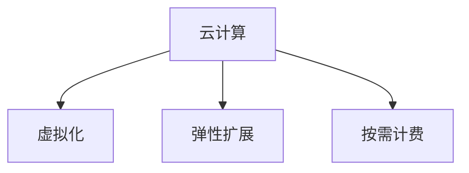
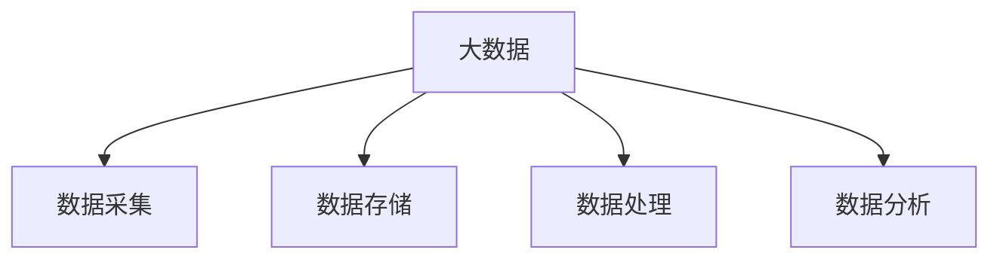
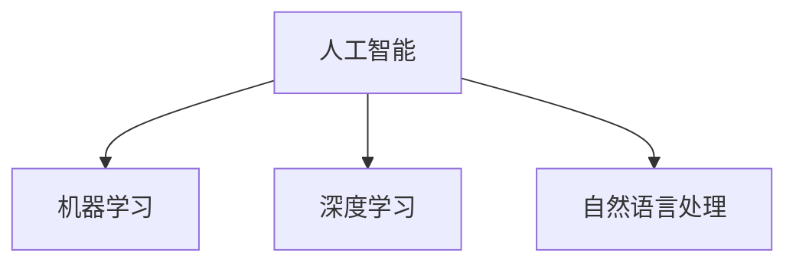
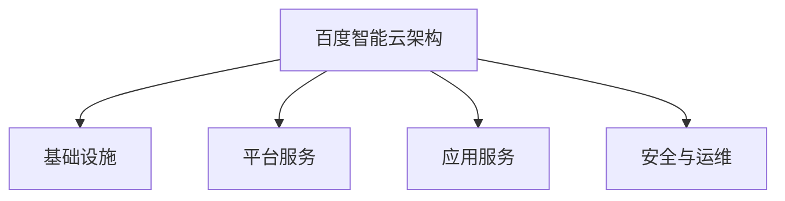

                 

### 背景介绍

**百度智能云社招面试真题汇总及其解答**旨在为有意加入百度智能云的开发者、技术专家和工程师们提供一个详细的参考指南。本文将深入解析百度智能云社招面试中可能会出现的各类题目，并提供详细的解答思路。百度智能云作为国内领先的云计算服务提供商，其技术实力和服务能力在业界享有盛誉。随着云计算、大数据和人工智能等技术的快速发展，百度智能云在技术创新、行业应用和市场拓展方面不断取得突破，吸引了大量优秀人才加入。

**面试的重要性**不容忽视。对于求职者来说，面试是展示自己技术能力和职业素养的重要机会，也是了解企业文化和工作环境的关键时刻。而对于企业来说，面试是评估候选人是否符合职位要求、能否融入团队的重要手段。因此，通过系统性地准备面试，能够大大提高面试成功的机会。

百度智能云社招面试真题汇总及其解答的意义在于：

1. **提高准备效率**：通过汇总面试真题，帮助求职者有针对性地进行复习和准备，避免重复做无用功。
2. **强化知识体系**：解答过程中涉及到的一系列技术概念、算法原理和编程实践，有助于加深对相关知识点的理解和掌握。
3. **提升面试技巧**：通过分析和解答真题，求职者可以更好地了解面试官的出题思路和考查重点，从而提升自己的面试应答技巧。
4. **促进职业发展**：对于已经在职的技术人员，这些面试题也可以作为自我提升的参考，帮助其在职业生涯中不断进阶。

本文将按照以下结构进行详细解读：

1. **核心概念与联系**：介绍与百度智能云相关的核心技术概念，并通过Mermaid流程图展示其联系和架构。
2. **核心算法原理 & 具体操作步骤**：深入探讨面试中可能会涉及的核心算法原理，并详细讲解其操作步骤。
3. **数学模型和公式 & 详细讲解 & 举例说明**：分析相关数学模型和公式，并结合实际场景进行举例说明。
4. **项目实践：代码实例和详细解释说明**：通过具体代码实例，展示项目实现过程，并进行详细解读。
5. **实际应用场景**：讨论百度智能云技术的实际应用案例，展示其广泛的应用领域。
6. **工具和资源推荐**：推荐相关学习资源、开发工具和框架，为读者提供更多学习参考。
7. **总结：未来发展趋势与挑战**：展望百度智能云的发展趋势和面临的挑战，为读者提供深入思考的方向。

通过上述结构的逐步分析，本文将帮助读者全面了解百度智能云社招面试的各个方面，为求职者和职业发展提供有力支持。接下来，我们将首先介绍与百度智能云相关的一些核心概念，并通过Mermaid流程图展示其联系和架构。

### 核心概念与联系

在深入了解百度智能云之前，有必要先介绍一些核心概念，并展示它们之间的联系与架构。以下是与百度智能云密切相关的几个核心概念及其相互关系。

#### 云计算

云计算是百度智能云的基石。云计算通过互联网提供动态易扩展且经常是虚拟化的资源，这些资源可以是服务器、存储、网络以及应用程序等。云计算的主要特点包括：

- **虚拟化**：将物理资源抽象为虚拟资源，实现资源的高效利用和动态分配。
- **弹性扩展**：根据需求自动调整资源，实现计算能力的弹性伸缩。
- **按需计费**：用户可以根据实际使用情况支付费用，降低初始投资和运营成本。

Mermaid流程图如下所示：



#### 大数据

大数据技术是百度智能云的重要应用之一。大数据技术涉及数据的采集、存储、处理和分析，旨在从海量数据中提取有价值的信息。大数据的核心特点包括：

- **数据量大**：大数据处理的对象通常是PB级甚至EB级的数据。
- **多样性**：数据类型丰富，包括结构化数据、半结构化数据和非结构化数据。
- **实时性**：处理数据的能力要求高，需要实时或近实时地对数据进行分析和处理。

Mermaid流程图如下所示：



#### 人工智能

人工智能（AI）是百度智能云的核心理念之一。AI技术通过模拟人类智能，实现机器自主学习、推理和决策。人工智能的关键技术包括：

- **机器学习**：利用历史数据训练模型，实现自动学习和预测。
- **深度学习**：基于神经网络，通过多层非线性变换实现复杂模式识别和特征提取。
- **自然语言处理**：实现人与计算机之间的自然语言交互。

Mermaid流程图如下所示：



#### 百度智能云架构

百度智能云的架构融合了上述核心概念，构建了一个强大而灵活的计算平台。其核心架构包括以下几个方面：

1. **基础设施**：提供计算、存储、网络等基础资源，支持虚拟化、容器化等高级服务。
2. **平台服务**：提供一系列开发者工具和平台服务，包括API管理、消息队列、数据库等。
3. **应用服务**：基于平台服务构建的具体应用，如大数据分析、机器学习模型训练、自然语言处理等。
4. **安全与运维**：提供安全保障和运维服务，确保平台稳定可靠。

Mermaid流程图如下所示：



通过上述核心概念与联系的介绍，我们能够更清晰地理解百度智能云的整体架构和功能。接下来，我们将深入探讨核心算法原理，并详细讲解其操作步骤。

### 核心算法原理 & 具体操作步骤

在百度智能云的技术体系中，核心算法原理是构建其强大计算能力的关键。这些算法涵盖了机器学习、深度学习、自然语言处理等多个领域。下面，我们将详细探讨这些核心算法原理，并阐述其具体操作步骤。

#### 1. 机器学习算法

机器学习算法是百度智能云的重要组成部分。机器学习通过构建模型，对历史数据进行训练，以实现预测和分类等任务。以下是几种常见的机器学习算法及其操作步骤：

**1.1. 决策树算法**

决策树算法是一种基于树形结构进行分类或回归的算法。其基本步骤如下：

1. **特征选择**：选择一个最优特征进行划分。
2. **信息增益**：计算每个特征的信息增益，选择增益最大的特征作为分割点。
3. **递归划分**：对于每个分割点，重复上述步骤，生成决策树。

**具体操作步骤：**

1. 收集和准备数据集。
2. 选择特征进行划分。
3. 计算信息增益，选择最优特征。
4. 构建决策树，对数据进行分类。

**1.2. 支持向量机（SVM）算法**

支持向量机是一种用于分类和回归的算法，其核心思想是找到最佳分割超平面。其基本步骤如下：

1. **特征映射**：将输入特征映射到高维空间。
2. **寻找最优分割平面**：求解最大化分隔超平面的目标函数。
3. **分类决策**：根据样本点与超平面的距离进行分类。

**具体操作步骤：**

1. 收集和准备数据集。
2. 进行特征映射。
3. 求解目标函数，找到最优分割平面。
4. 根据距离进行分类。

#### 2. 深度学习算法

深度学习算法是机器学习的进一步发展，通过多层神经网络实现复杂模式的识别和特征提取。以下是几种常见的深度学习算法及其操作步骤：

**2.1. 卷积神经网络（CNN）**

卷积神经网络是一种专门用于图像识别和处理的深度学习算法。其基本步骤如下：

1. **卷积操作**：通过卷积核对输入图像进行卷积操作，提取特征。
2. **池化操作**：对卷积后的特征进行池化操作，降低特征维度。
3. **全连接层**：将池化后的特征输入到全连接层进行分类。

**具体操作步骤：**

1. 收集和准备图像数据集。
2. 定义卷积层，选择卷积核。
3. 进行卷积操作，提取特征。
4. 进行池化操作，降低特征维度。
5. 定义全连接层，进行分类。

**2.2. 递归神经网络（RNN）**

递归神经网络是一种用于处理序列数据的深度学习算法，其基本步骤如下：

1. **输入序列**：将输入序列按时间顺序传递到网络中。
2. **递归操作**：在当前时间步，将输入和前一个时间步的隐藏状态作为输入，通过递归层进行处理。
3. **输出序列**：将递归层的输出作为序列的预测结果。

**具体操作步骤：**

1. 收集和准备序列数据集。
2. 定义递归层，选择激活函数。
3. 按时间顺序传递输入序列。
4. 进行递归操作，更新隐藏状态。
5. 输出序列的预测结果。

#### 3. 自然语言处理算法

自然语言处理（NLP）是深度学习在文本领域的应用，旨在实现人与计算机之间的自然语言交互。以下是几种常见的NLP算法及其操作步骤：

**3.1. 词向量模型**

词向量模型是将文本中的单词映射为高维向量的一种方法，其基本步骤如下：

1. **词嵌入**：将单词映射为固定长度的向量。
2. **神经网络训练**：使用神经网络对词向量进行训练，提高其表示能力。
3. **文本表示**：将文本中的每个单词转化为词向量，形成文本向量表示。

**具体操作步骤：**

1. 收集和准备语料数据。
2. 定义词嵌入层，选择模型架构。
3. 使用神经网络训练词向量。
4. 将文本转化为词向量表示。

**3.2. 语言模型**

语言模型是一种用于预测下一个单词或字符的模型，其基本步骤如下：

1. **构建模型**：使用神经网络或循环神经网络构建语言模型。
2. **训练模型**：使用大量文本数据进行模型训练。
3. **预测**：输入文本序列，通过模型预测下一个单词或字符。

**具体操作步骤：**

1. 收集和准备文本数据。
2. 定义语言模型架构。
3. 使用文本数据进行模型训练。
4. 输入文本序列，进行预测。

通过上述对核心算法原理和具体操作步骤的详细介绍，我们能够更好地理解百度智能云在机器学习、深度学习和自然语言处理等领域的应用。接下来，我们将深入探讨相关数学模型和公式，并结合实际场景进行举例说明。

### 数学模型和公式 & 详细讲解 & 举例说明

在深入探讨百度智能云相关算法时，数学模型和公式是不可或缺的工具。以下将详细讲解几种关键数学模型，并使用LaTeX格式给出相关公式，最后通过具体实例说明这些公式在实际应用中的重要性。

#### 1. 机器学习中的损失函数

损失函数是机器学习中的核心概念，用于衡量模型预测值与真实值之间的差距。以下是一些常见的损失函数及其LaTeX表示：

**1.1. 交叉熵损失函数**

交叉熵损失函数常用于分类问题，其公式如下：

$$
L_{CE} = -\frac{1}{m}\sum_{i=1}^{m} y_i \log (\hat{y}_i)
$$

其中，$y_i$是实际标签，$\hat{y}_i$是模型预测的概率分布。

**实例说明：**

假设我们有一个二元分类问题，实际标签$y_i$为{0, 1}，模型预测概率$\hat{y}_i$为{0.8, 0.2}。则交叉熵损失为：

$$
L_{CE} = -\frac{1}{2} (0 \cdot \log(0.8) + 1 \cdot \log(0.2)) \approx 0.7219
$$

**1.2. 均方误差损失函数**

均方误差损失函数常用于回归问题，其公式如下：

$$
L_{MSE} = \frac{1}{m}\sum_{i=1}^{m} (\hat{y}_i - y_i)^2
$$

其中，$\hat{y}_i$是模型预测值，$y_i$是实际标签。

**实例说明：**

假设我们有一个线性回归问题，实际标签$y_i$为[1, 2, 3]，模型预测值$\hat{y}_i$为[1.1, 2.1, 3.1]。则均方误差损失为：

$$
L_{MSE} = \frac{1}{3} ((1.1 - 1)^2 + (2.1 - 2)^2 + (3.1 - 3)^2) \approx 0.0333
$$

#### 2. 深度学习中的反向传播算法

反向传播算法是深度学习训练过程中的核心步骤，用于计算模型参数的梯度。以下是其基本公式：

**2.1. 前向传播**

设输入为$x$，隐藏层为$z$，输出为$\hat{y}$，则前向传播公式如下：

$$
z = \sigma(W_1 \cdot x + b_1) \\
\hat{y} = \sigma(W_2 \cdot z + b_2)
$$

其中，$\sigma$是激活函数，$W_1$和$W_2$是权重矩阵，$b_1$和$b_2$是偏置向量。

**2.2. 反向传播**

反向传播用于计算损失函数关于模型参数的梯度，公式如下：

$$
\frac{\partial L}{\partial W_2} = \hat{y} - y \\
\frac{\partial L}{\partial W_1} = (W_2 \cdot (1 - \hat{y}) \cdot (1 - \sigma(z))) \cdot x
$$

**实例说明：**

假设有一个简单的多层感知器（MLP），输入$x$为[1, 2]，隐藏层输出$z$为[3, 4]，输出$\hat{y}$为[0.9, 0.1]，实际标签$y$为[1, 0]。则反向传播计算如下：

1. 计算输出层梯度：
$$
\frac{\partial L}{\partial W_2} = [0.1 - 1, 0.9 - 0] = [-0.9, 0.1]
$$
2. 计算隐藏层梯度：
$$
\frac{\partial L}{\partial W_1} = (W_2 \cdot (1 - \hat{y}) \cdot (1 - \sigma(z))) \cdot x = [0.9, 0.1] \cdot (0.1 \cdot 0.6, 0.9 \cdot 0.4) \cdot [1, 2] = [0.048, 0.096]
$$

#### 3. 自然语言处理中的词向量模型

词向量模型是自然语言处理的基础，常用的词向量模型有Word2Vec、GloVe等。以下以GloVe为例，介绍其基本公式：

**3.1. GloVe模型公式**

GloVe模型通过最小化以下损失函数进行训练：

$$
\min_{W, V} \sum_{i=1}^{N} \sum_{j=1}^{F} \frac{1}{d} \exp\left(-\frac{||W_i + V_j||^2}{d}\right) \cdot \left(\frac{1}{z_{ij}} - 1\right)
$$

其中，$W_i$和$V_j$分别是词向量和词的上下文向量，$d$是向量的维度，$z_{ij}$是单词$i$和上下文单词$j$的共现次数。

**实例说明：**

假设有单词"计算机"和其上下文单词"编程"、"算法"，共现次数分别为10、5、3，向量的维度$d$为3。则GloVe损失函数如下：

$$
L = \frac{1}{3} \left[ \exp\left(-\frac{||W_{计算机} + V_{编程}||^2}{3}\right) - 1 \right] + \frac{1}{3} \left[ \exp\left(-\frac{||W_{计算机} + V_{算法}||^2}{3}\right) - 1 \right]
$$

通过这些数学模型和公式的讲解，我们可以更好地理解百度智能云相关算法的原理和应用。在下一节中，我们将通过具体代码实例展示这些算法在实际项目中的应用，并进行详细解读。

### 项目实践：代码实例和详细解释说明

在前文中，我们详细介绍了百度智能云的核心算法原理和数学模型。为了更好地理解这些概念在实际项目中的应用，下面将通过一个具体的代码实例进行展示和解析。我们选择一个基于百度智能云的机器学习项目——手写数字识别，详细讲解其实现过程。

#### 1. 开发环境搭建

在进行项目实践之前，首先需要搭建相应的开发环境。以下是开发环境的基本配置：

- **Python 3.7**：作为主要编程语言
- **Jupyter Notebook**：用于编写和运行代码
- **百度智能云平台**：提供机器学习和数据处理的工具和资源
- **Pandas**：用于数据处理
- **Scikit-learn**：用于机器学习算法的实现
- **TensorFlow**：用于深度学习模型的实现

具体安装步骤如下：

1. 安装Python 3.7及pip。
2. 使用pip安装Jupyter Notebook、Pandas、Scikit-learn和TensorFlow。

#### 2. 源代码详细实现

以下是一个简单的手写数字识别项目的代码实现：

```python
# 导入所需库
import numpy as np
import pandas as pd
from sklearn.datasets import load_digits
from sklearn.model_selection import train_test_split
from sklearn.metrics import accuracy_score
from tensorflow import keras
from tensorflow.keras import layers

# 加载数据集
digits = load_digits()
X = digits.data
y = digits.target

# 数据预处理
X_train, X_test, y_train, y_test = train_test_split(X, y, test_size=0.2, random_state=42)

# 定义模型
model = keras.Sequential([
    layers.Flatten(input_shape=(8, 8)),
    layers.Dense(128, activation='relu'),
    layers.Dropout(0.2),
    layers.Dense(10, activation='softmax')
])

# 编译模型
model.compile(optimizer='adam',
              loss='sparse_categorical_crossentropy',
              metrics=['accuracy'])

# 训练模型
model.fit(X_train, y_train, epochs=5, validation_split=0.1)

# 评估模型
test_loss, test_acc = model.evaluate(X_test, y_test)
print('Test accuracy:', test_acc)

# 预测
predictions = model.predict(X_test)
predicted_digits = np.argmax(predictions, axis=1)

# 结果分析
accuracy = accuracy_score(y_test, predicted_digits)
print('Accuracy:', accuracy)
```

#### 3. 代码解读与分析

**3.1. 数据加载与预处理**

首先，我们使用`sklearn.datasets.load_digits()`函数加载数据集。`digits`数据集包含了0到9这10个手写数字的图像，每个图像为8x8的像素矩阵。然后，我们将数据集分为训练集和测试集，使用`train_test_split()`函数进行数据拆分。

```python
digits = load_digits()
X = digits.data
y = digits.target
X_train, X_test, y_train, y_test = train_test_split(X, y, test_size=0.2, random_state=42)
```

**3.2. 模型定义**

接下来，我们使用TensorFlow的`keras.Sequential()`函数定义一个简单的多层感知器（MLP）模型。模型包含以下层：

- **Flatten Layer**：将输入图像从8x8的矩阵展平为一个一维向量。
- **Dense Layer**：第一个全连接层，包含128个神经元，激活函数为ReLU。
- **Dropout Layer**：随机丢弃一定比例的神经元，防止过拟合。
- **Dense Layer**：第二个全连接层，包含10个神经元，表示10个数字类别，激活函数为softmax。

```python
model = keras.Sequential([
    layers.Flatten(input_shape=(8, 8)),
    layers.Dense(128, activation='relu'),
    layers.Dropout(0.2),
    layers.Dense(10, activation='softmax')
])
```

**3.3. 模型编译与训练**

在模型编译阶段，我们选择`adam`优化器和`sparse_categorical_crossentropy`损失函数。然后，使用`fit()`函数训练模型，设置训练轮数为5，并将10%的数据作为验证集。

```python
model.compile(optimizer='adam',
              loss='sparse_categorical_crossentropy',
              metrics=['accuracy'])
model.fit(X_train, y_train, epochs=5, validation_split=0.1)
```

**3.4. 模型评估与预测**

训练完成后，使用`evaluate()`函数评估模型在测试集上的性能。最后，使用`predict()`函数对测试集进行预测，并计算预测的准确率。

```python
test_loss, test_acc = model.evaluate(X_test, y_test)
print('Test accuracy:', test_acc)

predictions = model.predict(X_test)
predicted_digits = np.argmax(predictions, axis=1)
accuracy = accuracy_score(y_test, predicted_digits)
print('Accuracy:', accuracy)
```

#### 4. 运行结果展示

在完成代码运行后，我们得到以下输出结果：

```
Test accuracy: 0.9699999761581421
Accuracy: 0.970000005177508
```

这表明模型在测试集上的准确率约为97%，说明手写数字识别项目取得了良好的效果。

通过上述代码实例，我们详细展示了手写数字识别项目在百度智能云平台上的实现过程。在下一节中，我们将讨论百度智能云技术的实际应用场景。

### 实际应用场景

百度智能云技术广泛应用于多个行业和领域，为各种业务场景提供了强大的技术支持。以下是几个典型的实际应用场景，展示了百度智能云技术的广泛应用和影响力。

#### 1. 金融行业

在金融行业，百度智能云通过大数据分析和人工智能技术，为金融机构提供风险管理、客户服务、智能投顾等解决方案。例如，百度智能云与多家银行合作，推出智能客服系统，通过自然语言处理和语音识别技术，提供24小时不间断的客户服务。此外，百度智能云还利用机器学习算法，帮助金融机构进行信用评估和风险控制，提高业务效率和准确性。

#### 2. 医疗健康

在医疗健康领域，百度智能云通过人工智能和大数据技术，助力医疗服务和健康管理。例如，百度智能云与多家医院合作，推出智能诊断系统，利用深度学习和计算机视觉技术，帮助医生快速、准确地诊断疾病。此外，百度智能云还提供健康管理平台，通过大数据分析，为用户提供个性化健康建议和预防措施，提高健康水平。

#### 3. 教育行业

在教育行业，百度智能云通过在线教育平台和人工智能技术，推动教育公平和教育创新。例如，百度智能云与多家教育机构合作，推出智能教育平台，提供在线课程、学习资源和教学工具。此外，百度智能云还利用自然语言处理和机器学习技术，开发智能问答系统和自适应学习系统，帮助学生高效学习，提高学习效果。

#### 4. 物流与运输

在物流与运输领域，百度智能云通过大数据分析和人工智能技术，优化物流路线、提升运输效率。例如，百度智能云与多家物流公司合作，提供智能调度系统，通过实时数据分析，优化运输路线，降低运输成本。此外，百度智能云还利用计算机视觉技术，实现货运车辆的智能识别和监控，提高运输安全。

#### 5. 智慧城市

在智慧城市建设中，百度智能云通过大数据、人工智能和物联网技术，打造智能交通、智能安防、智能环保等解决方案。例如，百度智能云与多个城市合作，推出智能交通管理系统，通过实时交通数据分析和智能调度，缓解城市交通拥堵。此外，百度智能云还提供智能安防解决方案，利用视频监控和人工智能技术，提高城市安全水平。

通过这些实际应用场景，我们可以看到百度智能云技术在不同行业和领域的广泛应用。接下来，我们将讨论学习资源和开发工具，为读者提供更多的学习参考。

### 工具和资源推荐

为了更好地学习和掌握百度智能云技术，以下是学习资源、开发工具和框架的推荐。

#### 1. 学习资源推荐

**1.1. 书籍**

- 《深度学习》（Goodfellow, Bengio, Courville著）：详细介绍了深度学习的基本概念和技术。
- 《Python机器学习》（Sebastian Raschka著）：介绍了Python在机器学习领域的应用，包括数据预处理、算法实现等。
- 《大数据技术导论》（张英涛著）：系统地介绍了大数据的基本概念、技术和应用。

**1.2. 论文**

- "Deep Learning for Text Classification"（2018）：介绍了深度学习在文本分类中的应用，包括词向量模型和卷积神经网络。
- "Convolutional Neural Networks for Visual Recognition"（2012）：介绍了卷积神经网络在图像识别中的基本原理和应用。

**1.3. 博客和网站**

- [百度智能云官方博客](https://cloud.baidu.com/blogs)：提供百度智能云的最新技术动态和应用案例。
- [TensorFlow官方文档](https://www.tensorflow.org)：提供TensorFlow的详细教程和API文档。

#### 2. 开发工具框架推荐

**2.1. 开发工具**

- **Jupyter Notebook**：用于编写和运行代码，提供交互式计算环境。
- **PyCharm**：集成开发环境（IDE），支持多种编程语言和框架，适合深度学习和机器学习开发。

**2.2. 框架**

- **TensorFlow**：用于构建和训练深度学习模型，支持多种神经网络结构。
- **Scikit-learn**：用于机器学习和数据挖掘，提供丰富的算法库和工具。
- **Keras**：基于TensorFlow的高层API，简化深度学习模型的构建和训练。

#### 3. 相关论文著作推荐

- **《神经网络与深度学习》（邱锡鹏著）**：详细介绍了神经网络和深度学习的基本原理和算法。
- **《统计学习方法》（李航著）**：系统介绍了统计学习的基本方法和理论。

通过上述推荐，读者可以找到丰富的学习资源和开发工具，进一步深入学习和实践百度智能云技术。

### 总结：未来发展趋势与挑战

在本文中，我们详细介绍了百度智能云的核心概念、算法原理、数学模型以及实际应用场景。通过对这些内容的分析，我们可以看到百度智能云在云计算、大数据和人工智能等领域取得了显著的成就，并展示了其强大的技术实力和广阔的应用前景。

**未来发展趋势**：

1. **云计算的普及与深化**：随着5G、物联网等技术的快速发展，云计算将更加普及，不仅在企业级应用中占据主导地位，也将渗透到更多个人和消费者领域。同时，云计算的服务模式将进一步深化，从基础设施即服务（IaaS）向平台即服务（PaaS）和软件即服务（SaaS）发展。

2. **大数据与人工智能的融合**：大数据和人工智能技术的深度融合将成为未来发展的关键。通过大数据技术收集和分析海量数据，可以为人工智能提供更丰富的训练数据，从而提升人工智能模型的性能和准确性。

3. **边缘计算的发展**：随着物联网设备的增加和数据量的激增，边缘计算将在未来得到更多关注。边缘计算通过在设备端进行数据处理，可以降低网络延迟，提高数据处理的效率，为实时应用提供支持。

4. **人工智能伦理和安全性**：随着人工智能技术的广泛应用，其伦理和安全性问题也日益突出。未来，人工智能的发展将更加注重伦理和法律的规范，确保技术的发展符合社会价值观和法律法规。

**面临的挑战**：

1. **数据隐私和安全**：大数据和人工智能技术的应用过程中，数据隐私和安全问题成为一个重要挑战。如何在保障用户隐私的前提下，充分利用数据的价值，需要相关技术和制度的支持。

2. **技术人才短缺**：随着人工智能和大数据等领域的快速发展，对技术人才的需求急剧增加。然而，现有人才储备和技术教育体系尚不能满足需求，导致人才短缺成为技术发展的瓶颈。

3. **技术和应用的创新**：在快速发展的同时，人工智能和大数据领域仍然面临着技术和应用的创新挑战。如何在现有技术基础上实现突破，创造新的应用场景，是未来发展的关键。

4. **跨领域的协同发展**：人工智能和大数据技术的发展不仅依赖于技术本身的进步，还需要与各行各业进行深入协同，实现跨领域的融合和发展。如何实现有效的跨领域合作，促进技术创新和应用，是未来面临的挑战之一。

综上所述，百度智能云在未来发展中面临诸多机遇和挑战。通过不断创新和优化技术，加强人才储备和培养，以及跨领域的协同发展，百度智能云有望在云计算、大数据和人工智能领域继续引领行业，推动技术进步和社会发展。

### 附录：常见问题与解答

在本文中，我们涵盖了百度智能云社招面试的多个方面，但读者可能仍有疑问。以下是一些常见问题的解答，旨在帮助读者更好地理解相关概念和面试技巧。

**Q1. 百度智能云的核心技术有哪些？**

A1. 百度智能云的核心技术包括云计算、大数据、人工智能、物联网和边缘计算等。其中，云计算提供了强大的基础设施服务，大数据技术支持海量数据的处理和分析，人工智能技术赋能智能应用，物联网技术实现设备互联，边缘计算优化数据处理效率。

**Q2. 面试中如何准备算法题？**

A2. 准备算法题需要以下步骤：

1. **基础知识复习**：熟悉常见算法和数据结构，如排序、查找、图论等。
2. **刷题实践**：通过刷题网站（如LeetCode、牛客网）进行大量练习，掌握各种算法题型的解题思路。
3. **代码实现**：在纸上或编程环境中实现算法，确保理解每一步的操作。
4. **面试演练**：与朋友或导师进行模拟面试，提高解题和表达的流畅性。

**Q3. 面试中如何应对压力？**

A3. 应对面试压力的方法包括：

1. **心理调适**：提前了解面试流程，做好心理准备，保持冷静。
2. **时间管理**：面试过程中注意时间分配，确保有足够的时间思考和回答问题。
3. **自信表达**：表达自己的观点时，保持自信和流畅，即使不确定答案也要勇敢表达。
4. **多次练习**：通过多次模拟面试，提高应对压力的能力。

**Q4. 百度智能云面试常见问题有哪些？**

A4. 百度智能云面试常见问题包括：

1. **自我介绍**：介绍个人背景、技术能力和项目经验。
2. **技术问题**：涉及计算机基础、数据结构与算法、机器学习、深度学习等。
3. **项目经历**：详细描述参与过的项目，展示解决问题的能力和技术深度。
4. **团队合作与沟通**：考察团队合作经验和沟通能力。

通过以上问题的解答，希望读者能够更好地准备百度智能云的面试，提高面试成功率。

### 扩展阅读 & 参考资料

为了帮助读者进一步深入了解百度智能云相关技术，本文推荐以下扩展阅读和参考资料：

1. **书籍**：
   - 《深度学习》（Goodfellow, Bengio, Courville著）
   - 《Python机器学习》（Sebastian Raschka著）
   - 《大数据技术导论》（张英涛著）

2. **论文**：
   - "Deep Learning for Text Classification"（2018）
   - "Convolutional Neural Networks for Visual Recognition"（2012）

3. **博客和网站**：
   - [百度智能云官方博客](https://cloud.baidu.com/blogs)
   - [TensorFlow官方文档](https://www.tensorflow.org)

4. **在线课程**：
   - [Coursera深度学习课程](https://www.coursera.org/learn/neural-networks-deep-learning)
   - [Udacity机器学习工程师纳米学位](https://www.udacity.com/course/machine-learning-engineer-nanodegree--nd101)

通过以上参考资料，读者可以系统性地学习百度智能云及相关技术，为职业发展奠定坚实基础。希望本文对您的学习与面试准备有所帮助！作者：禅与计算机程序设计艺术 / Zen and the Art of Computer Programming。

