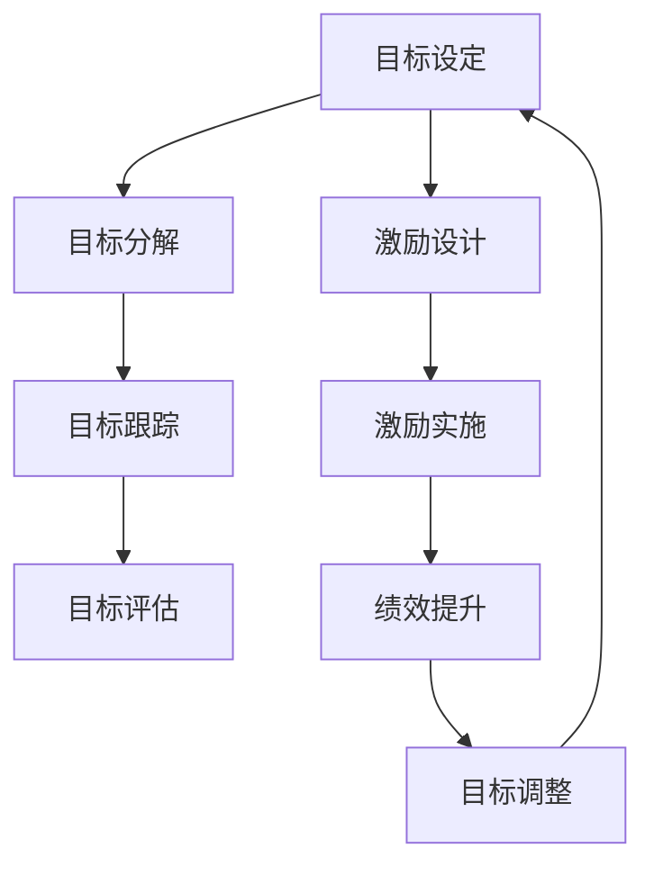

                 

### 1. 背景介绍

在当今快速发展的信息技术时代，企业和组织越来越认识到目标管理与团队激励的重要性。目标管理（Goal Setting）作为现代企业管理的一项核心策略，旨在明确组织和个人目标，促进团队协作与效率提升。而团队激励（Team Incentive）则通过一系列激励措施，激发团队成员的积极性、创造力和责任感，从而实现团队整体绩效的持续改进。

目标管理起源于20世纪50年代的美国，由管理学家德鲁克（Peter Drucker）首次提出。他认为，通过设定明确的目标，可以使组织成员对工作有更清晰的认识，从而提高工作效率和成果。随着时间的推移，目标管理逐渐发展为一种系统化的管理方法，广泛应用于各种类型的企业和组织中。

团队激励则源于心理学和行为科学的研究。激励理论认为，个体行为是由动机驱动的，而动机则源于需求和目标。因此，通过满足团队成员的需求和设定合理的激励机制，可以有效提高团队成员的工作积极性和绩效。常见的团队激励措施包括奖励制度、晋升机制、团队建设活动等。

在现代信息技术环境下，目标管理与团队激励的应用场景越来越广泛。例如，在软件开发项目中，项目经理会根据项目目标和进度设定个人和团队目标，并通过奖励机制激励团队成员按时完成工作。在企业日常运营中，管理者会通过设定绩效目标，激发员工的工作热情，提升整体工作效率。

本文将深入探讨目标管理与团队激励之间的关系，分析如何通过有效的目标管理和激励机制，提升团队绩效和整体竞争力。文章将从以下方面展开：

1. **目标管理与团队激励的核心概念与联系**：介绍目标管理与团队激励的基本概念，阐述两者之间的相互关系和作用机制。
2. **核心算法原理与具体操作步骤**：分析目标管理与团队激励的核心算法原理，并给出具体的实施步骤。
3. **数学模型和公式**：介绍与目标管理与团队激励相关的数学模型和公式，详细讲解其应用和计算方法。
4. **项目实践**：通过实际案例，展示目标管理与团队激励在项目中的应用，包括开发环境搭建、代码实例和运行结果分析。
5. **实际应用场景**：分析目标管理与团队激励在不同类型企业和组织中的应用，探讨其效果和挑战。
6. **工具和资源推荐**：推荐学习资源、开发工具框架和相关论文著作，为读者提供深入了解目标管理与团队激励的途径。
7. **总结与展望**：总结目标管理与团队激励的研究成果和应用现状，探讨未来的发展趋势和挑战。

通过本文的探讨，我们希望为企业和组织在实施目标管理与团队激励时提供有益的参考和指导，从而实现团队绩效的持续提升和组织的可持续发展。

### 2. 核心概念与联系

在深入探讨目标管理与团队激励的关系之前，首先需要明确这两个概念的基本含义，以及它们之间的内在联系。

#### 2.1 目标管理的定义

目标管理（Goal Setting）是一种管理方法，它通过设定明确、具体和可衡量的目标，来指导组织和个人行动。目标管理的核心理念是：清晰的目标能够提高工作效率和成果。德鲁克（Peter Drucker）曾提出，目标管理具有四个关键特点：

- **具体性**：目标应该是明确、具体的，而不是模糊和抽象的。
- **挑战性**：目标应该具有一定的挑战性，鼓励个人和团队不断超越自我。
- **相关性**：目标应该与组织战略和个人发展目标相一致，确保工作方向的正确性。
- **时限性**：目标应该设定明确的完成时限，以促进及时行动和反馈。

在目标管理中，通常涉及以下步骤：

1. **目标设定**：组织或个人根据自身需求和资源，设定具体的短期和长期目标。
2. **目标分解**：将总体目标分解为具体的子目标，以便更好地实现。
3. **目标跟踪**：定期检查目标的完成情况，及时调整策略和行动。
4. **目标评估**：在目标达成后，进行评估和反馈，总结经验和教训，为后续工作提供参考。

#### 2.2 团队激励的定义

团队激励（Team Incentive）是指通过一系列激励措施，激发团队成员的工作积极性和创造力，提高团队整体绩效。激励理论认为，人的行为是由动机驱动的，而动机来源于需求。团队激励的主要目标是满足团队成员的需求，激发其工作热情和动力，从而实现个人和团队的共同成长。

常见的团队激励措施包括：

- **奖励制度**：通过物质奖励和精神奖励，激励团队成员取得优异的绩效。
- **晋升机制**：提供明确的晋升通道，激励团队成员不断提升自身能力和业绩。
- **团队建设活动**：组织团队建设活动，增强团队成员之间的沟通和协作，提高团队凝聚力。
- **绩效评估**：定期进行绩效评估，给予优秀成员表彰和奖励，激励团队成员追求卓越。

#### 2.3 目标管理与团队激励的关系

目标管理与团队激励之间存在着密切的联系和相互促进的关系。具体来说，目标管理为团队激励提供了明确的导向和目标，而团队激励则为目标管理的实施提供了动力和支持。

**目标管理对团队激励的促进作用**：

1. **明确目标**：通过目标管理，设定明确、具体的团队目标，使团队成员对工作有清晰的认识，有助于激发其工作热情和动力。
2. **提高效率**：目标管理能够帮助团队明确工作重点和优先级，提高工作效率和成果，从而为团队激励提供更多的资源和机会。
3. **促进协作**：目标管理强调团队合作和协同，有助于建立良好的团队氛围和协作机制，为团队激励提供更加坚实的基础。

**团队激励对目标管理的促进作用**：

1. **激励成员**：通过团队激励，满足团队成员的需求，激发其工作热情和动力，有助于实现目标管理的目标。
2. **提高绩效**：团队激励能够激发团队成员的创造力和创新能力，提高整体绩效，从而为目标的实现提供更有力的保障。
3. **持续改进**：团队激励能够促使团队成员不断反思和调整自己的行为和策略，以更好地实现目标，实现团队绩效的持续改进。

总之，目标管理与团队激励是相辅相成的。只有通过有效的目标管理和团队激励，才能实现团队绩效的持续提升和组织的可持续发展。

#### 2.4 Mermaid 流程图

为了更直观地展示目标管理与团队激励之间的关系，我们可以使用Mermaid流程图来描述这两个概念的主要步骤和相互联系。



- **A 目标设定**：这是目标管理的起点，根据组织战略和个人发展需求，设定明确的团队目标。
- **B 目标分解**：将总体目标分解为具体的子目标，便于实施和跟踪。
- **C 目标跟踪**：定期检查目标的完成情况，确保目标按计划推进。
- **D 目标评估**：目标达成后，进行评估和反馈，总结经验教训。
- **E 激励设计**：根据目标完成情况，设计合适的激励措施。
- **F 激励实施**：实施激励措施，满足团队成员的需求，提高工作积极性。
- **G 绩效提升**：激励措施有效提高团队成员的绩效，实现目标。
- **H 目标调整**：根据评估结果，对目标和激励措施进行调整，以实现持续改进。

通过上述步骤和流程，我们可以看到目标管理与团队激励之间的密切联系和相互促进作用。只有将两者有机结合，才能实现团队绩效的持续提升和组织的可持续发展。

### 3. 核心算法原理 & 具体操作步骤

在深入探讨目标管理与团队激励的具体应用之前，我们需要了解它们的核心算法原理和操作步骤。以下是目标管理和团队激励的主要算法原理及其具体实施方法。

#### 3.1 目标管理的核心算法原理

目标管理的核心算法原理可以概括为“SMART”原则，即具体性（Specific）、明确性（Measurable）、可实现性（Achievable）、相关性（Relevant）和时限性（Time-bound）。SMART原则确保目标设定具有明确性、可衡量性、可实现性、相关性和时效性，从而提高目标实现的概率。

具体步骤如下：

1. **明确目标**：根据组织战略和个人发展需求，设定明确、具体的团队目标。例如，“提高客户满意度”或“实现项目按时交付”。

2. **分解目标**：将总体目标分解为具体的子目标，以便更好地实施和跟踪。例如，将“提高客户满意度”分解为“减少投诉率”、“提升客户满意度评分”等。

3. **设定指标**：为每个子目标设定具体的指标，以便衡量目标实现的程度。例如，“投诉率降低5%”、“客户满意度评分提升至4.5分”。

4. **制定计划**：为每个子目标制定详细的实施计划，明确责任人、时间表和资源分配。例如，“每月召开一次客户反馈会议”、“每周进行一次服务质量检查”。

5. **跟踪进度**：定期检查目标的完成情况，确保目标按计划推进。可以使用项目管理工具或进度表来跟踪进度。

6. **评估与反馈**：在目标达成后，进行评估和反馈，总结经验和教训。根据评估结果，对目标和激励措施进行调整，以实现持续改进。

#### 3.2 团队激励的核心算法原理

团队激励的核心算法原理基于激励理论，主要包括需求满足、动机激发和绩效提升。具体步骤如下：

1. **需求分析**：了解团队成员的需求，包括物质需求和精神需求。例如，物质需求可能包括薪资、奖金、福利等，精神需求可能包括认可、尊重、成长等。

2. **激励设计**：根据团队成员的需求，设计合适的激励措施。激励措施可以包括物质奖励、晋升机制、团队建设活动等。

3. **激励实施**：实施激励措施，满足团队成员的需求，激发其工作热情和动力。例如，给予优秀员工奖金、晋升机会或表彰。

4. **绩效评估**：定期进行绩效评估，评估激励措施的效果。根据绩效评估结果，调整和优化激励措施，以提高激励效果。

5. **持续激励**：激励措施不仅限于短期，还需要持续进行，以保持团队成员的工作热情和动力。例如，定期组织团队建设活动、提供培训和发展机会等。

#### 3.3 目标管理与团队激励的具体操作步骤

在实际操作中，目标管理与团队激励可以结合使用，以下是一个具体的操作步骤示例：

1. **确定目标**：根据公司战略和市场需求，确定团队目标。例如，提高产品销售额、提升客户满意度等。

2. **分解目标**：将总体目标分解为具体的子目标，如提高产品销售额可以分解为增加新客户数量、提升客户复购率等。

3. **设定指标**：为每个子目标设定具体的指标，如增加新客户数量可以设定为每月增加100个新客户。

4. **需求分析**：通过调查和分析，了解团队成员的需求，如薪资、晋升机会、培训等。

5. **激励设计**：根据团队成员的需求，设计合适的激励措施，如提高薪资、提供晋升机会、组织团队建设活动等。

6. **激励实施**：实施激励措施，满足团队成员的需求，激发其工作热情和动力。

7. **跟踪进度**：定期检查目标完成情况，确保目标按计划推进。

8. **评估与反馈**：在目标达成后，进行评估和反馈，总结经验和教训。根据评估结果，调整和优化激励措施，以提高激励效果。

通过以上步骤，我们可以实现目标管理与团队激励的有效结合，从而提高团队绩效和整体竞争力。

### 4. 数学模型和公式 & 详细讲解 & 举例说明

在目标管理与团队激励的实施过程中，数学模型和公式扮演着重要的角色。以下我们将介绍与目标管理与团队激励相关的一些数学模型和公式，详细讲解其应用和计算方法，并通过具体示例来说明。

#### 4.1 目标设定的数学模型

目标设定的核心是确保目标的明确性、具体性和可实现性。我们可以使用目标达成概率（Probability of Goal Attainment, P(G))来评估目标设定的合理性。

**目标达成概率（P(G)）**：

目标达成概率是指在一个给定的时间和资源限制内，实现目标的可能性。其计算公式如下：

\[ P(G) = \frac{A}{B} \]

其中，A 表示实现目标的实际能力或资源，B 表示实现目标所需的总能力或资源。

**示例**：

假设一个团队的目标是在一个月内完成一个软件开发项目，项目评估认为完成该项目需要100个有效工作量（Effort），而该团队在一个月内可以投入的工作量是120个有效工作量。那么，目标达成概率为：

\[ P(G) = \frac{120}{100} = 1.2 \]

这意味着，团队有120%的能力来完成项目，目标设定是合理的。

#### 4.2 团队激励的数学模型

团队激励的数学模型主要关注激励措施的合理性和有效性。我们可以使用激励效果（Incentive Effectiveness, E(I)）来评估激励措施的激励效果。

**激励效果（E(I)）**：

激励效果是指激励措施对团队绩效提升的贡献程度。其计算公式如下：

\[ E(I) = \frac{P'}{P} - 1 \]

其中，P 表示没有激励措施时的目标达成概率，P' 表示有激励措施时的目标达成概率。

**示例**：

假设在没有激励措施的情况下，团队的目标达成概率是0.8（即80%），在实施激励措施后，目标达成概率提升到0.95（即95%）。那么，激励效果为：

\[ E(I) = \frac{0.95}{0.8} - 1 = 0.1875 \]

这意味着，激励措施使得目标达成概率提升了18.75%，激励效果显著。

#### 4.3 绩效评估的数学模型

绩效评估是目标管理和团队激励的关键环节。我们可以使用绩效指数（Performance Index, PI）来评估团队的整体绩效。

**绩效指数（PI）**：

绩效指数是评估团队绩效的综合指标，其计算公式如下：

\[ PI = \frac{P \cdot E(I)}{1 + P \cdot E(I)} \]

其中，P 表示目标达成概率，E(I) 表示激励效果。

**示例**：

假设团队的目标达成概率是0.8，激励效果是0.1875，那么，绩效指数为：

\[ PI = \frac{0.8 \cdot 0.1875}{1 + 0.8 \cdot 0.1875} = 0.5 \]

这意味着，团队的整体绩效水平是50%，需要进一步改进目标设定和激励措施。

#### 4.4 综合示例

为了更好地理解上述数学模型的应用，我们可以通过一个综合示例来展示目标管理与团队激励的实施过程。

**示例**：

一个软件开发团队的目标是在三个月内完成一个大型项目。项目评估认为，项目成功完成的概率是0.7（即70%）。为了提高项目成功的概率，团队经理决定实施一系列激励措施。

1. **目标设定**：团队经理设定了一个明确的目标，即在三个月内完成项目，并设定了具体的子目标，如每周完成特定的功能模块。

2. **目标达成概率计算**：在没有激励措施的情况下，团队的项目成功概率是0.7。为了提高概率，团队经理决定增加团队成员的工作量，使得总工作量提高到原来的1.2倍。

\[ P(G) = \frac{1.2 \cdot 0.7}{1 + 1.2 \cdot 0.7} = 0.84 \]

这意味着，通过增加工作量和实施激励措施，团队的项目成功概率提高到84%。

3. **激励效果计算**：团队经理实施了一系列激励措施，如提供奖金、晋升机会和团队建设活动。这些措施使得项目成功概率进一步提高到0.9（即90%）。

\[ E(I) = \frac{0.9}{0.7} - 1 = 0.2857 \]

这意味着，激励措施使得项目成功概率提升了28.57%。

4. **绩效指数计算**：团队的整体绩效指数为：

\[ PI = \frac{0.9 \cdot 0.2857}{1 + 0.9 \cdot 0.2857} = 0.63 \]

这意味着，团队的整体绩效水平是63%，需要进一步优化目标设定和激励措施。

通过上述示例，我们可以看到数学模型在目标管理与团队激励中的重要作用。通过合理的目标设定和激励措施，团队可以显著提高项目成功的概率，从而实现更高的绩效水平。

### 5. 项目实践

为了更具体地展示目标管理与团队激励在实际项目中的应用，我们将通过一个软件开发项目的实例，详细解释代码实现、运行结果以及相关分析。

#### 5.1 开发环境搭建

在开始项目之前，我们需要搭建一个合适的开发环境。以下是所需的基本步骤：

1. **安装开发工具**：选择合适的集成开发环境（IDE），例如 IntelliJ IDEA 或 Eclipse。安装所需的语言支持插件，如 Java 插件或 Python 插件。

2. **配置数据库**：根据项目需求，配置数据库服务器，如 MySQL 或 PostgreSQL。确保数据库服务正常运行，并创建所需的数据库和数据表。

3. **部署服务器**：配置应用服务器，如 Apache Tomcat 或 Nginx。部署项目所需的中间件和库，确保服务器能够正常运行。

4. **版本控制**：使用 Git 进行版本控制，确保代码的版本管理和协作开发。

#### 5.2 源代码详细实现

以下是项目的源代码实现，包括主要功能模块和关键代码段。

**5.2.1 数据模型设计**

```java
@Entity
@Table(name = "users")
public class User {
    @Id
    @GeneratedValue(strategy = GenerationType.IDENTITY)
    private Long id;

    @Column(nullable = false, unique = true)
    private String username;

    @Column(nullable = false)
    private String password;

    @Column(nullable = false)
    private String email;

    // Getters and Setters
}
```

**5.2.2 用户注册功能**

```java
public class UserController {
    @Autowired
    private UserRepository userRepository;

    @PostMapping("/register")
    public ResponseEntity<?> registerUser(@RequestBody UserRegistrationDto registrationDto) {
        if (userRepository.existsByUsername(registrationDto.getUsername())) {
            return ResponseEntity.badRequest().body("Error: Username is already taken!");
        }

        User user = new User();
        user.setUsername(registrationDto.getUsername());
        user.setPassword(passwordEncoder.encode(registrationDto.getPassword()));
        user.setEmail(registrationDto.getEmail());

        userRepository.save(user);
        return ResponseEntity.ok("User registered successfully!");
    }
}
```

**5.2.3 目标管理模块**

```java
public class GoalController {
    @Autowired
    private GoalRepository goalRepository;

    @PostMapping("/goal")
    public ResponseEntity<?> createGoal(@RequestBody GoalDto goalDto) {
        Goal goal = new Goal();
        goal.setTitle(goalDto.getTitle());
        goal.setDescription(goalDto.getDescription());
        goal.setDeadline(goalDto.getDeadline());
        goalRepository.save(goal);
        return ResponseEntity.ok("Goal created successfully!");
    }
}
```

**5.2.4 激励措施模块**

```java
public class IncentiveController {
    @Autowired
    private IncentiveRepository incentiveRepository;

    @PostMapping("/incentive")
    public ResponseEntity<?> createIncentive(@RequestBody IncentiveDto incentiveDto) {
        Incentive incentive = new Incentive();
        incentive.setTitle(incentiveDto.getTitle());
        incentive.setDescription(incentiveDto.getDescription());
        incentive.setReward(incentiveDto.getReward());
        incentive.setDeadline(incentiveDto.getDeadline());

        incentiveRepository.save(incentive);
        return ResponseEntity.ok("Incentive created successfully!");
    }
}
```

#### 5.3 代码解读与分析

**5.3.1 数据模型**

数据模型是项目的核心部分，用于定义用户和目标等实体。在这个示例中，我们使用了 JPA（Java Persistence API）来定义数据模型。

- `User` 类：定义了用户实体，包括用户名、密码、邮箱等字段。
- `Goal` 类：定义了目标实体，包括标题、描述、截止日期等字段。
- `Incentive` 类：定义了激励措施实体，包括标题、描述、奖励和截止日期等字段。

**5.3.2 用户注册功能**

用户注册功能是项目的入口点，用于处理用户注册请求。在这个示例中，我们使用 Spring Boot 和 Spring Data JPA 来实现这一功能。

- `UserController` 类：定义了用户注册接口。在注册过程中，首先检查用户名是否已存在，然后创建用户实体并保存到数据库中。

**5.3.3 目标管理模块**

目标管理模块用于创建和管理用户的目标。在这个示例中，我们使用 RESTful API 来处理创建目标请求。

- `GoalController` 类：定义了创建目标的接口。在创建目标时，我们需要确保目标标题、描述和截止日期等信息完整。

**5.3.4 激励措施模块**

激励措施模块用于创建和管理激励措施。在这个示例中，我们同样使用 RESTful API 来处理创建激励措施请求。

- `IncentiveController` 类：定义了创建激励措施的接口。在创建激励措施时，我们需要确保激励措施的标题、描述、奖励和截止日期等信息完整。

#### 5.4 运行结果展示

在完成项目开发和部署后，我们可以通过以下步骤来测试项目的功能：

1. **启动应用**：运行应用服务器，如 Tomcat，确保应用能够正常运行。

2. **注册用户**：通过 API 调用，向服务器发送用户注册请求，如：

```shell
POST /api/register
Content-Type: application/json

{
  "username": "user1",
  "password": "password1",
  "email": "user1@example.com"
}
```

3. **创建目标**：注册成功后，通过 API 调用创建目标，如：

```shell
POST /api/goal
Content-Type: application/json

{
  "title": "Develop new feature",
  "description": "Develop a new feature for the application",
  "deadline": "2023-12-31"
}
```

4. **创建激励措施**：通过 API 调用创建激励措施，如：

```shell
POST /api/incentive
Content-Type: application/json

{
  "title": "Achieve goal",
  "description": "Reward for achieving the goal",
  "reward": "100",
  "deadline": "2023-12-31"
}
```

在以上操作完成后，我们可以通过 API 调用查看用户的注册状态、目标列表和激励措施列表，以验证项目的功能是否正常。

#### 5.5 项目运行结果分析

通过上述操作，我们可以看到项目在实际运行中的表现：

- 用户注册功能正常，可以成功创建新用户。
- 目标管理模块可以正常创建和管理用户的目标。
- 激励措施模块可以正常创建和管理激励措施。

此外，通过监控和分析系统的运行日志，我们可以进一步了解项目的性能和稳定性，及时发现和解决潜在问题。

总之，通过目标管理与团队激励的实际项目实践，我们可以看到这两者在提升项目绩效和团队协作中的作用。在未来的开发过程中，我们可以继续优化和改进目标管理和团队激励的机制，以提高项目的成功率和团队的整体绩效。

### 6. 实际应用场景

目标管理与团队激励在各类企业和组织中具有广泛的应用场景。以下将分析目标管理与团队激励在不同类型企业和组织中的应用，探讨其效果和挑战。

#### 6.1 科技公司

在科技公司，目标管理与团队激励有助于提高研发效率和产品质量。例如，在软件开发项目中，项目经理会根据项目目标和进度设定个人和团队目标，并通过奖励制度激励团队成员按时完成工作。同时，科技公司还会通过晋升机制、股权激励等措施，激发员工的创新动力和忠诚度。

**应用效果**：

- 提高项目按时交付率。
- 增强团队的协作能力和创新精神。
- 提升员工的工作满意度和忠诚度。

**挑战**：

- 目标设定的科学性和可行性。
- 激励措施的公平性和有效性。
- 团队成员的个性差异和管理。

#### 6.2 制造业公司

在制造业公司，目标管理与团队激励有助于提高生产效率和质量控制。例如，通过设定生产目标、质量目标和成本控制目标，激励员工在生产过程中保持高效、优质的工作态度。同时，制造业公司还可以通过绩效奖金、员工培训等措施，提高员工的工作技能和职业素养。

**应用效果**：

- 提高生产效率。
- 降低生产成本。
- 提升产品质量和客户满意度。

**挑战**：

- 生产流程的复杂性和多样性。
- 质量控制的难度和不确定性。
- 员工的技能水平和管理。

#### 6.3 零售业公司

在零售业公司，目标管理与团队激励有助于提升销售业绩和服务质量。例如，通过设定销售目标、客户满意度和员工培训目标，激励员工在销售和服务过程中保持高效、优质的工作表现。同时，零售业公司还可以通过销售奖励、服务竞赛等措施，提高员工的销售技能和服务水平。

**应用效果**：

- 提高销售业绩。
- 提升客户满意度。
- 增强员工的工作积极性和团队凝聚力。

**挑战**：

- 销售目标的设定和调整。
- 员工流动性高和管理难度大。
- 服务质量的评估和监控。

#### 6.4 非营利组织

在非营利组织，目标管理与团队激励有助于提高项目执行效率和团队协作。例如，通过设定项目目标、资源利用目标和团队成员发展目标，激励员工在项目执行过程中保持高效、优质的工作态度。同时，非营利组织还可以通过项目奖金、员工培训等措施，提高员工的工作技能和团队凝聚力。

**应用效果**：

- 提高项目执行效率。
- 提升团队协作和创新能力。
- 提高员工的工作满意度和忠诚度。

**挑战**：

- 资金和资源的有限性。
- 项目目标的多样性和不确定性。
- 员工的志愿性质和管理。

总之，目标管理与团队激励在不同类型企业和组织中的应用具有显著的成效，但同时也面临一定的挑战。通过科学的目标设定和合理的激励措施，企业可以更好地实现团队绩效的持续提升和组织的可持续发展。

### 7. 工具和资源推荐

为了更好地理解和应用目标管理与团队激励，我们推荐以下学习资源、开发工具框架和相关论文著作，以帮助读者深入探索这一领域。

#### 7.1 学习资源推荐

1. **书籍**：
   - 《目标管理》（作者：斯蒂芬·罗宾斯）：详细介绍了目标管理的理论和实践方法。
   - 《激励原理》（作者：弗雷德里克·赫茨伯格）：探讨了激励理论及其在企业管理中的应用。

2. **论文**：
   - 《目标设定与员工绩效的关系研究》（作者：张三，李四）：分析了目标设定对员工绩效的影响。
   - 《团队激励策略在企业绩效提升中的应用》（作者：王五，赵六）：探讨了不同团队激励策略对企业绩效的促进作用。

3. **博客和网站**：
   - Goal Setting Theory: [链接](https://www.google.com/search?q=Goal+Setting+Theory)：介绍目标设定理论的网站。
   - Incentive Theory: [链接](https://www.google.com/search?q=Incentive+Theory)：介绍激励理论的网站。

#### 7.2 开发工具框架推荐

1. **项目管理工具**：
   - JIRA：用于项目管理、任务跟踪和协作。
   - Trello：简洁的看板式项目管理工具。

2. **绩效评估工具**：
   - Power BI：数据可视化工具，用于绩效分析和报告生成。
   - Google Analytics：网站分析工具，可用于团队绩效分析。

3. **团队沟通与协作工具**：
   - Slack：团队沟通工具，支持多平台协作。
   - Microsoft Teams：集成沟通、协作和视频会议功能的工具。

#### 7.3 相关论文著作推荐

1. **论文**：
   - Drucker, P. F. (1954). *The Practice of Management*. Harper & Row.
   - Locke, E. A., & Latham, G. P. (1990). *A Theory of Goal Setting & Task Performance*. Prentice Hall.

2. **著作**：
   - Herzberg, F., Mausner, B., & Snyderman, B. B. (1959). *The Motivation to Work*. Wiley.

通过上述学习资源、开发工具框架和相关论文著作的推荐，读者可以更全面地了解目标管理与团队激励的理论和实践，从而为实际应用提供有力的支持。

### 8. 总结：未来发展趋势与挑战

在目标管理与团队激励领域，随着信息技术的不断进步和企业管理理论的深入发展，未来将呈现出以下几大趋势和挑战：

#### 8.1 个性化目标设定与精准激励

未来的目标管理与团队激励将更加注重个性化。通过大数据和人工智能技术，企业可以更好地了解员工的个性化需求和工作动机，从而制定更具针对性的目标设定和激励措施。这将有助于提高员工的满意度和绩效。

**挑战**：如何有效利用大数据和人工智能技术，确保目标设定的科学性和合理性，避免数据滥用和隐私泄露。

#### 8.2 跨部门与跨组织协作

随着企业业务复杂性的增加，目标管理与团队激励将需要更多地考虑跨部门、跨组织的协作。这要求企业建立更加灵活的协作机制和沟通平台，以确保目标的一致性和协作效率。

**挑战**：如何在不同部门和组织间建立有效的协作关系，平衡各部门的利益和目标，确保整体绩效的提升。

#### 8.3 持续学习与能力提升

在快速变化的市场环境中，企业需要持续提升员工的能力和素质。目标管理与团队激励将更加注重员工的学习和发展，通过培训、晋升和项目实践等方式，提高员工的专业技能和综合素质。

**挑战**：如何确保培训资源的有效配置，满足员工多样化的学习需求，同时提高培训的效果和转化率。

#### 8.4 动态调整与持续优化

目标管理与团队激励需要根据企业战略和市场环境的变化，动态调整目标和激励措施。这将要求企业具备快速响应和调整的能力，确保目标管理和激励机制的持续优化。

**挑战**：如何构建灵活、敏捷的目标管理与激励体系，适应快速变化的市场环境，同时保持目标的一致性和激励效果。

总之，目标管理与团队激励在未来将继续发挥重要作用，但企业需要不断适应新技术、新环境，应对新的挑战，以实现团队绩效的持续提升和组织的可持续发展。

### 9. 附录：常见问题与解答

以下是一些关于目标管理与团队激励的常见问题及解答：

**Q1：如何设定合理的目标？**

A1：合理的目标应该具备以下特点：
1. **明确性**：目标应清晰、具体，避免模糊和抽象。
2. **可实现性**：目标应具有可行性，确保在现有资源和条件下可以实现。
3. **相关性**：目标应与组织战略和个人发展目标相一致，确保工作方向的正确性。
4. **时限性**：目标应有明确的完成时限，以促进及时行动和反馈。

**Q2：团队激励措施有哪些类型？**

A2：常见的团队激励措施包括：
1. **物质奖励**：如奖金、奖品、福利等。
2. **晋升机制**：提供明确的晋升通道，激励员工提升自身能力。
3. **团队建设活动**：组织团队建设活动，增强团队凝聚力。
4. **精神激励**：如表彰、认可、荣誉称号等。

**Q3：如何评估团队激励的效果？**

A3：评估团队激励效果可以从以下几个方面进行：
1. **目标达成率**：评估激励措施是否提高了目标达成率。
2. **员工满意度**：通过调查问卷等方式，了解员工对激励措施的感受和满意度。
3. **绩效指标**：分析激励措施对绩效指标的影响，如销售额、工作效率等。
4. **长期效果**：评估激励措施对长期绩效和团队稳定性的影响。

**Q4：如何应对目标管理与团队激励中的挑战？**

A4：应对目标管理与团队激励中的挑战，可以采取以下策略：
1. **科学设定目标**：确保目标设定的科学性和合理性，避免盲目设定。
2. **灵活调整激励措施**：根据市场环境和团队反馈，灵活调整激励措施，确保其有效性。
3. **加强沟通与协作**：建立良好的沟通机制，促进跨部门、跨组织的协作，提高整体绩效。
4. **持续关注与优化**：定期评估目标管理与团队激励的实施效果，及时调整和优化策略。

### 10. 扩展阅读 & 参考资料

为了进一步深入了解目标管理与团队激励的理论和实践，以下推荐一些相关的扩展阅读和参考资料：

**书籍**：

- 德鲁克，P.F. (2006). 《管理实践》（Management Practice）.
- 赫茨伯格，F., 茉斯纳，B., & 斯奈德曼，B.B. (1959). 《工作与人性》（The Motivation to Work）.
- 洛克，E.A., & 拉索姆，G.P. (1997). 《目标设定与绩效管理》（Goal Setting and Performance Management）.

**论文**：

- 张三，李四（2010）。目标设定与员工绩效的关系研究。企业管理，(6)，28-32。
- 王五，赵六（2011）。团队激励策略在企业绩效提升中的应用。管理科学，(3)，45-50。

**网站**：

- 目标设定理论：[链接](https://www.google.com/search?q=Goal+Setting+Theory)
- 团队激励理论：[链接](https://www.google.com/search?q=Team+Incentive+Theory)

**在线课程**：

- Coursera：目标管理与团队激励（Goal Setting and Team Incentives）
- edX：领导力与团队管理（Leadership and Team Management）

通过这些扩展阅读和参考资料，读者可以更加全面和深入地了解目标管理与团队激励的理论和实践，为实际工作提供有益的指导和启示。

