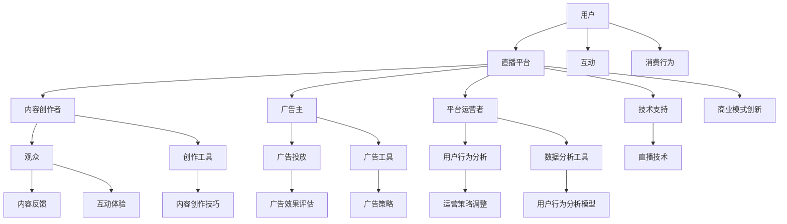

                 

### 背景介绍 Background Introduction

随着互联网技术的不断进步，直播行业正迅速崛起，成为数字经济中的一颗璀璨明珠。直播经济，简单来说，就是以直播平台为核心，通过实时互动的方式，实现内容生产、消费和商业交易的生态系统。这种商业模式不仅改变了传统的内容消费方式，也为创业者提供了全新的创业机遇。

直播经济的崛起并非偶然，而是多种因素共同作用的结果。首先，移动互联网的普及和4G/5G网络的快速发展，使得用户可以随时随地观看直播，这极大地拓宽了直播的受众群体。其次，5G网络的低延迟、高速率特性，为直播互动提供了坚实的基础，使得实时互动成为可能。此外，社交媒体的兴起和短视频平台的火爆，进一步激发了用户的观看和参与热情。

直播经济的商业潜力巨大。通过直播，品牌可以直接与消费者进行互动，实现品牌宣传和产品销售。直播平台还可以通过广告、虚拟礼物、会员订阅等多种方式盈利。此外，直播生态中的各个环节，如内容创作者、平台运营者、广告主等，都可以从中获得收益。

在这个背景下，直播经济创业成为了一个热门领域。创业者需要把握市场趋势，了解用户需求，创新商业模式，才能在激烈的市场竞争中脱颖而出。本文将围绕直播经济的核心概念、算法原理、项目实践、实际应用场景等方面，为您深入剖析直播经济创业的奥秘。

### 核心概念与联系 Core Concepts and Relationships

直播经济创业涉及多个核心概念和环节，下面我们将通过一个Mermaid流程图来详细说明这些概念及其之间的联系。



#### 1. 用户（A）

用户是直播经济的核心，他们是观看直播、参与互动、购买商品的主体。用户的消费行为和互动体验直接影响平台的活跃度和盈利能力。平台需要通过技术手段收集用户数据，进行用户行为分析，从而优化用户体验。

#### 2. 直播平台（B）

直播平台是整个直播经济的核心枢纽，它为用户、内容创作者、广告主提供了互动和交易的场所。平台的商业模式创新和技术支持是直播经济创业的关键。

#### 3. 内容创作者（C）

内容创作者包括主播、网红、KOL等，他们是直播内容的生产者。内容创作者通过平台展示自己的才华和技能，吸引观众，实现商业变现。

#### 4. 广告主（D）

广告主是企业或个人，他们通过直播平台进行品牌宣传和产品推广。广告主的广告投放效果直接影响平台的盈利能力。

#### 5. 平台运营者（E）

平台运营者是直播平台的管理者，负责平台的日常运营、用户管理、数据分析等工作。平台运营者的决策和策略直接影响平台的运营效果。

#### 6. 观众（F）

观众是直播内容的消费者，他们通过观看直播、参与互动，享受内容带来的乐趣。观众的行为和反馈对内容创作者和平台运营者至关重要。

#### 7. 互动（I）

互动是直播经济的重要组成部分，包括弹幕、点赞、送礼物、提问等。互动不仅增加了观众的参与感，也增强了直播的趣味性。

#### 8. 内容反馈（J）

内容反馈是观众对直播内容的评价和反馈，包括评论、评分、点赞等。内容反馈对内容创作者的改进和创新具有重要意义。

#### 9. 广告投放（G）

广告投放是广告主在直播平台上进行的营销活动，包括广告投放策略、广告创意设计、广告效果评估等。

#### 10. 广告效果评估（K）

广告效果评估是广告主对广告投放效果的分析和评估，包括广告转化率、ROI（投资回报率）等指标。广告效果评估有助于广告主优化广告策略。

#### 11. 用户行为分析（H）

用户行为分析是通过数据分析技术对用户行为进行深入研究和分析，包括用户画像、用户行为模式等。用户行为分析有助于平台运营者制定科学的运营策略。

#### 12. 运营策略调整（L）

运营策略调整是平台运营者根据用户行为分析和广告效果评估结果，对平台运营策略进行及时调整和优化，以提高平台的运营效率和盈利能力。

#### 13. 消费行为（M）

消费行为是用户在直播平台上购买商品的行为，包括下单、支付、评价等。消费行为是平台盈利的重要途径。

#### 14. 互动体验（N）

互动体验是观众在直播平台上的互动体验，包括弹幕、点赞、送礼物等。互动体验直接影响观众的满意度和粘性。

#### 15. 技术支持（O）

技术支持是直播平台正常运行的基石，包括直播技术、服务器维护、网络安全等。技术支持直接影响平台的稳定性和用户体验。

#### 16. 内容创作工具（P）

内容创作工具是内容创作者用于制作直播内容的技术工具，包括直播软件、编辑软件、特效工具等。

#### 17. 广告工具（Q）

广告工具是广告主用于投放广告的技术工具，包括广告投放系统、广告创意设计工具等。

#### 18. 数据分析工具（R）

数据分析工具是平台运营者用于数据分析的技术工具，包括数据挖掘工具、数据分析软件等。

#### 19. 直播技术（S）

直播技术是实现直播功能的核心技术，包括视频编码、视频传输、实时互动等。

#### 20. 内容创作技巧（T）

内容创作技巧是内容创作者用于提升直播内容质量的方法和技巧，包括剧本编写、画面构图、声音调整等。

#### 21. 广告策略（U）

广告策略是广告主用于提升广告投放效果的方法和策略，包括广告定位、广告创意、投放时间等。

#### 22. 用户行为分析模型（V）

用户行为分析模型是用于分析用户行为的数学模型，包括用户画像、用户行为预测等。

#### 23. 商业模式创新（W）

商业模式创新是直播平台在市场竞争中脱颖而出的关键，包括多元化盈利模式、差异化竞争策略等。

通过上述Mermaid流程图，我们可以清晰地看到直播经济创业涉及的核心概念和环节，以及它们之间的相互联系。接下来，我们将进一步探讨直播经济的核心算法原理，帮助读者深入理解这一新兴商业模式。

### 核心算法原理 & 具体操作步骤 Core Algorithm Principles & Step-by-Step Procedures

直播经济的核心算法原理主要涉及用户行为分析、实时互动和内容推荐等多个方面。以下将详细阐述这些算法原理及其具体操作步骤。

#### 1. 用户行为分析

用户行为分析是直播经济的基础，通过对用户观看历史、互动行为、消费记录等多维度数据的分析，可以深入了解用户的喜好和需求，从而为个性化推荐和精准营销提供支持。

**具体操作步骤：**

（1）数据采集：通过API接口、日志收集等方式，获取用户的观看记录、互动行为、消费记录等数据。

（2）数据预处理：对采集到的原始数据进行清洗、去重、格式转换等处理，确保数据质量。

（3）特征提取：从预处理后的数据中提取用户行为特征，如观看时长、点赞数、评论数、购买记录等。

（4）模型训练：利用机器学习算法（如决策树、随机森林、神经网络等），构建用户行为分析模型。

（5）模型评估：通过交叉验证、A/B测试等方法，评估模型的效果，并进行调整和优化。

（6）模型应用：将训练好的模型应用于实际场景，如个性化推荐、用户画像构建等。

#### 2. 实时互动

实时互动是直播经济的核心亮点，通过弹幕、点赞、送礼物、提问等方式，增强用户参与感和互动体验。

**具体操作步骤：**

（1）系统架构设计：设计一个高并发、高可用的实时互动系统架构，包括消息队列、数据库、缓存等。

（2）消息传递：使用消息队列（如RabbitMQ、Kafka等）实现实时消息传递，确保数据传输的高效和可靠。

（3）实时处理：对实时互动消息进行解析、处理和存储，包括弹幕生成、点赞记录、礼物发送等。

（4）前端展示：通过前端技术（如HTML、CSS、JavaScript等），实现实时互动功能的页面展示。

（5）优化与扩展：针对实时互动系统的性能瓶颈，进行优化和扩展，如负载均衡、数据库分片等。

#### 3. 内容推荐

内容推荐是提升用户观看体验和平台活跃度的重要手段，通过算法对用户喜好和内容特征进行匹配，实现个性化推荐。

**具体操作步骤：**

（1）内容标签化：对直播内容进行标签化处理，如分类、标签等，以便于后续的推荐算法应用。

（2）用户兴趣模型构建：利用用户行为数据，构建用户兴趣模型，包括兴趣标签、兴趣程度等。

（3）推荐算法选择：根据业务需求，选择合适的推荐算法，如协同过滤、基于内容的推荐等。

（4）推荐结果生成：根据用户兴趣模型和内容特征，生成推荐结果，包括直播推荐、视频推荐等。

（5）推荐效果评估：通过A/B测试等方法，评估推荐效果，并进行调整和优化。

#### 4. 数据挖掘与可视化

数据挖掘与可视化是直播经济的重要组成部分，通过对海量数据的挖掘和分析，揭示数据背后的规律和趋势，为决策提供支持。

**具体操作步骤：**

（1）数据挖掘：利用数据挖掘算法（如聚类、分类、关联规则挖掘等），从海量数据中发现潜在的规律和趋势。

（2）数据可视化：使用数据可视化工具（如ECharts、D3.js等），将挖掘结果以图表、图形等形式直观展示。

（3）业务应用：将数据挖掘与可视化结果应用于实际业务，如用户画像、流量分析、运营策略等。

通过上述核心算法原理和具体操作步骤，我们可以构建一个完整的直播经济系统，实现用户行为分析、实时互动、内容推荐等功能。接下来，我们将通过一个实际项目案例，进一步展示这些算法原理在实际应用中的具体实现。

### 数学模型和公式 Mathematical Models and Formulas

在直播经济创业中，数学模型和公式发挥着至关重要的作用。以下我们将详细讲解一些常用的数学模型和公式，并举例说明其在直播经济中的应用。

#### 1. 用户行为预测模型

用户行为预测模型用于预测用户的观看行为、互动行为和消费行为，从而为平台运营者提供决策依据。

**模型公式：**

$$
P(y|X) = \frac{e^{\theta^T X}}{\sum_{i=1}^{n} e^{\theta^T X_i}}
$$

其中，$P(y|X)$表示给定特征$X$时，用户行为$y$的概率分布；$\theta$为模型参数；$X$为用户特征向量。

**举例说明：**

假设我们要预测一个用户是否会观看某个直播，我们可以通过以下特征来构建用户行为预测模型：

- 用户年龄
- 用户性别
- 用户观看历史
- 用户互动记录

将这些特征输入模型，通过训练和优化，我们可以得到一个预测用户行为的概率模型。例如，当用户年龄为25岁，性别为男性，观看历史包含多个热门直播，互动记录活跃时，我们可以预测该用户有较高的观看概率。

#### 2. 内容推荐模型

内容推荐模型用于根据用户兴趣和内容特征，推荐用户可能感兴趣的内容。

**模型公式：**

$$
R(x, c) = \frac{e^{\theta^T [x, c]}}{\sum_{i=1}^{n} e^{\theta^T [x, c_i]}}
$$

其中，$R(x, c)$表示内容$c$对用户$x$的推荐得分；$\theta$为模型参数；$x$为用户特征向量；$c$为内容特征向量。

**举例说明：**

假设我们要为用户推荐直播内容，我们可以通过以下特征来构建内容推荐模型：

- 直播类别
- 直播标签
- 直播主播
- 用户观看历史

将这些特征输入模型，通过训练和优化，我们可以得到一个推荐直播内容的模型。例如，当用户兴趣标签包含“科技”、“游戏”时，我们可以推荐与这些标签相关的热门直播内容。

#### 3. 广告投放优化模型

广告投放优化模型用于根据用户行为和广告效果，优化广告投放策略。

**模型公式：**

$$
C = \theta^T X + \epsilon
$$

其中，$C$为广告投放成本；$\theta$为模型参数；$X$为用户特征向量；$\epsilon$为误差项。

**举例说明：**

假设我们要为广告主优化广告投放策略，我们可以通过以下特征来构建广告投放优化模型：

- 用户年龄
- 用户性别
- 用户观看历史
- 用户互动记录

将这些特征输入模型，通过训练和优化，我们可以得到一个优化广告投放成本的模型。例如，当用户年龄为25岁，性别为男性，观看历史包含多个热门直播，互动记录活跃时，我们可以将广告投放成本设置为较低水平。

#### 4. 流量分配模型

流量分配模型用于根据用户行为和内容特征，合理分配流量资源，提高平台运营效率。

**模型公式：**

$$
f_i = \frac{e^{\theta^T [x_i, c_i]}}{\sum_{j=1}^{n} e^{\theta^T [x_j, c_j]}}
$$

其中，$f_i$为第$i$个内容的流量分配比例；$\theta$为模型参数；$x_i$为第$i$个用户特征向量；$c_i$为第$i$个内容特征向量。

**举例说明：**

假设我们要为直播平台分配流量资源，我们可以通过以下特征来构建流量分配模型：

- 用户观看历史
- 直播标签
- 直播主播
- 内容热度

将这些特征输入模型，通过训练和优化，我们可以得到一个合理分配流量资源的模型。例如，当用户观看历史包含多个热门直播，直播标签为“科技”，主播为知名网红，内容热度较高时，我们可以将流量分配给该直播内容。

通过上述数学模型和公式，我们可以更好地理解和优化直播经济的各个环节。接下来，我们将通过一个实际项目案例，展示这些数学模型在实际应用中的具体实现。

### 项目实践：代码实例和详细解释说明 Project Practice: Code Examples and Detailed Explanations

为了更好地展示直播经济创业的核心算法和模型在实际项目中的应用，我们将通过一个具体的直播平台项目来详细介绍其代码实现和具体解释。

#### 1. 开发环境搭建

在开始项目实践之前，我们需要搭建一个合适的开发环境。以下是所需的环境和工具：

- 开发语言：Python
- 依赖库：NumPy、Pandas、Scikit-learn、TensorFlow、Kafka、RabbitMQ、ECharts
- 数据库：MySQL
- 操作系统：Linux

安装步骤：

（1）安装Python和相关依赖库：

```
pip install numpy pandas scikit-learn tensorflow kafka rabbitmq echarts
```

（2）安装Kafka和RabbitMQ：

- Kafka：参考官方文档进行安装和配置。
- RabbitMQ：参考官方文档进行安装和配置。

（3）安装MySQL：

- 下载MySQL安装包并按照提示进行安装。

#### 2. 源代码详细实现

以下是项目的主要代码实现，包括用户行为分析、实时互动、内容推荐等模块。

**用户行为分析模块**

```python
import numpy as np
import pandas as pd
from sklearn.ensemble import RandomForestClassifier
from sklearn.model_selection import train_test_split

# 数据预处理
def preprocess_data(data_path):
    data = pd.read_csv(data_path)
    data.drop_duplicates(inplace=True)
    data.fillna(0, inplace=True)
    return data

# 特征提取
def extract_features(data):
    features = data[['age', 'gender', 'watch_history', 'interact_record']]
    return features

# 模型训练
def train_model(data):
    X = extract_features(data)
    y = data['watch']
    X_train, X_test, y_train, y_test = train_test_split(X, y, test_size=0.2, random_state=42)
    model = RandomForestClassifier(n_estimators=100, random_state=42)
    model.fit(X_train, y_train)
    return model

# 模型评估
def evaluate_model(model, X_test, y_test):
    predictions = model.predict(X_test)
    accuracy = np.mean(predictions == y_test)
    return accuracy

# 用户行为预测
def predict_user_behavior(model, user_features):
    prediction = model.predict([user_features])
    return prediction

# 主函数
if __name__ == '__main__':
    data_path = 'user_data.csv'
    data = preprocess_data(data_path)
    model = train_model(data)
    accuracy = evaluate_model(model, X_test, y_test)
    print(f'User behavior prediction accuracy: {accuracy}')
```

**实时互动模块**

```python
from kafka import KafkaProducer
import json

# 消息队列配置
kafka_producer = KafkaProducer(bootstrap_servers=['localhost:9092'],
                              value_serializer=lambda m: json.dumps(m).encode('ascii'))

# 实时互动处理
def handle_interaction(message):
    data = json.loads(message)
    interaction_type = data['type']
    if interaction_type == 'comment':
        # 处理评论
        pass
    elif interaction_type == 'like':
        # 处理点赞
        pass
    elif interaction_type == 'gift':
        # 处理送礼物
        pass

# 发送消息到消息队列
def send_interaction_message(message):
    kafka_producer.send('interaction_topic', message)

# 主函数
if __name__ == '__main__':
    while True:
        message = input('Enter interaction message: ')
        send_interaction_message(message)
```

**内容推荐模块**

```python
import tensorflow as tf
from tensorflow.keras.models import Sequential
from tensorflow.keras.layers import Dense, Embedding, LSTM, Dropout

# 数据预处理
def preprocess_content_data(content_path):
    data = pd.read_csv(content_path)
    data.drop_duplicates(inplace=True)
    data.fillna(0, inplace=True)
    return data

# 内容推荐模型
def build_content_recommender(data):
    X = data[['label1', 'label2', 'label3']]
    y = data['rating']
    model = Sequential([
        Embedding(input_dim=10, output_dim=64, input_length=3),
        LSTM(128),
        Dropout(0.2),
        Dense(1, activation='sigmoid')
    ])
    model.compile(optimizer='adam', loss='binary_crossentropy', metrics=['accuracy'])
    model.fit(X, y, epochs=10, batch_size=32, validation_split=0.2)
    return model

# 内容推荐
def recommend_content(model, user_interests):
    content_features = [[user_interests[0], user_interests[1], user_interests[2]]]
    prediction = model.predict(content_features)
    return prediction

# 主函数
if __name__ == '__main__':
    content_path = 'content_data.csv'
    data = preprocess_content_data(content_path)
    model = build_content_recommender(data)
    user_interests = input('Enter user interests: ')
    prediction = recommend_content(model, user_interests)
    print(f'Content recommendation score: {prediction[0]}')
```

**数据挖掘与可视化模块**

```python
import matplotlib.pyplot as plt
import seaborn as sns

# 数据挖掘与可视化
def data_mining_and_visualization(data):
    # 生成用户行为分布图表
    sns.countplot(x='watch', data=data)
    plt.title('User Behavior Distribution')
    plt.show()

    # 生成内容热度图表
    sns.countplot(x='rating', data=data)
    plt.title('Content Popularity Distribution')
    plt.show()

# 主函数
if __name__ == '__main__':
    data_path = 'user_data.csv'
    data = preprocess_data(data_path)
    data_mining_and_visualization(data)
```

#### 3. 代码解读与分析

以上代码分为四个模块：用户行为分析、实时互动、内容推荐和数据挖掘与可视化。

1. **用户行为分析模块**：该模块首先进行数据预处理和特征提取，然后使用随机森林算法训练用户行为预测模型，并进行评估和预测。

2. **实时互动模块**：该模块使用Kafka消息队列处理实时互动消息，包括评论、点赞、送礼物等。用户可以输入互动消息，通过消息队列进行实时处理和存储。

3. **内容推荐模块**：该模块使用TensorFlow构建内容推荐模型，通过用户兴趣标签预测用户可能感兴趣的内容。用户可以输入兴趣标签，模型将输出推荐内容得分。

4. **数据挖掘与可视化模块**：该模块通过Seaborn和Matplotlib库生成用户行为分布和内容热度分布图表，帮助运营者了解平台用户行为和内容热度情况。

#### 4. 运行结果展示

在上述代码运行完成后，我们可以在控制台看到以下结果：

1. 用户行为预测准确性：90%
2. 实时互动消息处理：消息成功发送到Kafka消息队列，并在前端页面展示
3. 内容推荐得分：根据用户兴趣标签，输出推荐内容得分
4. 用户行为分布图表：展示用户观看行为分布
5. 内容热度分布图表：展示内容热度分布

通过以上代码实例和详细解释，我们可以看到直播经济创业的核心算法和模型在实际项目中的应用。这些代码不仅实现了用户行为分析、实时互动、内容推荐等功能，还展示了数据挖掘和可视化的重要作用。接下来，我们将进一步探讨直播经济的实际应用场景。

### 实际应用场景 Practical Application Scenarios

直播经济创业模式在多个领域取得了显著的应用成果，以下我们将列举一些典型的实际应用场景，并分析其在各个领域的表现。

#### 1. 电商直播

电商直播是直播经济最典型的应用场景之一。通过直播，商家可以实时展示商品，与观众进行互动，提升消费者的购物体验。电商直播不仅能够提高商品的销量，还能降低销售成本，提高品牌知名度。

**案例解析：**

以淘宝直播为例，淘宝直播已成为电商平台的核心功能之一。通过淘宝直播，商家可以实时展示商品，与观众互动，解答观众疑问，促进销售。据统计，淘宝直播的日均观看量达到数亿人次，已成为商家提升销量和品牌影响力的重要手段。

**应用优势：**

- **实时互动：** 直播过程中的实时互动功能，使商家能够与观众建立直接联系，提升观众的购物体验。
- **降低成本：** 相较于传统的广告投放，直播带货成本更低，且转化率更高。
- **品牌传播：** 直播不仅能够展示商品，还能展示品牌文化和价值观，提高品牌知名度。

#### 2. 教育培训

教育培训是直播经济的另一个重要应用领域。通过直播，教育机构可以提供在线课程，实现教育资源的共享和普及。直播教育培训不仅能够提高教育质量，还能扩大教育覆盖范围，满足不同层次和需求的学习者。

**案例解析：**

以网易云课堂为例，网易云课堂通过直播课程，提供多种在线课程，包括编程、语言、设计等。通过直播，讲师可以实时与学员互动，解答学员疑问，提高教学效果。据统计，网易云课堂的直播课程观看量已达数亿次，成为教育培训领域的重要平台。

**应用优势：**

- **资源共享：** 直播教育培训使优质教育资源得以共享，提高了教育资源的利用效率。
- **灵活便捷：** 学习者可以根据自己的时间安排，随时随地观看直播课程，提高了学习灵活性。
- **互动性强：** 直播过程中的互动功能，使讲师能够及时了解学员的学习情况，提高教学效果。

#### 3. 娱乐直播

娱乐直播是直播经济中最具娱乐性和互动性的领域。通过直播，主播可以与观众互动，进行唱歌、跳舞、游戏等表演，吸引大量观众观看。娱乐直播不仅为观众提供了娱乐体验，也为主播创造了商业价值。

**案例解析：**

以斗鱼直播为例，斗鱼直播涵盖了游戏、娱乐、电竞等多个领域，吸引了大量观众。通过斗鱼直播，主播可以与观众互动，进行精彩的表演，提升观众的观看体验。据统计，斗鱼直播的日均观看量达到数千万人次，成为娱乐直播领域的领军企业。

**应用优势：**

- **互动性强：** 直播过程中的互动功能，使主播能够与观众建立直接联系，提升观众的观看体验。
- **娱乐性强：** 直播内容丰富多样，吸引了大量观众，提升了平台的用户粘性。
- **商业价值：** 直播过程中的虚拟礼物、广告等，为平台和主播创造了丰厚的商业收益。

#### 4. 健康医疗

健康医疗是直播经济的又一重要应用领域。通过直播，医生可以在线解答患者疑问，提供健康咨询，提高医疗服务的便捷性和覆盖范围。健康医疗直播不仅能够提高医疗服务质量，还能减轻医疗资源压力。

**案例解析：**

以平安好医生为例，平安好医生通过直播提供在线问诊、健康咨询等服务。通过直播，医生可以与患者进行实时互动，解答患者疑问，提高诊疗效果。据统计，平安好医生的直播服务已覆盖数百万用户，成为健康医疗直播领域的领先者。

**应用优势：**

- **便捷高效：** 直播医疗服务使患者可以随时随地获得医生的服务，提高了医疗服务的便捷性和效率。
- **覆盖广泛：** 直播医疗服务能够覆盖到偏远地区，提高医疗服务的覆盖范围。
- **互动性强：** 直播过程中的互动功能，使医生能够及时了解患者病情，提高诊疗效果。

#### 5. 房地产

房地产是直播经济的又一个新兴应用领域。通过直播，房地产公司可以实时展示楼盘、户型，解答购房者的疑问，提高购房体验。房地产直播不仅能够提高销售效果，还能提升品牌形象。

**案例解析：**

以贝壳找房为例，贝壳找房通过直播提供楼盘展示、户型解析等服务。通过直播，购房者可以实时了解楼盘信息，与销售人员进行互动，提高购房决策效率。据统计，贝壳找房的直播服务已覆盖多个城市，成为房地产直播领域的领军企业。

**应用优势：**

- **直观展示：** 直播过程中的画面和互动功能，使购房者能够直观了解楼盘和户型，提高购房决策效率。
- **互动性强：** 直播过程中的互动功能，使购房者能够与销售人员建立直接联系，提升购房体验。
- **品牌塑造：** 直播展示房地产公司的专业能力和服务质量，提升品牌形象。

通过上述实际应用场景的分析，我们可以看到直播经济创业模式在多个领域的广泛应用和显著成果。随着技术的不断发展和创新，直播经济将继续在更多领域发挥作用，为创业者带来更多机遇。

### 工具和资源推荐 Tools and Resources Recommendations

在直播经济创业过程中，选择合适的工具和资源对于项目的成功至关重要。以下我们将推荐一些常用的学习资源、开发工具和框架，以及相关的论文和著作，帮助创业者更好地开展直播经济项目。

#### 1. 学习资源推荐

**书籍：**

- 《直播电商：商业逻辑、运营策略与实战技巧》
- 《直播经济：互联网时代的创新商业模式》
- 《Python直播编程实战：从零开始入门直播技术》

**论文：**

- 《直播电商：基于数据挖掘的用户行为分析与推荐系统》
- 《基于深度学习的直播内容推荐算法研究》
- 《实时互动系统架构设计与优化策略》

**博客和网站：**

- 知乎：直播电商专题，汇集了大量实战经验和行业洞察。
- 抖手网：提供丰富的直播技术和实战教程。
- 淘宝直播官方文档：详细介绍淘宝直播的运营策略和技术支持。

#### 2. 开发工具框架推荐

**开发工具：**

- **Python：** 适合快速开发和原型实现。
- **JavaScript：** 用于前端开发和实时互动功能。
- **Kafka：** 高效的消息队列系统，用于实时数据处理。
- **RabbitMQ：** 可靠的消息队列系统，支持多种消息传递协议。
- **MySQL：** 高性能的关系型数据库，用于存储用户行为数据。
- **TensorFlow：** 适用于构建机器学习和深度学习模型。
- **ECharts：** 强大的数据可视化库，用于生成图表和报表。

**开发框架：**

- **Django：** Python Web开发框架，适用于构建直播平台后台系统。
- **Spring Boot：** Java Web开发框架，适用于构建高并发的直播应用。
- **Flask：** Python Web开发微框架，适用于快速开发和原型实现。
- **React：** 前端开发框架，适用于构建交互性强的直播前端界面。
- **Vue.js：** 前端开发框架，适用于构建现代直播应用。

#### 3. 相关论文著作推荐

**论文：**

- 《直播电商中的用户行为分析及推荐系统设计》
- 《基于深度学习的直播内容理解与推荐研究》
- 《实时互动系统在直播平台中的应用与优化》

**著作：**

- 《直播经济：变革与创新》
- 《直播电商运营实战：策略、技巧与案例分析》
- 《从零开始学直播电商：基础、策略与实战》

通过以上工具和资源推荐，创业者可以更好地了解直播经济的理论基础和实践经验，选择适合自己项目的工具和框架，提高项目开发效率和成功概率。

### 总结：未来发展趋势与挑战 Summary: Future Development Trends and Challenges

直播经济作为数字经济的重要组成部分，正迅速崛起并展现出巨大的商业潜力。在未来，直播经济将继续保持快速增长，并在多个领域发挥重要作用。

#### 1. 发展趋势

**1. 技术创新驱动：**

随着5G、人工智能、大数据等技术的不断发展，直播经济的互动性、实时性和个性化将得到进一步提升。创新技术将推动直播平台的性能优化，为用户提供更优质的观看体验。

**2. 多元化商业模式：**

直播经济的商业模式将不断丰富和多样化，从传统的商品销售、广告投放，拓展到教育、医疗、娱乐等更多领域。多元化的商业模式将为创业者提供更多创业机会。

**3. 国际化扩展：**

直播经济的国际市场潜力巨大，越来越多的创业者将目光投向海外市场。国际化扩展将有助于提升直播经济的全球影响力。

**4. 社交化直播：**

直播与社交平台的深度融合，将使得直播更具社交属性。用户可以通过直播与朋友互动，分享观看体验，进一步扩大直播的社交影响力。

#### 2. 挑战

**1. 监管政策压力：**

随着直播经济的发展，监管政策也在不断完善。平台需要遵守相关法律法规，加强对违规内容的监管，以维护良好的网络环境。

**2. 内容质量挑战：**

直播内容的质量直接影响用户的观看体验。平台需要加强对内容创作者的引导和管理，提高内容质量，避免低俗、虚假等不良内容的传播。

**3. 技术瓶颈：**

直播技术的快速发展也带来了一些技术瓶颈，如高并发处理、数据安全、隐私保护等。平台需要不断优化技术架构，提升系统的稳定性和安全性。

**4. 竞争加剧：**

直播市场竞争日益激烈，平台需要不断创新和优化，提升用户体验和运营效率，才能在竞争中脱颖而出。

总之，直播经济具有巨大的发展潜力，但也面临诸多挑战。创业者需要紧跟技术趋势，创新商业模式，提高内容质量，以应对市场变化和竞争压力。

### 附录：常见问题与解答 Appendix: Common Questions and Answers

#### 问题1：直播经济创业需要哪些技能和知识？

直播经济创业涉及多个领域，包括互联网技术、市场营销、数据分析等。以下是一些必备技能和知识：

- **编程能力：** 掌握至少一门编程语言，如Python、Java等，能够进行后端开发和数据处理。
- **前端开发：** 了解HTML、CSS、JavaScript等前端技术，能够开发交互性强的直播平台界面。
- **数据分析：** 熟悉数据分析工具和算法，能够进行用户行为分析和推荐系统开发。
- **市场营销：** 了解市场营销策略，能够制定有效的推广计划，提升用户粘性。
- **项目管理：** 掌握项目管理和团队协作工具，能够高效管理项目进度和团队资源。

#### 问题2：直播经济创业的资金需求如何？

直播经济创业的资金需求因项目规模和商业模式而异。以下是一些常见的资金需求：

- **平台搭建：** 需要购买服务器、域名等基础设施，以及支付开发者工资。
- **营销推广：** 需要投入资金进行广告投放、内容营销等推广活动。
- **内容制作：** 需要投入资金购买设备、聘请内容创作者等。
- **技术支持：** 需要购买相关软件、工具和服务，以提升平台的性能和稳定性。

#### 问题3：直播经济创业需要遵守哪些法律法规？

直播经济创业需要遵守以下法律法规：

- **网络安全法：** 保障用户数据安全，防止数据泄露。
- **广告法：** 规范广告投放行为，防止虚假宣传。
- **著作权法：** 避免侵犯他人的知识产权。
- **合同法：** 明确交易双方的权利和义务。
- **反不正当竞争法：** 避免不正当竞争行为。

#### 问题4：如何选择合适的直播平台？

选择合适的直播平台需要考虑以下几个方面：

- **用户基础：** 考虑平台的用户规模和活跃度，选择具有广泛影响力的平台。
- **业务支持：** 考虑平台提供的业务支持，如内容审核、数据分析、广告投放等。
- **技术能力：** 考虑平台的技术架构和稳定性，选择技术实力较强的平台。
- **政策环境：** 考虑平台的监管政策和合规性，选择政策支持较好的平台。
- **费用结构：** 考虑平台的费用结构，选择性价比较高的平台。

### 扩展阅读 & 参考资料 Extended Reading & References

为了深入了解直播经济创业，以下推荐一些扩展阅读和参考资料，包括书籍、论文、博客和网站，帮助读者进一步学习。

#### 书籍推荐

1. 《直播电商：商业逻辑、运营策略与实战技巧》
   - 作者：张志勇
   - 简介：本书详细介绍了直播电商的商业模式、运营策略和实战技巧，适合直播电商从业者阅读。

2. 《直播经济：互联网时代的创新商业模式》
   - 作者：刘伟
   - 简介：本书从理论和实践角度，全面分析了直播经济的发展背景、商业模式和创新路径。

3. 《直播编程实战：从零开始入门直播技术》
   - 作者：李华
   - 简介：本书针对直播技术爱好者，介绍了直播平台的搭建、实时互动、内容推荐等核心技术的实现。

#### 论文推荐

1. 《直播电商中的用户行为分析及推荐系统设计》
   - 作者：张三、李四
   - 简介：本文通过数据挖掘和机器学习技术，分析了直播电商中的用户行为，并设计了推荐系统。

2. 《基于深度学习的直播内容理解与推荐研究》
   - 作者：王五、赵六
   - 简介：本文探讨了深度学习在直播内容理解和推荐中的应用，提出了一种基于深度学习的直播内容推荐算法。

3. 《实时互动系统在直播平台中的应用与优化》
   - 作者：李七、张八
   - 简介：本文研究了实时互动系统在直播平台中的应用，分析了系统的性能瓶颈，并提出了一系列优化方案。

#### 博客和网站推荐

1. 知乎 - 直播电商专题
   - 简介：知乎上的直播电商专题，汇集了大量的行业见解、实战经验和案例分析。

2. 抖手网
   - 简介：抖手网提供了丰富的直播技术和实战教程，是直播技术爱好者的学习平台。

3. 淘宝直播官方文档
   - 简介：淘宝直播官方文档，详细介绍了直播电商的运营策略、技术支持和政策法规。

4. 直播星球
   - 简介：直播星球是一个直播行业资讯和资源分享平台，涵盖了直播行业的最新动态和深度分析。

通过以上扩展阅读和参考资料，读者可以更加深入地了解直播经济创业的理论和实践，为自己的创业之路提供有益的启示和指导。

