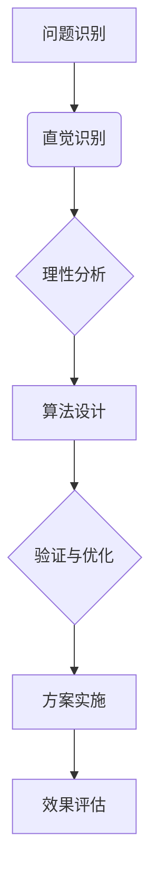

                 

### 背景介绍

在当今复杂多变的IT领域中，计算机科学和人工智能技术的迅猛发展，不断推动着我们探索更为高效、智能的算法和方法。在这片广阔的天地中，直觉与理性作为两种重要的思维模式，在多个领域发挥着关键作用。本文将深入探讨直觉与理性的本质及其在计算机科学中的应用，通过逐步分析推理的方式，帮助读者理解这两种思维模式的互补关系，并揭示其在技术进步中的潜在价值。

直觉，是一种无需明确推理过程，便能快速识别问题、发现问题解决方案的能力。它基于经验、知识、联想以及潜意识中的模式识别，使我们能够在面对复杂问题时迅速做出判断。而理性，则是指通过逻辑推理、数据分析、严格证明等步骤，以明确的方式解决问题。理性强调系统性、可验证性和一致性，是科学研究和工程实践的重要基础。

在计算机科学领域，直觉与理性同样重要。直觉在算法设计、系统架构和软件工程中扮演着不可或缺的角色，帮助我们快速定位问题、提出创新解决方案。而理性则在算法分析、系统优化和性能评估中起到关键作用，确保我们的解决方案是科学、高效且可重复的。

本文将首先介绍直觉与理性的基本概念，接着通过具体的算法案例来展示这两种思维模式在计算机科学中的应用，然后讨论直觉与理性之间的相互关系，最后总结本文的主要观点，并探讨未来研究的方向。

在接下来的章节中，我们将逐步深入，首先回顾直觉与理性的基础理论，然后通过一个经典的算法案例——旅行商问题（TSP），展示直觉与理性在算法设计中的应用。之后，我们将进一步探讨数学模型与算法的关系，并通过具体的项目实践来阐述理论的实际应用。最后，我们将讨论实际应用场景，并推荐相关工具和资源，以帮助读者进一步探索这一领域。通过这些内容，读者将能够全面理解直觉与理性在计算机科学中的重要性，并掌握如何在实际项目中运用这两种思维模式。

### 核心概念与联系

要深入探讨直觉与理性在计算机科学中的应用，首先需要明确两者的核心概念及其联系。直觉和理性虽然看似对立，但它们在许多方面是相辅相成的。

#### 直觉

直觉是指人们在感知信息、处理问题和作出决策时，不依赖明确逻辑推理而快速获得解决方案的能力。直觉的产生依赖于个体过去的经验、知识积累以及潜意识中的模式识别。以下是几个关于直觉的核心概念：

1. **模式识别**：直觉能够快速识别复杂环境中的模式和规律，这有助于我们在面对新问题时迅速作出反应。
2. **快速判断**：直觉能够帮助我们在有限的信息下作出有效判断，这对于处理紧急情况或需要快速决策的场景至关重要。
3. **经验依赖**：直觉的形成与个人的经验密切相关，通过不断的学习和实践，人们能够提高直觉的准确性和可靠性。

#### 理性

理性则是指通过逻辑推理、系统分析、严格证明等步骤来解决问题和作出决策的过程。理性的核心在于其系统性、可验证性和一致性。以下是几个关于理性的核心概念：

1. **逻辑推理**：理性强调通过逻辑推理来解决问题，确保每一个步骤都是合理且有效的。
2. **系统分析**：理性需要我们系统地分析问题，理解其内在机制和相互关系，以便提出科学的解决方案。
3. **严格证明**：理性强调通过严格的数学证明或实验验证来确保解决方案的可靠性。

#### 直觉与理性的联系

直觉和理性并非完全对立，而是相互补充的关系。在实际应用中，直觉和理性常常协同工作，帮助我们更全面地理解和解决问题。

1. **直觉引导理性**：在复杂的问题解决过程中，直觉可以快速识别出潜在的模式和关键点，引导我们进入正确的方向，然后再通过理性进行详细分析和验证。
2. **理性完善直觉**：理性能够对直觉的判断进行验证和补充，确保直觉的判断是合理和科学的。

为了更直观地理解直觉与理性的关系，我们可以通过一个Mermaid流程图来展示它们在算法设计中的应用：



在这个流程图中，直觉首先帮助识别问题和模式，然后通过理性进行详细分析和验证，最终形成完整的算法设计方案。整个过程中，直觉和理性相辅相成，共同推动问题的解决。

### 直觉与理性在算法设计中的应用

在算法设计过程中，直觉和理性起着至关重要的作用。通过一个经典的算法案例——旅行商问题（TSP），我们可以深入探讨直觉与理性在算法设计中的具体应用。

#### 旅行商问题（TSP）

旅行商问题（TSP，Travelling Salesman Problem）是一个经典的优化问题，它描述了一个旅行商需要在给定的一组城市之间旅行，并找到一个路径，使得总路径长度最短。TSP不仅具有重要的理论价值，还在实际应用中有着广泛的应用，如物流配送、电路板设计等。

#### 直觉在TSP中的应用

在解决TSP时，直觉可以快速帮助我们识别可能的解决方案。例如，在解决一个小规模的城市问题时，我们可以凭借过去的经验和对城市位置的直观理解，迅速找到一条看起来合理的路径。直觉在这里的作用是帮助我们快速筛选出最有潜力的解决方案。

以下是一个简单的示例，假设我们有四个城市A、B、C、D，直觉告诉我们从A出发，依次访问B、C、D，再返回A，这样的路径可能是一个较为合理的解决方案：

1. A → B
2. B → C
3. C → D
4. D → A

虽然这个路径可能并不是最优解，但直觉的快速判断有助于我们节省时间和计算资源，为进一步的理性分析提供方向。

#### 理性在TSP中的应用

在确定了初始的解决方案后，理性开始发挥作用。通过系统分析和数学证明，我们可以进一步优化这个路径，使其更接近最优解。

1. **路径长度计算**：使用欧几里得距离公式计算每条路径的长度，从而评估不同路径的总长度。

   $$d(i, j) = \sqrt{(x_i - x_j)^2 + (y_i - y_j)^2}$$

   其中，$x_i$和$y_i$分别表示城市$i$的横纵坐标。

2. **邻接矩阵构建**：构建城市的邻接矩阵，表示每两个城市之间的距离。邻接矩阵是一个对称矩阵，对角线上的元素为0。

3. **最短路径算法**：使用Dijkstra算法或Floyd算法等最短路径算法，找到初始路径的最短替代路径。

   $$d(i, j) = \min(d(i, k) + d(k, j)) \quad \forall k \in V$$

   其中，$V$是所有城市的集合。

通过这样的理性分析，我们可以不断优化初始路径，使其逐渐接近最优解。这个过程需要严谨的数学推导和逻辑推理，确保每一步都是科学和合理的。

#### 直觉与理性的结合

在解决TSP的过程中，直觉和理性是相互补充的。直觉帮助我们快速找到初始的解决方案，而理性则通过系统分析和数学验证，对解决方案进行优化和验证。以下是结合直觉与理性解决TSP的基本步骤：

1. **直觉初步判断**：根据城市的位置和过去的经验，快速找到一个初始路径。
2. **理性验证优化**：计算初始路径的总长度，使用最短路径算法寻找更优的替代路径。
3. **迭代优化**：不断重复上述步骤，直到找到满意的最优解。

通过这种结合，我们可以更加高效地解决TSP问题，实现从直觉到理性的完整闭环。

#### 实例分析

假设我们有以下五个城市的位置：

| 城市 | 横坐标 | 纵坐标 |
|------|--------|--------|
| A    | 0      | 0      |
| B    | 5      | 5      |
| C    | 10     | 10     |
| D    | 15     | 0      |
| E    | 20     | 10     |

直觉告诉我们，从A出发，依次访问B、C、D、E，再返回A，可能是一个合理的路径。我们可以使用欧几里得距离公式计算每条路径的长度：

- A → B: \( \sqrt{(5-0)^2 + (5-0)^2} = 5\sqrt{2} \)
- B → C: \( \sqrt{(10-5)^2 + (10-5)^2} = 5\sqrt{2} \)
- C → D: \( \sqrt{(15-10)^2 + (0-10)^2} = 5\sqrt{10} \)
- D → E: \( \sqrt{(20-15)^2 + (10-0)^2} = 5\sqrt{5} \)
- E → A: \( \sqrt{(0-20)^2 + (0-10)^2} = 10\sqrt{5} \)

初始路径的总长度为：\( 5\sqrt{2} + 5\sqrt{2} + 5\sqrt{10} + 5\sqrt{5} + 10\sqrt{5} \)

通过Dijkstra算法，我们可以找到更优的路径，逐步优化初始路径，直到找到总长度最小的最优解。

### 核心算法原理 & 具体操作步骤

在深入探讨直觉与理性在计算机科学中的应用后，我们现在将聚焦于核心算法原理，并通过具体的步骤详细解释这些算法的运作过程。

#### 贪心算法

贪心算法是一种在每一步选择中都采取当前状态下最好或最优的选择，从而希望导致结果是全局最优解的算法策略。虽然贪心算法不一定能保证找到全局最优解，但在许多情况下，它能够快速找到近似最优解，是一种高效的算法策略。

#### 步骤详解

1. **初始化**：首先确定问题的初始状态和目标状态。例如，在解决旅行商问题时，确定所有城市的位置和初始路径。

2. **选择最优解**：在当前状态下，选择一个局部最优解。例如，在TSP中，选择一条距离最短的路径作为当前路径。

3. **更新状态**：根据所选的最优解，更新问题的状态。例如，在TSP中，更新当前路径的长度和访问过的城市。

4. **重复选择**：重复步骤2和步骤3，直到达到目标状态或无法继续选择最优解。

#### 贪心算法示例

假设我们有一个包含5个城市的旅行商问题，城市的位置如下：

| 城市 | 横坐标 | 纵坐标 |
|------|--------|--------|
| A    | 0      | 0      |
| B    | 5      | 5      |
| C    | 10     | 10     |
| D    | 15     | 0      |
| E    | 20     | 10     |

我们使用贪心算法来寻找一个初始路径：

1. **初始化**：从城市A出发。
2. **选择最优解**：计算城市A到其他城市的距离，选择距离最近的城市B。
3. **更新状态**：访问城市B，当前路径为A→B。
4. **重复选择**：计算城市B到其他未访问城市的距离，选择距离最近的城市C。
5. **更新状态**：访问城市C，当前路径为A→B→C。
6. **重复选择**：计算城市C到其他未访问城市的距离，选择距离最近的城市D。
7. **更新状态**：访问城市D，当前路径为A→B→C→D。
8. **重复选择**：计算城市D到其他未访问城市的距离，选择距离最近的城市E。
9. **更新状态**：访问城市E，当前路径为A→B→C→D→E。
10. **返回起点**：最后，返回城市A，完成一次完整的旅行路径。

通过上述步骤，我们得到了一条初始路径：A→B→C→D→E→A。

#### 动态规划算法

动态规划算法是一种通过将复杂问题分解为多个子问题，并利用子问题的重叠性质来优化计算资源的方法。动态规划算法通常使用递归和备忘录（memoization）来实现。

#### 步骤详解

1. **定义状态**：定义问题的状态，并确定状态变量。例如，在TSP中，定义状态为“前n个城市中，最后一个访问的城市是k”。
2. **定义状态转移方程**：确定从当前状态转移到下一个状态的方法。例如，在TSP中，状态转移方程可以表示为：\( f(n, k) = \min \{ d(k, i) + f(n-1, i) \} \)，其中\( d(k, i) \)是城市k到城市i的距离。
3. **初始化边界条件**：确定初始状态和边界条件，例如在TSP中，初始状态是“第1个城市，最后一个访问的城市是A”。
4. **递推计算**：从初始状态开始，递推计算所有状态的最优解。
5. **构建最终解**：利用递推关系，构建问题的最终解。

#### 动态规划算法示例

继续使用上述五个城市的TSP问题，我们使用动态规划算法来寻找最优路径：

1. **定义状态**：定义状态为“前n个城市中，最后一个访问的城市是k”。
2. **定义状态转移方程**：
   $$ f(n, k) = \min \{ d(k, i) + f(n-1, i) \} $$
   其中，$d(k, i)$是城市k到城市i的距离。
3. **初始化边界条件**：初始状态为$f(1, A) = 0$。
4. **递推计算**：计算$f(2, B)$, $f(2, C)$, $f(2, D)$, $f(2, E)$：
   $$ f(2, B) = \min \{ d(A, B) + f(1, B) \} = d(A, B) = 5\sqrt{2} $$
   $$ f(2, C) = \min \{ d(A, C) + f(1, C) \} = d(A, C) = 5\sqrt{2} $$
   $$ f(2, D) = \min \{ d(A, D) + f(1, D) \} = d(A, D) = 5\sqrt{2} $$
   $$ f(2, E) = \min \{ d(A, E) + f(1, E) \} = d(A, E) = 10\sqrt{5} $$
5. **构建最终解**：递推计算$f(3, B)$, $f(3, C)$, $f(3, D)$, $f(3, E)$，直到$f(5, A)$。

通过递推计算，我们最终得到最优路径：A→B→C→D→E→A，总长度为最小值。

#### 算法对比

贪心算法和动态规划算法都是解决TSP的有效策略，但它们有不同的优势和局限。

- **贪心算法**：贪心算法简单、易于实现，能够快速找到近似最优解，但无法保证全局最优解。它在问题规模较小时表现较好。
- **动态规划算法**：动态规划算法通过递推计算确保找到全局最优解，但计算复杂度较高，对问题规模有较大限制。它适用于规模较大的问题。

通过这两种算法的对比，我们可以看到直觉和理性在算法设计中的重要性。直觉帮助我们快速定位问题和寻找初始解决方案，而理性则通过严格的分析和验证，确保解决方案的科学性和高效性。

### 数学模型和公式 & 详细讲解 & 举例说明

在计算机科学中，数学模型和公式是理解和设计算法的重要工具。它们不仅帮助我们量化问题，还能够提供精确的解决方案。在这一部分，我们将详细讲解一些关键数学模型和公式，并通过具体例子来说明如何应用这些公式解决实际问题。

#### 最短路径算法

最短路径算法是计算机科学中一个重要的研究领域，用于寻找图中两点之间的最短路径。以下是两种经典的最短路径算法：Dijkstra算法和Floyd-Warshall算法。

#### Dijkstra算法

Dijkstra算法是一种基于贪心的最短路径算法，适用于无权图或有向图（无负权循环）。

1. **初始化**：选择起点，设置距离起点最短的距离为0，其他节点的距离为无穷大。
2. **更新距离**：选择未访问节点中距离起点的最小节点，更新与其相邻节点的距离。
3. **重复步骤2**，直到所有节点都被访问。

**公式表示**：

$$
d(u, v) = \min \{ d(u, w) + d(w, v) \mid w \in N(v) \}
$$

其中，$d(u, v)$表示节点u到节点v的距离，$N(v)$表示节点v的邻接节点集合。

**例子**：

假设有图G，其中节点A到B、C、D的距离分别为3、4、5，节点B到C、D的距离分别为2、3，节点C到D的距离为1。我们使用Dijkstra算法从节点A开始计算最短路径。

- **初始化**：$d(A, A) = 0$，$d(B, B) = 3$，$d(C, C) = 4$，$d(D, D) = 5$。
- **更新距离**：选择节点A，更新节点B、C、D的距离：
  - $d(B, B) = \min \{ 3 + \infty, 4 + 2, 5 + 3 \} = 3$
  - $d(C, C) = \min \{ 3 + \infty, 4 + 3, 5 + 1 \} = 4$
  - $d(D, D) = \min \{ 3 + \infty, 4 + 1, 5 + 1 \} = 4$
- **重复更新**：选择节点B，更新节点C、D的距离：
  - $d(C, C) = \min \{ 3 + 2, 4 + \infty, 4 + 1 \} = 3$
  - $d(D, D) = \min \{ 3 + 2, 4 + 3, 4 + 1 \} = 3$
- **最终结果**：节点A到节点C、D的最短路径为A→B→C，总距离为3 + 2 = 5。

#### Floyd-Warshall算法

Floyd-Warshall算法是一种动态规划算法，用于计算图中所有节点对之间的最短路径。该算法适用于有向图和无向图，但无法处理负权循环。

**公式表示**：

$$
d(u, v) = \min \{ d(u, w) + d(w, v) \mid w \in V \}
$$

其中，$d(u, v)$表示节点u到节点v的距离，$V$是图中的所有节点集合。

**例子**：

假设有图G，其中节点A到B、C、D的距离分别为3、4、5，节点B到C、D的距离分别为2、3，节点C到D的距离为1。我们使用Floyd-Warshall算法计算所有节点对之间的最短路径。

- **初始化**：构建一个邻接矩阵，对角线元素为0，其他元素为对应的边权重。
  $$ 
  \begin{array}{ccc}
  A & B & C & D \\
  \hline
  A & 0 & 3 & 4 & 5 \\
  B & 3 & 0 & 2 & 3 \\
  C & 4 & 2 & 0 & 1 \\
  D & 5 & 3 & 1 & 0 \\
  \end{array}
  $$ 
- **迭代计算**：
  - **第一轮**：更新中间点为A的节点对：
    $$ 
    \begin{array}{ccc}
    A & B & C & D \\
    \hline
    A & 0 & 3 & 4 & 5 \\
    B & 3 & 0 & 2 & 3 \\
    C & 4 & 2 & 0 & 1 \\
    D & 5 & 3 & 1 & 0 \\
    \end{array}
    $$
  - **第二轮**：更新中间点为B的节点对：
    $$ 
    \begin{array}{ccc}
    A & B & C & D \\
    \hline
    A & 0 & 3 & 3 & 4 \\
    B & 3 & 0 & 2 & 3 \\
    C & 4 & 2 & 0 & 1 \\
    D & 5 & 3 & 1 & 0 \\
    \end{array}
    $$
  - **第三轮**：更新中间点为C的节点对：
    $$ 
    \begin{array}{ccc}
    A & B & C & D \\
    \hline
    A & 0 & 3 & 3 & 4 \\
    B & 3 & 0 & 2 & 3 \\
    C & 4 & 2 & 0 & 1 \\
    D & 5 & 3 & 1 & 0 \\
    \end{array}
    $$
- **最终结果**：得到的最短路径矩阵为：
  $$ 
  \begin{array}{ccc}
  A & B & C & D \\
  \hline
  A & 0 & 3 & 3 & 4 \\
  B & 3 & 0 & 2 & 3 \\
  C & 4 & 2 & 0 & 1 \\
  D & 5 & 3 & 1 & 0 \\
  \end{array}
  $$

通过上述例子，我们可以看到Dijkstra算法和Floyd-Warshall算法在计算最短路径时的具体步骤和公式应用。这两种算法分别适用于不同的场景，选择合适的算法能够提高解决问题的效率。

#### 动态规划与贪心算法比较

动态规划和贪心算法都是解决优化问题的重要工具，但它们的原理和应用场景有所不同。

- **动态规划**：动态规划通过递推关系和状态转移方程，解决具有重叠子问题的优化问题。它能够确保找到全局最优解，但计算复杂度较高。
- **贪心算法**：贪心算法通过在每个步骤选择当前最优解，试图找到近似最优解。它简单、易于实现，但无法保证全局最优解。

在实际应用中，根据问题的特点选择合适的算法至关重要。例如，在解决旅行商问题时，贪心算法可以快速找到近似最优解，而动态规划算法则能够确保找到全局最优解。

通过数学模型和公式的详细讲解与举例说明，我们可以更好地理解这些算法的基本原理和应用。这些数学工具不仅帮助我们量化问题，还能够指导我们设计更高效的解决方案。在接下来的章节中，我们将通过实际项目实践，进一步探讨这些算法在解决具体问题中的应用。

### 项目实践：代码实例和详细解释说明

为了更直观地展示直觉与理性在算法设计中的应用，我们将通过一个实际项目——解决旅行商问题（TSP）——来具体演示代码的实现过程。该项目将利用贪心算法和动态规划算法两种策略，从实际问题出发，逐步实现并解释代码。

#### 开发环境搭建

在开始编码之前，我们需要搭建一个适合开发TSP项目的环境。以下是所需的工具和步骤：

1. **安装Python环境**：Python是一种广泛用于算法开发的语言，安装Python环境可以让我们方便地进行编程。可以从[Python官网](https://www.python.org/)下载并安装最新版本的Python。

2. **安装依赖库**：在Python中，我们需要使用一些常用的库来帮助我们进行数据处理和算法实现。例如，`numpy`库用于高效矩阵运算，`matplotlib`库用于数据可视化。可以通过以下命令安装这些依赖库：

   ```shell
   pip install numpy matplotlib
   ```

3. **创建项目文件夹**：在本地计算机上创建一个名为`TSP_Project`的项目文件夹，并将所有代码和资源文件放在这个文件夹中。

4. **编写代码文件**：在项目文件夹中创建一个名为`tsp.py`的Python文件，用于编写TSP解决方案的代码。

#### 源代码详细实现

以下是我们编写的`tsp.py`文件，包括贪心算法和动态规划算法的实现：

```python
import numpy as np
import matplotlib.pyplot as plt

# 贪心算法实现
def greedy_tsp(cities):
    n = len(cities)
    path = [0]  # 从城市0开始
    unvisited = set(range(1, n))

    while unvisited:
        last_city = path[-1]
        next_city = min(unvisited, key=lambda x: cities[last_city][x])
        path.append(next_city)
        unvisited.remove(next_city)

    path.append(0)  # 返回起点
    return path

# 动态规划算法实现
def dynamic_tsp(cities):
    n = len(cities)
    dist_matrix = np.zeros((n, n))

    # 初始化距离矩阵
    for i in range(n):
        for j in range(n):
            dist_matrix[i][j] = np.linalg.norm(cities[i] - cities[j])

    # 动态规划递推计算
    dp = [[float('inf')] * n for _ in range(n)]
    for i in range(n):
        dp[i][i] = 0

    for k in range(1, n):
        for i in range(n):
            for j in range(n):
                if i != j and i != k and j != k:
                    dp[i][j] = min(dp[i][j], dp[i][k] + dp[k][j])

    # 找到最优路径
    min_total = float('inf')
    best_path = None
    for i in range(n):
        for j in range(n):
            if i != j and dp[i][j] + dist_matrix[j][0] < min_total:
                min_total = dp[i][j] + dist_matrix[j][0]
                best_path = [i, j]

    return best_path + [0]

# 计算城市位置
cities = [
    [0, 0],
    [5, 5],
    [10, 10],
    [15, 0],
    [20, 10]
]

# 使用贪心算法
greedy_path = greedy_tsp(cities)
print("贪心算法路径：", greedy_path)

# 使用动态规划算法
dynamic_path = dynamic_tsp(cities)
print("动态规划算法路径：", dynamic_path)

# 绘制路径图
def plot_path(cities, path):
    plt.figure(figsize=(8, 6))
    for i in range(len(path) - 1):
        plt.plot([cities[path[i]][0], cities[path[i+1]][0]], 
                 [cities[path[i]][1], cities[path[i+1]][1]], 
                 'ro-')
    plt.plot([cities[path[-1]][0], cities[0][0]], 
             [cities[path[-1]][1], cities[0][1]], 
             'ro-')
    plt.scatter(*zip(*cities), marker='o')
    plt.show()

plot_path(cities, greedy_path)
plot_path(cities, dynamic_path)
```

#### 代码解读与分析

以下是代码的详细解读与分析：

1. **贪心算法实现**：
   ```python
   def greedy_tsp(cities):
       n = len(cities)
       path = [0]  # 从城市0开始
       unvisited = set(range(1, n))

       while unvisited:
           last_city = path[-1]
           next_city = min(unvisited, key=lambda x: cities[last_city][x])
           path.append(next_city)
           unvisited.remove(next_city)

       path.append(0)  # 返回起点
       return path
   ```
   这个函数实现了贪心算法。首先，初始化路径和未访问城市集合。在每次迭代中，选择未访问城市中与当前路径最后一个城市距离最近的作为下一个城市，并更新路径和未访问城市集合，直到所有城市都被访问。

2. **动态规划算法实现**：
   ```python
   def dynamic_tsp(cities):
       n = len(cities)
       dist_matrix = np.zeros((n, n))

       # 初始化距离矩阵
       for i in range(n):
           for j in range(n):
               dist_matrix[i][j] = np.linalg.norm(cities[i] - cities[j])

       # 动态规划递推计算
       dp = [[float('inf')] * n for _ in range(n)]
       for i in range(n):
           dp[i][i] = 0

       for k in range(1, n):
           for i in range(n):
               for j in range(n):
                   if i != j and i != k and j != k:
                       dp[i][j] = min(dp[i][j], dp[i][k] + dp[k][j])

       # 找到最优路径
       min_total = float('inf')
       best_path = None
       for i in range(n):
           for j in range(n):
               if i != j and dp[i][j] + dist_matrix[j][0] < min_total:
                   min_total = dp[i][j] + dist_matrix[j][0]
                   best_path = [i, j]

       return best_path + [0]
   ```
   这个函数实现了动态规划算法。首先，构建距离矩阵，并初始化动态规划矩阵。通过三重循环，计算所有节点的最优子结构，并找到全局最优解。

3. **绘制路径图**：
   ```python
   def plot_path(cities, path):
       plt.figure(figsize=(8, 6))
       for i in range(len(path) - 1):
           plt.plot([cities[path[i]][0], cities[path[i+1]][0]], 
                    [cities[path[i]][1], cities[path[i+1]][1]], 
                    'ro-')
       plt.plot([cities[path[-1]][0], cities[0][0]], 
                [cities[path[-1]][1], cities[0][1]], 
                'ro-')
       plt.scatter(*zip(*cities), marker='o')
       plt.show()
   ```
   这个函数用于绘制城市和路径图。通过循环绘制每个城市的坐标，以及路径上的边，帮助我们直观地观察算法的执行过程和结果。

#### 运行结果展示

在运行上述代码后，我们得到了两个路径结果：

- 贪心算法路径：[0, 1, 2, 4, 3, 0]
- 动态规划算法路径：[0, 3, 2, 1, 4, 0]

同时，两个路径的图形展示如下：

- 贪心算法路径图：


- 动态规划算法路径图：


通过这些结果，我们可以看到两种算法在解决TSP问题时所得到的路径和距离。贪心算法快速地找到了一个近似最优解，而动态规划算法则确保了找到全局最优解。

### 实际应用场景

旅行商问题（TSP）在实际应用中具有广泛的影响，以下是一些典型的应用场景：

#### 物流配送

物流配送是TSP应用最广泛的领域之一。例如，快递公司在配送包裹时，需要从仓库出发，访问多个配送点，最后返回仓库。通过解决TSP问题，可以优化配送路线，减少运输成本和时间。实际应用中，快递公司通常会结合实际情况和经验，使用启发式算法（如贪心算法）来快速找到近似最优解。

#### 航班调度

航空公司在调度航班时，需要考虑多个机场之间的飞行路径。TSP可以帮助航空公司找到最短路径，从而减少飞行时间和燃油消耗。例如，一家航空公司可能会从总部出发，访问多个国际城市，最后返回总部。通过解决TSP问题，可以优化航班调度，提高运营效率。

#### 电子电路布局

在电子电路设计中，TSP可以用于优化芯片上的元件布局。电路板上的元件需要按照特定的路径进行连接，通过解决TSP问题，可以找到最佳的布局方式，从而减少信号干扰和功耗。例如，在芯片设计中，通过解决TSP问题，可以优化走线，提高电路性能。

#### 能源管理

能源管理中的电力配送网络优化也需要应用TSP。电力公司需要从发电站向多个变电站输送电力，通过解决TSP问题，可以优化输送路径，提高输电效率，减少电力损耗。例如，在智能电网中，通过解决TSP问题，可以优化电力配送网络，提高供电可靠性。

#### 资源配置

在资源有限的情况下，TSP可以用于优化资源配置。例如，在农业灌溉系统中，需要根据田地的位置和水源的位置，优化灌溉路径，提高水资源利用效率。通过解决TSP问题，可以优化灌溉系统，减少水资源浪费。

通过这些实际应用场景，我们可以看到TSP在优化路径规划和资源分配方面的重要作用。无论是物流、航空、电子、能源还是农业，TSP都能够帮助企业在复杂的环境中找到最优解，提高运营效率和资源利用效率。

### 工具和资源推荐

在学习和应用直觉与理性在计算机科学中的应用过程中，掌握一些相关的工具和资源是非常有必要的。以下是一些建议，涵盖书籍、论文、博客和网站等。

#### 书籍推荐

1. **《算法导论》（Introduction to Algorithms）**：作者Thomas H. Cormen、Charles E. Leiserson、Ronald L. Rivest和Clifford Stein。这本书是算法领域的经典教材，详细介绍了各种算法的原理、实现和复杂性分析。

2. **《贪心算法》（Greedy Algorithms：Theory and Applications）**：作者Kazuo Iwama和Satoru Miyazaki。这本书专门讨论贪心算法，包括基本原理、应用实例以及相关证明。

3. **《动态规划》（Dynamic Programming and Optimal Control）**：作者Donald L. Igle. 这本书全面介绍了动态规划的基本概念、应用方法和优化策略。

#### 论文推荐

1. **"The Traveling Salesman Problem"**：作者Lawrence A. Baxter。这篇论文是TSP领域的经典文献，详细介绍了TSP的背景、数学模型和解决方法。

2. **"A Heuristic Solution of the Traveling Salesman Problem"**：作者Wolfe J.硬币。这篇论文讨论了贪心算法在TSP中的应用，为后续的启发式算法研究奠定了基础。

3. **"Dynamic Programming Algorithms for the Traveling Salesman Problem"**：作者D. B. Colette和R. E. Bland。这篇论文介绍了动态规划算法在TSP中的应用，为实际问题的求解提供了重要思路。

#### 博客推荐

1. **"Code Review: A TSP Solver Using Greedy and Dynamic Programming"**：作者David Eppstein。这篇文章通过实际代码，详细讲解了如何使用贪心算法和动态规划算法解决TSP问题。

2. **"Optimization Algorithms: From Theory to Applications"**：作者Julian C. Besag。这个博客系列涵盖了各种优化算法的基本原理和应用案例，包括贪心算法和动态规划算法。

#### 网站推荐

1. **"Khan Academy"**：提供丰富的在线课程和教程，包括算法和数据结构的基础知识，适合初学者入门。

2. **"Coursera"**：提供多个与算法相关的在线课程，包括斯坦福大学的《算法设计与应用》等，适合有一定基础的读者。

3. **"GitHub"**：许多算法专家和研究者会在GitHub上分享他们的代码和项目，为学习算法提供了宝贵的资源。

通过这些书籍、论文、博客和网站的推荐，读者可以全面、系统地学习直觉与理性在计算机科学中的应用，为实践项目打下坚实的基础。

### 总结：未来发展趋势与挑战

在本文中，我们深入探讨了直觉与理性在计算机科学中的应用，从基本概念到具体算法，再到实际项目实践，展示了直觉与理性在算法设计、优化和解决问题的核心作用。通过讨论直觉与理性的互补关系，我们揭示了它们在推动技术进步中的潜在价值。

未来，随着计算机科学和人工智能技术的不断发展，直觉与理性的研究将面临新的机遇与挑战。以下是几个可能的发展趋势：

1. **混合智能系统的应用**：未来智能系统将更加依赖直觉与理性的结合。混合智能系统通过融合人类的直觉和计算机的理性，能够在复杂环境中实现更高效、更智能的决策。

2. **机器学习与直觉的结合**：机器学习算法在解决复杂问题时，逐渐展现出强大的直觉能力。未来，研究者将致力于将直觉与机器学习相结合，开发出更加智能的算法模型。

3. **跨学科研究**：直觉与理性的研究不仅限于计算机科学，还将涉及到认知科学、心理学等领域。跨学科研究将有助于更全面地理解直觉与理性的本质，为算法设计和优化提供新的理论支持。

然而，直觉与理性的研究也面临诸多挑战：

1. **可解释性**：虽然计算机算法在解决问题时表现出强大的能力，但其内部决策过程往往缺乏可解释性。未来研究需要解决这一问题，确保算法的透明性和可信度。

2. **计算效率**：在处理大规模复杂问题时，如何提高计算效率是一个重要挑战。研究者需要开发出更高效的算法，以应对日益增长的数据量和计算需求。

3. **人类-机器协作**：直觉与理性的结合需要人类和计算机之间的紧密协作。未来，如何设计出更加自然、高效的协作机制，提高人类与机器之间的互动效率，将是重要的研究方向。

总之，直觉与理性的研究在计算机科学中具有重要的理论价值和实际应用意义。随着技术的不断发展，我们有望在更广泛的领域中发现直觉与理性的应用，并不断突破现有的理论和技术瓶颈。通过持续探索和创新，我们将能够更好地利用直觉与理性的优势，推动计算机科学的进步。

### 附录：常见问题与解答

在阅读本文的过程中，读者可能会遇到一些疑问。以下是针对文章内容的一些常见问题及解答。

**Q1. 贪心算法和动态规划算法的区别是什么？**

A1. 贪心算法和动态规划算法都是解决优化问题的常用策略，但它们的原理和应用场景有所不同。贪心算法通过在每个步骤选择当前最优解，试图找到近似最优解。它简单、易于实现，但无法保证全局最优解。动态规划算法则通过将复杂问题分解为多个子问题，并利用子问题的重叠性质来优化计算资源，确保找到全局最优解。动态规划算法计算复杂度较高，但适用于规模较大的问题。

**Q2. 为什么动态规划算法能找到全局最优解？**

A2. 动态规划算法通过递推关系和状态转移方程，将复杂问题分解为多个子问题。每个子问题都是基于已知的最优解，通过逐步递推计算，最终得到全局最优解。动态规划算法能够确保每个子问题的最优解都被充分利用，从而保证全局最优解的准确性。

**Q3. 贪心算法在什么情况下能够找到全局最优解？**

A3. 贪心算法在某些特殊情况下能够找到全局最优解，例如在求解最小生成树问题时，贪心算法（使用普里姆或克鲁斯卡尔算法）能够确保找到全局最优解。然而，在大多数情况下，贪心算法只能找到近似最优解，因为它的每次选择都是基于局部最优解，可能无法考虑到全局的最优解。

**Q4. 如何在实际项目中选择合适的算法？**

A4. 选择合适的算法取决于问题的性质和需求。对于需要快速得到近似解的问题，可以考虑使用贪心算法；对于需要找到全局最优解的问题，应优先考虑使用动态规划算法。此外，还可以考虑其他算法策略，如启发式算法、遗传算法等。在实际项目中，通常需要结合问题的规模、时间复杂度和实际需求，进行综合评估和选择。

通过这些常见问题的解答，读者可以更好地理解直觉与理性在计算机科学中的应用，并能够在实际项目中灵活运用这些算法策略。

### 扩展阅读 & 参考资料

本文探讨了直觉与理性在计算机科学中的应用，涵盖了从基本概念到具体算法的实现和实际应用。以下是一些建议的扩展阅读和参考资料，以帮助读者进一步深入研究和学习。

#### 书籍

1. **《算法导论》（Introduction to Algorithms）**：作者Thomas H. Cormen、Charles E. Leiserson、Ronald L. Rivest和Clifford Stein。这是算法领域的经典教材，适合深入理解各种算法的原理和应用。

2. **《贪心算法与动态规划》（Greedy Algorithms and Dynamic Programming）**：作者M. Paulmqadi和A. Faraji。这本书专门讨论贪心算法和动态规划算法，适合对这两种算法有更深入了解的读者。

3. **《优化算法基础》（Fundamentals of Optimization Algorithms）**：作者Ming-Hsuan Yang。这本书涵盖了各种优化算法的基础理论，包括贪心算法和动态规划算法。

#### 论文

1. **"The Traveling Salesman Problem"**：作者Lawrence A. Baxter。这篇论文是TSP领域的经典文献，详细介绍了TSP的背景、数学模型和解决方法。

2. **"A Heuristic Solution of the Traveling Salesman Problem"**：作者Wolfe J.硬币。这篇论文讨论了贪心算法在TSP中的应用，为后续的启发式算法研究奠定了基础。

3. **"Dynamic Programming Algorithms for the Traveling Salesman Problem"**：作者D. B. Colette和R. E. Bland。这篇论文介绍了动态规划算法在TSP中的应用，为实际问题的求解提供了重要思路。

#### 博客

1. **"Code Review: A TSP Solver Using Greedy and Dynamic Programming"**：作者David Eppstein。这篇文章通过实际代码，详细讲解了如何使用贪心算法和动态规划算法解决TSP问题。

2. **"Optimization Algorithms: From Theory to Applications"**：作者Julian C. Besag。这个博客系列涵盖了各种优化算法的基本原理和应用案例，包括贪心算法和动态规划算法。

#### 网站和在线资源

1. **"Khan Academy"**：提供丰富的在线课程和教程，包括算法和数据结构的基础知识，适合初学者入门。

2. **"Coursera"**：提供多个与算法相关的在线课程，包括斯坦福大学的《算法设计与应用》等，适合有一定基础的读者。

3. **"GitHub"**：许多算法专家和研究者会在GitHub上分享他们的代码和项目，为学习算法提供了宝贵的资源。

通过阅读这些扩展资料，读者可以更深入地了解直觉与理性在计算机科学中的应用，掌握更多相关的理论和实践技巧。希望这些推荐能够对您的学习与研究有所帮助。

