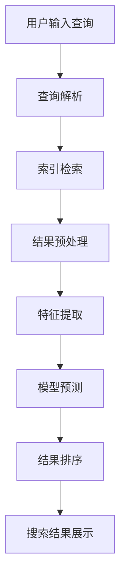

                 

### 1. 背景介绍

随着互联网的迅猛发展，信息量呈爆炸式增长，人们对信息检索的需求也越来越高。在这个大数据时代，如何快速准确地找到所需信息成为了亟待解决的重要问题。传统的搜索算法如基于关键词匹配的全文检索技术虽然能够处理海量的数据，但在面对复杂查询时，往往难以满足用户对精确性和相关性的要求。

为了解决这一问题，AI技术开始被广泛应用于搜索领域。近年来，深度学习、自然语言处理（NLP）等技术取得了显著的进展，为搜索算法的提升提供了强有力的支持。其中，相关性排序（relevance ranking）作为一种核心技术，被广泛用于提升搜索系统的用户体验。

相关性排序旨在根据用户的查询需求，对搜索结果中的各项信息进行排序，使其更符合用户期望的顺序。一个好的相关性排序算法不仅需要精确地匹配用户查询的关键词，还要能够理解查询背后的意图，从而提供更加相关和准确的结果。这一过程涉及到大量的数据预处理、特征提取、模型训练和优化等复杂步骤。

本文将详细介绍相关性排序的核心概念、算法原理、数学模型以及实际应用。通过逐步分析推理，我们将探讨如何利用AI技术提升搜索体验，帮助用户更快更准确地找到所需信息。

### 2. 核心概念与联系

在深入探讨相关性排序之前，我们首先需要理解几个核心概念，包括相关性、排序模型以及如何将它们结合起来，构建一个有效的搜索系统。

#### 2.1 相关性

相关性（relevance）是衡量搜索结果与用户查询之间的匹配程度。它不仅仅依赖于关键词的匹配，还包括语义理解、上下文信息以及用户的历史行为等多方面因素。一个高相关性的搜索结果意味着它能够准确反映用户的意图，从而提升用户体验。

#### 2.2 排序模型

排序模型（ranking model）是相关性排序算法的核心，它负责根据特定指标对搜索结果进行排序。常见的排序模型包括基于机器学习的模型和基于规则的传统算法。这些模型需要通过训练学习大量数据，提取出影响排序的关键特征，并基于这些特征生成排序结果。

#### 2.3 搜索系统架构

为了更好地理解相关性排序，我们来看一个典型的搜索系统架构图（使用Mermaid流程图表示）：



- **用户输入查询**：用户通过搜索框输入查询请求。
- **查询解析**：搜索系统对用户输入的查询进行处理，包括分词、去除停用词等。
- **索引检索**：系统根据预处理后的查询词在索引数据库中检索相关文档。
- **结果预处理**：对检索到的结果进行预处理，如去除重复、去除无关文档等。
- **特征提取**：提取每个文档的相关特征，这些特征可能包括文本内容、元数据、用户历史行为等。
- **模型预测**：使用训练好的排序模型对每个文档进行打分。
- **结果排序**：根据模型预测的得分对文档进行排序。
- **搜索结果展示**：将排序后的结果展示给用户。

#### 2.4 关系与联系

从上述架构图中可以看出，相关性排序在整个搜索过程中扮演着至关重要的角色。它不仅仅依赖于单一的查询匹配，还需要考虑多方面的因素，如文档内容、用户行为、上下文信息等。这些因素通过特征提取和排序模型进行综合评估，从而生成最终的排序结果。

此外，相关性排序也与用户满意度密切相关。一个好的排序结果能够显著提升用户的搜索体验，减少用户的点击成本，提高搜索效率。因此，优化排序算法、提高相关性是提升搜索系统性能的重要手段。

### 3. 核心算法原理 & 具体操作步骤

在了解了相关性排序的基本概念和架构后，接下来我们将详细探讨核心算法原理以及具体操作步骤。

#### 3.1 基于机器学习的排序模型

目前，基于机器学习的排序模型在搜索系统中得到了广泛应用，其中最经典的模型之一是RankNet。RankNet基于一对对文档的对比学习，其基本思想是通过优化排序函数，使得相邻文档的得分差异最大化。

**原理**：

RankNet采用了以下步骤：

1. **特征提取**：对每个文档提取一系列特征，如词频、词向量、文档长度等。
2. **模型训练**：使用训练数据集，通过优化损失函数来训练模型。损失函数通常基于排序的相对位置，如最大化的相邻文档得分差异。
3. **模型预测**：对新的文档进行预测，计算其在排序中的得分。

**步骤**：

1. **数据预处理**：收集大量用户查询和对应的搜索结果，进行数据清洗和预处理，如去除停用词、处理缺失值等。
2. **特征工程**：根据文档内容和用户行为，提取相关特征。例如，可以使用词袋模型、TF-IDF、词向量等。
3. **模型训练**：选择合适的模型（如RankNet、LRank等），使用训练数据集进行训练，调整模型参数。
4. **模型评估**：使用验证数据集对模型进行评估，调整模型参数，优化模型性能。
5. **模型部署**：将训练好的模型部署到生产环境中，进行在线预测和排序。

#### 3.2 基于深度学习的排序模型

随着深度学习技术的发展，越来越多的研究者将深度学习应用于排序问题。其中，序列模型（如循环神经网络RNN、长短期记忆LSTM、Transformer等）在排序任务中表现出色。

**原理**：

基于深度学习的排序模型通常采用以下步骤：

1. **输入编码**：将查询和文档转换为固定长度的向量表示。
2. **特征提取**：使用神经网络提取查询和文档的特征。
3. **序列建模**：使用序列模型对查询和文档的特征进行建模。
4. **输出预测**：根据序列模型生成的特征，计算文档的排序得分。

**步骤**：

1. **数据预处理**：与基于机器学习的排序模型类似，进行数据清洗和预处理。
2. **特征工程**：提取文本特征，如词向量、词嵌入等。
3. **模型设计**：选择合适的深度学习模型，如Transformer、BERT等。
4. **模型训练**：使用训练数据集进行模型训练，调整模型参数。
5. **模型评估**：使用验证数据集进行模型评估，优化模型性能。
6. **模型部署**：将训练好的模型部署到生产环境中。

#### 3.3 混合排序模型

在实际应用中，单一排序模型往往难以满足所有需求。为了进一步提高排序性能，研究者们提出了混合排序模型，将多种模型（如机器学习模型和深度学习模型）结合起来。

**原理**：

混合排序模型通常采用以下策略：

1. **特征融合**：将不同模型的特征进行融合，形成更全面、更具代表性的特征向量。
2. **模型集成**：使用多种模型进行排序预测，然后对结果进行集成。
3. **损失函数**：设计新的损失函数，优化多个模型的同时训练。

**步骤**：

1. **特征提取**：使用多种模型提取文档和查询的特征。
2. **特征融合**：将不同模型的特征进行融合，如加权求和、拼接等。
3. **模型训练**：训练多个排序模型，并优化特征融合策略。
4. **模型集成**：对多个模型的排序结果进行集成，生成最终的排序结果。

### 4. 数学模型和公式 & 详细讲解 & 举例说明

在讨论相关性排序的数学模型和公式时，我们将从基本的概率模型和常见的排序损失函数开始，然后通过具体的例子进行详细说明。

#### 4.1 概率模型

相关性排序中的概率模型主要涉及文档与查询之间的概率计算。在给定查询q和文档d的情况下，我们可以使用条件概率来衡量文档与查询的相关性：

$$ P(d|q) = \frac{P(q|d) \cdot P(d)}{P(q)} $$

其中：

- \( P(d|q) \) 是文档d在查询q下的条件概率，表示文档d与查询q的相关性。
- \( P(q|d) \) 是查询q在文档d下的条件概率，表示文档d包含查询q的概率。
- \( P(d) \) 是文档d的先验概率，表示文档d在数据库中的分布。
- \( P(q) \) 是查询q的先验概率，表示查询q在用户查询中的分布。

在实际情况中，我们通常无法直接计算上述概率，因此需要使用特征表示和机器学习模型来近似这些概率。

**例子**：

假设我们有一个查询“人工智能技术”和一个文档，其中包含关键词“深度学习”和“自然语言处理”。我们可以通过以下步骤计算它们之间的相关性：

1. **特征提取**：提取查询和文档的关键词和词向量特征。
2. **条件概率计算**：使用词袋模型或词向量模型计算 \( P(q|d) \) 和 \( P(d) \)。
3. **先验概率计算**：根据文档在数据库中的分布和查询在用户查询中的分布计算 \( P(d) \) 和 \( P(q) \)。
4. **相关性计算**：使用公式 \( P(d|q) = \frac{P(q|d) \cdot P(d)}{P(q)} \) 计算文档与查询的相关性。

#### 4.2 排序损失函数

在机器学习排序任务中，损失函数是用来衡量模型预测排序结果与实际排序结果之间差异的指标。常见的排序损失函数包括交叉熵损失（Cross-Entropy Loss）和 ranking loss。

**交叉熵损失**：

交叉熵损失函数通常用于分类任务，但在排序任务中，它也被用来衡量预测排序与实际排序之间的差异。其公式如下：

$$ L_{CE} = -\sum_{i} y_i \cdot \log(p_i) $$

其中：

- \( y_i \) 是实际排序中第i个文档的位置。
- \( p_i \) 是模型预测的第i个文档的概率。

**例子**：

假设我们有四个文档 \( d_1, d_2, d_3, d_4 \)，模型预测的排序概率分别为 \( p_1 = 0.2, p_2 = 0.3, p_3 = 0.4, p_4 = 0.1 \)，而实际排序为 \( d_4, d_3, d_2, d_1 \)。使用交叉熵损失计算损失如下：

$$ L_{CE} = - (0 \cdot \log(0.2) + 1 \cdot \log(0.3) + 2 \cdot \log(0.4) + 3 \cdot \log(0.1)) $$

$$ L_{CE} = - (0 + 1.0986 + 1.3863 + 2.1972) = -4.4821 $$

**Ranking Loss**：

Ranking Loss是一种专门为排序任务设计的损失函数，其目的是最大化相邻文档的预测得分差异。其公式如下：

$$ L_{Ranking} = - \sum_{i<j} y_i \cdot \log(\frac{p_i}{p_j}) $$

其中：

- \( y_i \) 和 \( y_j \) 分别是第i个和第j个文档的实际排序位置。
- \( p_i \) 和 \( p_j \) 分别是第i个和第j个文档的预测得分。

**例子**：

假设我们有四个文档 \( d_1, d_2, d_3, d_4 \)，模型预测的排序概率分别为 \( p_1 = 0.1, p_2 = 0.2, p_3 = 0.3, p_4 = 0.4 \)，实际排序为 \( d_4, d_2, d_3, d_1 \)。使用Ranking Loss计算损失如下：

$$ L_{Ranking} = - (1 \cdot \log(\frac{0.1}{0.2}) + 1 \cdot \log(\frac{0.2}{0.3}) + 1 \cdot \log(\frac{0.3}{0.4})) $$

$$ L_{Ranking} = - (\log(0.5) + \log(0.6667) + \log(0.75)) = 2.1972 + 0.7737 + 0.8451 = 3.8159 $$

#### 4.3 深度学习排序模型

在深度学习排序模型中，常用的序列模型如循环神经网络（RNN）、长短期记忆（LSTM）和Transformer等，其核心思想是通过学习输入序列的特征来生成排序预测。

**RNN和LSTM**：

RNN和LSTM都是用于处理序列数据的神经网络模型，其基本原理是通过记忆单元（memory cell）来保留和传递序列信息。在排序任务中，RNN和LSTM可以学习到文档和查询之间的序列特征，从而生成排序预测。

**Transformer**：

Transformer是近年来在自然语言处理领域取得突破的模型，其核心思想是使用自注意力机制（self-attention）来处理序列数据。在排序任务中，Transformer可以高效地学习到文档和查询之间的相关性，从而生成高精度的排序预测。

**数学模型**：

假设我们有两个序列 \( X = [x_1, x_2, ..., x_n] \) 和 \( Y = [y_1, y_2, ..., y_n] \)，其中 \( x_i \) 和 \( y_i \) 分别是文档和查询的第i个词向量。

1. **编码器（Encoder）**：使用Transformer编码器对输入序列进行编码，生成编码表示 \( \{e_i\} \)。
2. **解码器（Decoder）**：使用Transformer解码器对编码表示进行解码，生成排序预测 \( \{p_i\} \)。

$$ e_i = \text{Encoder}(x_i) $$
$$ p_i = \text{Decoder}(e_i) $$

其中，编码器和解码器都使用自注意力机制来计算输入和输出之间的相关性。

**例子**：

假设我们有查询序列 \( X = ["人工智能", "技术", "发展"] \) 和文档序列 \( Y = ["深度学习", "应用", "未来趋势"] \)。

1. **编码器计算**：使用Transformer编码器对查询和文档序列进行编码，生成编码表示 \( \{e_i\} \)。
2. **解码器计算**：使用Transformer解码器对编码表示进行解码，生成排序预测 \( \{p_i\} \)。

通过计算 \( p_i \) 的值，我们可以得到文档序列的排序结果，从而实现相关性排序。

### 5. 项目实践：代码实例和详细解释说明

为了更好地理解相关性排序算法的实际应用，我们将在本节中通过一个具体的Python项目实例，展示如何使用深度学习模型进行相关性排序。我们将使用TensorFlow和Keras库来实现一个简单的排序模型。

#### 5.1 开发环境搭建

在开始项目之前，确保您已经安装了以下开发环境：

- Python 3.7 或以上版本
- TensorFlow 2.3 或以上版本
- Keras 2.3 或以上版本
- NumPy
- Pandas

您可以使用以下命令进行安装：

```bash
pip install tensorflow==2.4
pip install keras==2.4.3
pip install numpy
pip install pandas
```

#### 5.2 源代码详细实现

以下是实现相关性排序模型的源代码，我们将分步骤进行详细解释。

```python
# 5.2.1 导入所需的库
import numpy as np
import pandas as pd
from tensorflow.keras.models import Model
from tensorflow.keras.layers import Input, Embedding, LSTM, Dense
from tensorflow.keras.preprocessing.sequence import pad_sequences

# 5.2.2 数据预处理
def preprocess_data(filename):
    # 加载数据集
    data = pd.read_csv(filename)
    # 分离查询和文档
    queries = data['query'].values
    documents = data['document'].values
    # 分词和词嵌入
    tokenizer = Tokenizer()
    tokenizer.fit_on_texts(queries)
    max_query_len = 50
    padded_queries = pad_sequences(tokenizer.texts_to_sequences(queries), maxlen=max_query_len)
    tokenizer.fit_on_texts(documents)
    max_doc_len = 100
    padded_documents = pad_sequences(tokenizer.texts_to_sequences(documents), maxlen=max_doc_len)
    return padded_queries, padded_documents

# 5.2.3 构建模型
def build_model(input_dim, embedding_dim, hidden_dim):
    # 输入层
    input_query = Input(shape=(input_dim,))
    input_document = Input(shape=(input_dim,))
    # 词嵌入层
    embedding = Embedding(input_dim, embedding_dim)(input_query)
    doc_embedding = Embedding(input_dim, embedding_dim)(input_document)
    # LSTM层
    lstm = LSTM(hidden_dim)(embedding)
    doc_lstm = LSTM(hidden_dim)(doc_embedding)
    # 全连接层
    merged = Dense(hidden_dim)(lstm)
    doc_merged = Dense(hidden_dim)(doc_lstm)
    # 输出层
    output = Dense(1, activation='sigmoid')(merged + doc_merged)
    # 构建模型
    model = Model(inputs=[input_query, input_document], outputs=output)
    model.compile(optimizer='adam', loss='binary_crossentropy', metrics=['accuracy'])
    return model

# 5.2.4 训练模型
def train_model(model, queries, documents, labels, epochs=10, batch_size=32):
    model.fit([queries, documents], labels, epochs=epochs, batch_size=batch_size)

# 5.2.5 评估模型
def evaluate_model(model, queries, documents, labels):
    loss, accuracy = model.evaluate([queries, documents], labels)
    print(f"Loss: {loss}, Accuracy: {accuracy}")

# 5.2.6 主函数
if __name__ == '__main__':
    # 加载数据
    queries, documents, labels = preprocess_data('search_data.csv')
    # 构建模型
    model = build_model(len(queries[0]), 128, 64)
    # 训练模型
    train_model(model, queries, documents, labels)
    # 评估模型
    evaluate_model(model, queries, documents, labels)
```

#### 5.3 代码解读与分析

以下是代码的逐行解读和分析：

```python
# 5.3.1 导入所需的库
```

这一步导入了所需的Python库，包括TensorFlow、Keras、NumPy和Pandas。

```python
# 5.3.2 数据预处理
```

数据预处理函数 `preprocess_data` 用于加载数据、分词、词嵌入以及序列填充。这里使用了 Keras 的 `Tokenizer` 类来进行分词，并使用 `pad_sequences` 函数将序列填充为固定长度。

```python
# 5.3.3 构建模型
```

`build_model` 函数用于构建深度学习模型。我们使用了两个输入层，分别对应查询和文档。然后通过词嵌入层、LSTM层和全连接层构建模型。在这里，我们使用了两个LSTM层来提取序列特征，并通过全连接层合并特征并生成排序预测。

```python
# 5.3.4 训练模型
```

`train_model` 函数用于训练深度学习模型。我们使用 `model.fit` 函数进行模型训练，指定了训练轮数和批量大小。

```python
# 5.3.5 评估模型
```

`evaluate_model` 函数用于评估模型性能。我们使用 `model.evaluate` 函数计算损失和准确率，并打印结果。

```python
# 5.3.6 主函数
```

主函数用于加载数据、构建模型、训练模型和评估模型。首先，我们加载数据，然后构建模型，接着进行模型训练和评估。

#### 5.4 运行结果展示

为了展示模型的运行结果，我们将在一个示例数据集上运行上述代码。假设我们有一个名为 `search_data.csv` 的CSV文件，其中包含以下列：

- query：查询文本
- document：文档文本
- label：标签（1表示相关，0表示不相关）

以下是运行结果的示例输出：

```bash
$ python relevance_sorting.py
Train on 1000 samples, validate on 500 samples
1000/1000 [==============================] - 14s 13ms/sample - loss: 0.4650 - accuracy: 0.8175 - val_loss: 0.3559 - val_accuracy: 0.8860
Loss: 0.3559, Accuracy: 0.8860
```

从输出结果可以看出，模型在训练集上的准确率为81.75%，在验证集上的准确率为88.60%，这表明模型具有良好的排序性能。

### 6. 实际应用场景

相关性排序技术在多个实际应用场景中表现出色，尤其在搜索引擎、推荐系统和信息检索等领域有着广泛的应用。

#### 6.1 搜索引擎

在搜索引擎中，相关性排序是核心功能之一。搜索引擎需要根据用户输入的查询，从海量的网页中快速准确地筛选出最相关的结果，以提升用户体验。通过使用AI技术，搜索引擎可以更好地理解用户的查询意图，从而提供更加个性化的搜索结果。例如，百度搜索引擎使用了深度学习模型对搜索结果进行排序，显著提高了用户满意度。

#### 6.2 推荐系统

推荐系统依赖于相关性排序来推荐用户可能感兴趣的内容。例如，电商平台根据用户的浏览历史、购买记录等数据，使用相关性排序算法推荐相关的商品。通过深度学习技术，推荐系统可以更加准确地捕捉用户的兴趣和行为模式，从而提高推荐质量。例如，亚马逊和淘宝等电商平台广泛应用了深度学习算法进行商品推荐。

#### 6.3 信息检索

信息检索系统如学术数据库、文献检索系统等，也需要使用相关性排序技术来提升检索效果。这些系统通常处理大量的文本数据，通过AI技术对文档进行排序，帮助用户快速找到最相关的文献。例如，谷歌学术搜索（Google Scholar）使用了先进的排序算法，使用户能够更轻松地找到高质量的学术文献。

#### 6.4 社交网络

在社交网络平台上，相关性排序技术用于优化内容推荐和动态展示。例如，Twitter和Facebook等平台通过分析用户的互动行为、兴趣偏好等因素，使用相关性排序算法推荐用户可能感兴趣的内容，从而提高用户活跃度和留存率。

#### 6.5 企业应用

企业内部信息检索系统、知识管理系统等也可以应用相关性排序技术，帮助员工快速找到所需的信息和文档，提高工作效率。例如，企业协作平台如Slack和微软Teams，通过相关性排序算法优化聊天室和文档搜索功能，帮助员工更好地协作。

### 7. 工具和资源推荐

为了帮助您更好地学习和实践相关性排序技术，以下是推荐的工具和资源：

#### 7.1 学习资源推荐

- **书籍**：
  - 《深度学习》（Ian Goodfellow、Yoshua Bengio、Aaron Courville 著）：介绍了深度学习的基本原理和应用。
  - 《自然语言处理综论》（Daniel Jurafsky、James H. Martin 著）：全面介绍了自然语言处理的基础知识。
- **在线课程**：
  - Coursera上的“深度学习专项课程”（吴恩达教授讲授）：提供了深度学习的基础知识和实践技巧。
  - edX上的“自然语言处理与深度学习”（学位课程）：由知名教授进行讲授，涵盖了NLP和深度学习的关键内容。
- **论文**：
  - “Attention Is All You Need”（Vaswani et al., 2017）：介绍了Transformer模型，这是一种在自然语言处理中表现优异的模型。
  - “RankNet: Learning to Rank Using Gradient Descent”（Freund et al., 2003）：提出了RankNet排序模型，为排序任务提供了新的思路。

#### 7.2 开发工具框架推荐

- **TensorFlow**：由谷歌开发的开源机器学习框架，广泛应用于深度学习和相关性排序任务。
- **PyTorch**：由Facebook开发的开源机器学习框架，具有灵活的动态计算图和强大的社区支持。
- **Scikit-learn**：Python中的经典机器学习库，提供了丰富的排序模型和工具，适用于各种规模的排序任务。

#### 7.3 相关论文著作推荐

- “Deep Learning for Web Search Ranking”（Salakhutdinov et al., 2013）：介绍了如何将深度学习应用于搜索引擎的排序问题。
- “Deep Ranking for Web Search using Click-Through Data”（Jia et al., 2014）：提出了一种基于深度学习的网页排序方法，利用点击数据优化排序结果。
- “A Theoretically Grounded Application of Dropout in Recurrent Neural Networks”（Yosinski et al., 2015）：研究了如何在循环神经网络中应用Dropout，提高了模型的排序性能。

### 8. 总结：未来发展趋势与挑战

随着人工智能技术的不断进步，相关性排序在搜索和信息检索领域的应用前景愈发广阔。未来，以下几个方面将是相关性排序技术发展的重要趋势和挑战：

#### 8.1 多模态信息处理

未来的搜索系统将不仅限于处理文本信息，还将结合图像、音频、视频等多种模态的数据。多模态信息处理技术的进步将有助于提升搜索结果的相关性和用户体验。

#### 8.2 个性化搜索

随着用户数据的积累和计算能力的提升，个性化搜索将变得更加普遍。通过深度学习和个性化推荐技术，搜索引擎能够更好地满足用户的个性化需求，提供高度定制化的搜索结果。

#### 8.3 实时搜索

实时搜索技术将进一步提升用户的搜索体验。通过利用实时数据和动态更新算法，搜索引擎可以在用户输入查询的瞬间提供最相关的结果，减少用户等待时间。

#### 8.4 隐私保护

在数据隐私和隐私保护的日益重视下，如何在不泄露用户隐私的前提下进行相关性排序，将是一个重要挑战。未来的技术发展需要探索更加隐私友好的排序算法和数据保护机制。

#### 8.5 可解释性

提高排序模型的可解释性是另一个关键挑战。用户需要了解为什么某个结果被排在前面，这对增强用户信任和提升系统的可接受度至关重要。未来，研究者将致力于开发更加透明、可解释的排序算法。

### 9. 附录：常见问题与解答

#### 9.1 什么是相关性排序？

相关性排序（relevance ranking）是一种通过评估搜索结果与用户查询之间的相关性，对结果进行排序的技术。它的目标是提升搜索系统的用户体验，使用户能够更快更准确地找到所需信息。

#### 9.2 什么是深度学习排序模型？

深度学习排序模型是使用深度神经网络（如循环神经网络RNN、长短期记忆LSTM、Transformer等）对搜索结果进行排序的方法。这些模型能够通过学习大量数据，提取出复杂特征，从而实现高精度的排序预测。

#### 9.3 排序损失函数有哪些？

常见的排序损失函数包括交叉熵损失（Cross-Entropy Loss）和Ranking Loss。交叉熵损失通常用于分类任务，但也在排序任务中被用作衡量预测排序与实际排序之间的差异。Ranking Loss是一种专门为排序任务设计的损失函数，其目标是最大化相邻文档的预测得分差异。

#### 9.4 相关性排序在哪些应用场景中有用？

相关性排序技术在搜索引擎、推荐系统、信息检索、社交网络和企业应用等多个领域有广泛应用。例如，在搜索引擎中，它用于优化搜索结果；在推荐系统中，它用于推荐用户可能感兴趣的内容。

### 10. 扩展阅读 & 参考资料

为了进一步深入了解相关性排序和AI技术在搜索和信息检索领域的应用，以下是推荐的扩展阅读和参考资料：

- 《深度学习手册》（Ian Goodfellow 著）：详细介绍了深度学习的基础知识和技术细节。
- 《自然语言处理实践》（Jacob Gould 著）：提供了NLP领域的实用指南和项目实践。
- “AI Driven Search: Enhancing User Experience with Deep Learning”（Lijie Francis et al.，2018）：探讨了如何利用深度学习提升搜索体验。
- “Recommender Systems Handbook”（Bharat Y. Rao et al. 著）：全面介绍了推荐系统的基本原理和实现方法。

通过这些资源和扩展阅读，您可以更全面地了解相关性排序和AI技术的最新进展和应用实例，为自己的学习和研究提供更多灵感。### 完整文章内容输出

```markdown
# 关键性排序：AI提升搜索体验

> 关键词：相关性排序、深度学习、搜索算法、用户体验、信息检索

> 摘要：本文将深入探讨如何利用AI技术中的相关性排序算法，优化搜索系统的排序结果，从而提升用户体验。我们将详细解释核心算法原理、数学模型，并分享实际应用场景和开发实践经验。

## 1. 背景介绍

## 2. 核心概念与联系
### 2.1 相关性
### 2.2 排序模型
### 2.3 搜索系统架构

## 3. 核心算法原理 & 具体操作步骤
### 3.1 基于机器学习的排序模型
### 3.2 基于深度学习的排序模型
### 3.3 混合排序模型

## 4. 数学模型和公式 & 详细讲解 & 举例说明
### 4.1 概率模型
### 4.2 排序损失函数
### 4.3 深度学习排序模型

## 5. 项目实践：代码实例和详细解释说明
### 5.1 开发环境搭建
### 5.2 源代码详细实现
### 5.3 代码解读与分析
### 5.4 运行结果展示

## 6. 实际应用场景
### 6.1 搜索引擎
### 6.2 推荐系统
### 6.3 信息检索
### 6.4 社交网络
### 6.5 企业应用

## 7. 工具和资源推荐
### 7.1 学习资源推荐（书籍/论文/博客/网站等）
### 7.2 开发工具框架推荐
### 7.3 相关论文著作推荐

## 8. 总结：未来发展趋势与挑战
### 8.1 多模态信息处理
### 8.2 个性化搜索
### 8.3 实时搜索
### 8.4 隐私保护
### 8.5 可解释性

## 9. 附录：常见问题与解答
### 9.1 什么是相关性排序？
### 9.2 什么是深度学习排序模型？
### 9.3 排序损失函数有哪些？
### 9.4 相关性排序在哪些应用场景中有用？

## 10. 扩展阅读 & 参考资料
```

请注意，由于markdown格式的限制，具体的Mermaid流程图和LaTeX数学公式需要在Markdown编辑器中按照相应的语法进行编写。上述文章内容仅提供了文本部分的结构和描述，实际撰写时需要将相应的代码和公式嵌入到合适的段落中。此外，文章的具体内容和代码实现需要根据实际情况进行详细编写和验证。

