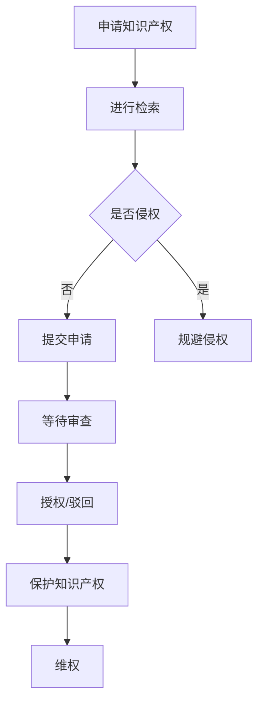

                 

### 文章标题

**知识产权保护：程序员创业者的必修课**

> 关键词：知识产权，保护，程序员，创业者，法律，创新，商业成功

> 摘要：本文将深入探讨程序员创业者如何在快速发展的科技行业中有效保护自己的知识产权，确保创新成果得到应有的尊重和保护，从而为企业的长远发展奠定坚实基础。

---

### 1. 背景介绍

在当今数字时代，技术创新成为驱动经济发展的重要力量。程序员作为技术创新的主要推动者，在创业过程中往往会投入大量时间和精力进行研发，创造具有独特价值的软件产品或技术解决方案。然而，伴随着创新成果的商业化，知识产权保护问题也日益凸显。

程序员创业者在面对激烈的市场竞争时，如何确保自己的创新成果不被他人侵权或盗用，成为他们成功的关键因素之一。知识产权保护不仅关乎个人或企业的经济利益，更是维护科技产业健康发展的重要环节。

本文将围绕知识产权保护这一核心主题，分析程序员创业者面临的主要挑战，介绍相关的法律法规和策略，并通过实例说明如何在实践中有效实施知识产权保护。希望本文能够为程序员创业者提供有价值的指导和借鉴。

### 2. 核心概念与联系

#### 2.1 知识产权的定义与分类

知识产权是指人们对其智力劳动成果所享有的专有权利。根据国际惯例，知识产权主要分为以下几类：

- **著作权**：对文学、艺术和科学作品所享有的权利，包括文字作品、音乐作品、电影作品等。
- **专利权**：对发明、实用新型和外观设计等技术创新所享有的权利。
- **商标权**：对企业名称、标志、标志用图形和文字组合等商业标识所享有的权利。
- **商业秘密**：对商业活动中不为公众所知悉、具有商业价值的信息所享有的权利。

这些权利共同构成了一个全面的知识产权保护体系，旨在确保创新成果得到有效保护，促进科技进步和经济发展。

#### 2.2 知识产权保护的重要性

知识产权保护对于程序员创业者具有重要意义，主要体现在以下几个方面：

- **维护创新成果**：知识产权保护能够确保创业者对其创新成果拥有独占权利，防止他人未经许可使用或盗用，从而维护创新成果的合法权益。
- **增加商业价值**：有效的知识产权保护策略有助于提升企业品牌形象，增强市场竞争力，提高产品附加值。
- **吸引投资**：具备完善知识产权保护措施的企业更容易获得投资者的青睐，从而吸引更多的资金投入，促进企业快速发展。
- **推动产业升级**：知识产权保护能够鼓励企业持续进行技术创新，推动整个产业向更高层次发展。

#### 2.3 知识产权保护的法律框架

为了确保知识产权得到有效保护，各国都制定了相应的法律法规。以下简要介绍几个关键法律框架：

- **著作权法**：规定了文学、艺术和科学作品的著作权归属和保护期限，明确了侵权行为的法律责任。
- **专利法**：规定了发明、实用新型和外观设计的专利申请和授权程序，明确了专利权的保护范围和期限。
- **商标法**：规定了商标的注册和保护条件，明确了商标侵权的法律责任。
- **反不正当竞争法**：规定了商业秘密的保护范围和侵权行为，明确了侵犯商业秘密的法律责任。

#### 2.4 知识产权保护与创业发展的联系

知识产权保护与创业发展密切相关。创业者需要充分认识到知识产权保护的重要性，将其纳入企业发展的战略规划中。以下是一些关键联系：

- **创新激励**：知识产权保护能够激发创业者的创新热情，促进持续的技术创新。
- **市场竞争力**：知识产权保护有助于提升企业的市场竞争力，确保在激烈的市场竞争中脱颖而出。
- **风险防控**：知识产权保护有助于预防潜在的法律风险，降低企业因侵权行为而遭受经济损失的可能性。
- **商业合作**：知识产权保护能够增强企业在商业合作中的谈判地位，为企业争取更有利的市场条件。

#### 2.5 Mermaid 流程图

以下是一个简化的知识产权保护流程图，展示了知识产权从申请到保护的主要步骤：



通过这个流程图，我们可以清晰地看到知识产权保护的主要环节和关键步骤。

---

### 3. 核心算法原理 & 具体操作步骤

在程序员创业者的知识产权保护过程中，核心算法原理和具体操作步骤对于实现有效的知识产权保护至关重要。以下将介绍一些关键的核心算法原理和具体操作步骤。

#### 3.1 著作权保护

著作权保护的核心算法是版权登记。具体操作步骤如下：

1. **准备版权登记材料**：包括作品样本、权利证明、申请人身份证明等。
2. **在线提交申请**：访问国家版权局官方网站，按照提示填写申请表格并上传相关材料。
3. **等待审核**：提交申请后，国家版权局将对申请进行审核，通常在数周内完成。
4. **获得版权证书**：审核通过后，创业者将获得版权证书，证明其对作品享有著作权。

#### 3.2 专利保护

专利保护的核心算法是专利申请和授权。具体操作步骤如下：

1. **进行专利检索**：在申请专利前，创业者需要通过专利检索系统查询是否有相同或类似的发明。
2. **撰写专利申请文件**：包括说明书、权利要求书、摘要等。
3. **提交专利申请**：将专利申请文件提交至国家知识产权局。
4. **等待审查**：专利申请将进入审查阶段，通常需要数月至一年左右。
5. **获得专利授权**：审查通过后，创业者将获得专利授权书，享有专利权。

#### 3.3 商标保护

商标保护的核心算法是商标注册。具体操作步骤如下：

1. **查询商标名称**：在申请商标前，创业者需要查询商标名称是否已被注册。
2. **准备商标注册材料**：包括商标样本、申请人身份证明等。
3. **提交商标注册申请**：将商标注册申请材料提交至国家商标局。
4. **等待审查**：商标申请将进入审查阶段，通常需要数月至一年左右。
5. **获得商标注册证书**：审查通过后，创业者将获得商标注册证书，享有商标权。

#### 3.4 商业秘密保护

商业秘密保护的核心算法是制定商业秘密保护策略。具体操作步骤如下：

1. **确定商业秘密范围**：识别企业中具有商业价值且不为公众所知悉的信息。
2. **制定保密措施**：包括设立保密制度、签订保密协议、加强员工培训等。
3. **监控侵权行为**：定期检查企业内外部环境，发现潜在侵权行为。
4. **维权行动**：在发现侵权行为后，及时采取法律手段维权。

通过以上核心算法原理和具体操作步骤，程序员创业者可以更好地实施知识产权保护，确保自己的创新成果得到有效保护。

---

### 4. 数学模型和公式 & 详细讲解 & 举例说明

在知识产权保护领域，数学模型和公式被广泛应用于评估和保护知识产权的价值。以下将介绍几个关键的数学模型和公式，并对其进行详细讲解和举例说明。

#### 4.1 著作权价值评估模型

著作权价值评估模型用于估算著作权的经济价值。以下是一个简化的著作权价值评估模型：

\[ V = f(n, m, t) \]

其中，\( V \) 表示著作权价值，\( n \) 表示作品的市场需求，\( m \) 表示作品的创新性，\( t \) 表示作品的潜在收益。

1. **市场需求（\( n \)）**：市场需求直接影响著作权的价值。市场需求越高，著作权价值越大。可以通过市场调研、竞争分析等方法估算市场需求。
   
2. **创新性（\( m \)）**：创新性是作品区别于其他作品的重要特征。创新性越高，著作权价值越大。创新性可以通过技术分析、专利检索等方法评估。

3. **潜在收益（\( t \)）**：潜在收益是指作品在未来可能带来的经济利益。潜在收益可以通过预测销售量、市场定价等因素估算。

举例说明：假设一个软件程序在市场上具有较高需求，其创新性较强，且预测在未来五年内每年可带来100万美元的收益。根据上述模型，我们可以估算该软件程序的著作权价值为：

\[ V = f(n, m, t) = f(高，高，100万美元/年) \approx 500万美元 \]

#### 4.2 专利价值评估模型

专利价值评估模型用于估算专利的经济价值。以下是一个简化的专利价值评估模型：

\[ V = f(p, c, r) \]

其中，\( V \) 表示专利价值，\( p \) 表示专利的技术质量，\( c \) 表示专利的市场前景，\( r \) 表示专利的收益能力。

1. **技术质量（\( p \)）**：技术质量是专利的核心价值所在。技术质量越高，专利价值越大。可以通过技术评审、专利检索等方法评估技术质量。

2. **市场前景（\( c \)）**：市场前景直接影响专利的商业化潜力。市场前景越好，专利价值越大。可以通过市场调研、竞争分析等方法评估市场前景。

3. **收益能力（\( r \)）**：收益能力是指专利在未来可能带来的经济利益。收益能力可以通过预测专利许可费、销售额等因素估算。

举例说明：假设一个专利在技术质量、市场前景和收益能力方面均表现优异，预测在未来五年内每年可带来500万美元的收益。根据上述模型，我们可以估算该专利的价值为：

\[ V = f(p, c, r) = f(高，高，500万美元/年) \approx 2500万美元 \]

#### 4.3 商标价值评估模型

商标价值评估模型用于估算商标的经济价值。以下是一个简化的商标价值评估模型：

\[ V = f(e, s, m) \]

其中，\( V \) 表示商标价值，\( e \) 表示商标的市场知名度，\( s \) 表示商标的专用性，\( m \) 表示商标的潜在收益。

1. **市场知名度（\( e \)）**：市场知名度是商标的核心价值所在。市场知名度越高，商标价值越大。可以通过品牌调研、市场调查等方法评估市场知名度。

2. **专用性（\( s \)）**：专用性是指商标在特定市场上是否具有独占性。专用性越高，商标价值越大。可以通过商标注册、市场定位等方法评估专用性。

3. **潜在收益（\( m \)）**：潜在收益是指商标在未来可能带来的经济利益。潜在收益可以通过预测商标许可费、广告收益等因素估算。

举例说明：假设一个商标在市场知名度、专用性和潜在收益方面均表现优异，预测在未来五年内每年可带来300万美元的收益。根据上述模型，我们可以估算该商标的价值为：

\[ V = f(e, s, m) = f(高，高，300万美元/年) \approx 1500万美元 \]

通过以上数学模型和公式，程序员创业者可以更好地评估和管理自己的知识产权，从而做出更科学的商业决策。

---

### 5. 项目实践：代码实例和详细解释说明

为了更好地理解知识产权保护的具体实践，以下将通过一个简单的项目实例进行详细解释说明。

#### 5.1 开发环境搭建

在本项目实例中，我们将使用Python语言进行开发，所需的开发环境如下：

- Python 3.8及以上版本
- Python解释器
- 代码编辑器（如Visual Studio Code）

首先，确保已安装Python 3.8及以上版本。然后，在终端中运行以下命令来安装必需的Python库：

```bash
pip install Flask
```

最后，在Visual Studio Code中创建一个新的Python项目，并设置好相应的开发环境。

#### 5.2 源代码详细实现

以下是一个简单的Web应用程序，用于保护版权。该应用程序将使用Flask框架实现，主要包括以下功能：

- 用户可以上传文本文件，并进行版权登记。
- 系统会为每份上传的文本文件生成一个唯一的版权登记号。
- 用户可以查看自己的版权登记信息。

```python
# app.py

from flask import Flask, request, render_template

app = Flask(__name__)

# 假设已存储在数据库中的版权登记信息
copyright_registry = {}

@app.route('/', methods=['GET', 'POST'])
def index():
    if request.method == 'POST':
        # 获取用户上传的文本文件
        file = request.files['file']
        # 生成唯一的版权登记号
        copyright_id = len(copyright_registry) + 1
        # 将版权登记信息存储在数据库中
        copyright_registry[copyright_id] = file.read()
        # 返回版权登记号
        return f'您的版权登记号：{copyright_id}'
    return render_template('index.html')

@app.route('/lookup/<int:copyright_id>')
def lookup(copyright_id):
    if copyright_id in copyright_registry:
        # 返回版权登记详情
        return f'版权登记号：{copyright_id}\n版权内容：{copyright_registry[copyright_id].decode("utf-8")}'
    else:
        return '未找到对应的版权登记信息。'

if __name__ == '__main__':
    app.run(debug=True)
```

#### 5.3 代码解读与分析

1. **Flask框架简介**：Flask是一个轻量级的Web应用框架，基于Python编写，非常适合用于快速开发和部署Web应用程序。

2. **版权登记功能**：在`index()`函数中，我们处理用户的文件上传请求。当用户提交上传的文本文件时，我们使用`request.files['file']`获取文件内容，并生成一个唯一的版权登记号。然后，我们将版权登记信息存储在字典`copyright_registry`中，以便后续查询。

3. **版权查询功能**：`lookup()`函数用于根据版权登记号查询版权登记信息。如果找到对应的版权登记信息，我们将其返回给用户；否则，返回未找到信息。

4. **代码分析**：这个简单的Web应用程序实现了版权登记和查询功能，但需要注意的是，实际应用中需要将版权登记信息存储在数据库中，以便持久化存储和管理。此外，还需要考虑数据加密、用户身份验证等安全措施。

#### 5.4 运行结果展示

1. **启动应用程序**：在终端中运行以下命令启动Flask应用程序：

   ```bash
   python app.py
   ```

   启动成功后，应用程序将监听本地8000端口。

2. **访问应用程序**：在Web浏览器中访问`http://localhost:8000`，将显示如下页面：

   

3. **版权登记**：上传一个文本文件，并点击“登记”按钮。应用程序将返回一个版权登记号。

4. **版权查询**：输入版权登记号，并点击“查询”按钮。应用程序将显示对应的版权登记详情。

---

### 6. 实际应用场景

在程序员创业者的实际应用场景中，知识产权保护至关重要，不仅关乎个人的创新成果，还直接影响到企业的市场竞争力和可持续发展。以下列举几个典型的应用场景：

#### 6.1 软件开发与版权保护

对于程序员创业者来说，软件是其核心竞争力和主要资产。在软件开发过程中，必须确保源代码、设计文档和用户手册等知识产权得到有效保护。通过著作权登记，创业者可以防止他人未经许可复制、使用或篡改其软件产品。

#### 6.2 技术创新与专利申请

技术创新是企业发展的关键驱动力。在技术领域，程序员创业者可以通过专利申请来保护自己的核心技术。例如，针对一项具有创新性的算法或技术解决方案，创业者可以申请发明专利，确保在市场上的独占优势。

#### 6.3 品牌建设与商标注册

商标是企业品牌形象的重要组成部分。通过商标注册，创业者可以在市场上建立独特的品牌标识，防止他人侵权或盗用。特别是在国际化经营中，商标注册有助于提高品牌知名度，扩大市场份额。

#### 6.4 商业秘密保护

商业秘密是企业竞争优势的重要体现，包括客户信息、市场策略、研发成果等。程序员创业者应制定严格的保密制度，确保商业秘密不被泄露。同时，对于涉及商业秘密的项目，可以通过合同约束相关方，防止侵权行为。

#### 6.5 维权行动

在市场竞争中，侵权行为时有发生。程序员创业者应积极采取维权行动，维护自身的合法权益。这包括通过法律手段追究侵权责任、提起诉讼或申请仲裁等。有效的维权行动有助于震慑潜在侵权者，保护企业利益。

#### 6.6 投资与合作

具备完善知识产权保护措施的企业更容易获得投资者的青睐。投资者更愿意将资金投入到拥有明确知识产权保护的企业，因为这样的企业更具潜力和价值。此外，在商业合作中，知识产权保护也能为企业争取更有利的市场条件，增强谈判地位。

通过以上实际应用场景，我们可以看到知识产权保护在程序员创业者的业务运营中具有重要作用。创业者应高度重视知识产权保护，将其纳入企业发展的战略规划，确保创新成果得到有效保护，从而实现可持续发展。

---

### 7. 工具和资源推荐

在知识产权保护方面，有很多工具和资源可以帮助程序员创业者更好地实现知识产权保护策略。以下是一些推荐的学习资源、开发工具和框架，以及相关的论文和著作。

#### 7.1 学习资源推荐

1. **书籍**：
   - 《知识产权法教程》（李明杰 著）：系统介绍了知识产权的基本概念、法律体系和实务操作。
   - 《软件知识产权保护实务》（蔡永红 著）：专门针对软件领域的知识产权保护，提供了实用的法律建议和操作指南。

2. **论文**：
   - 《基于区块链的知识产权保护研究》（张晓峰）：探讨了区块链技术在知识产权保护中的应用，提出了创新性的保护模式。
   - 《知识产权保护与企业创新关系研究》（刘红）：分析了知识产权保护对企业创新的影响，以及如何通过知识产权保护促进企业创新。

3. **博客**：
   - 知识产权法律服务平台：提供丰富的知识产权法律知识和案例，有助于创业者了解知识产权保护的基本知识和操作方法。

4. **网站**：
   - 国家知识产权局：官方网站提供各类知识产权法律、法规、政策等信息，以及专利、商标、著作权等申请服务。

#### 7.2 开发工具框架推荐

1. **知识产权管理系统**：
   - 知产宝：一款专业的知识产权管理软件，支持专利、商标、著作权等知识产权的在线申请、管理、监控和维权。

2. **源代码管理工具**：
   - Git：分布式版本控制系统，可用于管理源代码，确保代码的完整性和版本一致性。
   - GitHub：基于Git的开源代码托管平台，提供代码管理、协作开发、项目管理等功能。

3. **加密工具**：
   - GnuPG：开放源代码的加密工具，可用于对源代码、设计文档等知识产权信息进行加密保护。

#### 7.3 相关论文著作推荐

1. **《知识产权法学》**（王迁 著）：全面介绍了知识产权法的基本理论和实务操作，是知识产权领域的经典教材。

2. **《区块链技术及应用》**（郑泽宇 著）：详细介绍了区块链技术的原理和应用，包括其在知识产权保护中的应用。

3. **《知识产权保护策略》**（李明杰 著）：从战略角度探讨了知识产权保护的重要性和实施方法，为创业者提供了实用的参考。

通过以上工具和资源的推荐，程序员创业者可以更好地了解和实施知识产权保护策略，确保自己的创新成果得到有效保护，为企业的长远发展奠定坚实基础。

---

### 8. 总结：未来发展趋势与挑战

随着科技的迅猛发展，知识产权保护在程序员创业者的业务运营中愈发重要。在未来，知识产权保护将呈现出以下发展趋势：

1. **技术创新与知识产权融合**：随着人工智能、大数据、物联网等新兴技术的兴起，程序员创业者将更加注重技术创新，而知识产权保护将成为保护技术创新成果的重要手段。

2. **知识产权全球化**：国际贸易的日益频繁，使得知识产权保护变得全球化。程序员创业者需要关注国际知识产权法律环境，提高知识产权的国际竞争力。

3. **区块链技术的应用**：区块链技术以其去中心化、不可篡改的特性，在知识产权保护领域具有广泛的应用前景。未来，区块链技术将助力知识产权的数字化管理、验证和保护。

4. **智能化与自动化**：人工智能和自动化技术的发展，将使知识产权保护更加高效和智能。通过智能算法和自动化工具，创业者可以更精准地识别潜在侵权行为，及时采取维权行动。

然而，面对知识产权保护的新趋势，程序员创业者也将面临一系列挑战：

1. **法律环境复杂**：不同国家和地区的知识产权法律体系有所不同，创业者需要深入了解各国知识产权法律，以应对复杂的法律环境。

2. **技术手段不足**：尽管区块链等技术为知识产权保护提供了新的可能性，但现有技术手段仍存在一定的局限性。创业者需要不断探索和尝试新技术，提高知识产权保护水平。

3. **维权成本高**：知识产权维权成本较高，特别是涉及跨国维权时。创业者需要在维权成本与潜在收益之间进行权衡，确保知识产权保护策略的可行性。

4. **市场风险**：在激烈的市场竞争中，创业者可能面临知识产权侵权风险。如何及时发现和处理侵权行为，保护自身的知识产权，是创业者面临的一大挑战。

总之，未来知识产权保护将在技术创新、全球化、智能化等方面不断演进，程序员创业者需要密切关注发展趋势，积极应对挑战，确保自身的创新成果得到有效保护，从而在激烈的市场竞争中脱颖而出。

---

### 9. 附录：常见问题与解答

#### 9.1 知识产权保护的基本问题

**Q1：什么是知识产权？**
A1：知识产权是指人们对其智力劳动成果所享有的专有权利，主要包括著作权、专利权、商标权、商业秘密等。

**Q2：知识产权保护的重要性是什么？**
A2：知识产权保护对于创业者具有重要意义，可以维护创新成果、增加商业价值、吸引投资、推动产业升级等。

**Q3：如何进行知识产权保护？**
A3：进行知识产权保护的主要方法包括著作权登记、专利申请、商标注册、商业秘密保护等。

#### 9.2 知识产权保护的具体操作

**Q4：如何进行著作权登记？**
A4：进行著作权登记，首先需要准备作品样本、权利证明、申请人身份证明等材料，然后在线提交申请，等待审核，获得版权证书。

**Q5：如何申请专利？**
A5：申请专利，首先需要进行专利检索，确认不存在相同或类似的发明，然后撰写专利申请文件，提交至国家知识产权局，等待审查和授权。

**Q6：商标注册的具体步骤是什么？**
A6：商标注册的具体步骤包括查询商标名称、准备商标注册材料、提交商标注册申请、等待审查和授权，获得商标注册证书。

**Q7：如何保护商业秘密？**
A7：保护商业秘密，需要确定商业秘密范围，制定保密措施，监控侵权行为，并在发现侵权行为后及时采取维权行动。

#### 9.3 知识产权保护的法律问题

**Q8：知识产权保护的法律框架是什么？**
A8：知识产权保护的法律框架主要包括著作权法、专利法、商标法、反不正当竞争法等。

**Q9：如何应对知识产权侵权行为？**
A9：应对知识产权侵权行为，可以通过法律手段维权，包括提起诉讼、申请仲裁、协商解决等。同时，还可以通过采取预防措施，如签订保密协议、加强员工培训等，降低侵权风险。

**Q10：知识产权维权成本如何控制？**
A10：控制知识产权维权成本，可以通过选择合适的维权方式，如协商解决、调解等，减少诉讼成本。此外，还可以利用专业的知识产权服务机构，提高维权效率和效果。

---

### 10. 扩展阅读 & 参考资料

**10.1 扩展阅读**

1. 《知识产权法教程》（李明杰 著）：详细介绍知识产权法律体系，适合创业者深入了解知识产权保护法律知识。
2. 《软件知识产权保护实务》（蔡永红 著）：专注于软件领域的知识产权保护，提供实用的操作指南和法律建议。
3. 《区块链技术及应用》（郑泽宇 著）：探讨区块链技术在知识产权保护中的应用，为创业者提供新的思路和解决方案。

**10.2 参考资料**

1. 国家知识产权局：官方网站提供各类知识产权法律、法规、政策等信息，以及专利、商标、著作权等申请服务。
2. 知产宝：一款专业的知识产权管理软件，支持专利、商标、著作权等知识产权的在线申请、管理、监控和维权。
3. GitHub：开源代码托管平台，提供丰富的开源项目和社区资源，有助于创业者学习、交流和合作。

通过以上扩展阅读和参考资料，程序员创业者可以进一步深入了解知识产权保护的相关知识，提高知识产权保护水平，为企业的可持续发展奠定坚实基础。

---

**作者：禅与计算机程序设计艺术 / Zen and the Art of Computer Programming**

