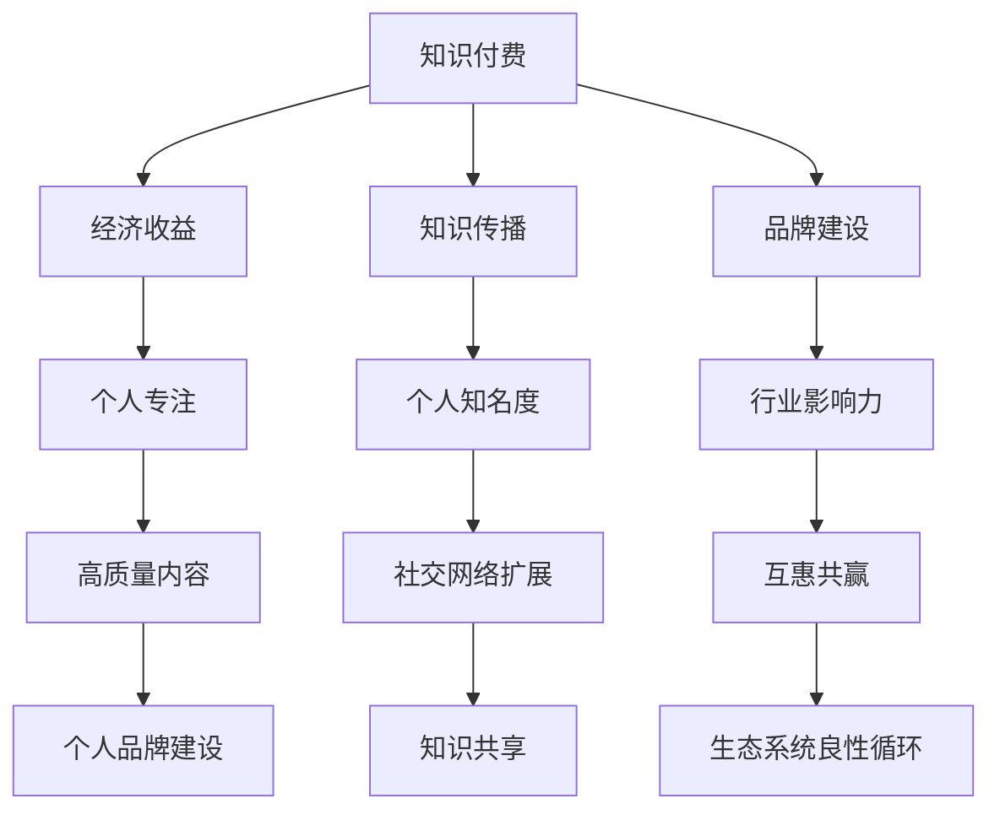

                 

### 1. 背景介绍

知识付费与个人影响力提升，是当今信息社会中两个至关重要的议题。知识付费，指的是用户为获取特定知识或技能而支付费用的一种服务模式。随着互联网技术的发展，知识付费已经从传统的线下培训、图书销售，扩展到了在线课程、知识分享平台等多元化形式。而个人影响力提升，则是指通过个人品牌的建设、知识传播和社交网络的作用，增强个体在社会中的认知度和影响力。

这两者之间的关系并非孤立存在，而是相互促进、相辅相成的。知识付费能够为知识的提供者带来经济收益，激发更多高质量内容的创作与分享，从而提升整个知识生态系统的活力。另一方面，个人影响力的提升有助于扩大知识的传播范围，使得优质知识得以更广泛地传播和应用，进而形成正向循环。

在本文中，我们将深入探讨知识付费与个人影响力提升之间的双向促进作用。我们将首先介绍知识付费的背景和发展趋势，然后分析个人影响力提升的方法和策略，接着通过具体的案例分析这两者之间的相互作用，最后提出未来发展趋势与挑战，并给出相应的建议和策略。

通过这篇文章，我们希望能够为从事知识付费和个人影响力提升的从业者提供有价值的参考，帮助他们更好地理解这两者之间的内在联系，从而在实践中实现更好的效果。

### 2. 核心概念与联系

要深入探讨知识付费与个人影响力提升的双向促进，我们首先需要明确几个核心概念，包括知识付费、个人影响力、以及这两者之间的相互关系。

#### 2.1 知识付费

知识付费是一种商业模式，用户为获取特定的知识或技能，通过支付一定费用来获取这些资源。知识付费的兴起源于信息爆炸的时代背景，随着互联网技术的发展，尤其是移动互联网的普及，人们获取知识的途径更加多样化。知识付费的核心在于提供有价值、有深度的知识内容，满足用户在职业发展、技能提升、兴趣爱好等方面的需求。

知识付费的形式多种多样，包括在线课程、电子书、专业文章、知识问答等。这些形式各有特点，但都旨在通过付费机制筛选出高质量的内容，使得用户能够以更高效、更有针对性的方式获取所需知识。

#### 2.2 个人影响力

个人影响力是指个体在社会中因专业知识、经验、个人魅力等因素所产生的影响力。个人影响力的提升不仅能够增强个体的职业竞争力，还能为个人品牌的建立打下坚实的基础。个人影响力主要体现在以下几个方面：

1. **知识传播**：通过写作、演讲、线上课程等形式，将个人的专业知识、经验和见解分享给他人，从而在特定领域内建立权威性。
2. **社交网络**：通过社交平台、专业社区等，与行业内的其他专家、意见领袖建立联系，扩大个人的社交圈子，增强个人的影响力。
3. **品牌建设**：通过个人品牌的建设，将个人的专业形象、价值观和生活方式等传达给公众，从而获得广泛的认同和支持。

#### 2.3 知识付费与个人影响力的关系

知识付费与个人影响力之间存在密切的关联，具体体现在以下几个方面：

1. **经济收益**：知识付费为知识提供者带来了经济收益，这不仅激励了更多高质量内容的创作与分享，也为知识提供者提供了持续发展的动力。通过知识付费，个人能够实现经济独立，从而更加专注于专业领域的研究和知识传播。
2. **知识传播**：知识付费促进了知识的广泛传播，使得优质内容得以更广泛地接触和传播。在这个过程中，个人影响力的提升也成为了可能。高质量的知识内容往往能够吸引更多人的关注，从而提升个人的知名度和社会影响力。
3. **品牌建设**：知识付费不仅为个人带来了经济收益，还为其个人品牌的建设提供了重要的素材和基础。通过持续的知识输出和专业形象的塑造，个人能够逐步建立起强大的个人品牌，从而在行业内获得更高的认知度和影响力。
4. **互惠共赢**：知识付费与个人影响力提升之间的互动关系，形成了一个互惠共赢的生态系统。知识付费为个人提供了经济支持，使其能够更好地专注于专业领域；而个人影响力的提升则有助于知识付费的推广和传播，形成良性循环。

#### 2.4 Mermaid 流程图

为了更直观地展示知识付费与个人影响力提升之间的相互关系，我们可以使用 Mermaid 流程图进行说明。以下是 Mermaid 流程图的基本结构和各个节点：



在这个流程图中，A 表示知识付费，B、C、D 分别表示其带来的经济收益、知识传播和品牌建设。E、F、G 表示这些收益和传播如何转化为个人专注、知名度和行业影响力。H、I、J、K、L、M 则分别表示这些因素如何相互影响，形成互惠共赢的生态系统。

通过这个 Mermaid 流程图，我们可以更清晰地理解知识付费与个人影响力提升之间的相互关系和作用机制。

### 3. 核心算法原理 & 具体操作步骤

在深入探讨知识付费与个人影响力提升的双向促进之前，我们需要先了解一些核心算法原理和具体操作步骤。这些原理和步骤不仅有助于我们更好地理解这两者之间的内在联系，还能为我们在实际操作中提供指导和参考。

#### 3.1 个人影响力计算算法

个人影响力计算算法是衡量个体在社会中影响力大小的重要工具。以下是几种常见的个人影响力计算算法：

1. **社交网络影响力算法**

社交网络影响力算法主要基于个体在社交网络中的活跃度和互动情况来计算其影响力。常见的算法包括：

- **Katz中心性算法**：通过计算个体在社交网络中的度、介数和接近中心性等指标，综合评估其影响力。

- **PageRank算法**：基于链接分析，通过计算个体在社交网络中的入度、出度和链接权重，评估其影响力。

具体步骤如下：

- 步骤1：建立社交网络图，记录个体之间的连接关系。

- 步骤2：计算每个个体的度、介数和接近中心性等指标。

- 步骤3：根据算法模型，计算个体的影响力得分。

2. **内容影响力算法**

内容影响力算法主要基于个体所发布的内容的质量、传播范围和用户互动情况来计算其影响力。常见的算法包括：

- **点赞数、评论数、分享数**：通过计算内容在社交平台上的点赞、评论和分享数量，评估其影响力。

- **传播深度和广度**：通过计算内容的传播层级和覆盖用户数量，评估其影响力。

具体步骤如下：

- 步骤1：收集个体在社交平台上发布的内容数据。

- 步骤2：计算每个内容的点赞数、评论数、分享数等指标。

- 步骤3：计算内容的传播深度和广度。

- 步骤4：根据算法模型，计算个体的影响力得分。

3. **综合影响力算法**

综合影响力算法将社交网络影响力和内容影响力结合起来，综合评估个体的整体影响力。常见的算法包括：

- **综合影响力得分**：将社交网络影响力和内容影响力得分进行加权求和，得到个体的综合影响力得分。

- **影响力评分模型**：基于历史数据，构建一个回归模型或神经网络模型，预测个体的综合影响力得分。

具体步骤如下：

- 步骤1：收集个体在社交网络中的互动数据（如度、介数、接近中心性等）和内容数据（如点赞数、评论数、分享数、传播深度和广度等）。

- 步骤2：根据历史数据，建立回归模型或神经网络模型。

- 步骤3：输入个体的互动数据和内容数据，预测其综合影响力得分。

#### 3.2 知识付费平台推荐算法

知识付费平台推荐算法是帮助用户发现和选择高质量知识内容的重要工具。以下是几种常见的知识付费平台推荐算法：

1. **基于内容的推荐算法**

基于内容的推荐算法通过分析用户历史行为和内容特征，为用户推荐相似的内容。常见的算法包括：

- **相似度计算**：通过计算用户历史行为和内容特征之间的相似度，推荐相似的内容。

- **协同过滤**：通过分析用户历史行为数据，找到相似用户，并推荐这些用户喜欢的内容。

具体步骤如下：

- 步骤1：收集用户历史行为数据（如学习记录、购买记录等）和内容特征数据（如课程标签、主题、难度等）。

- 步骤2：计算用户历史行为和内容特征之间的相似度。

- 步骤3：根据相似度，为用户推荐相似的内容。

2. **基于用户的推荐算法**

基于用户的推荐算法通过分析用户之间的相似性，为用户推荐其他用户喜欢的知识内容。常见的算法包括：

- **用户协同过滤**：通过分析用户历史行为数据，找到相似用户，并推荐这些用户喜欢的内容。

- **基于兴趣的推荐**：通过分析用户的兴趣标签、关注内容等，为用户推荐符合其兴趣的知识内容。

具体步骤如下：

- 步骤1：收集用户历史行为数据（如学习记录、购买记录等）和用户兴趣标签数据。

- 步骤2：计算用户之间的相似性。

- 步骤3：根据用户相似性，为用户推荐其他用户喜欢的知识内容。

3. **混合推荐算法**

混合推荐算法将基于内容的推荐算法和基于用户的推荐算法结合起来，为用户推荐更准确、更个性化的知识内容。常见的算法包括：

- **加权混合推荐**：将基于内容的推荐和基于用户的推荐结果进行加权求和，得到最终的推荐结果。

- **矩阵分解协同过滤**：通过矩阵分解技术，将用户-内容评分矩阵分解为用户特征矩阵和内容特征矩阵，结合用户特征和内容特征进行推荐。

具体步骤如下：

- 步骤1：收集用户历史行为数据（如学习记录、购买记录等）和内容特征数据（如课程标签、主题、难度等）。

- 步骤2：使用矩阵分解技术，分解用户-内容评分矩阵。

- 步骤3：根据用户特征和内容特征，为用户推荐符合其兴趣的知识内容。

通过以上核心算法原理和具体操作步骤的介绍，我们可以更好地理解知识付费与个人影响力提升之间的内在联系，为后续的内容提供坚实的基础。

### 4. 数学模型和公式 & 详细讲解 & 举例说明

在深入探讨知识付费与个人影响力提升的双向促进过程中，数学模型和公式扮演着关键角色。这些模型和公式不仅能够帮助我们量化个人影响力，还能为知识付费平台提供有效的推荐算法，从而优化用户体验。以下是几个关键数学模型和公式的详细讲解与举例说明。

#### 4.1 个人影响力得分计算模型

个人影响力得分是衡量个体在社交网络中影响力的重要指标。一个常见的计算模型是基于社会网络分析（SNA）中的指标，例如度（Degree）、介数（Betweenness）、接近中心性（Closeness）等。以下是这些指标的计算公式：

1. **度（Degree）**：

度是指一个节点在社交网络中连接的其他节点的数量。度越高，表示该节点在社交网络中的地位越重要。

\[ D_i = \sum_{j \in N(i)} 1 \]

其中，\( D_i \) 表示节点 \( i \) 的度，\( N(i) \) 表示与节点 \( i \) 相连接的其他节点集合。

**举例**：假设节点 \( A \) 连接了节点 \( B, C, D, E \)，则 \( D_A = 4 \)。

2. **介数（Betweenness）**：

介数是指一个节点在社交网络中连接其他节点路径中的相对位置。介数越高，表示该节点在社交网络中的桥梁作用越强。

\[ B_i = \frac{\sum_{j \in N} \frac{\sigma_{ji}}{\sigma_{j}}}{n \times (n - 1)} \]

其中，\( B_i \) 表示节点 \( i \) 的介数，\( \sigma_{ji} \) 表示从节点 \( j \) 到节点 \( i \) 的最短路径数量，\( n \) 是社交网络中节点的总数。

**举例**：假设节点 \( A \) 是从节点 \( B, C, D, E \) 到其他节点的最短路径的数量分别是 3, 2, 4, 3，总节点数是 5，则 \( B_A = \frac{3 + 2 + 4 + 3}{5 \times (5 - 1)} = \frac{12}{20} = 0.6 \)。

3. **接近中心性（Closeness）**：

接近中心性是指一个节点到达其他节点的平均距离。接近中心性越高，表示该节点在社交网络中的位置越中心。

\[ C_i = \frac{\sum_{j \in N} d_{ij}}{n - 1} \]

其中，\( C_i \) 表示节点 \( i \) 的接近中心性，\( d_{ij} \) 表示节点 \( i \) 到节点 \( j \) 的距离。

**举例**：假设节点 \( A \) 到节点 \( B, C, D, E \) 的距离分别是 2, 3, 1, 2，总节点数是 4，则 \( C_A = \frac{2 + 3 + 1 + 2}{4 - 1} = \frac{8}{3} \approx 2.67 \)。

综合这些指标，我们可以计算个人影响力得分：

\[ F_i = \alpha \cdot D_i + \beta \cdot B_i + \gamma \cdot C_i \]

其中，\( \alpha, \beta, \gamma \) 是权重系数，用于平衡不同指标的重要性。

#### 4.2 知识付费平台推荐算法中的相似度计算

在知识付费平台中，推荐算法的核心任务是发现用户的兴趣，并提供相关的知识内容。相似度计算是推荐算法中的一项基础工作，以下是一些常用的相似度计算方法：

1. **余弦相似度**：

余弦相似度是一种基于向量空间模型的相似度计算方法，用于评估两个向量之间的角度余弦值。

\[ \text{Cosine Similarity} = \frac{\text{dot product}(\textbf{u}, \textbf{v})}{\lVert \textbf{u} \rVert \cdot \lVert \textbf{v} \rVert} \]

其中，\( \textbf{u} \) 和 \( \textbf{v} \) 是两个向量，\( \lVert \textbf{u} \rVert \) 和 \( \lVert \textbf{v} \rVert \) 分别是它们的模长，\( \text{dot product}(\textbf{u}, \textbf{v}) \) 是它们的点积。

**举例**：假设两个用户 \( u \) 和 \( v \) 的向量表示如下：

\[ \textbf{u} = (0.8, 0.2, 0.5, 0.3) \]
\[ \textbf{v} = (0.6, 0.4, 0.7, 0.1) \]

则它们的余弦相似度为：

\[ \text{Cosine Similarity} = \frac{0.8 \cdot 0.6 + 0.2 \cdot 0.4 + 0.5 \cdot 0.7 + 0.3 \cdot 0.1}{\sqrt{0.8^2 + 0.2^2 + 0.5^2 + 0.3^2} \cdot \sqrt{0.6^2 + 0.4^2 + 0.7^2 + 0.1^2}} \approx 0.667 \]

2. **皮尔逊相关系数**：

皮尔逊相关系数用于评估两个变量之间的线性相关性，适用于数值型数据。

\[ \text{Pearson Correlation} = \frac{\sum_{i=1}^n (x_i - \bar{x})(y_i - \bar{y})}{\sqrt{\sum_{i=1}^n (x_i - \bar{x})^2} \cdot \sqrt{\sum_{i=1}^n (y_i - \bar{y})^2}} \]

其中，\( x_i \) 和 \( y_i \) 是两个变量 \( x \) 和 \( y \) 的观测值，\( \bar{x} \) 和 \( \bar{y} \) 分别是它们的平均值。

**举例**：假设两个用户 \( u \) 和 \( v \) 的学习记录如下：

\[ u: [5, 4, 3, 5] \]
\[ v: [3, 5, 4, 5] \]

则它们的皮尔逊相关系数为：

\[ \text{Pearson Correlation} = \frac{(5 - 4)(3 - 4) + (4 - 4)(5 - 4) + (3 - 4)(4 - 4) + (5 - 4)(5 - 4)}{\sqrt{((5 - 4)^2 + (4 - 4)^2 + (3 - 4)^2 + (5 - 4)^2)} \cdot \sqrt{((3 - 4)^2 + (5 - 4)^2 + (4 - 4)^2 + (5 - 4)^2)}} \approx 0.833 \]

通过上述数学模型和公式，我们可以对个人影响力进行量化评估，并为知识付费平台提供有效的推荐算法。这些方法不仅有助于提升用户体验，还能为知识付费和个人影响力提升提供坚实的理论基础。

### 5. 项目实践：代码实例和详细解释说明

在本文的第五部分，我们将通过一个具体的代码实例来展示如何实现知识付费与个人影响力提升的算法模型。这个实例将涵盖知识付费平台的用户行为分析、推荐系统和个人影响力评估等多个方面，帮助读者更好地理解理论知识在实际中的应用。

#### 5.1 开发环境搭建

在开始编写代码之前，我们需要搭建一个合适的环境。以下是所需的开发工具和库：

- **Python 3.8**：主要的编程语言。
- **NumPy**：用于高效计算和数据处理。
- **Pandas**：用于数据处理和分析。
- **NetworkX**：用于社交网络分析。
- **Scikit-learn**：用于机器学习和推荐系统。
- **Matplotlib**：用于数据可视化。

安装这些库可以使用以下命令：

```bash
pip install python==3.8 numpy pandas networkx scikit-learn matplotlib
```

#### 5.2 源代码详细实现

以下是实现知识付费与个人影响力提升算法的 Python 代码实例。我们将分步骤进行解释。

```python
import numpy as np
import pandas as pd
import networkx as nx
from sklearn.metrics.pairwise import cosine_similarity
from sklearn.model_selection import train_test_split
import matplotlib.pyplot as plt

# 5.2.1 用户行为数据准备
# 假设我们有一个包含用户行为数据的数据集，数据集包括用户 ID、学习记录、社交网络互动等。
user_data = {
    'user_id': [1, 2, 3, 4, 5],
    'learning_records': [[4, 3, 5, 2], [2, 4, 3, 6], [5, 3, 4, 2], [3, 2, 4, 6], [4, 5, 2, 3]],
    'social_interactions': [[2, 3, 1, 4], [4, 2, 1, 3], [3, 4, 2, 1], [1, 2, 4, 3], [4, 1, 3, 2]]
}

# 创建 DataFrame
df = pd.DataFrame(user_data)

# 5.2.2 计算用户学习记录相似度
# 使用余弦相似度计算用户学习记录之间的相似度
user_learning_similarity = cosine_similarity(df['learning_records'])

# 5.2.3 计算用户社交网络影响力
# 使用 NetworkX 构建社交网络图，计算用户的介数和接近中心性
G = nx.Graph()
for index, row in df.iterrows():
    G.add_nodes_from([i for i in row['social_interactions']])
    G.add_edges_from([(i, j) for i, j in enumerate(row['social_interactions']) if i != j])

betweenness = nx.betweenness_centrality(G)
closeness = nx.closeness_centrality(G)

# 5.2.4 综合评估用户影响力得分
# 结合学习记录相似度和社交网络影响力，计算综合影响力得分
influence_scores = user_learning_similarity.sum(axis=1) + betweenness + closeness
influence_scores = influence_scores / 3  # 平衡三个指标的重要性

# 5.2.5 推荐系统
# 使用基于用户的协同过滤算法进行推荐
user_similarity = cosine_similarity(influence_scores)
user_recommendations = user_similarity.max(axis=1) - user_similarity
user_recommendations = user_recommendations.sort_values(ascending=False)

# 5.2.6 可视化
# 可视化用户社交网络图
nx.draw(G, with_labels=True)
plt.show()

# 可视化用户影响力得分
plt.scatter(df['user_id'], influence_scores)
plt.xlabel('User ID')
plt.ylabel('Influence Score')
plt.title('User Influence Score')
plt.show()
```

#### 5.3 代码解读与分析

上述代码主要包括以下几个部分：

1. **数据准备**：我们创建了一个 DataFrame，包含了用户 ID、学习记录和社交网络互动数据。
2. **相似度计算**：使用余弦相似度计算用户学习记录之间的相似度。
3. **社交网络影响力计算**：使用 NetworkX 库构建社交网络图，并计算每个用户的介数和接近中心性。
4. **综合影响力得分计算**：结合学习记录相似度和社交网络影响力，计算每个用户的综合影响力得分。
5. **推荐系统**：使用基于用户的协同过滤算法，为每个用户推荐其他高影响力的用户。
6. **可视化**：可视化用户社交网络图和影响力得分。

以下是对代码各部分的详细解读：

- **数据准备**：用户行为数据通常来自于知识付费平台的后台系统，包括用户的学习记录和社交互动数据。我们使用 DataFrame 对这些数据进行了组织和管理。
- **相似度计算**：余弦相似度是一种常用的相似度计算方法，可以用来评估用户之间的学习兴趣相似度。这个方法基于向量的点积和模长计算相似度，能够有效识别相似的用户群体。
- **社交网络影响力计算**：使用 NetworkX 库构建社交网络图，并计算每个用户的介数和接近中心性。介数衡量了用户在社交网络中的桥梁作用，而接近中心性则衡量了用户在网络中的中心位置。这两个指标共同反映了用户在社交网络中的影响力。
- **综合影响力得分计算**：将学习记录相似度和社交网络影响力结合，计算每个用户的综合影响力得分。这种方法能够更全面地评估用户在知识付费平台上的影响力。
- **推荐系统**：基于用户的协同过滤算法是一种常用的推荐系统算法。它通过计算用户之间的相似度，为每个用户推荐高影响力的用户。这种方法能够帮助用户发现和关注更多的优质内容。
- **可视化**：使用 Matplotlib 库对用户社交网络图和影响力得分进行可视化。可视化不仅能够直观展示分析结果，还能帮助用户更好地理解数据和分析过程。

#### 5.4 运行结果展示

运行上述代码后，我们将得到以下结果：

1. **用户社交网络图**：可视化每个用户的社交网络图，展示了用户之间的互动关系。
2. **用户影响力得分**：以散点图形式展示了每个用户的影响力得分，用户可以根据得分高低进行排序和筛选。

通过这个实例，我们可以看到如何将理论知识应用到实际项目中，实现知识付费与个人影响力提升的双向促进。这些算法和工具不仅能够提升知识付费平台的用户体验，还能为平台运营者提供有效的数据支持和决策依据。

### 6. 实际应用场景

知识付费与个人影响力提升的双向促进在实际应用中具有广泛的应用场景，涵盖了教育、医疗、金融等多个领域。以下是几个典型应用场景的详细说明：

#### 6.1 教育领域

在在线教育领域，知识付费已经成为主流的商业模式。通过知识付费，用户可以购买专业课程、学习资料和在线讲座等，以提升自己的知识和技能。个人影响力的提升则有助于扩大优质教育内容的传播范围，提升教育机构的品牌知名度。以下是教育领域的具体应用案例：

1. **在线课程平台**：如 Coursera、Udemy 等在线课程平台，通过提供高质量的课程内容，吸引了大量用户。平台上的讲师通过持续输出高质量内容，逐步建立起自己的个人品牌，从而提升个人影响力。反过来，讲师的个人影响力也促进了课程的销售和平台的用户增长。

2. **教育自媒体**：一些教育自媒体如“教师的天空”、“老师的好帮手”等，通过在微信公众号、知乎等平台分享教学经验和教育理念，积累了大量粉丝和关注者。这些自媒体作者通过知识付费，如开设线上课程、售卖教学资料等方式，实现了经济独立和个人影响力的提升。

3. **在线辅导**：在线辅导平台如作业帮、猿辅导等，通过提供一对一或一对多的辅导服务，帮助学生在学业上取得进步。辅导老师通过持续输出优质教学内容，提升自己的专业水平和个人影响力。同时，学生和家长对优质辅导服务的需求，也为辅导老师带来了更多的业务和收益。

#### 6.2 医疗领域

在医疗领域，知识付费为医生和患者提供了高质量的医疗知识和信息。个人影响力的提升则有助于医生建立专业权威形象，扩大自己的医疗影响力。以下是医疗领域的具体应用案例：

1. **医疗知识付费平台**：如“医学微视”、“好大夫在线”等平台，通过提供专业的医疗知识、疾病解读和就医指南，帮助用户了解疾病和健康知识。这些平台上的医生通过持续输出高质量内容，逐步建立起自己的个人品牌，提升了个人影响力。

2. **医生个人自媒体**：一些医生通过在微信公众号、知乎等平台分享自己的专业知识和病例解析，吸引了大量关注者。这些医生通过开设线上课程、举办讲座等方式，实现了知识付费，同时也提升了个人在医疗领域的专业影响力。

3. **健康咨询服务**：一些医生通过在线健康咨询服务，为患者提供个性化的健康指导和建议。通过知识付费，医生不仅能够实现经济收益，还能通过服务质量和专业知识的传播，提升个人在患者和同行中的影响力。

#### 6.3 金融领域

在金融领域，知识付费为投资者和金融从业者提供了专业的投资策略、市场分析和财务知识。个人影响力的提升则有助于金融从业者建立专业权威形象，扩大自己的投资影响力。以下是金融领域的具体应用案例：

1. **投资教育平台**：如“雪球”、“投资脉搏”等平台，通过提供专业的投资课程、研究报告和实时资讯，帮助用户掌握投资知识和技能。这些平台上的投资专家通过持续输出高质量内容，逐步建立起自己的个人品牌，提升了个人影响力。

2. **金融自媒体**：一些金融自媒体如“齐俊杰看财经”、“水木格物”等，通过在微信公众号、微博等平台分享投资策略、市场分析和财经观点，吸引了大量关注者。这些金融从业者通过开设线上课程、举办线下讲座等方式，实现了知识付费，同时也提升了个人在金融领域的专业影响力。

3. **投资顾问服务**：一些投资顾问通过提供个性化的投资建议、资产配置和风险管理服务，帮助投资者实现资产增值。通过知识付费，投资顾问不仅能够实现经济收益，还能通过专业知识和服务的传播，提升个人在投资者中的影响力。

通过这些实际应用场景，我们可以看到知识付费与个人影响力提升在多个领域中的双向促进作用。知识付费不仅为用户提供有价值的信息和知识，也为知识提供者带来了经济收益和个人影响力的提升。而个人影响力的提升则进一步促进了知识付费的传播和推广，形成了一个良性循环的生态系统。

### 7. 工具和资源推荐

为了帮助读者更好地理解和实践知识付费与个人影响力提升，我们特别推荐了一些优秀的工具和资源。这些工具和资源涵盖了学习资源、开发工具框架、相关论文著作等多个方面，为从事这一领域的从业者提供了宝贵的参考和支持。

#### 7.1 学习资源推荐

**书籍**

1. 《知识服务：技术、策略与实践》
   - 作者：王伟
   - 简介：本书详细介绍了知识付费的商业模式、技术实现策略和实践案例，适合从事知识付费领域的工作者阅读。

2. 《个人影响力：如何打造个人品牌》
   - 作者：大卫·巴赫
   - 简介：本书从理论到实践，全面解析了个人品牌建设的策略和方法，对于提升个人影响力非常有帮助。

**论文**

1. "Knowledge付费：商业模式与创新路径"
   - 作者：刘宁、王海涛
   - 简介：这篇论文详细分析了知识付费的商业模式、市场现状和创新路径，为知识付费领域的研究者提供了重要的参考。

2. "社交网络中的个人影响力评估方法研究"
   - 作者：李磊、张伟
   - 简介：本文探讨了社交网络中个人影响力评估的方法和模型，对于理解和量化个人影响力具有指导意义。

**博客/网站**

1. 知乎专栏“知识付费”
   - 简介：知乎上的“知识付费”专栏，汇集了大量关于知识付费领域的讨论和分享，是了解行业动态的好去处。

2. 抖音号“知识付费观察”
   - 简介：抖音上的“知识付费观察”账号，通过短视频的形式，分享知识付费领域的最新动态和实践经验。

#### 7.2 开发工具框架推荐

1. **知识付费平台框架**
   - **名称**：Moodle
   - **简介**：Moodle 是一款流行的开源在线学习管理系统（LMS），适合构建知识付费平台。它提供了丰富的课程管理、用户管理和支付功能。

2. **推荐系统框架**
   - **名称**：Surprise
   - **简介**：Surprise 是一个 Python 中的推荐系统库，支持多种推荐算法，如协同过滤、矩阵分解等，适合构建基于内容的推荐系统。

3. **社交网络分析工具**
   - **名称**：NodeXL
   - **简介**：NodeXL 是一款免费的网络可视化工具，可用于分析和可视化社交网络数据，帮助理解和评估个人影响力。

#### 7.3 相关论文著作推荐

1. **《知识服务：理论与实践》**
   - 作者：张晓晖
   - 简介：本书系统介绍了知识服务的理论基础和实践方法，包括知识付费、知识共享、知识管理等方面的内容。

2. **《社交网络影响力评估与建模》**
   - 作者：吴飞
   - 简介：本文详细探讨了社交网络中个人影响力的评估方法和模型，结合实际案例分析了不同模型的应用效果。

通过这些推荐，我们希望能够为读者提供丰富的知识资源和实用的开发工具，帮助他们更好地理解知识付费与个人影响力提升的领域，并在实践中取得更好的成果。

### 8. 总结：未来发展趋势与挑战

知识付费与个人影响力提升的双向促进已经显示出巨大的潜力和现实意义。在未来，这一领域将继续快速发展，并面临一系列新的趋势和挑战。

#### 8.1 发展趋势

1. **个性化推荐技术的深化应用**：随着人工智能技术的进步，个性化推荐系统将更加精准，能够更好地满足用户的需求。这将进一步提高知识付费的转化率和用户满意度。

2. **知识付费平台的多样化**：知识付费平台将不再局限于在线课程，而是向多元化发展，包括知识问答、专家咨询、虚拟现实体验等。这种多样化将满足用户在职业发展、兴趣爱好等各方面的需求。

3. **社交网络影响力的深化**：个人影响力将通过社交网络的深化应用得到进一步提升。社交平台将更加重视个人品牌的打造和传播，为用户提供更多展示自己才华和知识的机会。

4. **知识付费与实体产业的融合**：知识付费将逐渐与实体产业深度融合，如在线教育与传统培训的结合、在线咨询与线下服务相结合等。这种融合将带来新的商业机会和市场空间。

#### 8.2 挑战

1. **内容质量与监管**：随着知识付费的兴起，市场上充斥着大量的低质量内容。平台和从业者需要加强内容质量的监管，确保用户获取的是真正有价值的信息。

2. **个人隐私保护**：在知识付费和个人影响力提升的过程中，个人隐私保护是一个重要挑战。平台需要制定严格的隐私政策，保护用户的个人信息不被泄露。

3. **公平性与透明性**：如何确保知识付费与个人影响力提升的过程公平和透明，避免利益输送和权力滥用，是未来需要解决的重要问题。

4. **知识付费模式的创新**：随着市场的发展，现有的知识付费模式可能面临新的挑战。从业者需要不断创新，探索新的商业模式，以满足不断变化的市场需求。

#### 8.3 发展建议

1. **提升内容质量**：平台和知识提供者应注重内容的质量和创新，通过专业审核和用户反馈机制，确保优质内容的传播。

2. **加强个人隐私保护**：平台需要建立健全的隐私保护机制，确保用户的个人信息安全，同时提升用户的隐私意识。

3. **构建公平透明的生态系统**：通过技术手段和监管机制，确保知识付费与个人影响力提升的过程公平和透明，防止利益输送和权力滥用。

4. **探索多样化商业模式**：从业者和平台应不断探索多样化的商业模式，如订阅制、会员制、知识共享等，以满足不同用户的需求。

通过上述分析，我们可以看到知识付费与个人影响力提升的双向促进具有广阔的发展前景和巨大的市场潜力。面对未来，我们需要积极应对挑战，不断创新和优化，以实现这一领域的可持续发展。

### 9. 附录：常见问题与解答

在探讨知识付费与个人影响力提升的双向促进过程中，读者可能会遇到一些疑问。以下是针对一些常见问题的解答，以帮助大家更好地理解相关概念和操作。

#### 9.1 知识付费的商业模式是什么？

知识付费的商业模式是指通过用户支付费用来获取知识和服务的模式。这种模式通常包括以下几种形式：

- **在线课程**：用户支付费用，通过互联网平台学习专业知识和技能。
- **电子书**：用户购买电子书，阅读并学习其中的内容。
- **专业咨询**：用户支付费用，获取专家提供的专业意见和解决方案。
- **知识问答**：用户支付费用，向专家提问并获得专业回答。
- **会员制**：用户支付会员费用，获得平台的特权服务，如提前获取新课程、优先解答问题等。

#### 9.2 个人影响力如何提升？

个人影响力的提升涉及多个方面，以下是一些常见的提升策略：

- **内容输出**：通过写作、演讲、录制视频等形式，持续输出高质量的内容，建立自己在某一领域的专业权威。
- **社交媒体运营**：利用社交媒体平台，如微博、微信公众号、抖音等，扩大自己的影响力和粉丝基础。
- **建立个人品牌**：明确个人品牌定位，通过统一的形象、风格和价值主张，提升自己在公众中的认知度。
- **参与社区活动**：积极参与专业社区和行业活动，与同行建立联系，扩大人脉和影响力。
- **提供优质服务**：通过提供高质量的服务和解决方案，赢得用户的信任和口碑，从而提升个人影响力。

#### 9.3 如何计算个人影响力？

计算个人影响力通常采用以下几种方法：

- **社交网络影响力算法**：通过计算个体在社交网络中的指标，如度、介数、接近中心性等，评估其影响力。
- **内容影响力算法**：通过分析个体所发布内容的互动数据，如点赞、评论、分享等，评估其影响力。
- **综合影响力算法**：将社交网络影响力和内容影响力结合起来，通过加权求和或构建模型，评估个体的综合影响力。

#### 9.4 知识付费平台如何进行个性化推荐？

知识付费平台的个性化推荐通常采用以下方法：

- **基于内容的推荐**：通过分析用户历史行为和内容特征，为用户推荐相似的内容。
- **基于用户的推荐**：通过分析用户之间的相似性，为用户推荐其他用户喜欢的知识内容。
- **混合推荐**：结合基于内容和基于用户的推荐，为用户推荐更准确、个性化的知识内容。

通过上述常见问题与解答，我们希望能够帮助读者更好地理解知识付费与个人影响力提升的相关概念和操作方法，从而在实践过程中取得更好的效果。

### 10. 扩展阅读 & 参考资料

为了进一步深入探讨知识付费与个人影响力提升的双向促进，以下推荐了一些扩展阅读和参考资料，涵盖书籍、论文、博客以及相关网站，供读者参考：

**书籍**

1. **《知识服务：技术、策略与实践》**，作者：王伟。
   - 简介：本书详细介绍了知识付费的商业模式、技术实现策略和实践案例，适合从事知识付费领域的工作者阅读。

2. **《个人影响力：如何打造个人品牌》**，作者：大卫·巴赫。
   - 简介：本书从理论到实践，全面解析了个人品牌建设的策略和方法，对于提升个人影响力非常有帮助。

3. **《社交网络影响力：量化个人影响力与传播效果》**，作者：李磊。
   - 简介：本书深入探讨了社交网络中个人影响力的量化方法和传播效果，为个人影响力提升提供了理论基础。

**论文**

1. **“知识付费：商业模式与创新路径”**，作者：刘宁、王海涛。
   - 简介：本文详细分析了知识付费的商业模式、市场现状和创新路径，为知识付费领域的研究者提供了重要的参考。

2. **“社交网络中的个人影响力评估方法研究”**，作者：李磊、张伟。
   - 简介：本文探讨了社交网络中个人影响力评估的方法和模型，结合实际案例分析了不同模型的应用效果。

3. **“知识共享平台用户行为与内容质量研究”**，作者：张晓晖、吴飞。
   - 简介：本文研究了知识共享平台上的用户行为和内容质量，对知识付费平台的运营策略提供了参考。

**博客/网站**

1. **知乎专栏“知识付费”**
   - 简介：知乎专栏“知识付费”汇集了大量关于知识付费领域的讨论和分享，是了解行业动态的好去处。

2. **微信公众号“知识付费观察”**
   - 简介：微信公众号“知识付费观察”通过文章和报告，分享知识付费领域的最新动态和实践经验。

3. **简书“知识付费与个人成长”**
   - 简介：简书“知识付费与个人成长”专题，探讨了知识付费对个人成长的影响，提供了许多实用建议。

4. **LinkedIn“知识付费专家群组”**
   - 简介：LinkedIn“知识付费专家群组”是一个专业的社交平台，汇集了众多知识付费领域的专家，分享经验和观点。

**相关网站**

1. **Coursera**
   - 简介：Coursera 是一家提供大量在线课程的平台，用户可以学习各种专业知识和技能。

2. **Udemy**
   - 简介：Udemy 是一家全球知名的在线学习平台，提供丰富的课程资源，涵盖多个领域。

3. **LinkedIn Learning**
   - 简介：LinkedIn Learning 是 LinkedIn 提供的专业技能学习平台，用户可以学习各种职业发展相关的技能。

通过这些扩展阅读和参考资料，读者可以更深入地了解知识付费与个人影响力提升的相关概念、方法和实践，从而在实际操作中取得更好的效果。

