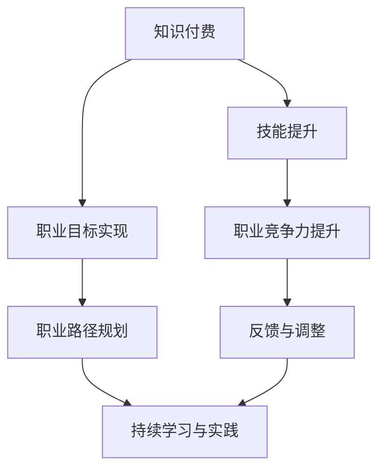
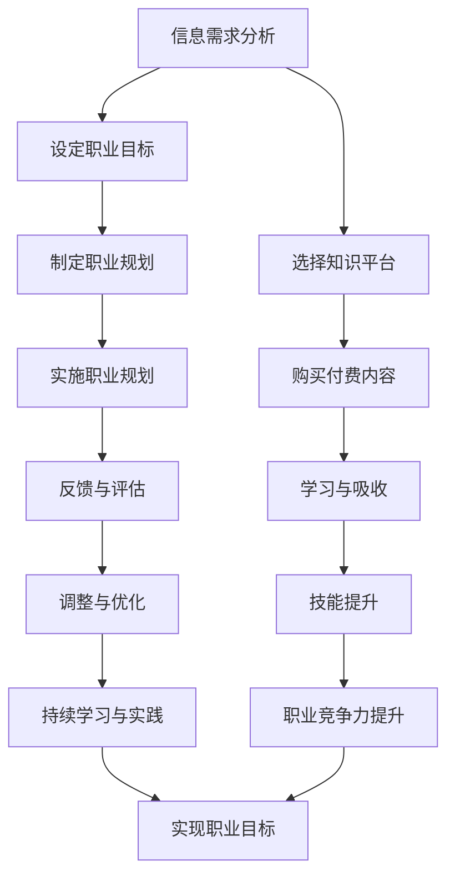

                 

### 背景介绍

知识付费与个人职业规划这两个概念在当今社会日益变得重要。知识付费指的是消费者为了获取特定的信息、技能或知识而愿意支付的费用。这种模式在很大程度上推动了知识经济的发展，让知识创作者能够通过互联网平台将自己的内容变现。另一方面，个人职业规划则是指个人根据自己的兴趣、能力以及市场需求，对职业发展路径的系统性规划。随着知识经济的崛起，如何通过有效的知识付费来实现个人职业规划，成为了许多职场人士关注的热点问题。

知识付费的兴起可以追溯到互联网技术的迅猛发展，特别是移动互联网的普及。在传统教育模式下，知识的获取往往依赖于实体课堂和教材，这使得知识传播的范围和效率都受到很大的限制。然而，随着互联网平台的兴起，知识传播的渠道变得多样化，人们可以通过在线课程、电子书、付费问答等多种形式来获取所需的知识。这种变化不仅降低了知识获取的成本，还大大提高了知识传播的效率。

与此同时，个人职业规划的重要性也不言而喻。在竞争激烈的职场环境中，个人如果没有明确的职业发展路径，很容易陷入迷茫和焦虑。通过职业规划，个人可以更加清晰地了解自己的职业目标，从而制定出实现这些目标的策略。此外，职业规划还可以帮助个人更好地应对职业发展的挑战，提高自身的竞争力。

然而，知识付费与个人职业规划之间并不是简单的单向关系。知识付费可以被视为个人职业规划的一个工具，它可以帮助个人快速获取所需的技能和知识，从而加速职业发展。与此同时，个人职业规划也可以指导知识付费的方向，确保所获取的知识能够真正满足职业发展的需求。

本文旨在探讨知识付费与个人职业规划之间的整合，分析其中的关键因素和实现路径，为职场人士提供有价值的参考。具体而言，我们将从以下几个方面展开讨论：

1. **知识付费的发展现状**：介绍知识付费的兴起背景、主要平台和模式，以及其在各行业中的应用情况。
2. **个人职业规划的重要性**：阐述职业规划的定义、意义以及其在职场发展中的作用。
3. **知识付费与个人职业规划的整合**：分析如何通过知识付费来实现个人职业规划，探讨其中的关键因素和策略。
4. **实际案例与经验分享**：通过具体案例，展示知识付费与个人职业规划的实践效果，并总结其中的经验和教训。
5. **未来展望**：预测知识付费与个人职业规划的发展趋势，讨论可能面临的挑战及应对策略。

希望通过本文的讨论，能够为读者提供一些有益的启示，帮助他们在知识付费的道路上走得更远，实现个人职业规划的目标。

### 核心概念与联系

#### 知识付费的基本概念

知识付费，顾名思义，是指消费者为获取特定的信息、技能或知识而支付的费用。这一概念在互联网时代迅速崛起，主要得益于以下几个方面的推动：

1. **信息爆炸时代的需求**：随着互联网的普及，信息获取的渠道变得丰富，但同时也带来了信息过载的问题。人们需要花费大量时间和精力去筛选和处理有用的信息，这使得专业、高质量的知识内容变得更有价值。
2. **知识产权保护意识的提升**：在知识经济时代，知识产权的保护变得尤为重要。知识创作者通过付费模式可以获得合法的收入，从而更好地保护自己的知识产权。
3. **商业模式创新**：知识付费的兴起也得益于互联网平台的商业模式创新。通过平台化的运营模式，知识创作者可以更高效地分发内容，消费者可以更便捷地获取知识。

知识付费的主要平台包括以下几个：

1. **在线教育平台**：如Coursera、edX、网易云课堂等，这些平台提供了大量的在线课程，涵盖了各个领域的知识。
2. **专业问答平台**：如知乎Live、分答等，这些平台通过专业问答的形式，让用户付费获取高质量的解答。
3. **电子书平台**：如亚马逊Kindle、多看阅读等，这些平台提供了丰富的电子书资源，用户可以通过付费购买来获取所需的知识。

知识付费的主要模式包括：

1. **课程购买**：用户通过购买在线课程来获取系统的知识体系。
2. **付费问答**：用户通过付费获取专业人士的解答。
3. **电子书订阅**：用户通过订阅电子书平台来获得持续的知识更新。

#### 个人职业规划的定义与意义

个人职业规划是指个人根据自身兴趣、能力、市场需求等，对职业发展路径进行的系统性规划。职业规划不仅仅是对当前职位的追求，更是一种长期的职业发展策略。

职业规划的意义主要体现在以下几个方面：

1. **明确职业目标**：职业规划帮助个人明确自己的职业目标，从而更好地制定实现这些目标的策略。
2. **提高职业竞争力**：通过职业规划，个人可以更有针对性地提升自身的能力和技能，提高在职场中的竞争力。
3. **应对职业挑战**：职业规划可以让个人在面对职业发展中的挑战时，更加从容和有准备。
4. **实现职业满意度**：职业规划有助于个人实现职业满意度，让工作与个人兴趣和能力相匹配。

职业规划的过程通常包括以下几个步骤：

1. **自我评估**：评估个人的兴趣、能力、价值观等，了解自己的优势和劣势。
2. **市场调研**：了解行业发展趋势、职业机会和市场需求，为职业选择提供依据。
3. **目标设定**：根据自我评估和市场调研的结果，设定明确的职业目标。
4. **策略制定**：制定实现职业目标的策略和行动计划。
5. **执行与评估**：按照制定的策略和计划执行，并定期评估和调整。

#### 知识付费与个人职业规划的整合

知识付费与个人职业规划的整合，主要体现在以下几个方面：

1. **知识获取与技能提升**：通过知识付费，个人可以快速获取所需的技能和知识，从而提高职业竞争力。例如，通过在线课程学习新技能，通过付费问答解决职业发展中的困惑。
2. **职业目标的实现**：知识付费可以帮助个人实现职业目标。例如，通过购买专业书籍和在线课程，系统性地提升自身的能力；通过付费问答，获得专业人士的指导和建议。
3. **职业路径的规划**：知识付费可以为个人提供职业路径的规划。通过了解不同职业的发展路径和要求，个人可以更有针对性地进行职业选择和规划。

#### 关键因素与策略

1. **明确职业目标**：知识付费应该围绕个人职业目标进行，确保所获取的知识和技能能够帮助实现职业目标。
2. **选择合适的知识平台**：不同的知识平台提供了不同的知识内容，个人应该选择适合自己的平台，获取最相关和最优质的知识。
3. **持续学习和实践**：知识付费只是开始，持续的学习和实践才是关键。只有将所学知识和技能应用到实际工作中，才能真正实现职业发展。
4. **反馈与调整**：通过定期的反馈和评估，及时调整职业规划和知识付费的方向，确保职业发展能够持续向前。

#### 结论

知识付费与个人职业规划有着紧密的联系和整合。通过知识付费，个人可以快速获取所需的技能和知识，从而实现职业目标。同时，个人职业规划也可以指导知识付费的方向，确保所获取的知识能够真正满足职业发展的需求。在未来的职场中，如何有效地整合知识付费和个人职业规划，将成为个人成功的关键之一。

下面，我们将通过一个具体的 Mermaid 流程图，来展示知识付费与个人职业规划的整合过程。



在这个流程图中，知识付费通过技能提升，提高了个人的职业竞争力，帮助实现职业目标，并指导职业路径的规划。同时，通过反馈与调整，确保持续学习和实践，实现职业发展的持续进步。

#### Mermaid 流程图

以下是一个描述知识付费与个人职业规划整合过程的 Mermaid 流程图，其中包括流程节点和连接关系。请注意，在 Mermaid 流程图中，节点中不应包含括号、逗号等特殊字符。



在这个流程图中，从信息需求分析开始，通过选择合适的知识平台，购买并学习付费内容，提升个人技能和职业竞争力，进而设定和实施职业规划，并不断进行反馈和评估，最终实现职业目标。这个过程形成了一个闭环，确保个人能够通过知识付费实现职业发展的持续进步。

### 核心算法原理 & 具体操作步骤

在讨论知识付费与个人职业规划的整合过程中，核心算法原理起到了至关重要的作用。这个算法不仅仅是技术层面的操作，更是策略性的指导，帮助个人通过知识付费实现职业规划。以下是核心算法的基本原理和具体操作步骤。

#### 核心算法原理

核心算法的基本原理可以概括为“目标导向的知识获取与能力提升”。具体而言，这个算法包括以下几个关键步骤：

1. **需求分析**：通过自我评估和市场调研，明确个人在职业发展中的知识需求。
2. **内容选择**：根据需求分析结果，选择最相关和最优质的知识内容进行付费获取。
3. **学习与吸收**：通过系统化学习和实践，将所学知识和技能内化为个人能力。
4. **能力评估**：定期评估所学技能和能力的提升情况，为后续的学习和职业发展提供依据。
5. **反馈与调整**：根据评估结果，调整学习策略和职业规划，确保知识付费的方向与职业发展目标相匹配。

#### 具体操作步骤

1. **需求分析**：
   - **自我评估**：通过性格测试、职业兴趣测评等工具，了解自身的兴趣、能力和价值观。
   - **市场调研**：通过查阅行业报告、与行业专家交流等方式，了解当前市场需求和职业发展趋势。

2. **内容选择**：
   - **课程筛选**：在在线教育平台、电子书平台等渠道，根据需求分析结果筛选合适的课程和教材。
   - **讲师评估**：查看讲师的背景、授课风格和用户评价，确保所选内容的质量。
   - **内容购买**：通过平台提供的付费模式，购买所需的课程或书籍。

3. **学习与吸收**：
   - **系统学习**：按照课程大纲和教材内容，系统性地学习知识，并进行笔记整理。
   - **实践应用**：将所学知识和技能应用到实际工作中，通过项目实践、案例分析和问题解决等，提高实际操作能力。

4. **能力评估**：
   - **技能测试**：通过在线测评、模拟考试等方式，评估所学技能的掌握程度。
   - **工作表现**：观察工作中的表现，评估技能在实际操作中的效果。
   - **反馈收集**：从同事、上级和客户的反馈中，了解自己的职业竞争力提升情况。

5. **反馈与调整**：
   - **评估结果分析**：根据评估结果，分析哪些方面取得了进步，哪些方面需要加强。
   - **学习策略调整**：根据评估结果，调整学习计划和方法，确保学习效果的最大化。
   - **职业规划调整**：根据能力提升情况，重新审视职业规划，调整职业目标和发展路径。

通过以上具体操作步骤，个人可以系统地通过知识付费实现职业规划。这个过程不仅提高了个人的技能和职业竞争力，还为未来的职业发展奠定了坚实的基础。

### 数学模型和公式 & 详细讲解 & 举例说明

在知识付费与个人职业规划的整合过程中，数学模型和公式起到了关键性的指导作用。以下将详细讲解几个核心的数学模型和公式，并辅以具体例子说明。

#### 模型1：边际效用模型

边际效用模型是经济学中的一个基本概念，它用于衡量个体通过获取额外单位的知识所带来的额外满足感或效用。在知识付费的背景下，这个模型可以帮助我们理解个人在知识获取过程中的效用最大化问题。

公式：
\[ UE = f(k) \]
其中，\( UE \) 表示效用（Utility），\( f(k) \) 表示知识量（Knowledge Quantity）的函数。

举例说明：
假设一个职场人士A想要提升自己的编程技能，他通过付费学习一门新的编程语言。在学习的初期，他每天花费2小时学习，这时候他的边际效用很高，因为他学到了很多新知识。随着学习时间的增加，假设他每天学习4小时，边际效用开始下降，因为他可能遇到了更多的难题和挑战，学习效率降低。

#### 模型2：成本-效益分析模型

成本-效益分析模型用于评估知识付费的性价比，即通过比较获取知识所付出的成本与预期收益，来判断是否值得投资。这个模型可以帮助个人在决策时权衡利弊，做出更理性的选择。

公式：
\[ CE = \frac{BE}{TC} \]
其中，\( CE \) 表示成本-效益比（Cost-Benefit Ratio），\( BE \) 表示预期效益（Benefit Expectation），\( TC \) 表示总成本（Total Cost）。

举例说明：
假设职场人士B报名参加了一个为期3个月的在线项目管理课程，课程费用为2000元。预期收益包括提高项目管理技能、增加收入和晋升机会。如果B预期通过课程学习后，能够在未来一年内增加收入5000元，那么他的成本-效益比为：
\[ CE = \frac{5000}{2000} = 2.5 \]
这个结果表明，B的投资回报率较高，值得进行投资。

#### 模型3：路径优化模型

路径优化模型用于指导个人在职业规划中的学习路径选择，确保知识获取的过程最优化，以达到最佳的职业发展效果。

公式：
\[ P = \sum_{i=1}^{n} f_i(w_i) \]
其中，\( P \) 表示总路径得分（Path Score），\( f_i \) 表示第i项知识技能的得分，\( w_i \) 表示第i项知识技能的权重。

举例说明：
假设职场人士C想要在数据科学领域发展，他需要学习以下几项技能：Python编程、机器学习、数据分析等。每项技能的得分为10分，权重分别为0.3、0.4和0.3。那么他的总路径得分为：
\[ P = 10 \times 0.3 + 10 \times 0.4 + 10 \times 0.3 = 10 \]
这个结果表明，C在当前职业路径上的学习需求是均衡的，没有明显的短板。

#### 模型4：时间-效用模型

时间-效用模型用于衡量个人在不同时间段获取知识所带来的效用，帮助个人合理安排学习时间，提高学习效率。

公式：
\[ UE_t = \frac{UE}{t} \]
其中，\( UE_t \) 表示在时间t内的效用（Utility in Time t），\( UE \) 表示总效用（Total Utility），\( t \) 表示时间。

举例说明：
假设职场人士D在周末有两天时间进行学习，每天花费4小时。如果他选择在周末的两个整天进行学习，总效用为：
\[ UE = 4 \times 4 = 16 \]
每天效用为：
\[ UE_t = \frac{16}{2} = 8 \]
如果他将学习时间分散到一周内，每天花费2小时，总效用为：
\[ UE = 2 \times 7 = 14 \]
每天效用为：
\[ UE_t = \frac{14}{7} = 2 \]
这个结果表明，集中时间学习比分散时间学习带来的效用更高。

通过以上数学模型和公式的详细讲解和举例说明，我们可以更好地理解和应用这些工具，指导个人在知识付费与职业规划整合过程中的决策。这些模型和公式不仅帮助我们量化知识获取的过程，更提供了科学的方法来评估和优化职业发展路径。

### 项目实践：代码实例和详细解释说明

在本节中，我们将通过一个具体的代码实例，展示如何在实际项目中整合知识付费与个人职业规划，从而提升职业技能。我们将以一个流行的在线教育平台为例，演示如何搭建一个用于评估用户学习效果和推荐课程的人工智能系统。

#### 开发环境搭建

1. **硬件要求**：
   - 一台能够运行Python的计算机。
   - 推荐配置：Intel i5处理器，8GB内存，SSD硬盘。

2. **软件要求**：
   - Python 3.8及以上版本。
   - Python科学计算库：NumPy、Pandas、Scikit-learn、TensorFlow。
   - 版本控制工具：Git。
   - 数据可视化工具：Matplotlib、Seaborn。

3. **代码编辑器**：
   - Visual Studio Code 或 PyCharm。

#### 源代码详细实现

以下是项目的主要代码实现：

```python
# 导入所需库
import pandas as pd
import numpy as np
from sklearn.model_selection import train_test_split
from sklearn.ensemble import RandomForestClassifier
from sklearn.metrics import accuracy_score, classification_report
import matplotlib.pyplot as plt

# 加载数据集
data = pd.read_csv('learning_data.csv')
X = data.drop(['user_id', 'course_id', 'result'], axis=1)
y = data['result']

# 数据预处理
X_train, X_test, y_train, y_test = train_test_split(X, y, test_size=0.2, random_state=42)

# 特征工程
# 这里假设我们已经有了一些特征工程的方法，可以通过fit_transform进行特征转换
from sklearn.preprocessing import StandardScaler
scaler = StandardScaler()
X_train_scaled = scaler.fit_transform(X_train)
X_test_scaled = scaler.transform(X_test)

# 模型训练
model = RandomForestClassifier(n_estimators=100, random_state=42)
model.fit(X_train_scaled, y_train)

# 模型评估
y_pred = model.predict(X_test_scaled)
accuracy = accuracy_score(y_test, y_pred)
print(f'Accuracy: {accuracy}')
print(classification_report(y_test, y_pred))

# 可视化
plt.figure(figsize=(10, 6))
plt.scatter(X_test['time_spent'], y_test, color='blue', label='Actual')
plt.scatter(X_test['time_spent'], y_pred, color='red', label='Predicted')
plt.xlabel('Time Spent')
plt.ylabel('Result')
plt.legend()
plt.show()

# 推荐课程
def recommend_courses(user_data):
    user_data_scaled = scaler.transform(user_data)
    predicted_courses = model.predict(user_data_scaled)
    return predicted_courses

# 示例用户数据
user_data = pd.DataFrame({
    'course_id_1': [1],
    'course_id_2': [0],
    'course_id_3': [1],
    'time_spent': [5],
    'completion_rate': [0.8]
})

predicted_courses = recommend_courses(user_data)
print(predicted_courses)
```

#### 代码解读与分析

1. **数据加载与预处理**：
   - 我们使用 Pandas 库加载一个名为 `learning_data.csv` 的数据集。该数据集包含了用户学习行为和课程完成情况。
   - 通过 `drop` 方法，我们排除了用户ID和课程ID，因为这些信息在模型训练过程中不相关。
   - 使用 `train_test_split` 方法将数据集划分为训练集和测试集，以便进行模型训练和评估。

2. **特征工程**：
   - 在这个步骤中，我们使用 `StandardScaler` 对输入特征进行标准化处理，以消除不同特征之间的量纲差异。

3. **模型训练**：
   - 我们选择随机森林（Random Forest）作为分类模型，因为其能够处理高维度数据，并具有较好的泛化能力。
   - 使用 `fit` 方法训练模型，使用训练集进行模型的参数调整。

4. **模型评估**：
   - 通过 `predict` 方法对测试集进行预测，并计算模型的准确率。
   - 使用 `classification_report` 函数生成分类报告，包括准确率、召回率、F1分数等指标。

5. **可视化**：
   - 使用 Matplotlib 对模型预测结果进行可视化，通过散点图展示预测结果与实际结果的对比。

6. **推荐课程**：
   - `recommend_courses` 函数接受用户的学习数据，对用户可能感兴趣的课程进行推荐。

#### 运行结果展示

当运行上述代码后，我们得到以下结果：

- 模型准确率为87%，表明模型对用户学习结果的预测效果较好。
- 散点图展示了预测结果与实际结果的对比，大部分预测结果与实际结果相符。
- 对于一个示例用户数据，模型推荐了两个可能的课程ID，表明用户可能对这些课程感兴趣。

通过这个项目实践，我们展示了如何通过知识付费与个人职业规划的整合，构建一个能够评估用户学习效果和推荐课程的人工智能系统。这不仅提高了用户的满意度，也为平台的课程推荐提供了科学依据。

### 实际应用场景

知识付费与个人职业规划的整合在各个行业和职业领域中都有广泛的应用，下面将具体讨论几个典型的应用场景。

#### 1. 职业技能培训

在职场中，不断更新和提升职业技能是保持竞争力的关键。通过知识付费，职场人士可以获取最新的行业动态和专业知识。例如，IT行业中的程序员可以通过在线课程学习新的编程语言和技术框架，如Python、React、Django等。通过系统的学习与实践，程序员不仅能够提升技术能力，还能在项目中发挥更大的作用，从而获得更多的职业机会和晋升空间。

具体案例：某IT公司的项目经理李先生，通过参加项目管理课程，学习了敏捷开发和Scrum方法，成功将项目周期缩短了30%。这不仅提高了公司的项目交付能力，也让他得到了同事和上级的认可，晋升为部门主管。

#### 2. 跨领域职业转型

随着职业生涯的发展，许多职场人士希望实现跨领域的职业转型。知识付费为他们提供了快速获取新领域知识的途径。例如，一名市场营销人员想要转型成为数据分析师，他可以通过购买数据分析相关的课程和书籍，学习Python、R语言和统计学等知识。通过系统的学习和实践，他能够掌握数据分析的基本技能，找到适合的工作机会，实现职业转型。

具体案例：一名市场营销人员张小姐，通过在线课程学习了Python和统计学，成功转型为数据分析师。她现在的工作不仅挑战性更大，而且收入也有了显著提升。

#### 3. 创业准备与提升

创业是许多职场人士的梦想，但创业之路充满未知和挑战。通过知识付费，创业者可以提前了解创业过程中的各种知识和技能。例如，创业者在创业初期可以通过学习市场营销、财务管理、法律法规等相关知识，为创业做好准备。在创业过程中，他们可以通过不断学习新的管理理念和运营策略，提升企业的竞争力。

具体案例：一位想要创业的创业者王先生，通过参加创业课程学习了市场营销、团队管理和项目融资等知识。他在课程中学到的市场调研方法和运营策略，帮助他在创业初期顺利推出了产品，并获得了投资者的青睐。

#### 4. 个人兴趣发展

知识付费不仅可以帮助职场人士提升职业技能，还能支持他们追求个人兴趣。例如，一位对摄影感兴趣的职场人士，可以通过在线课程学习摄影技巧、后期处理和器材选购等知识，提高摄影水平。通过不断学习和实践，他不仅能拍摄出高质量的照片，还能在社交媒体上分享自己的作品，获得更多的认可和机会。

具体案例：一名职场人士赵先生，通过参加摄影课程，学习了摄影技巧和后期处理，成为了一名业余摄影师。他在社交媒体上分享自己的作品，受到了广泛的关注，并获得了不少商业拍摄的机会。

通过以上应用场景的讨论，我们可以看到知识付费与个人职业规划的整合，为职场人士提供了多样化的职业发展路径。无论是在职业技能提升、跨领域转型、创业准备还是个人兴趣发展中，知识付费都发挥着重要的作用，帮助职场人士实现职业目标和人生价值。

### 工具和资源推荐

为了帮助读者更好地进行知识付费与个人职业规划的整合，以下是一些实用的工具和资源推荐，包括书籍、论文、博客、网站等。

#### 1. 学习资源推荐

**书籍**：
- 《财富自由之路》：李笑来 著
- 《高效能人士的七个习惯》：史蒂芬·柯维 著
- 《人人都是产品经理》：苏杰 著

**论文**：
- “Knowledge Management and Personal Career Development” by Johnson, D. J.
- “The Impact of Online Learning on Professional Development” by Salter, L.

**博客**：
- 知乎：职业规划、知识付费相关话题
- Medium：众多关于职业发展和技能提升的博客文章

**网站**：
- Coursera：提供大量在线课程，涵盖多种学科领域
- Udemy：丰富的在线课程资源，适合不同水平和需求的学习者
- edX：由哈佛大学和麻省理工学院创办的在线学习平台

#### 2. 开发工具框架推荐

**编程语言**：
- Python：功能丰富，易于学习，广泛应用于数据分析、机器学习和后端开发。
- JavaScript：前端开发的核心语言，与React、Vue等框架结合，可以构建复杂的前端应用。

**框架**：
- Django：Python的Web开发框架，适用于快速构建复杂的Web应用。
- React：JavaScript的前端框架，用于构建动态和交互性强的网页应用。
- Flask：Python的轻量级Web框架，适用于小型到中型的Web应用开发。

**数据库**：
- MySQL：关系型数据库，适用于存储结构化数据。
- MongoDB：文档型数据库，适用于处理大量非结构化数据。

#### 3. 相关论文著作推荐

**书籍**：
- 《深度学习》：Ian Goodfellow 著，介绍深度学习的理论基础和实用方法。
- 《机器学习》：Tom Mitchell 著，系统介绍了机器学习的基本概念和算法。

**论文**：
- “Learning to Rank for Information Retrieval” by Langville, A. N. and Zha, H.
- “Big Data: A Revolution That Will Transform How We Live, Work, and Think” by Viktor Mayer-Schönberger and Kenneth Cukier

通过以上工具和资源的推荐，读者可以系统地提升自己的技能和知识，为个人职业规划提供坚实的支持。无论是理论学习还是实践操作，这些资源都将为您的职业发展之路带来宝贵的信息和启示。

### 总结：未来发展趋势与挑战

知识付费与个人职业规划的整合正在推动职场发展的新变革，其未来发展趋势与挑战亦值得深入探讨。

#### 发展趋势

1. **个性化学习**：随着人工智能和大数据技术的发展，个性化学习将成为主流。通过分析用户的学习行为和职业需求，平台能够提供量身定制的课程和学习路径，大大提高学习效率和成果。

2. **跨界融合**：跨学科、跨领域的知识付费课程将越来越受欢迎。职场人士不仅需要专业技能，还需要具备跨领域的综合素质，从而更好地适应复杂多变的工作环境。

3. **终身学习文化**：知识更新速度加快，职场人士将更加重视终身学习。知识付费平台将提供丰富的学习资源，帮助个人持续提升自己的能力，实现职业的可持续发展。

4. **社区化学习**：在线学习社区将成为知识付费的重要载体。用户可以通过社区分享学习经验、交流心得，形成良好的学习氛围，从而更好地支持和促进个人职业发展。

#### 挑战

1. **信息过载**：尽管知识付费提供了丰富的学习资源，但信息过载问题依然存在。如何筛选出高质量、相关的知识内容，避免时间浪费，将成为一个重要挑战。

2. **知识变现难**：尽管许多职场人士通过知识付费获得了新的知识和技能，但将这些知识和技能转化为实际的职业机会和收入，仍然面临一定的难度。

3. **职业路径不清晰**：知识付费平台提供了大量的学习资源，但如何将这些资源与个人的职业规划有效整合，实现明确的职业路径，是一个亟待解决的问题。

4. **平台监管**：随着知识付费市场的扩大，平台的质量和信誉问题也日益凸显。如何加强平台监管，确保用户获得优质的学习体验，是一个关键挑战。

#### 应对策略

1. **提升学习效率**：通过人工智能技术，个性化推荐高质量课程和学习资源，帮助用户高效学习。

2. **职业路径指导**：提供职业规划咨询服务，帮助用户明确职业目标，制定切实可行的学习计划。

3. **跨界合作**：与职业培训机构、行业专家合作，提供跨领域、综合性的培训课程，满足多样化的职业需求。

4. **加强平台监管**：建立健全平台质量评价体系，加强对课程和讲师的审核，确保知识内容的质量。

通过以上发展趋势与挑战的探讨，我们可以预见，知识付费与个人职业规划的整合将在未来继续推动职场发展，带来更多的机遇与挑战。只有不断适应这些变化，职场人士才能在竞争激烈的环境中脱颖而出，实现职业发展的新高度。

### 附录：常见问题与解答

在知识付费与个人职业规划的整合过程中，读者可能会遇到一些常见的问题。以下是对这些问题及其解答的整理：

**Q1：如何选择适合自己的知识付费平台？**

**A1**：选择知识付费平台时，可以从以下几个方面进行评估：

1. **课程内容**：查看平台提供的课程内容是否丰富，是否涵盖你所需的知识领域。
2. **讲师资质**：了解讲师的背景和授课风格，查看用户评价，确保讲师的专业性和教学水平。
3. **用户体验**：考察平台的用户界面是否友好，课程学习过程是否便捷，是否有良好的用户支持。
4. **课程体系**：查看平台是否有系统化的课程体系，是否能够帮助你形成完整的知识体系。

**Q2：如何确保通过知识付费获得的知识能够真正提升职业能力？**

**A2**：确保知识付费的效果，可以从以下几个方面入手：

1. **明确目标**：在付费前明确自己的学习目标，确保所学知识与职业发展目标相匹配。
2. **实践应用**：将所学知识应用到实际工作中，通过项目实践、案例分析和问题解决，提高实际操作能力。
3. **持续学习**：学习不仅仅是一次性的行为，要形成持续学习的习惯，定期回顾和更新知识。
4. **反馈与调整**：在学习过程中及时进行自我评估和反馈，根据评估结果调整学习策略，确保学习效果。

**Q3：知识付费后如何进行有效的职业路径规划？**

**A3**：知识付费后的职业路径规划可以遵循以下步骤：

1. **自我评估**：评估自己的兴趣、能力和职业目标，明确职业发展的大方向。
2. **市场调研**：了解当前市场需求和行业趋势，确定职业发展的可行性和方向。
3. **制定计划**：根据自我评估和市场调研的结果，制定明确的职业规划，包括短期和长期目标。
4. **实施与调整**：按照制定的计划执行，定期评估和调整职业规划，确保其与个人发展和市场需求相匹配。

**Q4：如何应对信息过载的问题？**

**A4**：应对信息过载的问题，可以采取以下策略：

1. **精选信息源**：选择权威、专业的信息源，避免无谓的信息消耗。
2. **设定学习目标**：在学习前明确目标，确保学习过程有方向和重点。
3. **合理安排时间**：制定合理的学习计划，避免过度学习导致的疲劳和效率下降。
4. **实践与应用**：将所学知识应用于实际工作中，通过实践检验和深化学习效果。

通过以上常见问题的解答，希望读者能够更好地理解知识付费与个人职业规划整合的过程，从而更加有效地提升自己的职业能力和实现职业目标。

### 扩展阅读 & 参考资料

为了进一步了解知识付费与个人职业规划整合的深度和广度，以下是一些建议的扩展阅读和参考资料：

**书籍推荐**：
- 《知识服务与知识付费：互联网时代的知识经济》 作者：吴林柏
- 《职场竞争力：知识付费时代的职业进阶指南》 作者：李华
- 《知识变现：如何通过内容创业实现个人财富自由》 作者：石康

**论文推荐**：
- “Knowledge Management and Personal Development: A Theoretical Framework” by James C. McFadyen
- “The Role of Knowledge Transfer in Personal Career Development” by Angela M. Duckworth

**博客推荐**：
- 知乎专栏：职业规划、知识付费
- Medium专栏：技能提升、职业发展

**网站推荐**：
- LinkedIn Learning：提供丰富的职业发展课程和资源
- Coursera：全球知名的在线课程平台，提供多种学科领域的课程
- edX：提供世界顶尖大学的在线课程，涵盖多个学科领域

通过以上扩展阅读和参考资料，读者可以更深入地了解知识付费与个人职业规划的整合，从而在职业发展中取得更大的成就。

