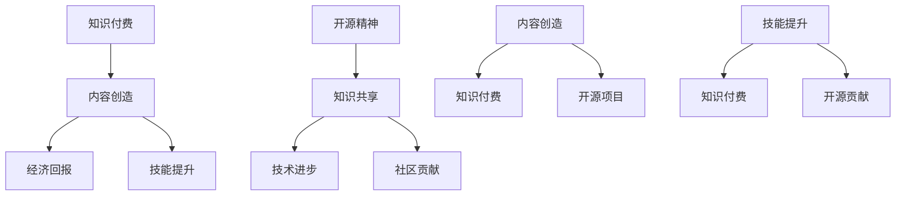

                 

### 知识付费与开源精神：程序员的平衡之道

> **关键词**：知识付费，开源精神，程序员，平衡之道，技术分享，版权保护，商业利益，社区贡献
>
> **摘要**：本文探讨了知识付费与开源精神在程序员职业生涯中的重要性，分析了两者之间的关系与冲突，并提出了在遵循开源精神的同时实现知识付费的有效策略。文章旨在帮助程序员在追求个人发展、商业利益和社区贡献之间找到平衡点。

## 1. 背景介绍

在当今数字化时代，程序员作为一个高需求的职业群体，面临着越来越多的机遇和挑战。知识付费与开源精神是两个看似矛盾但又相辅相成的概念，它们在程序员的职业生涯中扮演着重要的角色。知识付费是指以经济手段交换技术知识、经验、课程等形式，而开源精神则强调共享知识，推动技术的进步和社区的繁荣。

知识付费的优势在于能够为内容创作者提供稳定的收入来源，激励他们持续产出高质量的内容。然而，过度依赖知识付费可能会导致知识垄断，限制技术的自由传播。相反，开源精神强调知识共享，鼓励程序员在公开的环境中交流和学习。但开源项目往往需要投入大量的时间和精力，对于个人和团队来说可能缺乏直接的经济回报。

因此，如何在实际工作中平衡知识付费与开源精神，成为一个值得深入探讨的问题。本文将从多个角度分析这一问题，并提出一些建议。

## 2. 核心概念与联系

### 2.1 知识付费

知识付费指的是通过购买、订阅或付费课程等形式获取知识和技能的过程。在程序员的职业生涯中，知识付费可以帮助他们快速提升技术水平，掌握新兴技术，适应不断变化的行业需求。

### 2.2 开源精神

开源精神起源于软件领域，指的是开放源代码，允许任何人自由查看、修改和分发。在程序员中，开源精神体现为愿意分享代码、文档和经验，以推动技术的普及和进步。

### 2.3 知识付费与开源精神的关系

知识付费与开源精神并非水火不容，而是可以相互促进。例如，程序员可以通过提供付费课程或文档来分享自己的专业知识，同时在开源项目中贡献代码，实现知识的共享。

### 2.4 关联性 Mermaid 流程图



## 3. 核心算法原理 & 具体操作步骤

在探讨知识付费与开源精神的平衡之道时，我们需要理解两者之间的具体操作步骤和实现原理。

### 3.1 知识付费的实现步骤

1. **内容创作**：程序员根据自身的技术特长和市场需求，创作高质量的技术教程、文档或课程。
2. **内容发布**：将创作的内容通过在线平台、电子书、线下培训等形式发布。
3. **收费设置**：根据内容的价值和受众群体，设置合理的收费标准和支付方式。
4. **市场推广**：通过社交媒体、SEO优化等手段，提升内容的知名度和吸引力。
5. **用户反馈**：收集用户的反馈，不断优化内容，提高用户满意度。

### 3.2 开源精神的实现步骤

1. **代码开放**：程序员将项目的源代码开放给公众，允许任何人自由查看、修改和分发。
2. **文档共享**：编写详细的文档，解释代码的实现原理和使用方法。
3. **社区建设**：通过论坛、邮件列表、GitHub 等平台，与社区成员进行交流，共同改进项目。
4. **持续贡献**：定期更新代码和文档，推动项目的持续发展和进步。
5. **版权声明**：明确开源协议，保护作者的知识产权，同时确保代码的共享性。

### 3.3 知识付费与开源精神的结合策略

1. **付费内容与开源项目分离**：程序员可以将付费内容和开源项目分开管理，确保开源项目的纯净性和共享性。
2. **付费内容作为开源项目的一部分**：在开源项目中，程序员可以提供高级功能或扩展作为付费内容，鼓励社区成员参与贡献。
3. **知识共享与经济回报相结合**：在知识付费的过程中，程序员可以将其一部分收益用于开源项目的发展，实现双赢。

## 4. 数学模型和公式 & 详细讲解 & 举例说明

在知识付费与开源精神的平衡中，我们可以引入一些数学模型来分析其经济性和可持续性。

### 4.1 经济性分析

设 \(P\) 为知识付费的价格，\(C\) 为内容创作的成本，\(N\) 为潜在用户数，\(R\) 为每个用户的平均收益。

经济收益 \(E = P \times N - C\)

### 4.2 可持续性分析

设 \(T\) 为开源项目的贡献时间，\(E_1\) 为开源项目的经济收益，\(E_2\) 为开源项目的非经济收益（如社区影响力、职业发展等）。

开源项目总收益 \(S = E_1 + E_2\)

### 4.3 举例说明

假设一位程序员开发了一款开源的编程工具，同时提供了付费的高级功能。假设付费功能的价格为 \(P = 100\) 元，创作成本 \(C = 5000\) 元，潜在用户数 \(N = 1000\)。

经济收益 \(E = 100 \times 1000 - 5000 = 95000\) 元

如果开源项目通过贡献获得了 100 个星标，每个星标带来 \(E_1 = 1000\) 元的经济收益，同时提升了程序员的职业发展，带来 \(E_2 = 5000\) 元的非经济收益。

开源项目总收益 \(S = 1000 \times 100 + 5000 = 150000\) 元

通过这个例子，我们可以看到，在遵循开源精神的同时，知识付费可以带来可观的经济收益。

## 5. 项目实践：代码实例和详细解释说明

### 5.1 开发环境搭建

为了演示知识付费与开源精神的结合，我们以一个开源的Web应用项目为例。首先，我们需要搭建一个开发环境。

#### 5.1.1 环境准备

1. 安装 Node.js
2. 安装 MongoDB
3. 安装 Git

#### 5.1.2 初始化项目

```bash
git clone https://github.com/yourusername/your-project.git
cd your-project
npm install
```

### 5.2 源代码详细实现

我们的项目是一个基于Express框架的Web应用，提供基本的用户注册和登录功能。

#### 5.2.1 服务器配置

```javascript
// server.js
const express = require('express');
const app = express();
const mongoose = require('mongoose');

app.use(express.json());

// 连接MongoDB
mongoose.connect('mongodb://localhost:27017/yourapp', {
  useNewUrlParser: true,
  useUnifiedTopology: true,
});

// 用户模型
const User = require('./models/User');

// 登录路由
app.post('/login', async (req, res) => {
  // 实现登录逻辑
});

// 注册路由
app.post('/register', async (req, res) => {
  // 实现注册逻辑
});

const PORT = process.env.PORT || 3000;
app.listen(PORT, () => {
  console.log(`服务器运行在端口 ${PORT}`);
});
```

#### 5.2.2 用户模型

```javascript
// models/User.js
const mongoose = require('mongoose');

const UserSchema = new mongoose.Schema({
  username: {
    type: String,
    required: true,
    unique: true,
  },
  password: {
    type: String,
    required: true,
  },
});

module.exports = mongoose.model('User', UserSchema);
```

### 5.3 代码解读与分析

在上面的代码中，我们使用了Express框架搭建了一个基本的Web应用，通过MongoDB存储用户数据。其中，登录和注册功能是核心，我们需要确保用户数据的安全和隐私。

#### 5.3.1 登录逻辑

登录逻辑需要验证用户的用户名和密码，并与数据库中的记录进行匹配。

```javascript
// routes/login.js
const express = require('express');
const User = require('../models/User');
const bcrypt = require('bcrypt');

const router = express.Router();

router.post('/', async (req, res) => {
  const { username, password } = req.body;
  const user = await User.findOne({ username });

  if (user && bcrypt.compareSync(password, user.password)) {
    res.json({ message: '登录成功' });
  } else {
    res.status(401).json({ message: '用户名或密码错误' });
  }
});

module.exports = router;
```

#### 5.3.2 注册逻辑

注册逻辑需要验证用户输入的有效性，并将用户信息存储到数据库。

```javascript
// routes/register.js
const express = require('express');
const User = require('../models/User');
const bcrypt = require('bcrypt');

const router = express.Router();

router.post('/', async (req, res) => {
  const { username, password } = req.body;

  // 验证用户名和密码的有效性
  if (!username || !password) {
    return res.status(400).json({ message: '用户名或密码不能为空' });
  }

  // 密码加密
  const hashedPassword = bcrypt.hashSync(password, 10);

  // 存储用户信息
  const user = new User({
    username,
    password: hashedPassword,
  });

  try {
    await user.save();
    res.json({ message: '注册成功' });
  } catch (error) {
    res.status(500).json({ message: '服务器错误' });
  }
});

module.exports = router;
```

### 5.4 运行结果展示

在完成代码编写后，我们可以启动服务器，并测试登录和注册功能。

```bash
npm start
```

使用Postman或其他工具模拟登录和注册请求，我们可以看到正确的响应结果。

```plaintext
POST /login
{
  "username": "testuser",
  "password": "password123"
}

响应结果：
{
  "message": "登录成功"
}

POST /register
{
  "username": "newuser",
  "password": "password123"
}

响应结果：
{
  "message": "注册成功"
}
```

## 6. 实际应用场景

知识付费与开源精神在实际应用中有着广泛的应用场景。以下是一些具体的案例：

### 6.1 在线教育平台

在线教育平台通常提供付费课程，以获取收益。同时，平台也会提供开源的学习资源，如教材、课程大纲等，以吸引更多的用户。例如，慕课网（imooc）提供大量的付费课程，同时也开源了部分教学视频和文档。

### 6.2 开源项目

许多开源项目，如Linux内核、Apache服务器等，都是由全球的程序员共同贡献的。项目团队通常会接受赞助或提供付费服务，以维持项目的持续发展。例如，GitHub上的开源项目通常通过赞助、付费插件等方式获得资金支持。

### 6.3 技术社区

技术社区如Stack Overflow、CSDN等，提供付费的服务和广告，同时也鼓励用户分享开源的问答和经验。这些社区通过知识付费和广告收入维持运营，同时为程序员提供了宝贵的交流和学习平台。

## 7. 工具和资源推荐

### 7.1 学习资源推荐

- **书籍**：《编程的本质》、《代码大全》
- **论文**：《深度学习》、《大规模并行机器学习》
- **博客**：GitHub、Medium上的技术博客
- **网站**：Stack Overflow、LeetCode

### 7.2 开发工具框架推荐

- **编程语言**：Python、Java、JavaScript
- **框架**：React、Vue、Angular
- **数据库**：MongoDB、MySQL、PostgreSQL
- **开发环境**：Visual Studio Code、Eclipse、IntelliJ IDEA

### 7.3 相关论文著作推荐

- **论文**：《软件工程方法论》、《敏捷软件开发》
- **著作**：《人工智能：一种现代的方法》、《操作系统概念》

## 8. 总结：未来发展趋势与挑战

知识付费与开源精神在未来将继续发展，并面临以下挑战：

- **版权保护**：如何在保护创作者权益的同时，确保知识的自由传播？
- **商业化与共享性**：如何在商业化过程中保持开源精神的本质？
- **社区建设**：如何激发更多程序员参与开源项目，共同推动技术进步？

## 9. 附录：常见问题与解答

### 9.1 什么是知识付费？

知识付费是指以经济手段交换技术知识、经验、课程等形式。它为内容创作者提供收入来源，同时也为学习者提供了便捷的学习途径。

### 9.2 开源精神的核心是什么？

开源精神的核心是知识共享，推动技术的进步和社区的繁荣。它强调开放源代码，允许任何人自由查看、修改和分发。

### 9.3 知识付费与开源精神如何结合？

知识付费与开源精神的结合策略包括：付费内容与开源项目分离、付费内容作为开源项目的一部分、知识共享与经济回报相结合等。

## 10. 扩展阅读 & 参考资料

- [知识付费与开源精神的辩证关系](https://www.infoq.cn/article/knowledge-payment-and-open-source-philosophy)
- [程序员如何平衡知识付费与开源精神](https://www.cnblogs.com/shan333/p/11288544.html)
- [知识付费时代的开源项目发展](https://www.oschina.net/news/106833/knowledge-payment-and-open-source-project-development)
- [开源精神与商业模式的融合](https://www.ibm.com/developerworks/cn/web/1101_traditional-and-open-source-business-models/index.html)

### 结语

知识付费与开源精神是程序员职业生涯中不可或缺的两部分。通过平衡知识付费与开源精神，程序员可以实现个人发展、商业利益和社区贡献的多赢。希望本文能为您提供一些有益的启示和指导。作者：禅与计算机程序设计艺术 / Zen and the Art of Computer Programming。|（完）| 

