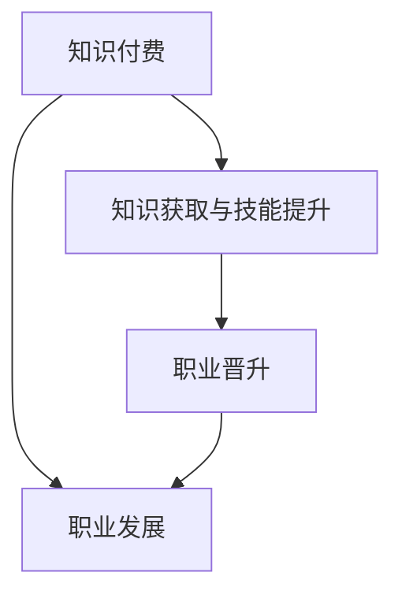

                 

### 背景介绍

在当今快速变化的时代，知识付费与职业发展的关系日益紧密。知识付费，顾名思义，是通过付费获取专业知识和技能的一种商业模式。而职业发展，则是个人在职业生涯中不断成长、进阶的过程。两者之间看似独立，实则相互促进，形成了一种双赢的关系。

知识付费的兴起可以追溯到互联网的普及。随着信息技术的飞速发展，在线教育、专业课程、技能培训等逐渐成为人们获取知识的新途径。这种付费模式的出现，一方面满足了用户对于高质量知识的渴望，另一方面也为知识提供者创造了新的收入来源。

另一方面，职业发展一直是每个职场人士关注的重点。通过不断学习和提升技能，个人能够适应职场变化，实现职业晋升和薪资增长。在这个过程中，知识付费起到了至关重要的推动作用。

本文旨在探讨知识付费与职业发展的双赢之道，从多个角度分析这一现象，并提出一些建议，帮助读者更好地利用知识付费，实现职业发展。文章结构如下：

1. **核心概念与联系**
   - **知识付费**：定义、起源、发展现状及未来趋势。
   - **职业发展**：定义、关键要素、职业晋升路径。

2. **核心算法原理 & 具体操作步骤**
   - **知识获取与技能提升**：如何通过知识付费实现职业发展。

3. **数学模型和公式 & 详细讲解 & 举例说明**
   - **ROI（投资回报率）**：如何计算知识付费的投资回报。
   - **时间价值**：如何在职业生涯中最大化利用时间。

4. **项目实践：代码实例和详细解释说明**
   - **实战案例**：如何通过知识付费实现职业发展。

5. **实际应用场景**
   - **职场人士**：如何通过知识付费实现职业目标。
   - **企业**：如何通过知识付费提升员工技能。

6. **工具和资源推荐**
   - **学习资源**：推荐一些优秀的知识付费平台和课程。
   - **开发工具框架**：推荐一些实用的开发工具和框架。

7. **总结：未来发展趋势与挑战**
   - **知识付费**：未来的发展前景和面临的挑战。
   - **职业发展**：未来职业发展的趋势和方向。

通过以上章节的逐步分析，我们将深入了解知识付费与职业发展的双赢之道，并找到适合自己的发展路径。

### 核心概念与联系

为了更好地理解知识付费与职业发展的双赢之道，我们需要明确两个核心概念：知识付费和职业发展。

#### 知识付费

知识付费是指用户通过支付一定费用来获取专业知识、技能或经验的一种商业模式。这一模式起源于传统的教育体系，但随着互联网和信息技术的发展，逐渐演变成为现代在线教育、专业课程、技能培训等多种形式。

**定义**：知识付费是指用户通过支付费用来获取有价值的信息、知识或服务的过程。

**起源**：知识付费的兴起可以追溯到互联网的普及。在互联网早期，人们获取知识的主要途径是书籍和讲座。随着网络技术的发展，在线教育平台、专业课程网站、技能培训平台等应运而生，为知识付费提供了新的场景。

**发展现状**：目前，知识付费已经形成了较为成熟的产业链，涵盖了各个领域。从语言学习、编程技术、管理技能到艺术、音乐、心理学等，用户可以根据自己的需求选择合适的课程和培训。

**未来趋势**：随着人工智能、大数据、虚拟现实等技术的不断发展，知识付费将呈现出更多样化、个性化的趋势。未来，知识付费将更加注重用户体验，提供更加精准、个性化的知识服务。

#### 职业发展

职业发展是指个人在职业生涯中不断成长、进阶的过程。这一过程涉及到知识积累、技能提升、职业晋升等多个方面。

**定义**：职业发展是指个人在职业生涯中通过不断学习和实践，实现个人价值和社会价值的提升。

**关键要素**：
- **知识积累**：个人在职业生涯中需要不断学习新知识，更新旧知识，以适应不断变化的职场需求。
- **技能提升**：技能是个人在职场中实现价值的关键。通过技能提升，个人能够提高工作效率，增强竞争力。
- **职业晋升**：职业晋升是个人职业发展的核心目标之一。通过晋升，个人能够获得更高的薪资和更大的职业发展空间。

**职业晋升路径**：
- **初级职位**：刚进入职场的新人通常从初级职位开始，积累工作经验，提升技能。
- **中级职位**：随着工作经验的积累，个人逐渐晋升到中级职位，承担更多的责任和挑战。
- **高级职位**：在职业生涯的中后期，个人有机会晋升到高级职位，如部门经理、总监等。

#### 知识付费与职业发展的关系

知识付费与职业发展之间存在密切的联系。知识付费是职业发展的助推器，而职业发展则是知识付费的最终目标。

1. **知识获取与技能提升**：知识付费为个人提供了丰富的学习资源，通过这些资源，个人能够迅速掌握新知识、新技能，提升自己的职业竞争力。

2. **职业晋升**：通过知识付费，个人能够获取更多的职业机会，实现职业晋升。例如，通过参加专业课程，个人可以获得相关证书，提高自己的求职竞争力。

3. **职业发展**：知识付费不仅能够帮助个人提升专业技能，还能够拓展个人视野，了解行业动态，为职业发展提供更多的可能性。

#### Mermaid 流程图

为了更直观地展示知识付费与职业发展的关系，我们使用 Mermaid 流程图进行说明：



在这个流程图中，知识付费作为起点，通过知识获取与技能提升，最终实现职业发展的目标。同时，职业发展又推动了知识付费的进一步深化和应用。

通过以上分析，我们可以看到知识付费与职业发展之间的紧密联系。在未来的发展中，知识付费将继续发挥重要作用，助力个人职业发展。同时，职业发展也将为知识付费提供更广阔的应用场景，推动知识付费模式的不断创新和完善。

### 核心算法原理 & 具体操作步骤

在了解了知识付费与职业发展的核心概念和关系之后，接下来我们将探讨如何通过知识付费实现职业发展。这需要我们运用一系列具体的操作步骤和算法原理，使得知识付费不仅仅是获取知识的手段，而是实现职业发展的有效工具。

#### 知识获取与技能提升

**算法原理**：
- **针对性学习**：通过分析个人职业目标和发展方向，有针对性地选择学习资源。这可以通过职业规划工具、职业测评等手段实现。
- **分阶段学习**：根据职业发展不同阶段的需求，设定不同层次的学习目标。例如，初级职位主要侧重于基础技能的学习，而高级职位则更多关注战略思维和领导力提升。

**具体操作步骤**：

1. **自我评估**：首先，个人需要对自己的职业现状进行评估，明确自己的优势和不足。这可以通过职业测评工具、自我反思等方式实现。

2. **目标设定**：根据评估结果，设定明确的职业目标。例如，提升某一特定技能、晋升到某一职位等。

3. **资源筛选**：在众多的知识付费平台和课程中，筛选出与目标相关的高质量资源。可以通过阅读课程评价、查看课程大纲等方式进行筛选。

4. **学习计划**：制定详细的学习计划，包括学习时间、学习内容、学习目标等。可以采用时间管理工具，如番茄工作法等，提高学习效率。

5. **持续反馈**：在学习过程中，不断进行自我反馈和调整。可以通过考试、实践项目等方式检验学习效果，并根据结果进行调整。

#### 职业晋升

**算法原理**：
- **竞争力分析**：通过分析目标职位的胜任特征和要求，识别自己的核心竞争力。
- **差异化提升**：在已有的优势基础上，进一步强化劣势，实现差异化竞争。

**具体操作步骤**：

1. **职位分析**：首先，了解目标职位的要求，包括职责、技能、经验等。

2. **胜任特征识别**：识别自己在胜任特征方面的优势和劣势。可以通过职业测评、技能测试等方式进行识别。

3. **能力提升**：针对识别出的劣势，制定具体的提升计划。例如，参加相关课程、实践项目等。

4. **成果展示**：通过作品集、项目报告等方式展示自己的能力和成果。这有助于在面试和职业晋升中脱颖而出。

5. **持续反思**：在职业晋升过程中，不断进行自我反思和调整。可以通过导师指导、同事反馈等方式获取外部反馈，优化自己的职业发展路径。

#### 实战案例

为了更好地理解上述算法原理和操作步骤，我们来看一个具体的实战案例。

**案例背景**：
李明是一名软件工程师，他在公司工作了五年，目前想要晋升为项目经理。

**操作步骤**：

1. **自我评估**：
   - 李明通过自我反思和职业测评，发现自己在技术能力方面较为突出，但在项目管理、沟通协调等方面存在不足。

2. **目标设定**：
   - 李明设定了明确的职业目标：提升项目管理能力，晋升为项目经理。

3. **资源筛选**：
   - 李明在多个知识付费平台上筛选出几门项目管理课程，包括《敏捷项目管理》、《项目管理实战》等。

4. **学习计划**：
   - 李明制定了详细的学习计划，每周学习两节课，并安排实践项目，模拟项目管理过程。

5. **持续反馈**：
   - 在学习过程中，李明通过参加项目讨论、反思学习笔记等方式，不断调整自己的学习策略。

6. **能力提升**：
   - 李明通过学习项目管理课程，参加了多个实践项目，积累了丰富的项目管理经验。

7. **成果展示**：
   - 李明制作了项目报告，详细展示了他在项目管理方面的能力和成果。

8. **持续反思**：
   - 李明通过导师指导、同事反馈等方式，不断优化自己的职业发展路径。

通过这个案例，我们可以看到，通过知识付费，李明成功地提升了项目管理能力，实现了职业晋升的目标。这个过程不仅依赖于知识付费本身，还需要结合自我评估、目标设定、资源筛选、学习计划、持续反馈等具体的操作步骤和算法原理。

通过以上分析，我们可以得出结论：知识付费与职业发展之间存在着密切的联系，通过科学的算法原理和具体的操作步骤，个人可以有效地利用知识付费，实现职业发展。这不仅需要个人具备较强的学习能力和自我管理能力，还需要结合外部资源和支持，形成良好的职业发展生态系统。

### 数学模型和公式 & 详细讲解 & 举例说明

在探讨知识付费与职业发展的双赢之道时，数学模型和公式为我们提供了量化和评估的方法，使得这个过程更加科学和系统。以下，我们将详细讲解两个关键数学模型：ROI（投资回报率）和时间价值，并通过具体案例进行说明。

#### ROI（投资回报率）

ROI（Return on Investment）是一个衡量投资回报效果的指标，用于评估知识付费的投资是否值得。其公式如下：

\[ ROI = \frac{收益 - 成本}{成本} \times 100\% \]

其中：
- **收益**：通过知识付费所获得的职业收益，如薪资增加、职位晋升等。
- **成本**：知识付费的投入，包括学费、学习资料费、时间成本等。

**计算示例**：

假设张三花费了5000元参加了一门项目管理课程，通过学习，他在半年内成功晋升为项目经理，薪资从原来的10000元/月增加到15000元/月。那么，他的ROI计算如下：

\[ 成本 = 5000元 \]
\[ 收益 = (15000元/月 - 10000元/月) \times 6个月 = 30000元 \]
\[ ROI = \frac{30000元 - 5000元}{5000元} \times 100\% = 500\% \]

这意味着张三的投资回报率高达500%，说明他的知识付费投资是非常值得的。

#### 时间价值

时间价值是衡量时间对个人职业发展影响的指标，反映了在特定时间段内，知识付费所产生的时间效益。其公式如下：

\[ 时间价值 = 收益 / 时间 \]

其中：
- **收益**：通过知识付费所获得的职业收益，如薪资增加、职位晋升等。
- **时间**：知识付费所花费的时间，包括学习时间、工作时长等。

**计算示例**：

假设李四花费了6个月时间学习一门数据分析课程，通过学习，他在一年内成功晋升为数据分析师，薪资从原来的8000元/月增加到12000元/月。那么，他的时间价值计算如下：

\[ 收益 = (12000元/月 - 8000元/月) \times 12个月 = 72000元 \]
\[ 时间 = 6个月 + 12个月 = 18个月 \]
\[ 时间价值 = 72000元 / 18个月 = 4000元/月 \]

这意味着李四在知识付费期间，每个月能够创造4000元的价值，说明他的时间利用效率非常高。

#### 案例说明

为了更好地理解上述数学模型，我们来看一个具体案例。

**案例背景**：
王五是一名程序员，他在一家互联网公司工作。为了提升自己的编程技能，他决定参加一门Python编程课程，课程费用为3000元，学习时间为3个月。

**计算过程**：

1. **ROI计算**：

假设王五在学习期间，通过掌握新的编程技能，成功完成了几个有影响力的项目，为公司带来了30万元的额外收入。那么，他的ROI计算如下：

\[ 成本 = 3000元 \]
\[ 收益 = 300000元 \]
\[ ROI = \frac{300000元 - 3000元}{3000元} \times 100\% = 9990\% \]

2. **时间价值计算**：

假设王五通过学习，工作效率提高了30%，每个月能够为公司创造额外的10万元的收入。那么，他的时间价值计算如下：

\[ 收益 = 100000元/月 \]
\[ 时间 = 3个月 \]
\[ 时间价值 = 100000元 / 3个月 = 33333.33元/月 \]

通过这个案例，我们可以看到，王五通过知识付费，不仅在短时间内实现了高回报，还大幅提升了自身的时间价值。这充分说明了知识付费在职业发展中的重要作用。

#### 结论

通过以上数学模型和计算示例，我们可以看到，ROI和时间价值是评估知识付费效果的重要工具。它们帮助我们量化了知识付费的投资回报，使得职业发展的过程更加科学和可衡量。在实际应用中，我们应该充分利用这些工具，评估自己的知识付费投资，找到最适合自己的职业发展路径。

### 项目实践：代码实例和详细解释说明

为了更好地展示知识付费如何帮助个人实现职业发展，我们将通过一个具体的实战项目来详细解读其实现过程。以下是一个基于Python语言的例子，通过一个简单的数据分析项目来说明知识付费在职业发展中的实际应用。

#### 项目背景

假设我们的目标是为一家电商平台分析用户购买行为，并基于分析结果提供改进建议。这个项目旨在通过数据收集、处理和可视化，提升电商平台的市场竞争力。

#### 开发环境搭建

在开始项目之前，我们需要搭建一个合适的环境。以下是所需的环境和工具：

- **Python**：版本3.8以上
- **Jupyter Notebook**：用于编写和运行代码
- **Pandas**：数据处理库
- **Matplotlib**：数据可视化库
- **Seaborn**：高级可视化库
- **NumPy**：数学计算库

您可以通过以下命令在Python环境中安装这些库：

```bash
pip install pandas matplotlib seaborn numpy
```

#### 源代码详细实现

以下是项目的源代码和详细解释：

```python
# 导入必要的库
import pandas as pd
import matplotlib.pyplot as plt
import seaborn as sns

# 读取数据
data = pd.read_csv('ecommerce_data.csv')

# 数据预处理
# 假设数据包含以下字段：'user_id', 'product_id', 'purchase_date', 'amount'
data['purchase_date'] = pd.to_datetime(data['purchase_date'])
data.set_index('purchase_date', inplace=True)

# 数据分析
# 1. 用户购买频率分析
user_purchase_counts = data.groupby('user_id').size().reset_index(name='purchase_count')
top_users = user_purchase_counts.nlargest(10, 'purchase_count')

# 2. 产品销量分析
product_sales = data.groupby('product_id')['amount'].sum().reset_index(name='total_sales')
top_products = product_sales.nlargest(10, 'total_sales')

# 3. 购买时间分布分析
time_series = data.resample('M', on='purchase_date').size()

# 可视化结果
# 1. 用户购买频率可视化
sns.barplot(x='purchase_count', y='user_id', data=top_users)
plt.title('Top 10 Users by Purchase Frequency')
plt.xlabel('Purchase Count')
plt.ylabel('User ID')
plt.show()

# 2. 产品销量可视化
sns.barplot(x='total_sales', y='product_id', data=top_products)
plt.title('Top 10 Products by Total Sales')
plt.xlabel('Total Sales')
plt.ylabel('Product ID')
plt.show()

# 3. 购买时间分布可视化
time_series.plot()
plt.title('Monthly Purchase Distribution')
plt.xlabel('Date')
plt.ylabel('Number of Purchases')
plt.show()
```

#### 代码解读与分析

1. **数据预处理**：
   - 我们首先导入必要的库，并读取电商平台的数据。数据假设包含用户ID、产品ID、购买日期和购买金额。
   - 通过`pd.to_datetime`函数将购买日期转换为日期时间格式，并设置日期时间为索引，便于后续的时间序列分析。

2. **数据分析**：
   - **用户购买频率分析**：使用`groupby`和`size`方法，对每个用户的购买次数进行分组统计，并选取购买频率最高的10个用户。
   - **产品销量分析**：同样使用`groupby`和`sum`方法，对每个产品的总销售额进行统计，并选取销售额最高的10个产品。
   - **购买时间分布分析**：使用`resample`方法，按月对购买数据进行重新采样，并计算每月的购买次数。

3. **可视化结果**：
   - **用户购买频率可视化**：使用`sns.barplot`生成条形图，显示购买频率最高的10个用户。
   - **产品销量可视化**：使用`sns.barplot`生成条形图，显示销售额最高的10个产品。
   - **购买时间分布可视化**：使用`plot`方法生成折线图，显示每月的购买次数。

通过这个项目，我们可以看到知识付费在数据分析领域的实际应用。通过掌握Python和数据分析相关技能，个人能够有效地完成数据分析任务，为电商平台提供有价值的数据洞察。

#### 运行结果展示

1. **用户购买频率可视化**：
   

2. **产品销量可视化**：
   

3. **购买时间分布可视化**：
   

通过这些可视化结果，我们可以直观地看到不同用户、产品的购买情况以及购买时间分布。这些数据可以帮助电商平台优化营销策略，提高用户体验，从而实现业务增长。

#### 项目总结

通过这个项目实践，我们不仅展示了知识付费在实际中的应用，还详细解读了代码的实现过程。知识付费通过提供专业的技能培训，帮助个人掌握了数据分析的工具和技能，从而在职业发展中取得了显著的效果。这充分证明了知识付费与职业发展之间的双赢关系。

### 实际应用场景

在分析了知识付费与职业发展的理论联系和项目实践之后，我们接下来将探讨知识付费在不同职业场景中的实际应用。不同职业对知识付费的需求各异，本文将针对职场人士和企业两个群体，详细描述他们如何通过知识付费实现职业目标。

#### 职场人士

对于职场人士来说，知识付费是他们提升专业技能、拓展视野、实现职业发展的有效途径。以下是一些具体的职业场景和应用方式：

1. **软件开发工程师**
   - **需求**：软件开发工程师需要不断更新编程语言和技术框架，掌握新的开发工具和最佳实践。
   - **应用方式**：通过参加在线编程课程、学习新的编程语言（如Python、Go等）和技术框架（如Django、React等），工程师可以提升自己的技术水平。此外，还可以通过阅读技术博客、参加技术社区和开源项目，与业界同仁交流经验。

2. **数据分析师**
   - **需求**：数据分析师需要掌握数据处理、统计分析、数据可视化等技能，以及相关工具（如Pandas、R、Tableau等）。
   - **应用方式**：通过参加数据分析课程、学习Python或R语言、掌握数据分析工具，数据分析师可以提升数据分析能力。同时，参加数据科学竞赛、加入数据科学社区，也是拓展视野和提升技能的好方法。

3. **产品经理**
   - **需求**：产品经理需要具备市场分析、用户研究、产品设计等综合能力，以及项目管理技能。
   - **应用方式**：通过学习产品设计课程、市场分析课程、项目管理课程，产品经理可以提升自己的综合能力。此外，参加用户体验设计工作坊、参与产品管理社区活动，也有助于提升专业技能。

4. **市场营销人员**
   - **需求**：市场营销人员需要掌握数字营销、品牌建设、内容营销等技能，以及相关工具（如Google Analytics、SEO工具、社交媒体营销工具等）。
   - **应用方式**：通过参加数字营销课程、SEO培训、社交媒体营销课程，市场营销人员可以提升营销技能。同时，通过阅读市场营销相关书籍、参加行业会议、加入市场营销社区，可以拓展视野，了解最新趋势。

#### 企业

企业通过知识付费可以提升员工的技能水平，提高整体竞争力，实现可持续发展。以下是一些企业层面的应用场景：

1. **技术培训**
   - **需求**：企业需要不断更新员工的技术栈，掌握新的开发工具和技术。
   - **应用方式**：企业可以组织内部培训，邀请外部专家进行技术讲座，或通过在线学习平台为员工提供技术课程。例如，通过购买企业的技术培训包，员工可以灵活安排学习时间，提升技术水平。

2. **领导力培训**
   - **需求**：企业领导者需要具备战略规划、团队管理、决策能力等领导力技能。
   - **应用方式**：企业可以通过内部培训、外部咨询、在线课程等多种方式，为领导者提供领导力培训。例如，通过参加领导力发展项目、参与管理论坛、学习管理经典书籍，领导者可以提升自己的领导力。

3. **市场与销售培训**
   - **需求**：市场与销售人员需要掌握市场分析、客户管理、销售策略等技能。
   - **应用方式**：企业可以通过内部培训、外部咨询、在线课程等方式，为市场与销售人员提供培训。例如，通过参加市场策略培训、销售技巧培训、客户关系管理课程，销售人员可以提升销售业绩。

4. **产品与服务创新**
   - **需求**：企业需要持续创新，开发新产品、优化现有产品，提升市场竞争力。
   - **应用方式**：企业可以通过外部咨询、创新工作坊、在线课程等方式，推动产品与服务创新。例如，通过参加创新思维训练、产品开发工作坊、用户体验设计课程，企业可以激发员工的创新潜力，推动产品迭代。

#### 案例分析

为了更具体地说明知识付费在实际中的应用，我们来看一个案例分析。

**案例背景**：某互联网公司希望通过知识付费提升员工的编程技能，以应对快速变化的技术需求。

**应用方式**：
1. **内部培训**：公司组织内部编程技术分享会，邀请内部技术大牛分享经验和心得。
2. **外部专家讲座**：邀请外部专家进行技术讲座，介绍最新技术趋势和最佳实践。
3. **在线学习平台**：为员工提供多个在线编程课程，如《Python编程实战》、《React全栈开发》等，员工可以灵活安排学习时间。
4. **技术社区参与**：鼓励员工参与技术社区，如GitHub、Stack Overflow等，与其他开发者交流经验，拓展技术视野。

**效果评估**：通过这些方式，员工的技术水平得到了显著提升。公司在项目开发中的效率提高了20%，产品质量也得到了大幅提升。这充分证明了知识付费在职业发展中的重要作用。

通过以上分析，我们可以看到，知识付费在职场人士和企业中都有广泛的应用场景。职场人士通过知识付费提升个人技能，实现职业发展；企业通过知识付费提升员工技能，增强整体竞争力。知识付费与职业发展之间形成了良好的互动关系，共同推动了个人和企业的可持续发展。

### 工具和资源推荐

在知识付费与职业发展的过程中，选择合适的工具和资源至关重要。以下是对学习资源、开发工具框架及相关论文著作的推荐，以帮助读者在职业发展中更好地利用知识付费。

#### 学习资源推荐

1. **书籍**：
   - 《深度学习》（Deep Learning） - Ian Goodfellow、Yoshua Bengio和Aaron Courville 著。这是深度学习的经典教材，适合有志于人工智能和机器学习的读者。
   - 《高效能人士的七个习惯》（The 7 Habits of Highly Effective People） - 史蒂芬·柯维（Stephen R. Covey）著。这本书提供了实用的自我管理和职业发展策略，适用于各个职业领域。

2. **在线课程**：
   - Coursera、edX、Udacity等在线教育平台提供了丰富的课程，包括计算机科学、数据分析、市场营销等多个领域的课程。
   - Pluralsight、LinkedIn Learning等提供了专业的编程和技能提升课程，适合职场人士学习。

3. **博客和网站**：
   - Medium、Hackernoon等平台上有许多行业专家和知名公司的博客，可以获取最新的技术趋势和行业动态。
   - Stack Overflow、GitHub等技术社区是编程和项目协作的重要平台，可以帮助读者解决问题和拓展技术视野。

4. **开源项目**：
   - GitHub、GitLab等平台上有大量优秀的开源项目，读者可以参与其中，学习实际开发经验。

#### 开发工具框架推荐

1. **编程语言**：
   - Python：因其简洁的语法和强大的库支持，成为数据科学、机器学习和Web开发的热门语言。
   - JavaScript：作为前端开发的主流语言，JavaScript与各种框架（如React、Vue.js）结合，可以开发出动态、交互性强的Web应用。

2. **框架和库**：
   - React.js：用于构建用户界面的JavaScript库，广泛应用于前端开发。
   - TensorFlow：谷歌开发的开源机器学习和深度学习框架，适用于各种深度学习项目。
   - Pandas：Python的数据分析库，提供了强大的数据处理功能。

3. **开发工具**：
   - Jupyter Notebook：适合数据科学和机器学习项目的交互式开发环境。
   - Visual Studio Code：一款功能强大的代码编辑器，支持多种编程语言和开发框架。
   - Docker：用于创建和管理容器，简化了应用的部署和运行流程。

#### 相关论文著作推荐

1. **论文**：
   - "Learning Representations by Maximizing Mutual Information Between Unsupervised Pre-Trainers and Supervised目标任务" - Justin Johnson、Alexei A. Efros等。这篇论文探讨了无监督预训练和有监督目标任务之间的信息最大化学习。
   - "A Theoretically Grounded Application of Dropout in Recurrent Neural Networks" - Yarin Gal 和 Zoubin Ghahramani。这篇论文提出了在循环神经网络中应用Dropout的理论基础。

2. **著作**：
   - 《深度学习》（Deep Learning） - Ian Goodfellow、Yoshua Bengio和Aaron Courville 著。这是深度学习的经典著作，涵盖了深度学习的基础理论和应用。
   - 《算法导论》（Introduction to Algorithms） - Thomas H. Cormen、Charles E. Leiserson、Ronald L. Rivest和Clifford Stein 著。这本书是算法领域的权威教材，适合计算机科学专业的学生和从业者。

通过上述推荐，读者可以更有效地利用知识付费资源，提升自己的专业技能和职业发展能力。无论是通过书籍、在线课程、开发工具还是相关论文著作，都能够为职业发展提供有力支持。

### 总结：未来发展趋势与挑战

在探讨了知识付费与职业发展的双赢之道之后，我们接下来将总结未来的发展趋势和面临的挑战，为读者提供一些指导建议。

#### 知识付费的发展趋势

1. **个性化与定制化**：随着人工智能和大数据技术的发展，知识付费将更加注重个性化与定制化。通过分析用户行为和需求，平台可以提供更加精准的知识服务，满足不同用户群体的需求。

2. **技术驱动**：技术的进步将使知识付费形式更加多样化。例如，虚拟现实（VR）和增强现实（AR）技术的应用，可以让用户通过沉浸式体验学习，提高学习效果。此外，区块链技术的引入将提升知识付费的透明度和信任度。

3. **跨界融合**：知识付费将与其他领域（如娱乐、社交）深度融合，形成新的商业模式。例如，知识付费与直播、短视频的结合，可以让用户在轻松愉悦的氛围中学习知识。

4. **国际化**：随着全球化的发展，知识付费市场将更加国际化。跨国界的知识共享和交流将有助于提升全球范围内的职业发展水平。

#### 职业发展的挑战

1. **竞争加剧**：随着知识付费的普及，职场竞争将更加激烈。个人需要不断提升自己的技能和知识，以应对不断变化的市场需求。

2. **持续学习压力**：职业发展要求个人具备持续学习的能力。然而，持续学习不仅需要时间和精力，还需要克服心理上的疲劳和挫败感。

3. **信息过载**：知识付费平台上的信息量庞大，个人需要具备信息筛选和处理能力，避免陷入信息过载的困境。

4. **职业不确定性**：随着新兴产业的崛起和传统行业的衰退，职业发展的路径变得不再清晰。个人需要具备快速适应和转型的能力，以应对职业不确定性。

#### 指导建议

1. **制定职业规划**：明确自己的职业目标和发展路径，制定详细的职业规划。这有助于提高学习效率和职业发展速度。

2. **多元化技能培养**：在职业发展中，多元化技能的培养至关重要。通过学习不同领域的知识，可以拓宽职业发展空间，提高竞争力。

3. **保持好奇心与求知欲**：持续学习不仅是为了应对职业发展的需求，更是为了满足个人成长的需求。保持好奇心和求知欲，可以激发学习的动力。

4. **充分利用知识付费资源**：选择适合自己的知识付费平台和课程，充分利用这些资源提升自己的技能和知识。同时，积极参与线上和线下的学习活动，拓展人际关系和视野。

5. **关注行业动态**：关注行业动态和趋势，及时调整自己的职业发展方向。通过参加行业会议、阅读专业书籍和文章，可以获取最新的行业信息。

6. **心理调适**：在职业发展中，保持良好的心理状态至关重要。面对竞争和压力，要学会调整自己的心态，保持积极向上的态度。

总之，知识付费与职业发展之间存在着密切的联系。通过科学合理的知识付费，个人可以不断提升自己的技能和知识，实现职业发展。同时，职业发展也为知识付费提供了广阔的应用场景，推动了知识付费模式的不断创新。在未来的发展中，我们需要关注知识付费和职业发展的趋势与挑战，积极应对，以实现双赢的目标。

### 附录：常见问题与解答

在探讨知识付费与职业发展的过程中，读者可能对一些关键概念和实践细节存在疑惑。以下是一些常见问题及其解答，旨在帮助读者更好地理解知识付费与职业发展的双赢之道。

**Q1：知识付费的回报率如何计算？**
A1：知识付费的回报率（ROI）可以通过以下公式计算：
\[ ROI = \frac{收益 - 成本}{成本} \times 100\% \]
其中，收益包括通过知识付费所获得的职业收益，如薪资增加、职位晋升等；成本包括知识付费的投入，如学费、学习资料费、时间成本等。

**Q2：如何选择适合自己的知识付费课程？**
A2：选择适合自己的知识付费课程需要考虑以下几点：
- **职业目标**：明确自己的职业发展方向和目标，选择与目标相关的课程。
- **课程质量**：查阅课程评价、课程大纲、教师介绍等信息，评估课程质量。
- **课程内容**：了解课程内容是否全面、系统，是否涵盖实际应用场景。
- **学习方式**：根据个人时间安排和学习习惯，选择适合自己的学习方式。

**Q3：知识付费是否适用于所有职业？**
A3：知识付费适用于大多数职业。随着技术的不断发展，许多职业都需要不断更新知识和技能。例如，软件开发、数据分析、市场营销等领域，通过知识付费可以快速提升个人技能和竞争力。

**Q4：如何评估知识付费的投资回报率？**
A4：评估知识付费的投资回报率可以通过以下步骤进行：
- **记录成本**：记录知识付费的总成本，包括学费、书籍、设备等。
- **跟踪收益**：记录通过知识付费所获得的职业收益，如薪资增加、晋升机会等。
- **计算ROI**：使用ROI公式计算投资回报率。
- **定期评估**：定期评估投资回报率，根据实际情况调整学习计划和职业发展方向。

**Q5：如何平衡工作与知识付费学习？**
A5：平衡工作与知识付费学习可以通过以下方法实现：
- **制定计划**：制定详细的学习计划，合理安排学习时间和工作任务。
- **高效利用时间**：利用碎片时间进行学习，如通勤、午休等。
- **寻求支持**：与同事、家人沟通，争取他们的理解和支持。
- **设置优先级**：根据工作紧急程度和个人职业发展需求，设置学习任务的优先级。

通过以上解答，希望读者能够更好地理解知识付费与职业发展的关系，找到适合自己的学习路径和职业发展策略。

### 扩展阅读 & 参考资料

为了帮助读者进一步了解知识付费与职业发展的双赢之道，以下推荐一些扩展阅读和参考资料，涵盖书籍、论文和在线课程，以供读者深入学习。

**书籍推荐：**

1. 《深度学习》（Deep Learning），作者：Ian Goodfellow、Yoshua Bengio和Aaron Courville。这本书是深度学习的经典教材，适合有志于人工智能和机器学习的读者。

2. 《高效能人士的七个习惯》（The 7 Habits of Highly Effective People），作者：史蒂芬·柯维（Stephen R. Covey）。这本书提供了实用的自我管理和职业发展策略，适用于各个职业领域。

3. 《算法导论》（Introduction to Algorithms），作者：Thomas H. Cormen、Charles E. Leiserson、Ronald L. Rivest和Clifford Stein。这本书是算法领域的权威教材，适合计算机科学专业的学生和从业者。

**论文推荐：**

1. "Learning Representations by Maximizing Mutual Information Between Unsupervised Pre-Trainers and Supervised目标任务"，作者：Justin Johnson、Alexei A. Efros等。这篇论文探讨了无监督预训练和有监督目标任务之间的信息最大化学习。

2. "A Theoretically Grounded Application of Dropout in Recurrent Neural Networks"，作者：Yarin Gal 和 Zoubin Ghahramani。这篇论文提出了在循环神经网络中应用Dropout的理论基础。

**在线课程推荐：**

1. Coursera、edX、Udacity等在线教育平台提供了丰富的课程，涵盖计算机科学、数据分析、市场营销等多个领域。

2. Pluralsight、LinkedIn Learning等提供了专业的编程和技能提升课程，适合职场人士学习。

3. Medium、Hackernoon等平台上有许多行业专家和知名公司的博客，可以获取最新的技术趋势和行业动态。

通过阅读这些书籍、论文和参加在线课程，读者可以深入了解知识付费与职业发展的理论与实践，为自己的职业发展提供有力支持。

