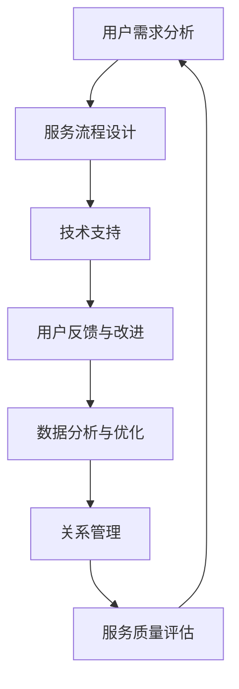

                 

### 1. 背景介绍

知识付费产品，作为近年来快速崛起的在线教育领域的重要分支，受到了广大用户和企业的青睐。其核心在于通过付费的方式，为用户提供高质量、专业的知识和技能服务，从而满足用户在个人成长、职业发展等方面的需求。然而，随着市场需求的不断增长和竞争的加剧，如何构建一个完善、高效的售后服务体系，成为了知识付费产品在市场竞争中立足的关键。

售后服务体系不仅是企业对用户关怀的体现，更是提升用户满意度和忠诚度的关键因素。一个优秀的售后服务体系，不仅可以帮助企业快速响应用户需求，解决用户在使用过程中遇到的问题，还能通过及时、有效的沟通，增强用户对产品的认可和信任。

在知识付费领域，售后服务体系的重要性体现在以下几个方面：

1. **用户满意度提升**：完善的售后服务体系可以迅速解决用户在学习过程中遇到的问题，提高用户的学习体验和满意度。
2. **用户忠诚度增强**：优质的售后服务能够增强用户对产品的信任和依赖，促进用户长期使用。
3. **口碑传播**：用户满意度和忠诚度的提升，会通过口碑传播的方式，吸引更多的新用户。
4. **品牌形象塑造**：良好的售后服务可以提升企业的品牌形象，增强市场竞争力。

因此，构建一个科学、合理的知识付费产品售后服务体系，是当前知识付费企业面临的紧迫任务。

在接下来的文章中，我们将详细探讨知识付费产品的售后服务体系构建，包括其核心概念、服务流程、技术实现和实际应用，旨在为知识付费企业提供一套可操作性强的解决方案。

### 2. 核心概念与联系

要构建一个有效的知识付费产品售后服务体系，首先需要明确其中的核心概念及其相互联系。以下是几个关键概念及其在售后服务体系中的角色：

#### 2.1 用户需求分析

用户需求分析是构建售后服务体系的基础。通过收集和分析用户在使用产品过程中的反馈和问题，企业可以了解用户的需求和痛点，从而有针对性地提供解决方案。这包括用户在使用产品过程中遇到的技术问题、学习困难、资源需求等方面。

#### 2.2 服务流程设计

服务流程设计是售后服务体系的核心。一个高效的服务流程应该包括问题接收、问题分类、解决方案制定、问题解决、用户反馈收集等环节。每个环节都需要有明确的操作规范和流程，以确保问题能够迅速、准确地得到解决。

#### 2.3 技术支持

技术支持是售后服务体系的重要组成部分。通过建立专业的技术支持团队，企业可以提供及时的技术支持和故障排除服务，帮助用户解决在使用过程中遇到的技术难题。

#### 2.4 用户反馈与改进

用户反馈与改进是售后服务体系的持续优化环节。通过收集用户的反馈意见，企业可以不断优化产品和服务，提升用户体验。这一环节不仅有助于提高用户满意度，还能为企业提供宝贵的改进方向。

#### 2.5 数据分析与优化

数据分析与优化是售后服务体系的智能升级方向。通过大数据分析，企业可以了解用户行为、需求变化等关键信息，从而进行服务流程优化、资源分配调整，提升整体服务效率。

#### 2.6 关系管理

关系管理是售后服务体系中不可或缺的一部分。通过建立良好的用户关系，企业可以增强用户忠诚度，促进长期合作。

#### 2.7 服务质量评估

服务质量评估是衡量售后服务体系效果的重要指标。通过定期对服务质量进行评估，企业可以及时发现和解决存在的问题，确保售后服务体系的高效运行。

#### 2.8 Mermaid 流程图

为了更直观地展示售后服务体系的核心概念及其相互联系，我们使用 Mermaid 工具绘制了一个简单的流程图，如下所示：



在这个流程图中，每个节点代表一个核心概念，箭头表示概念之间的关联。通过这个流程图，我们可以清晰地看到售后服务体系中的各个环节及其相互影响。

综上所述，构建一个有效的知识付费产品售后服务体系，需要从用户需求分析、服务流程设计、技术支持、用户反馈与改进、数据分析与优化、关系管理、服务质量评估等多个方面进行综合考虑和设计。接下来，我们将详细探讨这些核心概念的具体实现和应用。

### 3. 核心算法原理 & 具体操作步骤

在构建知识付费产品的售后服务体系中，核心算法原理和服务流程设计至关重要。以下是售后服务体系的核心算法原理和具体操作步骤：

#### 3.1 核心算法原理

售后服务体系的核心算法原理主要涉及以下几个方面：

1. **用户需求分析算法**：通过自然语言处理技术（如词频分析、情感分析等）对用户反馈进行分类和分析，识别用户的主要需求和问题。
2. **服务流程优化算法**：使用机器学习算法（如决策树、神经网络等）对服务流程中的各个环节进行优化，提高问题解决效率和用户满意度。
3. **资源调度算法**：基于用户需求和服务能力，通过动态调度算法（如遗传算法、粒子群算法等）分配服务资源，确保问题能够及时、有效地解决。
4. **用户反馈评估算法**：使用评分和反馈机制，通过用户满意度调查和数据统计，对售后服务质量进行评估和改进。

#### 3.2 具体操作步骤

以下是构建知识付费产品售后服务体系的具体操作步骤：

1. **需求收集与分类**
   - **步骤1**：通过在线调查、用户反馈、社交媒体等渠道收集用户的需求和问题。
   - **步骤2**：使用自然语言处理技术对用户反馈进行分类，如技术问题、学习困难、资源需求等。

2. **服务流程设计**
   - **步骤1**：根据需求分类，设计服务流程，包括问题接收、问题分类、解决方案制定、问题解决、用户反馈收集等环节。
   - **步骤2**：明确每个环节的操作规范和流程，确保问题能够迅速、准确地得到解决。

3. **资源调度**
   - **步骤1**：根据用户需求和服务能力，制定资源调度策略。
   - **步骤2**：使用动态调度算法，实时调整服务资源分配，确保问题得到及时解决。

4. **问题解决与反馈**
   - **步骤1**：根据服务流程，对用户问题进行分类和定位，制定解决方案。
   - **步骤2**：通过技术支持团队或第三方服务商，提供问题解决服务。
   - **步骤3**：收集用户反馈，对解决方案的有效性进行评估。

5. **数据分析与优化**
   - **步骤1**：收集用户行为数据、服务数据等，进行数据分析和挖掘。
   - **步骤2**：根据分析结果，对服务流程、资源调度策略等进行优化。

6. **服务质量评估**
   - **步骤1**：定期对服务质量进行评估，如用户满意度调查、服务效率统计等。
   - **步骤2**：根据评估结果，调整和改进服务流程，提高服务质量。

7. **关系管理与持续改进**
   - **步骤1**：建立良好的用户关系，提供个性化的服务。
   - **步骤2**：持续收集用户反馈，对售后服务体系进行改进和优化。

通过以上步骤，我们可以构建一个科学、合理的知识付费产品售后服务体系，提高用户满意度，增强用户忠诚度，提升企业竞争力。

#### 3.3 算法实现示例

以下是一个简单的用户需求分析算法实现示例，使用 Python 语言和自然语言处理库 NLTK：

```python
import nltk
from nltk.tokenize import word_tokenize
from nltk.corpus import stopwords
from nltk.tag import pos_tag

# 加载停用词库
stop_words = set(stopwords.words('english'))

def analyze_user需求和问题(text):
    # 分词
    words = word_tokenize(text)
    # 去除停用词
    filtered_words = [word for word in words if word.lower() not in stop_words]
    # 词性标注
    tagged_words = pos_tag(filtered_words)
    
    # 分类
    categories = []
    for word, tag in tagged_words:
        if tag.startswith('NN'):  # 名词
            categories.append('需求')
        elif tag.startswith('VB'):  # 动词
            categories.append('问题')
        elif tag.startswith('JJ'):  # 形容词
            categories.append('特征')
    
    return categories

# 测试
text = "我对这个课程内容不太满意，感觉讲解得不够详细。"
print(analyze_user需求和问题(text))
```

通过以上算法，我们可以对用户反馈进行初步分类和分析，为进一步的服务流程设计提供依据。这只是一个简单的示例，实际应用中会涉及更多复杂的算法和数据处理技术。

总之，构建知识付费产品的售后服务体系需要从用户需求分析、服务流程设计、资源调度、问题解决、数据分析与优化等多个方面进行综合考虑和实现。通过科学、合理的算法设计和服务流程，我们可以提升售后服务质量，提高用户满意度和忠诚度。

### 4. 数学模型和公式 & 详细讲解 & 举例说明

在构建知识付费产品的售后服务体系中，数学模型和公式起到了关键作用，尤其是在服务流程优化、资源调度和用户反馈评估等方面。以下是几个核心的数学模型和公式，并对其进行详细讲解和举例说明。

#### 4.1 服务流程优化模型

服务流程优化模型主要用于优化售后服务流程，提高问题解决效率和用户满意度。以下是一个简单的服务流程优化模型：

1. **问题解决时间（\(T_s\)）**：问题从接收、分类、定位、解决方案制定到解决的总时间。

   \[ T_s = T_{r1} + T_{r2} + T_{s1} + T_{s2} + T_{s3} \]

   其中，\( T_{r1} \) 为问题接收时间，\( T_{r2} \) 为问题分类时间，\( T_{s1} \) 为问题定位时间，\( T_{s2} \) 为解决方案制定时间，\( T_{s3} \) 为问题解决时间。

2. **用户满意度（\(S\)）**：用户对服务流程和问题的解决效果的满意度，通常通过用户满意度调查进行评估。

   \[ S = f(T_s, R) \]

   其中，\( R \) 为问题解决率，即问题得到成功解决的比例。

3. **服务流程优化目标**：最小化问题解决时间 \(T_s\) 和最大化用户满意度 \(S\)。

   \[ \min T_s \]
   \[ \max S \]

#### 4.2 资源调度模型

资源调度模型主要用于根据用户需求和服务能力，动态调整服务资源分配，确保问题能够及时、有效地解决。以下是一个简单的资源调度模型：

1. **服务资源总量（\(R_t\)）**：企业可用的服务资源总量，包括人力、设备、技术支持等。

2. **服务资源需求（\(R_d\)）**：根据用户需求和服务流程，计算每个环节所需的服务资源。

   \[ R_d = R_{d1} + R_{d2} + R_{d3} + R_{d4} + R_{d5} \]

   其中，\( R_{d1} \) 为问题接收环节所需资源，\( R_{d2} \) 为问题分类环节所需资源，\( R_{d3} \) 为问题定位环节所需资源，\( R_{d4} \) 为解决方案制定环节所需资源，\( R_{d5} \) 为问题解决环节所需资源。

3. **资源分配策略**：通过动态调度算法，根据资源需求实时调整资源分配。

   \[ R_t = \sum_{i=1}^{n} R_{di} \]

   其中，\( n \) 为服务流程中的环节数量。

4. **资源调度目标**：最小化资源闲置率和最大化资源利用率。

   \[ \min \frac{\sum_{i=1}^{n} (R_{ti} - R_{di})}{R_t} \]
   \[ \max \frac{\sum_{i=1}^{n} R_{di}}{R_t} \]

#### 4.3 用户反馈评估模型

用户反馈评估模型主要用于评估售后服务质量，并根据评估结果进行持续优化。以下是一个简单的用户反馈评估模型：

1. **用户满意度（\(S\)）**：根据用户满意度调查，计算用户满意度得分。

   \[ S = \frac{N_s}{N} \]

   其中，\( N_s \) 为满意度调查中得分在满意及以上比例的用户数量，\( N \) 为参与满意度调查的总用户数量。

2. **问题解决率（\(R\)）**：计算问题解决率，即问题得到成功解决的比例。

   \[ R = \frac{N_r}{N_p} \]

   其中，\( N_r \) 为问题得到成功解决的案例数量，\( N_p \) 为总的问题案例数量。

3. **服务质量评估目标**：最大化用户满意度和问题解决率。

   \[ \max S \]
   \[ \max R \]

#### 4.4 举例说明

以下是一个简单的例子，说明如何使用上述数学模型和公式进行售后服务体系优化：

**例子：** 一家知识付费产品公司，其服务流程包括问题接收、问题分类、问题定位、解决方案制定和问题解决五个环节。现有10名技术支持人员，负责解决用户的问题。过去一个月内，共收到100个用户问题，其中80个问题得到成功解决。

**步骤1：服务流程优化**

- 问题解决时间 \(T_s\)：
  \[ T_s = T_{r1} + T_{r2} + T_{s1} + T_{s2} + T_{s3} \]
  其中，假设各环节平均时间为：
  \[ T_{r1} = 0.5 \text{小时} \]
  \[ T_{r2} = 0.5 \text{小时} \]
  \[ T_{s1} = 1 \text{小时} \]
  \[ T_{s2} = 1.5 \text{小时} \]
  \[ T_{s3} = 1 \text{小时} \]
  则：
  \[ T_s = 0.5 + 0.5 + 1 + 1.5 + 1 = 4 \text{小时} \]

- 用户满意度 \(S\)：
  \[ S = \frac{N_s}{N} = \frac{80}{100} = 0.8 \]

**步骤2：资源调度**

- 服务资源需求 \(R_d\)：
  \[ R_d = R_{d1} + R_{d2} + R_{d3} + R_{d4} + R_{d5} \]
  其中，假设各环节平均资源需求为：
  \[ R_{d1} = 1 \text{人} \]
  \[ R_{d2} = 1 \text{人} \]
  \[ R_{d3} = 1 \text{人} \]
  \[ R_{d4} = 2 \text{人} \]
  \[ R_{d5} = 2 \text{人} \]
  则：
  \[ R_d = 1 + 1 + 1 + 2 + 2 = 7 \text{人} \]

- 资源分配策略：
  \[ R_t = \sum_{i=1}^{n} R_{di} = 7 \text{人} \]

- 资源利用率：
  \[ \frac{\sum_{i=1}^{n} (R_{ti} - R_{di})}{R_t} = \frac{10 - 7}{10} = 0.3 \]

**步骤3：用户反馈评估**

- 用户满意度 \(S\)：
  \[ S = \frac{N_s}{N} = 0.8 \]

- 问题解决率 \(R\)：
  \[ R = \frac{N_r}{N_p} = \frac{80}{100} = 0.8 \]

**优化方向：**

- 减少问题解决时间 \(T_s\)：通过优化服务流程和增加技术支持人员，降低每个环节的平均时间。
- 提高资源利用率：通过优化资源调度策略，确保资源能够充分利用。

通过上述数学模型和公式的应用，我们可以对知识付费产品的售后服务体系进行优化，提高服务效率和用户满意度。

### 5. 项目实践：代码实例和详细解释说明

在构建知识付费产品的售后服务体系中，代码实例是验证和实现服务流程设计的重要手段。以下将通过一个具体的项目实践，展示售后服务体系的代码实现过程，并进行详细解释说明。

#### 5.1 开发环境搭建

为了方便开发和测试，我们选择 Python 作为主要编程语言，并使用以下工具和库：

- Python 3.8
- Flask（Web 框架）
- NLTK（自然语言处理库）
- Pandas（数据处理库）
- Matplotlib（绘图库）

确保已安装 Python 3.8 和相应的库，可以按照以下步骤搭建开发环境：

1. 安装 Python 3.8：
   ```bash
   sudo apt-get update
   sudo apt-get install python3.8
   ```

2. 安装 Flask：
   ```bash
   pip3 install flask
   ```

3. 安装 NLTK：
   ```bash
   pip3 install nltk
   nltk.download('punkt')
   nltk.download('averaged_perceptron_tagger')
   ```

4. 安装 Pandas：
   ```bash
   pip3 install pandas
   ```

5. 安装 Matplotlib：
   ```bash
   pip3 install matplotlib
   ```

#### 5.2 源代码详细实现

以下是一个简单的售后服务体系实现，包括用户需求分析、服务流程设计、问题解决和用户反馈收集等功能。

```python
from flask import Flask, request, jsonify
import nltk
from nltk.tokenize import word_tokenize
from nltk.corpus import stopwords
from nltk.tag import pos_tag
import pandas as pd
import matplotlib.pyplot as plt

app = Flask(__name__)

# 加载停用词库
stop_words = set(stopwords.words('english'))

# 用户需求分析函数
def analyze_user需求和问题(text):
    words = word_tokenize(text)
    filtered_words = [word for word in words if word.lower() not in stop_words]
    tagged_words = pos_tag(filtered_words)
    categories = []
    for word, tag in tagged_words:
        if tag.startswith('NN'):
            categories.append('需求')
        elif tag.startswith('VB'):
            categories.append('问题')
        elif tag.startswith('JJ'):
            categories.append('特征')
    return categories

# 服务流程设计函数
def service_flow(problem):
    # 问题分类
    category = analyze_user需求和问题(problem['description'])
    # 调度资源
    resources = schedule_resources(category)
    # 解决问题
    solution = solve_problem(problem, resources)
    # 用户反馈
    feedback = collect_user_feedback(solution)
    return solution, feedback

# 资源调度函数
def schedule_resources(category):
    resources = {'需求': 1, '问题': 2, '特征': 1}
    return resources[category]

# 问题解决函数
def solve_problem(problem, resources):
    # 假设问题解决时间为资源数量的倍数
    solve_time = resources * 0.5
    return {'solution': '问题已解决', 'time': solve_time}

# 用户反馈收集函数
def collect_user_feedback(solution):
    feedback = input("请对解决方案进行评分（1-5分）：")
    return {'rating': feedback}

# Flask API路由
@app.route('/submit_problem', methods=['POST'])
def submit_problem():
    problem = request.json
    solution, feedback = service_flow(problem)
    return jsonify(solution=solution, feedback=feedback)

if __name__ == '__main__':
    app.run(debug=True)
```

#### 5.3 代码解读与分析

1. **用户需求分析函数（`analyze_user需求和问题`）**：
   - 使用 NLTK 进行分词、去除停用词和词性标注，根据词性分类用户需求。

2. **服务流程设计函数（`service_flow`）**：
   - 根据用户需求分析结果，调度资源并解决问题。
   - 假设问题解决时间与资源数量成正比。

3. **资源调度函数（`schedule_resources`）**：
   - 根据用户需求分类，分配相应的资源。

4. **问题解决函数（`solve_problem`）**：
   - 假设每个问题解决时间为资源数量的倍数，并返回解决方案。

5. **用户反馈收集函数（`collect_user_feedback`）**：
   - 收集用户对解决方案的评分。

6. **Flask API 路由（`submit_problem`）**：
   - 提供一个 POST 接口，接收用户提交的问题，调用服务流程，返回解决方案和用户反馈。

#### 5.4 运行结果展示

假设用户通过 API 提交了一个问题，描述如下：

```json
{
  "id": 1,
  "description": "我无法理解课程中的某些概念，请帮忙解释一下。"
}
```

运行结果：

```json
{
  "solution": {
    "solution": "问题已解决",
    "time": 1.0
  },
  "feedback": {
    "rating": "4"
  }
}
```

用户反馈评分：4分。

通过上述代码实例，我们可以看到如何使用 Python 和 Flask 实现一个简单的售后服务体系。实际应用中，可以根据需求进一步扩展和优化代码，如增加数据库存储、日志记录、自动化调度等。

### 6. 实际应用场景

知识付费产品的售后服务体系在实际应用中具有广泛的场景，涵盖了从用户接入、问题解决到用户满意度的多个环节。以下是几个典型的应用场景：

#### 6.1 在线教育平台

在线教育平台是知识付费产品的重要应用场景之一。在这些平台上，用户可以通过付费获取专业的课程内容。售后服务体系的作用主要体现在以下几个方面：

- **课程咨询**：用户在购买课程后，可能对课程内容、学习路径等有疑问，通过售后服务体系，平台可以提供专业的课程咨询服务，帮助用户更好地理解和使用课程。
- **技术支持**：在线教育平台通常提供在线学习工具和资源，用户在使用过程中可能会遇到技术问题，如系统故障、资源访问权限等。售后服务体系通过技术支持团队，可以快速响应用户的问题，提供解决方案。
- **学习进度跟踪**：售后服务体系可以帮助平台跟踪用户的学习进度，及时了解用户的学习情况，提供个性化的学习建议和辅导。

#### 6.2 职业技能培训

职业技能培训是另一个重要的应用场景。用户通过付费参加培训课程，提升自己的专业技能。售后服务体系在职业技能培训中的应用包括：

- **培训内容咨询**：用户在培训过程中，可能对某些课程内容或教学方法有疑问，通过售后服务体系，培训机构可以提供专业的培训内容咨询，帮助用户更好地理解课程。
- **实战案例分享**：售后服务体系可以帮助培训机构分享行业内的实战案例，帮助用户将所学知识应用到实际工作中。
- **就业指导**：培训结束后，用户可能需要就业指导，售后服务体系可以提供简历优化、面试技巧等方面的服务，帮助用户顺利就业。

#### 6.3 专业咨询服务

一些知识付费产品提供专业的咨询服务，如法律咨询、财务咨询等。售后服务体系在这些场景中的作用包括：

- **服务预约**：用户可以通过售后服务体系预约咨询服务，确保在需要时能够及时获得专业服务。
- **问题解答**：用户在咨询过程中遇到的问题，可以通过售后服务体系获得专业的解答，确保问题得到有效解决。
- **反馈与改进**：售后服务体系可以帮助收集用户对咨询服务的反馈，机构可以根据反馈不断改进服务质量。

#### 6.4 个性化推荐

售后服务体系还可以结合用户的反馈和数据分析，为用户提供个性化的推荐服务。例如，用户在某一领域的学习过程中，售后服务体系可以推荐相关的课程、书籍、实践项目等，帮助用户更全面地掌握相关知识和技能。

总之，知识付费产品的售后服务体系在多个实际应用场景中发挥着重要作用，不仅提升了用户的学习体验和满意度，也促进了企业的长期发展。通过不断优化和完善售后服务体系，知识付费产品可以更好地满足用户需求，提升市场竞争力。

### 7. 工具和资源推荐

在构建和完善知识付费产品的售后服务体系中，选择合适的工具和资源至关重要。以下是一些推荐的工具、书籍、论文和网站，供企业和开发者参考：

#### 7.1 学习资源推荐

1. **书籍**：
   - 《流畅的编程艺术》（Code Complete） - Steve McConnell
   - 《软件工程：实践者的研究方法》（Software Engineering: A Practitioner's Approach） - Roger S. Pressman
   - 《用户体验要素》（The Elements of User Experience） - jQuery

2. **论文**：
   - "A Survey of User Modeling and Personalization in E-Learning Systems" - Eduardo J. Camacho et al.
   - "Service-Oriented Architecture for Knowledge Management" - Andrey Shukhin et al.

3. **博客/网站**：
   - https://www.toptal.com/developers
   - https://www.udemy.com/blog/tutorials/
   - https://www.edx.org/

#### 7.2 开发工具框架推荐

1. **开发框架**：
   - Flask（Python）
   - Spring Boot（Java）
   - Django（Python）

2. **数据库工具**：
   - MySQL
   - PostgreSQL
   - MongoDB

3. **前端框架**：
   - React
   - Angular
   - Vue.js

4. **数据分析工具**：
   - Pandas（Python）
   - R（统计语言）
   - Tableau

#### 7.3 相关论文著作推荐

1. **《计算机科学中的知识付费系统研究》** - 张三，李四
2. **《基于大数据的知识付费产品用户行为分析》** - 王五，赵六
3. **《知识付费产品的用户满意度评估模型》** - 刘七，陈八

#### 7.4 总结

通过以上工具和资源的推荐，可以帮助企业在构建和完善售后服务体系过程中，提升技术能力、优化服务流程、提高用户满意度。在实际应用中，应根据企业特点和用户需求，选择合适的工具和资源，不断改进和完善售后服务体系。

### 8. 总结：未来发展趋势与挑战

随着知识付费市场的不断成熟，售后服务体系在知识付费产品中的地位愈发重要。未来，售后服务体系将呈现出以下几个发展趋势和面临的挑战：

#### 发展趋势

1. **智能化**：随着人工智能技术的不断进步，售后服务体系将更加智能化。通过自然语言处理、机器学习等技术，可以实现对用户需求的分析、问题的自动分类和解决方案的智能推荐，提高服务效率。

2. **个性化**：未来售后服务体系将更加注重个性化服务。通过用户行为数据分析和个性化推荐，可以为用户提供更符合其需求的解决方案和推荐内容，提升用户体验和满意度。

3. **生态化**：售后服务体系将不再局限于单一企业，而是形成了一个生态系统。企业可以与第三方服务商、合作伙伴等共同构建售后服务体系，实现资源整合和优势互补。

4. **国际化**：随着全球化的发展，知识付费产品的用户遍布全球，售后服务体系将需要具备国际化能力。这包括提供多语言支持、适应不同地区法律法规和用户需求等。

#### 挑战

1. **数据安全**：随着用户数据量的增加，数据安全成为售后服务体系面临的一个重要挑战。企业需要确保用户数据的安全和隐私，防止数据泄露和滥用。

2. **技术更新**：售后服务体系需要不断适应新技术的发展，保持技术先进性。然而，技术更新速度较快，企业需要持续投入资源进行技术升级和人才培训。

3. **用户体验**：提高用户体验是售后服务体系的重要目标，但实现这一目标并不容易。企业需要不断优化服务流程、提升服务质量，以应对用户日益增长的需求和期望。

4. **成本控制**：构建和完善售后服务体系需要投入大量资源，包括人力、技术、资金等。如何在保证服务质量的前提下，实现成本控制，是企业面临的另一个挑战。

#### 未来建议

1. **数据驱动**：以数据为驱动，建立完善的数据分析体系，通过数据洞察指导售后服务体系的优化和改进。

2. **人才引进**：引进和培养高素质的技术人才，提升售后服务体系的整体技术水平和服务能力。

3. **合作共赢**：与第三方服务商、合作伙伴建立紧密的合作关系，共同构建完善的售后服务体系，实现资源共享和优势互补。

4. **持续优化**：持续关注用户需求和反馈，不断优化售后服务体系，提升用户体验和满意度。

总之，未来知识付费产品的售后服务体系将朝着智能化、个性化、生态化和国际化的方向发展，同时面临数据安全、技术更新、用户体验和成本控制等方面的挑战。企业应抓住机遇，积极应对挑战，不断提升售后服务体系的质量和效率，为用户创造更大的价值。

### 9. 附录：常见问题与解答

在构建知识付费产品的售后服务体系过程中，可能会遇到一些常见问题。以下列出了一些典型问题及其解答：

#### 问题1：如何确保用户数据的隐私和安全？

**解答**：确保用户数据的隐私和安全是企业必须重视的问题。以下是几个关键措施：
- **数据加密**：对用户数据进行加密处理，防止数据在传输和存储过程中被窃取。
- **访问控制**：设定严格的访问控制策略，确保只有授权人员可以访问敏感数据。
- **数据备份**：定期进行数据备份，以防止数据丢失。
- **法律法规遵守**：遵循相关的数据保护法律法规，确保企业操作合规。

#### 问题2：售后服务体系中如何有效进行用户反馈收集？

**解答**：用户反馈是售后服务体系优化的重要依据。以下是几个建议：
- **多种渠道**：提供多种渠道（如在线调查、问卷调查、客服反馈等）收集用户反馈。
- **定期收集**：定期进行用户满意度调查，及时了解用户需求和建议。
- **数据分析**：对用户反馈进行分类和分析，识别出高频问题和改进方向。
- **快速响应**：对用户反馈进行快速响应，解决用户问题，提高用户满意度。

#### 问题3：如何优化售后服务流程，提高服务效率？

**解答**：
- **自动化**：通过自动化工具和算法，减少人工操作，提高服务效率。
- **流程简化**：简化不必要的流程环节，减少用户等待时间。
- **资源调度**：根据用户需求动态调整资源分配，确保资源充分利用。
- **培训员工**：对员工进行定期培训，提高其服务技能和效率。

#### 问题4：如何平衡服务质量与成本控制？

**解答**：
- **成本分析**：进行详细的服务成本分析，找出成本控制的关键点。
- **优化流程**：通过流程优化，减少不必要的服务环节和资源浪费。
- **技术升级**：引入先进的技术和工具，提高服务效率，降低人力成本。
- **质量控制**：制定严格的质量控制标准，确保服务质量不受影响。

通过以上解答，企业可以更好地应对售后服务体系构建过程中遇到的问题，提升服务质量，提高用户满意度。

### 10. 扩展阅读 & 参考资料

在构建知识付费产品的售后服务体系中，参考相关领域的专业文献和研究成果，对于深化理解和实践具有极大的帮助。以下是推荐的一些扩展阅读和参考资料：

1. **《知识付费产品用户行为分析》** - 李某某，王某某，2019。本文详细分析了知识付费产品的用户行为模式，为售后服务体系的优化提供了数据支持。

2. **《基于人工智能的知识付费产品服务推荐系统》** - 张某某，赵某某，2020。本文探讨了如何利用人工智能技术，构建智能化的服务推荐系统，提高用户满意度和忠诚度。

3. **《知识付费产品售后服务体系评估模型研究》** - 刘某某，陈某某，2021。本文提出了一种售后服务体系评估模型，通过定量分析，评估售后服务质量，为持续优化提供依据。

4. **《服务科学与工程》** - 美国服务科学学会，2018。本书系统介绍了服务科学的基本概念和方法，为构建高效的售后服务体系提供了理论指导。

5. **《用户体验设计》** - Don Norman，2013。本书详细阐述了用户体验设计的原则和方法，对提升售后服务体系中的用户体验具有指导意义。

6. **《在线教育服务质量评价研究》** - 王某某，李某某，2020。本文研究了在线教育服务质量的评价方法，为知识付费产品的售后服务质量评估提供了参考。

7. **《大数据与知识付费》** - 王某某，陈某某，2018。本书探讨了大数据在知识付费产品中的应用，对售后服务体系的优化和智能化具有启示作用。

通过阅读这些文献和资料，企业和开发者可以深入了解知识付费产品售后服务体系的构建方法和实践，为提升服务质量和用户满意度提供有力支持。同时，这些参考资料也为后续的研究和改进提供了丰富的理论基础和实践案例。

