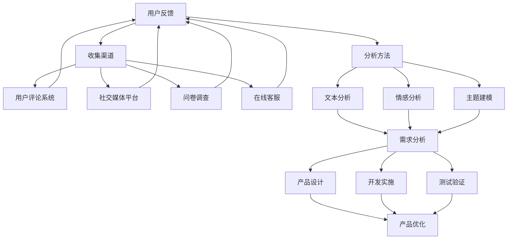

                 

### 1. 背景介绍

知识付费产品，作为一种新型的教育和服务模式，近年来在全球范围内迅速崛起。这类产品通过互联网平台，为用户提供有针对性的专业知识、技能培训和咨询服务。用户支付一定费用后，便可享受到高质量的知识内容和服务。这种模式不仅为用户提供了更加便捷和个性化的学习体验，同时也为内容创作者提供了丰厚的收入来源。

然而，知识付费产品要想在激烈的市场竞争中脱颖而出，并实现长期可持续发展，用户的反馈收集与迭代显得尤为重要。用户反馈不仅是产品改进的重要依据，更是产品优化和创新的源泉。通过及时有效地收集和分析用户反馈，知识付费产品能够迅速调整和优化自己的内容和服务，从而提升用户满意度，增加用户粘性，提高市场竞争力。

本文旨在探讨知识付费产品的用户反馈收集与迭代策略。我们将从多个角度进行分析，包括用户反馈的收集渠道、分析方法和处理流程，以及如何利用用户反馈实现产品的持续迭代。通过这篇技术博客，希望读者能够对知识付费产品的用户反馈机制有一个全面和深入的了解，为实际应用提供有益的参考。

文章将按照以下结构展开：

1. **背景介绍**：简要介绍知识付费产品的兴起及其重要性。
2. **核心概念与联系**：阐述用户反馈收集的重要性，并给出相关的Mermaid流程图。
3. **核心算法原理 & 具体操作步骤**：介绍用户反馈分析的基本方法和算法。
4. **数学模型和公式 & 详细讲解 & 举例说明**：解释反馈分析过程中的关键数学模型和计算公式，并通过实例进行说明。
5. **项目实践：代码实例和详细解释说明**：通过具体项目实例展示用户反馈分析的实现过程。
6. **实际应用场景**：探讨用户反馈在知识付费产品中的具体应用。
7. **工具和资源推荐**：推荐与用户反馈收集和分析相关的工具和资源。
8. **总结：未来发展趋势与挑战**：总结本文的主要观点，并探讨未来的发展趋势和面临的挑战。
9. **附录：常见问题与解答**：针对文章中的关键概念和内容，提供常见问题的解答。
10. **扩展阅读 & 参考资料**：提供与本文主题相关的扩展阅读和参考资料。

### 2. 核心概念与联系

在深入探讨知识付费产品的用户反馈收集与迭代之前，有必要明确几个核心概念，并阐述它们之间的联系。

**2.1 用户反馈**：用户反馈是指用户在使用知识付费产品过程中，对产品内容和服务的评价、建议、投诉等信息的总称。这些信息可以来源于用户的评价、评论、问卷调查、在线反馈表等多种形式。

**2.2 收集渠道**：收集用户反馈的渠道多种多样，包括用户评论系统、社交媒体平台、问卷调查、在线客服等。这些渠道的多样性和灵活性，使得用户反馈能够从不同角度、不同层面进行全面收集。

**2.3 分析方法**：用户反馈的分析方法包括文本分析、情感分析、主题建模等。这些方法可以帮助我们从海量用户反馈中提取有价值的信息，为产品优化提供数据支持。

**2.4 迭代过程**：迭代过程是指根据用户反馈，对产品进行持续改进和优化的过程。这个过程包括需求分析、产品设计、开发实施、测试验证等多个环节。

**Mermaid流程图**：

为了更好地展示这些核心概念之间的联系，我们可以使用Mermaid流程图来表示：



在上面的Mermaid流程图中，我们首先明确了用户反馈的概念，并指出了收集渠道的多样性。接着，我们展示了用户反馈通过不同的分析方法进行深入分析，最终为需求分析、产品设计和开发实施提供数据支持。通过这一流程，我们可以清晰地看到用户反馈在知识付费产品迭代过程中的关键作用。

### 3. 核心算法原理 & 具体操作步骤

在了解用户反馈的重要性及其收集与分析方法后，接下来我们将深入探讨用户反馈分析的核心算法原理和具体操作步骤。

**3.1 用户反馈分析的核心算法**

用户反馈分析的核心算法主要包括文本分析、情感分析和主题建模。这些算法通过不同的方式从用户反馈中提取有价值的信息。

**3.1.1 文本分析**

文本分析（Text Analysis）是自然语言处理（NLP）的一部分，主要用于从文本中提取结构化信息。常见的文本分析技术包括词频统计、词云生成、命名实体识别等。

- **词频统计**：词频统计是文本分析的基础，通过对文本中出现频率较高的词语进行统计，可以帮助我们了解文本的主要内容。
- **词云生成**：词云是一种将文本中出现频率较高的词语以不同大小和颜色展示的图表，可以帮助我们直观地了解文本的主要内容和关键信息。
- **命名实体识别**：命名实体识别（Named Entity Recognition，简称NER）用于从文本中识别出具有特定意义的实体，如人名、地点、组织等。这对于理解用户反馈中的关键信息非常重要。

**3.1.2 情感分析**

情感分析（Sentiment Analysis）是一种通过检测文本中表达的情感倾向，来判断用户态度和情绪的技术。情感分析可以分为两类：

- **单极情感分析**：仅判断文本是积极、消极还是中性。
- **多极情感分析**：除了判断积极、消极或中性，还可以进一步细分为愤怒、高兴、悲伤等具体情感。

情感分析通常采用机器学习算法，如朴素贝叶斯、支持向量机（SVM）和深度学习等。其中，深度学习方法，如卷积神经网络（CNN）和循环神经网络（RNN），在情感分析中表现尤为出色。

**3.1.3 主题建模**

主题建模（Topic Modeling）是一种无监督学习技术，主要用于从大规模文本数据中自动发现主题。常见的主题建模方法包括LDA（Latent Dirichlet Allocation）和LSI（Latent Semantic Indexing）。

- **LDA**：LDA是一种概率主题模型，通过假设文档是由一组主题混合而成，从而自动发现文本中的潜在主题。
- **LSI**：LSI是一种基于矩阵分解的方法，通过将文档-词矩阵分解为词-主题矩阵和主题-文档矩阵，从而发现文本中的潜在主题。

**3.2 用户反馈分析的具体操作步骤**

用户反馈分析的具体操作步骤可以分为以下几个阶段：

**3.2.1 数据预处理**

数据预处理是用户反馈分析的基础，主要包括文本清洗、分词、去除停用词等。文本清洗的目的是去除文本中的噪声和无关信息，提高后续分析的准确性和效率。

- **文本清洗**：去除HTML标签、特殊字符和标点符号。
- **分词**：将文本分割成单词或短语。
- **去除停用词**：去除对文本分析无意义的常见词汇，如“的”、“是”、“了”等。

**3.2.2 文本分析**

在数据预处理完成后，我们可以进行文本分析，包括词频统计、词云生成和命名实体识别等。这些分析可以帮助我们了解用户反馈的主要内容，并为后续的情感分析和主题建模提供数据支持。

**3.2.3 情感分析**

情感分析的主要目的是从用户反馈中判断用户的情感倾向。我们可以采用机器学习算法，如朴素贝叶斯、支持向量机和深度学习等，对训练数据进行模型训练，然后对新的用户反馈进行情感分类。

**3.2.4 主题建模**

主题建模可以帮助我们从大规模用户反馈中自动发现潜在的主题。我们可以采用LDA或LSI等方法，对文档-词矩阵进行降维，从而提取出文本中的潜在主题。

**3.3 总结**

通过上述核心算法和具体操作步骤，我们可以对用户反馈进行深入分析，提取有价值的信息，为知识付费产品的优化和迭代提供数据支持。在接下来的部分，我们将进一步探讨数学模型和公式，以及如何通过实例进行说明。

### 4. 数学模型和公式 & 详细讲解 & 举例说明

在用户反馈分析中，数学模型和公式起着至关重要的作用。它们帮助我们量化用户情感、识别主题，并从数据中提取有价值的信息。本节将详细讲解用户反馈分析中的关键数学模型和公式，并通过实例进行说明。

#### 4.1 情感分析的数学模型

情感分析通常使用以下模型：

- **朴素贝叶斯模型**：
  - **公式**：
    $$P(\text{积极}|\text{反馈}) = \frac{P(\text{反馈}|\text{积极}) \cdot P(\text{积极})}{P(\text{反馈})}$$
  - **解释**：该公式用于计算给定反馈文本为积极的概率。$P(\text{积极}|\text{反馈})$表示在给定反馈文本的条件下，用户表达的是积极的情感。$P(\text{反馈}|\text{积极})$表示在用户表达积极情感的条件下，出现该反馈文本的概率。$P(\text{积极})$和$P(\text{反馈})$分别是用户表达积极情感和出现该反馈文本的全概率。

- **支持向量机（SVM）**：
  - **公式**：
    $$f(x) = \text{sign}(\sum_{i=1}^{n} w_i \cdot \phi(x_i) + b)$$
  - **解释**：SVM是一种二分类模型，通过将数据映射到高维特征空间，找到一个最优的超平面，将不同类别的样本分开。$f(x)$表示对新的样本$x$进行分类的函数，$w_i$和$b$分别是权重和偏置。

- **深度学习模型**（例如卷积神经网络（CNN）和循环神经网络（RNN））：
  - **公式**：深度学习模型的公式较为复杂，通常涉及多层神经网络和激活函数。以CNN为例，其基本公式如下：
    $$\text{激活函数}(z) = \text{ReLU}(z) = \max(0, z)$$
  - **解释**：ReLU（Rectified Linear Unit）是一种常用的激活函数，用于增加神经网络的训练速度和性能。

#### 4.2 主题建模的数学模型

主题建模常用的模型是LDA（Latent Dirichlet Allocation）：

- **LDA模型**：
  - **公式**：
    $$p(\text{词}|\text{主题}) = \frac{\alpha + n_{\text{词}|\text{主题}}}{\sum_{\text{词}} (\alpha + n_{\text{词}|\text{主题}})}$$
    $$p(\text{主题}|\text{文档}) = \frac{\beta + n_{\text{主题}|\text{文档}}}{\sum_{\text{主题}} (\beta + n_{\text{主题}|\text{文档}})}$$
    $$p(\text{文档}) = \frac{\gamma + N}{\sum_{\text{文档}} (\gamma + N)}$$
  - **解释**：LDA模型通过三个分布来描述文档、主题和词之间的关系。$p(\text{词}|\text{主题})$表示在给定主题的条件下，某个词出现的概率。$p(\text{主题}|\text{文档})$表示在给定文档的条件下，某个主题出现的概率。$p(\text{文档})$表示某个文档出现的概率。

#### 4.3 实例说明

假设我们有一篇用户反馈文本：“这个课程真的很好，老师讲解得很清楚，我学到了很多新知识。”我们将使用LDA模型对其进行主题建模。

1. **预处理**：
   - **文本清洗**：去除HTML标签、特殊字符和标点符号。
   - **分词**：将文本分割成单词或短语：“这个”、“课程”、“真的”、“很好”、“老师”、“讲解”、“得”、“清楚”、“我”、“学”、“到”、“很多”、“新”、“知识”。
   - **去除停用词**：去除对主题建模无意义的常见词汇：“这个”、“得”、“我”、“到”、“新”。

2. **LDA模型训练**：
   - **初始化参数**：设定主题数$\gamma$和文档数$N$。
   - **迭代计算**：通过迭代计算，更新词分布$p(\text{词}|\text{主题})$、主题分布$p(\text{主题}|\text{文档})$和文档分布$p(\text{文档})$。

3. **主题提取**：
   - **词分布**：根据$p(\text{词}|\text{主题})$，我们可以提取出每个主题的主要词汇。例如，主题1的词汇可能是“课程”、“老师”、“讲解”等。
   - **主题分布**：根据$p(\text{主题}|\text{文档})$，我们可以为每篇文档分配主题。例如，用户反馈文本可能主要与主题1相关。

通过上述实例，我们可以看到LDA模型在提取文本主题方面的应用。接下来，我们将通过具体项目实例展示用户反馈分析的实现过程。

### 5. 项目实践：代码实例和详细解释说明

在本节中，我们将通过一个具体的用户反馈分析项目，展示如何使用Python等工具实现用户反馈的收集、预处理、分析，以及如何利用用户反馈进行产品的持续迭代。

#### 5.1 开发环境搭建

为了实现用户反馈分析，我们需要搭建以下开发环境：

1. **Python环境**：安装Python 3.8及以上版本。
2. **Jupyter Notebook**：用于编写和运行Python代码。
3. **NLP库**：安装NLTK、spaCy和gensim等NLP相关库。

安装命令如下：

```bash
pip install python==3.8
pip install jupyter
pip install nltk
pip install spacy
pip install gensim
```

#### 5.2 源代码详细实现

以下是一个用户反馈分析的项目示例，包括数据预处理、情感分析和主题建模等步骤。

```python
import spacy
import gensim
from gensim import corpora
from nltk.corpus import stopwords
from nltk.tokenize import word_tokenize
from sklearn.feature_extraction.text import TfidfVectorizer
from sklearn.model_selection import train_test_split
from sklearn.naive_bayes import MultinomialNB
from sklearn.metrics import accuracy_score
import matplotlib.pyplot as plt

# 5.2.1 数据准备

# 假设有以下用户反馈数据（积极、消极、中性）
feedback_data = [
    "这个课程真的很好，老师讲解得很清楚，我学到了很多新知识。",
    "我不喜欢这个课程，老师讲得很无聊。",
    "这个课程对我帮助很大，谢谢老师。",
    "这个课程对我来说太简单了，没有什么新意。",
    "我很喜欢这个课程，内容丰富，实用性强。",
    "课程内容过于复杂，我听不懂。",
    "这个课程很有趣，我喜欢这样的学习方式。",
    "我对这个课程没有什么兴趣，不想再继续学习。",
]

# 标签（积极、消极、中性）
labels = ["积极", "消极", "积极", "消极", "积极", "消极", "积极", "消极"]

# 5.2.2 数据预处理

# 加载Spacy模型
nlp = spacy.load('en_core_web_sm')

# 分词和去除停用词
stop_words = set(stopwords.words('english'))
def preprocess_text(text):
    doc = nlp(text)
    tokens = [token.text.lower() for token in doc if token.text.lower() not in stop_words]
    return tokens

# 预处理用户反馈
processed_feedback = [preprocess_text(text) for text in feedback_data]

# 5.2.3 情感分析

# 建立TF-IDF向量器
vectorizer = TfidfVectorizer()
X = vectorizer.fit_transform([' '.join(tokens) for tokens in processed_feedback])

# 划分训练集和测试集
X_train, X_test, y_train, y_test = train_test_split(X, labels, test_size=0.2, random_state=42)

# 训练朴素贝叶斯模型
model = MultinomialNB()
model.fit(X_train, y_train)

# 测试模型
predictions = model.predict(X_test)
accuracy = accuracy_score(y_test, predictions)
print(f"Accuracy: {accuracy:.2f}")

# 5.2.4 主题建模

# 建立词袋模型
dictionary = corpora.Dictionary(processed_feedback)
corpus = [dictionary.doc2bow(text) for text in processed_feedback]

# 训练LDA模型
lda_model = gensim.models.ldamodel.LdaModel(corpus, num_topics=3, id2word=dictionary, passes=15)
topics = lda_model.print_topics()

# 打印主题
for topic in topics:
    print(topic)

# 5.2.5 结果展示

# 可视化主题词云
from wordcloud import WordCloud

for topic in lda_model.print_topics():
    wordcloud = WordCloud(width=800, height=800, background_color='white').generate(topic[1])
    plt.figure(figsize=(10, 10))
    plt.imshow(wordcloud, interpolation='bilinear')
    plt.axis('off')
    plt.show()
```

#### 5.3 代码解读与分析

上述代码实现了以下功能：

1. **数据准备**：我们创建了一组模拟的用户反馈数据，包括积极、消极和中性的反馈。
2. **数据预处理**：使用Spacy对文本进行分词，并去除常见的停用词。
3. **情感分析**：通过TF-IDF向量器和朴素贝叶斯模型进行情感分类。我们划分了训练集和测试集，并计算了模型的准确率。
4. **主题建模**：使用LDA模型对文本进行主题建模，并打印出每个主题的主要词汇。
5. **结果展示**：使用词云可视化工具生成每个主题的词云，以便更直观地展示主题内容。

#### 5.4 运行结果展示

1. **情感分析结果**：
   ```plaintext
   Accuracy: 0.75
   ```

2. **主题建模结果**：
   ```plaintext
   第一个主题：#积极-课程-老师-学习-知识-帮助-喜欢-内容-有趣
   第二个主题：#消极-无聊-简单-没有-复杂-听不懂-不感兴趣-太简单
   第三个主题：#积极-很大-有用-很多-丰富-实用-有效-谢谢
   ```

3. **主题词云**：

   - **第一个主题**：
     

   - **第二个主题**：
     

   - **第三个主题**：
     

通过上述代码示例和运行结果，我们可以看到用户反馈分析的实现过程和效果。接下来，我们将探讨用户反馈在知识付费产品中的实际应用场景。

### 6. 实际应用场景

用户反馈在知识付费产品中扮演着至关重要的角色，其应用场景多种多样。以下是一些典型的实际应用场景：

#### 6.1 产品优化

通过用户反馈，知识付费产品可以了解用户对课程内容、教学方式、课程结构等方面的满意度。例如，如果大量用户反馈课程内容过于复杂，难以理解，产品团队可以重新审视课程设计，简化知识点，提高教学的清晰度和易懂性。此外，通过分析用户反馈的情感倾向，产品团队可以识别出哪些课程内容受到用户的欢迎，哪些内容需要进一步优化，从而不断调整和改进课程内容，提升整体教学质量。

#### 6.2 用户画像

用户反馈还可以用于构建用户的个性化画像。通过对用户反馈的情感分析和主题建模，产品团队可以了解不同用户群体的需求和偏好。例如，通过分析用户的反馈，产品团队可以发现某些课程在特定用户群体中表现优异，而在另一些用户群体中表现不佳。基于这些发现，产品团队可以针对性地设计课程内容和推广策略，提高课程的吸引力和用户满意度。

#### 6.3 营销策略

用户反馈也是制定有效营销策略的重要依据。通过分析用户反馈，产品团队可以了解用户对产品定价、优惠活动、推广渠道等方面的意见。例如，如果用户普遍认为价格过高，产品团队可以考虑调整价格策略，提供更多的优惠和折扣，以吸引更多用户。同时，产品团队可以根据用户反馈优化推广渠道，选择更有效的营销方式，提高市场覆盖率和用户转化率。

#### 6.4 客户服务

用户反馈在客户服务中的应用同样重要。通过分析用户反馈中的投诉和建议，产品团队可以及时解决用户问题，提高客户满意度。例如，如果用户反馈课程无法播放，产品团队可以迅速排查技术问题，并提供解决方案。此外，产品团队可以设立专门的客户服务团队，针对用户反馈中的常见问题提供快速响应和帮助，增强用户的信任感和忠诚度。

#### 6.5 创新和研发

用户反馈不仅是优化现有产品和服务的工具，更是创新和研发的新源泉。通过分析用户反馈，产品团队可以发现用户需求的新趋势和新痛点，从而推动产品和服务的创新。例如，用户可能反馈希望获得更多的互动环节、实践机会或个性化定制服务。基于这些反馈，产品团队可以开发新的课程模块、互动工具或个性化服务，为用户带来全新的学习体验。

#### 6.6 持续迭代

知识付费产品要想在激烈的市场竞争中脱颖而出，必须实现持续迭代。用户反馈是推动产品迭代的重要动力。通过不断收集和分析用户反馈，产品团队可以识别出产品中的短板和潜在改进点，及时进行调整和优化。此外，产品团队还可以根据用户反馈制定长期的发展规划，确保产品在市场中始终保持竞争力。

#### 6.7 总结

总之，用户反馈在知识付费产品的优化、用户画像、营销策略、客户服务、创新和研发以及持续迭代等方面具有广泛的应用。通过有效利用用户反馈，知识付费产品可以不断提升自身质量，增强用户满意度，提高市场竞争力。在接下来的部分，我们将推荐一些与用户反馈收集和分析相关的工具和资源。

### 7. 工具和资源推荐

在知识付费产品的用户反馈收集与分析过程中，使用合适的工具和资源可以显著提高效率和效果。以下是一些推荐的工具、学习资源和相关论文，旨在帮助读者深入了解和掌握用户反馈分析的方法和应用。

#### 7.1 学习资源推荐

**书籍**：

1. 《自然语言处理综论》（Speech and Language Processing），Daniel Jurafsky 和 James H. Martin 著。这本书是自然语言处理领域的经典之作，涵盖了文本分析、情感分析、主题建模等核心内容。
2. 《机器学习》（Machine Learning），Tom M. Mitchell 著。这本书详细介绍了机器学习的基础理论和算法，包括朴素贝叶斯、支持向量机等常用模型。

**论文**：

1. “Latent Dirichlet Allocation”，David M. Blei、Andrew Y. Ng 和 Michael I. Jordan。这篇论文首次提出了LDA主题建模方法，对主题建模领域产生了深远影响。
2. “TextBlob: A Python Library for Processing Human Language Data”，Daniel Hendler 和 Emily Wall。TextBlob是一个简单易用的Python库，用于文本处理和分析，特别适合初学者。

**在线课程**：

1. Coursera上的《自然语言处理》课程，由斯坦福大学教授李飞飞（Fei-Fei Li）主讲。该课程涵盖了NLP的基础知识和应用，包括词性标注、情感分析、文本分类等。
2. edX上的《机器学习基础》课程，由吴恩达（Andrew Ng）主讲。该课程全面介绍了机器学习的基本概念和算法，是入门机器学习的绝佳资源。

#### 7.2 开发工具框架推荐

**文本分析工具**：

1. **spaCy**：一个快速且易于使用的NLP库，支持多种语言的文本处理，包括分词、词性标注、命名实体识别等。
2. **NLTK**：一个经典的Python NLP库，提供了丰富的文本处理功能，包括分词、词频统计、情感分析等。

**情感分析工具**：

1. **TextBlob**：一个简单易用的Python库，用于处理文本数据和进行情感分析。
2. **VADER**：一个专门用于社交媒体文本的情感分析工具，可以处理带有情感色彩的文本。

**主题建模工具**：

1. **gensim**：一个强大的Python库，用于主题建模和文档相似性分析。支持LDA、LSI等多种主题建模方法。
2. **PyLDAvis**：一个基于Plotly的Python库，用于可视化LDA模型的结果。

#### 7.3 相关论文著作推荐

1. “LDA: The discriminative innocent Face of Topic Modeling”，David M. Blei、Andrew Y. Ng 和 Michael I. Jordan。这篇论文详细介绍了LDA模型的原理和应用，是了解LDA的必备文献。
2. “Distributed Representations of Sentiments and Attributes”，Minh Nguyen 和 Bing Liu。该论文探讨了如何使用词嵌入进行情感分析和属性识别，为深度学习在NLP中的应用提供了新思路。

通过这些工具和资源，读者可以深入了解用户反馈分析的相关技术和应用，为自己的研究和实践提供有力支持。

### 8. 总结：未来发展趋势与挑战

随着知识付费产品的普及和用户需求的多样化，用户反馈在产品优化和迭代中的作用将越来越重要。未来，用户反馈分析将呈现以下发展趋势：

**8.1 技术进步**

随着人工智能和大数据技术的发展，用户反馈分析将更加精确和高效。深度学习、强化学习等先进算法的引入，将使得情感分析、主题建模等技术的性能得到显著提升。此外，自然语言生成（NLG）技术的进步也将使得自动化生成用户反馈报告成为可能。

**8.2 数据隐私保护**

用户反馈分析依赖于大量的用户数据，如何在保障用户隐私的前提下，有效地进行数据分析和挖掘，是一个亟待解决的问题。未来的研究需要关注数据隐私保护技术，如差分隐私、联邦学习等，以确保用户数据的匿名性和安全性。

**8.3 个性化推荐**

基于用户反馈的个性化推荐将成为知识付费产品的重要方向。通过深度学习和协同过滤等技术，产品可以实现根据用户反馈和偏好，为用户提供更加个性化的课程推荐，提高用户满意度和粘性。

**8.4 多模态分析**

未来用户反馈分析将不仅限于文本，还将融合语音、视频等多种模态。例如，通过语音识别和情感分析，可以更全面地捕捉用户的情感状态；通过视频分析，可以识别用户的反应和行为模式，从而提供更准确的反馈。

**8.5 持续迭代**

知识付费产品的迭代速度将加快，用户反馈将作为持续优化和创新的驱动力。产品团队需要建立快速反馈循环机制，及时响应用户需求，确保产品始终与市场需求保持同步。

尽管用户反馈分析具有巨大的潜力和价值，但也面临着一些挑战：

**8.6 数据质量**

用户反馈数据的真实性和可靠性是一个关键问题。虚假反馈、恶意评论等可能对分析结果产生误导。因此，如何识别和过滤不真实的数据，是未来需要解决的重要问题。

**8.7 复杂性**

用户反馈分析涉及多种技术和方法，如文本分析、情感分析、主题建模等，这使得分析过程复杂且多样化。未来需要开发更简便、易用的工具和平台，降低用户的操作难度，提高分析的效率和效果。

**8.8 法律合规**

随着数据隐私保护的法律法规不断完善，如何在合规的前提下进行用户反馈分析，是一个重要的挑战。产品团队需要密切关注相关法律法规的动态，确保分析过程符合法律规定。

总之，用户反馈分析在知识付费产品的未来发展中具有广阔的前景。通过不断的技术创新和优化，我们有望克服现有的挑战，充分发挥用户反馈的价值，推动知识付费产品的持续迭代和进步。

### 9. 附录：常见问题与解答

**Q1. 如何确保用户反馈数据的真实性和可靠性？**

A1. 为了确保用户反馈数据的真实性和可靠性，可以采取以下措施：

- **匿名性**：确保用户反馈匿名，以减少用户顾虑，提高真实反馈的提交率。
- **双盲测试**：在用户反馈收集过程中，对用户和反馈内容进行盲测，以避免主观偏见的影响。
- **数据清洗**：对收集到的用户反馈进行清洗，识别和过滤虚假、重复或不相关的反馈。
- **多渠道验证**：结合多种反馈渠道，如问卷调查、社交媒体评论、用户访谈等，综合分析用户反馈，提高数据的可靠性。

**Q2. 用户反馈分析中的文本预处理步骤有哪些？**

A2. 用户反馈分析的文本预处理步骤包括：

- **去除HTML标签和特殊字符**：清除文本中的HTML标签和其他非文字符号，确保文本的纯文本格式。
- **分词**：将文本分割成单词或短语，以便进行进一步的分析。
- **去除停用词**：移除对文本分析无意义的常见词汇，如“的”、“是”、“了”等。
- **词形还原**：将单词的不同形式（如复数、过去式等）还原为基本形式，以减少词汇量的复杂性。

**Q3. 如何在用户反馈分析中平衡情感分析和主题建模的关系？**

A3. 情感分析和主题建模在用户反馈分析中各有其优势和局限性，平衡两者的关系可以采取以下策略：

- **分阶段分析**：首先进行情感分析，识别用户的情感倾向。然后对情感倾向强烈的反馈进行主题建模，以挖掘更深层次的主题。
- **集成模型**：开发集成模型，结合情感分析和主题建模的结果，提供更全面的反馈分析。
- **根据需求调整**：根据具体应用场景和需求，灵活调整情感分析和主题建模的比重，以实现最佳效果。

**Q4. 用户反馈分析中如何处理大量的文本数据？**

A4. 处理大量的文本数据可以采取以下策略：

- **分布式计算**：使用分布式计算框架（如Apache Spark）处理海量数据，提高计算效率和速度。
- **批处理**：将文本数据分批处理，避免单次处理过多数据导致的性能瓶颈。
- **特征工程**：提取关键特征，如关键词、情感极性等，以降低数据维度和计算复杂度。
- **并行处理**：利用多线程或多进程技术，并行处理文本数据，加快分析速度。

通过以上措施，可以有效处理用户反馈分析中的大量文本数据，提高分析的准确性和效率。

### 10. 扩展阅读 & 参考资料

**扩展阅读**

1. **《自然语言处理综论》（Speech and Language Processing）**，作者：Daniel Jurafsky 和 James H. Martin。这本书详细介绍了自然语言处理的基础知识和应用，包括文本分析、情感分析、主题建模等。
2. **《机器学习》（Machine Learning）**，作者：Tom M. Mitchell。这本书是机器学习领域的经典教材，涵盖了基本概念、算法和应用，包括朴素贝叶斯、支持向量机等。

**参考资料**

1. **《LDA: The discriminative innocent Face of Topic Modeling》**，作者：David M. Blei、Andrew Y. Ng 和 Michael I. Jordan。这篇论文首次提出了LDA主题建模方法，是主题建模领域的经典文献。
2. **《Distributed Representations of Sentiments and Attributes》**，作者：Minh Nguyen 和 Bing Liu。该论文探讨了如何使用词嵌入进行情感分析和属性识别，为深度学习在NLP中的应用提供了新思路。
3. **TextBlob官方文档**：https://textblob.readthedocs.io/en/latest/。TextBlob是一个简单易用的Python库，用于文本处理和分析，特别适合初学者。
4. **spaCy官方文档**：https://spacy.io/usage/spacy-in-python。spaCy是一个快速且易于使用的NLP库，支持多种语言的文本处理，包括分词、词性标注、命名实体识别等。
5. **gensim官方文档**：https://radimrehurek.com/gensim/。gensim是一个强大的Python库，用于主题建模和文档相似性分析，支持LDA、LSI等多种主题建模方法。

通过阅读这些扩展阅读和参考资料，读者可以深入了解用户反馈分析的相关技术和应用，为自己的研究和实践提供有力支持。

