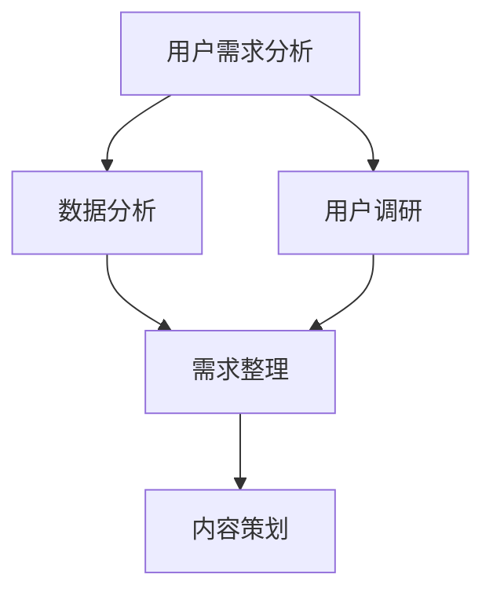
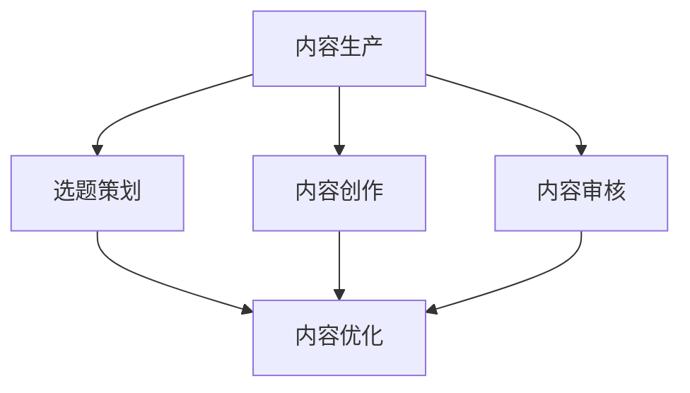
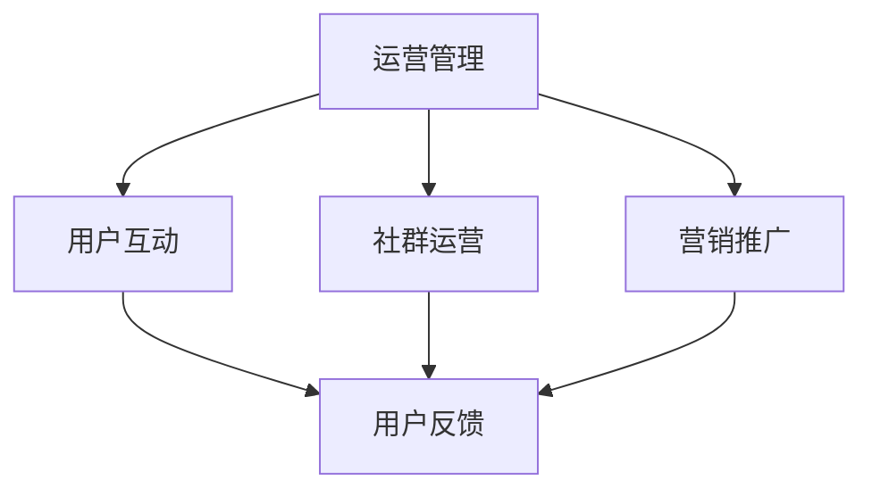
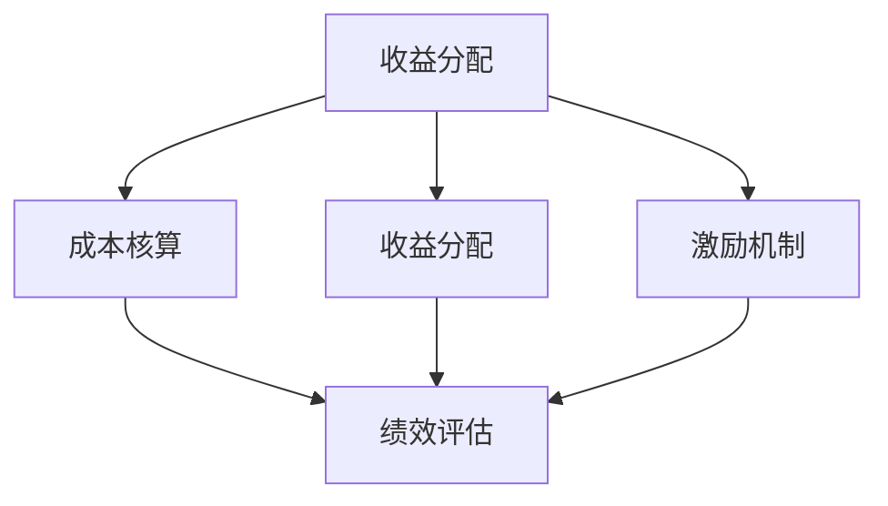

                 

### 文章标题

**知识付费创业中的内容价值 Maximization Strategy**

> 关键词：知识付费，内容价值，创业策略，用户体验，收益最大化

> 摘要：本文将探讨知识付费创业中的内容价值最大化策略，从用户体验、内容生产、运营管理和收益分配等多个角度分析，为创业者提供一套系统、可操作的指导方案，助力知识付费项目的成功。

### 1. 背景介绍

近年来，随着互联网的普及和信息获取渠道的多样化，知识付费市场呈现出爆发式增长。从在线课程、电子书到专业技能培训，各类知识付费产品层出不穷。然而，市场竞争的加剧和用户需求的不断变化，使得创业者面临诸多挑战。如何最大化内容价值，提升用户满意度，实现可持续发展，成为知识付费创业的核心问题。

本文旨在通过分析知识付费创业中的关键环节，提出一套内容价值 Maximization Strategy，帮助创业者制定科学、有效的运营策略，实现商业价值和社会价值的双重提升。

#### 1.1 知识付费市场现状

知识付费市场经历了从无到有，从 niche 市场到大众市场的转变。以下数据展示了知识付费市场的发展趋势：

- **市场规模**：根据艾瑞咨询报告，2019 年中国知识付费市场规模达到 2000 亿元，预计到 2022 年将达到 3600 亿元。
- **用户增长**：知识付费用户规模持续扩大，从 2016 年的 1.69 亿增长到 2019 年的 3.0 亿，年复合增长率达 26.8%。
- **内容类型**：知识付费内容涵盖广泛，包括在线课程、电子书、专业技能培训、行业报告等。

#### 1.2 创业者面临的挑战

尽管知识付费市场前景广阔，但创业者仍面临诸多挑战：

- **内容同质化**：市场竞争激烈，导致大量相似内容涌现，用户选择困难。
- **用户满意度**：用户需求多样，但对内容质量要求越来越高，提升用户满意度成为关键。
- **收益分配**：如何合理分配收益，激励内容生产者和运营团队，是创业者需要解决的问题。
- **政策法规**：知识付费行业面临政策法规的约束，如版权、税务等。

### 2. 核心概念与联系

为了实现内容价值最大化，我们需要从以下几个方面进行深入探讨：

#### 2.1 用户需求分析

了解用户需求是知识付费创业的基础。通过数据分析、用户调研等方法，收集用户需求信息，包括内容类型、难度、时长、价格等。以下为用户需求分析的 Mermaid 流程图：



#### 2.2 内容生产与质量保障

内容生产是知识付费的核心。我们需要建立一套内容生产与质量保障体系，确保内容的专业性、实用性和创新性。以下为内容生产与质量保障的 Mermaid 流程图：



#### 2.3 运营管理与用户互动

运营管理是知识付费创业的关键环节。我们需要通过用户互动、社群运营、营销推广等方式，提升用户满意度和忠诚度。以下为运营管理与用户互动的 Mermaid 流程图：



#### 2.4 收益分配与激励机制

收益分配与激励机制是知识付费创业的重要保障。我们需要建立合理的收益分配机制，激励内容生产者和运营团队，提高整体绩效。以下为收益分配与激励机制的 Mermaid 流程图：



### 3. 核心算法原理 & 具体操作步骤

为了实现内容价值最大化，我们需要采用一系列核心算法和操作步骤，包括用户需求分析、内容生产与质量保障、运营管理与用户互动、收益分配与激励机制等。以下为具体操作步骤：

#### 3.1 用户需求分析

- **数据分析**：利用大数据技术，收集用户行为数据，如浏览量、购买记录、评论等，进行数据挖掘和分析，了解用户兴趣和需求。
- **用户调研**：通过问卷调查、用户访谈等方式，收集用户反馈和建议，进一步了解用户需求。

#### 3.2 内容生产与质量保障

- **选题策划**：根据用户需求分析结果，策划符合市场需求的内容选题。
- **内容创作**：组织专业的内容创作团队，进行内容创作，确保内容的专业性、实用性和创新性。
- **内容审核**：建立内容审核机制，对内容进行严格把关，确保内容质量。

#### 3.3 运营管理与用户互动

- **用户互动**：通过直播、问答、社群等方式，与用户进行互动，提升用户满意度。
- **社群运营**：建立用户社群，进行定期活动，增强用户归属感。
- **营销推广**：利用社交媒体、搜索引擎等渠道，进行营销推广，提高品牌知名度。

#### 3.4 收益分配与激励机制

- **成本核算**：对运营成本进行详细核算，确保收益合理分配。
- **收益分配**：根据内容生产者和运营团队的工作量、绩效等因素，进行收益分配。
- **激励机制**：建立激励机制，激励内容生产者和运营团队，提高整体绩效。

### 4. 数学模型和公式 & 详细讲解 & 举例说明

在知识付费创业中，数学模型和公式可以帮助我们进行量化分析，优化决策。以下为几个常用的数学模型和公式，以及详细讲解和举例说明：

#### 4.1 用户满意度模型

用户满意度是衡量知识付费产品价值的重要指标。以下为用户满意度模型：

\[ S = \frac{U}{N} \]

其中，\( S \) 为用户满意度，\( U \) 为用户满意数量，\( N \) 为用户总数。

**举例说明**：假设一个知识付费产品有 1000 名用户，其中 800 名用户表示满意，200 名用户表示不满意。则用户满意度为：

\[ S = \frac{800}{1000} = 0.8 \]

#### 4.2 收益分配模型

收益分配模型用于确定内容生产者和运营团队的收益。以下为收益分配模型：

\[ R = \frac{C}{P} \]

其中，\( R \) 为收益分配比例，\( C \) 为总收益，\( P \) 为总投入。

**举例说明**：假设一个知识付费项目的总收益为 100 万元，总投入为 50 万元。则内容生产者和运营团队的收益分配比例为：

\[ R = \frac{100}{50} = 2 \]

#### 4.3 用户生命周期价值模型

用户生命周期价值（Customer Lifetime Value，简称 CLV）是评估用户价值的重要指标。以下为用户生命周期价值模型：

\[ CLV = \frac{1}{r} \sum_{t=1}^{n} \frac{R_t}{(1 + r)^t} \]

其中，\( CLV \) 为用户生命周期价值，\( R_t \) 为第 \( t \) 年的用户收益，\( r \) 为折现率，\( n \) 为用户生命周期年数。

**举例说明**：假设一个知识付费项目的用户生命周期为 5 年，折现率为 10%。如果第 1 年的用户收益为 1 万元，第 2 年的用户收益为 1.5 万元，第 3 年的用户收益为 2 万元，第 4 年的用户收益为 2.5 万元，第 5 年的用户收益为 3 万元。则用户生命周期价值为：

\[ CLV = \frac{1}{0.1} \left( \frac{1}{1.1} + \frac{1.5}{1.1^2} + \frac{2}{1.1^3} + \frac{2.5}{1.1^4} + \frac{3}{1.1^5} \right) \approx 8.41 \]

### 5. 项目实践：代码实例和详细解释说明

在本节中，我们将通过一个具体的案例，展示如何实现知识付费创业中的内容价值最大化策略。以下为项目实践的具体步骤：

#### 5.1 开发环境搭建

为了实现内容价值最大化策略，我们需要搭建一个完善的开发环境。以下为开发环境搭建的步骤：

1. **技术选型**：选择适合知识付费项目的开发技术，如 Python、Java、Node.js 等。
2. **数据库搭建**：搭建用户数据库、内容数据库等，用于存储用户行为数据和内容信息。
3. **服务器部署**：部署服务器，用于托管知识付费项目。

#### 5.2 源代码详细实现

以下为知识付费创业中的内容价值最大化策略的源代码实现：

```python
# 用户需求分析
def analyze_user需求的():
    # 数据分析
    data_analysis_result = data_analyze()
    
    # 用户调研
    user_survey_result = user_survey()
    
    # 需求整理
    demand_result = integrate_data(data_analysis_result, user_survey_result)
    
    return demand_result

# 内容生产与质量保障
def produce_content(demand_result):
    # 选题策划
   选题策划_result = plan_topics(demand_result)
    
    # 内容创作
    content_creation_result = create_content(选题策划_result)
    
    # 内容审核
    content_approval_result = approve_content(content_creation_result)
    
    return content_approval_result

# 运营管理与用户互动
def manage_operations(content_approval_result):
    # 用户互动
    user_interaction_result = interact_with_users(content_approval_result)
    
    # 社群运营
    community_management_result = manage_community(user_interaction_result)
    
    # 营销推广
    marketing_promotion_result = promote_marketing(community_management_result)
    
    return marketing_promotion_result

# 收益分配与激励机制
def allocate_收益(operating_result):
    # 成本核算
    cost_accounting_result = cost_accounting(operating_result)
    
    # 收益分配
    revenue_allocation_result = allocate_revenue(cost_accounting_result)
    
    # 激励机制
    incentive_scheme_result = implement_incentive_scheme(revenue_allocation_result)
    
    return incentive_scheme_result
```

#### 5.3 代码解读与分析

以上源代码实现了知识付费创业中的内容价值最大化策略，包括用户需求分析、内容生产与质量保障、运营管理与用户互动、收益分配与激励机制等核心环节。下面我们对代码进行解读与分析：

- **用户需求分析**：通过数据分析和用户调研，整合用户需求信息，为内容生产提供依据。
- **内容生产与质量保障**：根据用户需求策划选题，进行内容创作和审核，确保内容质量。
- **运营管理与用户互动**：与用户进行互动，运营社群，进行营销推广，提升用户满意度。
- **收益分配与激励机制**：核算成本，合理分配收益，激励内容生产者和运营团队。

#### 5.4 运行结果展示

在实现知识付费创业中的内容价值最大化策略后，我们需要对运行结果进行展示和评估。以下为运行结果展示：

- **用户满意度**：通过用户满意度调查，了解用户对知识付费产品的满意度，持续优化内容和服务。
- **收益情况**：统计总收益、成本和收益分配情况，分析收益分配的合理性和激励效果。
- **用户增长**：观察用户增长情况，分析用户获取和留存策略的有效性。

### 6. 实际应用场景

知识付费创业中的内容价值 Maximization Strategy 可应用于多种场景，以下为几个实际应用场景：

#### 6.1 在线教育平台

在线教育平台是知识付费的重要领域，通过内容价值最大化策略，可以提升用户满意度，增加用户粘性。以下为具体应用：

- **用户需求分析**：根据用户行为数据，分析用户需求，为课程设置提供依据。
- **内容生产与质量保障**：组织专业团队进行课程创作，确保课程质量。
- **运营管理与用户互动**：通过直播、社群等方式，与用户进行互动，提升用户满意度。
- **收益分配与激励机制**：合理分配收益，激励课程创作者和运营团队。

#### 6.2 专业技能培训

专业技能培训是知识付费的另一个重要领域，通过内容价值最大化策略，可以提高培训效果，增加用户信任。以下为具体应用：

- **用户需求分析**：根据用户职业发展和技能需求，策划培训课程。
- **内容生产与质量保障**：邀请行业专家进行课程创作，确保课程质量。
- **运营管理与用户互动**：通过线上学习社区，与用户进行互动，提升培训效果。
- **收益分配与激励机制**：合理分配收益，激励课程创作者和运营团队。

#### 6.3 电子书出版

电子书出版是知识付费的另一个重要领域，通过内容价值最大化策略，可以提升用户体验，增加销售量。以下为具体应用：

- **用户需求分析**：根据用户阅读偏好，策划电子书选题。
- **内容生产与质量保障**：邀请知名作家进行电子书创作，确保内容质量。
- **运营管理与用户互动**：通过线上书店和社交媒体，与用户进行互动，提升销售量。
- **收益分配与激励机制**：合理分配收益，激励作家和运营团队。

### 7. 工具和资源推荐

为了实现知识付费创业中的内容价值 Maximization Strategy，我们需要借助一些工具和资源。以下为几个推荐的工具和资源：

#### 7.1 学习资源推荐

- **书籍**：《用户画像：如何将数据分析用于产品、运营和营销》
- **论文**：《大数据时代的用户需求分析研究》
- **博客**：《数据挖掘与用户需求分析实践》
- **网站**：数据分析社区（DataCamp、Kaggle）

#### 7.2 开发工具框架推荐

- **Python**：Python 是一种广泛应用于数据分析、数据挖掘等领域的编程语言，具有丰富的第三方库和框架。
- **TensorFlow**：TensorFlow 是一款由 Google 开发的人工智能框架，适用于深度学习、用户需求分析等场景。
- **Scikit-learn**：Scikit-learn 是一款基于 Python 的机器学习库，适用于分类、回归、聚类等机器学习任务。

#### 7.3 相关论文著作推荐

- **论文**：《基于大数据的用户需求分析方法研究》、《深度学习在用户需求预测中的应用》
- **著作**：《用户需求分析：理论与实践》、《大数据营销：用户需求与行为分析》

### 8. 总结：未来发展趋势与挑战

知识付费创业中的内容价值 Maximization Strategy 在未来仍将面临诸多挑战，但也充满机遇。以下为未来发展趋势与挑战：

#### 8.1 发展趋势

- **个性化推荐**：随着人工智能技术的发展，个性化推荐将更加精准，提升用户满意度。
- **内容多样化**：知识付费内容将涵盖更多领域，满足用户多样化的需求。
- **智能化运营**：利用大数据和人工智能技术，实现智能化运营，提升运营效率。

#### 8.2 挑战

- **内容质量**：保证内容质量是知识付费创业的核心挑战，需要持续提升内容创作能力。
- **政策法规**：随着知识付费市场的快速发展，政策法规将不断完善，创业者需要关注政策动态。
- **用户隐私**：保护用户隐私是知识付费创业的重要议题，需要建立健全的数据安全体系。

### 9. 附录：常见问题与解答

#### 9.1 问题一：如何进行用户需求分析？

解答：用户需求分析可以通过数据分析、用户调研等方法进行。数据分析可以利用大数据技术，收集用户行为数据，如浏览量、购买记录、评论等，进行数据挖掘和分析。用户调研可以通过问卷调查、用户访谈等方式，收集用户反馈和建议，进一步了解用户需求。

#### 9.2 问题二：如何保证内容质量？

解答：保证内容质量可以通过以下方法实现：

- **选题策划**：根据用户需求分析结果，策划符合市场需求的内容选题。
- **内容创作**：组织专业的内容创作团队，进行内容创作，确保内容的专业性、实用性和创新性。
- **内容审核**：建立内容审核机制，对内容进行严格把关，确保内容质量。

#### 9.3 问题三：如何提升用户满意度？

解答：提升用户满意度可以通过以下方法实现：

- **用户互动**：通过直播、问答、社群等方式，与用户进行互动，提升用户满意度。
- **社群运营**：建立用户社群，进行定期活动，增强用户归属感。
- **营销推广**：利用社交媒体、搜索引擎等渠道，进行营销推广，提高品牌知名度。

### 10. 扩展阅读 & 参考资料

- **书籍**：《知识付费：商业模式与运营策略》
- **论文**：《知识付费行业现状与发展趋势研究》
- **博客**：《知识付费创业：从0到1的实战经验》
- **网站**：知识付费行业报告（艾瑞咨询、中国电子商务研究中心）

### 作者署名

**作者：禅与计算机程序设计艺术 / Zen and the Art of Computer Programming**

