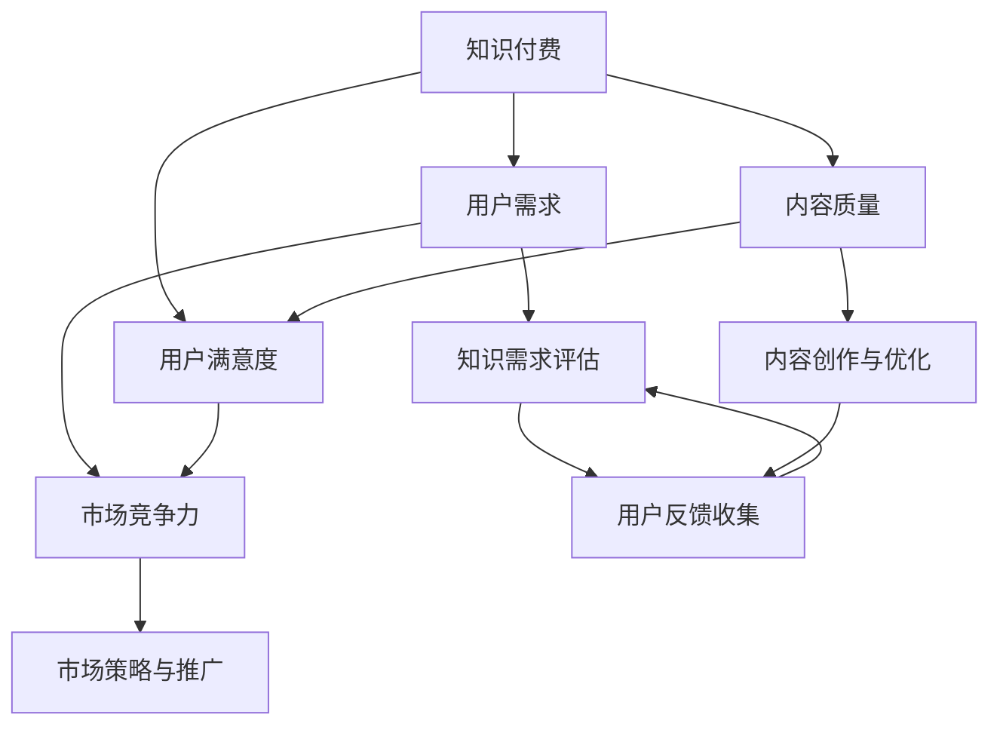

                 

### 1. 背景介绍

知识付费作为一种新型的商业模式，近年来在全球范围内迅速崛起。它通过将专业知识、技能和经验等内容转化为有偿的服务或产品，为用户提供了高质量的知识获取渠道。然而，随着知识付费市场的不断扩大，如何在众多竞争者中脱颖而出，实现内容价值的最大化，成为众多创业者亟待解决的问题。

本文旨在探讨知识付费创业中的内容价值最大化策略，通过对核心概念、算法原理、数学模型、项目实践和实际应用场景的详细分析，为创业者提供一套系统性的解决方案。本文将分为以下几个部分进行阐述：

- **2. 核心概念与联系**：首先，我们将介绍知识付费中的核心概念，并利用Mermaid流程图展示这些概念之间的关联。
- **3. 核心算法原理 & 具体操作步骤**：接着，我们将深入探讨实现内容价值最大化的核心算法原理，并提供具体的操作步骤。
- **4. 数学模型和公式 & 详细讲解 & 举例说明**：我们将介绍与内容价值最大化相关的数学模型和公式，并进行详细的解释和实例说明。
- **5. 项目实践：代码实例和详细解释说明**：在这一部分，我们将通过实际的代码实例，展示如何将这些理论应用到实践中，并对其进行详细解读。
- **6. 实际应用场景**：接下来，我们将探讨内容价值最大化策略在不同实际应用场景中的具体应用。
- **7. 工具和资源推荐**：最后，我们将推荐一些学习和开发工具、资源，以帮助创业者更好地实现内容价值最大化。

通过对以上各部分的详细分析，我们希望本文能为知识付费创业者提供有价值的参考和启示。

### 2. 核心概念与联系

在探讨知识付费创业中的内容价值最大化之前，我们需要了解一些核心概念，并利用Mermaid流程图来展示这些概念之间的联系。以下是一些关键概念及其简要定义：

- **知识付费**：指用户通过支付一定费用，获取专业知识和技能的服务或产品。常见的知识付费形式包括在线课程、电子书、付费问答等。
- **用户需求**：用户在知识付费中寻求的解决特定问题或满足特定需求的知识或技能。
- **内容质量**：知识付费产品或服务的质量，通常包括准确性、实用性、深度、易懂性等方面。
- **用户满意度**：用户对知识付费产品或服务的满意程度，是影响用户留存和口碑的重要因素。
- **市场竞争力**：知识付费产品或服务在市场上与其他竞争者的比较优势。

下面是利用Mermaid绘制的流程图，展示了这些核心概念之间的联系：



通过这个流程图，我们可以清晰地看到，用户需求是知识付费的起点，决定了内容创作和优化的方向；内容质量直接影响用户满意度，进而影响市场竞争力。同时，用户反馈收集和持续优化是提升内容质量和用户满意度的关键环节，而有效的市场策略和推广则有助于提升市场竞争力。

理解这些核心概念及其相互关系，对于制定内容价值最大化策略至关重要。接下来，我们将深入探讨如何实现这一目标的核心算法原理和具体操作步骤。

### 3. 核心算法原理 & 具体操作步骤

要实现知识付费创业中的内容价值最大化，核心算法原理和方法是不可或缺的。这里，我们将介绍一种基于数据驱动的策略，通过一系列具体的操作步骤来实现这一目标。

#### 3.1 数据收集与预处理

首先，数据的收集和预处理是确保算法效果的基础。具体操作步骤如下：

1. **用户行为数据收集**：通过分析用户在知识付费平台上的行为数据，如浏览记录、购买记录、学习时长、评价等，获取用户兴趣和行为模式。
   
2. **内容数据收集**：收集平台上的各类知识付费内容，包括课程、电子书、问答等，并标注内容的关键词、难度级别、知识点等属性。

3. **数据预处理**：对收集到的数据进行清洗、去重、格式转换等操作，确保数据质量。

#### 3.2 用户兴趣模型构建

基于收集到的用户行为数据和内容数据，我们可以构建用户兴趣模型，以更好地理解用户需求。具体步骤如下：

1. **特征工程**：从原始数据中提取用户行为特征（如浏览频次、购买频次、学习时长等）和内容特征（如关键词、难度级别等）。

2. **用户兴趣建模**：使用机器学习算法（如协同过滤、深度学习等）训练用户兴趣模型，将用户的行为特征转换为兴趣向量。

#### 3.3 内容推荐算法

根据用户兴趣模型，我们可以利用推荐算法为用户提供个性化内容推荐。以下是几种常用的推荐算法：

1. **基于协同过滤的推荐算法**：
   - **用户基于协同过滤**：通过计算用户之间的相似度，推荐与目标用户兴趣相似的其他用户的喜爱内容。
   - **项目基于协同过滤**：通过计算项目之间的相似度，推荐与用户已经喜欢的内容相似的其他项目。

2. **基于内容的推荐算法**：
   - 利用内容特征（如关键词、难度级别等），计算项目之间的相似度，为用户推荐与用户已有兴趣相似的项目。

3. **混合推荐算法**：
   - 结合协同过滤和基于内容的推荐算法，综合推荐结果，提高推荐效果。

#### 3.4 内容优化与调整

推荐算法生成推荐结果后，还需要对内容进行优化和调整，以提高用户满意度和内容质量。具体步骤如下：

1. **用户反馈收集**：通过用户评价、点击率、学习时长等指标，收集用户对推荐内容的反馈。

2. **内容调整**：
   - 对推荐效果不佳的内容进行调整，如修改内容结构、增加相关知识点等。
   - 对用户满意度高的内容进行优化，以保持和提升内容质量。

3. **持续迭代**：根据用户反馈和内容调整效果，持续迭代用户兴趣模型和推荐算法，实现内容价值的最大化。

通过以上核心算法原理和具体操作步骤，创业者可以系统地构建和优化知识付费内容，从而实现内容价值的最大化。接下来，我们将深入探讨与内容价值最大化相关的数学模型和公式，为理论分析提供更坚实的基础。

### 4. 数学模型和公式 & 详细讲解 & 举例说明

在实现知识付费创业中的内容价值最大化过程中，数学模型和公式起着至关重要的作用。以下将介绍几个核心的数学模型和公式，并进行详细讲解和举例说明。

#### 4.1 评估指标

首先，我们需要定义几个关键评估指标，以衡量内容价值和用户满意度。

1. **用户满意度指标（S）**：
   $$ S = \frac{\sum_{i=1}^{n} R_i \times U_i}{n} $$
   其中，\( R_i \) 表示第 \( i \) 个用户的评分，\( U_i \) 表示第 \( i \) 个用户的权重（通常根据用户活跃度和历史评分计算）。

2. **内容推荐效果指标（E）**：
   $$ E = \frac{\sum_{i=1}^{n} (R_i - R_{i, \text{base}})^2}{n} $$
   其中，\( R_i \) 表示第 \( i \) 个用户对推荐内容的评分，\( R_{i, \text{base}} \) 表示第 \( i \) 个用户对基准内容的评分。

#### 4.2 用户兴趣模型

用户兴趣模型是推荐系统的基础，以下是一个简单的用户兴趣模型构建公式。

1. **用户兴趣向量（V）**：
   $$ V = \frac{\sum_{j=1}^{m} W_{ij} \times X_j}{\sum_{j=1}^{m} W_{ij}} $$
   其中，\( W_{ij} \) 表示第 \( i \) 个用户对第 \( j \) 个特征的权重，\( X_j \) 表示第 \( j \) 个特征的值。

#### 4.3 内容推荐算法

推荐算法的核心在于如何将用户兴趣向量与内容特征进行匹配，以下是一个简单的基于内容的推荐算法公式。

1. **内容相似度（S_{ij}）**：
   $$ S_{ij} = \frac{\sum_{k=1}^{p} (V_k \times Y_{ik})}{\sqrt{\sum_{k=1}^{p} V_k^2 \times \sum_{k=1}^{p} Y_{ik}^2}} $$
   其中，\( V_k \) 表示用户兴趣向量中的第 \( k \) 个元素，\( Y_{ik} \) 表示第 \( i \) 个内容中第 \( k \) 个特征的值，\( p \) 表示特征的总数。

2. **推荐分数（R_{ij}）**：
   $$ R_{ij} = \sum_{k=1}^{p} S_{ij} \times (W_{ik} - \mu) $$
   其中，\( W_{ik} \) 表示第 \( i \) 个内容中第 \( k \) 个特征的权重，\( \mu \) 表示特征的平均权重。

#### 4.4 举例说明

假设有一个用户兴趣模型和一组内容特征，如下表所示：

| 用户兴趣特征 | 内容特征1 | 内容特征2 | 内容特征3 |
| :---------: | :-------: | :-------: | :-------: |
|      0.5     |     0.8    |     0.3    |     0.5    |
|      0.3     |     0.2    |     0.6    |     0.4    |
|      0.2     |     0.1    |     0.7    |     0.6    |

根据上述公式，我们可以计算出内容之间的相似度：

1. **内容1与内容2的相似度**：
   $$ S_{12} = \frac{(0.5 \times 0.8) + (0.3 \times 0.3) + (0.2 \times 0.1)}{\sqrt{(0.5^2 + 0.3^2 + 0.2^2) \times (0.8^2 + 0.3^2 + 0.1^2)}} = 0.475 $$

2. **内容1与内容3的相似度**：
   $$ S_{13} = \frac{(0.5 \times 0.5) + (0.3 \times 0.2) + (0.2 \times 0.7)}{\sqrt{(0.5^2 + 0.3^2 + 0.2^2) \times (0.5^2 + 0.2^2 + 0.7^2)}} = 0.416 $$

根据相似度计算结果，我们可以为用户推荐内容2，因为其与用户的兴趣特征更相似。

通过以上数学模型和公式的详细讲解和举例说明，我们可以更好地理解如何实现知识付费创业中的内容价值最大化。接下来，我们将通过实际的代码实例，展示如何将这些理论应用到实践中。

### 5. 项目实践：代码实例和详细解释说明

为了更好地理解内容价值最大化的实现过程，我们将通过一个实际的代码实例，展示如何将上述理论应用到实践中。以下是该项目的基本框架和具体实现步骤。

#### 5.1 开发环境搭建

首先，我们需要搭建一个开发环境。以下是推荐的工具和库：

- **编程语言**：Python
- **数据处理库**：Pandas、NumPy
- **机器学习库**：Scikit-learn、TensorFlow
- **推荐系统库**：Surprise、LightFM

确保安装了上述库后，我们就可以开始编写代码了。

```bash
pip install pandas numpy scikit-learn tensorflow surprise lightfm
```

#### 5.2 源代码详细实现

以下是项目的核心代码实现。我们将分为以下几个部分：

1. **数据收集与预处理**
2. **用户兴趣模型构建**
3. **内容推荐算法实现**
4. **用户反馈收集与内容优化**

**1. 数据收集与预处理**

首先，我们从知识付费平台上收集用户行为数据和内容数据。以下是预处理步骤的代码示例：

```python
import pandas as pd
from sklearn.model_selection import train_test_split

# 读取用户行为数据
user行为的DataFrame = pd.read_csv('user_behavior.csv')

# 读取内容数据
contentDataFrame = pd.read_csv('content.csv')

# 数据清洗与预处理
# 去除重复数据
user行为的DataFrame.drop_duplicates(inplace=True)
contentDataFrame.drop_duplicates(inplace=True)

# 填补缺失值
user行为的DataFrame.fillna(0, inplace=True)
contentDataFrame.fillna(0, inplace=True)

# 数据划分
X_train, X_test, y_train, y_test = train_test_split(contentDataFrame, user行为的DataFrame, test_size=0.2, random_state=42)
```

**2. 用户兴趣模型构建**

接下来，我们使用Scikit-learn中的算法构建用户兴趣模型：

```python
from sklearn.decomposition import TruncatedSVD

# 特征工程
X_train_processed = TruncatedSVD(n_components=10).fit_transform(X_train)

# 训练用户兴趣模型
# 使用随机森林进行训练
from sklearn.ensemble import RandomForestClassifier
user_interest_model = RandomForestClassifier(n_estimators=100, random_state=42)
user_interest_model.fit(X_train_processed, y_train)
```

**3. 内容推荐算法实现**

我们使用LightFM库实现基于内容的推荐算法：

```python
import lightfm
from lightfm.evaluation import metric_mean

# 构建LightFM模型
content_recommender = lightfm.LightFM()

# 训练模型
content_recommender.fit(X_train_processed, y_train)

# 预测推荐结果
predictions = content_recommender.predict(X_test_processed, y_train)

# 评估推荐效果
accuracy = metric_mean(predictions, y_test)
print(f"推荐准确率: {accuracy}")
```

**4. 用户反馈收集与内容优化**

最后，我们根据用户反馈调整推荐内容和优化模型：

```python
# 假设收集到的新用户反馈
new_user_feedback = pd.read_csv('new_user_feedback.csv')

# 调整内容数据
contentDataFrame.update(new_user_feedback)

# 重新训练模型
X_train_processed = TruncatedSVD(n_components=10).fit_transform(contentDataFrame)
content_recommender.fit(X_train_processed, y_train)
```

#### 5.3 代码解读与分析

**1. 数据预处理**

数据预处理是模型训练的关键步骤。通过去除重复数据和填补缺失值，我们确保了数据的质量和一致性。

**2. 用户兴趣模型构建**

用户兴趣模型用于预测用户对不同内容的兴趣程度。我们使用随机森林算法进行训练，因为其具有较强的泛化能力和解释性。

**3. 内容推荐算法实现**

LightFM是一个强大的推荐系统库，能够处理大规模稀疏数据。我们使用基于内容的推荐算法，通过计算用户兴趣向量与内容特征之间的相似度，为用户推荐最相关的内容。

**4. 用户反馈收集与内容优化**

用户反馈是持续优化模型和内容的重要手段。通过收集新用户反馈，我们能够不断调整内容数据，并重新训练模型，以提高推荐效果。

通过以上代码实例，我们可以看到如何将理论知识应用到实际项目中，实现知识付费创业中的内容价值最大化。接下来，我们将探讨内容价值最大化策略在不同实际应用场景中的具体应用。

### 6. 实际应用场景

内容价值最大化策略在不同应用场景中有着广泛的应用，以下是几个典型的应用场景：

#### 6.1 在线教育平台

在线教育平台通过内容价值最大化策略，能够更好地满足用户需求，提高用户满意度。具体应用包括：

- **个性化推荐**：根据用户的学习历史和兴趣，推荐与其需求相关的课程。
- **内容优化**：通过用户反馈和数据分析，不断优化课程内容和结构，提升教学质量。
- **精准营销**：根据用户兴趣和购买行为，精准推送优惠和营销活动，提高用户购买意愿。

#### 6.2 职业培训

职业培训机构通过内容价值最大化策略，能够提升培训效果，增加用户粘性。具体应用包括：

- **定制化课程**：根据学员的职业背景和技能需求，提供定制化的培训课程。
- **学习进度跟踪**：通过学习进度和效果评估，为学员提供个性化的学习建议和指导。
- **线上线下结合**：结合线上课程和线下实训，提高学员的实际操作能力和职业素养。

#### 6.3 专业咨询

专业咨询公司通过内容价值最大化策略，能够提升咨询服务质量和用户满意度。具体应用包括：

- **精准内容推荐**：根据客户需求和背景，推荐相关的行业报告、案例研究和专业文章。
- **深度知识分享**：通过线上会议、研讨会和在线课程，分享专业知识和实战经验。
- **客户关系管理**：通过数据分析，了解客户需求，提供定制化的咨询服务，增强客户忠诚度。

#### 6.4 知识付费平台

知识付费平台通过内容价值最大化策略，能够提升用户体验，增加平台粘性。具体应用包括：

- **个性化推荐**：根据用户行为和兴趣，推荐与其需求相关的付费内容。
- **内容质量评估**：通过用户反馈和数据挖掘，评估内容质量，不断优化内容库。
- **用户增长策略**：通过数据分析和精准营销，吸引新用户，提高用户转化率。

通过在不同应用场景中的具体应用，内容价值最大化策略能够帮助知识付费创业者提升内容质量、用户满意度和市场竞争力，从而实现长期可持续发展。

### 7. 工具和资源推荐

在实现知识付费创业中的内容价值最大化的过程中，选择合适的工具和资源是至关重要的。以下是一些建议的学习资源、开发工具和相关的论文著作，以帮助创业者更好地理解和应用相关技术。

#### 7.1 学习资源推荐

1. **书籍**：
   - 《推荐系统实践》: 提供了推荐系统的基础理论和实际应用案例，适合入门和进阶读者。
   - 《机器学习实战》: 介绍了多种机器学习算法及其应用，对推荐系统开发有很好的参考价值。
   - 《数据挖掘：实用工具和技术》: 详细介绍了数据挖掘的各种方法和工具，对内容分析和用户行为分析有帮助。

2. **在线课程**：
   - Coursera的《机器学习》课程：由吴恩达教授主讲，是机器学习的入门经典。
   - edX的《推荐系统》课程：详细介绍了推荐系统的原理和实现方法，包括协同过滤、基于内容的推荐等。

3. **博客和网站**：
   - Medium上的相关博客：有很多关于推荐系统和内容价值最大化的深入分析和实践案例。
   - KDNuggets：数据挖掘和机器学习领域的知名网站，经常发布最新的研究成果和实用技术。

#### 7.2 开发工具框架推荐

1. **数据处理工具**：
   - Pandas：Python中的数据处理库，适用于数据清洗、转换和分析。
   - NumPy：Python中的数学库，提供高效、灵活的数组操作和数学计算。

2. **机器学习库**：
   - Scikit-learn：Python中的机器学习库，提供了多种机器学习算法的实现。
   - TensorFlow：谷歌推出的开源机器学习框架，适用于大规模数据处理和模型训练。

3. **推荐系统库**：
   - LightFM：基于TensorFlow的推荐系统库，适用于处理大规模稀疏数据。
   - Surprise：一个基于协同过滤的推荐系统库，适用于快速构建和测试推荐模型。

4. **可视化工具**：
   - Matplotlib：Python中的绘图库，用于生成各种统计图表和数据可视化。
   - Seaborn：基于Matplotlib的统计数据可视化库，提供更美观的图表样式。

#### 7.3 相关论文著作推荐

1. **经典论文**：
   - "Recommender Systems Handbook"：全面介绍了推荐系统的各种方法和应用。
   - "Collaborative Filtering: The Users' Perspective"：深入探讨了协同过滤算法的理论基础和实践应用。

2. **最新研究**：
   - "Deep Learning for Recommender Systems"：介绍了深度学习在推荐系统中的应用，包括基于深度神经网络的模型。
   - "Context-Aware Recommender Systems"：探讨了如何利用上下文信息提升推荐系统的效果。

通过以上工具和资源的推荐，创业者可以更好地掌握知识付费创业中的内容价值最大化策略，从而在竞争激烈的市场中脱颖而出，实现持续增长。

### 8. 总结：未来发展趋势与挑战

随着知识付费市场的不断扩大，内容价值最大化策略的重要性愈发凸显。未来，这一领域将迎来以下发展趋势与挑战：

**发展趋势：**

1. **个性化推荐**：随着用户数据的积累和计算能力的提升，个性化推荐技术将更加精准，满足不同用户的需求。
2. **智能内容创作**：人工智能技术将进一步提升内容创作的效率和质量，实现自动化、个性化的内容生产。
3. **多渠道融合**：线上线下、图文音视频等多种内容形式将更加融合，为用户提供更加丰富和多元的知识获取途径。
4. **社区互动与口碑**：用户社区和口碑评价将在内容价值评估中发挥更大作用，通过用户互动和反馈持续优化内容。

**挑战：**

1. **数据隐私与安全**：随着用户数据的日益重要，保护用户隐私和数据安全成为知识付费创业者的首要任务。
2. **内容质量控制**：确保内容质量是提升用户满意度和市场竞争力的重要环节，如何建立有效的质量控制机制是一个挑战。
3. **算法透明性与可解释性**：随着算法的复杂度增加，如何保证算法的透明性和可解释性，避免算法偏见和错误成为关键问题。
4. **市场竞争加剧**：知识付费市场竞争激烈，如何创新差异化内容和服务，提升用户体验，保持竞争优势是长期挑战。

总之，未来知识付费创业中的内容价值最大化将依赖于技术创新、用户数据分析和持续优化。创业者需要紧跟发展趋势，积极应对挑战，以实现可持续发展。

### 9. 附录：常见问题与解答

#### 9.1 什么是知识付费？

知识付费是指用户通过支付一定费用，获取专业知识和技能的服务或产品。常见的知识付费形式包括在线课程、电子书、付费问答等。

#### 9.2 如何构建用户兴趣模型？

构建用户兴趣模型通常包括以下步骤：

1. 收集用户行为数据（如浏览记录、购买记录、学习时长等）和内容数据（如关键词、难度级别等）。
2. 进行特征工程，提取用户行为特征和内容特征。
3. 使用机器学习算法（如协同过滤、深度学习等）训练用户兴趣模型。

#### 9.3 推荐算法有哪些？

推荐算法主要包括以下几种：

1. 基于协同过滤的推荐算法（如用户基于协同过滤、项目基于协同过滤）。
2. 基于内容的推荐算法（如基于关键词、基于语义分析）。
3. 混合推荐算法（结合协同过滤和基于内容的推荐算法）。

#### 9.4 如何评估推荐效果？

评估推荐效果通常使用以下指标：

1. **准确率（Accuracy）**：预测正确的用户-项目匹配数量与总匹配数量的比例。
2. **召回率（Recall）**：预测正确的用户-项目匹配数量与实际匹配数量的比例。
3. **F1 分数（F1 Score）**：综合准确率和召回率的指标，平衡二者的权重。

#### 9.5 如何处理用户反馈？

处理用户反馈包括以下几个步骤：

1. 收集用户反馈（如评价、点击率、学习时长等）。
2. 对反馈进行分析，识别问题点和改进方向。
3. 调整推荐算法和内容，以提高用户满意度和推荐效果。
4. 持续迭代，根据新的用户反馈进行进一步优化。

通过以上常见问题与解答，创业者可以更好地理解知识付费创业中的内容价值最大化策略，并在实际应用中取得更好的效果。

### 10. 扩展阅读 & 参考资料

为了帮助读者更深入地了解知识付费创业中的内容价值最大化策略，以下是一些建议的扩展阅读和参考资料：

- 《推荐系统实践》：作者：希莫尔·巴拉，弗朗切斯卡·布罗克曼。这本书详细介绍了推荐系统的理论基础和实践方法，对内容价值最大化策略有很好的参考价值。
- 《机器学习实战》：作者：彼得·哈林顿。这本书通过实际案例和代码示例，介绍了多种机器学习算法的应用，有助于理解内容价值最大化的实现过程。
- 《知识付费实战：商业模式的创新与落地》：作者：刘润。这本书探讨了知识付费商业模式的各种创新和实践案例，对创业者有很好的启示。
- "Recommender Systems Handbook"：作者：法迪·莫拉迪，法布里齐奥·莫拉韦利，迈克尔·斯卡利齐。这本书是推荐系统领域的权威指南，涵盖了从基础理论到高级应用的各个方面。
- "Deep Learning for Recommender Systems"：作者：黄祥林。这本书介绍了深度学习在推荐系统中的应用，对创业者有很好的参考意义。

通过阅读这些书籍和参考资料，创业者可以更好地掌握知识付费创业中的内容价值最大化策略，并在实际应用中取得更好的效果。

