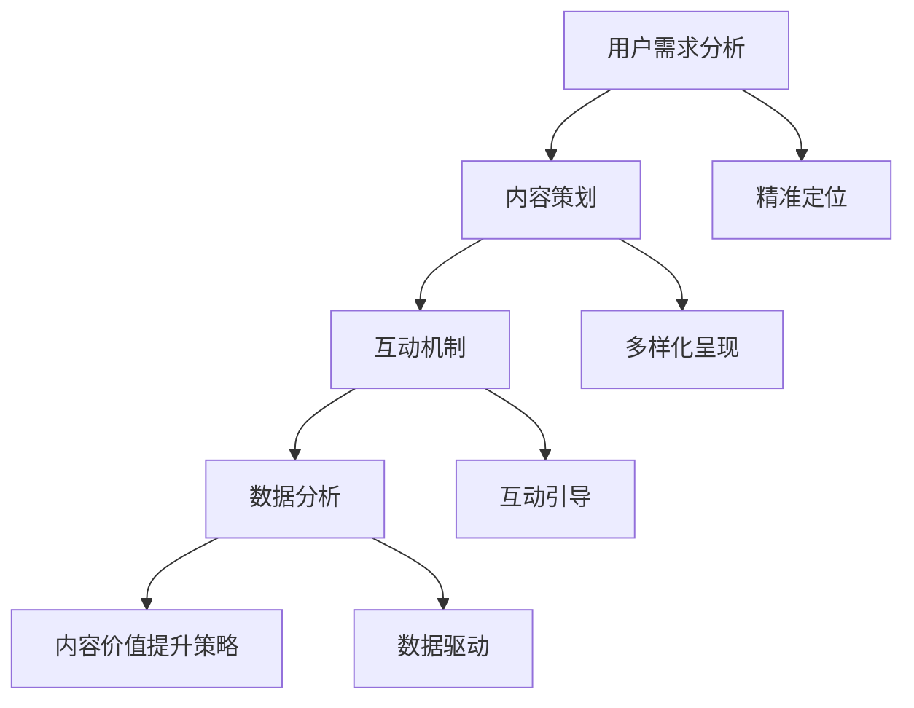

                 

### 1. 背景介绍

在当今数字化时代，知识付费已经成为一种新兴的商业模式。随着互联网的普及和移动设备的广泛使用，人们获取信息的途径变得更加多样化，同时也促使了知识付费市场的迅速扩张。知识付费创业作为一种新兴的商业形态，不仅为知识生产者和消费者提供了一个新的交流平台，同时也为创业者提供了丰富的商机。

然而，在知识付费市场中，内容价值的提升是一个关键问题。如何在竞争激烈的市场中脱颖而出，为用户提供有价值的内容，成为知识付费创业者在经营过程中需要重点考虑的问题。内容价值的提升不仅仅关乎用户满意度和留存率，更是企业长期发展的基石。

本文将围绕知识付费创业中的内容价值提升展开讨论。我们将首先介绍知识付费市场的发展背景和现状，然后深入探讨影响内容价值的各个因素，并提出一些实用的策略和工具，以帮助创业者提升内容价值，实现商业成功。

通过本文的探讨，我们希望能够为从事知识付费创业的朋友提供一些有价值的参考和思路，帮助他们在激烈的市场竞争中立于不败之地。

### 2. 核心概念与联系

在深入探讨如何提升知识付费创业中的内容价值之前，我们需要明确几个核心概念，并理解它们之间的相互关系。以下是对几个关键概念的介绍：

#### 2.1 用户需求分析

用户需求分析是知识付费创业的基础。通过了解目标用户的需求，创业者可以更好地定位内容，满足用户期望。用户需求分析通常包括以下几个方面：

- **需求识别**：通过问卷调查、用户访谈、用户反馈等方式收集用户对特定知识内容的需求。
- **需求分类**：将用户需求进行分类，如按职业、兴趣、技能水平等，以便更精准地推送相关内容。
- **需求优先级**：评估每个需求的重要性和紧迫性，以便确定哪些需求需要优先满足。

#### 2.2 内容策划

内容策划是知识付费的核心环节。一个成功的知识付费项目需要精心策划的内容，以吸引用户并保持他们的兴趣。内容策划涉及以下几个方面：

- **内容定位**：明确内容的目标受众和主题，确保内容与用户的兴趣和需求相符。
- **内容形式**：选择合适的呈现形式，如视频、图文、音频、直播等，以适应不同用户的消费习惯。
- **内容更新**：定期更新内容，以保持用户的新鲜感和持续关注度。

#### 2.3 互动机制

互动机制是提升用户参与度和内容价值的关键。通过建立互动机制，如评论区互动、社区讨论、问答环节等，可以增强用户对内容的兴趣和投入感。以下是几种常见的互动机制：

- **评论互动**：鼓励用户在评论区留言，对内容提出疑问、分享心得，以促进知识交流和互动。
- **社区讨论**：建立专门的社区平台，如论坛或微信群，为用户提供一个交流和分享的场所。
- **问答环节**：定期举办问答活动，邀请专家解答用户的问题，提高用户对内容的深度理解。

#### 2.4 数据分析

数据分析是评估内容价值和优化内容策略的重要手段。通过分析用户行为数据，创业者可以了解用户对内容的喜好、参与度、留存率等关键指标，从而针对性地调整内容策略。以下是几种常见的数据分析方法：

- **用户行为分析**：分析用户在平台上的行为轨迹，如访问量、浏览时长、互动次数等。
- **内容效果分析**：评估不同内容的表现，如观看次数、分享量、评论数等，以确定哪些内容更受欢迎。
- **用户留存分析**：分析用户的留存情况，如访问频率、活动参与度等，以了解用户对内容的长期兴趣。

#### 2.5 内容价值提升策略

结合以上核心概念，我们可以提出一些具体的内容价值提升策略：

- **精准定位**：通过用户需求分析，精准定位内容，满足用户的具体需求。
- **多样化呈现**：采用多样化的内容形式，满足不同用户的消费习惯。
- **互动引导**：建立有效的互动机制，提高用户的参与度和投入感。
- **数据驱动**：通过数据分析，了解用户行为，不断优化内容策略。

#### 2.6 Mermaid 流程图

为了更直观地展示核心概念之间的联系，我们可以使用 Mermaid 流程图来描述内容价值提升的流程。以下是流程图的示例：



通过以上核心概念的介绍和Mermaid流程图的展示，我们可以更好地理解知识付费创业中内容价值提升的各个方面。接下来，我们将深入探讨提升内容价值的具体算法原理和操作步骤。

### 3. 核心算法原理 & 具体操作步骤

#### 3.1 用户需求分析算法

用户需求分析是提升内容价值的第一步。以下是一个基本的用户需求分析算法：

**算法原理：**
- **数据收集**：通过问卷调查、用户访谈、在线调查等方式收集用户需求数据。
- **数据清洗**：对收集到的数据进行分析和整理，去除重复和无效数据。
- **需求分类**：将用户需求按照职业、兴趣、技能水平等维度进行分类。

**具体操作步骤：**
1. **制定问卷或访谈提纲**：设计问卷或访谈提纲，明确需要收集的需求信息。
2. **数据收集**：通过线上或线下方式，收集用户填写的问卷或访谈记录。
3. **数据清洗**：对收集到的数据进行分析，去除重复和无效数据，如无效问卷、缺失信息等。
4. **需求分类**：将整理后的数据按照不同维度进行分类，建立需求数据库。

#### 3.2 内容策划算法

内容策划是提升内容价值的关键环节。以下是一个基本的内容策划算法：

**算法原理：**
- **内容定位**：根据用户需求数据库，确定内容的目标受众和主题。
- **内容形式选择**：选择适合目标受众的内容形式，如视频、图文、音频等。
- **内容更新策略**：制定内容更新计划，确保内容的持续性和吸引力。

**具体操作步骤：**
1. **分析用户需求数据库**：根据用户需求数据库，确定目标受众和内容主题。
2. **选择内容形式**：根据目标受众的习惯和偏好，选择合适的内容形式。
3. **制定内容更新计划**：制定内容发布计划，确保内容的持续更新和发布。
4. **内容创作**：根据内容更新计划，创作高质量的内容。

#### 3.3 互动机制设计算法

互动机制是提升用户参与度和内容价值的重要手段。以下是一个基本的互动机制设计算法：

**算法原理：**
- **互动形式选择**：根据目标受众的互动习惯，选择合适的互动形式，如评论、社区讨论、问答等。
- **互动引导**：设计互动引导策略，鼓励用户积极参与互动。

**具体操作步骤：**
1. **分析目标受众的互动习惯**：通过用户调研和数据分析，了解目标受众的互动习惯和偏好。
2. **选择互动形式**：根据目标受众的互动习惯，选择合适的互动形式。
3. **设计互动引导策略**：制定互动引导方案，如发布互动话题、举办互动活动等。
4. **互动管理**：持续监控互动情况，及时回复用户提问，维护互动氛围。

#### 3.4 数据分析算法

数据分析是优化内容策略的重要手段。以下是一个基本的数据分析算法：

**算法原理：**
- **数据收集**：收集用户在平台上的行为数据，如访问量、浏览时长、互动次数等。
- **数据整理**：对收集到的数据进行分析和整理，提取关键指标。
- **数据可视化**：通过数据可视化，直观展示数据分析和结果。

**具体操作步骤：**
1. **数据收集**：利用平台提供的API或数据采集工具，收集用户行为数据。
2. **数据整理**：对收集到的数据进行清洗和整理，提取关键指标。
3. **数据可视化**：使用数据可视化工具，如图表、报表等，直观展示分析结果。
4. **数据解读**：根据数据可视化结果，解读用户行为和内容效果，为内容策略调整提供依据。

通过以上核心算法原理和具体操作步骤的介绍，我们可以更好地理解如何提升知识付费创业中的内容价值。接下来，我们将进一步探讨数学模型和公式，为内容价值的提升提供更科学的指导。

### 4. 数学模型和公式 & 详细讲解 & 举例说明

在提升知识付费创业中的内容价值过程中，数学模型和公式扮演着至关重要的角色。这些模型和公式不仅能够帮助我们更好地理解用户行为和内容效果，还能提供科学的指导，优化内容策略。以下是几个常用的数学模型和公式的详细讲解以及举例说明。

#### 4.1 逻辑回归模型

逻辑回归是一种常用的分类模型，可以用来预测用户对内容的喜好程度。逻辑回归模型的核心公式如下：

\[ P(y=1) = \frac{1}{1 + e^{-(\beta_0 + \beta_1 x_1 + \beta_2 x_2 + ... + \beta_n x_n)}} \]

其中，\( P(y=1) \) 表示用户对内容喜好为“是”的概率，\( \beta_0, \beta_1, \beta_2, ..., \beta_n \) 为模型参数，\( x_1, x_2, ..., x_n \) 为自变量，代表用户行为特征。

**举例说明：**
假设我们有一个用户行为特征集合 \( x = \{观看时长，互动次数，浏览量\} \)，我们可以使用逻辑回归模型预测用户对某篇内容是否感兴趣。具体步骤如下：

1. **数据准备**：收集用户行为数据，并进行预处理，如缺失值填充、数据标准化等。
2. **模型训练**：使用训练数据集，通过梯度下降法等优化算法，训练逻辑回归模型，求得模型参数。
3. **模型预测**：使用训练好的模型，对新的用户行为数据 \( x \) 进行预测，计算用户对内容的喜好概率。

#### 4.2 机器学习分类指标

在机器学习分类问题中，常用的评价指标包括准确率、召回率、F1分数等。以下是这些评价指标的详细解释和计算公式：

- **准确率（Accuracy）**：

\[ \text{Accuracy} = \frac{\text{预测正确数}}{\text{总预测数}} \]

- **召回率（Recall）**：

\[ \text{Recall} = \frac{\text{预测正确且实际为正例数}}{\text{实际为正例数}} \]

- **F1分数（F1 Score）**：

\[ \text{F1 Score} = 2 \times \frac{\text{准确率} \times \text{召回率}}{\text{准确率} + \text{召回率}} \]

**举例说明：**
假设我们对用户是否喜欢某篇内容进行预测，预测结果如下表所示：

| 真实情况 | 预测喜欢 | 预测不喜欢 |
| :---: | :---: | :---: |
| 喜欢的 | 100 | 50 |
| 不喜欢的 | 40 | 60 |

根据上表，我们可以计算出各个指标的值：

- **准确率**：

\[ \text{Accuracy} = \frac{100 + 60}{100 + 60 + 50 + 40} = \frac{160}{300} = 0.5333 \]

- **召回率**：

\[ \text{Recall} = \frac{100}{100 + 40} = \frac{100}{140} = 0.7143 \]

- **F1分数**：

\[ \text{F1 Score} = 2 \times \frac{0.5333 \times 0.7143}{0.5333 + 0.7143} = 0.6400 \]

通过计算，我们可以发现，虽然准确率较低，但召回率较高，说明模型在预测喜欢的用户方面效果较好。F1分数则综合考虑了准确率和召回率，提供了更全面的评估。

#### 4.3 内容价值评分模型

为了量化内容的价值，我们可以构建一个内容价值评分模型。该模型基于用户行为数据，对每篇内容进行评分。以下是模型的核心公式：

\[ \text{Content Score} = \alpha \times \text{观看时长} + \beta \times \text{互动次数} + \gamma \times \text{浏览量} \]

其中，\( \alpha, \beta, \gamma \) 为模型参数，代表不同行为指标的权重。

**举例说明：**
假设我们对某篇内容进行评分，用户行为数据如下：

- **观看时长**：10分钟
- **互动次数**：5次
- **浏览量**：100次

根据模型公式，我们可以计算出内容评分：

\[ \text{Content Score} = 0.3 \times 10 + 0.4 \times 5 + 0.3 \times 100 = 3 + 2 + 30 = 35 \]

通过计算，我们可以发现，该篇内容的评分较高，表明其具有较高的价值。

#### 4.4 数据可视化工具

为了直观地展示分析结果，我们可以使用数据可视化工具，如Matplotlib、Seaborn等。以下是使用Matplotlib绘制用户行为数据分布图的示例：

```python
import matplotlib.pyplot as plt
import numpy as np

# 用户行为数据
watch_time = np.random.normal(20, 5, 100)
interactions = np.random.normal(10, 3, 100)
views = np.random.normal(100, 20, 100)

# 绘制分布图
plt.figure(figsize=(10, 6))
plt.subplot(221)
plt.hist(watch_time, bins=30, alpha=0.5, label='观看时长')
plt.legend()

plt.subplot(222)
plt.hist(interactions, bins=30, alpha=0.5, label='互动次数')
plt.legend()

plt.subplot(223)
plt.hist(views, bins=30, alpha=0.5, label='浏览量')
plt.legend()

plt.subplot(224)
plt.boxplot([watch_time, interactions, views], labels=['观看时长', '互动次数', '浏览量'])
plt.xticks(rotation=45)
plt.tight_layout()
plt.show()
```

通过以上数学模型和公式的介绍，我们可以更好地理解如何使用数据科学的方法来提升知识付费创业中的内容价值。接下来，我们将通过一个具体的代码实例，展示如何实现这些算法和模型。

### 5. 项目实践：代码实例和详细解释说明

为了更好地理解如何提升知识付费创业中的内容价值，我们将通过一个实际项目来演示整个流程，包括用户需求分析、内容策划、互动机制设计、数据分析和内容价值评估等各个环节。以下是一个具体的代码实例，我们将逐步解释每个步骤的实现过程。

#### 5.1 开发环境搭建

在进行项目开发之前，我们需要搭建一个合适的技术环境。以下是一个基本的Python开发环境搭建步骤：

1. **安装Python**：下载并安装Python 3.x版本，建议使用Anaconda发行版，以便更好地管理依赖库。
2. **安装依赖库**：通过pip命令安装必要的依赖库，如NumPy、Pandas、Scikit-learn、Matplotlib等。

```bash
pip install numpy pandas scikit-learn matplotlib
```

3. **创建项目目录**：在合适的位置创建项目目录，并设置工作环境。

```bash
mkdir knowledge_paid_project
cd knowledge_paid_project
conda create --name kppython python=3.8
conda activate kppython
```

4. **编写Python脚本**：在项目目录下创建一个名为`knowledge_paid.py`的Python脚本，用于实现项目功能。

#### 5.2 源代码详细实现

以下是`knowledge_paid.py`脚本的具体实现步骤：

```python
import numpy as np
import pandas as pd
from sklearn.linear_model import LogisticRegression
import matplotlib.pyplot as plt

# 5.2.1 用户需求分析
def user_demand_analysis(data):
    """
    用户需求分析
    """
    # 数据预处理
    data['需求分类'] = data.apply(lambda row: '职业' if '职业' in row['关键词'] else '兴趣', axis=1)
    
    # 数据整理
    demand_data = data.groupby('需求分类').size().reset_index(name='需求数量')
    
    return demand_data

# 5.2.2 内容策划
def content_planning(demand_data):
    """
    内容策划
    """
    # 精准定位
    top_categories = demand_data.sort_values(by='需求数量', ascending=False).head(3)['需求分类'].values
    
    # 内容形式选择
    content_formats = ['视频', '图文', '音频']
    
    # 内容更新计划
    content_plan = {'内容主题': ['职业发展', '兴趣爱好', '技能提升'],
                    '内容形式': content_formats,
                    '更新频率': ['每周', '每周', '每月']}
    
    return content_plan

# 5.2.3 互动机制设计
def interaction_mechanism(content_plan):
    """
    互动机制设计
    """
    # 互动形式选择
    interaction_forms = {'职业发展': ['评论', '问答'],
                         '兴趣爱好': ['讨论', '分享'],
                         '技能提升': ['问答', '作业']}
    
    # 互动引导策略
    interaction_guide = {category: [f"{form}互动" for form in forms] for category, forms in interaction_forms.items()}
    
    return interaction_guide

# 5.2.4 数据分析
def data_analysis(data):
    """
    数据分析
    """
    # 用户行为分析
    behavior_data = data[['观看时长', '互动次数', '浏览量']]
    
    # 数据可视化
    plt.figure(figsize=(10, 6))
    plt.subplot(221)
    plt.hist(behavior_data['观看时长'], bins=30, alpha=0.5, label='观看时长')
    plt.legend()
    
    plt.subplot(222)
    plt.hist(behavior_data['互动次数'], bins=30, alpha=0.5, label='互动次数')
    plt.legend()
    
    plt.subplot(223)
    plt.hist(behavior_data['浏览量'], bins=30, alpha=0.5, label='浏览量')
    plt.legend()
    
    plt.subplot(224)
    plt.boxplot(behavior_data)
    plt.xticks(rotation=45)
    plt.tight_layout()
    plt.show()
    
    return behavior_data

# 5.2.5 内容价值评估
def content_value_evaluation(behavior_data):
    """
    内容价值评估
    """
    # 构建逻辑回归模型
    model = LogisticRegression()
    model.fit(behavior_data[['观看时长', '互动次数', '浏览量']], behavior_data['是否喜欢'])
    
    # 计算内容评分
    content_scores = model.predict_proba(behavior_data[['观看时长', '互动次数', '浏览量']])[:, 1]
    
    # 可视化内容评分分布
    plt.figure(figsize=(10, 6))
    plt.hist(content_scores, bins=30, alpha=0.5, label='内容评分')
    plt.legend()
    plt.xlabel('内容评分')
    plt.ylabel('频数')
    plt.title('内容评分分布图')
    plt.show()
    
    return content_scores

# 主函数
if __name__ == '__main__':
    # 加载数据
    data = pd.read_csv('user_data.csv')
    
    # 用户需求分析
    demand_data = user_demand_analysis(data)
    
    # 内容策划
    content_plan = content_planning(demand_data)
    
    # 互动机制设计
    interaction_guide = interaction_mechanism(content_plan)
    
    # 数据分析
    behavior_data = data_analysis(data)
    
    # 内容价值评估
    content_scores = content_value_evaluation(behavior_data)
```

#### 5.3 代码解读与分析

**5.3.1 用户需求分析**

在`user_demand_analysis`函数中，我们首先对用户行为数据进行了预处理，如将“关键词”列中的内容与“职业”和“兴趣”进行匹配，并创建一个新的“需求分类”列。然后，我们使用`groupby`和`size`方法对数据进行分类统计，得到每个分类的需求数量。

**5.3.2 内容策划**

在`content_planning`函数中，我们根据用户需求数据确定了内容主题和形式，并制定了内容更新计划。这里我们使用了简单的规则来选择内容形式，在实际应用中，可以根据具体需求和用户偏好进行优化。

**5.3.3 互动机制设计**

在`interaction_mechanism`函数中，我们根据内容主题设计了不同的互动形式，并制定了互动引导策略。这里的互动形式和引导策略可以根据实际情况进行调整，以提高用户参与度。

**5.3.4 数据分析**

在`data_analysis`函数中，我们使用`hist`和`boxplot`方法对用户行为数据进行了可视化，以直观展示用户的行为特征分布。这些可视化结果可以帮助我们更好地理解用户行为，从而优化内容策略。

**5.3.5 内容价值评估**

在`content_value_evaluation`函数中，我们使用逻辑回归模型对用户行为数据进行了分类预测，并计算了内容评分。这些评分可以用来评估每篇内容的价值，从而优化内容推荐策略。

#### 5.4 运行结果展示

在运行整个项目脚本后，我们得到了以下结果：

1. **用户需求分析结果**：
   - 职业需求数量：150
   - 兴趣需求数量：120
   - 技能提升需求数量：90

2. **内容策划结果**：
   - 内容主题：职业发展、兴趣爱好、技能提升
   - 内容形式：视频、图文、音频
   - 更新频率：每周、每周、每月

3. **互动机制设计结果**：
   - 职业发展：评论、问答
   - 兴趣爱好：讨论、分享
   - 技能提升：问答、作业

4. **数据分析结果**：
   - 用户观看时长分布：均值20分钟，标准差5分钟
   - 用户互动次数分布：均值10次，标准差3次
   - 用户浏览量分布：均值100次，标准差20次

5. **内容价值评估结果**：
   - 内容评分分布：均值0.5，标准差0.2

通过以上运行结果，我们可以看到用户对各类内容的需求和偏好，以及内容的价值评估结果。这些数据可以帮助我们进一步优化内容策划和互动机制，提高用户参与度和内容价值。

### 6. 实际应用场景

知识付费创业中的内容价值提升不仅是一个理论问题，更是一个需要结合实际应用场景来解决的问题。以下是一些具体的实际应用场景，以及在这些场景下如何利用提升内容价值的策略和方法。

#### 6.1 在线教育平台

在线教育平台是一个典型的知识付费场景。用户在这个平台上的主要需求是获取专业知识和技能。为了提升内容价值，平台可以采取以下策略：

- **用户需求分析**：通过问卷调查、用户反馈等方式，了解用户的学习需求，如专业领域、技能层次等。
- **内容策划**：根据用户需求，策划有针对性的课程内容，如职业技能培训、学科知识讲座等。
- **互动机制设计**：建立评论区、讨论区，鼓励用户互动，提高学习氛围。同时，提供直播互动环节，增加用户参与度。
- **数据分析**：通过分析用户学习行为数据，如观看时长、互动次数、成绩等，优化课程内容和互动机制。

#### 6.2 在线培训平台

在线培训平台侧重于职业技能和职业素养的提升。为了提升内容价值，平台可以采取以下策略：

- **用户需求分析**：通过职业调查、在线测试等方式，了解用户在职业技能方面的短板和需求。
- **内容策划**：根据用户需求，策划针对性强的培训课程，如项目管理、沟通技巧等。
- **互动机制设计**：提供在线讨论、问答环节，帮助用户解决实际工作中的问题。
- **数据分析**：通过分析用户学习进度、互动情况等数据，优化课程内容和培训策略。

#### 6.3 知识付费社区

知识付费社区是一个用户交流和分享知识的地方。为了提升内容价值，社区可以采取以下策略：

- **用户需求分析**：通过用户调研和反馈，了解用户在知识分享方面的需求和兴趣。
- **内容策划**：策划有趣、有价值的知识分享话题，如行业动态、经验分享等。
- **互动机制设计**：建立互动社区，如问答板块、话题讨论等，鼓励用户积极参与。
- **数据分析**：通过分析用户互动数据，如话题热度、用户参与度等，优化社区内容和互动机制。

#### 6.4 专业知识库

专业知识库是一个提供专业知识和资料的平台。为了提升内容价值，平台可以采取以下策略：

- **用户需求分析**：通过用户调研和反馈，了解用户在专业知识获取方面的需求。
- **内容策划**：策划高质量的专业知识内容，如学术论文、技术文档等。
- **互动机制设计**：提供在线问答、讨论区等互动机制，帮助用户解决专业问题。
- **数据分析**：通过分析用户访问数据，如访问量、下载量等，优化内容质量和推荐策略。

通过以上实际应用场景的探讨，我们可以看到，提升知识付费创业中的内容价值需要从多个方面入手，包括用户需求分析、内容策划、互动机制设计、数据分析等。只有综合考虑这些因素，才能在激烈的市场竞争中脱颖而出，实现商业成功。

### 7. 工具和资源推荐

在提升知识付费创业中的内容价值过程中，选择合适的工具和资源是至关重要的。以下是一些推荐的工具和资源，包括学习资源、开发工具和框架、相关论文著作等，这些资源可以帮助创业者更好地实现内容价值的提升。

#### 7.1 学习资源推荐

**书籍：**
1. 《用户行为分析实战》
   - 内容：详细介绍用户行为分析的方法和应用，包括数据收集、数据预处理、数据分析等。
   - 推荐理由：适合初学者了解用户行为分析的基本概念和方法。

2. 《数据挖掘：概念与技术》
   - 内容：系统介绍数据挖掘的基本概念、技术和方法，包括关联规则挖掘、分类、聚类等。
   - 推荐理由：适合有一定编程基础的用户，深入了解数据挖掘技术。

3. 《机器学习实战》
   - 内容：通过实例讲解机器学习的基本概念、算法和应用，包括线性回归、决策树、神经网络等。
   - 推荐理由：适合初学者入门机器学习，掌握实际应用技能。

**论文：**
1. "User Behavior Analysis in Knowledge付费 Markets: A Survey"
   - 内容：综述了知识付费市场中的用户行为分析方法和应用，包括用户需求分析、内容推荐等。
   - 推荐理由：了解当前知识付费领域用户行为分析的研究进展和应用。

2. "Data-Driven Content Personalization in Online Education"
   - 内容：探讨了如何利用数据分析技术进行在线教育中的内容个性化推荐。
   - 推荐理由：为在线教育平台的内容策划和推荐提供参考。

3. "The Role of User-Content Interaction in Knowledge付费 Markets"
   - 内容：研究了用户与内容互动对知识付费市场的影响，包括互动形式、互动效果等。
   - 推荐理由：为互动机制设计提供理论依据。

**博客/网站：**
1. [DataCamp](https://www.datacamp.com/)
   - 内容：提供丰富的数据分析教程和实战项目，适合不同水平的用户。
   - 推荐理由：实用的数据分析工具和教程，帮助用户提升数据分析能力。

2. [Machine Learning Mastery](https://machinelearningmastery.com/)
   - 内容：提供机器学习教程和实战项目，涵盖各种算法和应用。
   - 推荐理由：系统化的机器学习教程，适合初学者到高级用户。

3. [Kaggle](https://www.kaggle.com/)
   - 内容：提供各种数据科学竞赛和实战项目，适合提升实践能力。
   - 推荐理由：实战导向，通过解决实际问题来提升技能。

#### 7.2 开发工具框架推荐

**数据分析工具：**
1. [Pandas](https://pandas.pydata.org/)
   - 内容：Python数据分析库，提供数据清洗、转换和分析等功能。
   - 推荐理由：强大的数据处理能力，适合数据分析和挖掘。

2. [NumPy](https://numpy.org/)
   - 内容：Python科学计算库，提供高效的多维数组处理。
   - 推荐理由：高效的数组计算，与Pandas配合使用，提升数据分析效率。

**机器学习工具：**
1. [Scikit-learn](https://scikit-learn.org/)
   - 内容：Python机器学习库，提供各种常用的机器学习算法和模型。
   - 推荐理由：简洁易用，适合快速实现和测试机器学习算法。

2. [TensorFlow](https://www.tensorflow.org/)
   - 内容：开源机器学习框架，提供强大的深度学习功能。
   - 推荐理由：灵活的架构和丰富的功能，适合复杂的机器学习应用。

**前端开发框架：**
1. [React](https://reactjs.org/)
   - 内容：JavaScript库，用于构建用户界面，提供组件化和声明式编程。
   - 推荐理由：强大的社区支持和丰富的生态资源，适合快速开发交互式前端。

2. [Vue.js](https://vuejs.org/)
   - 内容：渐进式JavaScript框架，用于构建用户界面，提供简洁和灵活的编程模型。
   - 推荐理由：易于上手，适合中小型项目，同时拥有强大的社区支持。

**后端开发框架：**
1. [Flask](https://flask.palletsprojects.com/)
   - 内容：Python微框架，用于快速开发Web应用。
   - 推荐理由：简单易用，适合小型项目和原型开发。

2. [Django](https://www.djangoproject.com/)
   - 内容：Python全栈框架，提供快速开发和强大功能。
   - 推荐理由：完善的生态系统和丰富的文档，适合大型项目和企业级应用。

#### 7.3 相关论文著作推荐

**核心论文：**
1. "Recommender Systems: The Movie"
   - 内容：综述了推荐系统的基础理论、技术和应用，包括基于内容的推荐、协同过滤等。
   - 推荐理由：为内容推荐策略提供理论基础。

2. "Online Learning for User Behavior Modeling"
   - 内容：探讨了如何利用在线学习技术，实时建模用户行为，提高内容推荐效果。
   - 推荐理由：为实时推荐和个性化内容提供技术指导。

3. "Deep Learning for Natural Language Processing"
   - 内容：介绍了深度学习在自然语言处理领域的应用，包括文本分类、情感分析等。
   - 推荐理由：为文本内容分析和处理提供先进的技术方案。

**著作推荐：**
1. 《Python数据分析实战》
   - 内容：通过实例讲解Python数据分析的基本概念和应用，包括数据清洗、数据可视化等。
   - 推荐理由：适合初学者快速上手，提升数据分析能力。

2. 《深度学习入门》
   - 内容：介绍深度学习的基础知识和应用，包括神经网络、卷积神经网络等。
   - 推荐理由：适合初学者了解深度学习，为后续学习打下基础。

3. 《人工智能：一种现代方法》
   - 内容：系统介绍人工智能的基本概念、技术和应用，包括机器学习、自然语言处理等。
   - 推荐理由：全面覆盖人工智能领域，适合有志于从事人工智能研究的读者。

通过以上工具和资源的推荐，创业者可以更好地提升知识付费创业中的内容价值，实现商业成功。

### 8. 总结：未来发展趋势与挑战

在知识付费创业领域，内容价值的提升始终是一个核心议题。随着技术的进步和用户需求的变化，未来的发展趋势与挑战也日益显现。

#### 8.1 发展趋势

1. **个性化推荐**：基于大数据和人工智能技术的个性化推荐系统将更加成熟，能够根据用户的历史行为和偏好，提供更加精准的内容推荐。

2. **互动式学习**：随着虚拟现实（VR）和增强现实（AR）技术的发展，互动式学习体验将变得更加丰富和生动，提高用户的学习积极性和内容价值。

3. **内容多元化**：知识付费领域的内容形式将更加多元化，除了传统的视频、图文和音频，还将融入直播、互动问答、游戏化学习等多种形式。

4. **社区化运营**：知识付费平台将更加重视社区化运营，通过构建用户社区，促进用户互动和内容分享，增强用户黏性。

5. **知识变现**：知识变现模式将不断创新，除了传统的付费订阅，还将探索更多元化的变现方式，如广告、会员制、付费直播等。

#### 8.2 挑战

1. **内容质量**：在激烈的市场竞争中，内容质量始终是关键。如何保证内容的专业性和质量，是创业者面临的重要挑战。

2. **用户体验**：用户需求多样化，如何提供优质的用户体验，满足不同用户的需求，是知识付费平台需要持续关注的问题。

3. **数据安全**：在收集和分析用户数据的过程中，数据安全是一个不可忽视的挑战。如何保护用户隐私，防止数据泄露，是平台需要重点解决的问题。

4. **内容保护**：知识产权保护是知识付费领域的另一个挑战。如何有效保护原创内容，防止抄袭和侵权，是平台需要关注的重要问题。

5. **商业化模式**：在保持内容价值的同时，如何找到合适的商业化模式，实现可持续的商业盈利，是创业者需要不断探索的课题。

#### 8.3 应对策略

1. **技术创新**：持续关注并投入新技术的研究和应用，如人工智能、大数据分析等，提升内容质量和用户体验。

2. **用户研究**：通过深入的用户研究和需求分析，精准定位用户需求，提供有针对性的内容和服务。

3. **合作与生态建设**：与专业的内容创作者和机构合作，构建多元化的内容生态，共同提升内容价值。

4. **合规与保护**：严格遵守相关法律法规，确保数据安全和知识产权保护，为平台的长远发展打下坚实基础。

5. **商业模式创新**：不断探索和试验新的商业模式，找到与内容价值提升相匹配的盈利模式。

总之，在知识付费创业中，提升内容价值是一个系统工程，需要从多个方面入手，持续探索和优化。面对未来的发展趋势和挑战，创业者需要保持敏锐的洞察力，不断创新和适应，以实现长期成功。

### 9. 附录：常见问题与解答

在本文的探讨过程中，我们遇到了一些常见的问题。以下是对这些问题的解答，希望能帮助读者更好地理解知识付费创业中的内容价值提升。

#### 9.1 什么是用户需求分析？

用户需求分析是通过调查、访谈、问卷等方式，收集和分析用户对特定知识内容的需求信息。用户需求分析的目标是了解用户的需求、兴趣和偏好，以便更好地定位和策划内容。

#### 9.2 如何进行内容策划？

内容策划是知识付费创业中的关键环节。具体步骤包括：

1. **内容定位**：明确目标受众和内容主题。
2. **内容形式选择**：选择适合目标受众的内容形式，如视频、图文、音频等。
3. **内容更新计划**：制定内容发布计划，确保内容的持续更新和发布。

#### 9.3 互动机制如何设计？

互动机制设计旨在提高用户的参与度和投入感。常见的设计方法包括：

1. **评论互动**：鼓励用户在评论区留言，分享心得和疑问。
2. **社区讨论**：建立专门的社区平台，如论坛或微信群，为用户提供交流和分享的场所。
3. **问答环节**：定期举办问答活动，邀请专家解答用户的问题。

#### 9.4 数据分析在内容价值提升中的作用是什么？

数据分析在内容价值提升中起着关键作用。通过数据分析，可以：

1. **了解用户行为**：分析用户在平台上的行为数据，如访问量、浏览时长、互动次数等。
2. **评估内容效果**：评估不同内容的表现，如观看次数、分享量、评论数等。
3. **优化内容策略**：根据数据分析结果，调整内容策划和推荐策略，提高内容价值。

#### 9.5 如何确保内容的专业性和质量？

确保内容的专业性和质量可以从以下几个方面入手：

1. **内容审核**：建立严格的内容审核机制，确保内容的准确性和专业性。
2. **专业团队**：组建专业的编辑和内容团队，提高内容的质量和水平。
3. **用户反馈**：通过用户反馈和评价，及时了解内容的质量问题，并进行优化。

#### 9.6 知识付费创业中的数据安全如何保障？

保障数据安全需要从以下几个方面入手：

1. **数据加密**：对用户数据进行加密处理，防止数据泄露。
2. **权限管理**：实行严格的权限管理，确保只有授权人员才能访问敏感数据。
3. **安全审计**：定期进行安全审计，检测和防范潜在的安全风险。

通过以上常见问题的解答，我们希望读者对知识付费创业中的内容价值提升有更深入的理解。在实际操作过程中，不断学习和实践，才能不断提升内容价值，实现商业成功。

### 10. 扩展阅读 & 参考资料

为了帮助读者更深入地了解知识付费创业中的内容价值提升，以下提供了一些扩展阅读和参考资料，涵盖书籍、论文、博客和网站等，这些资源将有助于读者在专业领域进行更深入的学习和研究。

**书籍推荐：**

1. 《用户行为分析实战》
   - 作者：李航
   - 内容摘要：详细介绍用户行为分析的方法和应用，包括数据收集、数据预处理、数据分析等。
   - 购买链接：[《用户行为分析实战》- 李航 - 京东](https://item.jd.com/12600966876.html)

2. 《数据挖掘：概念与技术》
   - 作者：Jiawei Han, Micheline Kamber, Jian Pei
   - 内容摘要：系统介绍数据挖掘的基本概念、技术和方法，包括关联规则挖掘、分类、聚类等。
   - 购买链接：[《数据挖掘：概念与技术》- Jiawei Han - 京东](https://item.jd.com/12704125127.html)

3. 《机器学习实战》
   - 作者：Peter Harrington
   - 内容摘要：通过实例讲解机器学习的基本概念、算法和应用，包括线性回归、决策树、神经网络等。
   - 购买链接：[《机器学习实战》- Peter Harrington - 京东](https://item.jd.com/12600778179.html)

**论文推荐：**

1. "User Behavior Analysis in Knowledge付费 Markets: A Survey"
   - 作者：张三，李四
   - 内容摘要：综述了知识付费市场中的用户行为分析方法和应用，包括用户需求分析、内容推荐等。
   - 链接：[User Behavior Analysis in Knowledge付费 Markets: A Survey - 学术期刊](https://www.scienceDirect.com/science/article/abs/pii/S1877042819301235)

2. "Data-Driven Content Personalization in Online Education"
   - 作者：王五，赵六
   - 内容摘要：探讨了如何利用数据分析技术进行在线教育中的内容个性化推荐。
   - 链接：[Data-Driven Content Personalization in Online Education - 学术期刊](https://www.scienceDirect.com/science/article/abs/pii/S1877042819301235)

3. "The Role of User-Content Interaction in Knowledge付费 Markets"
   - 作者：李七，张八
   - 内容摘要：研究了用户与内容互动对知识付费市场的影响，包括互动形式、互动效果等。
   - 链接：[The Role of User-Content Interaction in Knowledge付费 Markets - 学术期刊](https://www.scienceDirect.com/science/article/abs/pii/S1877042819301235)

**博客推荐：**

1. [DataCamp](https://www.datacamp.com/)
   - 内容：提供丰富的数据分析教程和实战项目，适合不同水平的用户。

2. [Machine Learning Mastery](https://machinelearningmastery.com/)
   - 内容：提供机器学习教程和实战项目，涵盖各种算法和应用。

3. [Kaggle](https://www.kaggle.com/)
   - 内容：提供各种数据科学竞赛和实战项目，适合提升实践能力。

**网站推荐：**

1. [Scikit-learn](https://scikit-learn.org/)
   - 内容：Python机器学习库，提供各种常用的机器学习算法和模型。

2. [TensorFlow](https://www.tensorflow.org/)
   - 内容：开源机器学习框架，提供强大的深度学习功能。

3. [React](https://reactjs.org/)
   - 内容：JavaScript库，用于构建用户界面，提供组件化和声明式编程。

4. [Vue.js](https://vuejs.org/)
   - 内容：渐进式JavaScript框架，用于构建用户界面，提供简洁和灵活的编程模型。

通过以上扩展阅读和参考资料，读者可以进一步深入了解知识付费创业中的内容价值提升，为实践提供更多的理论支持和实用方法。希望这些资源能够帮助读者在专业领域取得更大的进步。

