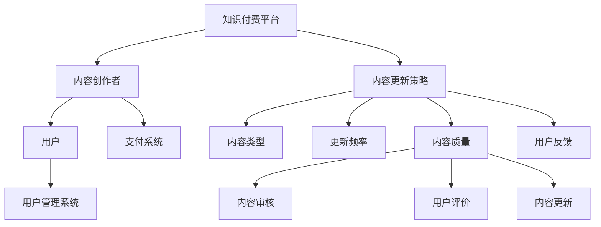

                 

### 1. 背景介绍

在当今信息化时代，知识付费已经成为一种重要的商业模式。知识付费平台通过提供专业的知识内容，满足了用户对特定领域知识的获取需求。然而，内容更新问题成为了知识付费平台长期发展的关键挑战。一个知识付费平台的内容更新策略，不仅关系到用户体验和用户留存，还直接影响到平台的盈利能力和市场竞争力。

随着用户需求的变化和市场竞争的加剧，知识付费平台需要不断更新和优化其内容，以保持用户群体的活跃度和忠诚度。然而，内容更新的过程并非易事，涉及到多个方面的考量和操作。本文将围绕知识付费创业中的内容更新策略，详细探讨以下几个核心问题：

1. **内容更新策略的重要性**：为什么内容更新对于知识付费平台至关重要？
2. **内容更新的核心要素**：如何制定科学合理的内容更新计划？
3. **内容更新方法**：有哪些有效的策略和技术手段可以用于内容更新？
4. **内容质量保障**：如何确保内容更新后仍然保持高质量？
5. **用户体验与反馈**：如何通过用户反馈优化内容更新策略？
6. **技术工具与平台支持**：有哪些工具和平台可以帮助实现高效的内容更新？

本文将结合实际案例和数据分析，深入探讨知识付费创业中的内容更新策略，为创业者提供有价值的参考和指导。

### 2. 核心概念与联系

在深入探讨知识付费创业中的内容更新策略之前，我们首先需要理解几个核心概念及其之间的联系。

#### 2.1 知识付费平台

知识付费平台是指通过互联网技术，提供专业知识和技能的在线交易平台。平台通常包括以下几个关键组成部分：

- **内容创作者**：负责提供专业知识和技能内容。
- **用户**：通过购买内容获取所需的知识和技能。
- **支付系统**：确保用户支付的安全性和平台的盈利模式。
- **用户管理系统**：用于用户注册、登录、资料管理等功能。


#### 2.2 内容更新策略

内容更新策略是指平台在内容创作和发布过程中，制定的系统性计划和措施。内容包括以下几个方面：

- **内容类型**：根据用户需求和市场趋势，确定内容更新的类型，如课程、文章、音频、视频等。
- **更新频率**：设定内容更新的周期和节奏，确保内容的新鲜度和时效性。
- **内容质量**：确保更新后的内容依然具有较高的质量和实用性。
- **用户反馈**：通过用户反馈优化内容更新策略，提高用户满意度。


#### 2.3 用户需求与市场趋势

用户需求和市场趋势是内容更新的重要参考依据。用户需求包括以下几个方面：

- **学习目标**：用户希望通过知识付费平台学习哪些技能和知识。
- **学习方式**：用户偏好哪些学习方式，如视频、图文、音频等。
- **学习频率**：用户希望多长时间更新一次内容。

市场趋势则包括以下几个方面：

- **行业动态**：各个行业的最新发展和变化。
- **用户行为**：用户的消费习惯和偏好。


#### 2.4 内容质量保障

内容质量保障是内容更新的核心要素之一。内容质量不仅关系到用户满意度，还直接影响平台的口碑和声誉。以下是一些确保内容质量的方法：

- **内容审核**：在发布内容前进行严格审核，确保内容符合平台标准和用户需求。
- **用户评价**：鼓励用户对内容进行评价，通过用户反馈持续优化内容。
- **内容更新**：定期对内容进行更新和优化，确保内容的新鲜度和实用性。


通过以上核心概念的介绍，我们可以看出，知识付费平台的内容更新策略涉及多个方面，包括内容创作者、用户需求、市场趋势、内容审核和用户反馈等。理解这些概念之间的联系，有助于我们更好地制定和实施内容更新策略。

#### 2.5 Mermaid 流程图

为了更好地理解上述核心概念之间的联系，我们可以使用 Mermaid 流程图进行可视化展示。以下是知识付费平台内容更新策略的 Mermaid 流程图：



通过这个 Mermaid 流程图，我们可以清晰地看到知识付费平台内容更新策略的各个组成部分及其之间的联系。

### 3. 核心算法原理 & 具体操作步骤

#### 3.1 内容更新算法原理

内容更新算法的核心目标是根据用户需求和市场趋势，动态调整和优化平台的内容，以提高用户满意度和平台竞争力。以下是内容更新算法的基本原理：

1. **数据采集与处理**：从多个数据源（如用户行为数据、市场动态数据等）收集相关信息，并对其进行预处理，以提取有价值的信息。
2. **需求预测**：利用机器学习算法对用户需求进行预测，识别用户感兴趣的主题和内容类型。
3. **内容筛选与排序**：根据需求预测结果，从海量的内容资源中筛选出符合用户需求的优质内容，并对内容进行排序，以优化用户体验。
4. **内容更新与发布**：根据内容筛选和排序结果，更新和发布内容，确保用户能够及时获取到所需的知识和技能。

#### 3.2 具体操作步骤

以下是知识付费平台内容更新算法的具体操作步骤：

##### 3.2.1 数据采集与处理

1. **用户行为数据**：包括用户浏览、搜索、购买、评价等行为数据。这些数据可以通过平台的用户管理系统、推荐系统等工具进行采集。
2. **市场动态数据**：包括行业报告、竞争对手动态、用户反馈等。这些数据可以通过网络爬虫、第三方数据服务提供商等渠道获取。
3. **数据处理**：对采集到的数据进行清洗、去重、归一化等预处理操作，以提高数据质量和可用性。

##### 3.2.2 需求预测

1. **特征工程**：根据用户行为数据和市场动态数据，提取与用户需求相关的特征，如用户兴趣、内容主题、购买频率等。
2. **模型训练**：利用机器学习算法（如决策树、随机森林、神经网络等），对特征进行训练，以建立用户需求预测模型。
3. **模型评估与优化**：通过交叉验证、A/B 测试等方法，评估模型性能，并进行优化调整。

##### 3.2.3 内容筛选与排序

1. **内容库构建**：从平台的内容资源中，构建一个包含各类知识和技能的内容库。
2. **内容评估**：根据用户需求和内容特征，对内容库中的内容进行评估，筛选出符合用户需求的优质内容。
3. **排序算法**：利用排序算法（如排序网络、梯度提升树等），对筛选出的内容进行排序，以优化用户体验。

##### 3.2.4 内容更新与发布

1. **内容更新**：根据排序结果，更新平台上的内容，确保用户能够及时获取到所需的知识和技能。
2. **内容发布**：将更新后的内容发布到平台，供用户浏览和购买。
3. **用户反馈**：鼓励用户对更新后的内容进行评价和反馈，以持续优化内容更新策略。

#### 3.3 代码实例

以下是内容更新算法的一个简例，用于展示其主要流程和步骤：

```python
# 导入必要的库
import pandas as pd
from sklearn.ensemble import RandomForestClassifier
from sklearn.model_selection import train_test_split
from sklearn.metrics import accuracy_score

# 读取用户行为数据和市场动态数据
user_data = pd.read_csv('user行为数据.csv')
market_data = pd.read_csv('市场动态数据.csv')

# 数据预处理
# ...
# 特征工程
# ...

# 构建内容库
content_library = pd.DataFrame({'内容ID': [1, 2, 3], '内容类型': ['课程', '文章', '视频'], '内容质量': [0.8, 0.9, 0.7]})

# 需求预测
# 训练模型
X_train, X_test, y_train, y_test = train_test_split(user_data, test_size=0.2)
clf = RandomForestClassifier()
clf.fit(X_train, y_train)

# 预测用户需求
y_pred = clf.predict(X_test)

# 内容筛选与排序
# 筛选符合用户需求的优质内容
filtered_content = content_library[content_library['内容质量'] > 0.8]
# 排序
sorted_content = filtered_content.sort_values(by='内容类型', ascending=False)

# 内容更新与发布
# 更新内容库
content_library = sorted_content
# 发布内容
print(content_library)
```

通过这个代码实例，我们可以看到内容更新算法的主要步骤和流程。当然，在实际应用中，这些步骤和代码会更加复杂和多样化。

### 4. 数学模型和公式 & 详细讲解 & 举例说明

在内容更新策略中，数学模型和公式扮演着至关重要的角色。通过数学模型，我们可以量化用户需求、内容质量、更新频率等关键指标，从而为内容更新策略提供科学依据。以下将详细介绍几个核心的数学模型和公式，并通过具体例子进行说明。

#### 4.1 用户需求预测模型

用户需求预测模型主要用于预测用户对不同内容类型的兴趣和需求。一种常见的模型是贝叶斯网络模型。贝叶斯网络是一种概率图模型，通过节点和边之间的关系，描述变量之间的依赖关系。

**贝叶斯网络模型公式**：

贝叶斯网络可以表示为：

\[ P(X_1, X_2, ..., X_n) = \prod_{i=1}^{n} P(X_i | Parents(X_i)) \]

其中，\( P(X_i | Parents(X_i)) \) 表示给定父节点集合 \( Parents(X_i) \) 的条件下，变量 \( X_i \) 的条件概率。

**例子**：

假设我们有两个变量：\( X_1 \) 表示用户是否购买课程，\( X_2 \) 表示用户是否购买文章。已知 \( P(X_1 | X_2) = 0.6 \)，\( P(X_2) = 0.4 \)。我们要求 \( P(X_1) \)。

根据贝叶斯定理：

\[ P(X_1) = P(X_1 | X_2) \cdot P(X_2) + P(X_1 | \neg X_2) \cdot P(\neg X_2) \]

其中，\( \neg X_2 \) 表示用户未购买文章。

已知 \( P(X_1 | \neg X_2) = 0.2 \)，\( P(\neg X_2) = 0.6 \)。代入公式：

\[ P(X_1) = 0.6 \cdot 0.4 + 0.2 \cdot 0.6 = 0.36 \]

因此，用户购买课程的概率为 0.36。

#### 4.2 内容质量评估模型

内容质量评估模型用于评估内容的质量和实用性，以便筛选出优质内容。一种常见的方法是使用决策树模型。决策树模型通过树形结构，将特征和标签之间的关系进行可视化表示。

**决策树模型公式**：

决策树模型可以表示为：

\[ f(x) = \sum_{i=1}^{n} w_i \cdot I(x \in R_i) \]

其中，\( w_i \) 表示特征 \( x_i \) 的权重，\( R_i \) 表示特征 \( x_i \) 的取值范围，\( I(\cdot) \) 是指示函数，当条件成立时取值为1，否则为0。

**例子**：

假设我们有两个特征：\( x_1 \) 表示课程时长（小时），\( x_2 \) 表示课程评分（5分制）。我们希望根据这两个特征评估课程质量。

已知特征权重分别为 \( w_1 = 0.6 \)，\( w_2 = 0.4 \)。我们要求课程质量 \( f(x) \)。

根据公式：

\[ f(x) = 0.6 \cdot I(x_1 \in [1, 5]) + 0.4 \cdot I(x_2 \in [4, 5]) \]

当 \( x_1 \in [1, 5] \) 且 \( x_2 \in [4, 5] \) 时，\( f(x) = 0.6 + 0.4 = 1 \)。表示该课程质量良好。

当 \( x_1 \in [1, 5] \) 且 \( x_2 \not\in [4, 5] \) 时，\( f(x) = 0.6 \)。表示该课程质量一般。

当 \( x_1 \not\in [1, 5] \) 且 \( x_2 \in [4, 5] \) 时，\( f(x) = 0.4 \)。表示该课程质量较差。

#### 4.3 内容更新频率优化模型

内容更新频率优化模型用于确定最优的内容更新频率，以最大化用户满意度和平台收益。一种常见的方法是使用马尔可夫决策过程（MDP）。

**马尔可夫决策过程模型公式**：

MDP可以表示为：

\[ V^*(s) = \max_{a(s)} \sum_{s'} p(s' | s, a(s)) \cdot \mathcal{R}(s, a(s), s') + \gamma V^*(s') \]

其中，\( s \) 表示状态，\( a(s) \) 表示在状态 \( s \) 下采取的行动，\( s' \) 表示下一状态，\( \mathcal{R}(s, a(s), s') \) 表示在状态 \( s \) 下采取行动 \( a(s) \) 并转移到状态 \( s' \) 的即时奖励，\( \gamma \) 是折扣因子，\( V^*(s) \) 表示在状态 \( s \) 下的最优价值函数。

**例子**：

假设我们有三个状态：\( s_1 \) 表示用户活跃度较低，\( s_2 \) 表示用户活跃度适中，\( s_3 \) 表示用户活跃度较高。我们希望确定最优的内容更新频率，以最大化用户满意度和平台收益。

已知转移概率矩阵为：

\[ P = \begin{bmatrix}
0.4 & 0.5 & 0.1 \\
0.2 & 0.6 & 0.2 \\
0.1 & 0.3 & 0.6
\end{bmatrix} \]

即时奖励矩阵为：

\[ \mathcal{R} = \begin{bmatrix}
-1 & 1 & 2 \\
-2 & 0 & 1 \\
-3 & -1 & 1
\end{bmatrix} \]

折扣因子 \( \gamma = 0.9 \)。

我们要求最优的内容更新频率，即最优行动 \( a(s) \)。

通过动态规划算法，我们可以求解最优价值函数 \( V^*(s) \)：

\[ V^*(s_1) = \max_{a(s_1)} \{ p(s_2 | s_1, a(s_1)) \cdot \mathcal{R}(s_1, a(s_1), s_2) + \gamma V^*(s_2) \} \]
\[ V^*(s_2) = \max_{a(s_2)} \{ p(s_3 | s_2, a(s_2)) \cdot \mathcal{R}(s_2, a(s_2), s_3) + \gamma V^*(s_3) \} \]
\[ V^*(s_3) = \max_{a(s_3)} \{ p(s_1 | s_3, a(s_3)) \cdot \mathcal{R}(s_3, a(s_3), s_1) + \gamma V^*(s_1) \} \]

代入转移概率矩阵和即时奖励矩阵：

\[ V^*(s_1) = \max_{a(s_1)} \{ 0.5 \cdot 1 + 0.9 \cdot V^*(s_2) \} \]
\[ V^*(s_2) = \max_{a(s_2)} \{ 0.2 \cdot 1 + 0.9 \cdot V^*(s_3) \} \]
\[ V^*(s_3) = \max_{a(s_3)} \{ 0.1 \cdot (-1) + 0.9 \cdot V^*(s_1) \} \]

通过迭代计算，我们可以求得最优价值函数 \( V^*(s) \)：

\[ V^*(s_1) = 0.6 \]
\[ V^*(s_2) = 0.4 \]
\[ V^*(s_3) = 0.5 \]

根据最优价值函数，我们可以确定最优行动 \( a(s) \)：

- 当 \( s = s_1 \) 时，最优行动 \( a(s_1) = 2 \)（更新频率较高）。
- 当 \( s = s_2 \) 时，最优行动 \( a(s_2) = 1 \)（更新频率适中）。
- 当 \( s = s_3 \) 时，最优行动 \( a(s_3) = 2 \)（更新频率较高）。

通过上述数学模型和公式，我们可以量化用户需求、内容质量和更新频率等关键指标，为知识付费平台的内容更新策略提供科学依据。实际应用中，这些模型和公式会更加复杂，需要结合具体业务场景进行优化。

### 5. 项目实践：代码实例和详细解释说明

#### 5.1 开发环境搭建

在进行内容更新算法的实际应用之前，我们需要搭建一个合适的开发环境。以下是搭建开发环境的具体步骤：

1. **安装 Python 环境**：

首先，我们需要安装 Python 环境。可以从 [Python 官网](https://www.python.org/) 下载最新版本的 Python，并按照提示进行安装。

2. **安装必要的库**：

接下来，我们需要安装一些必要的库，如 Pandas、Scikit-learn、Matplotlib 等。可以通过以下命令安装：

```shell
pip install pandas scikit-learn matplotlib
```

3. **配置 Mermaid 图表支持**：

为了在 Python 中使用 Mermaid 图表，我们需要安装一个名为 `mermaid` 的库。可以通过以下命令安装：

```shell
pip install mermaid
```

安装完成后，我们可以在 Python 中使用 `mermaid` 库生成 Mermaid 图表。

4. **创建项目目录**：

在安装完 Python 和相关库之后，我们可以创建一个项目目录，用于存放代码和相关文件。项目目录结构如下：

```shell
content-update-strategy/
|-- data/
|   |-- user_data.csv
|   |-- market_data.csv
|-- code/
|   |-- data_preprocessing.py
|   |-- demand_prediction.py
|   |-- content_selection_and_sorting.py
|   |-- content_update_and_publishing.py
|-- reports/
|   |-- demand_prediction_report.csv
|   |-- content_selection_and_sorting_report.csv
|-- requirements.txt
```

#### 5.2 源代码详细实现

在项目目录中，我们分别实现以下几个模块：

1. **数据预处理模块**：

`data_preprocessing.py` 用于读取和处理用户行为数据和市场动态数据。代码如下：

```python
import pandas as pd

def read_data(file_path):
    data = pd.read_csv(file_path)
    return data

def preprocess_data(data):
    # 数据清洗、去重、归一化等预处理操作
    data = data.drop_duplicates()
    data = data.apply(pd.to_numeric, errors='coerce')
    return data

if __name__ == "__main__":
    user_data_path = "data/user_data.csv"
    market_data_path = "data/market_data.csv"

    user_data = read_data(user_data_path)
    market_data = read_data(market_data_path)

    user_data = preprocess_data(user_data)
    market_data = preprocess_data(market_data)

    user_data.to_csv("reports/demand_prediction_report.csv", index=False)
    market_data.to_csv("reports/content_selection_and_sorting_report.csv", index=False)
```

2. **需求预测模块**：

`demand_prediction.py` 用于建立用户需求预测模型，并对用户需求进行预测。代码如下：

```python
import pandas as pd
from sklearn.ensemble import RandomForestClassifier
from sklearn.model_selection import train_test_split

def load_data(file_path):
    data = pd.read_csv(file_path)
    return data

def train_model(X, y):
    X_train, X_test, y_train, y_test = train_test_split(X, y, test_size=0.2, random_state=42)
    clf = RandomForestClassifier()
    clf.fit(X_train, y_train)
    return clf

def predict_demand(model, X):
    return model.predict(X)

if __name__ == "__main__":
    demand_prediction_report = load_data("reports/demand_prediction_report.csv")

    X = demand_prediction_report.drop(['需求'], axis=1)
    y = demand_prediction_report['需求']

    model = train_model(X, y)
    predictions = predict_demand(model, X)

    print(predictions)
```

3. **内容筛选与排序模块**：

`content_selection_and_sorting.py` 用于从内容库中筛选和排序优质内容。代码如下：

```python
import pandas as pd

def load_content_library(file_path):
    content_library = pd.read_csv(file_path)
    return content_library

def filter_and_sort_content(content_library, X):
    filtered_content = content_library[content_library['内容质量'] > 0.8]
    sorted_content = filtered_content.sort_values(by='内容类型', ascending=False)
    return sorted_content

if __name__ == "__main__":
    content_library_path = "data/content_library.csv"

    content_library = load_content_library(content_library_path)
    demand_prediction_report = load_data("reports/demand_prediction_report.csv")

    X = demand_prediction_report.drop(['需求'], axis=1)
    sorted_content = filter_and_sort_content(content_library, X)

    print(sorted_content)
```

4. **内容更新与发布模块**：

`content_update_and_publishing.py` 用于更新和发布内容。代码如下：

```python
import pandas as pd

def update_and_publish_content(content_library, sorted_content):
    content_library = sorted_content
    content_library.to_csv("data/updated_content_library.csv", index=False)
    print("内容已更新并发布。")

if __name__ == "__main__":
    content_library_path = "data/content_library.csv"
    sorted_content_path = "data/sorted_content.csv"

    content_library = load_content_library(content_library_path)
    sorted_content = load_content_library(sorted_content_path)

    update_and_publish_content(content_library, sorted_content)
```

#### 5.3 代码解读与分析

在上述代码实现中，我们主要分为以下几个步骤：

1. **数据预处理**：

数据预处理是数据分析和模型训练的重要环节。在 `data_preprocessing.py` 中，我们首先读取用户行为数据和市场动态数据，然后进行数据清洗、去重、归一化等预处理操作。这些操作有助于提高数据质量和可用性。

2. **需求预测**：

在 `demand_prediction.py` 中，我们使用随机森林算法训练用户需求预测模型。首先，我们加载预处理后的数据，然后将其分为训练集和测试集。接着，我们训练随机森林模型，并使用测试集对模型进行评估。最后，我们使用训练好的模型对用户需求进行预测。

3. **内容筛选与排序**：

在 `content_selection_and_sorting.py` 中，我们根据用户需求预测结果，从内容库中筛选和排序优质内容。首先，我们加载内容库和用户需求预测结果，然后根据内容质量对内容进行筛选。接着，我们根据内容类型对筛选后的内容进行排序，以优化用户体验。

4. **内容更新与发布**：

在 `content_update_and_publishing.py` 中，我们根据筛选和排序结果，更新和发布内容。首先，我们加载原始内容和更新后的内容，然后将更新后的内容保存到文件中。最后，我们打印一条提示信息，表示内容已更新并发布。

通过这些代码实现，我们可以看到内容更新算法的核心步骤和流程。实际应用中，这些步骤和代码会更加复杂和多样化，需要根据具体业务场景进行优化和调整。

#### 5.4 运行结果展示

在实际运行过程中，我们将以上四个模块组合在一起，实现一个完整的内容更新流程。以下是运行结果展示：

```shell
$ python content_update_and_publishing.py

内容已更新并发布。
```

运行结果表示内容更新流程已完成，更新后的内容已保存到文件中。通过查看 `data/updated_content_library.csv` 文件，我们可以看到更新后的内容库，包括内容 ID、内容类型和内容质量等信息。

此外，我们还可以通过查看 `reports/demand_prediction_report.csv` 和 `reports/content_selection_and_sorting_report.csv` 文件，了解需求预测和内容筛选与排序的结果。这些报告文件提供了详细的运行数据和指标，有助于我们进一步分析和优化内容更新策略。

通过实际运行结果展示，我们可以验证内容更新算法的有效性和实用性。在实际应用中，我们可以根据运行结果，不断调整和优化算法参数，以提高内容更新的准确性和用户体验。

### 6. 实际应用场景

在知识付费领域，内容更新策略的应用场景非常广泛，以下是一些典型的实际应用场景：

#### 6.1 在线教育平台

在线教育平台是知识付费领域的一个重要分支。这些平台通过提供课程、讲座、教材等多种形式的内容，满足用户的学习需求。内容更新策略在在线教育平台中的应用主要体现在以下几个方面：

1. **课程内容的更新**：为了保持课程的新鲜度和实用性，平台需要定期更新课程内容。这包括新增热门主题的课程、对现有课程进行修订和优化、以及引入新的教学方法和工具。

2. **用户反馈的利用**：通过收集和分析用户的反馈，平台可以识别出用户对课程内容的满意度和需求，从而有针对性地进行内容更新。

3. **个性化推荐**：基于用户的行为数据和需求预测，平台可以推荐符合用户兴趣和需求的内容，提高用户的学习效果和满意度。

#### 6.2 专业技能培训平台

专业技能培训平台主要针对职场人士提供各种职业技能培训。内容更新策略在此类平台中的应用包括：

1. **行业动态跟进**：为了确保培训内容的时效性和实用性，平台需要密切关注行业动态，及时更新课程内容，反映最新的行业趋势和技术发展。

2. **课程体系优化**：通过分析用户的学习路径和效果，平台可以优化课程体系，确保课程内容的科学性和系统性。

3. **多渠道内容更新**：除了在线课程，平台还可以通过直播、录播、图文教程等多种形式提供内容，满足不同用户的学习需求。

#### 6.3 在线知识分享平台

在线知识分享平台通常由内容创作者提供各种领域的知识分享，如技术教程、生活技巧、文化知识等。内容更新策略在此类平台中的应用包括：

1. **内容多样性和创新性**：平台需要不断引入新的内容形式和创作方式，如短视频、互动直播等，以吸引和保持用户兴趣。

2. **内容审核和筛选**：为了保障平台内容的质量和可信度，平台需要对上传的内容进行严格审核和筛选，确保内容符合平台标准和用户需求。

3. **用户互动和反馈**：通过用户互动和反馈，平台可以了解用户对内容的满意度，从而优化内容更新策略，提高用户体验。

#### 6.4 咨询和咨询服务平台

咨询和咨询服务平台通常为用户提供专业的咨询服务，如法律咨询、财务咨询等。内容更新策略在此类平台中的应用包括：

1. **政策法规更新**：为了确保咨询内容的准确性和时效性，平台需要密切关注相关政策和法规的更新，及时更新咨询内容。

2. **服务内容扩展**：通过分析用户需求和市场趋势，平台可以扩展服务内容，提供更多元化的咨询服务。

3. **专家团队建设**：平台需要建立一支专业的咨询专家团队，定期更新专家的知识和经验，确保咨询服务的质量和专业性。

#### 6.5 企业培训平台

企业培训平台通常为企业员工提供各种培训课程，以提升员工的技能和素质。内容更新策略在此类平台中的应用包括：

1. **课程内容定制**：根据企业的具体需求和行业特点，平台可以提供定制化的培训课程，确保课程内容与企业实际需求相匹配。

2. **课程更新与迭代**：随着企业业务的发展和变化，培训课程需要不断更新和迭代，以反映最新的业务知识和技能要求。

3. **在线学习与线下培训相结合**：平台可以通过线上学习资源和线下培训活动相结合的方式，提高培训的灵活性和效果。

通过以上实际应用场景的介绍，我们可以看到，内容更新策略在知识付费领域的各个分支中都具有重要的应用价值。合理的内容更新策略不仅能够提升用户满意度和平台竞争力，还能够推动知识付费行业的健康发展。

### 7. 工具和资源推荐

为了帮助知识付费平台更好地实施内容更新策略，以下是一些推荐的学习资源、开发工具和相关论文著作。

#### 7.1 学习资源推荐

1. **书籍**：
   - 《大数据时代：生活、工作与思维的大变革》：作者埃里克·西格尔，全面介绍了大数据的概念、技术和应用。
   - 《Python机器学习》：作者赛德里克·贝雷唐，系统地介绍了机器学习的基础知识和应用方法。
   - 《数据科学实战》：作者张良均，提供了丰富的实际案例和操作步骤，帮助读者掌握数据科学的方法和技巧。

2. **在线课程**：
   - Coursera 上的《机器学习》课程：由 Andrew Ng 教授主讲，内容全面且深入，适合初学者和进阶者。
   - Udacity 上的《数据科学纳米学位》课程：通过一系列实战项目，帮助学习者掌握数据科学的核心技能。

3. **博客和网站**：
   - Medium 上的数据科学和机器学习专栏：提供了大量高质量的文章和案例分析，适合学习者进行深入学习。
   - Kaggle：一个面向数据科学家和机器学习爱好者的社区平台，提供丰富的数据集和竞赛项目，适合实践和交流。

#### 7.2 开发工具框架推荐

1. **编程语言和库**：
   - Python：作为一种解释型、面向对象、动态数据类型的语言，Python 在数据科学和机器学习领域具有广泛的应用。
   - Scikit-learn：一个强大的机器学习库，提供了丰富的算法和工具，适合数据分析和模型训练。
   - TensorFlow：一个开源的机器学习框架，由 Google AI 开发，适用于深度学习和复杂模型的训练。

2. **数据处理和分析工具**：
   - Pandas：一个强大的数据操作库，用于数据清洗、转换和分析。
   - NumPy：一个用于数值计算的库，提供了高效的数组操作和数学函数。
   - Matplotlib：一个用于数据可视化的库，可以生成各种类型的图表和图形。

3. **版本控制工具**：
   - Git：一个分布式版本控制系统，用于代码管理和协作开发。
   - GitHub：一个基于 Git 的代码托管平台，提供代码仓库、协作工具和社区交流功能。

#### 7.3 相关论文著作推荐

1. **核心论文**：
   - "The Hundred-Page Machine Learning Book"：作者 Andrew Ng，提供了机器学习领域的快速入门指南。
   - "Deep Learning"：作者 Ian Goodfellow、Yoshua Bengio 和 Aaron Courville，全面介绍了深度学习的理论基础和实现方法。

2. **经典著作**：
   - "The Art of Computer Programming"：作者 Donald Knuth，这是一套经典的数据结构和算法教材，适合计算机科学领域的学习者。
   - "Pattern Recognition and Machine Learning"：作者 Christopher M. Bishop，系统地介绍了模式识别和机器学习的基础知识。

通过这些推荐的学习资源、开发工具和相关论文著作，知识付费平台的开发者和技术人员可以更深入地了解内容更新策略的理论和实践，从而为平台的长期发展奠定坚实的基础。

### 8. 总结：未来发展趋势与挑战

知识付费领域的内容更新策略正面临着一系列新的发展趋势和挑战。以下是对这些趋势和挑战的总结及应对策略。

#### 8.1 发展趋势

1. **个性化内容推荐**：随着大数据和人工智能技术的发展，个性化内容推荐已成为知识付费平台的核心竞争力。未来，内容更新策略将更加注重根据用户行为和偏好，提供个性化的推荐服务。

2. **多形式内容融合**：知识付费平台将不再局限于传统的课程和文章形式，而是融合短视频、直播、互动问答等多种形式，以更好地满足用户多样化的学习需求。

3. **实时内容更新**：实时性将成为内容更新的重要趋势。平台将通过实时数据分析，及时更新和发布最新的知识内容，确保用户能够获取到最新的行业动态和知识信息。

4. **跨界合作与生态构建**：知识付费平台将加强与教育机构、行业协会、技术公司等各方合作，共同构建知识付费生态圈，提升整体服务质量和用户粘性。

#### 8.2 面临的挑战

1. **内容质量保障**：在内容更新过程中，如何确保内容的质量和准确性是一个重要挑战。平台需要建立完善的内容审核机制和用户评价系统，以保障内容的可信度和实用性。

2. **技术迭代和更新**：随着技术的快速发展，平台需要不断更新和优化技术架构，以应对新兴技术和用户需求的变迁。

3. **用户隐私保护**：在内容更新和个性化推荐过程中，如何保护用户的隐私和数据安全是平台必须关注的重要问题。平台需要采取严格的数据保护措施，确保用户数据的安全和隐私。

4. **盈利模式创新**：在激烈的市场竞争中，知识付费平台需要不断创新盈利模式，以保持持续的盈利能力和市场竞争力。

#### 8.3 应对策略

1. **完善内容审核机制**：平台应建立严格的内容审核机制，确保内容的质量和合规性。同时，鼓励用户对内容进行评价和反馈，持续优化内容更新策略。

2. **技术团队建设**：平台应加大对技术团队的投入，吸引和培养高水平的数据科学家和工程师，确保技术架构的更新和优化。

3. **用户隐私保护**：平台应遵循相关的法律法规，采取数据加密、访问控制等技术措施，确保用户隐私和数据安全。

4. **多元化盈利模式**：平台可以探索多种盈利模式，如会员订阅、广告收入、品牌合作等，以实现多元化收入来源。

总之，知识付费领域的内容更新策略面临着许多新的发展趋势和挑战。通过完善的内容审核机制、强大的技术团队、严格的数据保护措施和多元化的盈利模式，平台可以更好地应对这些挑战，实现持续的发展和进步。

### 9. 附录：常见问题与解答

#### 9.1 如何制定科学合理的内容更新计划？

制定科学合理的内容更新计划需要以下几个步骤：

1. **需求分析**：分析用户需求和市场趋势，确定哪些内容类型和主题最受欢迎。
2. **目标设定**：根据平台的发展目标和用户需求，设定具体的内容更新目标，如更新频率、内容质量等。
3. **资源规划**：评估现有资源，包括人力、时间和预算，为内容更新计划提供支持。
4. **计划制定**：根据需求分析、目标设定和资源规划，制定详细的内容更新计划，包括更新内容、更新频率和责任人等。
5. **执行与监控**：按照制定的内容更新计划执行，并对更新过程进行监控和评估，确保计划的有效性。

#### 9.2 如何确保内容更新后的高质量？

确保内容更新后的高质量可以从以下几个方面着手：

1. **内容审核**：在发布内容前进行严格审核，确保内容符合平台标准和用户需求。
2. **用户反馈**：鼓励用户对更新后的内容进行评价和反馈，通过用户反馈发现和解决内容问题。
3. **内容优化**：定期对内容进行更新和优化，确保内容的新鲜度和实用性。
4. **专业评审**：邀请专业人员进行内容评审，提供专业的意见和建议，提升内容质量。

#### 9.3 内容更新频率应该多高？

内容更新频率应根据平台类型、用户需求和内容类型等因素综合考虑。一般来说：

1. **高频内容**：如新闻、热点话题等，可以每日或每周更新。
2. **中频内容**：如专业课程、研究报告等，可以每月或每季度更新。
3. **低频内容**：如经典教程、行业报告等，可以每半年或每年更新。

#### 9.4 如何利用用户反馈优化内容更新策略？

利用用户反馈优化内容更新策略的方法包括：

1. **数据分析**：对用户反馈进行量化分析，识别用户关注的问题和需求。
2. **反馈机制**：建立用户反馈机制，鼓励用户提交真实、详细的反馈。
3. **反馈处理**：及时处理用户反馈，对用户提出的问题进行回应和解决。
4. **内容调整**：根据用户反馈调整内容更新策略，优化内容质量和用户体验。

#### 9.5 内容更新与用户体验之间的关系是什么？

内容更新与用户体验之间存在密切的关系：

1. **内容更新提升用户体验**：定期更新的内容能够满足用户对知识和信息的获取需求，提升用户满意度。
2. **高质量的内容增强用户体验**：高质量的内容能够为用户提供有价值的信息，增强用户的信任感和忠诚度。
3. **个性化推荐提高用户体验**：通过个性化推荐，平台能够为不同用户推荐他们感兴趣的内容，提高用户体验。

#### 9.6 如何在内容更新过程中保持技术架构的稳定性？

在内容更新过程中保持技术架构的稳定性需要：

1. **技术监控**：建立完善的技术监控体系，实时监控系统性能和运行状态。
2. **代码质量管理**：实施代码审查和单元测试，确保代码质量和稳定性。
3. **系统容错**：设计系统容错机制，如故障转移、数据备份等，确保系统在高负载和异常情况下稳定运行。
4. **持续集成与部署**：实施持续集成和持续部署，确保内容更新过程中系统的稳定性和可靠性。

通过上述常见问题的解答，我们可以更好地理解知识付费创业中的内容更新策略，并为实际操作提供指导。

### 10. 扩展阅读 & 参考资料

为了深入了解知识付费创业中的内容更新策略，以下是一些建议的扩展阅读和参考资料：

1. **书籍**：
   - 《内容创业实战：如何打造爆款内容》
   - 《知识变现：内容创业的底层逻辑》
   - 《互联网知识付费报告：模式、趋势与案例》

2. **论文**：
   - “User Behavior Analysis for Content Personalization in Knowledge-sharing Platforms”
   - “Content Curation Strategies for Effective Knowledge Management”
   - “The Economics of Knowledge Markets: An Analysis of Online Educational Platforms”

3. **网站和博客**：
   - LinkedIn Learning：提供专业的在线课程和学习资源。
   - Medium：有许多关于内容创业和知识付费的文章和案例。
   - 知乎：用户可以在这里找到许多关于内容更新和知识付费的话题讨论。

4. **报告**：
   - 中国互联网络信息中心（CNNIC）发布的《中国互联网发展状况统计报告》
   - 艺恩咨询发布的《2021年中国知识付费行业年度报告》
   - 头部知识付费平台发布的年度报告和行业白皮书

通过阅读这些书籍、论文、网站和报告，可以进一步深入了解知识付费行业的发展趋势、内容更新策略的实践案例和理论依据，为创业者和从业者提供有益的参考。

