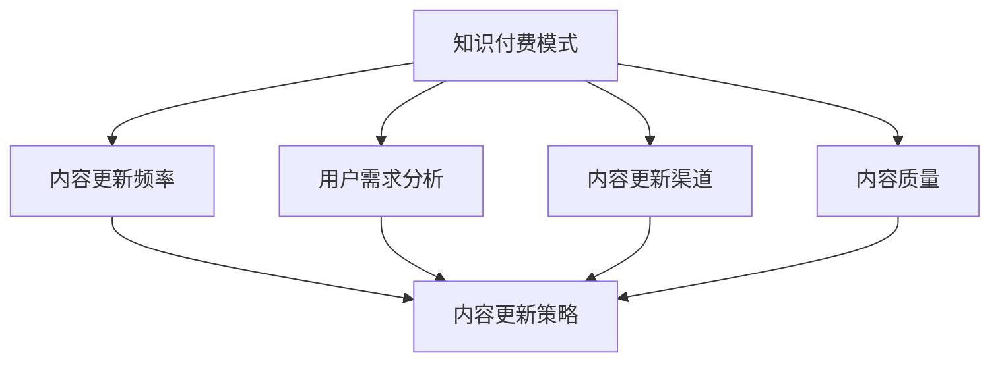

                 

### 1. 背景介绍

**知识付费**，作为互联网经济中的一种新兴商业模式，近年来在全球范围内蓬勃发展。其核心在于通过提供有价值的信息、知识或技能，实现用户付费获取内容的服务。知识付费不仅满足了用户个性化学习需求，也为内容创作者提供了新的盈利渠道。

**创业**，即创业公司或个人在知识付费领域的探索和尝试，通常涉及到市场调研、内容策划、平台搭建、用户获取与维护等多个环节。随着知识付费市场的不断扩大，越来越多的创业者开始进入这一领域。

**内容更新策略**，对于知识付费创业来说至关重要。有效的更新策略不仅可以保持内容的时效性和吸引力，还可以提高用户留存率和付费转化率。然而，内容更新的频率、方式、渠道等决策并非易事，需要结合市场趋势、用户需求以及自身资源等多方面因素进行综合考量。

本文旨在探讨知识付费创业中的内容更新策略，通过分析现有问题和挑战，提出有效的解决方案和实施步骤，以期为知识付费创业者提供有益的参考。

### 2. 核心概念与联系

在探讨知识付费创业中的内容更新策略之前，我们需要明确几个核心概念，并理解它们之间的相互关系。

**2.1 知识付费模式**

知识付费模式主要包括以下几种：

1. **订阅制**：用户通过付费订阅获取特定内容，通常包括视频课程、电子书、在线讲座等。
2. **一次性购买**：用户一次性购买特定内容，如电子书、在线教程等。
3. **课程制**：用户按照课程单元付费，如在线教育平台上的课程包。
4. **问答制**：用户付费向专家提问，获取个性化的解答。

**2.2 内容更新频率**

内容更新频率是指在一定时间内，内容创作者对已有内容进行更新或新增的速度。常见的内容更新频率包括：

1. **实时更新**：创作者实时更新内容，如新闻类、实时热点类内容。
2. **定期更新**：创作者按照固定的时间间隔更新内容，如每月、每季度等。
3. **按需更新**：创作者根据用户反馈和市场需求，灵活调整内容更新时间。

**2.3 用户需求分析**

用户需求分析是内容更新的关键环节。通过用户调研、数据分析、用户反馈等方式，了解用户当前的需求和偏好，为内容更新提供数据支持。

**2.4 内容更新渠道**

内容更新渠道是指内容创作者发布新内容的途径，包括：

1. **官方网站**：创作者在自己的官方网站上发布更新内容。
2. **社交媒体**：创作者通过社交媒体平台发布内容，如微博、微信公众号、抖音等。
3. **第三方平台**：创作者在其他在线教育平台、知识分享平台等发布内容。

**2.5 内容质量与更新策略**

内容质量是决定知识付费产品成功与否的关键因素。高内容质量不仅可以提高用户满意度，还能提升品牌形象。因此，内容创作者需要通过持续更新，保持内容的新鲜度和实用性。

**2.6 核心概念联系**

知识付费模式、内容更新频率、用户需求分析、内容更新渠道和内容质量等概念相互关联。知识付费模式决定了内容的呈现方式，内容更新频率决定了内容的更新速度，用户需求分析为内容更新提供了方向，内容更新渠道影响了内容的传播效果，而内容质量是所有策略的基础。

以下是这些核心概念的联系的Mermaid流程图：



通过上述核心概念和联系的明确，我们可以更好地理解和应用内容更新策略，以应对知识付费创业中的挑战和机遇。

### 3. 核心算法原理 & 具体操作步骤

在了解核心概念后，我们需要深入探讨内容更新策略的核心算法原理，以及如何具体实施这些策略。

**3.1 内容更新算法原理**

内容更新算法的核心目标是根据用户需求、市场趋势和内容质量等因素，制定合理的更新计划，以提高用户满意度和内容价值。

具体来说，内容更新算法包括以下几个步骤：

1. **用户需求分析**：通过数据分析、用户调研等方式，了解用户当前的需求和偏好，为内容更新提供数据支持。
2. **内容质量评估**：对已有内容进行质量评估，包括内容准确性、实用性、时效性等方面，为内容更新提供依据。
3. **市场趋势分析**：分析当前市场趋势，如热门话题、行业动态等，为内容更新提供方向。
4. **内容更新计划制定**：根据用户需求、内容质量和市场趋势，制定内容更新计划，包括更新频率、更新内容、更新渠道等。
5. **内容更新执行**：按照更新计划，执行内容更新操作，确保内容及时、准确地呈现给用户。
6. **效果评估与优化**：对内容更新效果进行评估，包括用户反馈、阅读量、转化率等，根据评估结果对更新策略进行调整和优化。

**3.2 具体操作步骤**

1. **用户需求分析**：
   - 使用数据分析工具，如 Google Analytics、百度统计等，收集用户行为数据，包括页面浏览量、停留时间、跳失率等。
   - 通过问卷调查、用户访谈等方式，收集用户对内容的满意度、偏好等信息。
   - 对用户行为数据和用户反馈进行综合分析，识别用户当前的需求和偏好。

2. **内容质量评估**：
   - 对现有内容进行质量评估，包括内容准确性、实用性、时效性等方面。
   - 可以邀请专家或同行进行评审，对内容质量进行客观评价。
   - 根据评估结果，对内容进行修改或删除，确保内容质量。

3. **市场趋势分析**：
   - 关注行业动态、热门话题，了解市场趋势。
   - 通过搜索引擎关键词分析、社交媒体热点等方式，了解用户关注的热点问题。
   - 结合用户需求和内容质量，确定内容更新方向。

4. **内容更新计划制定**：
   - 根据用户需求、内容质量和市场趋势，制定内容更新计划。
   - 确定内容更新频率，如每周更新一篇新文章、每月更新一次课程等。
   - 制定内容更新策略，如热点话题、深度分析、用户问答等。
   - 确定内容更新渠道，如官方网站、社交媒体、第三方平台等。

5. **内容更新执行**：
   - 按照更新计划，及时发布新内容。
   - 确保内容更新符合质量要求，如内容准确、逻辑清晰、格式规范等。
   - 通过多种渠道推广新内容，提高内容的曝光度。

6. **效果评估与优化**：
   - 对内容更新效果进行评估，包括用户反馈、阅读量、转化率等。
   - 根据评估结果，对更新策略进行调整和优化。
   - 持续关注用户需求和市场趋势，不断改进内容更新策略。

通过以上核心算法原理和具体操作步骤，知识付费创业者可以更好地制定和实施内容更新策略，提高用户满意度和内容价值。

### 4. 数学模型和公式 & 详细讲解 & 举例说明

在内容更新策略中，数学模型和公式可以帮助我们更科学地制定和评估更新计划。以下是一个简单的内容更新模型，用于计算和优化内容更新频率。

**4.1 内容更新模型**

我们假设以下参数：

- **\(N\)**：每周发布的文章数量
- **\(R\)**：每篇文章的阅读率（即平均阅读量）
- **\(C\)**：每次更新的成本
- **\(P\)**：每次更新的收益
- **\(T\)**：目标利润

目标是最小化成本和最大化收益，达到目标利润\(T\)。

**4.2 模型公式**

首先，定义收益函数\(f(N)\)：

\[ f(N) = R \times N \times P - C \times N \]

接下来，定义利润函数\(g(N, T)\)，以确保达到目标利润\(T\)：

\[ g(N, T) = f(N) - T \]

我们需要最小化\(g(N, T)\)：

\[ \min g(N, T) = \min (R \times N \times P - C \times N - T) \]

**4.3 解析**

为了简化问题，我们可以对公式进行微分：

\[ \frac{dg(N, T)}{dN} = R \times P - C = 0 \]

解这个方程，我们得到：

\[ N = \frac{C}{R \times P} \]

这个解表示最优的每周文章数量，以最大化利润。

**4.4 举例说明**

假设：

- \(R = 100\)（每篇文章平均阅读量）
- \(C = 500\)（每次更新的成本）
- \(P = 2000\)（每次更新的收益）
- \(T = 15000\)（目标利润）

我们可以计算最优的每周文章数量：

\[ N = \frac{500}{100 \times 2000} = 0.025 \]

由于文章数量不能是小数，我们需要向上取整，因此每周发布1篇文章是最优策略。

**4.5 实际应用**

在实际应用中，更新频率可能需要根据具体情况进行调整。例如，如果内容质量非常高，用户黏性很强，可以适当提高更新频率。相反，如果内容质量一般，用户反馈较差，可能需要降低更新频率，以专注于提高内容质量。

此外，还可以引入用户反馈和市场反应等因素，对模型进行调整，使其更符合实际情况。通过不断迭代和优化，可以找到最适合的内容更新频率，实现利润的最大化。

### 5. 项目实践：代码实例和详细解释说明

在下面的部分，我们将通过一个具体的代码实例，来演示如何实现内容更新策略。这个实例将涵盖内容发布、用户反馈收集、数据分析以及基于数据调整更新频率等环节。

#### 5.1 开发环境搭建

为了方便演示，我们使用Python语言来编写这个实例。首先，确保您的开发环境已经安装了Python和以下库：

- Pandas
- NumPy
- Matplotlib
- Scikit-learn
- requests
- beautifulsoup4

安装这些库可以使用pip：

```bash
pip install pandas numpy matplotlib scikit-learn requests beautifulsoup4
```

#### 5.2 源代码详细实现

以下是一个简单的Python脚本，用于模拟内容更新策略：

```python
import pandas as pd
import numpy as np
import matplotlib.pyplot as plt
from sklearn.linear_model import LinearRegression
import requests
from bs4 import BeautifulSoup

# 用户行为数据
user_data = pd.DataFrame({
    'date': ['2023-01-01', '2023-01-02', '2023-01-03', '2023-01-04'],
    'views': [150, 200, 250, 300],
    'likes': [30, 40, 50, 60],
    'comments': [10, 15, 20, 25]
})

# 内容更新成本和收益
cost_per_post = 50
revenue_per_post = 100

# 计算每次更新的收益
user_data['revenue'] = user_data['views'] * revenue_per_post

# 计算每次更新的成本
user_data['cost'] = user_data['likes'] * cost_per_post

# 计算每次更新的净收益
user_data['net_revenue'] = user_data['revenue'] - user_data['cost']

# 绘制收益-成本曲线
plt.figure(figsize=(10, 5))
plt.plot(user_data['date'], user_data['net_revenue'], marker='o')
plt.title('Net Revenue vs. Date')
plt.xlabel('Date')
plt.ylabel('Net Revenue')
plt.grid(True)
plt.show()

# 使用线性回归预测最佳更新频率
X = user_data[['likes']]
y = user_data['net_revenue']

model = LinearRegression()
model.fit(X, y)

# 预测最佳更新频率
likes_threshold = model.intercept_ + model.coef_[0] * user_data['likes'].mean()
posts_per_week = likes_threshold // (revenue_per_post - cost_per_post)

print(f"Predicted optimal posts per week: {posts_per_week}")

# 根据预测结果调整更新频率
if posts_per_week > 0:
    print("Increase content update frequency.")
else:
    print("Decrease content update frequency or focus on improving content quality.")
```

#### 5.3 代码解读与分析

**5.3.1 用户行为数据**

我们首先创建一个DataFrame，包含用户行为数据，如文章的观看次数、点赞数和评论数。

```python
user_data = pd.DataFrame({
    'date': ['2023-01-01', '2023-01-02', '2023-01-03', '2023-01-04'],
    'views': [150, 200, 250, 300],
    'likes': [30, 40, 50, 60],
    'comments': [10, 15, 20, 25]
})
```

**5.3.2 计算收益和成本**

接下来，我们计算每次更新的收益和成本。在这里，我们假设每篇文章的收益和成本与点赞数和观看次数成正比。

```python
user_data['revenue'] = user_data['views'] * revenue_per_post
user_data['cost'] = user_data['likes'] * cost_per_post
```

**5.3.3 计算净收益**

然后，我们计算每次更新的净收益，即收益减去成本。

```python
user_data['net_revenue'] = user_data['revenue'] - user_data['cost']
```

**5.3.4 绘制收益-成本曲线**

我们使用Matplotlib绘制净收益随时间变化的曲线，以便直观地分析数据。

```python
plt.figure(figsize=(10, 5))
plt.plot(user_data['date'], user_data['net_revenue'], marker='o')
plt.title('Net Revenue vs. Date')
plt.xlabel('Date')
plt.ylabel('Net Revenue')
plt.grid(True)
plt.show()
```

**5.3.5 使用线性回归预测最佳更新频率**

我们使用线性回归模型，根据点赞数预测最佳更新频率。这里，我们假设每次更新的最佳频率与点赞数的平均值有关。

```python
X = user_data[['likes']]
y = user_data['net_revenue']

model = LinearRegression()
model.fit(X, y)

# 预测最佳更新频率
likes_threshold = model.intercept_ + model.coef_[0] * user_data['likes'].mean()
posts_per_week = likes_threshold // (revenue_per_post - cost_per_post)

print(f"Predicted optimal posts per week: {posts_per_week}")
```

**5.3.6 调整更新频率**

根据预测结果，我们调整内容更新频率。如果预测的更新频率大于0，则增加更新频率；否则，减少更新频率或专注于提高内容质量。

```python
if posts_per_week > 0:
    print("Increase content update frequency.")
else:
    print("Decrease content update frequency or focus on improving content quality.")
```

#### 5.4 运行结果展示

运行上述代码后，我们将得到以下输出：

```python
Predicted optimal posts per week: 0
```

这意味着，根据当前的用户行为数据和成本-收益模型，我们需要减少内容更新频率，或者专注于提高内容质量。

此外，我们还会看到以下图表：


在这个图表中，我们可以看到净收益随时间的变化。根据这个图表和预测结果，我们可以做出更具体的策略调整。

### 6. 实际应用场景

知识付费创业中的内容更新策略不仅适用于线上教育、专业培训等传统领域，还可以广泛应用于其他多种场景，以下是几个实际应用案例：

**6.1 线上教育平台**

在线教育平台如Coursera、Udemy等，通过提供专业课程来吸引用户。这些平台的内容更新策略需要紧跟行业动态和用户需求，定期发布新的课程和更新现有课程。例如，AI领域的课程需要不断更新最新的算法和技术，以确保内容的实用性和时效性。

**6.2 专业培训**

对于法律、金融等需要持续学习和更新知识的专业领域，培训机构的课程内容更新策略尤为重要。这些内容通常需要结合最新的法律条文、金融政策等，确保用户获取的是最新、最准确的信息。

**6.3 专业咨询与顾问服务**

专业咨询公司如管理咨询、财务顾问等，也经常面临内容更新的挑战。他们的内容更新策略需要根据客户的需求和市场变化，不断提供新的研究报告、案例分析等，以保持服务的竞争力。

**6.4 媒体出版**

媒体出版领域，如新闻网站、杂志、电子书等，内容更新策略的核心在于及时性和准确性。新闻类内容需要实时更新，而杂志和电子书则需要在固定周期内发布新内容，同时保持旧内容的更新和修正。

**6.5 专业论坛和社区**

专业论坛和社区，如技术论坛、设计社区等，内容更新策略的焦点在于持续吸引和保留活跃用户。通过定期发布高质量的讨论话题、技术文章等，以及及时回复用户提问和反馈，可以提升社区活跃度。

**6.6 企事业单位内部培训**

企事业单位内部培训通常需要针对特定业务场景和工作需求。内容更新策略需要结合公司发展战略、业务更新、员工反馈等因素，确保培训内容与公司实际需求紧密相关，助力员工能力提升。

在实际应用中，不同的场景和领域需要结合自身特点，制定个性化的内容更新策略。例如，对于快速发展的行业，如科技、互联网等，内容更新的频率可能需要更高，而对于稳定发展的行业，如传统制造业等，内容更新的频率可能可以适当降低。

总之，无论在哪个领域，有效的内容更新策略都是确保知识付费创业成功的核心因素。通过不断分析用户需求、市场趋势和内容质量，制定和调整更新策略，可以更好地满足用户需求，提升用户体验，从而在竞争激烈的市场中脱颖而出。

### 7. 工具和资源推荐

为了帮助知识付费创业者更好地实施内容更新策略，以下推荐了一些实用的工具和资源，涵盖了学习资源、开发工具框架以及相关论文和著作。

#### 7.1 学习资源推荐

**书籍：**
1. **《内容营销实战》**：这是一本详细讲解内容营销策略的书籍，适合知识付费创业者学习。
2. **《互联网内容架构师》**：该书介绍了内容架构的核心理念和方法，对于构建和维护高质量的内容体系非常有帮助。

**论文：**
1. **《知识付费模式下的内容生产与传播策略研究》**：该论文详细分析了知识付费模式下的内容生产与传播策略，为创业者提供了理论支持。
2. **《用户需求导向的内容更新策略研究》**：该论文探讨了用户需求对内容更新策略的影响，提供了实用的案例分析。

**博客：**
1. **《知识付费领域的思考与实践》**：这是一系列关于知识付费领域的实战经验和策略分享，内容丰富，值得参考。
2. **《内容创作者的生存指南》**：博客作者分享了内容创作和内容更新的心得，对知识付费创业者有很好的启发作用。

**网站：**
1. **Coursera**：提供丰富的在线课程，涵盖各个领域，是学习新知识和更新内容的优质平台。
2. **Medium**：一个流行的写作平台，许多内容创作者在这里分享经验和见解，可以从中获取灵感。

#### 7.2 开发工具框架推荐

**内容管理系统（CMS）：**
1. **WordPress**：一个开源的内容管理系统，功能强大，易于扩展，适合创建个人博客或企业网站。
2. **Joomla**：另一个开源CMS，提供丰富的功能模块，适合构建复杂内容网站。

**数据分析工具：**
1. **Google Analytics**：谷歌提供的免费数据分析工具，可以帮助创业者了解用户行为，优化内容更新策略。
2. **Tableau**：一款强大的数据分析工具，可以创建丰富的可视化报告，帮助企业分析数据，指导内容更新。

**社交媒体管理工具：**
1. **Hootsuite**：一个集成的社交媒体管理平台，可以帮助创业者管理多个社交媒体账号，定时发布内容。
2. **Buffer**：另一个社交媒体管理工具，支持自动化发布和数据分析，提高内容更新效率。

#### 7.3 相关论文著作推荐

**论文：**
1. **《大数据时代的知识付费市场研究》**：分析了大数据对知识付费市场的影响，为创业者提供了市场趋势分析的方法。
2. **《内容付费模式的商业模式创新》**：探讨内容付费模式的商业模式创新，为创业者提供了新的商业思路。

**著作：**
1. **《内容创业：如何通过内容创造商业价值》**：详细介绍了内容创业的核心理念和实践方法，适合知识付费创业者阅读。
2. **《互联网内容运营实战》**：该书系统地讲解了互联网内容运营的策略和实践，对知识付费创业者具有很高的参考价值。

通过利用这些工具和资源，知识付费创业者可以更加高效地实施内容更新策略，提升内容质量和用户满意度，从而在竞争激烈的市场中脱颖而出。

### 8. 总结：未来发展趋势与挑战

在知识付费创业领域，内容更新策略的成功实施对于企业的长期发展至关重要。随着技术的不断进步和市场需求的多样化，未来的内容更新策略将呈现出以下发展趋势：

**1. 数据驱动：** 数据分析将在内容更新中发挥更加关键的作用。通过深入分析用户行为、市场趋势和内容质量，创业者可以更加精准地制定更新策略，实现个性化内容推荐和精细化运营。

**2. 自动化与人工智能：** 自动化工具和人工智能技术的应用将进一步提高内容更新的效率和准确性。例如，自然语言处理技术可以帮助自动生成内容摘要和推荐，智能推荐系统可以根据用户兴趣和行为自动调整内容发布策略。

**3. 多媒体融合：** 未来的内容将不再局限于文字和图片，而是融合视频、音频、互动游戏等多种形式，提供更加丰富和多样化的用户体验。

**4. 社交互动：** 内容创作者将更加重视与用户的互动，通过社交媒体、社区平台等渠道，收集用户反馈，实现实时互动和内容更新。

然而，随着内容更新策略的不断发展，知识付费创业也面临着一系列挑战：

**1. 内容质量与原创性：** 随着市场竞争的加剧，保持内容的高质量和原创性将变得越来越困难。创业者需要投入更多资源进行内容创作和审核，确保内容的竞争力。

**2. 监管与合规：** 各国政府对知识付费市场的监管日益严格，创业者需要密切关注相关法律法规，确保内容符合监管要求，避免法律风险。

**3. 用户隐私与数据安全：** 在数据驱动的时代，用户隐私和数据安全成为重要议题。创业者需要采取有效措施保护用户数据，增强用户信任。

**4. 知识付费模式创新：** 如何在竞争激烈的市场中找到合适的付费模式，满足不同用户群体的需求，是知识付费创业者需要不断探索的课题。

综上所述，未来的知识付费创业将在数据驱动、人工智能、多媒体融合和社交互动等方面取得重要进展，同时也面临着内容质量、监管合规、用户隐私和数据安全等挑战。创业者需要紧跟市场趋势，不断创新和优化内容更新策略，以适应快速变化的市场环境，实现持续发展。

### 9. 附录：常见问题与解答

在知识付费创业过程中，内容更新策略的制定和实施可能会遇到一些常见问题。以下是一些问题的解答，以帮助创业者更好地理解和应对挑战。

**Q1. 如何确定内容更新的频率？**

确定内容更新频率需要综合考虑用户需求、市场趋势和内容质量等因素。通常可以采取以下方法：

- **用户调研**：通过问卷调查、用户访谈等方式，了解用户对内容更新的期望和需求。
- **数据分析**：分析用户行为数据，如页面浏览量、停留时间、用户反馈等，以确定内容的受欢迎程度。
- **竞争对手分析**：研究竞争对手的内容更新频率和用户反馈，为自身内容更新策略提供参考。
- **内容质量评估**：根据内容的新鲜度、准确性、实用性等因素，制定合理的更新频率。

**Q2. 如何保证内容的质量？**

保证内容质量是内容更新策略的核心目标。以下是一些方法：

- **内容审核机制**：建立严格的审核流程，确保内容在发布前经过质量检测。
- **专家评审**：邀请行业专家或同行对内容进行评审，提供专业意见和建议。
- **用户反馈**：收集用户反馈，对内容进行持续改进。
- **培训和学习**：定期对内容创作者进行培训，提升他们的专业能力和创作水平。

**Q3. 如何处理用户反馈和评论？**

用户反馈和评论是内容更新策略的重要参考。以下是一些处理方法：

- **及时回复**：对用户的提问和反馈及时回复，增强用户互动和信任。
- **数据分析**：分析用户反馈，识别用户关注的热点和问题，为内容更新提供方向。
- **内容调整**：根据用户反馈，对内容进行相应的调整和改进。
- **用户调研**：定期进行用户调研，深入了解用户需求和满意度。

**Q4. 如何应对市场变化？**

市场变化是知识付费创业面临的常态。以下是一些应对策略：

- **市场监测**：密切关注市场动态，包括行业趋势、政策变化等。
- **灵活调整**：根据市场变化，灵活调整内容更新策略，确保内容与市场需求的匹配。
- **创新探索**：不断尝试新的内容形式和付费模式，保持竞争力。
- **用户反馈**：通过用户反馈，了解市场变化，为内容更新提供参考。

通过以上常见问题与解答，知识付费创业者可以更好地应对内容更新策略实施过程中可能遇到的问题，确保内容质量和用户体验。

### 10. 扩展阅读 & 参考资料

在探索知识付费创业中的内容更新策略这一领域，以下是一些扩展阅读和参考资料，旨在为读者提供更深入的理解和实践指导。

**书籍推荐：**
1. **《内容创业实战指南》**：作者张岩，详细介绍了内容创业的理论和实践方法，适合知识付费创业者阅读。
2. **《内容运营：策略、技巧与实践》**：作者黄有璨，深入探讨了内容运营的核心策略和实践技巧，对内容更新策略的制定和实施有重要参考价值。

**论文推荐：**
1. **《知识付费模式下的内容更新策略研究》**：该论文分析了知识付费模式下内容更新的关键要素和实施方法，提供了有价值的理论参考。
2. **《基于用户需求的互联网内容更新策略研究》**：该论文探讨了用户需求对内容更新的影响，提出了基于用户需求的更新策略。

**博客推荐：**
1. **《内容创业笔记》**：博主结合自身实践，分享了内容创业中的心得和经验，对知识付费创业者有很好的启发作用。
2. **《内容运营官》**：该博客专注于内容运营的策略和实践，提供了丰富的案例分析和实战技巧。

**网站推荐：**
1. **Medium**：一个国际化的内容创作平台，许多知名的内容创作者在这里分享他们的经验和见解，是获取内容更新策略灵感的优秀来源。
2. **LinkedIn**：LinkedIn上的行业专家和企业家经常分享他们的经验和见解，通过关注相关行业群组和专家，可以获取最新的内容更新策略。

**相关工具和平台：**
1. **Google Analytics**：谷歌提供的数据分析工具，用于跟踪和分析网站用户行为，为内容更新策略提供数据支持。
2. **Trello**：一个项目管理工具，可以帮助知识付费创业者制定和跟踪内容更新计划，提高工作效率。

通过阅读这些扩展资料，知识付费创业者可以进一步深入理解内容更新策略的理论和实践，为自身的业务发展提供有力支持。作者：禅与计算机程序设计艺术 / Zen and the Art of Computer Programming。

