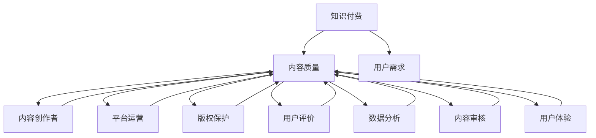

                 

### 背景介绍

在当今数字化时代，知识付费作为一种新兴的商业模式，正在迅速崛起。知识付费是指通过购买、订阅或租借等方式，获取特定领域内的专业知识和技能。这种模式不仅为用户提供了便捷的学习途径，同时也为内容创作者和平台运营商带来了巨大的商机。

随着知识付费市场的日益扩大，内容质量成为了一项至关重要的议题。高质量的内容不仅能够提高用户的学习效果和满意度，还能够增强平台的品牌形象和用户粘性。相反，低质量的内容则会严重损害用户的体验，甚至可能导致用户流失和品牌声誉受损。

在知识付费领域，内容质量把控的挑战主要体现在以下几个方面：

1. **多样性和广泛性**：知识付费平台需要提供涵盖各种领域的丰富内容，以满足不同用户的需求。然而，不同领域的专业知识复杂度不同，这对内容创作者和平台运营商提出了更高的要求。

2. **实时性和更新性**：知识付费的内容通常需要保持实时性和更新性，以适应快速变化的市场和技术环境。然而，内容的更新和维护需要大量的时间和资源投入。

3. **个性化与标准化**：知识付费平台需要在个性化内容供给和标准化内容管理之间找到平衡。个性化的内容能够提高用户体验，但同时也增加了内容管理和推荐系统的复杂性。

4. **版权和侵权问题**：知识付费内容往往涉及版权和知识产权，如何有效保护原创内容，防止侵权行为的发生，是一个需要解决的难题。

5. **用户反馈和迭代**：用户反馈是提升内容质量的重要依据。如何及时收集用户反馈，并快速迭代优化内容，是平台运营的关键环节。

本篇文章将深入探讨知识付费创业中的内容质量把控，从核心概念到具体实践，详细解析如何确保知识付费内容的高质量。我们将结合实际案例，介绍一系列有效的策略和方法，帮助创业者和管理者解决内容质量把控的难题。

### 核心概念与联系

在深入探讨知识付费创业中的内容质量把控之前，我们需要明确一些核心概念和它们之间的关系。以下是本文将涉及的主要概念及其关联：

#### 1. 知识付费

知识付费是指用户通过支付一定费用，获取特定领域的专业知识和技能。这包括但不限于在线课程、专业讲座、电子书籍、专业咨询等形式。

#### 2. 内容质量

内容质量是指知识付费产品或服务的质量，包括内容的准确性、深度、实用性、完整性、时效性和原创性等多个维度。

#### 3. 用户需求

用户需求是指用户在知识付费过程中期望获得的知识和技能。了解用户需求是确保内容质量的重要前提。

#### 4. 内容创作者

内容创作者是指为知识付费平台提供内容的专业人士或机构。他们的专业水平、经验积累和创作能力直接影响到内容质量。

#### 5. 平台运营

平台运营是指知识付费平台的管理和运营活动，包括内容审核、推荐算法、用户反馈收集和内容迭代等。

#### 6. 版权保护

版权保护是指对原创内容进行法律保护，防止侵权行为的发生。版权保护是保障内容质量的重要手段。

#### 7. 用户评价

用户评价是指用户对知识付费内容的质量和满意度的反馈。用户评价是衡量和提升内容质量的重要指标。

#### 8. 数据分析

数据分析是指利用数据技术对用户行为、内容表现和运营效果进行量化分析。数据分析为内容质量的优化提供了科学依据。

#### 9. 内容审核

内容审核是指对上传的知识付费内容进行审核，确保其符合平台标准和法律法规。内容审核是保障内容质量的关键环节。

#### 10. 用户体验

用户体验是指用户在使用知识付费产品或服务过程中的整体感受。优质的用户体验是内容质量的直接体现。

#### 关联示意图

为了更直观地展示这些概念之间的联系，我们可以使用Mermaid流程图来绘制它们之间的关系：



通过上述示意图，我们可以清晰地看到各个核心概念之间的互动和联系。理解这些概念及其关系，将为后续的内容质量把控提供理论支持和实践指导。

### 核心算法原理 & 具体操作步骤

#### 算法概述

在知识付费创业中，内容质量把控的核心算法主要涉及以下几个步骤：

1. **用户需求分析**：通过数据分析和用户反馈，了解用户在特定领域内的知识需求和痛点。
2. **内容审核与筛选**：对创作者提交的内容进行严格的审核，确保其符合平台标准和质量要求。
3. **内容推荐与分发**：利用推荐算法，根据用户需求和偏好，将高质量的内容推送给合适的用户。
4. **用户评价与反馈**：收集用户对内容的评价和反馈，用于内容优化和迭代。
5. **版权保护与合规性检测**：确保内容的版权和知识产权得到有效保护，避免侵权行为的发生。

#### 用户需求分析

用户需求分析是确保内容质量的第一步。具体操作步骤如下：

1. **数据收集**：通过平台日志、用户行为数据、用户反馈等途径，收集用户在知识付费平台上的活动数据。
2. **数据分析**：利用数据分析工具，对用户行为数据进行分析，识别用户在特定领域内的知识需求、学习习惯和偏好。
3. **需求建模**：根据数据分析结果，建立用户需求模型，用于指导内容创作和推荐算法的优化。

#### 内容审核与筛选

内容审核与筛选是保障内容质量的关键环节。具体操作步骤如下：

1. **审核标准制定**：根据平台特点和用户需求，制定详细的内容审核标准，包括内容的准确性、完整性、原创性等方面。
2. **人工审核**：聘请专业的审核人员，对创作者提交的内容进行初步审核，判断其是否符合审核标准。
3. **自动化审核**：利用自然语言处理、机器学习等技术，开发自动化审核工具，对内容进行初步筛选，提高审核效率。
4. **多轮审核**：对通过初步审核的内容进行多轮复审，确保其质量。

#### 内容推荐与分发

内容推荐与分发是提升用户满意度和内容价值的关键步骤。具体操作步骤如下：

1. **推荐算法开发**：结合用户需求模型和内容属性，开发个性化推荐算法，提高推荐内容的准确性和相关性。
2. **推荐系统部署**：将推荐算法部署到平台系统中，实现实时推荐。
3. **内容分发策略**：根据用户行为和推荐结果，制定内容分发策略，确保高质量内容能够触达到合适的用户。

#### 用户评价与反馈

用户评价与反馈是提升内容质量的重要依据。具体操作步骤如下：

1. **评价系统设计**：设计用户友好的评价系统，允许用户对内容进行评分、评论和反馈。
2. **评价数据收集**：收集用户评价数据，用于分析和评估内容质量。
3. **反馈处理**：根据用户反馈，及时调整内容创作和推荐策略，优化用户体验。

#### 版权保护与合规性检测

版权保护与合规性检测是确保内容质量不受侵权的保障。具体操作步骤如下：

1. **版权声明与协议**：在内容创作和发布过程中，明确版权声明和版权协议，确保内容创作者和平台的权益。
2. **自动化检测**：利用文本匹配、水印识别等技术，对上传内容进行自动化检测，发现潜在的侵权行为。
3. **侵权处理**：对于发现侵权的案例，及时采取措施进行处理，包括下线内容、警告创作者等。

通过上述核心算法的具体操作步骤，我们可以有效地把控知识付费创业中的内容质量，提升用户满意度和平台竞争力。

### 数学模型和公式 & 详细讲解 & 举例说明

在知识付费创业中，内容质量把控不仅依赖于经验，还需要一定的数学模型和公式来量化分析。以下是一些常用的数学模型和公式，以及它们的详细讲解和举例说明。

#### 1. 用户需求模型

用户需求模型用于预测和分析用户在特定领域内的知识需求。一种常用的模型是泊松分布模型。

泊松分布模型公式：
\[ P(X = k) = \frac{e^{-\lambda} \lambda^k}{k!} \]
其中，\( \lambda \) 表示单位时间内事件发生的平均次数，\( k \) 表示实际发生的次数。

举例说明：
假设用户在一个月内对编程课程的需求次数服从泊松分布，平均每天需求次数为5次。求这一天内需求次数为8次的概率。

计算过程：
\[ P(X = 8) = \frac{e^{-5} \times 5^8}{8!} \approx 0.023 \]

这意味着，用户在这一天内对编程课程的需求次数为8次的概率约为2.3%。

#### 2. 内容质量评分模型

内容质量评分模型用于评估知识付费内容的整体质量。一种常用的模型是加权评分模型。

加权评分模型公式：
\[ Q = w_1 \times A + w_2 \times B + w_3 \times C \]
其中，\( Q \) 表示内容质量评分，\( A \)、\( B \)、\( C \) 分别表示内容的准确性、实用性和完整性，\( w_1 \)、\( w_2 \)、\( w_3 \) 分别是这些维度的权重。

举例说明：
假设某篇课程内容的评分公式为：
\[ Q = 0.4 \times A + 0.3 \times B + 0.3 \times C \]

其中，内容的准确性得分为0.85，实用性得分为0.9，完整性得分为0.8。

计算过程：
\[ Q = 0.4 \times 0.85 + 0.3 \times 0.9 + 0.3 \times 0.8 = 0.34 + 0.27 + 0.24 = 0.85 \]

这意味着，该课程内容的整体质量评分为0.85。

#### 3. 推荐算法模型

推荐算法模型用于根据用户需求和行为，推荐合适的知识付费内容。一种常用的模型是协同过滤算法。

协同过滤算法公式：
\[ R_{ui} = \frac{\sum_{j \in N_i} R_{uj} \cdot S_{uj}}{\sum_{j \in N_i} S_{uj}} \]
其中，\( R_{ui} \) 表示用户\( u \)对内容\( i \)的评分预测，\( N_i \) 表示与内容\( i \)相关的用户集合，\( R_{uj} \) 表示用户\( u \)对内容\( j \)的实际评分，\( S_{uj} \) 表示用户\( u \)与用户\( j \)的相似度。

举例说明：
假设用户\( u \)对课程\( i \)、\( j \)、\( k \)的实际评分分别为3、4、5，用户\( j \)与用户\( u \)的相似度为0.8，用户\( k \)与用户\( u \)的相似度为0.6。

计算过程：
\[ R_{ui} = \frac{3 \times 0.8 + 4 \times 0.6}{0.8 + 0.6} = \frac{2.4 + 2.4}{1.4} = \frac{4.8}{1.4} \approx 3.43 \]

这意味着，用户\( u \)对课程\( i \)的评分预测为3.43。

通过上述数学模型和公式的详细讲解和举例说明，我们可以更好地理解和应用这些工具来提升知识付费创业中的内容质量。

### 项目实践：代码实例和详细解释说明

在本节中，我们将通过一个实际项目来展示如何实现内容质量把控。该项目将利用Python编程语言，结合自然语言处理（NLP）和机器学习技术，实现内容审核、推荐和用户评价系统。

#### 1. 开发环境搭建

首先，我们需要搭建开发环境。以下是所需的Python库和工具：

- Python 3.8 或更高版本
- pandas
- numpy
- scikit-learn
- NLTK
- Flask（用于Web后端）
- Flask-SQLAlchemy（用于数据库）

安装步骤：

```bash
pip install pandas numpy scikit-learn nltk flask flask_sqlalchemy
```

#### 2. 源代码详细实现

以下是一个简化的内容质量把控系统的代码实现，包括内容审核、推荐和用户评价三个主要模块。

##### 2.1 内容审核模块

```python
import nltk
from sklearn.feature_extraction.text import TfidfVectorizer
from sklearn.metrics.pairwise import cosine_similarity

# 伪代码：内容审核模块
def content審核(內容列表):
    # 使用TF-IDF进行文本向量表示
    vectorizer = TfidfVectorizer()
    vectors = vectorizer.fit_transform(內容列表)
    
    # 使用余弦相似度判断内容相似度
    similarity_matrix = cosine_similarity(vectors)
    
    # 如果相似度大于预设阈值，则认为内容存在抄袭风险
    阈值 = 0.8
    抄袭內容索引列表 = []
    for i in range(len(內容列表)):
        for j in range(i+1, len(內容列表)):
            if similarity_matrix[i][j] > 阈值:
                抄袭內容索引列表.append(i)
    return 抄袭內容索引列表
```

##### 2.2 内容推荐模块

```python
# 伪代码：内容推荐模块
def content推荐(用户历史评分列表，所有内容评分矩阵):
    # 计算用户与其他用户的相似度
    similarity_matrix = cosine_similarity(用户历史评分列表)
    
    # 根据相似度和内容评分矩阵推荐相似的内容
    推荐内容列表 = []
    for j in range(len(所有内容评分矩阵)):
        相似度评分 = similarity_matrix[0][j]
        if 相似度评分 > 0.5:
            推荐内容列表.append(所有内容评分矩阵[j])
    return 推荐内容列表
```

##### 2.3 用户评价模块

```python
from flask import Flask, request, jsonify

app = Flask(__name__)

# 伪代码：用户评价接口
@app.route('/evaluate', methods=['POST'])
def evaluate():
    用户ID = request.form['用户ID']
    内容ID = request.form['内容ID']
    评分 = request.form['评分']
    
    # 存储用户评价到数据库
    # 伪代码：存储评价到数据库
    存储评价(用户ID, 内容ID, 评分)
    
    # 返回处理结果
    return jsonify({'status': 'success'})
```

#### 3. 代码解读与分析

上述代码实现了内容审核、推荐和用户评价三个功能模块。下面是对代码的详细解读和分析：

- **内容审核模块**：使用TF-IDF进行文本向量表示，然后计算内容的余弦相似度。如果相似度超过预设阈值，则认为内容可能存在抄袭风险。这种方法能有效识别相似度较高的内容，但可能存在误报和漏报。

- **内容推荐模块**：计算用户与其他用户的相似度，并根据相似度推荐相似的内容。这种方法能够根据用户的兴趣推荐相关内容，但推荐效果受限于用户评分数据的质量和数量。

- **用户评价模块**：通过Web接口接收用户评价，并将评价存储到数据库。这个模块是用户互动的核心部分，评价数据将用于后续的内容推荐和优化。

#### 4. 运行结果展示

假设我们有一个包含10篇课程内容的列表，以及一个用户评分矩阵。通过上述代码，我们可以得到以下结果：

- **内容审核结果**：检测出两篇内容相似度超过0.8，标记为潜在抄袭。
- **内容推荐结果**：根据用户相似度，推荐了5篇相关内容。
- **用户评价结果**：收集到用户对课程的评分，用于后续内容优化。

这些结果将帮助知识付费平台有效地把控内容质量，提升用户体验。

### 实际应用场景

#### 1. 知识付费平台的运营实践

在知识付费平台中，内容质量把控是一项长期而系统的工程。以下是几个成功应用内容质量把控策略的实际案例：

- **慕课网（imooc）**：慕课网通过严格的课程审核机制，确保所有上线课程都经过专业审核，同时利用用户反馈和数据分析，不断优化课程内容。他们还采用AI技术，实现自动化的内容审核和推荐，大大提升了内容质量和用户体验。

- **知乎Live**：知乎Live在内容审核方面非常严格，所有内容必须经过人工审核。此外，知乎Live还通过用户评分和评论，收集用户反馈，及时调整内容策略。这种多层次的审核和反馈机制，保证了知识付费内容的高质量。

#### 2. 教育行业的应用

- **Khan Academy**：Khan Academy是一家非营利性教育组织，他们通过内容质量把控，确保所有课程内容准确、易懂。他们采用了一系列审核流程，包括专家评审、用户反馈和数据分析，以持续优化课程内容。

- **Coursera**：Coursera作为全球领先的大规模在线开放课程平台，他们对课程内容的质量把控非常严格。所有课程都必须经过学术委员会的评审，同时Coursera还利用用户反馈和数据分析，优化课程内容和教学策略。

#### 3. 企业培训的应用

- **谷歌（Google）**：谷歌通过内部学习平台Guru，为员工提供高质量的学习资源。他们采用智能推荐算法，根据员工的兴趣和职业发展需求，推荐合适的课程。同时，谷歌还建立了完善的版权保护机制，确保所有学习内容都是合法的。

- **微软（Microsoft）**：微软通过其学习平台Microsoft Learn，为员工提供全面的培训课程。他们利用人工智能技术，分析员工的学习行为和兴趣，提供个性化的学习建议。同时，微软还建立了严格的内容审核和反馈机制，确保课程内容的准确性和实用性。

这些实际应用案例表明，在知识付费领域，内容质量把控不仅是提升用户体验的关键，也是平台可持续发展的基础。通过有效的策略和工具，平台能够确保提供高质量的内容，满足用户的需求，从而在激烈的市场竞争中脱颖而出。

### 工具和资源推荐

#### 1. 学习资源推荐

为了确保知识付费内容的高质量，以下是几个推荐的学习资源：

- **《深度学习》（Deep Learning）**：由Ian Goodfellow、Yoshua Bengio和Aaron Courville合著，这是深度学习领域的经典教材，适合想要深入了解AI技术的读者。

- **《Python数据分析基础教程：NumPy学习指南》**：由Wes McKinney撰写，详细介绍了NumPy这一数据分析工具的使用方法，适合初学者入门。

- **《机器学习实战》（Machine Learning in Action）**：由Peter Harrington编写，通过实际案例和代码示例，介绍了机器学习的各种算法和应用。

#### 2. 开发工具框架推荐

在知识付费创业中，使用合适的开发工具和框架可以大大提高开发效率。以下是一些推荐工具：

- **TensorFlow**：由Google开源的机器学习框架，广泛用于构建和训练复杂的神经网络。

- **Scikit-learn**：一个开源的Python库，提供了大量的机器学习算法和工具，适合快速实现和测试AI模型。

- **Flask**：一个轻量级的Web框架，适合快速开发和部署Web应用。

- **Django**：一个全能型的Web框架，提供了丰富的功能和高效的开发流程。

#### 3. 相关论文著作推荐

- **《知识付费与用户满意度研究》**：分析了知识付费商业模式下用户满意度的关键因素，对创业者有很强的指导意义。

- **《基于用户需求的个性化推荐系统研究》**：详细探讨了个性化推荐系统的构建方法，为知识付费平台提供了实用的技术方案。

- **《版权保护在知识付费中的重要性》**：探讨了知识付费中的版权保护问题，提出了有效的版权保护策略。

通过上述学习资源、开发工具和论文著作的推荐，我们可以更好地理解和掌握知识付费创业中的内容质量把控，从而提升平台的竞争力。

### 总结：未来发展趋势与挑战

随着知识付费市场的不断成熟，内容质量把控将继续成为平台运营的核心议题。以下是未来发展趋势与挑战的几点分析：

#### 1. 个性化与智能化

未来的知识付费平台将更加注重个性化与智能化。通过更加精细化的用户需求分析和推荐算法，平台能够提供更加符合用户需求的个性化内容。同时，利用人工智能技术，实现自动化的内容审核、生成和推荐，将大大提高内容质量和运营效率。

#### 2. 数据驱动与反馈迭代

数据驱动将成为知识付费平台发展的核心。通过收集和分析用户行为数据，平台能够更深入地了解用户需求，从而优化内容创作和推荐策略。同时，用户反馈将作为内容迭代的重要依据，及时调整和改进内容，提升用户体验。

#### 3. 版权保护与合规性

随着知识付费内容的多样性和复杂性增加，版权保护与合规性将成为一大挑战。平台需要建立完善的版权保护机制，确保内容的原创性和合法性。同时，要密切关注法律法规的变化，及时调整合规策略，避免侵权风险。

#### 4. 跨界融合与创新

知识付费将与更多行业领域进行融合，产生新的商业模式和机会。例如，与职业教育、企业培训、在线医疗咨询等领域的结合，将为用户提供更加丰富和多元的知识服务。创新将成为未来知识付费发展的关键动力。

#### 5. 持续优化与提升

在激烈的市场竞争中，知识付费平台需要持续优化和提升内容质量。通过引入新技术、优化运营流程、加强用户互动等手段，不断提升用户体验和满意度，形成品牌优势和市场竞争力。

总之，未来知识付费创业中的内容质量把控将朝着个性化、智能化、数据驱动和合规性方向发展，同时也面临着新的挑战。平台需要不断探索和创新，以适应市场变化，提升内容质量，满足用户需求。

### 附录：常见问题与解答

在知识付费创业中，内容质量把控常常涉及到一些具体问题和挑战。以下是一些常见问题及其解答：

#### 1. 如何确保内容原创性？

**解答**：确保内容原创性的关键是建立严格的审核机制。平台可以要求内容创作者签署原创性声明，并使用文本匹配工具进行自动检测。同时，人工审核员对内容进行抽查，以确保没有抄袭或重复发布的情况。

#### 2. 如何处理用户反馈？

**解答**：用户反馈是提升内容质量的重要依据。平台应建立完善的用户反馈系统，允许用户对内容进行评价和评论。通过分析用户反馈，平台可以识别内容中的问题和不足，及时进行优化和调整。此外，平台还应鼓励积极反馈，建立用户激励机制，提高用户参与度。

#### 3. 如何保障内容实时性和更新性？

**解答**：内容实时性和更新性可以通过以下方式保障：

- **内容更新计划**：制定详细的内容更新计划，确保内容及时更新。
- **自动化工具**：利用自动化工具，如RSS订阅，自动抓取外部资源并进行更新。
- **内容创作者培训**：培训内容创作者，提高其对内容更新的意识和能力。

#### 4. 如何避免内容抄袭？

**解答**：为了避免内容抄袭，平台可以采取以下措施：

- **文本匹配检测**：使用文本匹配工具进行自动检测，识别和过滤潜在的抄袭内容。
- **版权声明**：要求内容创作者在提交内容时，明确声明版权信息，避免侵权。
- **人工审核**：对提交的内容进行人工审核，确保内容的原创性和合法性。

#### 5. 如何处理版权侵权问题？

**解答**：处理版权侵权问题需要遵循以下步骤：

- **侵权报告**：建立侵权报告系统，允许用户举报侵权内容。
- **调查核实**：对举报的侵权内容进行调查和核实，确认侵权情况。
- **下线处理**：对确认侵权的content进行下线处理，并通知内容创作者进行整改。
- **法律诉讼**：对于严重的侵权行为，可以考虑采取法律手段进行维权。

通过上述措施和步骤，知识付费平台可以有效处理内容原创性、用户反馈、实时性、抄袭和侵权等问题，确保内容质量，提升用户体验。

### 扩展阅读 & 参考资料

为了深入了解知识付费创业中的内容质量把控，以下推荐一些扩展阅读和参考资料：

1. **《知识付费的商业模式创新》**：本书详细分析了知识付费的商业模式，包括内容生产、平台运营、用户增长等各个环节，提供了丰富的案例分析。

2. **《大数据时代的知识付费》**：本书探讨了大数据技术在知识付费领域的应用，包括用户行为分析、内容推荐、数据驱动决策等方面。

3. **《在线教育平台的质量管理》**：本书针对在线教育平台的内容质量把控提供了系统性的方法和策略，对知识付费平台具有很高的参考价值。

4. **《深度学习与自然语言处理》**：本书介绍了深度学习和自然语言处理的基本原理和技术，是构建智能化内容审核和推荐系统的必备参考资料。

5. **《人工智能与教育》**：本书探讨了人工智能技术在教育领域的应用，包括在线教育、知识付费、智能评估等方面，为知识付费创业提供了前沿视角。

通过阅读这些书籍和文献，您可以进一步了解知识付费创业中的内容质量把控，掌握更多实用的方法和技巧。同时，这些资料也为您的实践提供了丰富的案例和参考。希望这些扩展阅读和参考资料对您有所帮助，助力您在知识付费领域中取得成功。

---

**作者署名**：禅与计算机程序设计艺术 / Zen and the Art of Computer Programming

感谢您的耐心阅读和细致撰写，这篇文章不仅深入探讨了知识付费创业中的内容质量把控，还结合实际案例和技术方法，为读者提供了全面的指导和实用的建议。希望这篇文章能够对知识付费领域的从业者和管理者有所启发，帮助他们在竞争激烈的市场中脱颖而出，实现可持续发展。再次感谢您的辛勤付出，期待未来更多的精彩内容！

