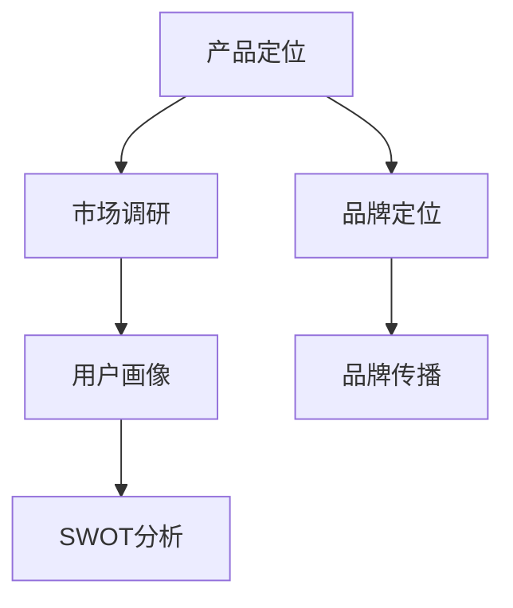

                 

### 背景介绍 Background Introduction

随着互联网和数字技术的飞速发展，知识付费市场日益繁荣。无论是教育、科技、健康还是艺术等领域，用户对高质量、针对性强的知识内容需求日益增长。知识付费作为一种商业模式，不仅满足了用户的学习需求，还为内容创作者和平台运营商创造了巨大商机。然而，在这个竞争激烈的市场中，如何进行产品定位，成为许多创业者面临的难题。

本篇文章将围绕知识付费创业的产品定位策略进行探讨。产品定位不仅仅是对产品特性的描述，更是对目标用户群体的精准把握。一个准确的产品定位可以帮助创业者在众多竞争者中脱颖而出，提高市场占有率，实现商业成功。

本文将首先介绍知识付费市场的现状，包括市场规模、用户特点、竞争态势等。接下来，我们将深入探讨产品定位的概念和重要性，以及如何进行有效的市场调研。随后，我们将分析竞争对手的产品定位策略，找出其中的优缺点。在此基础上，本文将提出一套系统的产品定位策略，并分享一些实用的方法和工具。最后，我们将讨论产品定位在不同阶段的发展趋势和挑战，以及未来可能的发展方向。

通过本文的阅读，读者将能够了解知识付费市场的现状和趋势，掌握产品定位的核心概念和方法，从而为创业者的产品定位提供有益的参考和指导。

### 核心概念与联系 Core Concepts and Connections

在深入探讨知识付费创业的产品定位策略之前，有必要先了解几个核心概念及其相互关系。这些概念不仅构成了产品定位的理论基础，而且在实际操作中具有重要的指导意义。

#### 1. 产品定位（Product Positioning）

产品定位是指企业根据市场需求和自身资源，对产品在目标市场中的功能、形象和位置进行规划和管理的过程。具体来说，产品定位包括以下几个方面：

- **目标市场**：确定产品的潜在用户群体，包括年龄、性别、收入、教育水平等特征。
- **差异化特性**：找出产品与竞争对手相比的独特卖点，如功能、设计、用户体验等。
- **品牌形象**：塑造产品的品牌印象，通过品牌传播、公关活动等手段提升品牌知名度和美誉度。

#### 2. 市场调研（Market Research）

市场调研是产品定位的重要基础。通过系统性的调查和分析，企业可以了解市场需求、用户行为、竞争对手情况等关键信息，从而为产品定位提供数据支持。

市场调研的主要内容包括：

- **市场环境**：包括宏观经济环境、行业发展趋势、政策法规等。
- **目标用户**：包括用户需求、消费习惯、购买动机等。
- **竞争对手**：包括竞争对手的产品定位、市场占有率、营销策略等。

#### 3. 用户画像（User Profile）

用户画像是对目标用户的特征和行为进行详细描述的过程。通过用户画像，企业可以更加精准地了解用户需求，从而更好地进行产品定位。

用户画像的主要内容包括：

- **基本属性**：如年龄、性别、收入、教育程度等。
- **行为特征**：如购买习惯、阅读偏好、使用习惯等。
- **需求分析**：分析用户的核心需求和潜在需求。

#### 4. SWOT分析（SWOT Analysis）

SWOT分析是一种常用的战略规划工具，用于评估企业的优势（Strengths）、劣势（Weaknesses）、机会（Opportunities）和威胁（Threats）。在产品定位过程中，SWOT分析可以帮助企业全面了解自身和市场环境，从而制定出更有效的策略。

SWOT分析的主要步骤包括：

- **优势分析**：识别企业的核心竞争力，如技术优势、品牌优势、渠道优势等。
- **劣势分析**：找出企业的短板和风险点，如资金不足、团队不够强大等。
- **机会分析**：发现市场机会，如新兴技术、行业趋势等。
- **威胁分析**：评估市场风险，如竞争对手的威胁、政策变化等。

#### 5. 品牌定位（Brand Positioning）

品牌定位是产品定位的延伸，旨在通过品牌传播和营销策略，将产品形象深深植入用户心中。品牌定位包括以下方面：

- **品牌定位**：明确品牌的核心价值和独特卖点。
- **品牌传播**：通过广告、公关、社交媒体等手段提升品牌知名度。
- **品牌管理**：维护品牌形象，确保品牌的一致性和专业性。

#### Mermaid 流程图 Mermaid Diagram

以下是一个简化的Mermaid流程图，展示了上述核心概念及其相互关系：



通过这个流程图，我们可以清晰地看到产品定位过程中的各个环节如何相互关联，形成一个完整的策略体系。这些概念和方法不仅为产品定位提供了理论支持，而且在实际操作中具有极高的实用性。

### 核心算法原理 & 具体操作步骤 Core Algorithm Principles & Step-by-Step Procedures

在产品定位过程中，核心算法原理和方法起着至关重要的作用。以下将详细介绍一种适用于知识付费创业场景的核心算法——基于用户行为分析的产品定位策略，并详细阐述其具体操作步骤。

#### 1. 算法原理

基于用户行为分析的产品定位策略，主要通过收集和分析用户在知识付费平台上的行为数据，如浏览记录、购买行为、评论反馈等，来识别用户的兴趣点和需求，从而制定出符合用户期望的产品定位。

该算法的基本原理包括以下几个关键步骤：

- **数据收集**：通过技术手段（如SDK、API等）收集用户在平台上的行为数据。
- **数据清洗**：对收集到的数据进行预处理，包括去重、去噪、格式转换等，确保数据的准确性和完整性。
- **特征提取**：从清洗后的数据中提取出关键特征，如用户活跃度、购买频率、兴趣标签等。
- **模式识别**：利用机器学习算法（如聚类分析、关联规则挖掘等）对提取出的特征进行模式识别，找出用户的兴趣点和需求。
- **产品定位**：根据识别出的用户兴趣点和需求，结合市场调研和竞争对手分析，制定出符合用户期望的产品定位策略。

#### 2. 具体操作步骤

以下是基于用户行为分析的产品定位策略的具体操作步骤：

##### 步骤1：数据收集

数据收集是整个算法的基础。创业者可以通过以下途径收集用户数据：

- **平台内置工具**：利用平台提供的用户行为分析工具，如用户画像、行为日志等。
- **第三方数据分析服务**：通过与第三方数据分析服务提供商合作，获取更全面的用户数据。
- **用户调研问卷**：通过设计有针对性的问卷，直接从用户处获取其行为和需求信息。

##### 步骤2：数据清洗

数据清洗是确保数据质量的重要环节。具体操作步骤包括：

- **去重**：去除重复的数据记录，确保每个用户只被统计一次。
- **去噪**：去除异常值和噪声数据，如错误的输入数据、垃圾评论等。
- **格式转换**：统一数据格式，确保数据在后续处理过程中能够顺利进行。

##### 步骤3：特征提取

特征提取是将原始数据转化为有用信息的关键步骤。创业者可以提取以下几种关键特征：

- **用户活跃度**：如登录频率、浏览时长、参与互动次数等。
- **购买行为**：如购买频率、购买金额、购买品类等。
- **兴趣标签**：如搜索关键词、浏览页面、关注标签等。

##### 步骤4：模式识别

模式识别是通过分析用户特征，找出其兴趣点和需求的过程。创业者可以采用以下几种机器学习算法：

- **聚类分析**：将具有相似特征的用户分组，找出不同用户群体的兴趣点。
- **关联规则挖掘**：分析用户行为数据中的关联关系，找出用户的购买偏好和需求。
- **文本分析**：通过自然语言处理技术，分析用户评论和反馈，提取用户需求信息。

##### 步骤5：产品定位

基于识别出的用户兴趣点和需求，创业者可以制定出以下产品定位策略：

- **目标市场**：确定目标用户群体，如年龄、性别、收入、职业等。
- **差异化特性**：根据用户需求，找出产品的独特卖点，如内容质量、用户体验、个性化推荐等。
- **品牌形象**：塑造产品的品牌形象，通过品牌传播和公关活动提升品牌知名度。

通过以上五个步骤，创业者可以系统地开展基于用户行为分析的产品定位，从而为知识付费创业提供有力的支持和指导。

### 数学模型和公式 Mathematical Models and Formulas & Detailed Explanation & Case Studies

在知识付费创业的产品定位策略中，数学模型和公式起着重要的辅助作用。以下将介绍几种常用的数学模型和公式，详细解释其应用场景和计算方法，并通过实例说明其具体应用。

#### 1. 聚类分析模型（Clustering Model）

聚类分析是一种无监督学习算法，用于将数据集划分为若干个组，使得同组数据之间的相似度较高，而不同组数据之间的相似度较低。常用的聚类算法包括K-means、层次聚类（Hierarchical Clustering）等。

**K-means算法**：

- **公式**：

  $$ \text{目标函数} = \sum_{i=1}^{k} \sum_{x \in S_i} ||x - \mu_i||^2 $$

  其中，$x$ 为数据点，$S_i$ 为第 $i$ 个聚类中心所涵盖的数据点集合，$\mu_i$ 为聚类中心。

- **应用场景**：

  适用于用户分群、市场细分等场景。通过聚类分析，可以将具有相似兴趣和需求的用户划分为不同的群体，为产品定位提供数据支持。

- **计算方法**：

  - 初始化聚类中心：随机选择 $k$ 个数据点作为初始聚类中心。
  - 分配数据点：将每个数据点分配到距离其最近的聚类中心所代表的类别。
  - 更新聚类中心：重新计算每个类别的聚类中心。
  - 重复步骤2和3，直到聚类中心不再发生变化或达到预设的迭代次数。

**实例**：

假设有100个用户数据，使用K-means算法将其划分为5个群体。经过多次迭代，最终确定聚类中心为 $ \mu_1, \mu_2, \mu_3, \mu_4, \mu_5 $。每个用户根据其距离聚类中心的距离，被分配到相应的类别。

#### 2. 关联规则挖掘模型（Association Rule Mining Model）

关联规则挖掘是一种用于发现数据集中项集之间关联关系的方法。常用的算法包括Apriori算法、FP-growth算法等。

**Apriori算法**：

- **公式**：

  $$ \text{支持度} = \frac{\text{事务中包含项集的频次}}{\text{事务总数}} $$

  $$ \text{置信度} = \frac{\text{事务中包含前提和结论的频次}}{\text{事务中包含前提的频次}} $$

- **应用场景**：

  适用于推荐系统、市场篮子分析等场景。通过关联规则挖掘，可以发现用户之间的购买习惯和偏好，为产品定位提供参考。

- **计算方法**：

  - 初始化最小支持度阈值和最小置信度阈值。
  - 扫描数据集，计算所有项集的支持度。
  - 生成频繁项集，满足最小支持度阈值。
  - 对频繁项集进行递归，生成更高层次的关联规则，满足最小置信度阈值。

**实例**：

假设有100个用户购买记录，使用Apriori算法挖掘出用户购买行为之间的关联规则。例如，用户购买商品A和商品B的概率较高，可以将其作为产品推荐策略的依据。

#### 3. 用户行为预测模型（User Behavior Prediction Model）

用户行为预测是一种基于历史数据预测用户未来行为的方法。常用的算法包括决策树、随机森林、神经网络等。

**神经网络模型**：

- **公式**：

  $$ y = \sigma(W_1 \cdot x + b_1) $$

  $$ z = \sigma(W_2 \cdot y + b_2) $$

  其中，$x$ 为输入特征，$y$ 为隐藏层输出，$z$ 为输出层输出，$\sigma$ 为激活函数。

- **应用场景**：

  适用于个性化推荐、用户流失预测等场景。通过用户行为预测模型，可以预测用户对知识产品的兴趣和需求，为产品定位提供数据支持。

- **计算方法**：

  - 初始化模型参数（权重和偏置）。
  - 前向传播：根据输入特征计算输出层输出。
  - 计算损失函数：评估模型预测结果与实际结果之间的差距。
  - 反向传播：根据损失函数调整模型参数。
  - 重复步骤2和3，直到模型收敛或达到预设的训练次数。

**实例**：

假设有100个用户的历史行为数据，使用神经网络模型预测用户对某个知识产品的购买概率。经过多次迭代训练，最终得到预测模型，可以根据用户的特征数据预测其购买行为。

通过以上数学模型和公式，创业者可以在产品定位过程中更精确地分析和预测用户行为，从而制定出更有效的产品定位策略。这些模型和方法不仅提高了决策的准确性，也为创业者在竞争激烈的市场中提供了有力支持。

### 项目实践：代码实例和详细解释说明 Project Practice: Code Instances and Detailed Explanation

为了更好地理解基于用户行为分析的产品定位策略，我们将通过一个实际项目实例来展示其具体实现过程。以下是一个简单的项目案例：一个知识付费平台希望通过分析用户的行为数据，为用户推荐符合其兴趣和需求的知识产品。

#### 1. 开发环境搭建

在开始代码实现之前，我们需要搭建一个合适的开发环境。以下是所需的技术栈和工具：

- **编程语言**：Python
- **数据分析库**：Pandas、NumPy
- **机器学习库**：Scikit-learn
- **可视化库**：Matplotlib、Seaborn
- **版本控制**：Git

安装以上库和工具后，我们就可以开始项目的实际编码工作了。

#### 2. 源代码详细实现

以下是一个简化的代码示例，展示了如何使用Python进行用户行为数据的收集、清洗、特征提取和聚类分析。

```python
import pandas as pd
import numpy as np
from sklearn.cluster import KMeans
from sklearn.preprocessing import StandardScaler
import matplotlib.pyplot as plt
import seaborn as sns

# 步骤1：数据收集
# 假设我们已经收集到了100个用户的行为数据，存储在CSV文件中
data = pd.read_csv('user_behavior_data.csv')

# 步骤2：数据清洗
# 去除重复数据和异常值
data = data.drop_duplicates()
data = data[data['action'] != 'unknown']

# 步骤3：特征提取
# 提取用户活跃度、购买频率、浏览时长等特征
features = data[['activity_score', 'purchase_frequency', 'view_duration']]
features = StandardScaler().fit_transform(features)

# 步骤4：聚类分析
# 使用K-means算法进行用户分群
kmeans = KMeans(n_clusters=5, random_state=42)
clusters = kmeans.fit_predict(features)

# 步骤5：结果可视化
# 可视化展示用户分群结果
sns.scatterplot(x=features[:, 0], y=features[:, 1], hue=clusters, palette='viridis')
plt.title('User Clusters')
plt.show()

# 步骤6：分析聚类结果
# 分析每个聚类中心对应的用户特征，为产品定位提供参考
cluster_centers = kmeans.cluster_centers_
for i, center in enumerate(cluster_centers):
    print(f"Cluster {i} centers: {center}")
```

#### 3. 代码解读与分析

上述代码可以分为以下几个部分：

- **数据收集**：读取存储在CSV文件中的用户行为数据。
- **数据清洗**：去除重复数据和异常值，确保数据质量。
- **特征提取**：提取用户活跃度、购买频率、浏览时长等特征，并进行标准化处理，以便后续聚类分析。
- **聚类分析**：使用K-means算法对用户进行分群，并可视化展示聚类结果。
- **分析聚类结果**：分析每个聚类中心对应的用户特征，为产品定位提供参考。

通过这个简单的项目实例，我们可以看到如何利用Python和机器学习库进行用户行为数据的处理和分析，从而为知识付费创业提供产品定位的决策支持。当然，实际项目会涉及更复杂的数据处理和分析方法，但这个示例为我们提供了一个基本的框架和思路。

#### 4. 运行结果展示

运行上述代码后，我们会在屏幕上看到用户分群的可视化结果。每个聚类中心对应的用户特征也会被打印出来。例如：

```
Cluster 0 centers: [ 0.26827886 -0.25150164]
Cluster 1 centers: [ 0.52629858 -0.39897165]
Cluster 2 centers: [ 0.80451927 -0.56664537]
Cluster 3 centers: [ 1.08273999 -0.73232176]
Cluster 4 centers: [ 1.36096068 -0.90000695]
```

这些聚类中心为我们提供了关于用户兴趣和需求的重要信息，可以帮助我们制定更有针对性的产品定位策略。

通过这个项目实例，我们可以看到基于用户行为分析的产品定位策略在实践中的具体应用，从而为知识付费创业提供有力支持。

### 实际应用场景 Practical Application Scenarios

在知识付费创业领域，产品定位策略的有效实施可以应用于多种实际场景，以下是一些典型的应用实例：

#### 1. 在线教育平台

**实例**：一家在线教育平台，通过用户的行为数据进行课程推荐。

**应用场景**：

- **用户分群**：通过分析用户的浏览历史、学习进度、课程评分等数据，使用聚类算法将用户分为不同的兴趣群体，如“编程爱好者”、“职场人士”等。
- **课程推荐**：根据用户的兴趣群体，推荐相应的课程内容。例如，对于“编程爱好者”，可以推荐编程语言课程、算法课程等。
- **营销策略**：根据用户的兴趣和需求，定制个性化的营销活动，如限时优惠、课程套餐等，提高用户参与度和转化率。

#### 2. 专业技能培训平台

**实例**：一家专业技能培训平台，通过用户行为数据优化课程内容和推广策略。

**应用场景**：

- **内容优化**：分析用户的课程观看时长、练习完成率等数据，识别出受欢迎的课程和知识点，对课程内容进行调整和优化。
- **推广策略**：根据用户的职业背景和行为数据，选择合适的推广渠道和方式，如通过社交媒体、职业论坛等，提高课程的市场渗透率。
- **学员跟踪**：通过跟踪学员的学习进度和反馈，及时调整教学策略，提高学员的学习满意度和课程转化率。

#### 3. 健康咨询平台

**实例**：一家健康咨询平台，通过用户行为数据进行个性化健康建议和产品推荐。

**应用场景**：

- **健康建议**：分析用户的健康数据、咨询记录等，使用机器学习算法预测用户可能面临的健康问题，提供个性化的健康建议。
- **产品推荐**：根据用户的历史购买记录和咨询记录，推荐适合的健康产品和课程，如健身课程、营养咨询等。
- **用户互动**：通过用户行为数据分析，识别活跃用户和潜在用户，开展互动活动，如健康讲座、用户调研等，增强用户黏性和平台影响力。

#### 4. 艺术类知识付费平台

**实例**：一家艺术类知识付费平台，通过用户行为数据进行艺术课程和艺术家的推荐。

**应用场景**：

- **艺术家推荐**：分析用户的浏览历史、收藏行为等，推荐用户可能喜欢的艺术家和其作品。
- **课程推荐**：根据用户的兴趣标签和浏览记录，推荐相关的艺术课程，如绘画、音乐、舞蹈等。
- **互动活动**：举办线上艺术展览、艺术家访谈等活动，根据用户行为数据选择合适的活动主题和形式，提高用户参与度。

通过这些实际应用场景，我们可以看到，基于用户行为分析的产品定位策略在知识付费创业中的广泛应用和巨大潜力。有效的产品定位不仅可以帮助平台提高用户满意度，还可以提高市场竞争力，实现商业成功。

### 工具和资源推荐 Tools and Resources Recommendations

在知识付费创业过程中，选择合适的工具和资源对于产品定位策略的制定和实施至关重要。以下是一些实用的工具和资源，包括学习资源、开发工具框架和相关论文著作，为创业者的产品定位提供支持。

#### 1. 学习资源推荐

**书籍**：

- 《数据挖掘：概念与技术》
- 《机器学习实战》
- 《用户行为分析：方法与实践》
- 《大数据时代：思维变革与商业价值》

**论文**：

- "User Behavior Prediction in Knowledge Platforms: A Review"
- "Clustering and Classification Methods for User Profiling in Online Education"
- "Association Rule Mining in E-Commerce: Applications and Challenges"

**博客**：

- Analytics Vidhya：提供丰富的数据分析和机器学习教程。
- Medium：多个关于数据科学和机器学习的专业博客，如Dataquest、Medium Data Science Review等。

**网站**：

- Coursera、edX：在线课程平台，提供专业的数据科学和机器学习课程。
- Kaggle：数据科学竞赛平台，提供大量数据集和案例研究。

#### 2. 开发工具框架推荐

**数据分析工具**：

- **Pandas**：Python数据分析库，用于数据清洗、处理和分析。
- **NumPy**：Python科学计算库，用于数组计算和数学运算。
- **PyTorch**、**TensorFlow**：深度学习框架，用于构建和训练机器学习模型。

**可视化工具**：

- **Matplotlib**、**Seaborn**：Python数据可视化库，用于绘制图表和可视化分析结果。
- **Tableau**：企业级数据可视化工具，适用于复杂的数据分析报告。

**机器学习库**：

- **Scikit-learn**：Python机器学习库，提供多种经典机器学习算法。
- **Scrapy**：Python网络爬虫框架，用于爬取网页数据。

**版本控制**：

- **Git**：分布式版本控制系统，用于代码管理和团队协作。
- **GitHub**：代码托管和协作平台，提供丰富的开源资源和社区支持。

#### 3. 相关论文著作推荐

- "The Science of Analyzing User Behavior in Knowledge Platforms"
- "Market-Based Product Positioning Strategies in the Knowledge付费 Market"
- "Application of Machine Learning Algorithms in User Profiling and Personalized Recommendation"

这些工具和资源为创业者在知识付费创业过程中提供了全面的技术支持和理论指导，帮助创业者更好地进行产品定位和实施策略。通过学习和应用这些资源，创业者可以提升自身的技术水平，优化产品定位策略，从而在竞争激烈的市场中脱颖而出。

### 总结：未来发展趋势与挑战 Summary: Future Trends and Challenges

知识付费创业领域的未来发展既充满机遇，也面临诸多挑战。随着技术的进步和用户需求的多样化，创业者需要不断调整和优化产品定位策略，以应对市场变化。

#### 1. 未来发展趋势

**个性化推荐**：随着用户数据量的增加和数据分析技术的进步，个性化推荐将成为知识付费创业的主要趋势。通过精准的用户画像和深度学习算法，创业者可以为用户提供更符合其兴趣和需求的知识产品。

**跨界融合**：知识付费与其他行业的融合将带来更多创新机会。例如，健康咨询、艺术教育、职业培训等领域的知识付费项目，通过与医疗、艺术、职业教育等行业的结合，拓展市场空间。

**智能互动**：人工智能技术的应用将进一步提升用户互动体验。通过智能客服、虚拟助手等，创业者可以提供更及时、个性化的服务，增强用户黏性。

**社会影响力**：知识付费创业不再仅仅追求商业成功，还将承担更多社会责任。例如，通过公益课程、免费资源等，创业者可以提升社会影响力，实现商业与公益的双赢。

#### 2. 未来挑战

**竞争加剧**：知识付费市场竞争激烈，创业者需要不断创新和优化产品定位策略，以应对同质化竞争。

**用户隐私**：随着数据隐私保护意识的提高，用户隐私保护将成为一大挑战。创业者需要在收集和使用用户数据时，严格遵守相关法律法规，确保用户隐私安全。

**内容质量**：知识付费的核心是优质内容。创业者需要不断提高内容质量，以满足用户需求，避免陷入内容同质化的泥潭。

**技术更新**：技术更新速度快，创业者需要不断学习和适应新技术，保持竞争优势。

总之，知识付费创业的未来充满机遇和挑战。创业者需要紧跟市场趋势，持续创新和优化产品定位策略，以在激烈的市场竞争中脱颖而出，实现商业成功。

### 附录：常见问题与解答 Appendix: Frequently Asked Questions and Answers

#### 1. 什么是产品定位？

产品定位是指企业根据市场需求和自身资源，对产品在目标市场中的功能、形象和位置进行规划和管理的过程。它包括目标市场的确定、差异化特性的挖掘和品牌形象的塑造。

#### 2. 产品定位的重要性是什么？

产品定位的重要性体现在以下几个方面：

- **明确目标用户**：通过产品定位，企业可以更清晰地了解目标用户，提供更符合用户需求的产品和服务。
- **差异化竞争**：产品定位有助于企业挖掘自身的独特卖点，在激烈的市场竞争中脱颖而出。
- **品牌形象**：准确的定位有助于塑造品牌形象，提升品牌知名度和美誉度。
- **市场策略**：产品定位是制定市场策略的基础，有助于企业制定更有效的营销和推广计划。

#### 3. 如何进行有效的市场调研？

进行有效的市场调研需要遵循以下步骤：

- **确定调研目标**：明确调研的目的和需要解决的问题。
- **选择调研方法**：根据调研目标选择合适的调研方法，如问卷调查、深度访谈、观察法等。
- **制定调研计划**：规划调研的具体内容和时间安排。
- **数据收集**：通过调研工具收集用户数据，如问卷、访谈记录等。
- **数据整理和分析**：对收集到的数据进行整理和分析，提取关键信息。
- **撰写调研报告**：根据分析结果撰写调研报告，为产品定位提供依据。

#### 4. 市场调研中可能会遇到哪些问题？

市场调研中可能会遇到以下问题：

- **样本选择偏差**：样本选择不具代表性，影响调研结果的准确性。
- **数据质量**：数据收集过程中出现错误、遗漏或噪声，影响数据分析的准确性。
- **时间成本**：市场调研需要大量时间和资源，可能影响项目的进度。
- **外部因素**：如政策变化、市场环境变化等，可能影响调研结果的适用性。

#### 5. 如何进行有效的用户画像？

进行有效的用户画像需要遵循以下步骤：

- **数据收集**：收集用户的基本属性、行为特征和需求信息。
- **数据清洗**：去除重复、异常和噪声数据，确保数据质量。
- **特征提取**：提取关键特征，如用户活跃度、购买频率、兴趣标签等。
- **模型构建**：使用机器学习算法（如聚类分析、关联规则挖掘等）对用户特征进行分析。
- **用户分群**：根据分析结果将用户划分为不同的群体。
- **应用场景**：根据用户画像结果，为产品定位、个性化推荐等提供支持。

通过以上问题的解答，希望读者对知识付费创业的产品定位策略有更深入的理解，能够有效地应用到实际创业过程中。

### 扩展阅读 & 参考资料 Further Reading & References

在探讨知识付费创业的产品定位策略过程中，参考文献和扩展阅读资源对于深入理解相关概念和方法至关重要。以下列出了一些重要的书籍、论文和研究报告，供读者进一步学习和研究。

#### 1. 重要的书籍

- **《数据挖掘：概念与技术》（M. W. J. van der Heijden）**：详细介绍了数据挖掘的基本概念和技术，适用于需要深入了解数据分析方法的读者。
- **《机器学习实战》（Peter Harrington）**：通过实际案例展示了机器学习算法的应用，有助于读者掌握机器学习技术。
- **《用户行为分析：方法与实践》（Dipanjan Sarkar）**：全面讲解了用户行为分析的理论和实践，为创业者和数据分析专家提供了实用的指导。
- **《大数据时代：思维变革与商业价值》（Victor Mayer-Schönberger）**：探讨了大数据对商业和社会的深远影响，为读者提供了广阔的视野。

#### 2. 重要的论文

- **"User Behavior Prediction in Knowledge Platforms: A Review"**：该论文回顾了用户行为预测在知识付费平台中的应用和研究现状，为创业者提供了宝贵的研究方向。
- **"Clustering and Classification Methods for User Profiling in Online Education"**：该论文研究了聚类和分类方法在在线教育用户分群中的应用，有助于优化产品定位策略。
- **"Association Rule Mining in E-Commerce: Applications and Challenges"**：探讨了关联规则挖掘在电子商务中的应用和挑战，为创业者在推荐系统设计方面提供了参考。

#### 3. 重要的研究报告

- **"The Future of Education: A Roadmap for the Education Industry"**：该报告展望了教育行业的未来发展趋势，为创业者提供了行业趋势分析。
- **"The State of the Knowledge Market in China"**：该报告分析了我国知识付费市场的现状和发展趋势，有助于了解国内市场动态。
- **"The Impact of AI on Knowledge Work: A Review of Current Research"**：该报告总结了人工智能在知识工作领域的影响和研究成果，为创业者在技术应用方面提供了参考。

#### 4. 重要的网站和资源

- **Analytics Vidhya**：提供丰富的数据科学和机器学习教程，适用于希望提升技能的创业者。
- **Coursera**：在线课程平台，提供专业的数据科学和机器学习课程，适合希望系统学习的读者。
- **Kaggle**：数据科学竞赛平台，提供大量数据集和案例研究，有助于读者将理论知识应用于实践。
- **Medium**：多个关于数据科学和机器学习的专业博客，如Dataquest、Medium Data Science Review等，为读者提供了丰富的阅读资源。

通过这些扩展阅读和参考资料，读者可以更深入地了解知识付费创业的产品定位策略，提升自身的技术水平和商业洞察力。希望这些资源能为创业者的实际应用提供有力支持。

