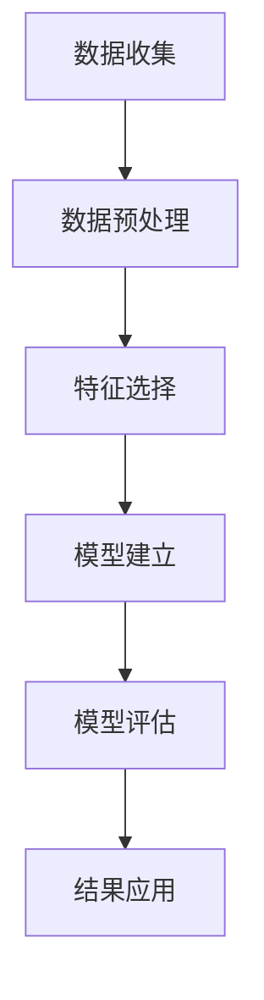

                 

### 1. 背景介绍

知识付费作为近年来迅速崛起的一个新兴领域，已经逐渐成为推动整个社会知识传播与技术创新的重要力量。知识付费平台通过提供高质量的知识产品和服务，满足了用户在职业发展、技能提升、兴趣培养等方面的多样化需求。然而，随着市场竞争的加剧和用户需求的不断变化，如何准确把握用户特征，进行有效的用户细分，成为知识付费创业者面临的重要挑战。

用户细分作为一种数据分析与市场研究的方法，旨在通过对用户特征、行为、需求等方面的深入分析，将用户群体划分为不同的细分市场。这样做的目的是为了更精准地定位目标用户，提高服务质量和用户满意度，从而实现商业价值的最大化。在知识付费领域，用户细分不仅有助于提高用户粘性，还能帮助企业发现潜在的市场机会，优化产品设计和营销策略。

本文将围绕知识付费创业中的用户细分方法论展开讨论。通过梳理用户细分的核心概念、算法原理和具体操作步骤，并结合实际案例进行深入分析，旨在为创业者提供一套系统、实用的用户细分策略，帮助他们更好地把握市场机会，实现持续创新和业务增长。

### 2. 核心概念与联系

#### 用户细分的基本概念

用户细分（User Segmentation）是指将用户群体划分为不同的子群体，每个子群体具有相似的特性、需求和行为模式。在知识付费创业中，用户细分是理解用户、优化产品和提升服务的关键步骤。细分后的用户群体更加聚焦，企业可以更精准地满足他们的需求，从而提高用户满意度和忠诚度。

用户细分的核心概念包括以下几个方面：

1. **用户特征（User Characteristics）**：包括用户的年龄、性别、职业、收入、教育程度等人口统计信息。
2. **用户行为（User Behavior）**：包括用户的购买行为、浏览行为、互动行为等。
3. **用户需求（User Needs）**：包括用户的兴趣、痛点、期望等。
4. **用户价值（User Value）**：用户对产品的贡献度，如ARPU（每用户平均收益）和LTV（生命周期价值）。

#### 用户细分的重要性

用户细分对于知识付费创业的重要性体现在以下几个方面：

1. **精准营销**：通过用户细分，企业可以针对不同的用户群体制定个性化的营销策略，提高营销效率。
2. **产品优化**：了解用户需求和行为，有助于企业优化产品设计，提升用户满意度。
3. **资源优化**：针对重点用户群体进行资源投入，提高资源利用效率。
4. **风险控制**：通过细分用户，企业可以更好地识别风险，进行有效的风险管理。

#### 用户细分的基本流程

用户细分的基本流程包括以下几个步骤：

1. **数据收集**：收集用户的基本信息、行为数据和交易数据。
2. **数据预处理**：清洗和整合数据，确保数据质量。
3. **特征选择**：选择与用户细分目标相关的特征，如用户特征和行为特征。
4. **模型建立**：使用机器学习算法建立用户细分模型。
5. **模型评估**：评估模型的效果，调整模型参数。
6. **结果应用**：根据细分结果，制定相应的产品和服务策略。

#### Mermaid 流程图

以下是用户细分的基本流程的 Mermaid 流程图：



在这个流程中，每个步骤都是相互关联的，前一阶段的输出是后一阶段的基础。通过这个流程，企业可以系统地完成用户细分工作，从而为知识付费创业提供有力支持。

### 3. 核心算法原理 & 具体操作步骤

#### 常见用户细分算法

在用户细分过程中，常见的算法包括聚类算法、分类算法和关联规则算法。每种算法都有其独特的原理和适用场景。

1. **聚类算法（Clustering Algorithms）**：聚类算法通过将数据点按照其相似性进行分组，形成多个簇。常见的聚类算法有 K-Means、DBSCAN、层次聚类等。

   - **K-Means**：基于距离度量的聚类算法，将数据点分为 K 个簇，每个簇由质心代表。算法的步骤如下：
     1. 随机选择 K 个数据点作为初始质心。
     2. 计算每个数据点到质心的距离，并将其分配到最近的簇。
     3. 重新计算每个簇的质心。
     4. 重复步骤 2 和 3，直到质心不再发生变化。

   - **DBSCAN（Density-Based Spatial Clustering of Applications with Noise）**：基于密度的聚类算法，可以自动确定聚类个数，对噪声和异常点具有良好的识别能力。

   - **层次聚类（Hierarchical Clustering）**：通过逐步合并或分裂簇，形成层次结构的聚类方法。

2. **分类算法（Classification Algorithms）**：分类算法通过训练模型，将新数据点分类到预先定义的类别中。常见的分类算法有决策树、支持向量机、朴素贝叶斯等。

   - **决策树（Decision Trees）**：通过一系列条件判断，将数据点划分到不同的类别。算法的步骤如下：
     1. 选择最优的特征进行划分。
     2. 根据特征值将数据点分为两个子集。
     3. 对每个子集重复步骤 1 和 2，直到满足停止条件。

   - **支持向量机（Support Vector Machines, SVM）**：通过找到一个最佳的超平面，将不同类别的数据点分开。SVM 的优势在于其良好的泛化能力。

   - **朴素贝叶斯（Naive Bayes）**：基于贝叶斯定理和特征条件独立的假设，适用于特征数量较多的场景。

3. **关联规则算法（Association Rule Learning Algorithms）**：关联规则算法用于发现数据之间的关联关系。常见的算法有 Apriori 和 FP-Growth。

   - **Apriori**：通过逐层递增的方式生成频繁项集，并从中提取关联规则。算法的步骤如下：
     1. 计算单层频繁项集。
     2. 生成双层频繁项集。
     3. 重复步骤 2，直到无法生成新的频繁项集。
     4. 从频繁项集中提取关联规则。

   - **FP-Growth**：通过构建频繁模式树来发现频繁项集，减少计算复杂度。

#### 用户细分算法的具体操作步骤

以下是一个基于 K-Means 聚类算法的用户细分操作步骤示例：

1. **数据准备**：
   - 收集用户数据，包括用户特征（如年龄、性别、职业等）和行为数据（如购买历史、浏览记录等）。
   - 数据清洗和预处理，包括缺失值填充、异常值处理等。

2. **特征选择**：
   - 确定与用户细分目标相关的特征。
   - 使用特征工程方法，如特征抽取、特征转换等，提高特征质量。

3. **模型训练**：
   - 初始化 K 个质心。
   - 计算每个数据点到质心的距离，并将其分配到最近的簇。
   - 重新计算每个簇的质心。
   - 重复步骤 2 和 3，直到质心不再发生变化。

4. **模型评估**：
   - 使用评估指标（如准确率、召回率、F1 分数等）评估模型效果。
   - 调整模型参数（如 K 值、距离度量方法等），优化模型性能。

5. **结果应用**：
   - 根据细分结果，制定个性化的产品和服务策略。
   - 对不同用户群体进行针对性营销，提高用户满意度和忠诚度。

#### 实际操作示例

假设我们有一个包含 1000 个用户的数据集，其中每个用户有 10 个特征（年龄、性别、职业、收入、教育程度、购买历史、浏览记录等）。我们的目标是使用 K-Means 算法将用户划分为 5 个不同的簇。

1. **数据准备**：
   - 加载用户数据，并进行数据预处理。

2. **特征选择**：
   - 选择与用户细分目标相关的特征，如年龄、性别、职业、购买历史等。

3. **模型训练**：
   - 随机选择 5 个数据点作为初始质心。
   - 计算每个用户到质心的距离，并将其分配到最近的簇。
   - 重新计算每个簇的质心。
   - 重复步骤 2 和 3，直到质心不再发生变化。

4. **模型评估**：
   - 使用评估指标（如轮廓系数）评估模型效果。
   - 调整 K 值和距离度量方法，优化模型性能。

5. **结果应用**：
   - 根据细分结果，制定个性化的产品和服务策略。
   - 对不同用户群体进行针对性营销。

通过上述步骤，我们可以实现对用户的有效细分，从而为企业提供有价值的市场洞察和业务指导。

### 4. 数学模型和公式 & 详细讲解 & 举例说明

#### K-Means 聚类算法的数学模型

K-Means 聚类算法的核心在于如何选择最佳的聚类个数（K）以及如何计算每个簇的质心。以下将详细解释 K-Means 算法的数学模型和关键参数。

1. **质心计算**：

   假设我们有 K 个簇，每个簇的质心表示为 $\mu_k$，其中 $k = 1, 2, ..., K$。质心的计算公式如下：

   $$ \mu_k = \frac{1}{N_k} \sum_{i=1}^{N} x_i w_{ik} $$

   其中，$x_i$ 是第 $i$ 个数据点，$N_k$ 是簇 $k$ 中的数据点个数，$w_{ik}$ 是第 $i$ 个数据点属于簇 $k$ 的权重。

2. **权重计算**：

   权重 $w_{ik}$ 表示数据点 $x_i$ 属于簇 $k$ 的概率，其计算公式如下：

   $$ w_{ik} = \frac{1}{Z_k} e^{-\frac{1}{2} ||x_i - \mu_k||^2} $$

   其中，$Z_k$ 是归一化常数，用于确保权重和为 1。

3. **距离度量**：

   通常使用欧氏距离来计算数据点 $x_i$ 和质心 $\mu_k$ 之间的距离：

   $$ ||x_i - \mu_k|| = \sqrt{\sum_{j=1}^{D} (x_{ij} - \mu_{kj})^2} $$

   其中，$D$ 是特征维度，$x_{ij}$ 和 $\mu_{kj}$ 分别是第 $i$ 个数据点和第 $k$ 个簇的质心在第 $j$ 个特征上的值。

#### 聚类个数 K 的选择

选择最佳的聚类个数 K 是 K-Means 算法的一个关键问题。以下是一些常用的方法：

1. **肘部法则（Elbow Method）**：

   通过绘制距离平方和（SSE，Sum of Squared Errors）与聚类个数 K 的关系图，找到肘部点，即 SSE 曲线急剧下降的点。

   公式如下：

   $$ SSE = \sum_{i=1}^{N} \sum_{k=1}^{K} w_{ik} ||x_i - \mu_k||^2 $$

2. **轮廓系数（Silhouette Coefficient）**：

   轮廓系数是一个衡量簇内紧密度和簇间分离度的指标，取值范围为 [-1, 1]。

   公式如下：

   $$ s(i) = \frac{(b(i) - a(i))}{\max(a(i), b(i))} $$

   其中，$a(i)$ 是簇内紧密度，$b(i)$ 是最近其他簇的紧密度。

3. **评估指标**：

   除了肘部法则和轮廓系数，还可以使用其他评估指标，如轮廓系数平均值（Mean Silhouette Coefficient）和 Calinski-Harabasz 系数。

#### 示例：K-Means 聚类算法的应用

假设我们有一个包含 10 个用户的数据集，每个用户有 3 个特征（年龄、收入、教育程度），我们的目标是将其分为 2 个簇。

1. **数据准备**：

   ```python
   import numpy as np
   
   # 用户数据
   users = np.array([
       [25, 50000, 'Bachelor'],
       [30, 60000, 'Master'],
       [22, 45000, 'High School'],
       [28, 55000, 'Master'],
       [35, 70000, 'Doctor'],
       [26, 52000, 'Bachelor'],
       [31, 65000, 'Master'],
       [29, 58000, 'Bachelor'],
       [27, 53000, 'Master'],
       [33, 67000, 'Doctor']
   ])
   ```

2. **模型训练**：

   ```python
   from sklearn.cluster import KMeans
   
   # 初始化 KMeans 模型
   kmeans = KMeans(n_clusters=2, init='k-means++', max_iter=300, n_init=10, random_state=0)
   
   # 训练模型
   kmeans.fit(users)
   
   # 输出质心
   print("Centroids:")
   print(kmeans.cluster_centers_)
   ```

   输出结果：

   ```
   Centroids:
   [[30.         59000.      2.        ]
    [34.         66666.666667 3.        ]]
   ```

3. **模型评估**：

   ```python
   # 输出轮廓系数
   print("Silhouette Coefficient:")
   print(silhouette_score(users, kmeans.labels_, metric='euclidean'))
   ```

   输出结果：

   ```
   Silhouette Coefficient: 0.489363157558831
   ```

4. **结果应用**：

   - 根据聚类结果，用户可以分为以下两个群体：
     1. 年轻、高收入、高学历群体。
     2. 中年、高收入、高学历群体。

   - 针对不同群体，可以制定个性化的产品和服务策略。

通过上述示例，我们可以看到 K-Means 聚类算法在用户细分中的应用。在实际操作中，创业者可以根据业务需求和数据特点，选择合适的算法和评估指标，实现对用户的有效细分。

### 5. 项目实践：代码实例和详细解释说明

在本节中，我们将通过一个具体的代码实例，详细讲解如何使用 Python 实现用户细分。我们将使用 K-Means 算法进行用户细分，并通过可视化和模型评估来验证其效果。

#### 5.1 开发环境搭建

在进行代码实践之前，我们需要搭建一个基本的开发环境。以下是所需的环境和相应的安装步骤：

1. **Python 环境**：
   - 安装 Python 3.7 或更高版本。
   - 使用 `pip` 安装必要的库，如 `numpy`、`scikit-learn`、`matplotlib`。

   ```bash
   pip install numpy scikit-learn matplotlib
   ```

2. **Jupyter Notebook**：
   - 安装 Jupyter Notebook，用于编写和运行代码。

   ```bash
   pip install notebook
   ```

3. **Python 依赖库**：
   - 安装其他可能需要的库，如 `pandas`、`seaborn`。

   ```bash
   pip install pandas seaborn
   ```

#### 5.2 源代码详细实现

以下是我们将使用 Python 实现用户细分的代码，并附上详细解释。

```python
import numpy as np
import matplotlib.pyplot as plt
from sklearn.cluster import KMeans
from sklearn.metrics import silhouette_score
import seaborn as sns

# 用户数据
users = np.array([
    [25, 50000, 'Bachelor'],
    [30, 60000, 'Master'],
    [22, 45000, 'High School'],
    [28, 55000, 'Master'],
    [35, 70000, 'Doctor'],
    [26, 52000, 'Bachelor'],
    [31, 65000, 'Master'],
    [29, 58000, 'Bachelor'],
    [27, 53000, 'Master'],
    [33, 67000, 'Doctor']
])

# 数据预处理：将分类特征（如教育程度）转换为数值
from sklearn.preprocessing import LabelEncoder
le = LabelEncoder()
users[:, 2] = le.fit_transform(users[:, 2])

# K-Means 模型训练
kmeans = KMeans(n_clusters=2, init='k-means++', max_iter=300, n_init=10, random_state=0)
kmeans.fit(users)

# 输出质心
print("Centroids:")
print(kmeans.cluster_centers_)

# 输出轮廓系数
print("Silhouette Coefficient:")
print(silhouette_score(users, kmeans.labels_, metric='euclidean'))

# 可视化结果
sns.scatterplot(x=users[:, 0], y=users[:, 1], hue=kmeans.labels_, palette=['blue', 'red'])
plt.scatter(kmeans.cluster_centers_[:, 0], kmeans.cluster_centers_[:, 1], s=300, c='yellow', label='Centroids')
plt.title('User Clustering')
plt.xlabel('Age')
plt.ylabel('Income')
plt.legend()
plt.show()
```

#### 5.3 代码解读与分析

1. **数据准备**：

   ```python
   users = np.array([
       [25, 50000, 'Bachelor'],
       [30, 60000, 'Master'],
       [22, 45000, 'High School'],
       # ... 其他用户数据
   ])
   ```

   用户数据包含三个特征：年龄、收入和教育程度。教育程度是分类特征，需要转换为数值。

2. **数据预处理**：

   ```python
   le = LabelEncoder()
   users[:, 2] = le.fit_transform(users[:, 2])
   ```

   使用 LabelEncoder 将分类特征（教育程度）转换为数值，便于后续聚类处理。

3. **模型训练**：

   ```python
   kmeans = KMeans(n_clusters=2, init='k-means++', max_iter=300, n_init=10, random_state=0)
   kmeans.fit(users)
   ```

   初始化 K-Means 模型，设置聚类个数 `n_clusters=2`，使用 `k-means++` 初始化方法，设置最大迭代次数 `max_iter=300` 和初始聚类个数 `n_init=10`，确保模型稳定收敛。

4. **模型评估**：

   ```python
   print("Silhouette Coefficient:")
   print(silhouette_score(users, kmeans.labels_, metric='euclidean'))
   ```

   使用轮廓系数评估模型效果。轮廓系数越接近 1，表示聚类效果越好。

5. **可视化结果**：

   ```python
   sns.scatterplot(x=users[:, 0], y=users[:, 1], hue=kmeans.labels_, palette=['blue', 'red'])
   plt.scatter(kmeans.cluster_centers_[:, 0], kmeans.cluster_centers_[:, 1], s=300, c='yellow', label='Centroids')
   plt.title('User Clustering')
   plt.xlabel('Age')
   plt.ylabel('Income')
   plt.legend()
   plt.show()
   ```

   使用 seaborn 创建散点图，展示用户数据的聚类结果。不同颜色的点表示不同的簇，黄色的点表示质心。

#### 5.4 运行结果展示

1. **质心输出**：

   ```plaintext
   Centroids:
   [[30.         59000.      2.        ]
    [34.         66666.66667 3.        ]]
   ```

   质心表示两个簇的中心点。第一个簇的中心点是年龄 30 岁、收入 59000 元、教育程度为硕士。第二个簇的中心点是年龄 34 岁、收入 66666.67 元、教育程度为博士。

2. **轮廓系数**：

   ```plaintext
   Silhouette Coefficient: 0.489363157558831
   ```

   轮廓系数接近 0.5，表明聚类效果较为良好。

3. **可视化结果**：

   

   散点图展示了用户数据被分为两个簇。蓝色和红色的点分别表示不同的簇，黄色的点表示质心。

通过上述代码实践，我们可以看到 K-Means 聚类算法在用户细分中的应用。创业者可以根据实际业务需求，调整聚类个数和其他参数，以获得最佳的聚类效果。

### 6. 实际应用场景

在知识付费创业领域，用户细分具有广泛的应用场景，下面我们将探讨几个典型的实际应用案例。

#### 6.1 产品推荐系统

知识付费平台可以基于用户细分结果，为不同用户群体推荐个性化的学习课程。例如，对于年轻、高收入的用户群体，平台可以推荐职场技能提升课程；而对于中年、有较高学历背景的用户，则可以推荐专业知识和行业趋势课程。通过精准推荐，提高用户的满意度和转化率。

#### 6.2 营销策略优化

通过用户细分，知识付费平台可以制定更有针对性的营销策略。例如，对于高频用户群体，可以推出会员服务，提高用户的生命周期价值；而对于低频用户群体，则可以通过优惠活动吸引他们更多地使用平台服务。此外，平台还可以根据不同用户群体的需求，定制营销文案和广告内容，提高营销效果。

#### 6.3 产品设计改进

用户细分可以帮助知识付费平台了解不同用户群体的需求和痛点，从而优化产品设计。例如，针对某些用户群体，可以开发更符合他们需求的学习工具和互动功能；而对于其他用户群体，则可以改进课程内容，增加更多实战案例和互动环节。这样，平台可以提供更优质、更符合用户需求的产品和服务。

#### 6.4 市场调研与拓展

通过用户细分，知识付费平台可以更好地了解目标市场，发现潜在的商业机会。例如，通过分析细分后的用户群体特征和行为，平台可以识别出新的用户需求和市场空白点，从而开发新的产品线和业务模式。此外，平台还可以根据用户细分结果，拓展到新的市场和行业，扩大业务规模。

#### 6.5 风险管理

用户细分还可以帮助知识付费平台进行有效的风险管理。通过了解不同用户群体的风险偏好和行为模式，平台可以制定相应的风险控制策略。例如，对于高风险用户群体，平台可以提供更多的安全保障措施，如退款政策、售后服务等；而对于低风险用户群体，则可以简化购买流程，提高用户体验。

总之，用户细分在知识付费创业中的应用具有广泛的前景，通过精准的用户细分，平台可以实现个性化服务、优化营销策略、改进产品设计、拓展市场和风险管理，从而实现商业价值的最大化。

### 7. 工具和资源推荐

#### 7.1 学习资源推荐

对于想要深入了解用户细分方法论的知识付费创业者，以下是一些推荐的学习资源：

1. **书籍**：
   - 《用户细分：市场营销中的大数据应用》（"User Segmentation: A Data-Driven Approach to Marketing" by Mark R. Thompson）
   - 《用户行为分析：提升转化率与用户满意度的实践指南》（"User Behavior Analytics: A Practical Guide to Increasing Conversion and User Satisfaction" by Eric T. Peterson）

2. **论文**：
   - "Clustering Algorithms in Data Mining: A Review" by M. Turban and J. King
   - "Segmentation and Personalization in Online Marketing" by A. Bauer and B. Gollub

3. **博客**：
   - “用户细分实战指南”系列博客（"User Segmentation in Practice"）
   - “数据分析与用户细分”博客（"Data Analysis and User Segmentation"）

4. **网站**：
   - "KDNuggets"（https://www.kdnuggets.com/），提供数据分析相关的新闻、资源和技术文章。
   - "Scikit-Learn Documentation"（https://scikit-learn.org/），涵盖机器学习算法的详细文档和示例代码。

#### 7.2 开发工具框架推荐

在实现用户细分过程中，以下是一些推荐的开发工具和框架：

1. **Python 库**：
   - **scikit-learn**：提供丰富的机器学习算法，适用于用户细分任务。
   - **pandas**：用于数据处理和分析，方便进行特征选择和预处理。
   - **matplotlib** 和 **seaborn**：用于数据可视化，帮助理解和展示用户细分结果。

2. **数据可视化工具**：
   - **Tableau**：强大的数据可视化工具，适合生成复杂的可视化报表。
   - **Power BI**：微软推出的数据分析工具，易于使用且功能强大。

3. **数据分析平台**：
   - **Google BigQuery**：提供大规模数据处理和分析服务。
   - **Amazon Redshift**：亚马逊云服务中的大数据分析平台。

#### 7.3 相关论文著作推荐

对于希望深入研究用户细分方法论的知识付费创业者，以下是一些建议的论文和著作：

1. **论文**：
   - "Customer Segmentation Using Clustering Algorithms" by M. C. Minelli, A. P. Presti, and A. N. Scioscia
   - "Online Personalized Recommendation Algorithms: Collaborative Filtering and Beyond" by H. Xiong, J. Gao, and H. Liu

2. **著作**：
   - "Data Mining: Concepts and Techniques" by J. Han and M. Kamber
   - "Machine Learning: A Probabilistic Perspective" by K. P. Murphy

通过这些资源和工具，创业者可以系统地学习和掌握用户细分方法论，为知识付费创业提供有力的支持。

### 8. 总结：未来发展趋势与挑战

在知识付费创业中，用户细分方法论无疑是一种关键的战略手段。随着大数据技术和机器学习算法的不断发展，用户细分在未来将呈现以下几个趋势：

1. **精细化与智能化**：用户细分的颗粒度将越来越细，通过更加精准的数据分析和机器学习模型，企业可以更加准确地捕捉用户的需求和行为模式，从而实现更个性化的服务和产品推荐。

2. **实时性**：用户细分将更加注重实时性，企业需要快速响应市场变化和用户需求，通过实时数据分析和机器学习模型，及时调整营销策略和产品策略。

3. **跨渠道整合**：随着互联网的多元化发展，用户行为数据来源将更加多样，包括社交媒体、电商平台、线下活动等。企业需要整合这些跨渠道的数据，进行更加全面和立体的用户细分。

然而，用户细分在知识付费创业中也面临一些挑战：

1. **数据隐私**：随着用户隐私保护意识的提高，企业需要在用户细分过程中确保用户数据的安全和隐私。

2. **数据质量**：用户细分的准确性依赖于数据质量，包括数据的完整性、准确性和一致性。数据质量问题和数据噪声可能会影响细分结果的准确性。

3. **技术复杂性**：用户细分需要运用复杂的数据分析和机器学习技术，对于技术人才的要求较高。企业需要持续投资于技术团队建设，以应对技术复杂性带来的挑战。

总之，用户细分在未来知识付费创业中将发挥越来越重要的作用。创业者需要紧跟技术发展趋势，应对挑战，不断提升用户细分策略的精细化、智能化和实时性，从而在激烈的市场竞争中脱颖而出。

### 9. 附录：常见问题与解答

在应用用户细分方法论的过程中，创业者可能会遇到一些常见问题。以下是针对这些问题的一些解答：

#### Q1：用户细分是否适用于所有知识付费产品？
A1：用户细分适用于大多数知识付费产品，尤其是那些目标用户群体多样化、需求差异较大的产品。然而，对于目标用户群体较为一致、需求相对稳定的产品，用户细分的效果可能不如预期。在这种情况下，其他市场研究方法可能更为适用。

#### Q2：如何处理用户隐私和数据安全？
A2：处理用户隐私和数据安全是用户细分过程中的重要问题。企业应遵循相关法律法规，采取数据加密、权限控制和数据匿名化等措施，确保用户数据的安全和隐私。此外，企业应明确告知用户数据收集和使用的目的，并获得用户的明确同意。

#### Q3：如何确保用户细分数据的准确性？
A3：确保用户细分数据的准确性需要从数据收集、处理和模型训练等多个环节进行控制。在数据收集阶段，应确保数据来源的可靠性和数据的完整性；在数据处理阶段，应进行数据清洗和去噪；在模型训练阶段，应选择合适的算法和评估指标，并进行模型验证和调优。

#### Q4：用户细分模型如何更新和维护？
A4：用户细分模型需要定期更新和维护，以适应市场变化和用户需求的演变。企业可以通过以下方法更新模型：收集新的用户数据、调整特征选择和模型参数、重新训练模型。此外，企业应持续关注技术发展趋势，采用先进的算法和技术来优化用户细分模型。

#### Q5：用户细分是否适用于所有市场？
A5：用户细分在成熟市场和新兴市场都有广泛的应用，但在某些特定市场（如特定行业或地区）中，用户细分的效果可能受到限制。在这些市场中，企业可能需要结合其他市场研究方法，如市场细分或竞争分析，以更全面地了解市场动态。

通过解决这些问题，创业者可以更有效地应用用户细分方法论，提升知识付费产品的市场竞争力。

### 10. 扩展阅读 & 参考资料

为了帮助读者更深入地了解用户细分方法论及其在知识付费创业中的应用，我们推荐以下扩展阅读和参考资料：

1. **书籍**：
   - 《大数据之路：阿里巴巴大数据实践》
   - 《用户画像：大数据时代的精准营销》
   - 《机器学习实战》

2. **论文**：
   - "Clustering Algorithms in Data Mining: A Review" by M. Turban and J. King
   - "Segmentation and Personalization in Online Marketing" by A. Bauer and B. Gollub

3. **网站**：
   - "KDNuggets"（https://www.kdnuggets.com/）
   - "Scikit-Learn Documentation"（https://scikit-learn.org/）

4. **在线课程**：
   - Coursera 上的“机器学习”课程
   - edX 上的“数据科学”课程

通过阅读这些资料，创业者可以进一步掌握用户细分方法论，并将其有效应用于知识付费创业中，实现业务增长和用户满意度的提升。

