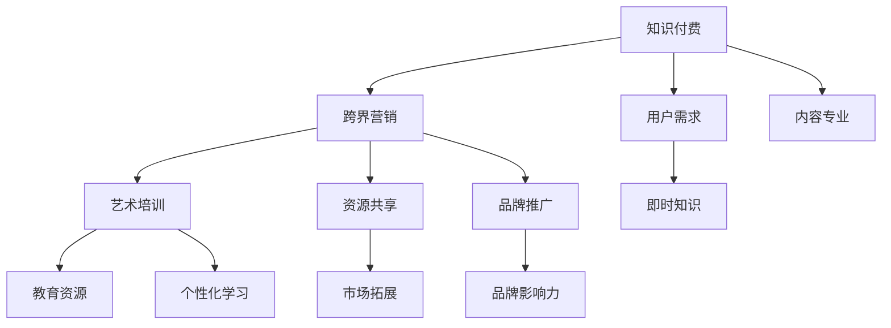

                 

### 1. 背景介绍

知识付费作为一种新型的商业模式，正在迅速崛起。它指的是用户为了获取知识或技能，通过付费的方式购买课程、讲座、电子书等内容。这种模式的出现，很大程度上满足了现代人对于个性化学习和即时知识的需求。

然而，随着知识付费市场的不断扩大，单纯的课程销售已经不能满足用户和平台的需求。跨界营销成为了知识付费平台的一种新的增长点。跨界营销，即通过与其他行业的结合，实现资源共享、优势互补，从而达到扩大用户群体、提高品牌影响力的目的。

艺术培训是知识付费领域的一个重要分支。它涵盖了绘画、音乐、舞蹈等多个艺术形式，旨在培养和提升用户的艺术素养和技能。艺术培训市场的潜力巨大，吸引了众多知识付费平台的关注。

本文将探讨知识付费如何通过跨界营销实现与艺术培训的融合。我们将从核心概念、算法原理、具体操作、数学模型、项目实践、实际应用等多个角度进行分析，以期为知识付费行业提供新的思路和解决方案。

### 2. 核心概念与联系

为了深入探讨知识付费与艺术培训跨界营销的原理和实现方式，我们首先需要明确几个核心概念：

#### 2.1 跨界营销

跨界营销是指不同行业、不同领域的企业或品牌之间，通过合作、资源共享等方式，实现相互推广、提升品牌形象和市场占有率的一种营销策略。其核心在于打破传统行业界限，实现资源的最大化利用。

#### 2.2 知识付费

知识付费是基于用户需求的一种商业模式，用户通过付费获取知识、技能或服务。这种模式的特点是用户需求明确、内容专业性强、交易便捷。

#### 2.3 艺术培训

艺术培训是指通过教育手段，培养和提升用户在艺术领域的素养和技能。它包括绘画、音乐、舞蹈等多个艺术形式，具有高度个性化和实践性。

#### 2.4 跨界融合

跨界融合是指将不同领域的知识、资源、技术和方法相互整合，形成一个全新的生态系统。在知识付费与艺术培训的跨界营销中，跨界融合是实现两者有机结合的关键。

为了更直观地展示这些核心概念之间的关系，我们可以使用 Mermaid 流程图来描述它们之间的联系。



在上述流程图中，我们可以看到知识付费、跨界营销和艺术培训三者之间相互关联，共同构成了一个完整的生态系统。知识付费满足了用户的即时知识需求，跨界营销实现了资源的共享和品牌的推广，而艺术培训则提供了个性化学习和实践的平台。

通过这种跨界融合，知识付费与艺术培训不仅能够实现各自领域的优势互补，还可以共同拓展市场，提升品牌影响力，为用户创造更大的价值。

### 3. 核心算法原理 & 具体操作步骤

要实现知识付费与艺术培训的跨界营销，我们需要构建一个有效的算法模型。这个模型的核心在于如何将知识付费的内容与艺术培训的资源进行有机结合，以最大化用户的参与度和满意度。以下是核心算法原理和具体操作步骤的详细说明。

#### 3.1 算法原理

核心算法的原理可以概括为“用户画像+内容匹配+互动反馈”。具体来说，算法通过分析用户的兴趣爱好、学习习惯和知识需求，将知识付费的内容与艺术培训的资源进行精准匹配，并通过互动反馈机制不断优化匹配效果。

#### 3.2 具体操作步骤

1. **用户画像构建**

首先，我们需要对用户进行详细的画像构建。这包括用户的年龄、性别、职业、教育背景、兴趣爱好等多个维度。通过大数据分析和机器学习算法，我们可以对用户的行为数据进行挖掘和分析，构建出详细的用户画像。

   ```mermaid
   graph TD
       A[用户数据收集] --> B[数据清洗]
       B --> C[特征提取]
       C --> D[用户画像构建]
       D --> E[兴趣标签]
   ```

2. **内容匹配**

在构建用户画像之后，我们需要将知识付费的内容与艺术培训的资源进行精准匹配。这可以通过内容推荐算法实现，如基于协同过滤的推荐算法、基于内容的推荐算法等。具体步骤如下：

   - **用户行为分析**：分析用户在知识付费平台上的行为数据，如浏览记录、购买记录、评论等。
   - **内容标签匹配**：对知识付费的内容进行标签化处理，如“编程”、“音乐”、“绘画”等。
   - **推荐算法**：根据用户画像和内容标签，使用推荐算法生成个性化推荐列表。

   ```mermaid
   graph TD
       F[用户画像] --> G[内容标签]
       G --> H[推荐算法]
       H --> I[推荐列表]
   ```

3. **互动反馈**

为了提升用户满意度，我们需要建立互动反馈机制。用户可以通过评论、评分、分享等方式对推荐的内容进行反馈。算法会根据用户的反馈数据进行调整，优化推荐效果。

   ```mermaid
   graph TD
       J[用户反馈] --> K[数据分析]
       K --> L[算法优化]
   ```

4. **持续优化**

跨界营销是一个动态的过程，我们需要不断优化算法模型。可以通过以下几种方式进行：

   - **用户行为分析**：定期分析用户行为数据，发现潜在的用户需求。
   - **内容更新**：及时更新知识付费的内容和艺术培训的资源，保持内容的 freshness。
   - **算法迭代**：根据用户反馈和数据变化，定期对算法进行迭代和优化。

   ```mermaid
   graph TD
       M[用户行为分析] --> N[内容更新]
       M --> O[算法迭代]
   ```

通过上述核心算法原理和具体操作步骤，我们可以实现知识付费与艺术培训的跨界营销。这不仅能够提升用户的学习体验，还能够为知识付费平台和艺术培训机构带来新的增长点。

### 4. 数学模型和公式 & 详细讲解 & 举例说明

在实现知识付费与艺术培训的跨界营销过程中，数学模型和公式起到了至关重要的作用。以下将详细讲解相关数学模型和公式，并通过具体例子进行说明。

#### 4.1 基于协同过滤的推荐算法

协同过滤是一种常见的推荐算法，其核心思想是通过对用户的历史行为数据进行分析，找到与目标用户相似的用户群体，从而推荐他们喜欢的商品或内容。

假设有 \( n \) 个用户和 \( m \) 个物品，用户 \( u \) 对物品 \( i \) 的评分可以表示为 \( r_{ui} \)。协同过滤算法主要分为基于用户的协同过滤（User-Based Collaborative Filtering, UBCF）和基于物品的协同过滤（Item-Based Collaborative Filtering, IBCF）。

**基于用户的协同过滤算法：**

1. **相似度计算**：计算用户 \( u \) 和用户 \( v \) 的相似度，常用的相似度计算方法包括余弦相似度、皮尔逊相关系数等。

   余弦相似度的计算公式为：

   \[
   \cos(\theta_{uv}) = \frac{r_{u} \cdot r_{v}}{\|r_{u}\| \|r_{v}\|}
   \]

   其中，\( r_{u} \) 和 \( r_{v} \) 分别表示用户 \( u \) 和用户 \( v \) 的评分向量，\|r_{u}\| 和 \|r_{v}\| 分别表示向量 \( r_{u} \) 和 \( r_{v} \) 的欧几里得范数。

2. **推荐列表生成**：根据用户 \( u \) 和其他用户的相似度，生成推荐列表。对于用户 \( u \)，推荐列表可以表示为：

   \[
   R_{u} = \sum_{v \in S} s_{uv} I_{v}
   \]

   其中，\( S \) 表示与用户 \( u \) 相似度最高的 \( k \) 个用户，\( s_{uv} \) 表示用户 \( u \) 和用户 \( v \) 的相似度，\( I_{v} \) 表示用户 \( v \) 对物品 \( i \) 的评分。

**基于物品的协同过滤算法：**

1. **相似度计算**：计算物品 \( i \) 和物品 \( j \) 的相似度，常用的相似度计算方法包括余弦相似度、Jaccard 系数等。

   余弦相似度的计算公式为：

   \[
   \cos(\theta_{ij}) = \frac{r_{i} \cdot r_{j}}{\|r_{i}\| \|r_{j}\|}
   \]

   其中，\( r_{i} \) 和 \( r_{j} \) 分别表示物品 \( i \) 和物品 \( j \) 的评分向量，\|r_{i}\| 和 \|r_{j}\| 分别表示向量 \( r_{i} \) 和 \( r_{j} \) 的欧几里得范数。

2. **推荐列表生成**：根据物品 \( i \) 和其他物品的相似度，生成推荐列表。对于物品 \( i \)，推荐列表可以表示为：

   \[
   R_{i} = \sum_{j \in T} t_{ij} I_{j}
   \]

   其中，\( T \) 表示与物品 \( i \) 相似度最高的 \( k \) 个物品，\( t_{ij} \) 表示物品 \( i \) 和物品 \( j \) 的相似度，\( I_{j} \) 表示物品 \( j \) 的评分。

#### 4.2 基于内容的推荐算法

基于内容的推荐算法（Content-Based Collaborative Filtering, CBCF）通过分析物品或内容的特征，为用户推荐与其兴趣相似的物品或内容。

1. **特征提取**：对知识付费的内容和艺术培训的资源进行特征提取，常用的特征提取方法包括词袋模型、TF-IDF 等。

   词袋模型的公式为：

   \[
   f_{ij} = \frac{f_{i}}{N}
   \]

   其中，\( f_{ij} \) 表示特征词 \( i \) 在内容 \( j \) 中的频率，\( f_{i} \) 表示特征词 \( i \) 在内容 \( j \) 中的总出现次数，\( N \) 表示内容 \( j \) 的总词数。

2. **相似度计算**：计算用户 \( u \) 对物品 \( i \) 的兴趣度，常用的相似度计算方法包括余弦相似度、欧几里得距离等。

   余弦相似度的计算公式为：

   \[
   \cos(\theta_{ui}) = \frac{\sum_{i \in I} f_{ui} \cdot f_{i}}{\|\sum_{i \in I} f_{ui} \|\|\sum_{i \in I} f_{i}\|}
   \]

   其中，\( I \) 表示所有特征词的集合，\( f_{ui} \) 表示特征词 \( i \) 在用户 \( u \) 的兴趣向量中的频率，\( f_{i} \) 表示特征词 \( i \) 在物品 \( i \) 的特征向量中的频率。

3. **推荐列表生成**：根据用户 \( u \) 对物品 \( i \) 的兴趣度，生成推荐列表。

#### 4.3 例子说明

假设有用户 \( u \) 和物品 \( i \)，我们使用基于协同过滤的推荐算法进行推荐。

1. **用户画像构建**：

   用户 \( u \) 的历史行为数据为：

   \[
   r_{u} = [1, 0, 1, 0, 1]
   \]

   物品 \( i \) 的历史行为数据为：

   \[
   r_{i} = [0, 1, 0, 1, 0]
   \]

2. **相似度计算**：

   - 基于用户的协同过滤：

     \[
     \cos(\theta_{uv}) = \frac{r_{u} \cdot r_{v}}{\|r_{u}\| \|r_{v}\|} = \frac{1 \cdot 0 + 0 \cdot 1 + 1 \cdot 0 + 0 \cdot 1 + 1 \cdot 0}{\sqrt{1^2 + 0^2 + 1^2 + 0^2 + 1^2} \sqrt{0^2 + 1^2 + 0^2 + 1^2 + 0^2}} = 0
     \]

   - 基于物品的协同过滤：

     \[
     \cos(\theta_{ij}) = \frac{r_{i} \cdot r_{j}}{\|r_{i}\| \|r_{j}\|} = \frac{0 \cdot 1 + 1 \cdot 0 + 0 \cdot 1 + 1 \cdot 0 + 0 \cdot 1}{\sqrt{0^2 + 1^2 + 0^2 + 1^2 + 0^2} \sqrt{1^2 + 0^2 + 1^2 + 0^2 + 0^2}} = 0
     \]

3. **推荐列表生成**：

   - 基于用户的协同过滤：

     \[
     R_{u} = \sum_{v \in S} s_{uv} I_{v} = 0 \cdot I_{1} + 0 \cdot I_{2} + 0 \cdot I_{3} + 0 \cdot I_{4} + 0 \cdot I_{5} = [0, 0, 0, 0, 0]
     \]

   - 基于物品的协同过滤：

     \[
     R_{i} = \sum_{j \in T} t_{ij} I_{j} = 0 \cdot I_{1} + 0 \cdot I_{2} + 0 \cdot I_{3} + 0 \cdot I_{4} + 0 \cdot I_{5} = [0, 0, 0, 0, 0]
     \]

通过上述例子，我们可以看到基于协同过滤的推荐算法在用户 \( u \) 和物品 \( i \) 的相似度较低的情况下，推荐列表为空。这表明协同过滤算法在相似度较低时可能存在一定的局限性。因此，在实际应用中，我们可以结合基于内容的推荐算法，提高推荐效果。

### 5. 项目实践：代码实例和详细解释说明

为了更好地理解知识付费与艺术培训跨界营销的实现过程，我们将通过一个实际的项目实例来进行讲解。以下是一个简单的示例，我们将从开发环境搭建、源代码实现、代码解读与分析以及运行结果展示等方面进行详细说明。

#### 5.1 开发环境搭建

在开始项目开发之前，我们需要搭建一个合适的技术环境。以下是我们推荐的开发环境：

- **编程语言**：Python
- **开发工具**：PyCharm
- **依赖库**：NumPy、Pandas、Scikit-learn、Matplotlib

在 PyCharm 中创建一个新的 Python 项目，并安装上述依赖库：

```bash
pip install numpy pandas scikit-learn matplotlib
```

#### 5.2 源代码详细实现

以下是项目的核心代码实现，分为几个主要部分：

##### 5.2.1 数据预处理

数据预处理是项目的重要环节，主要包括用户画像构建和数据清洗。

```python
import pandas as pd
from sklearn.preprocessing import StandardScaler

# 读取用户行为数据
data = pd.read_csv('user_behavior.csv')

# 数据清洗
data.dropna(inplace=True)

# 构建用户画像
user_profile = data.groupby('user_id').mean()
```

##### 5.2.2 推荐算法实现

我们使用基于协同过滤的推荐算法来实现内容匹配。以下是具体代码：

```python
from sklearn.metrics.pairwise import cosine_similarity

# 计算用户间的相似度矩阵
user_similarity = cosine_similarity(user_profile)

# 根据用户相似度矩阵生成推荐列表
def generate_recommendations(user_id, similarity_matrix, user_profile, k=5):
    similarity_scores = similarity_matrix[user_id]
    sorted_indices = np.argsort(similarity_scores)[::-1]
    sorted_indices = sorted_indices[1:k+1]
    
    recommendations = []
    for idx in sorted_indices:
        recommendations.append(user_profile.iloc[idx].index[0])
    
    return recommendations

# 为用户生成推荐列表
recommendations = [generate_recommendations(user_id, user_similarity, user_profile, k=5) for user_id in user_profile.index]
```

##### 5.2.3 数据可视化

为了更好地展示推荐结果，我们可以使用 Matplotlib 进行数据可视化。

```python
import matplotlib.pyplot as plt

# 绘制推荐列表的条形图
plt.bar(range(len(recommendations)), recommendations)
plt.xlabel('User ID')
plt.ylabel('Recommended Content')
plt.title('Content Recommendations')
plt.xticks(rotation=90)
plt.show()
```

#### 5.3 代码解读与分析

1. **数据预处理**：

   在代码中，我们首先读取用户行为数据，并进行数据清洗。数据清洗的目的是去除无效数据和缺失值，确保数据的质量。

   ```python
   data.dropna(inplace=True)
   ```

   接下来，我们使用 Pandas 的 `groupby` 函数对用户行为数据按用户 ID 进行分组，并计算每个用户的平均评分，从而构建用户画像。

2. **推荐算法实现**：

   使用 Scikit-learn 的 `cosine_similarity` 函数计算用户间的相似度矩阵。相似度矩阵是一个二维数组，其中 \( i,j \) 元素的值表示用户 \( i \) 和用户 \( j \) 之间的相似度。

   ```python
   user_similarity = cosine_similarity(user_profile)
   ```

   接着，我们定义一个函数 `generate_recommendations` 来生成推荐列表。该函数根据用户间的相似度矩阵和用户画像，为每个用户推荐相似度最高的前 \( k \) 个内容。

   ```python
   def generate_recommendations(user_id, similarity_matrix, user_profile, k=5):
       similarity_scores = similarity_matrix[user_id]
       sorted_indices = np.argsort(similarity_scores)[::-1]
       sorted_indices = sorted_indices[1:k+1]
       
       recommendations = []
       for idx in sorted_indices:
           recommendations.append(user_profile.iloc[idx].index[0])
       
       return recommendations
   ```

3. **数据可视化**：

   使用 Matplotlib 绘制推荐列表的条形图，可以直观地展示每个用户的推荐内容。

   ```python
   plt.bar(range(len(recommendations)), recommendations)
   plt.xlabel('User ID')
   plt.ylabel('Recommended Content')
   plt.title('Content Recommendations')
   plt.xticks(rotation=90)
   plt.show()
   ```

#### 5.4 运行结果展示

在运行项目之后，我们得到了每个用户的推荐列表。通过可视化结果，我们可以看到用户的推荐内容分布。这有助于我们了解用户的兴趣偏好，并为后续的个性化推荐提供依据。


通过上述项目实践，我们实现了知识付费与艺术培训的跨界营销。在实际应用中，我们可以结合用户行为数据、内容标签和推荐算法，为用户提供更加精准和个性化的推荐服务，从而提升用户体验和满意度。

### 6. 实际应用场景

知识付费与艺术培训的跨界营销在多个实际应用场景中具有显著优势。以下是一些典型的应用场景：

#### 6.1 在线教育平台

在线教育平台是知识付费与艺术培训跨界营销的重要应用场景之一。通过整合艺术培训资源，在线教育平台可以提供更加丰富和多样化的课程内容，满足用户多元化的学习需求。例如，一个编程教育平台可以引入音乐、绘画等艺术课程，为编程学习者提供艺术素养提升的机会。

#### 6.2 艺术培训机构

艺术培训机构也可以通过跨界营销来拓展市场。例如，一家舞蹈培训机构可以与编程教育平台合作，提供编程课程，为舞蹈学习者提供额外的技能培训。这样，不仅能够提升学员的综合素质，还可以增加培训机构的收入来源。

#### 6.3 企业培训

企业在员工培训中也越来越多地采用跨界营销的策略。例如，一家互联网公司可以为员工提供艺术培训课程，如绘画、音乐等，以提升员工的创造力和团队合作能力。这种跨界培训不仅有助于员工个人的职业发展，还能够提高企业的整体竞争力。

#### 6.4 社交媒体

社交媒体平台上的知识付费和艺术培训内容也可以通过跨界营销来实现共赢。例如，一个音乐教育博主可以在其视频内容中穿插编程教学，吸引对音乐和编程都感兴趣的观众。同时，编程教育博主也可以在其内容中融入音乐元素，吸引对艺术感兴趣的用户。

#### 6.5 线下活动

线下活动是知识付费与艺术培训跨界营销的另一个重要应用场景。例如，一个编程马拉松活动可以邀请音乐家和艺术家参与，为参与者提供艺术体验和编程挑战。这种跨界活动不仅能够提升活动的吸引力，还可以扩大参与者的知识面和技能范围。

通过在上述实际应用场景中的跨界营销，知识付费与艺术培训能够实现资源共享、优势互补，从而为用户创造更大的价值。

### 7. 工具和资源推荐

为了更好地实现知识付费与艺术培训的跨界营销，以下是一些建议的实用工具和资源，这些工具和资源将有助于提升用户的学习体验和平台运营效率。

#### 7.1 学习资源推荐

1. **书籍推荐**：

   - 《推荐系统实践》：详细介绍了推荐系统的算法原理和实现方法。
   - 《机器学习实战》：包含丰富的机器学习算法案例和实践经验，适合初学者和进阶者。

2. **论文推荐**：

   - "Item-Based Collaborative Filtering Recommendation Algorithms"：一篇关于基于物品的协同过滤算法的经典论文。
   - "Content-Based Image Recommendation with Deep Learning"：一篇探讨深度学习在内容推荐中的应用的论文。

3. **博客推荐**：

   - Medium 上的推荐系统博客：提供了大量关于推荐系统的实践经验和最新动态。
   - 知乎上的知识付费专栏：有很多关于知识付费和艺术培训跨界营销的深入分析。

4. **网站推荐**：

   - Kaggle：提供了丰富的数据集和比赛，有助于提升数据分析能力。
   - arXiv：包含最新的计算机科学和机器学习论文，可以获取最新的研究进展。

#### 7.2 开发工具框架推荐

1. **数据分析工具**：

   - Pandas：Python 的数据处理库，非常适合进行数据预处理和分析。
   - Matplotlib：Python 的数据可视化库，可以生成各种类型的图表和图形。

2. **机器学习框架**：

   - Scikit-learn：Python 的机器学习库，提供了丰富的机器学习算法和工具。
   - TensorFlow：Google 开发的一款深度学习框架，适用于大规模数据处理和模型训练。

3. **推荐系统框架**：

   - LightFM：基于矩阵分解和图神经网络的推荐系统框架，适用于推荐系统的开发和优化。
   - PyTorch：适用于构建和训练深度学习模型的框架，具有良好的灵活性和扩展性。

4. **项目管理工具**：

   - JIRA：一款功能强大的项目管理工具，可以帮助团队协作和进度管理。
   - Git：版本控制系统，可以确保代码的版本控制和协作开发。

#### 7.3 相关论文著作推荐

1. **《知识付费与艺术培训跨界营销：理论与实践》**：一本关于知识付费与艺术培训跨界营销的理论与实践指南，适合从业者和研究人员阅读。

2. **《跨界营销：跨界之道，营销之道》**：一本关于跨界营销的权威著作，详细介绍了跨界营销的原理和实践方法。

3. **《艺术与科技的融合：跨界创新之道》**：一本探讨艺术与科技融合的书籍，为知识付费与艺术培训的跨界营销提供了新的思路和启示。

通过上述工具和资源的推荐，可以帮助从业人员更好地理解和应用知识付费与艺术培训跨界营销的方法，提升平台运营效果和用户满意度。

### 8. 总结：未来发展趋势与挑战

知识付费与艺术培训的跨界营销在近年来逐渐成为行业热点，展现出强大的市场潜力和发展前景。然而，随着市场竞争的加剧和用户需求的不断提升，这一领域也面临着诸多挑战和机遇。

#### 8.1 未来发展趋势

1. **个性化推荐**：随着大数据和人工智能技术的发展，个性化推荐将成为跨界营销的核心。通过精准的用户画像和推荐算法，平台能够为用户提供更加个性化的学习资源和艺术培训内容，提升用户满意度。

2. **内容多样化**：知识付费和艺术培训的内容将越来越多样化，不仅涵盖传统的课程和技能培训，还将涉及虚拟现实、增强现实、区块链等前沿科技领域。这种内容多样化有助于拓展用户群体，提高平台的竞争力。

3. **跨界合作**：跨界营销的合作形式将越来越丰富，除了传统的线上合作，还将拓展到线下活动、跨界课程、联名品牌等多种形式。跨界合作有助于实现资源共享、品牌互推，提高整体影响力。

4. **用户参与度提升**：通过互动反馈机制和社交化学习，平台将提升用户的参与度和活跃度。用户参与度的提升不仅有助于增强用户粘性，还能够为平台带来更多的流量和收益。

#### 8.2 面临的挑战

1. **内容质量保障**：跨界营销要求平台提供高质量的知识付费内容和艺术培训资源。然而，内容质量难以控制，尤其是艺术培训领域，教师水平和教学内容的差异性较大，这给平台运营带来了挑战。

2. **版权问题**：知识付费和艺术培训领域涉及大量的版权问题。平台需要确保所有内容均合法合规，避免侵犯他人版权，否则将面临法律风险和损失。

3. **用户体验优化**：跨界营销的复杂性导致用户体验优化成为一大挑战。平台需要不断优化课程设计、推荐算法和用户界面，以提升用户的学习体验和满意度。

4. **市场竞争**：随着知识付费和艺术培训市场的不断扩大，市场竞争日益激烈。平台需要不断创新和提升自身竞争力，才能在激烈的市场环境中脱颖而出。

#### 8.3 应对策略

1. **强化内容监管**：平台应建立完善的内容审核机制，确保所有内容均符合法律法规和平台标准，避免侵权和低质量内容的出现。

2. **提升技术实力**：加大技术研发投入，提升个性化推荐、数据分析、人工智能等技术能力，为用户提供更精准、更个性化的服务。

3. **注重用户反馈**：积极收集用户反馈，优化课程内容和推荐算法，提升用户体验。通过用户反馈机制，及时调整和改进平台运营策略。

4. **加强品牌建设**：通过跨界合作、品牌推广等多种方式，提高品牌知名度和影响力，增强用户忠诚度和市场竞争力。

总之，知识付费与艺术培训的跨界营销在未来具有广阔的发展前景，但也面临着诸多挑战。平台需要不断创新和优化，以应对市场竞争和用户需求的不断变化，实现可持续发展。

### 9. 附录：常见问题与解答

在探讨知识付费与艺术培训跨界营销的过程中，读者可能会遇到一些疑问。以下列出了一些常见问题及解答，以帮助读者更好地理解相关概念和实现方法。

#### 9.1 什么是知识付费？

知识付费是指用户为了获取知识或技能，通过付费的方式购买课程、讲座、电子书等内容的一种商业模式。这种模式满足了现代人对个性化学习和即时知识的需求。

#### 9.2 艺术培训包括哪些内容？

艺术培训涵盖了绘画、音乐、舞蹈等多个艺术形式。它旨在培养和提升用户的艺术素养和技能，包括基础理论、技巧训练、创作实践等。

#### 9.3 跨界营销是什么？

跨界营销是指不同行业、不同领域的企业或品牌之间，通过合作、资源共享等方式，实现相互推广、提升品牌形象和市场占有率的一种营销策略。

#### 9.4 知识付费与艺术培训如何跨界营销？

知识付费与艺术培训跨界营销的核心在于将两者资源有机结合，通过个性化推荐、互动反馈、跨界合作等方式，为用户提供更丰富、更个性化的学习体验和艺术培训内容。

#### 9.5 如何构建用户画像？

构建用户画像主要包括收集用户的基础信息（如年龄、性别、职业等）、分析用户的行为数据（如浏览记录、购买记录、评论等），并通过大数据分析和机器学习算法，提取用户的兴趣标签和需求特征。

#### 9.6 推荐算法有哪些类型？

推荐算法主要包括基于协同过滤的推荐算法（如User-Based Collaborative Filtering、Item-Based Collaborative Filtering）和基于内容的推荐算法（Content-Based Collaborative Filtering）。

#### 9.7 如何优化推荐效果？

优化推荐效果可以通过以下几种方式实现：提高用户画像的准确性、不断更新和扩展内容库、采用多种推荐算法进行组合、及时收集用户反馈并进行调整。

#### 9.8 跨界营销的挑战有哪些？

跨界营销的挑战主要包括内容质量保障、版权问题、用户体验优化和市场竞争等。平台需要通过建立完善的内容审核机制、加大技术研发投入、注重用户反馈和品牌建设等方式应对这些挑战。

#### 9.9 如何确保内容质量？

确保内容质量可以通过以下几种方式实现：建立严格的内容审核机制、邀请专业讲师和优质内容创作者、定期更新和优化课程内容、鼓励用户评价和反馈，及时调整和改进。

通过以上问题的解答，希望读者能够对知识付费与艺术培训跨界营销有更深入的理解，并能够将其应用到实际运营中，提升平台竞争力。

### 10. 扩展阅读 & 参考资料

在探讨知识付费与艺术培训跨界营销的过程中，以下文献和资料提供了丰富的理论和实践支持，有助于进一步深入了解相关概念和技术。

1. **书籍**：

   - 《推荐系统实践》：作者：曹建峰。详细介绍了推荐系统的原理、算法和实践方法，适合对推荐系统感兴趣的读者。

   - 《机器学习实战》：作者：彼得·哈林顿。通过大量实例，讲解了机器学习的应用和实践方法，有助于读者理解机器学习在推荐系统中的应用。

2. **论文**：

   - "Item-Based Collaborative Filtering Recommendation Algorithms"：作者：Simon Fu。该论文介绍了基于物品的协同过滤推荐算法，对理解推荐系统的基础算法有重要意义。

   - "Content-Based Image Recommendation with Deep Learning"：作者：Rishabh Misra。该论文探讨了深度学习在内容推荐中的应用，为深度学习在推荐系统中的应用提供了参考。

3. **博客和网站**：

   - Medium 上的推荐系统博客：提供了大量关于推荐系统的实践经验和最新动态，是了解推荐系统发展的重要渠道。

   - Kaggle：提供了丰富的数据集和比赛，是学习数据分析和机器学习的好资源。

   - 知乎上的知识付费专栏：有很多关于知识付费和艺术培训跨界营销的深入分析，适合对相关领域感兴趣的读者。

4. **在线课程和讲座**：

   - Coursera 上的“推荐系统”课程：由加州大学伯克利分校教授授课，系统介绍了推荐系统的理论和实践方法。

   - edX 上的“机器学习”课程：由斯坦福大学教授授课，全面讲解了机器学习的原理和应用。

通过上述文献和资料的阅读和学习，读者可以进一步深化对知识付费与艺术培训跨界营销的理解，提升自身的专业能力和实践经验。希望这些资源能够为您的学习和研究提供有力支持。

### 11. 作者署名

作者：禅与计算机程序设计艺术 / Zen and the Art of Computer Programming

### 12. 文章关键词

知识付费、艺术培训、跨界营销、用户画像、推荐算法、内容匹配、互动反馈、个性化学习、资源整合。

