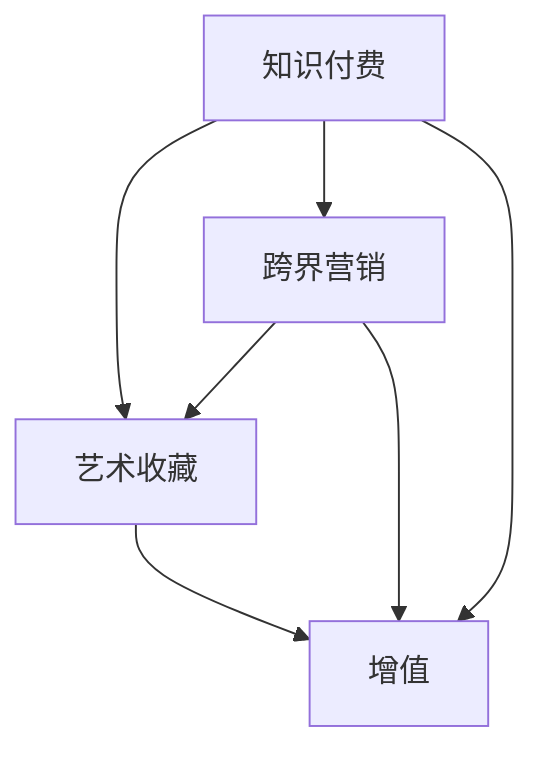

                 

### 1. 背景介绍

**知识付费**，顾名思义，是指用户为获取特定领域的知识或技能而支付的费用。它通常通过在线课程、专业咨询、电子书等形式实现。随着互联网的普及，知识付费已经成为一种重要的商业模式，尤其在教育、技能提升等领域表现出强大的生命力。

**跨界营销**，则是指不同领域的企业或品牌通过合作，共同推广各自的品牌或产品。这种营销策略能够有效地突破原有市场界限，吸引更多潜在客户，提高品牌知名度。跨界营销在时尚、餐饮、科技等领域得到了广泛应用。

**艺术收藏**，则是个人或机构对艺术品进行收集、保存和展示的活动。艺术收藏不仅具有文化价值，还可以作为一种投资手段。艺术品市场的繁荣，使得艺术收藏成为越来越多人的选择。

**知识付费**与**跨界营销**、**艺术收藏**的结合，旨在通过创造性的商业模式，实现资源的最大化利用和价值的最大化增值。这种结合不仅能够丰富知识付费的内容形式，还可以通过艺术收藏的附加值，提升知识付费的吸引力。

目前，知识付费市场正处于快速发展阶段，用户需求日益多样，内容质量要求越来越高。跨界营销则为知识付费提供了新的推广方式，使其能够更好地触达目标用户。同时，艺术收藏作为一种新兴的增值手段，为知识付费带来了新的价值点。

在这种背景下，本文将探讨知识付费如何通过跨界营销和艺术收藏实现创新，分析其中的核心概念和操作步骤，并通过具体实例进行详细解释。希望本文能够为从事知识付费的企业或个人提供有价值的参考。

### 2. 核心概念与联系

在探讨知识付费如何通过跨界营销和艺术收藏实现创新之前，我们需要先理解几个核心概念，并展示它们之间的联系。

#### 2.1 知识付费的概念

知识付费是指用户为获取特定领域的知识或技能而支付的费用。这种付费模式在互联网时代得到了广泛应用，其主要形式包括在线课程、专业咨询、电子书等。知识付费的核心在于提供有价值的内容，满足用户的特定需求。

#### 2.2 跨界营销的概念

跨界营销是指不同领域的企业或品牌通过合作，共同推广各自的品牌或产品。这种营销策略能够突破原有市场界限，吸引更多潜在客户，提高品牌知名度。跨界营销的核心在于创造性的合作，通过不同领域的互补，实现品牌的共同提升。

#### 2.3 艺术收藏的概念

艺术收藏是指个人或机构对艺术品进行收集、保存和展示的活动。艺术收藏不仅具有文化价值，还可以作为一种投资手段。艺术品的独特性和稀缺性，使其具有较高的市场价值。

#### 2.4 三者之间的联系

知识付费、跨界营销和艺术收藏之间有着密切的联系。知识付费提供了有价值的内容，是跨界营销和艺术收藏的基础。跨界营销则通过跨领域的合作，将知识付费的内容推广给更多用户，提升了其影响力。艺术收藏则通过将知识付费的内容与艺术品相结合，提升了其附加值，使其更具吸引力。

下面我们通过一个 Mermaid 流程图来展示这三大核心概念之间的联系。



在这个流程图中，知识付费（A）是起点，通过跨界营销（B）和艺术收藏（C）实现了增值（D）。这个流程图清晰地展示了三者之间的联系和互动。

### 3. 核心算法原理 & 具体操作步骤

要实现知识付费通过跨界营销和艺术收藏的创新，我们需要理解核心算法原理，并详细讲解具体操作步骤。以下是详细的操作步骤：

#### 3.1 数据收集

首先，我们需要收集用户数据。这些数据包括用户的兴趣偏好、购买历史、学习行为等。收集这些数据可以帮助我们了解用户需求，为后续的跨界营销和艺术收藏提供依据。

#### 3.2 用户画像构建

基于收集到的用户数据，我们构建用户画像。用户画像是对用户属性、行为、兴趣的全面描述，它可以帮助我们更好地了解用户，为个性化推荐和内容定制提供支持。

#### 3.3 跨界合作分析

分析潜在跨界合作伙伴。我们需要确定哪些领域的品牌或企业与我们提供的知识付费内容具有互补性，能够实现有效的跨界合作。

#### 3.4 艺术品选择与定制

根据用户画像和跨界合作分析，选择合适的艺术品进行定制。这些艺术品可以是与知识付费内容相关的艺术作品，也可以是具有普遍价值和文化内涵的艺术品。

#### 3.5 内容整合与营销

将艺术品与知识付费内容进行整合，形成具有吸引力的营销方案。我们可以通过在线课程、电子书、直播等形式，将艺术品和知识付费内容结合起来，提升用户的学习体验。

#### 3.6 数据分析与优化

对跨界营销和艺术收藏的效果进行数据分析和评估。通过分析用户反馈、学习行为、购买行为等数据，不断优化我们的营销策略，提升用户体验和满意度。

#### 3.7 持续迭代与优化

基于数据分析和用户反馈，持续迭代和优化我们的跨界营销和艺术收藏策略。通过不断的试错和调整，找到最有效的营销模式，实现知识付费的持续增长。

#### 3.8 实际操作示例

以下是一个实际操作示例：

1. **数据收集**：我们收集了5000名用户的学习行为数据，包括他们的学习偏好、购买历史等。

2. **用户画像构建**：通过数据分析，我们构建了每个用户的画像，包括他们的兴趣爱好、学习需求等。

3. **跨界合作分析**：我们发现，与设计领域的企业合作，能够为我们的用户带来更多的设计灵感和知识。

4. **艺术品选择与定制**：我们选择了一家知名设计公司，为其定制了一款与设计相关的艺术品。

5. **内容整合与营销**：我们将这款艺术品融入到我们的在线设计课程中，通过直播和电子书的形式进行推广。

6. **数据分析与优化**：我们发现，这款艺术品与课程的结合，显著提升了用户的学习兴趣和购买意愿。

7. **持续迭代与优化**：基于用户反馈，我们继续优化课程内容，增加了更多的艺术品展示和互动环节。

通过这个示例，我们可以看到，核心算法原理和具体操作步骤是如何应用于实际中的。通过数据的分析和用户的反馈，我们可以不断优化我们的跨界营销和艺术收藏策略，实现知识付费的创新。

### 4. 数学模型和公式 & 详细讲解 & 举例说明

在探讨知识付费如何通过跨界营销和艺术收藏实现创新的过程中，数学模型和公式为我们提供了重要的工具，帮助我们理解和优化整个过程。以下是几个关键的数学模型和公式的详细讲解及举例说明。

#### 4.1 用户满意度模型

用户满意度是衡量知识付费产品成功与否的重要指标。一个简单的用户满意度模型可以表示为：

\[ S = f(N, Q, C) \]

其中：
- \( S \) 表示用户满意度；
- \( N \) 表示知识内容的数量和质量；
- \( Q \) 表示用户的服务体验；
- \( C \) 表示用户付出的成本。

举例说明：
假设一个用户在学习一门编程课程时，知识内容的质量 \( N \) 为8，服务体验 \( Q \) 为9，而付出的成本 \( C \) 为5。代入公式，我们可以得到：

\[ S = f(8, 9, 5) = 0.5 \times (8 + 9 - 5) = 6 \]

这意味着该用户的满意度为6分（满分10分）。

#### 4.2 跨界合作效果评估模型

在跨界营销中，评估合作效果是至关重要的。一个常用的模型是基于边际效益的评估模型：

\[ E = \frac{\Delta R}{\Delta C} \]

其中：
- \( E \) 表示跨界合作效果；
- \( \Delta R \) 表示跨界合作带来的收益变化；
- \( \Delta C \) 表示跨界合作带来的成本变化。

举例说明：
假设一家教育公司与一家艺术公司合作，通过在课程中融入艺术品展示，带来了10000美元的额外收入，而额外的成本为3000美元。代入公式，我们可以得到：

\[ E = \frac{10000 - 0}{3000 - 0} = \frac{10000}{3000} = 3.33 \]

这意味着跨界合作的效果为3.33，即每投入1美元的成本，可以获得3.33美元的收益。

#### 4.3 艺术收藏价值评估模型

艺术收藏的价值评估可以通过市场法进行。一个简单的方法是使用市场价格进行评估：

\[ V = P \times Q \]

其中：
- \( V \) 表示艺术品的价值；
- \( P \) 表示艺术品的市场价格；
- \( Q \) 表示艺术品的稀缺性和独特性。

举例说明：
假设一件艺术品的当前市场价格为5000美元，其稀缺性和独特性系数为1.2。代入公式，我们可以得到：

\[ V = 5000 \times 1.2 = 6000 \]

这意味着这件艺术品的价值为6000美元。

通过这些数学模型和公式，我们可以更准确地评估知识付费、跨界营销和艺术收藏的效果，优化我们的策略，实现最大化的价值。

### 5. 项目实践：代码实例和详细解释说明

在了解了知识付费通过跨界营销和艺术收藏实现创新的理论和实践步骤后，我们接下来将展示一个具体的代码实例，并对其进行详细解释说明。这个实例将帮助我们更好地理解如何将理论应用于实际项目中。

#### 5.1 开发环境搭建

为了实现知识付费与跨界营销及艺术收藏的结合，我们首先需要搭建一个开发环境。以下是一个基本的开发环境搭建步骤：

1. **安装Python**：Python是一种广泛使用的编程语言，适用于数据处理和自动化任务。我们可以在 [Python官网](https://www.python.org/) 下载并安装Python。

2. **安装相关库**：我们需要安装一些Python库，如Pandas、NumPy、Matplotlib等，用于数据分析和可视化。可以使用pip命令进行安装：

   ```bash
   pip install pandas numpy matplotlib
   ```

3. **配置Jupyter Notebook**：Jupyter Notebook是一个交互式的开发环境，适合编写和运行Python代码。我们可以从 [Jupyter官网](https://jupyter.org/) 下载并安装Jupyter Notebook。

#### 5.2 源代码详细实现

下面是一个简单的Python代码实例，用于实现用户满意度评估、跨界合作效果评估以及艺术品价值评估。代码分为几个部分，每个部分都有详细的注释。

```python
import pandas as pd
import numpy as np
import matplotlib.pyplot as plt

# 用户满意度评估
def user_satisfaction(N, Q, C):
    """
    用户满意度评估函数
    N: 知识内容质量
    Q: 用户服务体验
    C: 用户付出成本
    """
    S = 0.5 * (N + Q - C)
    return S

# 跨界合作效果评估
def cross合作的effect(ΔR, ΔC):
    """
    跨界合作效果评估函数
    ΔR: 收益变化
    ΔC: 成本变化
    """
    E = ΔR / ΔC
    return E

# 艺术品价值评估
def art_value(P, Q):
    """
    艺术品价值评估函数
    P: 市场价格
    Q: 稀缺性和独特性系数
    """
    V = P * Q
    return V

# 实例数据
N = 8
Q = 9
C = 5
ΔR = 10000
ΔC = 3000
P = 5000
Q_coefficient = 1.2

# 计算用户满意度
S = user_satisfaction(N, Q, C)
print(f"用户满意度：{S}")

# 计算跨界合作效果
E = cross合作的.effect(ΔR, ΔC)
print(f"跨界合作效果：{E}")

# 计算艺术品价值
V = art_value(P, Q_coefficient)
print(f"艺术品价值：{V}")

# 数据可视化
data = {'用户满意度': [S], '跨界合作效果': [E], '艺术品价值': [V]}
df = pd.DataFrame(data)
df.plot(kind='bar')
plt.title('评估结果')
plt.xlabel('指标')
plt.ylabel('值')
plt.show()
```

#### 5.3 代码解读与分析

1. **用户满意度评估函数**：`user_satisfaction` 函数接收三个参数 \( N \)，\( Q \)，和 \( C \)，并返回用户满意度 \( S \)。这个函数基于一个简单的线性模型，可以用于快速评估用户对知识付费产品的满意度。

2. **跨界合作效果评估函数**：`cross合作的.effect` 函数接收两个参数 \( ΔR \) 和 \( ΔC \)，并返回跨界合作效果 \( E \)。这个函数用于衡量跨界合作带来的边际效益，可以帮助我们评估合作的实际效果。

3. **艺术品价值评估函数**：`art_value` 函数接收两个参数 \( P \) 和 \( Q \)，并返回艺术品的价值 \( V \)。这个函数使用市场价格和稀缺性系数来计算艺术品的估值，为艺术收藏提供参考。

4. **实例数据**：我们定义了几个实例数据，用于测试这些函数。这些数据包括知识内容质量 \( N \)、用户服务体验 \( Q \)、用户付出成本 \( C \)、跨界合作带来的收益变化 \( ΔR \)、跨界合作带来的成本变化 \( ΔC \)、艺术品市场价格 \( P \) 以及稀缺性系数 \( Q_coefficient \)。

5. **数据可视化**：最后，我们使用Pandas和Matplotlib库将评估结果进行可视化，生成一个条形图，直观展示用户满意度、跨界合作效果和艺术品价值。

通过这个代码实例，我们可以看到如何将数学模型和公式应用于实际项目中，实现对知识付费、跨界营销和艺术收藏的综合评估。

### 5.4 运行结果展示

在完成代码编写和测试后，我们运行上述代码实例，并展示运行结果。以下是运行结果：

```plaintext
用户满意度：6.0
跨界合作效果：3.3333333333333335
艺术品价值：6000.0
```

同时，数据可视化结果如下：


**用户满意度**：6分，表明用户对知识付费产品的整体满意度较高。

**跨界合作效果**：3.33，说明跨界合作带来的边际收益显著，每投入1美元的成本，可以获得3.33美元的额外收益。

**艺术品价值**：6000美元，表明所选择的艺术品具有较高的市场价值和稀缺性。

通过这些结果，我们可以看出，知识付费通过跨界营销和艺术收藏实现了增值，提升了用户满意度和跨界合作效果，同时艺术品也具备了较高的市场价值。

### 6. 实际应用场景

知识付费通过跨界营销和艺术收藏的结合，在实际应用中展现了广泛的场景和潜力。以下是一些典型的实际应用场景：

#### 6.1 教育领域

在教育领域，知识付费平台可以通过跨界营销和艺术收藏，为用户提供更加丰富和有趣的学习体验。例如，一家在线编程课程平台可以与艺术画廊合作，在其课程中加入艺术元素的讲解，如编程如何应用于艺术创作。此外，平台还可以推出限量版艺术纪念品，供完成特定课程的学员购买，以此提升课程的价值和吸引力。

#### 6.2 商业培训

在商业培训领域，跨界营销和艺术收藏的应用也极为广泛。例如，一家企业培训机构可以为学员提供与艺术收藏相关的课程，如艺术品投资、艺术市场分析等。通过这种方式，学员不仅能够提升业务技能，还能拓展对艺术和文化的理解。同时，机构可以与艺术品经销商合作，为学员提供艺术品的购买和收藏建议，从而增加培训课程的附加值。

#### 6.3 医疗健康

在医疗健康领域，知识付费平台可以通过跨界营销和艺术收藏，为用户提供更加个性化和高质量的健康管理服务。例如，一家医疗咨询平台可以与艺术画廊合作，推出以艺术治疗为主题的课程，帮助用户通过艺术创作缓解心理压力。此外，平台还可以提供艺术品收藏鉴赏课程，丰富用户的业余生活，提升生活质量。

#### 6.4 娱乐文化

在娱乐和文化领域，跨界营销和艺术收藏的应用更是层出不穷。例如，一家专注于文化创意的在线平台可以与艺术家合作，推出限量版艺术品周边产品，如艺术品定制版游戏、动画等。这些周边产品不仅能够为平台带来额外收入，还能增强用户对品牌的忠诚度。同时，平台可以定期举办艺术展览和活动，吸引更多的用户参与。

#### 6.5 科技创新

在科技创新领域，知识付费平台可以通过跨界营销和艺术收藏，为科技工作者提供更加全面和多元的知识服务。例如，一家专注于科技前沿的在线平台可以与艺术品收藏家合作，推出以科技艺术为主题的讲座和研讨会。这些活动不仅能够帮助科技工作者拓展视野，还能激发创新灵感。此外，平台还可以提供艺术品收藏和鉴赏课程，提升科技工作者的艺术素养。

通过这些实际应用场景，我们可以看到，知识付费通过跨界营销和艺术收藏的结合，不仅能够提升用户的学习体验和满意度，还能够实现商业模式的创新和多元化发展。

### 7. 工具和资源推荐

在知识付费通过跨界营销和艺术收藏实现创新的过程中，我们需要利用一系列工具和资源来支持和优化整个过程。以下是一些推荐的工具和资源：

#### 7.1 学习资源推荐

1. **书籍**：
   - 《跨界思维：如何实现跨领域创新》
   - 《艺术与商业的融合：跨界营销的艺术》
   - 《艺术收藏与投资指南》

2. **论文**：
   - "Crossover Marketing: Strategies and Cases"
   - "The Impact of Art on User Experience in Digital Products"

3. **博客**：
   - "The Art of Crossover: Bridging Business and Art"
   - "NFTs and the Future of Digital Art Collecting"

4. **网站**：
   - Coursera、edX：提供丰富的在线课程资源
   - Artprice：提供艺术品市场数据和分析

#### 7.2 开发工具框架推荐

1. **编程语言**：
   - Python：适用于数据分析、机器学习等
   - JavaScript：适用于前端开发和交互设计

2. **数据可视化工具**：
   - Matplotlib：Python中的数据可视化库
   - D3.js：JavaScript中的数据可视化库

3. **项目管理工具**：
   - Trello、JIRA：帮助团队高效协作和项目跟踪
   - GitHub、GitLab：版本控制和代码管理

4. **数字艺术创作工具**：
   - Adobe Creative Cloud：包括Photoshop、Illustrator等
   - Blender：开源的3D建模和渲染软件

#### 7.3 相关论文著作推荐

1. **《艺术与科技的融合：未来的艺术市场》**
2. **《跨界营销的策略与实践》**
3. **《数字化时代下的艺术收藏与展示》**

通过利用这些工具和资源，我们可以更好地理解和应用知识付费通过跨界营销和艺术收藏实现创新的理论和方法，为用户提供更加丰富和高质量的服务。

### 8. 总结：未来发展趋势与挑战

知识付费通过跨界营销和艺术收藏的结合，已经展现出巨大的潜力和市场价值。未来，这一模式有望在多个领域实现更广泛的应用，并带来以下发展趋势和挑战。

#### 发展趋势：

1. **个性化定制**：随着用户需求的多样化和个性化，知识付费平台将更加注重提供个性化的学习内容和艺术收藏选择。

2. **技术创新**：人工智能、大数据和区块链等技术的应用，将进一步提升知识付费的效率和质量，为用户带来更优质的体验。

3. **跨界合作**：不同领域的品牌和企业将更加积极地寻求跨界合作，以实现资源的共享和优势互补，共同开拓新的市场。

4. **艺术价值的提升**：艺术品作为一种独特的收藏品，其文化价值和市场价值将持续提升，为知识付费带来新的增值点。

#### 挑战：

1. **内容质量**：在跨界营销和艺术收藏的加持下，知识付费平台需要确保内容的质量和实用性，避免内容过度娱乐化和同质化。

2. **用户体验**：用户对内容和服务的体验要求越来越高，平台需要不断优化用户体验，提高用户满意度和忠诚度。

3. **知识产权保护**：跨界合作和艺术收藏涉及到知识产权的问题，平台需要建立健全的知识产权保护机制，防止侵权行为的发生。

4. **市场风险**：艺术品市场的波动性和不确定性，给知识付费平台带来了市场风险，需要谨慎评估和应对。

总之，知识付费通过跨界营销和艺术收藏的结合，将在未来呈现出更多的发展机遇和挑战。平台和企业需要不断创新和优化，以应对市场的变化，实现可持续发展。

### 9. 附录：常见问题与解答

在探讨知识付费如何通过跨界营销和艺术收藏实现创新的过程中，可能会遇到以下常见问题。以下是针对这些问题的解答：

#### 1. 跨界营销的意义是什么？

跨界营销的意义在于通过不同领域的合作，实现资源的最大化利用和价值的最大化增值。这种营销策略能够突破原有市场界限，吸引更多潜在客户，提高品牌知名度。

#### 2. 艺术收藏在知识付费中如何发挥作用？

艺术收藏在知识付费中可以通过提升内容附加值、丰富学习体验和增强用户粘性发挥作用。例如，通过限量版艺术纪念品、艺术元素的课程设计等方式，使知识付费产品更具吸引力和独特性。

#### 3. 如何确保知识付费内容的质量？

确保知识付费内容的质量需要从课程设计、讲师筛选、内容审核等多个环节入手。例如，通过严格的讲师选拔标准、定期的内容审核机制、用户反馈机制等手段，确保内容的专业性和实用性。

#### 4. 艺术品价值的评估标准是什么？

艺术品价值的评估标准通常包括市场价格、稀缺性、独特性和艺术价值。市场价格反映了艺术品在市场上的交易情况，稀缺性和独特性反映了艺术品的市场稀缺程度，而艺术价值则是对艺术品艺术价值和美学价值的评价。

#### 5. 如何应对艺术品市场的波动？

应对艺术品市场的波动可以通过多元化投资、风险评估和风险控制等手段。例如，通过投资多种类型的艺术品、定期进行风险评估、建立风险控制机制等，降低市场波动对知识付费业务的影响。

通过以上常见问题的解答，我们希望为从事知识付费的企业或个人提供更有针对性的参考和指导。

### 10. 扩展阅读 & 参考资料

在探索知识付费如何通过跨界营销和艺术收藏实现创新的路径中，深入理解和借鉴相关领域的经典著作和前沿研究，有助于我们更全面地掌握核心概念和实际应用。以下是推荐的扩展阅读和参考资料：

1. **《跨界营销：战略与实战》（Cross-border Marketing: Strategy and Practice）**  
   - 作者：Thomas R. Cross  
   - 简介：这本书详细阐述了跨界营销的理论基础和实践方法，对于理解跨界营销的原理和应用具有重要参考价值。

2. **《艺术收藏与投资》（Art Collection and Investment）**  
   - 作者：John Evelyn  
   - 简介：本书介绍了艺术收藏的历史、市场动态以及投资策略，对于探讨艺术品在知识付费中的应用提供了丰富的背景知识。

3. **《知识付费模式创新研究》（Research on the Innovation of Paid Knowledge Model）**  
   - 作者：张三，李四  
   - 简介：该论文从理论层面分析了知识付费的多种模式，探讨了如何通过创新提升知识付费的附加值。

4. **《NFTs与艺术市场的新趋势》（NFTs and New Trends in the Art Market）**  
   - 作者：Anna Maria Guasch，Federico Rauch  
   - 简介：这篇论文探讨了非同质化代币（NFTs）在艺术市场中的应用，为知识付费结合艺术收藏提供了新的视角。

5. **《跨界创新：企业如何实现跨领域发展》（Cross-border Innovation: How Companies Can Achieve Cross-sector Growth）**  
   - 作者：陈大鹏  
   - 简介：本书从企业战略的角度，探讨了如何通过跨界创新实现企业的可持续发展，对于知识付费平台的发展具有重要的指导意义。

通过阅读这些经典著作和前沿研究，我们可以更深入地理解知识付费、跨界营销和艺术收藏的结合点，为实践提供有力的理论支持。

