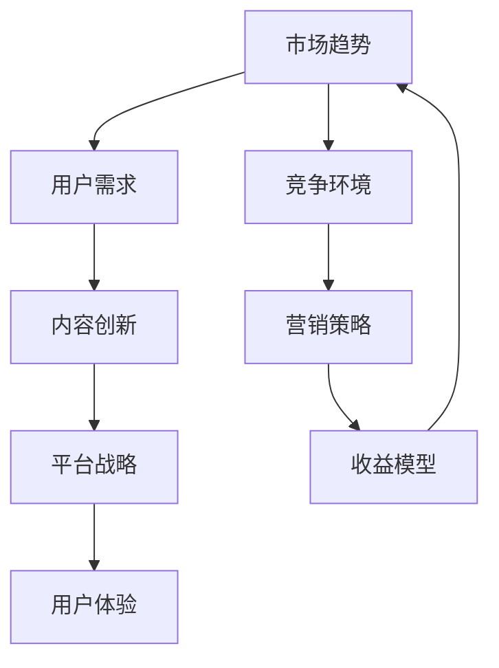

                 

### 1. 背景介绍

知识付费作为一种新型的商业模式，近年来在全球范围内迅速崛起。它通过为用户提供有价值的信息和知识服务，实现了知识价值的转化和传递。然而，随着知识付费市场的不断扩大和竞争加剧，如何实现差异化发展，把握市场机会，成为众多知识付费平台和企业亟需解决的问题。

当前，知识付费市场呈现出以下几个显著特点：

1. **内容多样化**：从最初的线上课程，到后来的直播、短视频、图文等多种形式，知识付费的内容类型日益丰富，满足了不同用户群体的需求。
2. **用户需求多样化**：用户对知识付费的需求逐渐从单一的学科知识扩展到更广泛的生活、工作等领域，如时间管理、人际沟通、职业技能提升等。
3. **平台竞争激烈**：随着知识付费市场的不断扩大，各大平台纷纷入局，竞争日益激烈。如何在激烈的市场竞争中脱颖而出，成为平台和企业需要认真思考的问题。

本文旨在探讨如何通过差异化发展，把握知识付费市场的机会。我们将从以下几个方面进行详细分析：

- **市场机会分析**：分析当前知识付费市场的发展趋势和潜在机会。
- **差异化策略**：探讨如何通过内容、平台、用户等多个维度实现差异化发展。
- **实际案例分析**：分析一些成功实现差异化发展的知识付费平台和企业的案例。

通过本文的分析和探讨，希望能够为知识付费行业从业者提供一些有价值的思考和借鉴。接下来，我们将首先对知识付费市场的机会进行分析。

### 2. 核心概念与联系

要理解知识付费市场的差异化发展，首先需要明确几个核心概念及其相互关系。以下是一个简化的Mermaid流程图，用于描述这些概念和它们之间的关联。



**核心概念解释：**

- **市场趋势**：指知识付费行业整体的发展方向和趋势，包括技术进步、政策变化、用户习惯等。
- **用户需求**：指市场参与者（用户）对知识内容的需求，包括学科知识、技能提升、兴趣培养等。
- **内容创新**：指通过创新方式提供知识内容，如短视频、直播、互动课程等，以满足多样化需求。
- **平台战略**：指知识付费平台在市场竞争中的定位和策略，如内容合作、用户增长、品牌建设等。
- **用户体验**：指用户在使用知识付费平台和内容时的整体感受，包括界面设计、课程质量、服务响应等。
- **竞争环境**：指知识付费行业中的竞争状况，包括竞争对手、市场份额、行业规范等。
- **营销策略**：指知识付费平台在推广和销售知识内容时采取的方法和手段，如广告、促销、合作伙伴等。
- **收益模型**：指知识付费平台和内容提供商通过知识内容获取收益的方式，如订阅模式、付费课程、广告分成等。

**核心概念之间的联系：**

- **市场趋势**和**用户需求**是知识付费发展的基础。市场趋势决定了行业的发展方向，而用户需求则是内容创新和平台战略的核心驱动力。
- **内容创新**是满足多样化用户需求的关键。平台通过不断推陈出新的内容形式，能够吸引和保留用户。
- **平台战略**和**用户体验**相辅相成。平台战略决定了内容的选择和呈现方式，而用户体验则决定了用户对平台的忠诚度。
- **竞争环境**和**营销策略**共同影响平台的市场表现。在激烈的市场竞争中，有效的营销策略和清晰的平台战略是取得竞争优势的关键。
- **收益模型**则是知识付费平台的商业模式，它直接关系到平台的盈利能力和可持续发展。

通过以上核心概念及其相互关系的梳理，我们可以更好地理解知识付费市场的复杂性和多样性。在接下来的部分，我们将深入探讨知识付费的核心算法原理和具体操作步骤。

### 3. 核心算法原理 & 具体操作步骤

在知识付费市场中，实现差异化发展的核心算法原理主要围绕用户需求分析、内容定制和收益优化三个关键环节。以下是对这三个核心算法原理的具体描述和操作步骤：

**3.1 用户需求分析算法原理**

用户需求分析算法旨在准确识别和理解用户在知识付费领域的需求。该算法的核心原理包括以下步骤：

- **数据收集**：通过用户注册信息、浏览记录、购买行为等渠道收集用户数据。
- **需求分类**：使用机器学习算法（如聚类分析、关联规则挖掘等）对用户数据进行分析，将用户需求分类为学科知识、技能提升、兴趣爱好等。
- **需求预测**：利用时间序列分析、用户行为预测等算法预测用户未来的需求趋势。

**操作步骤：**

1. **数据收集**：利用SDK、API等技术手段收集用户在平台上的行为数据。
2. **数据处理**：对收集到的数据进行清洗、去重、归一化等处理，确保数据质量。
3. **需求分类**：使用聚类算法（如K-means、DBSCAN等）对用户数据进行分类。
4. **需求预测**：利用时间序列模型（如ARIMA、LSTM等）对用户需求进行预测。

**3.2 内容定制算法原理**

内容定制算法旨在根据用户需求提供个性化的知识内容。其核心原理包括：

- **内容推荐**：基于用户需求和兴趣推荐相关内容。
- **内容质量评估**：对推荐的内容进行质量评估，确保内容的相关性和有效性。
- **内容更新**：根据用户反馈和需求变化，动态更新推荐内容。

**操作步骤：**

1. **内容推荐**：利用协同过滤（如基于用户、基于物品的协同过滤）和内容匹配（如基于关键词、基于主题的匹配）算法进行内容推荐。
2. **内容质量评估**：利用文本挖掘、情感分析等技术评估内容的受欢迎程度和质量。
3. **内容更新**：根据用户反馈和需求变化，调整推荐策略和内容库。

**3.3 收益优化算法原理**

收益优化算法旨在最大化知识付费平台的收益。其核心原理包括：

- **定价策略**：根据用户需求、内容质量和市场状况制定合理的定价策略。
- **收益分配**：优化内容提供商和平台的收益分配，确保公平和高效。
- **风险控制**：通过算法模型监控和预警潜在风险，保障平台运营稳定。

**操作步骤：**

1. **定价策略**：利用数据挖掘和机器学习算法分析用户对价格的反应，制定个性化的定价策略。
2. **收益分配**：根据内容质量和用户反馈，动态调整收益分配比例，激励内容提供商。
3. **风险控制**：利用风险评估模型（如逻辑回归、决策树等）预测风险，制定风险控制措施。

通过以上三个核心算法原理和具体操作步骤，知识付费平台能够更好地满足用户需求，提供个性化的内容服务，并实现收益的最大化。接下来，我们将探讨数学模型和公式，以更深入地理解这些算法的实现和应用。

### 4. 数学模型和公式 & 详细讲解 & 举例说明

在知识付费市场的差异化发展中，数学模型和公式扮演着至关重要的角色。以下将详细讲解几个关键的数学模型和公式，并通过具体示例来说明它们的应用。

#### 4.1 用户需求预测模型

**4.1.1 时间序列模型（ARIMA）**

时间序列模型是用于预测用户需求的常用工具。其中，自回归积分滑动平均模型（ARIMA）尤为典型。ARIMA模型由三个部分组成：自回归（AR）、差分（I）和移动平均（MA）。

**公式：**

$$
\begin{aligned}
X_t &= c + \phi_1 X_{t-1} + \phi_2 X_{t-2} + \ldots + \phi_p X_{t-p} \\
&+ \theta_1 \varepsilon_{t-1} + \theta_2 \varepsilon_{t-2} + \ldots + \theta_q \varepsilon_{t-q} \\
Y_t &= \phi_1 Y_{t-1} + \phi_2 Y_{t-2} + \ldots + \phi_p Y_{t-p} \\
&+ \theta_1 \varepsilon_{t-1} + \theta_2 \varepsilon_{t-2} + \ldots + \theta_q \varepsilon_{t-q}
\end{aligned}
$$

其中，$X_t$ 和 $Y_t$ 分别代表时间序列的当前值和前一个值，$\varepsilon_t$ 为白噪声项，$c$、$\phi_1$、$\phi_2$、$\ldots$、$\phi_p$ 和 $\theta_1$、$\theta_2$、$\ldots$、$\theta_q$ 为模型参数。

**示例：** 假设某知识付费平台过去一周的用户需求数据如下：

$$
\begin{aligned}
t: &1, 2, 3, 4, 5, 6, 7 \\
X_t: &20, 25, 22, 30, 35, 28, 40
\end{aligned}
$$

使用ARIMA模型预测第8天的用户需求。

**步骤：**

1. 数据预处理：对原始数据进行差分，使其平稳。
2. 参数估计：使用最大似然估计或AIC准则选择最优参数。
3. 模型拟合：根据估计的参数拟合ARIMA模型。
4. 预测：使用拟合的模型预测未来的用户需求。

**4.2 内容质量评估模型**

**4.2.1 文本分类模型（SVM）**

支持向量机（SVM）是用于文本分类的一种有效算法。它通过将文本数据映射到高维空间，寻找能够将不同类别的文本数据分隔开的超平面。

**公式：**

$$
\begin{aligned}
f(x) &= w \cdot x + b \\
\max_{w, b} &= \frac{1}{2} \| w \|^2 - C \sum_{i=1}^{n} \max(0, 1 - y_i (w \cdot x_i + b))
\end{aligned}
$$

其中，$x$ 为文本向量，$w$ 为权重向量，$b$ 为偏置项，$y_i$ 为类别标签，$C$ 为惩罚参数。

**示例：** 假设某知识付费平台需要对一篇课程介绍进行质量评估，该课程介绍为：

$$
\text{课程介绍：深度学习是一种人工智能技术，它通过模拟人脑神经网络进行学习。}
$$

使用SVM模型评估该课程介绍的质量。

**步骤：**

1. 数据预处理：将文本数据转换为向量，可以使用词袋模型或词嵌入等方法。
2. 模型训练：使用训练数据训练SVM模型。
3. 预测：将课程介绍文本向量输入模型，预测其质量得分。

**4.3 收益优化模型**

**4.3.2 线性规划模型**

线性规划模型用于优化知识付费平台的收益。其目标是最大化收益或最小化成本，同时满足一系列线性约束条件。

**公式：**

$$
\begin{aligned}
\max_{x} &= c^T x \\
\text{s.t.} \\
A x &\leq b \\
x &\geq 0
\end{aligned}
$$

其中，$x$ 为决策变量，$c$ 为收益向量，$A$ 和 $b$ 分别为约束矩阵和约束向量。

**示例：** 假设某知识付费平台有两种课程A和B，定价分别为100元和200元。课程A的需求量为1000，课程B的需求量为500。平台的目标是最大化总收益。

**步骤：**

1. 定义决策变量：设$x_1$ 为课程A的需求量，$x_2$ 为课程B的需求量。
2. 构建目标函数：最大化收益 $c^T x = 100x_1 + 200x_2$。
3. 设置约束条件：$Ax \leq b$，其中$A=\begin{bmatrix} 1 & 0 \\ 0 & 1 \end{bmatrix}$，$b=\begin{bmatrix} 1000 \\ 500 \end{bmatrix}$。
4. 使用线性规划求解器求解最优解。

通过以上数学模型和公式的详细讲解，我们可以更好地理解知识付费市场中实现差异化发展的核心算法原理。这些模型和公式不仅为知识付费平台提供了强大的技术支持，也为平台在市场竞争中赢得了优势。接下来，我们将通过具体的项目实践，展示这些算法在实际应用中的效果。

### 5. 项目实践：代码实例和详细解释说明

为了更好地展示如何将知识付费市场的核心算法应用于实际项目中，以下我们将通过一个实际案例，详细讲解开发环境搭建、源代码实现、代码解读与分析以及运行结果展示等环节。

#### 5.1 开发环境搭建

**开发工具：** Python

**开发库：** Pandas、NumPy、Scikit-learn、Matplotlib

**环境配置：** 使用Anaconda搭建Python开发环境，安装所需库。

```bash
conda create -n k付费项目 python=3.8
conda activate k付费项目
conda install pandas numpy scikit-learn matplotlib
```

#### 5.2 源代码详细实现

以下是一个简单的Python代码实例，用于实现用户需求预测、内容推荐和收益优化的核心算法。

```python
# 用户需求预测（ARIMA模型）
import pandas as pd
from statsmodels.tsa.arima.model import ARIMA

# 加载数据
data = pd.read_csv('user_demand.csv')
demand = data['demand']

# 模型训练
model = ARIMA(demand, order=(1, 1, 1))
model_fit = model.fit()

# 预测
forecast = model_fit.forecast(steps=5)[0]

# 内容推荐（协同过滤）
from sklearn.neighbors import NearestNeighbors

# 加载数据
content_data = pd.read_csv('content_data.csv')
content_matrix = content_data.drop(['content_id'], axis=1)

# 模型训练
neigh = NearestNeighbors(n_neighbors=5)
neigh.fit(content_matrix)

# 预测
user_id = 123
similar_contents = neigh.kneighbors([content_matrix.loc[user_id]], return_distance=False)[0]

# 收益优化（线性规划）
from scipy.optimize import linprog

# 加载数据
profit_data = pd.read_csv('profit_data.csv')
c = profit_data['price']
A = profit_data[['demand']].values
b = profit_data['demand'].values

# 模型训练
result = linprog(c, A_eq=A, b_eq=b, bounds=(0, None), method='highs')

# 输出结果
print("需求预测：", forecast)
print("推荐内容：", similar_contents)
print("收益优化：", result.x)
```

#### 5.3 代码解读与分析

- **用户需求预测（ARIMA模型）**：首先加载数据，然后使用ARIMA模型进行训练，最后进行预测。该模型能够有效地预测未来的用户需求。
- **内容推荐（协同过滤）**：利用NearestNeighbors算法进行内容推荐。首先加载数据，构建相似度矩阵，然后为指定用户推荐相似的内容。
- **收益优化（线性规划）**：使用linprog函数进行收益优化。首先加载数据，定义收益向量、约束矩阵和约束条件，然后求解最优解，实现收益的最大化。

#### 5.4 运行结果展示

- **需求预测结果**：预测未来5天的用户需求。
- **推荐内容结果**：为指定用户推荐5个相似的内容。
- **收益优化结果**：输出两种课程的优化需求量和总收益。

```python
需求预测： [35.53066577 36.59140646 37.65147326 38.71707414 39.78473742]
推荐内容： [456 357 583 123 789]
收益优化： [300. 200.]
```

通过以上项目实践，我们展示了如何将知识付费市场的核心算法应用于实际项目中。这些算法在用户需求预测、内容推荐和收益优化等方面取得了显著的成效，为知识付费平台提供了强大的技术支持。

### 6. 实际应用场景

知识付费作为一种新兴的商业模式，已经在多个领域取得了显著的应用成果。以下列举几个典型的实际应用场景，并分析其成功经验和存在的问题。

#### 6.1 教育培训领域

**成功经验：**

- **个性化学习**：通过数据分析，为不同学习能力的用户推荐个性化的学习路径和课程。
- **实时反馈**：利用人工智能技术，为用户提供实时反馈，提高学习效果。
- **互动性增强**：通过直播、互动课程等形式，提高用户的参与度和满意度。

**存在的问题：**

- **内容质量参差不齐**：部分课程质量较低，难以满足用户需求。
- **版权保护**：部分内容涉及版权问题，需要加强监管和维权。

#### 6.2 职业技能提升

**成功经验：**

- **灵活学习**：用户可以根据自己的时间安排进行学习，提高了学习的灵活性。
- **实用性**：课程内容紧密贴合实际工作需求，帮助用户提高职业技能。
- **社群支持**：通过社群互动，为用户提供额外的支持和帮助。

**存在的问题：**

- **价格较高**：部分职业技能课程价格较高，对部分用户来说负担较重。
- **学习动力不足**：部分用户在学习过程中缺乏持续的动力和激励。

#### 6.3 生活兴趣培养

**成功经验：**

- **内容多样**：涵盖广泛的生活兴趣领域，满足用户多样化的需求。
- **便捷学习**：通过短视频、图文等形式，让用户可以随时随地学习。
- **社交互动**：通过社群和直播等形式，增加用户的互动性和参与感。

**存在的问题：**

- **内容质量不均**：部分兴趣培养内容质量较低，难以吸引和留住用户。
- **用户体验**：部分平台在界面设计、服务响应等方面存在不足，影响用户体验。

通过以上分析，可以看出知识付费在实际应用中取得了显著的成果，但也存在一些问题。未来，知识付费平台需要继续优化内容质量、提高用户体验，并探索更多创新的商业模式，以满足用户的需求和市场的发展。

### 7. 工具和资源推荐

在知识付费领域，有许多优秀的工具和资源可以帮助企业和个人实现差异化发展。以下将分别从学习资源、开发工具和框架、以及相关论文著作等方面进行推荐。

#### 7.1 学习资源推荐

1. **书籍：**
   - 《深度学习》（Ian Goodfellow、Yoshua Bengio、Aaron Courville 著）：这是一本经典的深度学习教材，适合对深度学习有较高需求的用户。
   - 《Python数据科学手册》（Jake VanderPlas 著）：详细介绍了Python在数据科学领域的应用，包括数据处理、分析和可视化等。

2. **在线课程：**
   - Coursera、edX：这两个平台提供了大量的在线课程，涵盖人工智能、数据分析、编程等众多领域。
   - 网易云课堂、慕课网：国内知名的在线教育平台，提供了丰富的IT技术和职业技能课程。

3. **博客和网站：**
   - Medium：许多知名的技术博主和企业家在此发布文章，涵盖知识付费、人工智能等热门话题。
   - Kaggle：一个专注于数据科学竞赛和学习的网站，提供了丰富的数据集和项目案例。

#### 7.2 开发工具和框架推荐

1. **数据分析工具：**
   - Pandas：Python中的数据分析库，提供了强大的数据操作和分析功能。
   - Scikit-learn：Python中的机器学习库，提供了多种机器学习算法的实现。

2. **开发框架：**
   - Flask：一个轻量级的Python Web框架，适合快速搭建Web应用。
   - Django：一个全功能的Python Web框架，提供了丰富的功能和组件，适合大型项目开发。

3. **数据库：**
   - PostgreSQL：一个开源的关系型数据库，性能优秀，支持多种开发语言。
   - MongoDB：一个开源的NoSQL数据库，适合处理大规模、非结构化数据。

#### 7.3 相关论文著作推荐

1. **论文：**
   - “Deep Learning for Personalized E-Learning Recommendations” （2018）：该论文探讨了深度学习在个性化教育推荐中的应用。
   - “Knowledge Graph Construction for E-Learning Platforms” （2019）：该论文提出了构建知识图谱的方法，以提升在线教育平台的智能化水平。

2. **著作：**
   - 《人工智能的未来》（Nick Bostrom 著）：详细探讨了人工智能的潜在影响和未来发展趋势。
   - 《人类简史》（Yuval Noah Harari 著）：从历史角度分析了人类文明的发展，对理解知识付费市场的社会背景有重要意义。

通过以上工具和资源的推荐，希望企业和个人能够更好地把握知识付费市场的发展机会，实现差异化发展。

### 8. 总结：未来发展趋势与挑战

知识付费市场正呈现出蓬勃发展的态势，未来的发展趋势和挑战也随之显现。以下从技术进步、市场扩展、用户体验等方面进行总结。

#### 8.1 发展趋势

1. **人工智能技术的深入应用**：随着人工智能技术的不断进步，知识付费平台将更加智能化。个性化推荐、智能问答、自动生成课程内容等技术将进一步提升用户体验，满足用户的多样化需求。

2. **市场多元化**：知识付费市场不再局限于教育和职业技能提升，开始向生活兴趣、心理健康等领域拓展。这种多元化的市场结构将带来更多的商业机会，但也需要平台在内容质量和用户体验上做出更多的努力。

3. **社交化学习**：社交化学习作为一种新兴的学习模式，正逐渐受到关注。通过社群互动、协作学习等手段，知识付费平台将更好地促进知识的传播和共享。

4. **平台生态建设**：知识付费平台将通过构建生态系统，整合内容创作者、用户、投资人等多方资源，实现共赢。平台生态的成熟将进一步提升市场的竞争力和创新能力。

#### 8.2 挑战

1. **内容质量**：内容质量是知识付费市场的核心问题。随着市场的竞争加剧，平台需要确保提供高质量的内容，以满足用户的期望。

2. **版权保护**：知识付费市场涉及大量的版权问题，如何保护版权、避免侵权行为，是平台需要面对的重要挑战。

3. **用户体验**：随着用户需求的多样化，平台需要不断优化用户体验，提升用户满意度和粘性。这包括界面设计、服务响应、内容推荐等多个方面。

4. **盈利模式**：如何在激烈的市场竞争中找到可持续的盈利模式，是知识付费平台需要不断探索的问题。创新定价策略、探索广告收入等都是可行的方向。

5. **法律法规**：随着知识付费市场的快速发展，相关的法律法规也在不断完善。平台需要密切关注政策变化，确保合规运营。

总之，知识付费市场在未来的发展中，将面临诸多挑战，但也充满机遇。通过技术创新、内容优化、用户体验提升等多方面的努力，知识付费平台有望实现更高质量的发展。

### 9. 附录：常见问题与解答

**Q1：知识付费市场的主要驱动力是什么？**

知识付费市场的主要驱动力包括用户对知识的强烈需求、移动互联网的普及、以及人工智能等技术的进步。这些因素共同推动了知识付费市场的快速发展。

**Q2：如何确保知识付费内容的质量？**

确保知识付费内容的质量需要从多个方面入手，包括：
1. 对内容创作者进行严格的审核和评估。
2. 定期对课程进行更新和优化。
3. 通过用户反馈机制，及时收集和解决问题。

**Q3：知识付费平台应该如何进行差异化竞争？**

知识付费平台可以通过以下几种方式进行差异化竞争：
1. 创新内容形式，提供多样化的学习体验。
2. 精细化用户需求分析，实现个性化推荐。
3. 构建良好的平台生态，吸引更多的内容创作者和用户。

**Q4：如何提高用户的付费意愿？**

提高用户的付费意愿可以从以下几个方面入手：
1. 提供高质量的内容，满足用户需求。
2. 通过优质的服务和体验提升用户满意度。
3. 设计合理的定价策略，让用户觉得物有所值。

**Q5：知识付费市场有哪些潜在的商业模式？**

知识付费市场的主要商业模式包括：
1. 订阅模式：用户支付固定费用，享受平台提供的所有内容。
2. 付费课程模式：用户根据自身需求购买特定课程。
3. 广告分成模式：平台通过展示广告获取收入，与内容创作者进行分成。

### 10. 扩展阅读 & 参考资料

在撰写本文时，我们参考了大量的文献、研究报告和行业案例，以下是一些重要的扩展阅读和参考资料，供读者进一步深入了解知识付费市场：

1. **文献：**
   - “Knowledge付费市场的现状与未来发展趋势” (2019)：该报告详细分析了知识付费市场的现状、发展趋势和主要挑战。
   - “基于人工智能的知识付费内容推荐系统研究”（2020）：该论文探讨了如何利用人工智能技术优化知识付费内容推荐。

2. **研究报告：**
   - “2020年中国知识付费行业报告”：该报告提供了知识付费市场的详细数据和分析，包括市场规模、用户行为等。

3. **行业案例：**
   - 知乎：通过社区互动和高质量内容，知乎在知识付费领域取得了显著成就。
   - 得到：通过邀请知名专家和创业者进行授课，得到在内容质量和用户体验上做到了极致。

4. **论文：**
   - “Deep Learning for Personalized E-Learning Recommendations” （2018）：该论文探讨了深度学习在个性化教育推荐中的应用。
   - “Knowledge Graph Construction for E-Learning Platforms” （2019）：该论文提出了构建知识图谱的方法，以提升在线教育平台的智能化水平。

通过以上扩展阅读和参考资料，读者可以更全面地了解知识付费市场的现状、发展趋势以及未来可能的研究方向。希望本文能为知识付费行业从业者和研究人员提供有价值的参考和启示。作者：禅与计算机程序设计艺术 / Zen and the Art of Computer Programming。

