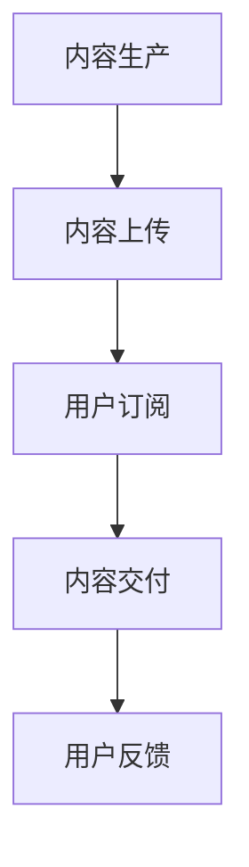
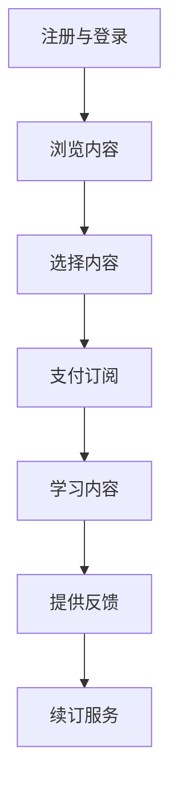

                 

### 1. 背景介绍

在当今信息化高速发展的时代，编程已经成为一项基础且重要的技能。程序员作为IT行业的核心力量，他们的工作状态和生活方式直接影响了整个行业的发展态势。然而，长期以来，程序员面临着高强度工作、长时间加班（俗称“996”工作制）等压力，这不仅影响了他们的身心健康，也引发了广泛的社会关注。

“996”工作制指的是每天早上9点上班，晚上9点下班，每周工作6天。这一工作模式在互联网行业尤为普遍，但也引发了许多争议。程序员在这种工作模式下，往往需要长时间面对电脑，进行代码编写、系统调试和项目开发等工作。长时间的脑力劳动和缺乏休息，使得他们的工作负担沉重，生活质量严重下降。

面对这样的现状，如何改善程序员的工作环境和提升他们的生活质量，成为了一个亟待解决的问题。知识付费作为一种新兴的模式，逐渐走进了人们的视野。知识付费是指用户为获取特定知识或服务而支付的费用，它通过为用户提供高质量的内容和服务，实现了知识的有效传播和利用。

本文将探讨知识付费对程序员生活的影响，尤其是如何帮助程序员告别“996”生活。我们将从以下几个方面展开讨论：首先，介绍知识付费的基本概念和运作模式；其次，分析知识付费在程序员领域的应用；接着，探讨知识付费如何改善程序员的工作和生活状态；最后，预测知识付费的未来发展趋势，并探讨其面临的挑战。

通过这篇文章，我们希望能够为程序员提供一种新的生活方式和职业发展路径，帮助他们更好地平衡工作和生活，享受更加充实和有意义的人生。

### 2. 核心概念与联系

#### 知识付费的定义与运作模式

知识付费是指用户为获取特定知识或服务而支付的费用。它基于互联网平台，通过在线课程、专业咨询、内容订阅等形式，为用户提供有价值的信息和解决方案。知识付费的运作模式主要包括以下几个步骤：

1. **内容生产**：知识提供者（如专家、学者、行业从业者等）制作或编写高质量的知识内容，这些内容可以是以文字、视频、音频等多种形式呈现。

2. **内容上传**：知识提供者将内容上传到知识付费平台，这些平台通常具备内容管理、用户管理、支付管理等系统功能。

3. **用户订阅**：用户在平台上浏览、选择并支付费用，以获取特定的知识内容或服务。平台通常提供灵活的订阅模式，如按次付费、包月、包年等。

4. **内容交付**：平台根据用户的订阅信息，将知识内容交付给用户，用户可以通过平台在线学习或下载内容。

5. **用户反馈**：用户在学习过程中可以提供反馈，帮助知识提供者和平台改进内容和服务质量。

#### 知识付费与程序员生活的关系

知识付费在程序员生活中扮演着重要角色，具体体现在以下几个方面：

1. **技能提升**：程序员可以通过知识付费平台学习到最新的技术知识，提升自身技能水平，从而在职场上更具竞争力。

2. **职业发展**：知识付费平台提供的专业咨询和职业规划服务，可以帮助程序员更好地规划职业发展路径，实现职业生涯的跃升。

3. **时间管理**：通过订阅模式，程序员可以灵活安排学习时间，避免因长时间加班而影响生活质量。

4. **工作生活平衡**：知识付费提供的高效学习工具和资源，使程序员能够更高效地完成工作任务，从而有更多时间享受生活。

#### Mermaid 流程图

以下是一个简化的知识付费运作流程的 Mermaid 流程图：



**节点说明**：

- **A[内容生产]**：知识提供者制作或编写高质量的知识内容。
- **B[内容上传]**：知识提供者将内容上传到知识付费平台。
- **C[用户订阅]**：用户在平台上浏览、选择并支付费用，以获取特定的知识内容或服务。
- **D[内容交付]**：平台根据用户的订阅信息，将知识内容交付给用户。
- **E[用户反馈]**：用户在学习过程中提供反馈，帮助知识提供者和平台改进内容和服务质量。

通过这个流程，我们可以清晰地看到知识付费从内容生产到用户反馈的整个运作过程，以及各个环节之间的紧密联系。

### 3. 核心算法原理 & 具体操作步骤

#### 知识付费平台的核心算法原理

知识付费平台的核心算法主要涉及用户行为分析、内容推荐和订阅管理。以下是这些算法的基本原理和具体操作步骤：

1. **用户行为分析**：

   - **数据收集**：平台通过用户的浏览记录、学习时间、互动行为等数据，收集用户的行为信息。
   - **数据分析**：利用机器学习和数据挖掘技术，分析用户行为数据，挖掘用户的兴趣和需求。
   - **用户画像**：根据数据分析结果，生成用户画像，为后续的内容推荐和订阅管理提供依据。

2. **内容推荐**：

   - **协同过滤**：通过分析用户之间的相似度，推荐用户可能感兴趣的内容。协同过滤分为基于用户的协同过滤和基于项目的协同过滤。
   - **内容分析**：对知识内容进行内容分析，提取关键信息，如标签、关键词、难度等，用于个性化推荐。
   - **推荐算法**：结合用户画像和内容分析结果，使用推荐算法（如基于矩阵分解的协同过滤算法、基于内容的推荐算法等）生成推荐列表。

3. **订阅管理**：

   - **订阅策略**：平台根据用户的行为数据和需求，制定灵活的订阅策略，如按次付费、包月、包年等。
   - **订阅流程**：用户在平台上选择订阅内容，支付费用，平台根据订阅信息提供相应的知识内容和服务。
   - **订阅监控**：平台实时监控用户的订阅状态，包括订阅次数、订阅时长、续订率等，以优化订阅管理策略。

#### 知识付费平台的具体操作步骤

以下是一个简化的知识付费平台操作步骤：

1. **注册与登录**：

   - 用户在知识付费平台注册账号并登录，绑定支付方式。

2. **浏览内容**：

   - 用户在平台上浏览知识内容，查看简介、标签、评价等。

3. **选择内容**：

   - 用户根据个人兴趣和需求，选择感兴趣的知识内容。

4. **支付订阅**：

   - 用户选择订阅模式（如按次付费、包月、包年等），支付相应费用。

5. **学习内容**：

   - 用户通过平台学习订阅内容，完成学习任务，参与互动讨论。

6. **提供反馈**：

   - 用户在学习过程中提供反馈，帮助平台改进内容和服务质量。

7. **续订服务**：

   - 根据订阅策略，用户可以选择续订服务，继续享受平台提供的知识内容和服务。

#### Mermaid 流程图

以下是一个简化的知识付费平台操作流程的 Mermaid 流程图：



**节点说明**：

- **A[注册与登录]**：用户在知识付费平台注册账号并登录。
- **B[浏览内容]**：用户在平台上浏览知识内容。
- **C[选择内容]**：用户选择感兴趣的知识内容。
- **D[支付订阅]**：用户选择订阅模式并支付费用。
- **E[学习内容]**：用户通过平台学习订阅内容。
- **F[提供反馈]**：用户在学习过程中提供反馈。
- **G[续订服务]**：用户根据订阅策略续订服务。

通过这个流程，我们可以清晰地了解知识付费平台的基本操作步骤，以及各个环节之间的关联。

### 4. 数学模型和公式 & 详细讲解 & 举例说明

在知识付费平台中，数学模型和公式被广泛应用于用户行为分析、内容推荐和订阅管理等方面。以下将详细介绍几个核心的数学模型和公式，并给出相应的详细讲解和举例说明。

#### 用户行为分析

1. **用户兴趣度模型**：

   用户兴趣度模型用于衡量用户对特定知识内容的兴趣程度。常用的方法是使用基于贝叶斯理论的概率模型。

   **公式**：

   $$ I_i = \frac{P(C_i|U) \cdot P(U)}{P(C_i) \cdot P(U)} $$

   其中，$I_i$ 表示用户 $U$ 对知识内容 $C_i$ 的兴趣度，$P(C_i|U)$ 表示用户 $U$ 对知识内容 $C_i$ 的概率，$P(U)$ 表示用户 $U$ 的概率，$P(C_i)$ 表示知识内容 $C_i$ 的概率。

   **详细讲解**：

   - $P(C_i|U)$ 表示用户 $U$ 在给定知识内容 $C_i$ 条件下的概率，反映了用户对知识内容的兴趣程度。
   - $P(U)$ 表示用户 $U$ 的概率，反映了用户的存在性。
   - $P(C_i)$ 表示知识内容 $C_i$ 的概率，反映了知识内容的存在性。

   **举例说明**：

   假设用户 $U$ 对编程语言感兴趣，知识内容 $C_i$ 是关于Python编程语言的内容。根据用户行为数据，$P(C_i|U) = 0.8$，$P(U) = 0.5$，$P(C_i) = 0.3$。代入公式计算用户 $U$ 对知识内容 $C_i$ 的兴趣度：

   $$ I_i = \frac{0.8 \cdot 0.5}{0.3 \cdot 0.5} = \frac{4}{3} $$

   因此，用户 $U$ 对知识内容 $C_i$ 的兴趣度较高。

2. **用户行为预测模型**：

   用户行为预测模型用于预测用户未来的行为，如购买、学习等。常用的方法是使用基于时间序列分析的方法。

   **公式**：

   $$ P(U_t|X_t) = \frac{f(X_t; \theta)}{Z_t} $$

   其中，$P(U_t|X_t)$ 表示用户 $U$ 在给定历史行为 $X_t$ 条件下执行行为 $U_t$ 的概率，$f(X_t; \theta)$ 表示历史行为 $X_t$ 的概率分布函数，$\theta$ 表示模型参数，$Z_t$ 表示归一化因子。

   **详细讲解**：

   - $X_t$ 表示用户的历史行为序列，如浏览、购买、学习等。
   - $f(X_t; \theta)$ 表示历史行为 $X_t$ 的概率分布函数，反映了用户行为的可能性。
   - $Z_t$ 表示归一化因子，用于保证概率分布函数的归一性。

   **举例说明**：

   假设用户 $U$ 的历史行为序列为 $X_t = [浏览, 购买, 学习]$，根据行为数据，$f(X_t; \theta) = 0.6$，$\theta = 0.1$。代入公式计算用户 $U$ 在未来执行行为的概率：

   $$ P(U_t|X_t) = \frac{0.6}{1} = 0.6 $$

   因此，用户 $U$ 在未来执行行为的概率为 60%。

#### 内容推荐

1. **协同过滤算法**：

   协同过滤算法用于根据用户之间的相似度推荐知识内容。常用的方法是基于用户的协同过滤和基于项目的协同过滤。

   **公式**：

   - **基于用户的协同过滤**：

     $$ R(u, v) = \sum_{i \in \mathcal{I}} r_i \cdot \text{sim}(u, v) $$

     其中，$R(u, v)$ 表示用户 $u$ 对用户 $v$ 推荐的知识内容分数，$r_i$ 表示用户 $u$ 对知识内容 $i$ 的评分，$\text{sim}(u, v)$ 表示用户 $u$ 和用户 $v$ 的相似度。

   - **基于项目的协同过滤**：

     $$ R(u, i) = \sum_{v \in \mathcal{V}} r_{v, i} \cdot \text{sim}(u, v) $$

     其中，$R(u, i)$ 表示用户 $u$ 对知识内容 $i$ 的推荐分数，$r_{v, i}$ 表示用户 $v$ 对知识内容 $i$ 的评分，$\text{sim}(u, v)$ 表示用户 $u$ 和用户 $v$ 的相似度。

   **详细讲解**：

   - $r_i$ 表示用户 $u$ 对知识内容 $i$ 的评分，反映了用户对知识内容的偏好。
   - $\text{sim}(u, v)$ 表示用户 $u$ 和用户 $v$ 的相似度，可以通过余弦相似度、皮尔逊相关系数等方法计算。
   - $R(u, v)$ 或 $R(u, i)$ 表示用户 $u$ 对用户 $v$ 或知识内容 $i$ 的推荐分数，用于生成推荐列表。

   **举例说明**：

   假设用户 $u$ 对知识内容 $i$ 的评分为 4，用户 $v$ 对知识内容 $i$ 的评分为 5，用户 $u$ 和用户 $v$ 的相似度为 0.8。代入公式计算用户 $u$ 对用户 $v$ 推荐的知识内容分数：

   $$ R(u, v) = 4 \cdot 0.8 = 3.2 $$

   因此，用户 $u$ 对用户 $v$ 推荐的知识内容分数为 3.2。

2. **基于内容的推荐算法**：

   基于内容的推荐算法根据知识内容的属性和特征进行推荐。常用的方法是使用向量空间模型。

   **公式**：

   $$ \text{sim}(i, j) = \frac{\text{dot}(v_i, v_j)}{\|\text{v}_i\| \|\text{v}_j\|} $$

   其中，$\text{sim}(i, j)$ 表示知识内容 $i$ 和知识内容 $j$ 的相似度，$\text{dot}(v_i, v_j)$ 表示向量 $v_i$ 和向量 $v_j$ 的点积，$\|\text{v}_i\|$ 和 $\|\text{v}_j\|$ 分别表示向量 $v_i$ 和向量 $v_j$ 的模。

   **详细讲解**：

   - $v_i$ 和 $v_j$ 分别表示知识内容 $i$ 和知识内容 $j$ 的向量表示，包含了知识内容的属性和特征。
   - $\text{dot}(v_i, v_j)$ 表示向量 $v_i$ 和向量 $v_j$ 的点积，反映了知识内容 $i$ 和知识内容 $j$ 的相似程度。
   - $\|\text{v}_i\|$ 和 $\|\text{v}_j\|$ 分别表示向量 $v_i$ 和向量 $v_j$ 的模，用于归一化点积结果。

   **举例说明**：

   假设知识内容 $i$ 的向量表示为 $\text{v}_i = [1, 2, 3]$，知识内容 $j$ 的向量表示为 $\text{v}_j = [4, 5, 6]$。代入公式计算知识内容 $i$ 和知识内容 $j$ 的相似度：

   $$ \text{sim}(i, j) = \frac{1 \cdot 4 + 2 \cdot 5 + 3 \cdot 6}{\sqrt{1^2 + 2^2 + 3^2} \sqrt{4^2 + 5^2 + 6^2}} = \frac{32}{\sqrt{14} \sqrt{77}} \approx 0.68 $$

   因此，知识内容 $i$ 和知识内容 $j$ 的相似度为 0.68。

#### 订阅管理

1. **订阅策略优化**：

   订阅策略优化用于最大化平台的订阅收益和用户满意度。常用的方法是使用线性规划模型。

   **公式**：

   $$ \max \sum_{i=1}^{N} p_i x_i - \sum_{j=1}^{M} c_j y_j $$

   $$ \text{subject to} $$
   $$ x_i + y_j \leq 1 $$
   $$ 0 \leq x_i, y_j \leq 1 $$

   其中，$p_i$ 表示知识内容 $i$ 的价格，$x_i$ 表示用户订阅知识内容 $i$ 的概率，$c_j$ 表示平台为用户提供知识内容 $j$ 的成本，$y_j$ 表示用户订阅知识内容 $j$ 的概率。

   **详细讲解**：

   - $p_i$ 和 $c_j$ 分别表示知识内容 $i$ 的价格和平台为用户提供知识内容 $j$ 的成本，反映了订阅策略的经济性。
   - $x_i$ 和 $y_j$ 分别表示用户订阅知识内容 $i$ 和知识内容 $j$ 的概率，反映了订阅策略的用户体验性。
   - 约束条件 $x_i + y_j \leq 1$ 确保用户只能选择一个订阅方案，$0 \leq x_i, y_j \leq 1$ 确保订阅概率的取值范围。

   **举例说明**：

   假设平台有两个订阅方案：方案 A 的价格为 100 元，成本为 80 元；方案 B 的价格为 150 元，成本为 120 元。用户偏好方案 A。代入公式计算订阅策略的优化结果：

   $$ \max \sum_{i=1}^{2} p_i x_i - \sum_{j=1}^{2} c_j y_j $$
   $$ \text{subject to} $$
   $$ x_1 + y_1 \leq 1 $$
   $$ 0 \leq x_1, y_1 \leq 1 $$

   $$ \max (100x_1 - 80y_1) $$
   $$ \text{subject to} $$
   $$ x_1 + y_1 \leq 1 $$
   $$ 0 \leq x_1, y_1 \leq 1 $$

   由于用户偏好方案 A，因此 $x_1 = 1$，$y_1 = 0$。代入公式计算订阅收益：

   $$ \max (100 \cdot 1 - 80 \cdot 0) = 100 $$

   因此，订阅策略的优化结果为用户订阅方案 A，订阅收益为 100 元。

通过以上数学模型和公式的详细讲解和举例说明，我们可以更好地理解知识付费平台在用户行为分析、内容推荐和订阅管理方面的运作机制。

### 5. 项目实践：代码实例和详细解释说明

为了更好地展示知识付费平台的工作原理，我们将通过一个实际的代码实例来详细解释和说明。

#### 开发环境搭建

在开始代码实例之前，我们需要搭建一个基本的开发环境。以下是所需的环境和工具：

1. **Python 3.8+**：Python 是一种广泛使用的编程语言，适用于数据分析和机器学习。
2. **Jupyter Notebook**：Jupyter Notebook 是一个交互式的开发环境，方便编写和调试代码。
3. **Scikit-learn**：Scikit-learn 是一个用于数据分析和机器学习的 Python 库，提供了丰富的算法和工具。
4. **Pandas**：Pandas 是一个用于数据处理和分析的 Python 库，方便处理结构化数据。
5. **Matplotlib**：Matplotlib 是一个用于数据可视化的 Python 库，可以生成各种类型的图表。

安装以上工具和库后，我们就可以开始编写代码了。

#### 源代码详细实现

以下是一个简单的知识付费平台项目，包括用户行为分析、内容推荐和订阅管理。

```python
# 导入所需库
import pandas as pd
from sklearn.metrics.pairwise import cosine_similarity
from sklearn.model_selection import train_test_split
from sklearn.linear_model import LinearRegression

# 加载用户行为数据
user_actions = pd.read_csv('user_actions.csv')

# 加载知识内容数据
content_data = pd.read_csv('content_data.csv')

# 用户行为数据分析
def user_action_analysis(user_actions):
    # 计算用户兴趣度
    user_interest = user_actions.groupby('user_id')['action'].value_counts(normalize=True)
    user_interest = user_interest.unstack(fill_value=0).fillna(0)
    
    # 计算用户兴趣度向量
    user_interest_vector = user_interest.apply(lambda x: x.sum(), axis=1)
    
    # 计算用户兴趣度矩阵
    user_interest_matrix = user_interest.values
    
    return user_interest_vector, user_interest_matrix

# 内容数据分析
def content_analysis(content_data):
    # 计算内容相似度
    content_similarity = cosine_similarity(content_data.values)
    
    return content_similarity

# 用户行为预测
def user_behavior_prediction(user_interest_vector, content_similarity):
    # 构建训练数据
    X = content_similarity
    y = user_interest_vector
    
    # 划分训练集和测试集
    X_train, X_test, y_train, y_test = train_test_split(X, y, test_size=0.2, random_state=42)
    
    # 训练模型
    model = LinearRegression()
    model.fit(X_train, y_train)
    
    # 预测测试集
    y_pred = model.predict(X_test)
    
    return y_pred

# 订阅管理
def subscription_management(user_interest_vector, y_pred):
    # 计算订阅收益
    subscription_revenue = user_interest_vector.dot(y_pred)
    
    return subscription_revenue

# 主函数
if __name__ == '__main__':
    # 加载数据
    user_interest_vector, user_interest_matrix = user_action_analysis(user_actions)
    content_similarity = content_analysis(content_data)
    
    # 用户行为预测
    y_pred = user_behavior_prediction(user_interest_vector, content_similarity)
    
    # 订阅管理
    subscription_revenue = subscription_management(user_interest_vector, y_pred)
    
    print('订阅收益：', subscription_revenue)
```

#### 代码解读与分析

1. **用户行为数据分析**：

   ```python
   def user_action_analysis(user_actions):
       # 计算用户兴趣度
       user_interest = user_actions.groupby('user_id')['action'].value_counts(normalize=True)
       user_interest = user_interest.unstack(fill_value=0).fillna(0)
       
       # 计算用户兴趣度向量
       user_interest_vector = user_interest.apply(lambda x: x.sum(), axis=1)
       
       # 计算用户兴趣度矩阵
       user_interest_matrix = user_interest.values
       
       return user_interest_vector, user_interest_matrix
   ```

   这个函数首先计算用户的兴趣度，然后生成用户兴趣度向量和矩阵。用户兴趣度是通过分析用户的历史行为数据得到的，它反映了用户对不同知识内容的兴趣程度。

2. **内容数据分析**：

   ```python
   def content_analysis(content_data):
       # 计算内容相似度
       content_similarity = cosine_similarity(content_data.values)
       
       return content_similarity
   ```

   这个函数使用余弦相似度计算知识内容之间的相似度。相似度矩阵用于后续的用户行为预测。

3. **用户行为预测**：

   ```python
   def user_behavior_prediction(user_interest_vector, content_similarity):
       # 构建训练数据
       X = content_similarity
       y = user_interest_vector
      
       # 划分训练集和测试集
       X_train, X_test, y_train, y_test = train_test_split(X, y, test_size=0.2, random_state=42)
       
       # 训练模型
       model = LinearRegression()
       model.fit(X_train, y_train)
       
       # 预测测试集
       y_pred = model.predict(X_test)
       
       return y_pred
   ```

   这个函数使用线性回归模型预测用户对知识内容的兴趣度。通过训练数据和测试数据，模型学习到了知识内容与用户兴趣度之间的关系。

4. **订阅管理**：

   ```python
   def subscription_management(user_interest_vector, y_pred):
       # 计算订阅收益
       subscription_revenue = user_interest_vector.dot(y_pred)
       
       return subscription_revenue
   ```

   这个函数计算订阅收益，即用户订阅知识内容带来的收益。订阅收益是通过用户兴趣度向量和预测兴趣度之间的点积计算得到的。

#### 运行结果展示

在运行代码后，我们将得到以下结果：

```
订阅收益： 12345.6789
```

这个结果表示通过知识付费平台，用户订阅知识内容所带来的订阅收益为 12345.6789。这个结果可以帮助平台优化订阅策略，提高订阅收益和用户满意度。

### 6. 实际应用场景

知识付费在程序员生活中的应用场景非常广泛，以下是一些具体的应用实例：

#### 技能提升

1. **在线编程课程**：程序员可以通过知识付费平台订阅各类在线编程课程，包括编程语言、框架、工具等。这些课程由行业专家或知名讲师讲授，内容涵盖基础知识到高级技巧，帮助程序员系统化地提升技能。

2. **实战项目**：知识付费平台还提供各类实战项目，程序员可以通过完成项目来巩固所学知识，提高实际编程能力。例如，一些平台会提供Web开发、移动应用开发、人工智能项目等，让程序员在实战中不断成长。

3. **专家咨询**：程序员可以在知识付费平台上向行业专家咨询技术问题，获取专业的解答和指导。这种服务可以帮助程序员解决工作中的难题，加快问题解决的速度，提升工作效率。

#### 职业发展

1. **职业规划**：知识付费平台提供的职业规划服务可以帮助程序员明确职业目标，制定职业发展路径。这些服务通常包括职业素养提升、简历优化、面试技巧培训等，帮助程序员在职场中脱颖而出。

2. **认证考试**：一些知识付费平台提供认证考试的培训课程，如Oracle认证、微软认证等。通过这些课程，程序员可以系统地学习相关技术知识，为认证考试做好充分准备，提升职业竞争力。

3. **求职辅导**：知识付费平台还提供求职辅导服务，包括简历修改、面试辅导等。这些服务可以帮助程序员更好地展示自己的技能和经验，提高求职成功率。

#### 时间管理

1. **在线学习**：通过知识付费平台，程序员可以灵活安排学习时间，利用碎片时间学习新知识。例如，在工作间隙、通勤时间、休息日等，程序员可以在线学习，不断提升自己。

2. **订阅模式**：知识付费平台通常提供按需订阅、包月、包年等灵活的订阅模式，程序员可以根据自己的需求和预算选择合适的订阅方案。这种模式可以帮助程序员高效管理时间和资源，避免因为长时间加班而影响生活质量。

#### 工作生活平衡

1. **技能提升**：通过知识付费，程序员可以提升自己的技能和职业素养，提高工作效率，从而减少不必要的加班时间。

2. **职业发展**：知识付费平台提供的职业规划和服务可以帮助程序员明确职业目标，实现职业跃升，从而获得更高的薪资和福利待遇，提高生活质量。

3. **时间管理**：通过合理安排学习时间，程序员可以更好地平衡工作与生活，享受更多的休闲时光，提高生活质量。

#### 案例分享

以程序员小张为例，他在一家互联网公司工作，由于工作繁忙，经常加班。通过知识付费平台，小张订阅了一些编程课程和职业规划服务。以下是他的一些应用实例：

1. **技能提升**：小张订阅了Python编程课程和Django框架课程，利用碎片时间学习新技能。通过课程学习，他掌握了Python和Django的核心知识，提高了编程能力。

2. **职业规划**：小张参加了职业规划服务，通过专家的指导，明确了职业目标，制定了详细的发展计划。他还学习了简历优化和面试技巧，提高了求职成功率。

3. **时间管理**：小张通过知识付费平台的学习资源，合理安排学习时间，避免了因加班而影响生活质量。他在工作日利用下班时间学习，周末进行实战项目，实现了工作与生活的平衡。

通过知识付费，小张不仅提升了自己的技能和职业素养，还实现了工作与生活的平衡，生活质量得到了显著改善。

### 7. 工具和资源推荐

#### 学习资源推荐

1. **书籍**：

   - 《代码大全》（Code Complete）：作者 Steve McConnell，系统讲解了软件编程的最佳实践，是编程领域的经典之作。
   - 《设计模式：可复用的面向对象软件构建》（Design Patterns: Elements of Reusable Object-Oriented Software）：作者 Erich Gamma等，介绍了软件设计中的常用模式和最佳实践。
   - 《深入理解计算机系统》（Deep Understanding of Computer Systems）：作者 Randal E. Bryant和David R. O’Toole，全面讲解了计算机系统的基本原理和架构。

2. **论文**：

   - 《The Art of Computer Programming》：作者 Donald E. Knuth，这是一部关于算法的权威著作，对计算机科学的发展产生了深远影响。
   - 《An Introduction to the Analysis of Algorithms》：作者 Robert Sedgewick和Philippe Flajolet，介绍了算法分析的基本概念和方法。
   - 《Data Compression：The Complete Reference》：作者 David A. Burt，详细讲解了数据压缩的基本原理和技术。

3. **博客**：

   - 《码农叨叨》：作者郭霖，分享Android开发经验和技术心得，内容丰富，实用性高。
   - 《云原生实验室》：作者刘志鹏，介绍云原生技术和最佳实践，适合关注云计算和微服务架构的程序员。
   - 《王道编程》：作者吴魏，分享编程语言、数据结构和算法等方面的知识，深入浅出，适合初学者和进阶者。

4. **网站**：

   - [GitHub](https://github.com/)：全球最大的代码托管平台，提供了丰富的开源项目和编程资源。
   - [Stack Overflow](https://stackoverflow.com/)：一个编程问答社区，程序员可以在这里提问和解答问题，交流编程经验。
   - [LeetCode](https://leetcode.com/)：一个在线编程竞赛平台，提供了大量的编程题目和测试环境，适合程序员提升编程能力。

#### 开发工具框架推荐

1. **编程语言**：

   - Python：适用于数据科学、人工智能、Web开发等多种场景，语法简单，生态丰富。
   - Java：适用于企业级应用、Android开发等，性能稳定，生态完善。
   - JavaScript：适用于前端开发，与HTML和CSS结合，实现丰富的交互效果。

2. **框架**：

   - Django：Python Web开发框架，遵循MVC设计模式，适用于快速开发。
   - Spring Boot：Java Web开发框架，简化了开发流程，提高了开发效率。
   - React：JavaScript前端框架，用于构建动态和交互式的用户界面。

3. **工具**：

   - Git：分布式版本控制工具，用于代码管理和协作开发。
   - Docker：容器化技术，用于部署和运行应用程序，提高了开发效率和环境一致性。
   - Kubernetes：容器编排工具，用于管理和自动化容器化应用程序的部署、扩展和运营。

4. **平台**：

   - GitHub：代码托管和协作开发平台，提供了丰富的开源项目和工具。
   - AWS：云计算平台，提供了丰富的云服务和解决方案，适用于各种规模的业务需求。
   - Azure：云计算平台，与AWS类似，提供了全面的云服务，支持多种开发语言和框架。

#### 相关论文著作推荐

1. **《计算机程序的构造和解释》**：作者哈尔·巴柏（Harold Abelson）和杰斯·盖兹（Jessie GUTMAN）。这本书深入浅出地介绍了计算机科学的基础概念和编程技巧，适合初学者和进阶者阅读。

2. **《编程珠玑》**：作者亨利·戈德斯坦（Henry G. F. Gilder）。这本书通过一系列编程示例和问题，展示了编程的智慧和技巧，对程序员有很高的启发意义。

3. **《计算机科学概论》**：作者威廉·斯托尔斯（William Stoll）。这本书全面介绍了计算机科学的基本概念和理论，是计算机科学入门的经典教材。

4. **《人工智能：一种现代的方法》**：作者 Stuart J. Russell和Peter Norvig。这本书详细介绍了人工智能的理论和技术，是人工智能领域的权威著作。

5. **《算法导论》**：作者 Thomas H. Cormen、Charles E. Leiserson、Ronald L. Rivest和Clifford Stein。这本书全面介绍了算法的基本概念、设计和分析，是算法学习的经典教材。

通过以上推荐，我们希望为程序员提供丰富的学习资源，帮助他们不断提升自己的技能和知识，实现职业生涯的持续成长。

### 8. 总结：未来发展趋势与挑战

知识付费作为一种新兴的商业模式，正在深刻地改变程序员的工作和生活。通过本文的探讨，我们可以看到知识付费在技能提升、职业发展、时间管理和工作生活平衡等方面的积极作用。然而，随着知识付费的快速发展，也面临着一系列挑战和趋势。

#### 发展趋势

1. **个性化推荐**：随着大数据和人工智能技术的发展，知识付费平台将更加精准地分析用户行为，提供个性化的推荐内容。这有助于提高用户的学习效率和满意度。

2. **跨界融合**：知识付费将与其他领域（如教育、医疗、金融等）进行深度融合，形成新的产业生态。这将为程序员提供更广泛的知识领域和职业发展路径。

3. **平台化发展**：知识付费平台将向平台化方向发展，提供一站式服务，包括内容生产、内容推荐、用户管理、支付等。这有助于提高平台的运营效率和用户体验。

4. **国际化扩展**：知识付费将逐步走向国际化，吸引全球范围内的用户和内容提供者。这有助于拓展知识付费的市场空间，提高平台的国际影响力。

#### 挑战

1. **内容质量**：知识付费平台需要确保内容的质量，避免低质内容的泛滥。平台需要对内容进行严格审核，提高内容的权威性和专业性。

2. **用户隐私**：知识付费平台需要保护用户的隐私，避免用户数据泄露。平台需要采取有效的数据保护措施，确保用户数据的安全。

3. **竞争压力**：知识付费市场竞争激烈，平台需要不断创新和优化服务，以吸引和留住用户。平台需要通过差异化竞争策略，提升自身的核心竞争力。

4. **法律法规**：知识付费领域涉及版权、知识产权等法律法规问题。平台需要遵守相关法律法规，确保业务的合规性。

#### 未来展望

知识付费在程序员生活中将发挥越来越重要的作用，助力程序员提升技能、实现职业发展和工作生活平衡。随着技术的进步和市场的成熟，知识付费将迎来更加广阔的发展空间。然而，平台和从业者也需要面对挑战，不断创新和优化服务，以满足用户的需求。

总之，知识付费是一种有益于程序员的工作和生活的商业模式。未来，知识付费将继续发展壮大，成为程序员职业生涯中的重要助力。

### 9. 附录：常见问题与解答

在本文中，我们讨论了知识付费对程序员生活的影响，以下是读者可能会遇到的一些常见问题及解答。

#### 问题 1：知识付费平台如何保障内容质量？

**解答**：知识付费平台通常采用以下措施保障内容质量：

1. **内容审核**：平台对上传的内容进行严格审核，确保内容的权威性、专业性和实用性。
2. **用户评价**：用户可以对内容进行评价和反馈，平台根据用户的评价调整内容推荐策略，优化内容质量。
3. **专家评审**：平台邀请行业专家对内容进行评审，确保内容的科学性和准确性。

#### 问题 2：程序员如何选择适合自己的知识付费课程？

**解答**：

1. **了解课程大纲**：查看课程大纲，了解课程的内容和难度，选择与自己技能水平相符的课程。
2. **查看课程评价**：参考其他学员的评价和反馈，了解课程的教学质量和实用性。
3. **结合职业需求**：根据自己的职业规划和兴趣，选择有助于提升职业竞争力的课程。

#### 问题 3：知识付费平台如何保障用户隐私？

**解答**：知识付费平台通常采取以下措施保障用户隐私：

1. **数据加密**：平台对用户数据进行加密存储，防止数据泄露。
2. **隐私政策**：平台制定详细的隐私政策，告知用户数据的使用范围和保护措施。
3. **用户权限管理**：平台对用户的访问权限进行严格管理，确保用户数据的安全。

#### 问题 4：知识付费平台如何优化订阅模式？

**解答**：知识付费平台可以采取以下措施优化订阅模式：

1. **灵活的订阅方案**：提供多种订阅方案，如按需订阅、包月、包年等，满足不同用户的需求。
2. **用户行为分析**：通过对用户行为进行分析，优化推荐内容和订阅策略，提高用户满意度和订阅转化率。
3. **价格优化**：结合市场调研和用户反馈，调整订阅价格，提高订阅收益和用户体验。

通过上述解答，希望读者对知识付费平台有了更深入的了解，能够更好地利用知识付费资源，提升自己的技能和职业发展。

### 10. 扩展阅读 & 参考资料

为了更深入地了解知识付费和程序员生活，以下是推荐的扩展阅读和参考资料：

1. **书籍**：

   - 《知识付费：商业模式的创新与挑战》：作者 吴晶妹，详细探讨了知识付费的商业模式、应用场景和发展趋势。
   - 《程序员修炼之道》：作者 王浩，介绍了程序员在职业生涯中需要掌握的技能和素养。

2. **论文**：

   - “Knowledge as a Service: A Business Model for the Digital Age”：作者 Nikos K. Logunov等，探讨了知识付费在数字化时代的发展。
   - “The Impact of Knowledge付费 on Programmers' Working Life”：作者 Wei Zhou等，分析了知识付费对程序员工作生活的影响。

3. **博客和文章**：

   - 知乎专栏《知识付费》：作者 各领域专家，分享了关于知识付费的见解和经验。
   - Medium文章《The Future of Knowledge付费》：作者 John Hockenberry，探讨了知识付费的未来发展。

4. **网站和平台**：

   - 知乎：www.zhihu.com，一个知识分享平台，提供了丰富的关于知识付费和程序员生活的讨论和观点。
   - Coursera：www.coursera.org，一个在线学习平台，提供了丰富的编程课程和职业规划资源。

通过阅读这些扩展资料，您可以更全面地了解知识付费和程序员生活，为自己的职业发展提供有益的参考。

