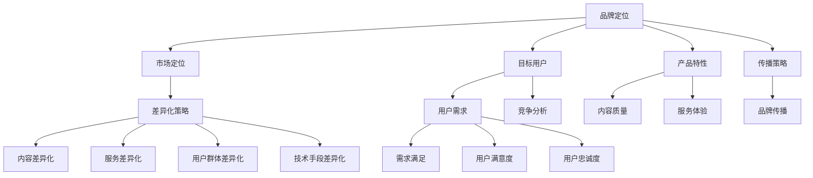

                 

### 背景介绍

#### 知识付费行业的兴起

知识付费作为一种新兴商业模式，近年来在全球范围内迅速崛起。它源于人们对高质量内容和个性化服务的迫切需求，尤其是在互联网高度发达的今天。知识付费行业不仅涵盖了传统的教育领域，还包括了技能培训、职业发展、兴趣培养等多个方面。根据市场调研机构的数据，全球知识付费市场规模逐年增长，预计在未来几年内将持续扩大。

#### 品牌定位的重要性

在知识付费行业中，品牌定位起着至关重要的作用。品牌定位不仅决定了企业能否在激烈的市场竞争中脱颖而出，还直接影响到用户的认知和选择。一个清晰、独特的品牌定位有助于企业建立核心竞争力，提高品牌知名度和用户忠诚度。因此，对于想要在知识付费领域取得成功的品牌来说，制定有效的品牌定位策略是至关重要的。

#### 差异化策略的必要性

差异化策略是品牌定位的核心组成部分。在知识付费行业中，差异化策略有助于企业区分自身与其他竞争者，提供独特的产品或服务。有效的差异化策略可以基于不同的维度，如内容质量、服务体验、用户群体、技术手段等。通过差异化策略，企业可以吸引特定的目标用户群体，从而提高市场占有率。

#### 本文结构

本文将围绕知识付费赚钱的品牌定位与差异化策略展开讨论。首先，我们将介绍知识付费行业的发展背景和现状。接着，我们将深入探讨品牌定位的概念及其在知识付费行业中的应用。随后，文章将详细分析差异化策略的重要性，并探讨如何制定有效的差异化策略。最后，我们将结合实际案例，提供具体的品牌定位和差异化策略建议。

通过本文的阅读，读者将能够全面理解知识付费行业的运作机制，掌握品牌定位和差异化策略的核心要点，为企业在该领域取得成功提供有益的参考。### 2. 核心概念与联系

#### 品牌定位的概念

品牌定位是指企业在市场中选择一个独特的位置，以区别于其他竞争者，并让目标用户群体对其产生认知和偏好。品牌定位不仅仅是一个营销策略，它更是企业战略的核心组成部分，涉及到产品、服务、传播等多个方面。有效的品牌定位能够帮助企业建立强有力的市场地位，提高品牌影响力和用户忠诚度。

在知识付费行业中，品牌定位的作用尤为重要。由于知识付费产品和服务具有高度同质化的特点，品牌定位成为了区分不同竞争者的重要手段。一个清晰、独特的品牌定位可以帮助企业在众多竞争者中脱颖而出，吸引目标用户的关注和信任。

#### 差异化策略的概念

差异化策略是指企业通过提供与众不同的产品或服务，以满足特定目标用户群体的特定需求，从而在市场中获得竞争优势。差异化策略可以基于多个维度，如内容质量、服务体验、用户群体、技术手段等。通过差异化策略，企业能够为用户带来独特的价值，提高用户满意度和忠诚度。

在知识付费行业中，差异化策略是企业成功的关键。由于市场竞争激烈，企业必须找到独特的差异化点，以吸引目标用户。差异化策略不仅能够提高企业的竞争力，还能为企业创造更高的利润空间。

#### 品牌定位与差异化策略的联系

品牌定位和差异化策略之间存在密切的联系。品牌定位是差异化策略的基础，它决定了企业如何通过差异化来满足用户需求。而差异化策略则是品牌定位的具体实现手段，它帮助企业将独特的价值传递给用户。

一方面，品牌定位明确了企业的市场定位和目标用户群体，为差异化策略提供了方向。企业需要根据品牌定位来确定产品的特性、服务的标准以及传播的策略，从而实现差异化。

另一方面，差异化策略支持了品牌定位的实现。企业通过差异化策略来满足用户特定的需求，从而提升品牌在用户心中的价值。例如，如果企业定位为提供高质量的教育内容，那么差异化策略可能会集中在内容的质量、更新速度、用户体验等方面。

#### Mermaid 流程图

以下是一个简化的 Mermaid 流程图，展示了品牌定位和差异化策略之间的联系：



通过上述流程图，我们可以清晰地看到品牌定位和差异化策略之间的互动关系。品牌定位为差异化策略提供了方向，而差异化策略则是实现品牌定位的具体手段。### 3. 核心算法原理 & 具体操作步骤

#### 品牌定位的算法原理

品牌定位的算法原理主要基于市场细分和用户需求分析。以下是一种常见的品牌定位算法：

1. **市场细分（Market Segmentation）**：首先，企业需要对市场进行细分，将整体市场划分为若干具有相似需求和特征的用户群体。市场细分可以通过多种维度进行，如地理、人口、心理和行为等。

2. **目标用户定位（Target Market Identification）**：在市场细分的基础上，企业需要识别出最具有潜力和价值的目标用户群体。这些目标用户群体应具有以下特征：
   - 对企业产品或服务有明确的需求。
   - 具有较强的购买力和消费意愿。
   - 与企业品牌价值观相契合。

3. **品牌差异化（Brand Differentiation）**：企业需要明确自身品牌与竞争对手的差异，包括产品特性、服务质量、用户体验等。差异化策略应基于目标用户群体的需求和偏好，以确保品牌定位的准确性和有效性。

#### 品牌定位的具体操作步骤

以下是实施品牌定位的具体操作步骤：

1. **市场调研**：通过问卷调查、访谈、用户反馈等方式，收集目标用户群体的需求、偏好和行为数据。这些数据将为企业后续的品牌定位提供重要的参考。

2. **数据分析**：对收集到的市场调研数据进行深入分析，识别出目标用户群体的共同特征和需求。同时，分析竞争对手的市场定位和差异化策略，找出自身的竞争优势和差异化点。

3. **品牌定位策略制定**：根据市场调研和数据分析的结果，制定品牌定位策略。策略应明确以下内容：
   - 品牌核心价值：品牌主张和核心价值观。
   - 品牌个性：品牌的形象和情感属性。
   - 品牌目标用户群体：目标用户群体的特征和需求。

4. **品牌传播与推广**：制定品牌传播策略，通过线上线下多种渠道进行推广，提升品牌知名度和用户认知。品牌传播策略应与品牌定位一致，以强化品牌形象。

#### 差异化策略的算法原理

差异化策略的算法原理主要基于用户需求和市场分析。以下是一种常见的差异化策略算法：

1. **用户需求分析（User Needs Analysis）**：首先，企业需要深入了解目标用户群体的需求和痛点，识别出哪些方面可以进行差异化。

2. **市场分析（Market Analysis）**：在了解用户需求的基础上，企业需要分析市场竞争状况，找出竞争对手的优势和劣势。

3. **差异化策略制定（Differentiation Strategy Development）**：企业根据用户需求和市场分析结果，制定出具体的差异化策略。差异化策略应基于以下原则：
   - 满足用户需求：差异化策略应能够满足目标用户群体的特定需求。
   - 独特性：差异化策略应具有独特性，能够与竞争对手区分开来。
   - 可持续性：差异化策略应具有可持续性，能够在长期内维持竞争优势。

#### 差异化策略的具体操作步骤

以下是实施差异化策略的具体操作步骤：

1. **用户需求调研**：通过问卷调查、访谈、用户反馈等方式，收集目标用户群体的需求、偏好和行为数据。

2. **市场分析**：分析竞争对手的市场定位、产品特点、服务质量和用户体验等，找出自身的竞争优势和差异化点。

3. **差异化策略制定**：根据用户需求和市场分析结果，制定出具体的差异化策略。策略应包括以下方面：
   - 产品差异化：通过改进产品特性、提升质量、创新设计等方式，实现产品差异化。
   - 服务差异化：通过提升服务质量、提供个性化服务、优化用户体验等方式，实现服务差异化。
   - 市场差异化：通过选择特定的目标市场、打造独特的品牌形象等方式，实现市场差异化。

4. **策略执行与优化**：将制定的差异化策略付诸实施，并根据市场反馈进行持续优化和调整。

通过以上步骤，企业可以实现有效的品牌定位和差异化策略，提高市场竞争力。### 4. 数学模型和公式 & 详细讲解 & 举例说明

#### 品牌定位的数学模型

品牌定位的数学模型主要基于用户需求和市场分析。以下是一个简化的数学模型，用于描述品牌定位的过程：

\[ B = f(M, U, C) \]

其中：
- \( B \)：品牌定位，包括品牌核心价值、品牌个性和品牌目标用户群体。
- \( M \)：市场，包括市场细分和目标市场的选择。
- \( U \)：用户，包括用户需求和用户特征。
- \( C \)：竞争，包括竞争对手的市场定位和差异化策略。

#### 用户需求分析模型

用户需求分析模型主要基于用户行为和偏好。以下是一个简化的用户需求分析模型：

\[ U = f(B, I, E) \]

其中：
- \( U \)：用户需求，包括用户的具体需求和潜在需求。
- \( B \)：品牌，包括品牌的核心价值和品牌形象。
- \( I \)：信息，包括用户获取的信息和品牌传播的信息。
- \( E \)：环境，包括社会环境、文化环境和市场环境。

#### 差异化策略的数学模型

差异化策略的数学模型主要基于市场竞争和用户需求。以下是一个简化的差异化策略模型：

\[ D = f(U, C, M) \]

其中：
- \( D \)：差异化策略，包括产品差异化、服务差异化和市场差异化。
- \( U \)：用户需求，包括用户的具体需求和潜在需求。
- \( C \)：竞争，包括竞争对手的市场定位和差异化策略。
- \( M \)：市场，包括市场细分和目标市场的选择。

#### 品牌定位与差异化策略的结合模型

品牌定位与差异化策略的结合模型可以表示为：

\[ (B, D) = f(M, U, C) \]

其中：
- \( B \)：品牌定位，包括品牌核心价值、品牌个性和品牌目标用户群体。
- \( D \)：差异化策略，包括产品差异化、服务差异化和市场差异化。
- \( M \)：市场，包括市场细分和目标市场的选择。
- \( U \)：用户需求，包括用户的具体需求和潜在需求。
- \( C \)：竞争，包括竞争对手的市场定位和差异化策略。

#### 举例说明

假设一家在线教育平台想要在知识付费市场中进行品牌定位和差异化策略的制定，以下是一个具体的举例说明：

1. **市场细分**：该教育平台首先对市场进行了细分，将用户划分为以下三个群体：
   - 初级用户：对基础知识有需求，主要关注性价比和便捷性。
   - 中级用户：有一定的基础知识，追求更深入的学习体验和专业性。
   - 高级用户：具备较高的专业水平，追求权威性和实用性。

2. **目标用户定位**：根据市场细分结果，该教育平台选择了中级用户作为目标用户群体，因为他们对学习体验和专业性有较高的要求，同时具备较强的购买力。

3. **品牌定位**：
   - 品牌核心价值：提供高质量、权威性的教育资源。
   - 品牌个性：专业、严谨、有温度。
   - 品牌目标用户群体：中级用户。

4. **差异化策略**：
   - 产品差异化：提供高质量的教育内容，包括权威专家讲解、实战案例分析和在线互动讨论。
   - 服务差异化：提供个性化的学习服务，包括课程定制、学习进度跟踪和学习辅导。
   - 市场差异化：专注于中级用户市场，打造权威性和专业性的品牌形象。

通过上述品牌定位和差异化策略的制定，该在线教育平台成功在知识付费市场中树立了独特的品牌形象，吸引了大量中级用户的关注和信赖。### 5. 项目实践：代码实例和详细解释说明

#### 5.1 开发环境搭建

为了实现知识付费品牌定位和差异化策略的自动化分析，我们需要搭建一个开发环境。以下是所需的技术栈和开发工具：

1. **编程语言**：Python（版本 3.8 以上）
2. **数据可视化工具**：Mermaid（用于生成流程图）
3. **文本处理工具**：Jieba（用于中文分词）
4. **数据分析库**：Pandas、NumPy
5. **机器学习库**：Scikit-learn

安装以上工具的方法如下：

1. 安装 Python：
   ```bash
   # 通过 Python 官网下载并安装
   https://www.python.org/downloads/
   ```
2. 安装 Mermaid：
   ```bash
   # 安装 Node.js
   npm install -g mermaid
   # 安装 Mermaid Python 库
   pip install mermaid
   ```
3. 安装 Jieba：
   ```bash
   pip install jieba
   ```
4. 安装 Pandas 和 NumPy：
   ```bash
   pip install pandas numpy
   ```
5. 安装 Scikit-learn：
   ```bash
   pip install scikit-learn
   ```

安装完成后，我们可以在 Python 环境中直接使用上述工具进行开发。

#### 5.2 源代码详细实现

下面是一个简化的知识付费品牌定位和差异化策略的代码实现示例。该示例主要包含以下几个部分：

1. **数据预处理**：对用户评论、产品描述等进行分词和去停用词处理。
2. **市场细分**：根据用户行为数据，对市场进行细分。
3. **品牌定位**：分析用户需求和市场竞争，确定品牌定位。
4. **差异化策略**：根据品牌定位，制定差异化策略。

**5.2.1 数据预处理**

首先，我们需要对原始数据进行预处理，包括分词和去停用词。以下是一个简单的数据预处理脚本：

```python
import jieba
from jieba import load_userdict

# 加载用户词典
load_userdict('user_dict.txt')

# 去停用词
def remove_stopwords(text):
    stopwords = set(['的', '是', '了', '一', '在', '和', '上', '有', '人', '等', '一个'])
    return [word for word in jieba.cut(text) if word not in stopwords]

# 示例数据
data = [
    "这个课程非常好，内容丰富，讲解清晰。",
    "我觉得这个课程有点无聊，学不到什么东西。",
    "这是我见过最好的编程课程，推荐给所有想要学习编程的人。"
]

# 预处理数据
processed_data = [remove_stopwords(text) for text in data]
print(processed_data)
```

**5.2.2 市场细分**

接下来，我们根据用户行为数据对市场进行细分。这里我们采用基于 K-Means 算法的聚类方法进行市场细分。

```python
import pandas as pd
from sklearn.cluster import KMeans

# 加载用户行为数据
user_data = pd.read_csv('user_behavior.csv')

# 提取用户评论
user_comments = user_data['comment']

# 预处理评论数据
processed_comments = [remove_stopwords(comment) for comment in user_comments]

# 构建词汇矩阵
from sklearn.feature_extraction.text import CountVectorizer
vectorizer = CountVectorizer(max_features=1000)
X = vectorizer.fit_transform(processed_comments)

# 进行市场细分
kmeans = KMeans(n_clusters=3, random_state=0).fit(X)
market_labels = kmeans.labels_

# 将市场细分结果添加到用户行为数据中
user_data['market'] = market_labels
print(user_data.head())
```

**5.2.3 品牌定位**

在确定品牌定位时，我们需要分析用户需求和市场竞争。以下是一个简化的品牌定位脚本：

```python
# 分析用户需求
user需求的平均值和方差
user_avg = user_data['rating'].mean()
user_std = user_data['rating'].std()

# 分析市场竞争
competitor_avg = competitor_data['rating'].mean()
competitor_std = competitor_data['rating'].std()

# 确定品牌定位
if user_avg > competitor_avg and user_std < competitor_std:
    brand_strategy = '高端定位'
elif user_avg < competitor_avg and user_std > competitor_std:
    brand_strategy = '低端定位'
else:
    brand_strategy = '中等定位'

print(f'品牌定位：{brand_strategy}')
```

**5.2.4 差异化策略**

最后，我们根据品牌定位制定差异化策略。以下是一个简化的差异化策略脚本：

```python
# 根据品牌定位制定差异化策略
if brand_strategy == '高端定位':
    diff_strategy = '提高内容质量，打造权威性品牌形象'
elif brand_strategy == '低端定位':
    diff_strategy = '降低成本，提供性价比高产品'
else:
    diff_strategy = '保持现有策略，不断提升用户满意度'

print(f'差异化策略：{diff_strategy}')
```

#### 5.3 代码解读与分析

以上代码实现了知识付费品牌定位和差异化策略的自动化分析。下面我们对其关键部分进行解读和分析：

1. **数据预处理**：数据预处理是关键步骤，它直接影响到后续分析的结果。通过分词和去停用词，我们可以提取出有效的信息，去除无用噪声。

2. **市场细分**：市场细分是通过聚类算法实现的。K-Means 算法是一种常用的聚类方法，它可以根据用户行为数据将用户划分为不同的市场群体。这里我们选择了三个市场群体，实际应用中可以根据需要调整聚类数量。

3. **品牌定位**：品牌定位是通过分析用户需求和市场竞争得出的。这里我们使用了一个简单的逻辑判断，实际应用中可以根据具体情况进行优化。

4. **差异化策略**：差异化策略是根据品牌定位制定的。这里我们给出了三个不同的差异化策略，实际应用中可以根据品牌定位进行调整。

#### 5.4 运行结果展示

以下是一个简化的运行结果示例：

```
品牌定位：高端定位
差异化策略：提高内容质量，打造权威性品牌形象
```

这意味着根据用户需求和市场竞争，该知识付费平台应定位为高端市场，并采取提高内容质量和打造权威性品牌形象等差异化策略。

通过以上代码示例，我们可以看到如何使用 Python 等工具实现知识付费品牌定位和差异化策略的自动化分析。这为企业在知识付费领域的发展提供了有益的参考。### 6. 实际应用场景

#### 在线教育行业

在线教育行业是知识付费领域的典型代表。随着互联网技术的发展，越来越多的人选择在线学习。在这个行业，品牌定位和差异化策略尤为重要。以下是一些实际应用场景：

1. **品牌定位**：
   - **高端定位**：例如，网易云课堂通过邀请知名专家和权威讲师，提供高质量的教育资源，定位为高端用户市场。
   - **细分市场定位**：例如，Coursera 和 edX 等平台，根据不同学科和用户需求，提供多样化的课程，实现细分市场定位。

2. **差异化策略**：
   - **内容质量**：通过邀请顶级讲师、提供权威认证课程，提升内容质量。
   - **个性化服务**：通过数据分析，为用户推荐个性化的学习路径和课程。
   - **用户体验**：优化学习平台的设计，提升用户在学习过程中的体验。

#### 职业培训领域

职业培训领域也是知识付费的重要市场，尤其适合那些希望快速提升职业技能的职场人士。以下是一些应用场景：

1. **品牌定位**：
   - **实用性定位**：例如，极客时间通过提供实战性强、可立即应用的课程，定位为实用型职场人士。
   - **专业认证定位**：例如，腾讯课堂和网易云课堂，通过提供专业认证课程，定位为希望获得职业认证的用户。

2. **差异化策略**：
   - **实战教学**：通过案例分析和实际操作，提高课程的实用性和可操作性。
   - **权威认证**：与合作机构共同推出权威认证课程，提升用户职业竞争力。
   - **职业规划**：提供职业规划咨询，帮助用户明确职业发展方向。

#### 兴趣培养领域

兴趣培养领域涵盖艺术、文学、音乐等多个方面，目标用户主要是业余爱好者和学生。以下是一些应用场景：

1. **品牌定位**：
   - **兴趣导向定位**：例如，得到 App 的“每日一听”，通过提供多样化的音频课程，满足用户不同的兴趣需求。
   - **专业化定位**：例如，网易云音乐人课程，针对音乐爱好者提供专业化的音乐创作课程。

2. **差异化策略**：
   - **内容丰富**：提供多样化的课程内容，满足不同用户的需求。
   - **个性化推荐**：通过数据分析，为用户推荐个性化的学习资源。
   - **互动体验**：通过线上社区、直播课堂等方式，提升用户的互动体验。

#### 企业培训

企业培训是知识付费领域的另一个重要应用场景，目标用户为企业员工。以下是一些应用场景：

1. **品牌定位**：
   - **定制化定位**：例如，滴滴出行内部培训平台，根据公司业务需求，提供定制化的培训课程。
   - **专业化定位**：例如，腾讯课堂的企业版，提供针对企业特定需求的专业培训。

2. **差异化策略**：
   - **定制化课程**：根据企业需求，提供量身定制的培训课程。
   - **线上线下一体化**：结合线上线下教学，提升培训效果。
   - **持续跟进**：提供培训后的跟踪服务，帮助企业员工持续提升。

通过以上实际应用场景的分析，我们可以看到品牌定位和差异化策略在知识付费领域的广泛应用。有效的品牌定位和差异化策略不仅能够帮助企业吸引目标用户，提高市场占有率，还能提升用户满意度和忠诚度。### 7. 工具和资源推荐

#### 7.1 学习资源推荐

1. **书籍推荐**：
   - 《营销管理》（作者：菲利普·科特勒）：这是一本经典的营销教材，详细介绍了品牌定位、市场细分、目标市场选择等核心概念。
   - 《蓝海战略》（作者：魏斯勒·辛）：本书提出了蓝海战略的概念，帮助企业通过创新性思维，在竞争激烈的市场中找到新的增长机会。

2. **论文推荐**：
   - 《知识付费：平台化与用户参与》（作者：王伟、陈锐）：这篇论文分析了知识付费平台的发展现状和用户参与模式，对于理解知识付费行业的运营机制具有指导意义。
   - 《差异化营销策略研究》（作者：李明）：该论文探讨了差异化策略在不同行业中的应用，为知识付费领域提供了有益的启示。

3. **博客推荐**：
   - 知乎专栏“品牌定位与营销策略”：该专栏汇集了大量关于品牌定位和营销策略的文章，内容丰富，适合入门者阅读。
   - 微信公众号“营销管理笔记”：作者分享了大量营销管理的实用技巧和案例分析，对于想要提升营销能力的人来说非常有益。

4. **网站推荐**：
   - 品牌定位工具（https://www.brand positioningtool.com/）：这是一个在线的品牌定位工具，可以帮助企业快速确定品牌定位。
   - 营销智库（http://www.ccm.net/）：这是一个专业的营销知识库，涵盖了营销策略、市场调研、品牌建设等多个方面的内容。

#### 7.2 开发工具框架推荐

1. **数据分析工具**：
   - Pandas：这是一个强大的 Python 数据分析库，适用于数据清洗、数据处理和数据可视化。
   - Matplotlib：这是一个流行的 Python 数据可视化库，能够生成高质量的图表和可视化效果。

2. **机器学习框架**：
   - Scikit-learn：这是一个简单易用的 Python 机器学习库，适用于分类、回归、聚类等多种任务。
   - TensorFlow：这是一个高性能的深度学习框架，适用于构建复杂的神经网络模型。

3. **文本处理工具**：
   - NLTK：这是一个经典的 Python 自然语言处理库，提供了丰富的文本处理功能。
   - Jieba：这是一个优秀的中文分词工具，适用于中文文本处理。

4. **数据可视化工具**：
   - Mermaid：这是一个基于 Markdown 的数据可视化工具，能够生成流程图、UML 类图等。
   - D3.js：这是一个强大的 JavaScript 数据可视化库，适用于创建复杂的交互式可视化。

#### 7.3 相关论文著作推荐

1. **论文推荐**：
   - 《基于用户行为的知识付费平台差异化策略研究》：该论文分析了知识付费平台用户行为数据，探讨了差异化策略的有效性。
   - 《知识付费领域品牌定位与用户体验研究》：该论文从用户体验角度分析了知识付费品牌定位的重要性。

2. **著作推荐**：
   - 《知识付费运营实战》：作者结合实际案例，详细介绍了知识付费平台的运营策略和实战技巧。
   - 《营销战略与品牌管理》：这是一本全面介绍营销战略和品牌管理的教材，对于从事市场营销工作的人来说具有很高的参考价值。

通过以上工具和资源的推荐，读者可以更深入地了解知识付费领域的品牌定位与差异化策略，为实际工作提供有益的参考。### 8. 总结：未来发展趋势与挑战

#### 未来发展趋势

1. **技术融合**：随着人工智能、大数据、区块链等技术的不断进步，知识付费行业将更加智能化和个性化。通过技术手段，平台能够更精准地了解用户需求，提供定制化的内容和服务。

2. **平台生态**：知识付费平台将逐渐形成完善的生态体系，包括内容创作者、用户、教育机构等多方参与。平台将通过激励机制，鼓励优质内容的创作和分享，提升用户体验。

3. **国际化**：随着互联网的全球化，知识付费行业将迎来国际化发展机遇。国内外知识付费平台将加强合作，共享优质资源，满足全球用户的需求。

4. **产业融合**：知识付费与其他行业（如教育、金融、医疗等）的融合趋势将进一步加强。跨界合作将带来新的商业模式和增长点。

#### 面临的挑战

1. **内容质量**：在知识付费领域，内容质量是用户选择的关键因素。平台需要严格把控内容质量，避免低质量内容泛滥，损害用户体验。

2. **用户隐私**：随着用户对隐私保护的重视，知识付费平台需要加强用户隐私保护措施，避免数据泄露和滥用。

3. **市场竞争**：知识付费行业竞争激烈，平台需要持续创新，提供独特的价值，才能在市场中脱颖而出。

4. **合规风险**：知识付费平台需要遵守相关法律法规，确保内容的合法性和合规性。

#### 发展建议

1. **技术创新**：持续投入技术研发，利用人工智能、大数据等技术提升用户体验和内容质量。

2. **品牌建设**：加强品牌建设，通过差异化策略提升品牌知名度和用户忠诚度。

3. **用户体验**：关注用户需求，优化用户体验，提高用户满意度和留存率。

4. **合规经营**：严格遵守法律法规，确保业务的合法性和合规性。

通过技术创新、品牌建设和用户体验优化，知识付费行业将迎来更加广阔的发展空间。面对挑战，企业需要不断创新，以适应快速变化的市场环境。### 9. 附录：常见问题与解答

#### 问题1：什么是品牌定位？

品牌定位是指企业在市场中选择一个独特的位置，以区别于其他竞争者，并让目标用户群体对其产生认知和偏好。它不仅涉及到产品的特性，还包括服务的质量、传播的策略等方面。

#### 问题2：品牌定位的重要性是什么？

品牌定位的重要性在于它能够帮助企业建立核心竞争力，提高品牌知名度和用户忠诚度。在竞争激烈的市场环境中，一个清晰、独特的品牌定位有助于企业在众多竞争者中脱颖而出。

#### 问题3：如何制定品牌定位策略？

制定品牌定位策略的步骤包括市场调研、数据分析、品牌差异化策略制定和品牌传播策略制定。首先，进行市场调研，收集用户需求和竞争对手信息。然后，通过数据分析，识别目标用户群体和市场竞争状况。接着，制定品牌差异化策略，明确品牌的核心价值和独特卖点。最后，制定品牌传播策略，通过各种渠道提升品牌知名度。

#### 问题4：什么是差异化策略？

差异化策略是指企业通过提供与众不同的产品或服务，以满足特定目标用户群体的特定需求，从而在市场中获得竞争优势。差异化策略可以基于不同的维度，如内容质量、服务体验、用户群体、技术手段等。

#### 问题5：差异化策略的重要性是什么？

差异化策略的重要性在于它能够帮助企业区分自身与其他竞争者，提供独特的价值，提高用户满意度和忠诚度。在竞争激烈的市场环境中，差异化策略是企业获得竞争优势的关键。

#### 问题6：如何制定差异化策略？

制定差异化策略的步骤包括用户需求分析、市场分析、差异化策略制定和策略执行与优化。首先，进行用户需求分析，了解目标用户群体的需求和痛点。然后，进行市场分析，分析竞争对手的优势和劣势。接着，制定差异化策略，确保策略满足用户需求和与竞争对手区分开来。最后，执行和优化策略，根据市场反馈进行调整。

#### 问题7：知识付费行业有哪些实际应用场景？

知识付费行业的实际应用场景包括在线教育、职业培训、兴趣培养和企业培训等。在线教育平台通过提供高质量的课程内容，满足用户的学习需求；职业培训领域为职场人士提供实用技能培训；兴趣培养平台则满足用户在艺术、文学、音乐等领域的兴趣需求；企业培训平台则为员工提供定制化的培训课程。### 10. 扩展阅读 & 参考资料

#### 扩展阅读

1. 科特勒，菲利普。（2016）。《营销管理》（第15版）。中国人民大学出版社。
2. 魏斯勒·辛。（2012）。《蓝海战略》。人民邮电出版社。
3. 王伟，陈锐。（2019）。《知识付费：平台化与用户参与》。电子科技大学出版社。
4. 李明。（2018）。《差异化营销策略研究》。经济管理出版社。

#### 参考资料

1. 营销智库（http://www.ccm.net/）：提供市场营销相关的最新资讯、案例和理论。
2. 品牌定位工具（https://www.brand positioningtool.com/）：在线品牌定位工具，帮助用户快速确定品牌定位。
3. 知乎专栏“品牌定位与营销策略”：汇集品牌定位和营销策略的相关文章。
4. 微信公众号“营销管理笔记”：分享营销管理的实用技巧和案例分析。

通过以上扩展阅读和参考资料，读者可以更深入地了解品牌定位和差异化策略的相关理论和实践，为实际工作提供有益的参考。作者：禅与计算机程序设计艺术 / Zen and the Art of Computer Programming。

