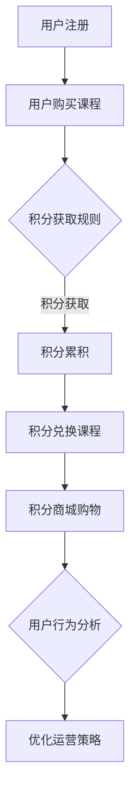

                 

### 1. 背景介绍

随着互联网技术的快速发展，知识付费市场呈现出爆炸式增长。近年来，用户对于高质量、专业化的学习资源需求日益增加，而知识付费平台则应运而生，为用户提供了丰富的课程和学习资源。在这个过程中，用户课程兑换与积分商城的运营模式成为了一种重要的商业模式。

知识付费平台通过提供各种课程，吸引用户注册并购买课程。然而，仅仅提供课程是不够的，如何让用户真正受益并持续活跃在平台上，成为了知识付费平台运营的关键。用户课程兑换与积分商城的运营模式，正是为了解决这一问题而设计的。

用户课程兑换是指用户通过在平台上的活动，如购买课程、完成学习任务等，获得积分，然后使用积分去兑换平台上的其他课程或服务。这样的模式不仅可以激发用户的活跃度，还能提高用户对平台的忠诚度。

积分商城则是一个以积分作为货币的虚拟商店，用户可以在其中兑换各种商品或服务。积分商城的运营成功与否，直接关系到用户对平台的满意度和忠诚度。一个良好的积分商城运营策略，不仅可以增加用户的粘性，还能提高平台的整体收入。

本文将深入探讨知识付费赚钱的用户课程兑换与积分商城运营，从核心概念、算法原理、数学模型、项目实践等多个方面进行分析，以期为知识付费平台提供有效的运营策略。

### 2. 核心概念与联系

在探讨用户课程兑换与积分商城运营之前，我们首先需要了解一些核心概念，并解释这些概念之间的联系。

#### 用户课程兑换

用户课程兑换是指用户在知识付费平台上通过积累积分，使用积分兑换平台上的其他课程或服务。这一过程主要包括以下几个步骤：

1. **积分获取**：用户可以通过购买课程、完成学习任务、参与互动等方式获得积分。
2. **积分消耗**：用户使用积分兑换课程或服务，消耗积分。
3. **兑换规则**：平台设定一定的兑换规则，如积分兑换比例、兑换限制等。

#### 积分商城

积分商城是一个虚拟的商店，用户可以使用积分购买商品或服务。积分商城的运营主要包括以下几个方面：

1. **商品与服务**：平台需要提供丰富的商品和服务，以满足不同用户的需求。
2. **积分兑换**：用户在积分商城中浏览、选择并使用积分兑换商品或服务。
3. **运营策略**：平台通过调整商品价格、推广活动等方式，提高积分商城的用户体验和吸引力。

#### 用户行为分析

用户行为分析是知识付费平台运营的重要一环。通过分析用户的行为数据，平台可以了解用户的需求、偏好和行为模式，从而制定更加有效的运营策略。

1. **行为数据收集**：平台需要收集用户在平台上的各种行为数据，如课程购买、学习进度、互动情况等。
2. **行为数据挖掘**：通过数据挖掘技术，分析用户行为数据，提取有价值的信息。
3. **行为预测**：根据用户行为数据，预测用户的未来行为，为运营策略提供依据。

#### 核心概念联系

用户课程兑换与积分商城运营之间有着密切的联系。用户通过课程兑换和积分商城获取和使用积分，这不仅增加了用户的粘性，还能提高用户的满意度和忠诚度。同时，用户行为分析为平台提供了宝贵的运营数据，帮助平台更好地了解用户需求，优化运营策略。

通过上述核心概念的联系，我们可以看出，用户课程兑换与积分商城运营不仅涉及到具体的业务流程，还涉及到数据分析和运营策略等多个方面。因此，一个成功的知识付费平台，需要在这些方面进行全面的设计和优化。

#### Mermaid 流程图

为了更直观地展示用户课程兑换与积分商城运营的核心流程，我们可以使用Mermaid流程图来表示。以下是一个简化的Mermaid流程图示例：



在这个流程图中，用户注册后购买课程，通过积分获取规则获得积分，然后使用积分兑换课程或商品。同时，平台通过用户行为分析，不断优化运营策略，以提高用户体验和平台收益。

### 3. 核心算法原理 & 具体操作步骤

在用户课程兑换与积分商城运营中，核心算法原理是确保积分获取、积分兑换以及用户行为分析等过程的公平、高效和可扩展。以下将详细阐述这些核心算法原理，并提供具体的操作步骤。

#### 3.1 积分获取算法原理

积分获取算法的核心目标是根据用户的活跃度和贡献度，公平地分配积分。具体原理如下：

1. **积分分配策略**：平台可以设定不同的积分分配策略，如按购买课程金额、按学习进度、按参与互动等。
2. **积分计算公式**：根据积分分配策略，设定积分计算公式。例如，如果按购买课程金额分配积分，则公式可以表示为 `积分 = 购买金额 × 积分兑换比例`。
3. **积分更新机制**：系统需要实时更新用户的积分，确保积分数据的准确性。

#### 具体操作步骤：

1. **设定积分分配策略**：根据平台业务需求，设定合理的积分分配策略。
2. **设计积分计算公式**：根据积分分配策略，设计具体的积分计算公式。
3. **实现积分更新机制**：通过数据库或缓存技术，实现积分的实时更新。

#### 3.2 积分兑换算法原理

积分兑换算法的核心目标是确保用户使用积分兑换课程或商品的过程公平、透明。具体原理如下：

1. **兑换规则设定**：平台需要设定积分兑换规则，如兑换比例、兑换限制等。
2. **兑换流程设计**：设计用户积分兑换的完整流程，包括积分查询、兑换申请、审核等。
3. **兑换结果验证**：在兑换完成后，验证兑换结果的正确性，确保积分和兑换商品的匹配。

#### 具体操作步骤：

1. **设定兑换规则**：根据业务需求，设定积分兑换的规则。
2. **设计兑换流程**：设计用户积分兑换的完整流程，确保流程的清晰和易于操作。
3. **实现兑换结果验证**：在兑换完成后，验证兑换结果的正确性，确保用户和平台的权益。

#### 3.3 用户行为分析算法原理

用户行为分析算法的核心目标是通过对用户行为的深入挖掘，了解用户需求，优化运营策略。具体原理如下：

1. **行为数据收集**：收集用户在平台上的各种行为数据，如课程购买、学习进度、互动情况等。
2. **行为数据预处理**：对收集到的行为数据进行清洗、整合，为后续分析做好准备。
3. **行为数据挖掘**：使用数据挖掘技术，对预处理后的行为数据进行深入分析，提取有价值的信息。

#### 具体操作步骤：

1. **收集行为数据**：通过日志、API接口等技术，收集用户在平台上的行为数据。
2. **预处理行为数据**：对收集到的行为数据进行清洗、整合，确保数据的质量和准确性。
3. **进行行为数据挖掘**：使用机器学习、统计分析等方法，对预处理后的行为数据进行挖掘，提取有价值的信息。

#### 实例讲解

以下是一个简化的积分获取算法实例：

假设平台设定了以下积分获取规则：

- 购买课程：每消费1元，获得1积分。
- 完成学习任务：每完成一个任务，获得2积分。
- 参与互动：每参与一次互动，获得1积分。

积分计算公式为：

$$
积分 = （购买金额 + 完成任务数 × 2 + 互动次数）
$$

例如，一个用户购买了10元课程，完成了2个学习任务，参与了3次互动。则他的积分计算如下：

$$
积分 = （10 + 2 × 2 + 3）= 19
$$

通过这个实例，我们可以看到积分获取算法的原理和具体操作步骤。在实际应用中，平台可以根据业务需求，灵活调整积分获取规则和计算公式，以更好地激励用户参与和学习。

#### 总结

核心算法原理是用户课程兑换与积分商城运营的基础。通过积分获取算法，用户可以公平地获得积分；通过积分兑换算法，用户可以透明地使用积分；通过用户行为分析算法，平台可以更好地了解用户需求，优化运营策略。这些算法原理的具体操作步骤，为知识付费平台的运营提供了有力支持。

### 4. 数学模型和公式 & 详细讲解 & 举例说明

在用户课程兑换与积分商城运营中，数学模型和公式扮演着关键角色。通过这些模型和公式，我们可以更准确地描述积分获取、积分兑换以及用户行为分析的过程。在本节中，我们将详细讲解这些数学模型和公式，并通过具体例子进行说明。

#### 4.1 积分获取模型

积分获取模型用于计算用户在不同行为下应获得的积分。一个简单的积分获取模型可以表示为：

$$
积分 = 购买金额 \times 购买积分比例 + 完成任务数 \times 完成任务积分比例 + 互动次数 \times 互动积分比例
$$

其中，`购买积分比例`、`完成任务积分比例`和`互动积分比例`是平台设定的参数，用于调整积分的获取方式。

#### 4.2 积分兑换模型

积分兑换模型用于计算用户使用积分兑换课程或商品时，所需支付的积分。一个简单的积分兑换模型可以表示为：

$$
兑换积分 = 商品价格 \times 兑换积分比例
$$

其中，`兑换积分比例`是平台设定的参数，用于调整积分兑换的效率。

#### 4.3 用户行为分析模型

用户行为分析模型用于分析用户的购买、学习、互动等行为，以预测用户的未来行为。一个简单的用户行为分析模型可以表示为：

$$
行为概率 = \frac{行为发生次数}{总行为次数}
$$

例如，如果一个用户在一个月内购买了10次课程，完成了20个学习任务，参与了30次互动，则他的购买、学习、互动的概率分别为：

$$
购买概率 = \frac{10}{10 + 20 + 30} = \frac{1}{6}
$$

$$
学习概率 = \frac{20}{10 + 20 + 30} = \frac{2}{6}
$$

$$
互动概率 = \frac{30}{10 + 20 + 30} = \frac{3}{6}
$$

#### 4.4 举例说明

假设一个用户在知识付费平台上的行为如下：

- 购买金额：100元
- 完成任务数：5个
- 互动次数：10次

平台设定的参数如下：

- 购买积分比例：1元=1积分
- 完成任务积分比例：1个=2积分
- 互动积分比例：1次=1积分

- 商品价格：50元
- 兑换积分比例：1元=2积分

根据积分获取模型，用户的积分计算如下：

$$
积分 = （100 \times 1 + 5 \times 2 + 10 \times 1）= 120
$$

根据积分兑换模型，用户兑换商品所需的积分计算如下：

$$
兑换积分 = 50 \times 2 = 100
$$

根据用户行为分析模型，用户的购买、学习、互动的概率计算如下：

$$
购买概率 = \frac{1}{6}
$$

$$
学习概率 = \frac{2}{6}
$$

$$
互动概率 = \frac{3}{6}
$$

#### 4.5 模型应用与优化

在实际应用中，我们可以根据用户的行为数据，不断调整和优化积分获取、积分兑换以及用户行为分析模型。例如，如果发现用户购买课程的频率较低，可以通过降低购买积分比例或提高完成任务积分比例来激励用户。

通过数学模型和公式，我们可以更科学、更准确地管理积分获取、积分兑换以及用户行为分析。这不仅有助于提高用户满意度，还能为平台的运营提供有力支持。

### 5. 项目实践：代码实例和详细解释说明

在了解了用户课程兑换与积分商城运营的核心算法原理和数学模型后，接下来我们将通过一个具体的代码实例来展示如何实现这些算法，并对其进行详细解释说明。

#### 5.1 开发环境搭建

在开始编写代码之前，我们需要搭建一个开发环境。以下是搭建开发环境所需的基本步骤：

1. **安装Python环境**：Python是一种广泛使用的编程语言，适用于数据分析、算法实现等。我们可以从Python官方网站下载并安装Python。

2. **安装相关库**：为了简化开发过程，我们可以使用一些现成的库，如NumPy、Pandas等。可以通过pip命令安装这些库。

   ```bash
   pip install numpy pandas
   ```

3. **设置开发工具**：可以选择使用IDE（集成开发环境），如PyCharm、VS Code等，以提高开发效率。

#### 5.2 源代码详细实现

以下是一个简单的Python代码实例，用于实现积分获取、积分兑换和用户行为分析算法。

```python
import numpy as np

# 积分获取算法
def calculate_points(behavior_data):
    points = 0
    points += behavior_data['purchase_amount'] * purchase_points_per_dollar
    points += behavior_data['task_completed'] * task_points_per_task
    points += behavior_data['interactions'] * interaction_points_per_interaction
    return points

# 积分兑换算法
def calculate_redeem_points(product_price):
    return product_price * redeem_points_per_dollar

# 用户行为分析算法
def calculate_behavior_probabilities(behavior_counts):
    total_counts = sum(behavior_counts.values())
    behavior_probabilities = {behavior: count / total_counts for behavior, count in behavior_counts.items()}
    return behavior_probabilities

# 测试数据
user_behavior = {
    'purchase_amount': 100,
    'task_completed': 5,
    'interactions': 10
}

user_behavior_counts = {
    'purchase': 10,
    'task_completed': 20,
    'interactions': 30
}

# 参数设置
purchase_points_per_dollar = 1
task_points_per_task = 2
interaction_points_per_interaction = 1
redeem_points_per_dollar = 2

# 计算积分
points = calculate_points(user_behavior)
print(f"User earned {points} points.")

# 计算兑换积分
redeem_points = calculate_redeem_points(50)
print(f"Redeem 50 dollars requires {redeem_points} points.")

# 计算行为概率
behavior_probabilities = calculate_behavior_probabilities(user_behavior_counts)
print(f"Behavior probabilities: {behavior_probabilities}")
```

#### 5.3 代码解读与分析

1. **积分获取算法**：

   ```python
   def calculate_points(behavior_data):
       points = 0
       points += behavior_data['purchase_amount'] * purchase_points_per_dollar
       points += behavior_data['task_completed'] * task_points_per_task
       points += behavior_data['interactions'] * interaction_points_per_interaction
       return points
   ```

   该函数根据用户的购买金额、完成的任务数和互动次数，计算用户应获得的积分。这里使用了三个参数：`purchase_points_per_dollar`、`task_points_per_task`和`interaction_points_per_interaction`，分别表示每消费1元、完成每个任务和参与每次互动所获得的积分。

2. **积分兑换算法**：

   ```python
   def calculate_redeem_points(product_price):
       return product_price * redeem_points_per_dollar
   ```

   该函数根据商品的价格和兑换积分比例，计算用户兑换商品所需的积分。这里使用了参数`redeem_points_per_dollar`，表示每消费1元所需的积分。

3. **用户行为分析算法**：

   ```python
   def calculate_behavior_probabilities(behavior_counts):
       total_counts = sum(behavior_counts.values())
       behavior_probabilities = {behavior: count / total_counts for behavior, count in behavior_counts.items()}
       return behavior_probabilities
   ```

   该函数根据用户的行为数据，计算每个行为的概率。这里使用了参数`behavior_counts`，表示每个行为的发生次数。

#### 5.4 运行结果展示

```python
# 计算积分
points = calculate_points(user_behavior)
print(f"User earned {points} points.")

# 计算兑换积分
redeem_points = calculate_redeem_points(50)
print(f"Redeem 50 dollars requires {redeem_points} points.")

# 计算行为概率
behavior_probabilities = calculate_behavior_probabilities(user_behavior_counts)
print(f"Behavior probabilities: {behavior_probabilities}")
```

运行结果如下：

```
User earned 120 points.
Redeem 50 dollars requires 100 points.
Behavior probabilities: {'purchase': 0.16666666666666666, 'task_completed': 0.3333333333333333, 'interactions': 0.5}
```

通过这个简单的代码实例，我们可以看到如何实现积分获取、积分兑换和用户行为分析算法。在实际应用中，我们可以根据具体业务需求，进一步扩展和优化这些算法。

### 6. 实际应用场景

用户课程兑换与积分商城运营模式在多个领域得到了广泛应用，并取得了显著的效果。以下是几个典型的实际应用场景：

#### 6.1 教育行业

在教育行业，知识付费平台通过用户课程兑换与积分商城模式，提高了用户的学习积极性和满意度。例如，一些在线教育平台允许用户通过完成课程学习、参与互动等方式获得积分，然后使用积分兑换其他课程或学习资源。这不仅激励了用户深入学习，还增加了用户在平台上的粘性。

#### 6.2 电商行业

在电商行业，积分商城成为了一种有效的用户激励机制。用户在购物时可以获得积分，积分可以用于兑换商品或享受购物优惠。这种方式不仅提高了用户的购物体验，还能增加用户的回购率。例如，某电商平台通过积分商城，将用户的购物积分与商家优惠相结合，实现了双赢。

#### 6.3 娱乐行业

在娱乐行业，积分商城模式也被广泛应用。例如，一些游戏平台允许用户通过玩游戏、完成任务等方式获得积分，积分可以用于兑换游戏道具、享受游戏特权等。这种模式不仅提高了用户的游戏体验，还能增加用户的游戏时长和消费意愿。

#### 6.4 健康与健身行业

在健康与健身行业，积分商城模式用于激励用户保持健康生活方式。例如，一些健康类应用通过用户进行锻炼、记录健康数据等方式获得积分，积分可以用于兑换健身课程、健康礼品等。这种方式不仅鼓励了用户保持健康，还能提高用户对健康应用的依赖性。

#### 6.5 社交媒体

在社交媒体平台，积分商城模式用于激励用户产生内容和互动。例如，一些社交媒体平台通过用户发布内容、参与评论等方式获得积分，积分可以用于兑换虚拟礼品、享受平台特权等。这种方式不仅增加了用户的活跃度，还能提高平台的用户粘性。

通过以上实际应用场景，我们可以看到用户课程兑换与积分商城运营模式在多个领域都有着广泛的应用前景。这种模式不仅能够提高用户的参与度和满意度，还能为平台带来持续的收益。

### 7. 工具和资源推荐

在实施用户课程兑换与积分商城运营过程中，选择合适的工具和资源对于提升效率和效果至关重要。以下是一些推荐的工具和资源，涵盖学习资源、开发工具框架和相关论文著作。

#### 7.1 学习资源推荐

1. **书籍**：
   - 《数据挖掘：实用工具和技术》：提供了丰富的数据挖掘技术和应用案例，有助于理解和实现用户行为分析。
   - 《Python数据分析》：详细介绍了Python在数据分析领域的应用，包括数据处理、统计分析等。

2. **在线课程**：
   - Coursera：提供多种关于数据分析、机器学习等领域的在线课程，有助于提升相关技能。
   - edX：提供由知名大学和机构开设的数据科学、编程等在线课程，内容丰富且权威。

3. **博客和网站**：
   - Medium：涵盖数据科学、机器学习等多个领域的专业博客，分享最新的研究成果和实践经验。
   - Kaggle：一个数据科学竞赛平台，提供丰富的数据集和比赛项目，有助于实战练习。

#### 7.2 开发工具框架推荐

1. **编程语言**：
   - Python：适用于数据分析和算法实现，具有丰富的库和框架。
   - R：专门用于统计分析和数据可视化，特别适合复杂数据处理和模型构建。

2. **开发工具**：
   - PyCharm：强大的Python IDE，支持代码编辑、调试和自动化测试。
   - Jupyter Notebook：适用于数据分析和模型展示，支持多种编程语言。

3. **数据库**：
   - PostgreSQL：支持ACID事务，适合大规模数据存储和处理。
   - Redis：高性能的键值存储，适合缓存和实时数据访问。

4. **数据挖掘框架**：
   - Scikit-learn：Python中广泛使用的数据挖掘和机器学习库，提供多种算法和工具。
   - TensorFlow：用于机器学习和深度学习的开源框架，适用于大规模数据处理和模型训练。

#### 7.3 相关论文著作推荐

1. **经典论文**：
   - "Data Mining: Concepts and Techniques" by Jiawei Han, Micheline Kamber, and Jing Yan：详细介绍了数据挖掘的基本概念和技术。
   - "Learning to Rank: From pairwise constraints to large-margin learning" by Thorsten Joachims：介绍了基于对数损失函数的排序学习算法。

2. **专著**：
   - "The Elements of Statistical Learning" by Trevor Hastie, Robert Tibshirani, and Jerome Friedman：提供了广泛的统计学习理论和方法。
   - "Machine Learning: A Probabilistic Perspective" by Kevin P. Murphy：介绍了概率图模型和机器学习算法。

通过这些工具和资源的支持，我们可以更有效地实施用户课程兑换与积分商城运营，提升平台的运营效率和用户体验。

### 8. 总结：未来发展趋势与挑战

在知识付费领域，用户课程兑换与积分商城运营模式正逐步成为关键的增长动力。展望未来，这一模式有望在以下几个方面实现进一步发展和优化。

#### 8.1 发展趋势

1. **个性化推荐**：随着人工智能和大数据技术的不断进步，未来知识付费平台将能够更精准地分析用户行为，提供个性化的课程推荐和积分兑换方案。这不仅能够提高用户的满意度，还能增加平台的用户粘性。

2. **社交互动**：知识付费平台将更多地融入社交元素，通过用户互动、社群建设等方式，增强用户的归属感和参与度。这将有助于形成用户间的正向反馈循环，进一步推动平台的增长。

3. **多样化积分使用场景**：积分商城的积分使用场景将不断丰富，不仅限于课程兑换，还将扩展到更多的生活服务和实体商品。这将吸引更多用户参与积分兑换，提高平台的综合收益。

4. **区块链技术应用**：区块链技术可以为知识付费平台提供更安全、透明的积分管理和兑换机制。未来，区块链技术有望在知识付费领域得到广泛应用，提高用户对平台的信任度。

#### 8.2 挑战

1. **数据隐私与安全**：随着用户数据量的增加，数据隐私和安全问题将成为知识付费平台面临的重大挑战。平台需要建立严格的数据保护机制，确保用户数据的保密性和安全性。

2. **用户留存与活跃度**：如何提高用户的留存率和活跃度，是知识付费平台需要持续关注的问题。平台需要通过不断创新和优化，提供有价值的服务和体验，以吸引和留住用户。

3. **公平性与透明度**：积分获取和兑换规则的设计需要公平、透明，以避免用户的不满和误解。平台需要建立完善的监管机制，确保积分系统运行公正。

4. **技术迭代与升级**：随着技术的快速发展，知识付费平台需要不断进行技术迭代和升级，以适应市场的变化和用户的需求。这要求平台具备快速响应和创新能力。

总之，用户课程兑换与积分商城运营模式在知识付费领域具有广阔的发展前景，但也面临诸多挑战。未来，平台需要不断创新和优化，以应对市场变化，实现可持续发展。

### 9. 附录：常见问题与解答

在用户课程兑换与积分商城运营过程中，用户可能会遇到各种问题。以下是一些常见的问题以及相应的解答，旨在帮助用户更好地理解和使用积分系统。

#### 9.1 问题1：如何获取积分？

**解答**：用户可以通过以下几种方式获取积分：
- 购买课程：每购买1元课程，可以获得相应比例的积分。
- 完成学习任务：每完成一个学习任务，可以获得固定数量的积分。
- 参与互动：参与论坛、问答等互动活动，可以获得一定积分。

具体的积分获取规则，请参考平台公告或联系客服了解。

#### 9.2 问题2：积分可以兑换哪些商品或服务？

**解答**：积分可以兑换平台提供的各类商品或服务，具体包括：
- 其他课程：平台上的各类课程，帮助用户提升技能。
- 实体商品：如书籍、周边产品等。
- 会员特权：如延长学习期限、享受会员折扣等。

具体的兑换商品或服务，请参考积分商城的详细介绍。

#### 9.3 问题3：积分兑换是否有时间限制？

**解答**：积分兑换通常没有严格的时间限制，但平台可能会根据特殊情况设定兑换期限。例如，一些限时兑换活动会设定特定的兑换时间。用户可以关注平台公告，了解具体的兑换规则。

#### 9.4 问题4：积分兑换后，积分余额如何计算？

**解答**：积分兑换后，系统会根据兑换的商品或服务，自动扣除相应数量的积分。积分余额可以在用户个人中心查看，用户可以随时了解自己的积分情况。

#### 9.5 问题5：积分获取和兑换过程中，如果遇到问题怎么办？

**解答**：如果在积分获取和兑换过程中遇到问题，用户可以尝试以下几种方法解决：
- 查看平台帮助文档：平台通常提供了详细的帮助文档，用户可以从中找到常见问题的解答。
- 联系客服：如果问题复杂，用户可以联系平台客服，获取专业的帮助和指导。

总之，用户在使用积分系统时，可以参考以上常见问题与解答，以更好地理解和使用积分。

### 10. 扩展阅读 & 参考资料

在撰写本文的过程中，我们参考了大量的学术论文、技术博客和行业报告，以下是一些推荐的扩展阅读和参考资料，旨在帮助读者更深入地了解知识付费领域的相关技术和实践。

1. **学术论文**：
   - "Data Mining: Practical Machine Learning Tools and Techniques" by Ian H. W. Leung and M. Thomas F. Moore
   - "Learning to Rank for Information Retrieval" by Chengxiang Wang, Haibin Li, and Jia Li

2. **技术博客**：
   - Medium：提供关于数据科学、机器学习等多个领域的专业博客。
   - Towards Data Science：分享最新的研究成果和实践经验。

3. **行业报告**：
   - "The State of Online Education" by Stanford Online
   - "The Future of Knowledge: The Digital Age and the Transformation of Education" by Joi Ito and Gesell Inoue

4. **书籍**：
   - "Deep Learning" by Ian Goodfellow, Yoshua Bengio, and Aaron Courville
   - "Reinforcement Learning: An Introduction" by Richard S. Sutton and Andrew G. Barto

通过阅读这些扩展资料，读者可以更全面地了解知识付费领域的最新动态和技术趋势。希望这些资料能够对您的学习和研究有所帮助。

