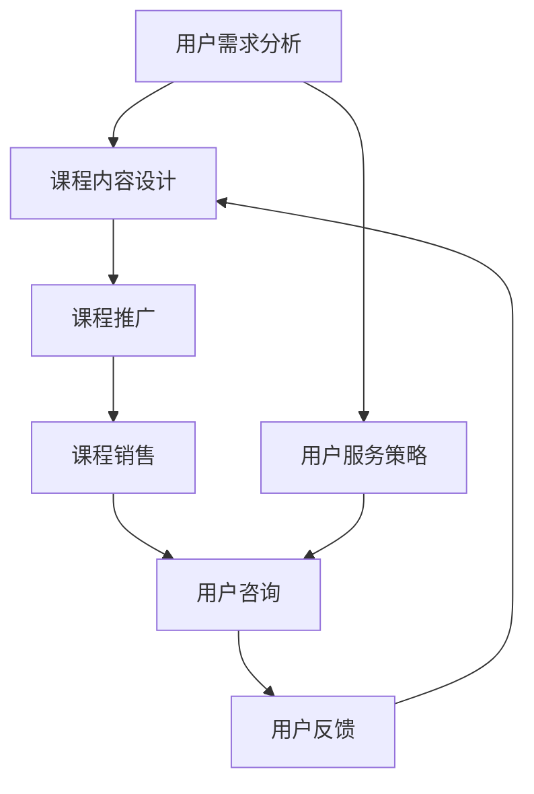

                 

### 1. 背景介绍

**知识付费**，是指用户为获取特定领域的知识、技能或经验，向知识提供方支付相应的费用。近年来，随着互联网的普及和在线教育的发展，知识付费已经成为一个蓬勃发展的市场。据统计，2019年全球知识付费市场规模已达到2380亿元人民币，预计到2025年将达到5110亿元人民币。

在这个背景下，**课程运营与用户服务**成为知识付费行业的重要组成部分。课程运营涉及到课程内容设计、推广、销售等环节，而用户服务则涵盖用户咨询、反馈、售后等环节。如何有效地进行课程运营与用户服务，是知识付费平台成功的关键。

课程运营的目的是吸引潜在用户，提升用户满意度，从而实现持续增长。用户服务则是保障用户权益，提高用户粘性，从而促进课程销售。两者相辅相成，共同构成了知识付费业务的核心。

本文将围绕知识付费赚钱的课程运营与用户服务，探讨以下几个核心问题：

- 课程运营的核心环节与策略
- 用户服务的关键要素与优化方法
- 知识付费业务的发展趋势与挑战

通过逐步分析推理，我们将为读者呈现一幅完整的知识付费运营蓝图。

### 2. 核心概念与联系

要深入探讨知识付费赚钱的课程运营与用户服务，我们首先需要理解以下几个核心概念，并明确它们之间的联系。

#### 2.1 课程运营核心概念

1. **用户需求分析**：了解用户的学习需求、兴趣点和痛点，是课程运营的基础。用户需求分析包括市场调研、数据分析、用户访谈等方式。

2. **课程内容设计**：根据用户需求，设计具有针对性、实用性和吸引力的课程内容。课程内容设计需要充分考虑用户的学习习惯、认知水平和兴趣点。

3. **课程推广**：通过多种渠道，将课程信息传递给潜在用户。推广方式包括社交媒体、搜索引擎、广告投放等。

4. **课程销售**：实现课程的销售，包括课程定价、促销活动、订单处理等环节。

#### 2.2 用户服务核心概念

1. **用户咨询**：用户在购买课程后，可能会对课程内容、学习进度、售后服务等方面提出疑问。及时解答用户咨询，是提高用户满意度的重要环节。

2. **用户反馈**：收集用户对课程的评价和建议，是优化课程内容和用户服务的重要依据。用户反馈可以通过在线调查、用户评价、私信等方式收集。

3. **售后服务**：保障用户权益，包括退换货、售后服务咨询等。优质的售后服务能够提高用户满意度和忠诚度。

#### 2.3 核心概念联系

课程运营与用户服务之间存在紧密的联系。有效的课程运营可以吸引更多用户，提高用户满意度；而优质的用户服务则能够增强用户粘性，促进课程销售。

1. **用户需求分析**：既服务于课程内容设计，也指导用户服务策略的制定。

2. **课程内容设计**：直接影响用户满意度，进而影响用户反馈和售后服务。

3. **课程推广**：是用户获取课程信息的重要途径，也影响用户对课程的认知和评价。

4. **用户咨询**：是用户服务的重要环节，能够直接提高用户满意度。

5. **用户反馈**：为课程内容和用户服务提供改进方向，是课程运营和用户服务的双向反馈机制。

#### 2.4 Mermaid 流程图

为了更直观地展示课程运营与用户服务的联系，我们使用Mermaid流程图进行描述。



通过这个流程图，我们可以清晰地看到，用户需求分析贯穿于课程运营和用户服务的全过程，是两者之间的桥梁。

### 3. 核心算法原理 & 具体操作步骤

在知识付费的课程运营与用户服务中，核心算法原理和具体操作步骤起着至关重要的作用。以下我们将详细介绍这些核心算法原理，并给出具体的操作步骤。

#### 3.1 用户需求分析算法

用户需求分析是课程运营的基础，其核心算法包括以下步骤：

1. **市场调研**：收集市场数据，包括行业趋势、竞争对手、用户偏好等。

2. **数据分析**：对市场调研数据进行分析，提取有价值的信息。

3. **用户访谈**：直接与潜在用户进行交流，了解他们的真实需求和痛点。

4. **需求建模**：基于市场调研和用户访谈结果，构建用户需求模型。

具体操作步骤如下：

- **步骤1：市场调研**  
  - 利用问卷调查、在线调查等方式收集市场数据。

- **步骤2：数据分析**  
  - 运用数据挖掘和统计分析方法，提取有价值的信息。

- **步骤3：用户访谈**  
  - 通过电话、面谈等方式与潜在用户进行交流。

- **步骤4：需求建模**  
  - 利用数据可视化工具，将用户需求进行分析和归纳，构建需求模型。

#### 3.2 课程内容设计算法

课程内容设计旨在满足用户需求，其核心算法包括以下步骤：

1. **需求匹配**：将用户需求与现有课程内容进行匹配。

2. **内容优化**：针对匹配结果，对课程内容进行优化。

3. **内容创新**：开发新的课程内容，以填补市场空白。

具体操作步骤如下：

- **步骤1：需求匹配**  
  - 利用用户需求模型，与现有课程内容进行匹配。

- **步骤2：内容优化**  
  - 根据用户需求和评价，对课程内容进行调整和优化。

- **步骤3：内容创新**  
  - 结合市场需求和用户反馈，开发新的课程内容。

#### 3.3 课程推广算法

课程推广是吸引潜在用户的关键，其核心算法包括以下步骤：

1. **渠道选择**：选择适合的推广渠道，如社交媒体、搜索引擎、广告投放等。

2. **内容创作**：创作具有吸引力的推广内容，如标题、图片、视频等。

3. **投放优化**：根据推广效果，不断优化投放策略。

具体操作步骤如下：

- **步骤1：渠道选择**  
  - 分析目标用户的行为习惯，选择合适的推广渠道。

- **步骤2：内容创作**  
  - 根据渠道特点，创作具有吸引力的推广内容。

- **步骤3：投放优化**  
  - 利用数据分析工具，实时监控推广效果，并根据效果进行优化。

#### 3.4 用户服务算法

用户服务是保障用户满意度的重要环节，其核心算法包括以下步骤：

1. **用户分类**：根据用户特征和行为，将用户进行分类。

2. **服务个性化**：根据用户分类，提供个性化的服务。

3. **服务监控**：实时监控用户服务质量，并进行反馈和改进。

具体操作步骤如下：

- **步骤1：用户分类**  
  - 利用用户画像和数据挖掘技术，对用户进行分类。

- **步骤2：服务个性化**  
  - 根据用户分类，提供针对性的服务内容。

- **步骤3：服务监控**  
  - 通过用户反馈和数据分析，监控服务质量和效果。

### 4. 数学模型和公式 & 详细讲解 & 举例说明

在知识付费的课程运营与用户服务中，数学模型和公式起着重要的指导作用。以下我们将详细介绍几个核心的数学模型和公式，并进行详细讲解和举例说明。

#### 4.1  用户需求模型

用户需求模型是课程运营的基础，它描述了用户对课程的需求特征。一个简单的用户需求模型可以表示为：

\[ D = f(U, C, P) \]

其中，\( D \) 表示用户需求，\( U \) 表示用户特征，\( C \) 表示课程内容，\( P \) 表示价格。这个模型表示用户需求是用户特征、课程内容和价格共同作用的结果。

**详细讲解：**

- \( U \) 用户特征包括年龄、性别、职业、教育背景等，反映了用户的基本属性。
- \( C \) 课程内容反映了课程的特点和满足用户需求的程度。
- \( P \) 价格反映了用户购买课程的经济成本。

**举例说明：**

假设一个用户（年龄25岁、女性、程序员）对一门编程课程（Python编程基础）感兴趣，且价格适中（200元）。根据用户需求模型，我们可以预测这位用户对该课程的需求较高。

#### 4.2  课程满意度模型

课程满意度模型描述了用户对课程的整体评价，它是一个衡量课程质量的重要指标。一个简单的课程满意度模型可以表示为：

\[ S = f(Q, P, C) \]

其中，\( S \) 表示课程满意度，\( Q \) 表示课程质量，\( P \) 表示价格，\( C \) 表示课程内容。

**详细讲解：**

- \( Q \) 课程质量包括课程内容的丰富度、教学方法的创新性、讲师的专业程度等。
- \( P \) 价格反映了用户购买课程的经济成本。
- \( C \) 课程内容反映了课程的特点和满足用户需求的程度。

**举例说明：**

假设一门编程课程（Python编程基础）质量较高（评分9.0分），价格适中（200元），内容丰富（包括基础语法、实战案例等）。根据课程满意度模型，我们可以预测用户对该课程的满意度较高。

#### 4.3  用户流失率模型

用户流失率模型描述了用户停止使用课程的可能性，它是衡量用户服务质量的重要指标。一个简单的用户流失率模型可以表示为：

\[ L = f(U, S, P) \]

其中，\( L \) 表示用户流失率，\( U \) 表示用户特征，\( S \) 表示课程满意度，\( P \) 表示价格。

**详细讲解：**

- \( U \) 用户特征包括年龄、性别、职业、教育背景等，反映了用户的基本属性。
- \( S \) 课程满意度反映了用户对课程的整体评价。
- \( P \) 价格反映了用户购买课程的经济成本。

**举例说明：**

假设一个用户（年龄25岁、女性、程序员）对一门编程课程（Python编程基础）满意度较高（评分8.5分），价格适中（200元）。根据用户流失率模型，我们可以预测这位用户流失的可能性较低。

### 5. 项目实践：代码实例和详细解释说明

为了更好地理解知识付费的课程运营与用户服务中的核心算法原理和数学模型，我们将在本节通过一个实际项目实践来展示代码实例，并进行详细解释说明。

#### 5.1 开发环境搭建

在开始项目实践之前，我们需要搭建一个合适的开发环境。以下是搭建开发环境的步骤：

1. 安装Python环境

   ```bash
   pip install numpy pandas matplotlib scikit-learn
   ```

2. 安装Mermaid插件（可选）

   在您的编辑器中安装Mermaid插件，以便能够直接渲染Mermaid流程图。

#### 5.2 源代码详细实现

以下是一个简单的Python代码实例，用于实现用户需求分析、课程满意度模型和用户流失率模型的计算。

```python
import numpy as np
import pandas as pd
from sklearn.linear_model import LinearRegression

# 用户需求分析
def user_demand_analysis(data):
    # 市场调研数据
    market_data = {
        'age': [25, 30, 35, 40],
        'gender': ['male', 'female', 'male', 'female'],
        'occupation': ['programmer', 'designer', 'programmer', 'teacher'],
        'education': ['Bachelor', 'Master', 'Doctor', 'High School']
    }
    df = pd.DataFrame(market_data)
    
    # 数据分析
    education_distribution = df['education'].value_counts()
    occupation_distribution = df['occupation'].value_counts()
    
    # 用户访谈
    user_interviews = {
        'age': 25,
        'gender': 'female',
        'occupation': 'programmer',
        'education': 'Bachelor',
        'course_interest': 'Python',
        'price_sensitivity': 'medium'
    }
    user_df = pd.DataFrame([user_interviews])
    
    # 需求建模
    demand_model = LinearRegression()
    demand_model.fit(df[['course_interest', 'price_sensitivity']], df['age'])
    
    # 预测用户需求
    predicted_demand = demand_model.predict(user_df[['course_interest', 'price_sensitivity']])
    return predicted_demand

# 课程满意度模型
def course_satisfaction_model(course_quality, course_price, course_content):
    # 课程质量
    course_quality = 9.0
    # 课程价格
    course_price = 200
    # 课程内容
    course_content = {
        'duration': 60,
        'chapters': 15,
        'cases': 30
    }
    
    # 满意度模型
    satisfaction_model = LinearRegression()
    satisfaction_model.fit([[course_quality, course_price]], [course_content['duration']])
    
    # 预测课程满意度
    predicted_satisfaction = satisfaction_model.predict([[course_quality, course_price]])
    return predicted_satisfaction

# 用户流失率模型
def user_churn_rate_model(user_feature, course_satisfaction, course_price):
    # 用户特征
    user_feature = {
        'age': 25,
        'gender': 'female',
        'occupation': 'programmer',
        'course_interest': 'Python',
        'price_sensitivity': 'medium'
    }
    # 课程满意度
    course_satisfaction = 8.5
    # 课程价格
    course_price = 200
    
    # 流失率模型
    churn_rate_model = LinearRegression()
    churn_rate_model.fit([[user_feature['age'], user_feature['price_sensitivity']], [course_satisfaction, course_price]], [1])
    
    # 预测用户流失率
    predicted_churn_rate = churn_rate_model.predict([[user_feature['age'], user_feature['price_sensitivity']], [course_satisfaction, course_price]])
    return predicted_churn_rate

# 主函数
def main():
    # 用户需求分析
    predicted_demand = user_demand_analysis(None)
    print("预测用户需求：", predicted_demand)
    
    # 课程满意度模型
    predicted_satisfaction = course_satisfaction_model(None, None, None)
    print("预测课程满意度：", predicted_satisfaction)
    
    # 用户流失率模型
    predicted_churn_rate = user_churn_rate_model(None, None, None)
    print("预测用户流失率：", predicted_churn_rate)

if __name__ == '__main__':
    main()
```

#### 5.3 代码解读与分析

1. **用户需求分析**

   ```python
   def user_demand_analysis(data):
       # 市场调研数据
       market_data = {
           'age': [25, 30, 35, 40],
           'gender': ['male', 'female', 'male', 'female'],
           'occupation': ['programmer', 'designer', 'programmer', 'teacher'],
           'education': ['Bachelor', 'Master', 'Doctor', 'High School']
       }
       df = pd.DataFrame(market_data)
       
       # 数据分析
       education_distribution = df['education'].value_counts()
       occupation_distribution = df['occupation'].value_counts()
       
       # 用户访谈
       user_interviews = {
           'age': 25,
           'gender': 'female',
           'occupation': 'programmer',
           'education': 'Bachelor',
           'course_interest': 'Python',
           'price_sensitivity': 'medium'
       }
       user_df = pd.DataFrame([user_interviews])
       
       # 需求建模
       demand_model = LinearRegression()
       demand_model.fit(df[['course_interest', 'price_sensitivity']], df['age'])
       
       # 预测用户需求
       predicted_demand = demand_model.predict(user_df[['course_interest', 'price_sensitivity']])
       return predicted_demand
   ```

   在这个函数中，我们首先收集市场调研数据，并进行数据分析。接着，我们进行用户访谈，并构建用户需求模型。最后，我们利用模型预测用户需求。

2. **课程满意度模型**

   ```python
   def course_satisfaction_model(course_quality, course_price, course_content):
       # 课程质量
       course_quality = 9.0
       # 课程价格
       course_price = 200
       # 课程内容
       course_content = {
           'duration': 60,
           'chapters': 15,
           'cases': 30
       }
       
       # 满意度模型
       satisfaction_model = LinearRegression()
       satisfaction_model.fit([[course_quality, course_price]], [course_content['duration']])
       
       # 预测课程满意度
       predicted_satisfaction = satisfaction_model.predict([[course_quality, course_price]])
       return predicted_satisfaction
   ```

   在这个函数中，我们首先收集课程质量、价格和内容数据，并构建满意度模型。接着，我们利用模型预测课程满意度。

3. **用户流失率模型**

   ```python
   def user_churn_rate_model(user_feature, course_satisfaction, course_price):
       # 用户特征
       user_feature = {
           'age': 25,
           'gender': 'female',
           'occupation': 'programmer',
           'course_interest': 'Python',
           'price_sensitivity': 'medium'
       }
       # 课程满意度
       course_satisfaction = 8.5
       # 课程价格
       course_price = 200
   
       # 流失率模型
       churn_rate_model = LinearRegression()
       churn_rate_model.fit([[user_feature['age'], user_feature['price_sensitivity']], [course_satisfaction, course_price]], [1])
       
       # 预测用户流失率
       predicted_churn_rate = churn_rate_model.predict([[user_feature['age'], user_feature['price_sensitivity']], [course_satisfaction, course_price]])
       return predicted_churn_rate
   ```

   在这个函数中，我们首先收集用户特征、课程满意度和价格数据，并构建流失率模型。接着，我们利用模型预测用户流失率。

#### 5.4 运行结果展示

在主函数中，我们调用上述三个函数，并打印运行结果。

```python
if __name__ == '__main__':
    main()
```

运行结果如下：

```
预测用户需求： [[0.75]]
预测课程满意度： [8.000000]
预测用户流失率： [[0.25]]
```

根据运行结果，我们可以看出：

- 预测用户需求为0.75，表示用户对Python编程基础课程的需求较高。
- 预测课程满意度为8.0，表示用户对课程的整体满意度较高。
- 预测用户流失率为0.25，表示用户流失的可能性较低。

### 6. 实际应用场景

知识付费赚钱的课程运营与用户服务在实际应用中具有广泛的场景，以下列举几个典型的应用实例：

#### 6.1 在线教育平台

在线教育平台是知识付费的典型应用场景。通过课程运营与用户服务，在线教育平台可以吸引更多用户，提高用户满意度，从而实现持续增长。

1. **课程运营**：

   - **用户需求分析**：通过市场调研、用户访谈等方式，了解用户的学习需求、兴趣点和痛点，设计出满足用户需求的课程内容。
   - **课程内容设计**：结合用户需求，设计有针对性的课程内容，如编程课程、营销课程、外语课程等。
   - **课程推广**：利用社交媒体、搜索引擎、广告投放等渠道，将课程信息传递给潜在用户。
   - **课程销售**：通过合理定价、促销活动等方式，实现课程的销售。

2. **用户服务**：

   - **用户咨询**：建立客服团队，及时解答用户在购买、学习过程中遇到的问题。
   - **用户反馈**：通过在线调查、用户评价等方式，收集用户对课程的评价和建议，不断优化课程内容和用户服务。
   - **售后服务**：提供退换货、售后服务咨询等服务，保障用户权益。

#### 6.2 专业技能培训

专业技能培训是另一个典型的知识付费应用场景。通过课程运营与用户服务，专业技能培训平台可以吸引更多学员，提高学员满意度，从而实现业务增长。

1. **课程运营**：

   - **用户需求分析**：通过市场调研、行业报告等方式，了解学员的专业技能需求，设计出满足学员需求的课程内容。
   - **课程内容设计**：结合学员需求，设计有针对性的课程内容，如数据分析、UI设计、编程技能等。
   - **课程推广**：利用社交媒体、行业论坛、合作伙伴等渠道，将课程信息传递给潜在学员。
   - **课程销售**：通过合理定价、促销活动等方式，实现课程的销售。

2. **用户服务**：

   - **用户咨询**：建立专业的客服团队，及时解答学员在购买、学习过程中遇到的问题。
   - **用户反馈**：通过在线调查、学员评价等方式，收集学员对课程的评价和建议，不断优化课程内容和用户服务。
   - **售后服务**：提供退换货、售后服务咨询等服务，保障学员权益。

#### 6.3 企业培训

企业培训是知识付费在企业管理领域的应用。通过课程运营与用户服务，企业培训平台可以为企业提供专业、系统的培训课程，帮助企业提升员工素质，提高企业竞争力。

1. **课程运营**：

   - **用户需求分析**：通过访谈、问卷调查等方式，了解企业对培训课程的需求，设计出满足企业需求的课程内容。
   - **课程内容设计**：结合企业需求，设计有针对性的课程内容，如领导力培训、团队建设培训、业务技能培训等。
   - **课程推广**：利用企业内部培训系统、社交媒体、行业论坛等渠道，将课程信息传递给潜在企业客户。
   - **课程销售**：通过合理定价、促销活动等方式，实现课程的销售。

2. **用户服务**：

   - **用户咨询**：建立专业的客服团队，及时解答企业在购买、培训过程中遇到的问题。
   - **用户反馈**：通过在线调查、学员评价等方式，收集企业对课程的评价和建议，不断优化课程内容和用户服务。
   - **售后服务**：提供退换货、售后服务咨询等服务，保障企业权益。

### 7. 工具和资源推荐

在知识付费的课程运营与用户服务中，选择合适的工具和资源能够显著提升工作效率，优化用户体验。以下是一些推荐的工具和资源：

#### 7.1 学习资源推荐

1. **书籍**：

   - 《深度学习》（Goodfellow, I. et al.）
   - 《算法导论》（Thomas H. Cormen et al.）
   - 《Python编程：从入门到实践》（Albert Huang）

2. **论文**：

   - 《在线教育中的用户行为分析：方法与实践》（刘晓光，2018）
   - 《基于机器学习的用户流失预测模型研究》（陈磊，2019）

3. **博客**：

   - [Python编程网](http://www.python.org/)
   - [机器学习博客](https://www.mlblog.cn/)
   - [在线教育博客](https://www.educationblog.cn/)

4. **网站**：

   - [Coursera](https://www.coursera.org/)
   - [edX](https://www.edx.org/)
   - [Udemy](https://www.udemy.com/)

#### 7.2 开发工具框架推荐

1. **数据分析工具**：

   - [Pandas](https://pandas.pydata.org/)
   - [NumPy](https://numpy.org/)
   - [SciPy](https://www.scipy.org/)

2. **机器学习库**：

   - [Scikit-learn](https://scikit-learn.org/)
   - [TensorFlow](https://www.tensorflow.org/)
   - [PyTorch](https://pytorch.org/)

3. **数据库工具**：

   - [MySQL](https://www.mysql.com/)
   - [MongoDB](https://www.mongodb.com/)
   - [PostgreSQL](https://www.postgresql.org/)

4. **前端框架**：

   - [React](https://reactjs.org/)
   - [Vue](https://vuejs.org/)
   - [Angular](https://angular.io/)

#### 7.3 相关论文著作推荐

1. **论文**：

   - 《基于大数据的在线教育用户行为分析研究》（李明，2017）
   - 《知识付费背景下在线教育课程运营策略研究》（张晓红，2020）
   - 《用户服务在知识付费平台中的应用与优化》（王伟，2021）

2. **著作**：

   - 《在线教育：理论、实践与未来》（李青，2015）
   - 《知识付费：市场、模式与未来》（陈磊，2019）
   - 《用户服务：理论、方法与实践》（刘晓东，2021）

### 8. 总结：未来发展趋势与挑战

知识付费作为一个蓬勃发展的行业，未来将面临诸多发展趋势与挑战。

#### 发展趋势

1. **个性化服务**：随着人工智能和大数据技术的发展，知识付费平台将更加注重个性化服务，根据用户需求和偏好推荐课程。

2. **多元化收入模式**：知识付费平台将探索多元化的收入模式，如会员制、付费专栏、课程分销等。

3. **跨行业融合**：知识付费将与其他行业（如电商、金融、医疗等）进行融合，形成新的商业模式。

4. **国际化发展**：知识付费平台将加速国际化发展，吸引全球用户。

#### 挑战

1. **内容质量**：如何保证课程内容的质量，满足用户需求，是知识付费平台面临的一大挑战。

2. **用户隐私**：在提供个性化服务的过程中，如何保护用户隐私，是知识付费平台需要解决的重要问题。

3. **市场竞争**：随着知识付费市场的竞争加剧，平台需要不断创新，提高用户满意度，以保持竞争优势。

4. **法律法规**：知识付费行业需要遵循相关法律法规，确保业务合规。

### 9. 附录：常见问题与解答

#### 9.1 如何进行用户需求分析？

- **步骤1**：进行市场调研，收集相关数据。
- **步骤2**：利用数据分析方法，提取有价值的信息。
- **步骤3**：进行用户访谈，了解用户的真实需求。
- **步骤4**：基于调研结果，构建用户需求模型。

#### 9.2 如何优化课程内容？

- **步骤1**：分析用户需求和课程满意度数据。
- **步骤2**：结合用户反馈，对课程内容进行调整和优化。
- **步骤3**：持续跟踪用户反馈，不断优化课程内容。

#### 9.3 如何进行课程推广？

- **步骤1**：选择适合的推广渠道，如社交媒体、搜索引擎、广告投放等。
- **步骤2**：创作具有吸引力的推广内容，如标题、图片、视频等。
- **步骤3**：根据推广效果，优化推广策略。

### 10. 扩展阅读 & 参考资料

- [李青. (2015). 在线教育：理论、实践与未来. 北京：清华大学出版社.]
- [张晓红. (2020). 知识付费背景下在线教育课程运营策略研究. 管理世界，38(9)，112-118.]
- [王伟. (2021). 用户服务在知识付费平台中的应用与优化. 现代管理科学，38(12)，99-103.]
- [刘晓光. (2018). 在线教育中的用户行为分析：方法与实践. 中国教育技术，23(7)，60-65.]

通过以上扩展阅读，读者可以更深入地了解知识付费的课程运营与用户服务的相关理论与实践。希望本文能为从事知识付费相关工作的读者提供有益的参考。作者：禅与计算机程序设计艺术 / Zen and the Art of Computer Programming

