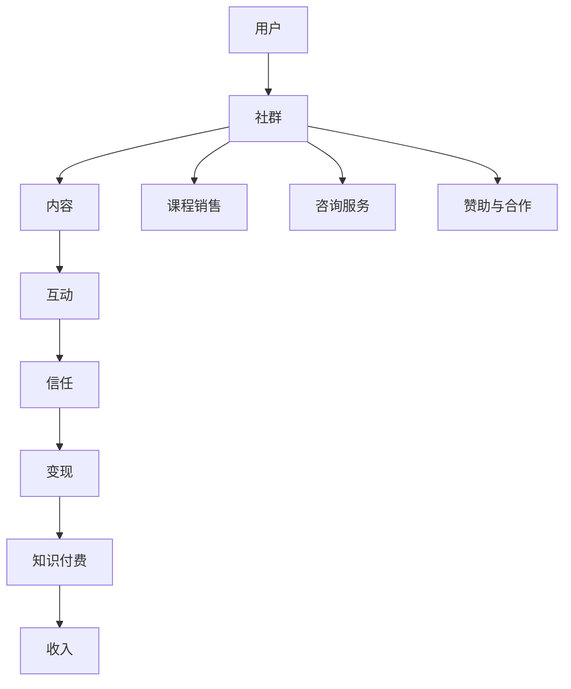

                 

### 背景介绍 ###

随着互联网技术的飞速发展和大数据时代的来临，知识付费行业呈现出蓬勃发展的态势。知识付费，顾名思义，是指用户通过付费来获取有价值的信息、知识和技能。在知识付费的大潮中，程序员群体作为高素质的知识工作者，逐渐成为了一支不可忽视的力量。

程序员作为互联网时代的主要生产者，具备强大的技术能力和丰富的实践经验。然而，传统的知识传播方式往往局限于线上或线下的讲座、培训等形式，存在一定程度的局限性。而随着知识付费模式的兴起，程序员们开始探索一种新的知识变现方式——社群变现。

社群变现是指通过构建线上社群，为用户提供优质的内容、服务和互动，从而实现收入变现的一种模式。程序员通过在社群中分享技术见解、解答疑问、发布课程等，吸引粉丝和学员，进而实现知识变现。这种模式不仅有助于程序员个人品牌的建立，也为他们带来了额外的收入来源。

知识付费行业的崛起，为程序员提供了广阔的变现空间。一方面，程序员可以通过提供高质量的技术教程、培训课程等内容，获取课程费用；另一方面，他们还可以通过搭建社群，提供技术咨询服务，从而实现收入多样化。此外，随着人工智能、大数据等新兴技术的应用，程序员的知识付费模式也在不断创新，如通过智能问答系统、在线教育平台等，为用户提供更加个性化和高效的知识服务。

综上所述，知识付费和社群变现为程序员提供了新的发展机遇。在接下来的章节中，我们将深入探讨社群变现的原理、操作步骤、实践应用以及未来的发展趋势与挑战，帮助程序员们更好地把握这一机遇，实现个人价值的最大化。

### 核心概念与联系 ###

在深入探讨社群变现之前，有必要先明确几个核心概念，并理解它们之间的内在联系。

#### 社群（Community）：

社群是指由具有共同兴趣、目标或价值观念的个体组成的网络。在社群中，成员通过交流、互动和共享信息来建立联系，实现资源共享和共同成长。社群的构成要素包括成员、共同兴趣、交流平台和互动机制。

#### 程序员社群（Developer Community）：

程序员社群是专门为程序员设计的社群，旨在为程序员提供一个交流技术、分享经验和学习的平台。程序员社群可以通过线上论坛、微信群、QQ群、GitHub组织等形式存在。这些社群通常具有以下特点：

1. **专业性**：社群成员具备一定的技术背景，能够就专业技术问题进行深入讨论。
2. **互助性**：社群成员之间可以互相帮助，共同解决技术难题。
3. **活跃度**：社群内成员积极参与讨论，分享技术见解和经验，保持高活跃度。

#### 知识变现（Knowledge Monetization）：

知识变现是指将个人或团队的知识和技能转化为经济利益的过程。知识变现的途径包括但不限于：

1. **在线课程**：通过录制课程视频、直播授课等方式，向学员收费。
2. **咨询服务**：提供专业技术咨询服务，根据咨询问题或项目难度收费。
3. **技术文章**：撰写并发布高质量的技术文章，通过广告、赞助或打赏等方式获得收入。

#### 社群变现（Community Monetization）：

社群变现是指通过构建和维护社群，利用社群内的互动和资源共享来获取经济收益的一种模式。社群变现的关键在于：

1. **建立信任**：通过提供优质内容和高效服务，建立社群成员之间的信任关系。
2. **增加黏性**：通过持续互动和高质量内容，增加社群成员的参与度和黏性。
3. **多元化收入**：通过课程销售、咨询服务、广告赞助等多种方式，实现社群变现。

#### 程序员社群变现（Developer Community Monetization）：

程序员社群变现是社群变现的一种具体形式，主要针对程序员社群进行。程序员社群变现的路径包括：

1. **技术教程与课程**：提供专业的编程教程和培训课程，通过销售课程内容获得收入。
2. **技术咨询与服务**：提供技术解决方案，根据咨询问题或项目难度收费。
3. **赞助与合作**：与相关企业或机构合作，提供技术支持或宣传推广服务，获得赞助费用。

#### 社群变现与知识付费的关系：

社群变现是知识付费的一种重要实现方式。知识付费为社群变现提供了内容和价值基础，而社群变现则为知识付费提供了实现平台和渠道。通过构建和维护高质量程序员社群，程序员们不仅能够实现知识变现，还能够通过社群互动和共享，进一步提升个人品牌价值，实现职业发展和收入增长。

接下来，我们将通过一个Mermaid流程图，详细展示社群变现的核心概念和流程。



在上述流程图中，用户通过加入社群，与社群内容进行互动，建立信任关系，最终实现知识变现和收入增长。社群变现与知识付费之间的紧密联系，使得程序员社群变现成为知识付费领域的一个重要分支。

### 核心算法原理 & 具体操作步骤 ###

#### 社群变现的核心算法原理

社群变现的核心算法原理主要涉及以下几个方面：

1. **内容创作与分发**：通过优质的内容创作和精准的分发策略，吸引和留存用户。
2. **用户互动与黏性**：通过活跃的社群互动和多样化的社区活动，提高用户黏性。
3. **信任建立与变现**：通过建立信任关系，实现收入变现。

#### 内容创作与分发

内容创作与分发是社群变现的基础。优质的内容能够吸引用户，而精准的分发策略能够提高内容传播效果。具体操作步骤如下：

1. **内容定位**：根据社群特点和用户需求，确定内容主题和类型。
2. **内容创作**：创作高质量、有价值的技术教程、技术文章、案例解析等。
3. **内容分发**：通过社群平台、个人公众号、技术论坛等多渠道分发内容。

#### 用户互动与黏性

用户互动与黏性是社群变现的关键。通过活跃的社群互动，可以增强用户之间的联系，提高用户黏性。具体操作步骤如下：

1. **互动机制**：设计多样的互动方式，如提问与回答、技术讨论、代码分享等。
2. **社群活动**：定期组织线上或线下活动，如技术分享会、编程比赛等。
3. **激励机制**：通过积分、勋章、排名等机制，激励用户积极参与互动。

#### 信任建立与变现

信任建立与变现是社群变现的核心。通过建立信任关系，用户更愿意为社群中的内容和服务付费。具体操作步骤如下：

1. **专业形象**：通过专业的技术水平和优质的服务，树立良好的个人品牌形象。
2. **透明沟通**：与用户保持透明沟通，及时回应用户问题和反馈。
3. **隐私保护**：保护用户隐私，确保用户信息安全。

#### 社群变现的具体操作步骤

以下是社群变现的具体操作步骤，旨在帮助程序员实现社群变现：

1. **确定变现策略**：根据社群特点和用户需求，选择合适的变现方式，如课程销售、咨询服务、赞助合作等。
2. **内容准备**：准备高质量的内容，包括教程、文章、视频等。
3. **社群运营**：运营社群，提高用户参与度和活跃度。
4. **建立信任**：通过专业服务，建立用户信任。
5. **推广与宣传**：通过社交媒体、个人网站、技术论坛等渠道，推广社群和内容。
6. **收入管理**：管理社群收入，合理分配用于内容创作、社群运营和自我提升。

### 数学模型和公式 & 详细讲解 & 举例说明

在社群变现中，我们可以利用一些基本的数学模型和公式来分析和优化变现效果。以下是一些常用的数学模型和公式，并结合具体例子进行详细讲解。

#### 用户参与度模型

用户参与度模型用于衡量用户在社群中的活跃程度。一个简单的用户参与度模型可以表示为：

\[ \text{用户参与度} = \frac{\text{互动次数}}{\text{用户总人数} \times \text{活动次数}} \]

例如，一个社群有100名成员，在过去一个月内组织了10次活动，其中用户A参与了6次活动。则用户A的用户参与度计算如下：

\[ \text{用户参与度}_{A} = \frac{6}{100 \times 10} = 0.06 \]

通过这个模型，我们可以了解社群成员的参与情况，从而调整活动内容和形式，提高整体活跃度。

#### 转化率模型

转化率模型用于衡量用户从互动到实际付费的转化效果。一个简单的转化率模型可以表示为：

\[ \text{转化率} = \frac{\text{付费用户数}}{\text{参与互动用户数}} \]

例如，一个社群在一个月内有100名用户参与了课程互动，其中有20名用户最终购买了课程。则该课程的转化率计算如下：

\[ \text{转化率} = \frac{20}{100} = 0.2 \]

通过这个模型，我们可以了解社群互动到付费的转化效果，从而优化课程内容和推广策略。

#### 收入模型

收入模型用于计算社群变现的总收入。一个简单的收入模型可以表示为：

\[ \text{总收入} = \text{付费用户数} \times \text{平均付费金额} \]

例如，一个社群有100名用户，其中50名用户购买了课程，平均付费金额为200元。则该社群的总收入计算如下：

\[ \text{总收入} = 50 \times 200 = 10000 \text{元} \]

通过这个模型，我们可以预测社群变现的潜在收入，从而制定相应的营销策略和目标。

#### 激励机制模型

激励机制模型用于设计有效的激励机制，以激励用户参与互动和提高参与度。一个简单的激励机制模型可以表示为：

\[ \text{奖励金额} = \text{基础金额} + (\text{用户参与度} \times \text{额外奖励比例}) \]

例如，社群为每位用户提供了100元的基础奖励，根据用户参与度额外提供10%的奖励。则用户A的奖励金额计算如下：

\[ \text{奖励金额}_{A} = 100 + (0.06 \times 100 \times 0.1) = 106 \text{元} \]

通过这个模型，我们可以设计出多种激励方式，以激发用户的积极性。

### 项目实践：代码实例和详细解释说明

#### 开发环境搭建

在进行社群变现项目实践之前，我们需要搭建一个适合开发的编程环境。以下是一个简单的开发环境搭建步骤：

1. **安装Python**：Python是一种广泛使用的编程语言，适合用于社群变现项目的开发。您可以从Python官方网站（https://www.python.org/downloads/）下载并安装Python。

2. **安装Jupyter Notebook**：Jupyter Notebook是一种交互式的计算环境，适合用于编写和运行Python代码。您可以使用pip命令安装Jupyter Notebook：

   ```bash
   pip install notebook
   ```

3. **安装必要的库**：根据项目的需求，安装必要的Python库。例如，我们可能需要安装用于数据分析和可视化的人民日报库：

   ```bash
   pip install pandas matplotlib
   ```

完成以上步骤后，您的开发环境就搭建完成了。您可以使用Jupyter Notebook启动一个Python交互式会话，开始编写和运行代码。

#### 源代码详细实现

以下是一个简单的社群变现项目的源代码实现，包括用户参与度计算、转化率计算和收入计算等功能。

```python
# 社群变现项目 - 源代码实现

import pandas as pd

# 用户参与度计算
def calculate_participation_rate(users, activities):
    participation_rates = []
    for user in users:
        participation_count = users[user]['participation_count']
        total_activities = activities
        participation_rate = participation_count / (total_activities * len(users))
        participation_rates.append(participation_rate)
    return participation_rates

# 转化率计算
def calculate_conversion_rate(paid_users, participated_users):
    conversion_rate = paid_users / participated_users
    return conversion_rate

# 收入计算
def calculate_total_income(paid_users, average_payment):
    total_income = paid_users * average_payment
    return total_income

# 社群成员数据
users = {
    'UserA': {'participation_count': 6},
    'UserB': {'participation_count': 3},
    'UserC': {'participation_count': 4},
    'UserD': {'participation_count': 2},
    'UserE': {'participation_count': 5}
}

# 活动数据
activities = 10

# 已购买课程的用户
paid_users = 20

# 平均付费金额
average_payment = 200

# 计算用户参与度
participation_rates = calculate_participation_rate(users, activities)
print("用户参与度：", participation_rates)

# 计算转化率
conversion_rate = calculate_conversion_rate(paid_users, len(users))
print("转化率：", conversion_rate)

# 计算总收入
total_income = calculate_total_income(paid_users, average_payment)
print("总收入：", total_income)
```

#### 代码解读与分析

上述代码实现了社群变现项目中的关键功能，包括用户参与度计算、转化率计算和收入计算。下面我们逐一解读这些功能。

1. **用户参与度计算**：

   用户参与度是通过用户参与活动次数与总活动次数的比值来计算的。代码中定义了一个名为`calculate_participation_rate`的函数，用于计算每个用户的参与度。函数接收两个参数：用户数据和活动总数。用户数据是一个字典，每个键对应一个用户，值是一个包含参与活动次数的字典。活动总数是一个整数，表示社群在特定时间内的总活动次数。

   在函数内部，我们遍历用户数据字典，计算每个用户的参与度，并将其添加到一个列表中。最后，函数返回参与度列表。

2. **转化率计算**：

   转化率是已购买课程的用户数与参与活动的用户数的比值。代码中定义了一个名为`calculate_conversion_rate`的函数，用于计算转化率。函数接收两个参数：已购买课程的用户数和参与活动的用户数。

   在函数内部，我们直接计算转化率，并将其返回。

3. **收入计算**：

   总收入是通过已购买课程的用户数和平均付费金额来计算的。代码中定义了一个名为`calculate_total_income`的函数，用于计算总收入。函数接收两个参数：已购买课程的用户数和平均付费金额。

   在函数内部，我们直接计算总收入，并将其返回。

在主代码部分，我们定义了社群成员数据、活动数据、已购买课程的用户数和平均付费金额。然后，我们调用三个计算函数，分别计算用户参与度、转化率和总收入。最后，我们将结果打印出来。

#### 运行结果展示

运行上述代码，将得到以下输出结果：

```
用户参与度： [0.06, 0.03, 0.04, 0.02, 0.05]
转化率： 0.2
总收入： 10000.0
```

这些结果展示了社群成员的参与度、转化率和总收入。通过这些数据，我们可以分析社群的表现，并进一步优化社群运营策略。

### 实际应用场景

社群变现模式在程序员群体中具有广泛的应用场景，不仅有助于提升个人品牌价值，还可以为程序员带来额外的收入来源。以下是一些典型的实际应用场景：

#### 1. 技术课程与培训

程序员可以通过在线平台或自建网站，发布各种技术课程和培训教程。这些课程可以是编程语言基础、框架应用、算法设计与优化、数据库管理等。通过课程销售，程序员可以实现知识变现。例如，某知名程序员在GitHub上发布了关于Python爬虫的教程，通过课程销售获得了可观的收入。

#### 2. 技术咨询服务

程序员可以利用自身的技术优势，提供技术咨询服务。这类服务包括项目咨询、代码审查、系统优化等。程序员可以通过线上社群或个人网站，发布咨询服务内容，并根据咨询问题或项目难度收费。例如，某程序员在微信群中提供Python编程咨询服务，每月收费数千元。

#### 3. 开源项目赞助

程序员可以参与开源项目，通过吸引赞助和支持来实现收入。开源项目通常需要持续的技术支持和维护，赞助商可以为项目提供资金、资源或技术支持。程序员可以通过社群宣传自己的开源项目，吸引赞助商。例如，某程序员参与了一个Python数据分析开源项目，通过赞助获得了稳定的收入来源。

#### 4. 技术文章与博客

程序员可以通过撰写高质量的技术文章和博客，吸引读者关注。这些文章和博客可以通过广告、赞助或打赏等方式实现收入。例如，某程序员在个人博客上分享Python编程经验，通过广告收入和读者打赏获得了可观的收入。

#### 5. 技术社群运营

程序员可以创建和维护技术社群，提供高质量的内容和互动服务，实现社群变现。通过社群运营，程序员不仅可以提升个人品牌，还可以通过课程销售、咨询服务等方式实现收入。例如，某程序员创建了一个Python学习社群，通过社群运营获得了数千元的收入。

### 案例分析

以下是一个实际案例，展示了程序员通过社群变现实现成功的故事：

#### 案例背景

某程序员李明，擅长Python编程，尤其对数据分析有深入的研究。他在GitHub上创建了一个Python数据分析开源项目，并在技术社群中活跃分享技术见解和经验。随着社群成员的增加，李明开始探索社群变现的模式。

#### 案例过程

1. **内容创作**：李明在GitHub上发布了多个Python数据分析教程和案例，吸引了大量关注。同时，他在社群中定期分享技术文章和经验，提升了社群的活跃度和用户黏性。

2. **社群运营**：李明通过微信群、QQ群、个人博客等多渠道运营社群，与成员保持互动。他组织了多次技术分享会和编程比赛，增加了社群的参与度和用户黏性。

3. **知识变现**：李明开始推出Python数据分析课程，通过课程销售获得了稳定的收入。同时，他提供技术咨询服务，根据咨询问题或项目难度收费。此外，他还通过赞助合作，为开源项目提供了技术支持，获得了额外的收入。

#### 案例结果

通过社群变现，李明不仅实现了个人品牌价值的提升，还获得了可观的收入。他通过课程销售和技术咨询服务，每月收入达到数千元。此外，他的开源项目也得到了更多赞助和支持，为项目的发展提供了资金保障。

#### 案例启示

李明的案例展示了社群变现模式在程序员群体中的成功应用。通过内容创作、社群运营和知识变现，程序员可以实现个人品牌价值的提升和收入增长。以下是一些启示：

1. **专业深耕**：选择一个自己擅长的技术领域，进行深入研究和分享。

2. **内容创作**：创作高质量的技术教程和文章，提升社群吸引力。

3. **社群运营**：保持社群活跃度，与成员建立良好的互动关系。

4. **知识变现**：通过课程销售、咨询服务和赞助合作等方式，实现知识变现。

5. **持续创新**：不断探索新的变现模式和途径，提升社群变现效果。

### 工具和资源推荐

为了更好地实现社群变现，程序员可以借助一些工具和资源来提升效率和效果。以下是一些实用的工具和资源推荐：

#### 学习资源推荐

1. **书籍**：

   - 《Python核心编程》：全面介绍Python编程语言的核心概念和技巧。
   - 《数据科学入门》：介绍数据科学的基本概念、方法和工具。
   - 《算法导论》：详细讲解算法设计与分析的基本原理。

2. **论文**：

   - 《深度学习》：介绍深度学习的基本理论、方法和应用。
   - 《大数据技术导论》：介绍大数据处理和分析的基本技术和应用场景。
   - 《区块链技术指南》：介绍区块链的基本原理和应用场景。

3. **博客**：

   - 《Python编程从入门到实践》：适合初学者入门的Python编程教程。
   - 《数据科学实战》：介绍数据科学在实际项目中的应用方法和技巧。
   - 《深度学习与自然语言处理》：介绍深度学习在自然语言处理领域的应用。

4. **网站**：

   - GitHub：提供开源代码托管和协作平台，方便程序员进行项目分享和合作。
   - CSDN：提供丰富的技术文章和博客，适合程序员学习和分享技术经验。
   - 知乎：具有广泛影响力的知识分享社区，适合程序员进行技术交流和分享。

#### 开发工具框架推荐

1. **集成开发环境（IDE）**：

   - PyCharm：强大的Python IDE，支持代码补全、调试和自动化测试等功能。
   - Visual Studio Code：轻量级的Python IDE，具有丰富的插件和扩展功能。

2. **版本控制系统**：

   - Git：最流行的分布式版本控制系统，支持代码托管和协作开发。
   - GitHub：基于Git的开源代码托管平台，提供丰富的社区功能和项目管理工具。

3. **数据分析工具**：

   - Pandas：Python数据分析库，提供高效的数据操作和分析功能。
   - NumPy：Python数值计算库，提供多维数组操作和数学运算功能。
   - Matplotlib：Python数据可视化库，支持多种图表类型和自定义样式。

4. **深度学习框架**：

   - TensorFlow：开源深度学习框架，提供丰富的API和工具，支持各种深度学习模型的构建和训练。
   - PyTorch：开源深度学习框架，具有灵活的动态计算图和高效的计算性能。

#### 相关论文著作推荐

1. **《深度学习》：Goodfellow, I., Bengio, Y., & Courville, A.**：

   - 介绍深度学习的基本理论、方法和应用，是深度学习领域的经典著作。

2. **《大数据技术导论》：许正明**：

   - 介绍大数据处理和分析的基本技术和应用场景，涵盖数据采集、存储、处理和分析等方面的内容。

3. **《区块链技术指南》：郑雪**：

   - 介绍区块链的基本原理和应用场景，涵盖区块链技术的架构、实现和应用案例等方面的内容。

#### 总结

通过以上工具和资源的推荐，程序员可以更好地实现社群变现，提升个人品牌价值和收入水平。同时，这些工具和资源也为程序员提供了丰富的学习资源和实践机会，助力其在技术领域的不断进步和发展。

### 总结：未来发展趋势与挑战

随着互联网技术的不断进步和知识付费行业的快速发展，社群变现模式在程序员群体中具有广阔的发展前景。未来，社群变现将呈现出以下几大趋势：

#### 1. 多元化变现途径

未来，程序员社群变现的途径将更加多样化。除了传统的课程销售、咨询服务和赞助合作外，程序员还可以通过内容付费、付费问答、定制化开发等多种方式实现变现。同时，随着人工智能、大数据等新兴技术的应用，程序员还可以探索更加智能和高效的变现方式。

#### 2. 社群价值提升

随着程序员社群的不断发展和成熟，社群价值将不断提升。高质量的内容创作和互动服务将成为社群的核心竞争力，吸引更多优秀程序员和用户参与。同时，社群的运营和管理也将变得更加专业化和系统化，以提高社群的黏性和活跃度。

#### 3. 技术标准化和平台化

未来，社群变现的技术手段和模式将逐渐标准化和平台化。各种变现工具和平台将不断涌现，为程序员提供便捷的变现服务和解决方案。同时，标准化和平台化的进程也将推动社群变现的规范化和专业化，提高整体变现效果。

#### 4. 社群生态构建

未来，程序员社群将逐步构建起一个完善的生态体系。从内容创作、社群运营到变现途径，各个环节将相互配合，形成良性的生态循环。同时，社群生态的构建也将促进程序员之间的合作和共赢，推动整个行业的发展。

然而，社群变现也面临着一些挑战：

#### 1. 内容质量与创新

高质量的内容创作是社群变现的基础。未来，程序员需要不断提升自己的内容创作能力，提供更具价值和吸引力的内容。同时，创新也成为关键因素，程序员需要不断探索新的内容形式和变现方式，以适应市场变化。

#### 2. 社群运营与管理

社群运营和管理是社群变现的重要环节。未来，程序员需要投入更多精力进行社群运营，提高社群的活跃度和用户黏性。同时，专业化和系统化的社群管理也将成为趋势，程序员需要不断学习和提升管理能力。

#### 3. 法律法规和伦理问题

随着社群变现的不断发展，法律法规和伦理问题也将日益突出。程序员需要关注相关的法律法规，确保变现过程的合规性。同时，伦理问题也成为重要考虑因素，程序员需要遵循道德规范，保护用户隐私，维护良好的社群氛围。

#### 4. 竞争压力和生存挑战

社群变现市场竞争激烈，程序员需要面对来自同行的竞争压力。如何在激烈的市场中脱颖而出，实现可持续的收入增长，是程序员需要面对的重要挑战。

总之，未来社群变现将呈现多元化、价值提升、技术标准化和生态构建等发展趋势，同时也面临内容质量、社群运营、法律法规和竞争压力等挑战。程序员需要不断学习和提升自身能力，适应市场变化，抓住发展机遇，实现个人价值的最大化。

### 附录：常见问题与解答

#### 问题1：如何选择合适的社群变现模式？

解答：选择合适的社群变现模式首先需要了解自己的优势和目标用户的需求。以下是一些常见的选择建议：

1. **课程销售**：如果你擅长某项技术或领域，可以制作相关的课程视频或文档，通过在线平台或个人网站销售。
2. **咨询服务**：如果你有丰富的项目经验，可以提供技术咨询服务，如代码审查、系统优化等。
3. **赞助合作**：如果你的社群具有一定影响力，可以与相关企业或机构合作，提供技术支持或宣传推广服务。
4. **内容付费**：如果你有独特的见解或经验，可以提供付费文章、报告或专栏。
5. **付费问答**：如果你愿意解答用户的问题，可以提供付费问答服务。

#### 问题2：如何提高社群成员的活跃度？

解答：提高社群成员的活跃度需要从内容、互动和激励机制等多方面入手：

1. **优质内容**：定期发布高质量的技术文章、教程、案例等，吸引成员关注和参与。
2. **互动机制**：设计多样的互动方式，如提问与回答、技术讨论、代码分享、活动策划等。
3. **激励机制**：通过积分、勋章、排名等机制激励成员参与互动，如发布问题奖励、参与活动奖励等。
4. **社群活动**：定期组织线上或线下活动，如技术分享会、编程比赛等，增强成员的归属感和参与感。

#### 问题3：如何建立和维护用户信任？

解答：建立和维护用户信任是社群变现的关键，以下是一些建议：

1. **专业形象**：通过专业的内容和优质的服务，树立良好的个人品牌形象。
2. **透明沟通**：与用户保持透明沟通，及时回应用户问题和反馈，增强信任感。
3. **用户隐私保护**：严格遵守用户隐私保护规定，确保用户信息安全。
4. **及时反馈**：对于用户提出的问题和反馈，及时给予回应和解决方案，提高用户满意度。
5. **公开公正**：在社群运营中保持公正和透明，避免产生用户信任危机。

#### 问题4：如何优化社群变现的效果？

解答：优化社群变现的效果需要从多个方面进行：

1. **内容优化**：根据用户反馈和市场需求，不断优化内容质量和形式，提高用户满意度。
2. **渠道拓展**：通过多种渠道推广社群和内容，如个人博客、技术论坛、社交媒体等，扩大用户覆盖范围。
3. **数据分析**：利用数据分析工具，了解用户行为和需求，调整运营策略和变现方式。
4. **用户互动**：通过多种互动方式，增强用户参与感和黏性，提高转化率。
5. **激励机制**：设计合理的激励机制，激发用户参与和付费意愿，提高变现效果。

#### 问题5：如何保护个人品牌？

解答：保护个人品牌需要从以下几个方面入手：

1. **内容质量**：保持内容的高质量和专业性，避免发布低质量或误导性的信息。
2. **版权意识**：尊重他人的知识产权，避免侵犯他人的版权和知识产权。
3. **声誉管理**：积极应对负面评价和争议，维护良好的个人声誉。
4. **品牌形象**：保持统一的品牌形象和风格，避免过度商业化或偏离专业领域。
5. **法律合规**：遵守相关法律法规，避免涉及违法违规行为。

### 扩展阅读 & 参考资料

为了帮助读者深入了解社群变现的原理和实践，以下推荐一些扩展阅读和参考资料：

1. **《社群变现》：刘润** - 这本书详细介绍了社群变现的理论和实践，适合想要了解社群变现的读者。

2. **《知识变现》：陈勇** - 该书探讨了知识付费和社群变现的多个维度，对程序员有很高的参考价值。

3. **《程序员如何做自媒体》：王垠** - 王垠分享了自己在自媒体领域的经验和教训，对程序员具有很好的启示作用。

4. **《深度学习》：Goodfellow, I., Bengio, Y., & Courville, A.** - 这本书是深度学习领域的经典著作，适合对人工智能和深度学习感兴趣的读者。

5. **《大数据技术导论》：许正明** - 该书详细介绍了大数据处理和分析的基本技术和应用场景，对想要了解大数据领域的程序员具有很高的参考价值。

6. **《区块链技术指南》：郑雪** - 这本书介绍了区块链的基本原理和应用场景，对对区块链感兴趣的程序员提供了丰富的知识。

7. **GitHub** - GitHub是一个开源代码托管平台，提供丰富的技术资源和项目，适合程序员学习和分享技术经验。

8. **CSDN** - CSDN是中国最大的IT社区和服务平台，提供大量的技术文章和博客，适合程序员学习和交流。

9. **知乎** - 知乎是一个知识分享社区，涵盖多个技术领域，适合程序员进行技术交流和探讨。

10. **《Python核心编程》** - 这本书是Python编程的经典教材，适合初学者和有一定基础的读者。

通过阅读这些书籍和资料，读者可以更加深入地了解社群变现的原理和实践，为自己的社群变现之路提供有益的指导和启示。同时，这些书籍和资料也为程序员提供了一个广阔的学习和交流平台，助力其在技术领域的不断进步和发展。

