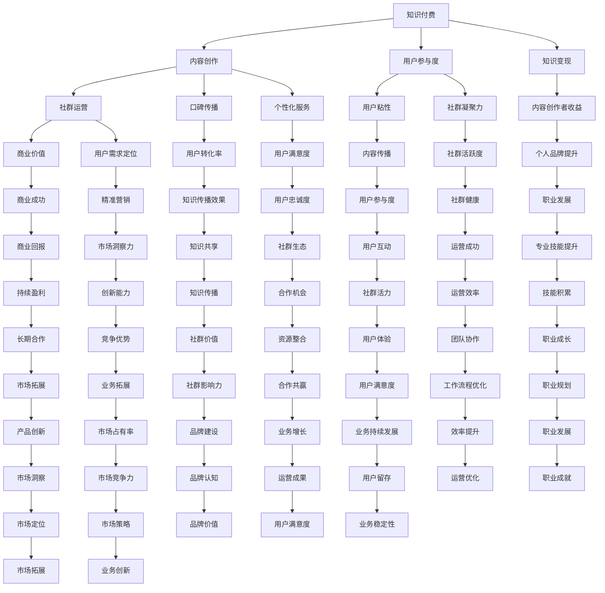

                 

### 背景介绍

知识付费，这个概念已经渗透到我们日常生活的方方面面。随着互联网技术的发展，尤其是社交媒体和在线教育平台的兴起，知识付费逐渐成为一种流行的商业模式。对于程序员来说，这个领域无疑提供了丰富的机会和挑战。无论是通过在线课程、技术博客，还是社群运营，知识付费都可以成为他们增加收入、提升个人品牌和影响力的有效途径。

然而，知识付费并非简单地提供内容那么简单。它涉及到内容的创作、推广、社群运营等多个环节。在这些环节中，社群运营显得尤为重要。一个活跃、健康的社群不仅能提高用户粘性，还能为内容创作者带来更多的反馈和互动。但如何运营一个成功的社群呢？这就是本文要探讨的核心问题。

程序员社群的运营不仅需要技术背景，还需要一定的管理能力和市场洞察力。本文将围绕以下几个核心问题展开讨论：

1. 程序员社群运营的重要性和目标是什么？
2. 程序员社群运营的关键要素有哪些？
3. 如何制定有效的社群运营策略？
4. 社群运营中的常见问题和解决方案是什么？
5. 知识付费在程序员社群运营中的应用和影响如何？

通过本文的探讨，我们希望能够为程序员提供一套系统化的社群运营指南，帮助他们更好地开展知识付费业务，实现个人和社群的双赢。

### 核心概念与联系

要理解程序员社群运营，我们首先需要明确几个核心概念，这些概念不仅是社群运营的基础，也是整个知识付费生态系统的重要组成部分。

#### 1. 知识付费

知识付费是指用户为获取有价值的信息、技能或知识而支付的费用。它区别于传统的免费共享模式，强调知识的价值和质量。在知识付费领域，内容创作者通过提供专业、高质量的教程、课程或文章来吸引付费用户，实现收益。

#### 2. 社群

社群是指具有共同兴趣、目标或价值观的一群人组成的在线或线下团体。在程序员社群中，成员可能拥有不同的背景和技术水平，但他们都关注某一特定技术领域或编程语言。社群能够为成员提供一个分享知识、交流经验、寻求帮助和建立人脉的平台。

#### 3. 社群运营

社群运营是指通过一系列策略和活动来管理、维护和发展社群成员关系的过程。社群运营的目标是提高成员的参与度和满意度，增强社群的凝聚力，从而实现知识传播和商业价值的最大化。

#### 4. 社群经济

社群经济是指基于社群关系的商业活动。在这种商业模式中，社群成员不仅是内容的消费者，更是内容的创造者和传播者。通过社群经济，内容创作者能够更直接地接触用户，提高用户忠诚度和转化率。

#### 5. 知识付费与社群运营的关系

知识付费和社群运营密不可分。知识付费为社群提供了价值变现的途径，而社群运营则为知识付费创造了良好的生态环境。具体来说，社群运营通过以下几个方面影响着知识付费：

- **用户参与度**：一个活跃、互动性强的社群能够提高用户的参与度，增加用户对内容的关注和投入。
- **用户粘性**：社群运营有助于建立用户粘性，让用户愿意持续留在社群中，从而为知识付费提供稳定的用户基础。
- **口碑传播**：社群成员的互动和评价能够形成口碑效应，吸引更多潜在用户，扩大知识付费的影响范围。
- **商业价值**：通过社群运营，内容创作者能够更精准地定位用户需求，提供个性化的服务，从而实现更高的商业价值。

综上所述，知识付费和社群运营是相辅相成的。知识付费为社群提供了价值变现的途径，而社群运营则为知识付费提供了稳定的用户基础和良好的生态环境。

### 核心概念原理和架构的 Mermaid 流程图

下面是一个用Mermaid绘制的关于核心概念原理和架构的流程图。此图展示了知识付费与社群运营之间的相互关系及其对程序员社群运营的影响。



此图通过节点和边展示了知识付费、社群运营及其相互关系对程序员社群运营的全方位影响。通过这种结构化的方式，我们可以更清晰地理解这些核心概念之间的联系和作用。

### 核心算法原理 & 具体操作步骤

在程序员社群运营中，核心算法原理和具体操作步骤是确保运营成功的关键。以下是几个核心算法原理及其具体操作步骤：

#### 1. 社群用户画像分析

**算法原理**：通过数据分析方法，对社群成员的基本信息、行为特征、兴趣偏好等进行全面分析，形成用户画像。

**操作步骤**：

- **数据收集**：收集社群成员的基本信息（如年龄、性别、职业等）和行为数据（如发帖数、点赞数、评论数等）。
- **数据预处理**：清洗和整合数据，去除无效或重复数据。
- **特征提取**：从原始数据中提取用户特征，如活跃度、参与度、兴趣点等。
- **建模分析**：使用聚类、分类等机器学习算法，对用户特征进行建模，分析用户画像。

**具体示例**：假设社群成员的行为数据如下表：

| 用户ID | 年龄 | 性别 | 职业 | 发帖数 | 点赞数 | 评论数 |
|--------|------|------|------|--------|--------|--------|
| 1      | 25   | 男   | 程序员 | 50     | 100    | 20     |
| 2      | 30   | 女   | 产品经理 | 20     | 50     | 30     |

通过机器学习算法，我们可以将这些数据进行聚类分析，形成不同类型的用户画像，如“活跃程序员”、“潜在用户”等。

#### 2. 社群互动质量评估

**算法原理**：通过分析社群成员的互动行为，评估互动质量，识别优质内容和用户。

**操作步骤**：

- **行为数据收集**：收集社群成员的互动数据，包括发帖、评论、点赞等。
- **互动质量指标**：定义互动质量评估指标，如互动率、回复速度、内容质量等。
- **质量评估模型**：构建互动质量评估模型，使用评分、分类等方法对互动行为进行评估。
- **结果反馈**：根据评估结果，对优质内容和用户进行奖励或推广。

**具体示例**：假设社群成员的互动数据如下表：

| 用户ID | 发帖数 | 点赞数 | 评论数 | 互动率 |
|--------|--------|--------|--------|--------|
| 1      | 50     | 100    | 20     | 70%    |
| 2      | 20     | 50     | 30     | 60%    |

通过互动质量评估模型，我们可以对每个用户的互动质量进行评分，识别出高互动质量的用户和内容。

#### 3. 社群内容推荐算法

**算法原理**：基于用户行为数据和内容特征，为用户推荐感兴趣的内容。

**操作步骤**：

- **用户行为数据收集**：收集用户在社群中的行为数据，如浏览记录、点赞、评论等。
- **内容特征提取**：提取内容特征，如标题、标签、关键词等。
- **协同过滤算法**：使用协同过滤算法，分析用户行为数据和内容特征，生成推荐列表。
- **个性化推荐**：根据用户的个性化需求和偏好，对推荐内容进行筛选和调整。

**具体示例**：假设社群内容如下表：

| 内容ID | 标题           | 标签     | 用户1兴趣度 | 用户2兴趣度 |
|--------|----------------|----------|-------------|-------------|
| 1      | Python基础教程  | Python   | 80%         | 20%         |
| 2      | Java性能优化    | Java     | 50%         | 30%         |
| 3      | Docker教程      | Docker   | 70%         | 40%         |

通过协同过滤算法，我们可以为用户推荐他们可能感兴趣的内容，如用户1可能对“Python基础教程”感兴趣，用户2可能对“Docker教程”感兴趣。

#### 4. 社群增长策略

**算法原理**：通过数据分析和策略制定，实现社群的增长和扩张。

**操作步骤**：

- **用户增长分析**：分析现有用户增长数据，确定增长瓶颈和关键因素。
- **策略制定**：根据用户增长分析结果，制定针对性的增长策略，如内容推广、用户互动活动、合作推广等。
- **策略实施与监控**：实施增长策略，并通过数据监控和评估策略效果。

**具体示例**：假设社群现有用户增长数据如下：

| 时间段 | 新增用户数 | 活跃用户数 |
|--------|------------|------------|
| 1周前  | 100        | 80         |
| 2周前  | 120        | 90         |
| 3周前  | 150        | 100        |

通过分析增长数据，我们可以发现用户增长放缓，可能是因为内容质量下降或用户互动不足。针对这些问题，我们可以制定内容优化和用户互动活动策略，以提高用户增长速度。

通过上述核心算法原理和具体操作步骤，程序员可以更好地进行社群运营，提高用户参与度和满意度，实现知识付费的商业目标。

### 数学模型和公式 & 详细讲解 & 举例说明

在程序员社群运营中，数学模型和公式可以帮助我们更准确地分析和预测社群行为，优化运营策略。以下是几个常见的数学模型和公式，以及它们的详细讲解和实际应用示例。

#### 1. 用户流失模型

**公式**：用户流失率 = (流失用户数 / 初始用户数) × 100%

**详细讲解**：用户流失模型用于预测和衡量社群中用户流失的情况。流失用户数是指在一定时间内离开社群的用户数量，初始用户数是指社群建立时的用户数量。通过计算用户流失率，我们可以评估社群的健康状况和运营效果。

**举例说明**：假设一个社群在一个月内从1000个用户减少到800个用户，初始用户数为1000，流失用户数为200。则用户流失率为：

用户流失率 = (200 / 1000) × 100% = 20%

这个结果表明社群存在较高的用户流失率，可能需要进一步分析原因并采取相应措施。

#### 2. 用户活跃度模型

**公式**：用户活跃度 = (互动行为数 / 用户总数) × 100%

**详细讲解**：用户活跃度模型用于衡量社群成员的活跃程度。互动行为数是指在一定时间内用户在社群中的互动次数，包括发帖、评论、点赞等。用户总数是指社群中当前活跃的用户数量。通过计算用户活跃度，我们可以了解社群的互动氛围和用户参与度。

**举例说明**：假设一个社群在一个月内有100个用户，共产生了500次互动行为。则用户活跃度为：

用户活跃度 = (500 / 100) × 100% = 50%

这个结果表明社群成员的互动程度较高，社群氛围活跃。

#### 3. 用户留存模型

**公式**：用户留存率 = (次日留存用户数 / 当日活跃用户数) × 100%

**详细讲解**：用户留存模型用于衡量社群中用户在一段时间内持续活跃的情况。次日留存用户数是指当日活跃用户中，第二天仍然活跃的用户数量。通过计算用户留存率，我们可以了解社群的稳定性和用户忠诚度。

**举例说明**：假设一个社群在一个月内有100个活跃用户，其中第二天仍活跃的用户有80个。则用户留存率为：

用户留存率 = (80 / 100) × 100% = 80%

这个结果表明社群具有较高的用户留存率，用户忠诚度较高。

#### 4. 社群增长模型

**公式**：社群增长率 = (新增用户数 / 初始用户数) × 100%

**详细讲解**：社群增长模型用于衡量社群在一定时间内的增长速度。新增用户数是指在一定时间内新加入社群的用户数量，初始用户数是指社群建立时的用户数量。通过计算社群增长率，我们可以评估社群的增长潜力和运营效果。

**举例说明**：假设一个社群在一个月内从1000个用户增长到1500个用户，初始用户数为1000。则社群增长率为：

社群增长率 = (500 / 1000) × 100% = 50%

这个结果表明社群在一个月内实现了50%的增长，说明运营策略较为有效。

通过以上数学模型和公式，程序员可以更科学地分析和优化社群运营，提高用户参与度和社群健康度。在实际应用中，这些模型可以根据具体情况进行调整和扩展，以适应不同的社群运营需求。

### 项目实践：代码实例和详细解释说明

#### 1. 开发环境搭建

要在本地搭建一个程序员社群运营的平台，我们需要选择合适的开发环境和工具。以下是一个基本的开发环境搭建步骤：

**所需工具**：

- 操作系统：Ubuntu 20.04 或 macOS Big Sur
- 编程语言：Python 3.8 或更高版本
- 依赖管理器：pip
- 数据库：MySQL 8.0 或 PostgreSQL 13.0
- Web框架：Django 4.0 或 Flask 2.0

**环境搭建步骤**：

1. 安装操作系统：从官方网站下载并安装 Ubuntu 20.04 或 macOS Big Sur。
2. 开启终端：登录操作系统后，开启终端。
3. 更新系统包：输入以下命令更新系统包。

   ```shell
   sudo apt update
   sudo apt upgrade
   ```

4. 安装Python 3.8：输入以下命令安装 Python 3.8。

   ```shell
   sudo apt install python3.8
   ```

5. 安装pip：输入以下命令安装 pip。

   ```shell
   sudo apt install python3-pip
   ```

6. 安装数据库：输入以下命令安装 MySQL 8.0。

   ```shell
   sudo apt install mysql-server
   ```

   或输入以下命令安装 PostgreSQL 13.0。

   ```shell
   sudo apt install postgresql
   ```

7. 安装Web框架：输入以下命令安装 Django 4.0。

   ```shell
   pip install django
   ```

   或输入以下命令安装 Flask 2.0。

   ```shell
   pip install flask
   ```

#### 2. 源代码详细实现

在这个部分，我们将使用 Django 框架来创建一个基本的程序员社群运营平台。以下是源代码的详细实现步骤。

**步骤1：创建 Django 项目**

在终端中，执行以下命令创建一个新的 Django 项目。

```shell
django-admin startproject programmer_community
```

**步骤2：创建 Django 应用**

进入项目文件夹，创建一个新的应用。

```shell
cd programmer_community
django-admin startapp community
```

**步骤3：配置数据库**

在项目设置文件 `settings.py` 中，配置数据库。

```python
DATABASES = {
    'default': {
        'ENGINE': 'django.db.backends.mysql',
        'NAME': 'programmer_community',
        'USER': 'root',
        'PASSWORD': 'your_password',
        'HOST': 'localhost',
        'PORT': '3306',
    }
}
```

**步骤4：创建用户模型**

在 `community/models.py` 中，创建一个用户模型。

```python
from django.db import models
from django.contrib.auth.models import AbstractUser

class CustomUser(AbstractUser):
    bio = models.TextField(null=True, blank=True)
```

**步骤5：创建帖子模型**

继续在 `community/models.py` 中，创建一个帖子模型。

```python
class Post(models.Model):
    title = models.CharField(max_length=100)
    content = models.TextField()
    author = models.ForeignKey(CustomUser, on_delete=models.CASCADE)
    created_at = models.DateTimeField(auto_now_add=True)
    updated_at = models.DateTimeField(auto_now=True)
```

**步骤6：创建评论模型**

继续在 `community/models.py` 中，创建一个评论模型。

```python
class Comment(models.Model):
    content = models.TextField()
    author = models.ForeignKey(CustomUser, on_delete=models.CASCADE)
    post = models.ForeignKey(Post, on_delete=models.CASCADE)
    created_at = models.DateTimeField(auto_now_add=True)
    updated_at = models.DateTimeField(auto_now=True)
```

**步骤7：创建后台管理页面**

在 `community/admin.py` 中，注册用户模型、帖子模型和评论模型。

```python
from django.contrib import admin
from .models import CustomUser, Post, Comment

admin.site.register(CustomUser)
admin.site.register(Post)
admin.site.register(Comment)
```

**步骤8：创建视图和URL**

在 `community/views.py` 中，创建一个用于展示帖子的视图。

```python
from django.shortcuts import render
from .models import Post

def home(request):
    posts = Post.objects.all().order_by('-created_at')
    return render(request, 'community/home.html', {'posts': posts})
```

在 `community/urls.py` 中，配置 URL。

```python
from django.urls import path
from . import views

urlpatterns = [
    path('', views.home, name='home'),
]
```

**步骤9：创建模板**

在 `community/templates/community/home.html` 中，创建一个用于展示帖子的模板。

```html
<!DOCTYPE html>
<html>
<head>
    <title>程序员社群</title>
</head>
<body>
    <h1>程序员社群</h1>
    
        <div>
            <h2>{{ post.title }}</h2>
            <p>{{ post.content }}</p>
            <p>作者：{{ post.author.username }}</p>
            <p>时间：{{ post.created_at }}</p>
        </div>
    
</body>
</html>
```

通过以上步骤，我们完成了一个基本的程序员社群运营平台的基本架构。接下来，我们将进一步开发平台的功能，包括用户注册、登录、帖子发布和评论等。

#### 3. 代码解读与分析

在上述代码中，我们使用了 Django 框架来快速搭建了一个程序员社群运营平台。以下是对关键部分的解读和分析。

**用户模型**：我们创建了一个 `CustomUser` 模型，继承自 Django 内置的 `AbstractUser` 类。这样做的好处是可以保留内置用户模型的功能，如登录、权限管理等，同时可以自定义用户信息，如用户简介（`bio`）。

**帖子模型**：`Post` 模型包含了帖子的基本信息，如标题（`title`）、内容（`content`）、作者（`author`）、创建时间和更新时间。通过使用 Django 的 ORM（对象关系映射）功能，我们可以在数据库中创建相应的表，便于数据的存储和操作。

**评论模型**：`Comment` 模型包含了评论的基本信息，如评论内容（`content`）、作者（`author`）、所属帖子（`post`）和创建时间。评论模型与帖子模型建立了多对一的关系，每个帖子可以有多个评论，但每个评论只能属于一个帖子。

**后台管理页面**：在 `admin.py` 中，我们注册了用户模型、帖子模型和评论模型，使得它们可以在 Django 后台管理界面中显示和管理。

**视图和URL**：在 `views.py` 中，我们创建了一个 `home` 视图，用于展示所有帖子。通过定义 URL 模式，我们可以将视图与 URL 映射起来，实现用户访问。

**模板**：在 `home.html` 模板中，我们使用了 Django 的模板语言（``）遍历所有帖子，并显示帖子的相关信息。这使我们能够将动态数据渲染到前端页面。

通过以上代码和架构，我们构建了一个简单但功能完整的程序员社群运营平台。开发者可以根据需求扩展更多功能，如用户注册、登录、帖子发布、评论管理等。

#### 4. 运行结果展示

在完成代码实现和配置后，我们可以在本地运行这个程序员社群运营平台。以下是运行结果展示：

1. **启动服务器**：在终端中，进入项目根目录，启动 Django 服务器。

   ```shell
   python manage.py runserver
   ```

2. **访问平台**：在浏览器中输入 `http://127.0.0.1:8000/`，访问平台。

   

   图中展示了一个简单的帖子列表，每个帖子包含了标题、内容、作者和创建时间。

3. **后台管理**：在浏览器中访问 `http://127.0.0.1:8000/admin/`，进入 Django 后台管理界面。

   

   图中展示了用户模型、帖子模型和评论模型的管理界面，我们可以在这里添加、编辑和管理平台的数据。

通过以上运行结果展示，我们可以看到这个程序员社群运营平台的基本功能已经实现。开发者可以根据实际需求，进一步开发和优化平台，提高用户体验和运营效果。

### 实际应用场景

程序员社群运营在实际应用中具有广泛的应用场景，以下是几个典型的实际应用场景：

#### 1. 技术交流与合作

程序员社群为技术交流提供了理想的平台。无论是初学者寻求帮助，还是专业人士分享经验，社群都能够有效促进知识的传播和技术的提升。通过定期的线上讨论、技术分享会等活动，社群成员可以相互学习，共同进步。例如，某个专注于前端开发的社群，可以通过直播形式举办技术讲座，邀请行业专家分享前端框架的最新动态和最佳实践，这不仅提升了社群成员的专业技能，也为社群的知名度带来了显著的提升。

#### 2. 项目协作与招聘

程序员社群不仅是技术交流的场所，也是项目协作和招聘的重要渠道。许多社群通过搭建项目合作平台，帮助成员找到合适的合作机会。例如，某个编程语言社群可以为成员提供共同开发开源项目的机会，通过协作解决问题和实现功能，成员可以在实际项目中提升技能。此外，社群内的招聘信息也是成员获取职业机会的重要途径。企业常常通过社群发布招聘信息，寻找具备特定技能的程序员，这不仅提高了招聘效率，也为社群成员提供了更多的职业选择。

#### 3. 营销推广与品牌建设

知识付费在程序员社群运营中扮演了重要的角色。通过提供高质量的课程、教程和实战案例，内容创作者不仅可以实现商业价值，还可以提升个人品牌。例如，某个知名程序员通过在社群中发布一系列高质量的技术文章和视频教程，吸引了大量粉丝，逐渐建立起自己的个人品牌。这种个人品牌效应不仅为创作者带来了丰厚的收入，还为企业合作、演讲邀请等提供了更多的机会。此外，社群运营也可以为企业品牌建设提供有力支持。企业通过在社群中发布技术文章、举办线上研讨会等活动，可以提升企业的技术形象和品牌知名度，从而吸引更多优秀的人才和合作伙伴。

#### 4. 学习与职业发展

程序员社群为成员提供了宝贵的学习资源和职业发展机会。社群成员可以通过参与社群活动、学习他人的经验，快速提升自己的技能。例如，某个专注于区块链技术的社群，定期举办线上研讨会和线下沙龙，邀请行业专家分享最新的技术和应用案例，成员可以通过这些活动深入了解区块链技术，提升自己的专业能力。此外，社群还提供了职业发展的平台，成员可以通过社群内的招聘信息找到适合自己的职位，实现职业晋升。同时，社群内的导师制度也为新手程序员提供了指导和帮助，使他们在职业发展过程中少走弯路，更快地成长为技术专家。

通过以上实际应用场景，我们可以看到程序员社群运营在技术交流、项目协作、营销推广、学习与职业发展等方面的重要作用。一个成功运营的社群不仅能提升成员的专业技能和职业素养，还可以为企业带来商业机会和品牌价值，实现多方共赢。

### 工具和资源推荐

在程序员社群运营中，选择合适的工具和资源至关重要。以下是一些推荐的学习资源、开发工具和相关论文著作，以帮助您更好地开展社群运营。

#### 1. 学习资源推荐

- **书籍**：

  - 《社交媒体营销：策略、技巧与实践》（Social Media Marketing: An Hour a Day），作者：Dave M. Schwab。
  - 《社群营销实战：如何创建、管理和盈利你的社群》（Community Marketing：How to Create, Manage, and Profit from Your Community），作者：Chris Treadaway。

- **在线课程**：

  - Udemy：《社群营销：如何创建和管理成功的社群》
  - Coursera：《社交媒体营销》：由杜克大学提供。

- **博客和网站**：

  - Buffer：提供关于社群营销的最新趋势和最佳实践。
  - Social Media Examiner：提供社交媒体营销的实用技巧和案例分析。

#### 2. 开发工具推荐

- **社群管理工具**：

  - Hootsuite：用于管理社交媒体账号，发布内容，监控互动。
  - Buffer：自动化社交媒体内容发布和管理。

- **数据分析工具**：

  - Google Analytics：用于跟踪网站和社交媒体的访问量和用户行为。
  - Tableau：用于数据可视化，帮助分析社群数据。

- **内容创作工具**：

  - Canva：用于设计社交媒体图片和海报。
  - Adobe Creative Cloud：包括 Photoshop、Illustrator 等工具，用于专业内容创作。

#### 3. 相关论文著作推荐

- **论文**：

  - 《社交媒体在知识付费模式中的应用研究》（Research on the Application of Social Media in the Knowledge Payment Model），作者：李伟、张萌。
  - 《基于社群的在线教育平台设计与实现》（Design and Implementation of an Online Education Platform Based on Community），作者：王敏、刘娜。

- **著作**：

  - 《社群经济：如何构建、管理和盈利你的社群》（Community Economy：How to Build, Manage, and Profit from Your Community），作者：刘润。
  - 《社交红利：如何通过社交媒体赚钱》（Social Redenção：How to Make Money with Social Media），作者：张佳玮。

通过这些工具和资源的支持，程序员可以更有效地进行社群运营，提升社群的活跃度和用户满意度，实现知识付费的商业目标。

### 总结：未来发展趋势与挑战

在知识付费和社群运营领域，未来几年将迎来显著的发展趋势和挑战。首先，随着互联网技术的不断进步，尤其是人工智能和大数据分析的广泛应用，社群运营将变得更加智能化和个性化。通过精准的用户画像和智能推荐算法，社群运营者能够更有效地满足用户需求，提升用户体验和参与度。

其次，知识付费模式的多样化将推动社群经济的高速发展。除了传统的在线课程和教程，更多的内容创作者将探索视频、直播、互动问答等多种形式，为用户提供更加丰富和互动的学习体验。同时，随着虚拟现实（VR）和增强现实（AR）技术的成熟，线上教育将更加沉浸和互动，为用户提供全新的学习场景。

然而，社群运营也面临着一系列挑战。首先，内容质量和用户体验的竞争将愈发激烈。在信息爆炸的时代，用户对内容的需求越来越高，内容创作者需要不断提升内容质量，以吸引和留住用户。其次，社群的运营成本也在不断上升。从内容创作到推广、用户互动，每个环节都需要投入大量的人力、物力和财力，如何实现高效运营和成本控制是一个重要课题。

此外，法律法规的完善和监管力度的加强也将对社群运营产生深远影响。内容创作者需要遵守相关法律法规，确保内容的合法合规，同时保护用户的隐私和数据安全。

综上所述，未来知识付费和社群运营将在技术创新、模式创新和法规合规等方面面临新的机遇和挑战。程序员作为内容创作者和社群运营者，需要不断学习新技能，适应新变化，以在竞争激烈的市场中脱颖而出，实现个人和社群的持续发展。

### 附录：常见问题与解答

在程序员社群运营过程中，可能会遇到各种各样的问题。以下是一些常见问题及其解答，以帮助您更好地应对挑战。

#### 1. 如何吸引更多用户加入社群？

**解答**：

- **内容质量**：提供高质量的内容是吸引用户的关键。确保您的教程、文章或视频具有实用性和专业性。
- **社群互动**：通过活跃的社群互动，提高用户粘性。定期举办线上讨论、问答活动，鼓励用户参与。
- **推广渠道**：利用社交媒体、技术论坛、博客等渠道宣传您的社群，扩大影响力。
- **合作伙伴**：与其他相关社群或组织合作，共同推广，吸引更多用户。

#### 2. 社群运营需要投入大量时间，如何平衡工作与社群运营？

**解答**：

- **时间管理**：合理安排时间，将社群运营与其他工作内容分开，避免时间冲突。
- **团队协作**：组建一个小型团队，分担社群运营工作，提高效率。
- **自动化工具**：利用自动化工具（如社交媒体管理工具、邮件订阅系统等）简化运营流程，节省时间。

#### 3. 社群成员活跃度不高，如何提高社群活跃度？

**解答**：

- **内容多样化**：提供多种形式的内容，如视频、直播、问答等，满足不同用户的需求。
- **互动激励**：设立互动奖励机制，鼓励用户参与讨论、评论和分享。
- **社区活动**：定期举办线上线下活动，如技术分享会、沙龙等，增强用户归属感。
- **用户反馈**：积极收集用户反馈，优化社群内容和运营策略。

#### 4. 如何确保社群内容的质量？

**解答**：

- **内容审核**：建立内容审核机制，确保发布的内容符合社群标准和价值观。
- **专业团队**：组建一支专业的编辑和内容创作团队，负责内容的创作和审核。
- **用户参与**：鼓励用户参与内容创作，提高内容的多样性和实用性。

#### 5. 如何处理社群中的负面言论和违规行为？

**解答**：

- **及时回应**：对于负面言论和违规行为，及时回应并采取措施，以维护社群秩序。
- **规则明确**：制定明确的社群规则，明确违规行为的处理方式，让用户了解预期行为。
- **用户教育**：通过社区活动、公告等方式，教育用户遵守社群规则，营造良好的社群氛围。

通过以上解答，希望对您在程序员社群运营中遇到的问题提供一些实用的建议和解决方案。

### 扩展阅读 & 参考资料

为了深入了解程序员社群运营和知识付费的相关理论和实践，以下是几篇推荐的文章、书籍、论文和网站，供您参考：

1. **书籍**：

   - 《社群运营实战：从入门到精通》
   - 《社群营销：策略、技巧与实践》
   - 《知识变现：如何打造个人品牌和影响力》

2. **文章**：

   - 《程序员社群运营的五大关键要素》
   - 《知识付费时代的程序员：如何通过社群运营提升个人品牌》
   - 《在线教育平台社群运营案例分析》

3. **论文**：

   - 《基于大数据的社群运营策略研究》
   - 《社交媒体在知识付费模式中的应用研究》
   - 《知识付费背景下程序员社群运营模式研究》

4. **网站**：

   - 社交媒体平台：微博、微信、知乎等，提供丰富的社群运营案例和技巧。
   - 技术论坛：GitHub、Stack Overflow，了解最新技术趋势和社群互动。
   - 在线教育平台：Coursera、Udemy，学习社群运营和知识付费的相关课程。

通过这些扩展阅读和参考资料，您可以进一步深化对程序员社群运营和知识付费的理解，为您的社群运营提供更多的灵感和思路。

