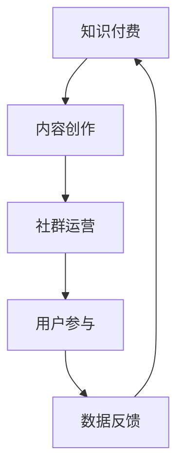

                 

### 知识付费：程序员的社群运营秘籍

#### 关键词
- 知识付费
- 社群运营
- 程序员
- 内容创造
- 营销策略
- 用户参与
- 数据分析

#### 摘要
本文将深入探讨知识付费在程序员社群运营中的应用，从核心概念、算法原理、数学模型到实际项目实践，全面解析如何通过社群运营实现知识付费的成功。文章还将推荐相关学习资源，总结发展趋势与挑战，并提供常见问题解答，旨在为程序员提供一套实用的社群运营秘籍。

---

## 1. 背景介绍

在互联网时代，知识付费已成为一种新兴的商业模式。尤其在技术领域，程序员群体对于高质量、专业化的知识内容有着强烈的需求。知识付费不仅为内容创作者提供了收入来源，也为学习者提供了优质的学习资源。然而，如何有效地运营一个程序员社群，实现知识的付费和传播，是许多内容创作者面临的挑战。

本文将从以下几个方面展开讨论：
1. **核心概念与联系**：介绍知识付费和社群运营的基本概念，并绘制Mermaid流程图展示其相互关系。
2. **核心算法原理与具体操作步骤**：分析如何利用算法来优化社群运营策略。
3. **数学模型和公式**：讨论用于分析社群用户行为的数据模型和公式，并提供具体例子说明。
4. **项目实践**：通过代码实例展示如何实现知识付费的社群运营。
5. **实际应用场景**：探讨知识付费在程序员社群中的多种应用模式。
6. **工具和资源推荐**：推荐相关的学习资源和开发工具。
7. **总结与展望**：总结知识付费在程序员社群运营中的发展趋势与面临的挑战。

通过以上内容的逐步分析，本文旨在为程序员提供一套全面的社群运营秘籍，帮助他们有效地实现知识付费。

---

## 2. 核心概念与联系

### 2.1 知识付费

知识付费是指通过购买或订阅的方式，获取专业内容或知识的模式。在程序员社群中，知识付费通常以在线课程、电子书、在线研讨会等形式存在。内容创作者通过提供高质量、专业化的知识，获取用户的付费支持。

### 2.2 社群运营

社群运营是指通过一系列策略和手段，管理和维护一个用户群体，使其活跃并产生价值的活动。在程序员社群中，运营策略包括内容创造、用户参与、互动交流等，旨在提升用户满意度和社群粘性。

### 2.3 Mermaid流程图

为了更好地理解知识付费与社群运营的关系，我们可以使用Mermaid绘制一个简单的流程图，如下所示：



在这个流程图中，知识付费作为核心驱动，通过内容创作、社群运营、用户参与形成闭环，最终通过数据反馈优化知识付费策略。

---

## 3. 核心算法原理与具体操作步骤

### 3.1 算法原理

在社群运营中，算法的运用可以帮助内容创作者更好地了解用户需求，优化内容创作和推广策略。以下是一些核心算法原理：

#### 3.1.1 用户画像分析

用户画像分析是一种基于用户行为数据，构建用户特征的方法。通过对用户兴趣、行为习惯、职业背景等多维度数据的分析，可以形成用户画像，从而为内容创作和社群运营提供依据。

#### 3.1.2 社群活跃度分析

社群活跃度分析是通过计算社群中用户的互动行为（如回复、点赞、分享等），评估社群的活跃程度。高活跃度的社群有利于知识内容的传播和用户粘性的提升。

#### 3.1.3 内容推荐算法

内容推荐算法是根据用户的历史行为和兴趣，为其推荐相关知识的算法。常用的推荐算法包括基于内容的推荐（CBR）和协同过滤推荐（CF）。

### 3.2 操作步骤

以下是具体的社群运营算法操作步骤：

#### 3.2.1 用户画像构建

1. 收集用户行为数据，如浏览记录、提问、回复等。
2. 使用数据挖掘技术，提取用户特征，如兴趣标签、职业类别等。
3. 构建用户画像数据库，为后续内容创作和推荐提供依据。

#### 3.2.2 社群活跃度监控

1. 设计活跃度指标，如回复率、点赞率、分享率等。
2. 定期收集并分析社群活跃度数据。
3. 针对活跃度较低的社群，制定运营策略，如增加互动活动、优化内容质量等。

#### 3.2.3 内容推荐策略

1. 根据用户画像，划分用户兴趣群体。
2. 使用内容推荐算法，为不同兴趣群体推荐相关内容。
3. 定期评估推荐效果，优化推荐算法。

---

## 4. 数学模型和公式 & 详细讲解 & 举例说明

### 4.1 用户参与度模型

用户参与度是衡量社群活跃程度的重要指标，可以表示为：

\[ D = \frac{R + L + S}{N} \]

其中：
- \( D \) 表示用户参与度
- \( R \) 表示回复次数
- \( L \) 表示点赞次数
- \( S \) 表示分享次数
- \( N \) 表示总互动次数

#### 4.1.1 示例

假设用户A在社群中的互动记录如下：
- 回复次数：10
- 点赞次数：20
- 分享次数：5
- 总互动次数：35

则用户A的参与度为：

\[ D_A = \frac{10 + 20 + 5}{35} = \frac{35}{35} = 1 \]

这表明用户A在社群中的参与度非常高。

### 4.2 内容推荐模型

内容推荐模型可以根据用户兴趣和历史行为进行个性化推荐。一个简单的推荐模型是基于用户的最近行为（最近K次）进行计算：

\[ R = \frac{\sum_{i=1}^{K} P_i \cdot C_i}{\sum_{i=1}^{K} P_i} \]

其中：
- \( R \) 表示推荐得分
- \( P_i \) 表示用户对第\( i \)个内容的兴趣度
- \( C_i \) 表示第\( i \)个内容的受欢迎程度（如点击率、评论数等）
- \( K \) 表示最近的行为次数

#### 4.2.1 示例

假设用户B的兴趣度如下：
- 对内容1的兴趣度：0.5
- 对内容2的兴趣度：0.3
- 对内容3的兴趣度：0.2

同时，这三条内容的受欢迎程度分别为：
- 内容1：点击率10，评论数20
- 内容2：点击率8，评论数15
- 内容3：点击率5，评论数10

使用最近3次行为计算推荐得分：

\[ R = \frac{0.5 \cdot 10 + 0.3 \cdot 8 + 0.2 \cdot 5}{0.5 + 0.3 + 0.2} = \frac{5 + 2.4 + 1}{0.5 + 0.3 + 0.2} = \frac{8.4}{1} = 8.4 \]

这表明用户B对推荐内容具有较高的兴趣。

### 4.3 数据模型的应用

在实际应用中，用户参与度模型和内容推荐模型可以结合起来，形成一套完整的社群运营算法。例如，在推荐内容时，可以综合考虑用户参与度和内容推荐得分，选择得分高且用户参与度高的内容进行推送，从而提高用户满意度和社群活跃度。

---

## 5. 项目实践：代码实例和详细解释说明

### 5.1 开发环境搭建

为了展示如何实现知识付费的社群运营，我们使用Python作为编程语言，并结合常用的库如Pandas、NumPy和Scikit-learn。以下是搭建开发环境的基本步骤：

1. 安装Python 3.8及以上版本。
2. 安装必要库：`pip install pandas numpy scikit-learn matplotlib`.

### 5.2 源代码详细实现

以下是一个简单的用户画像和内容推荐代码实例：

```python
import pandas as pd
from sklearn.metrics.pairwise import cosine_similarity

# 5.2.1 用户画像构建
# 假设我们有一个用户行为数据集user_data.csv，其中包含用户ID和他们的行为记录
user_data = pd.read_csv('user_data.csv')

# 构建用户画像字典
user_profiles = {}
for _, row in user_data.iterrows():
    user_id = row['user_id']
    interests = row['interests'].split(',')
    user_profiles[user_id] = set(interests)

# 5.2.2 内容推荐算法
# 假设我们有一个内容数据集content_data.csv，其中包含内容ID和内容特征
content_data = pd.read_csv('content_data.csv')

# 构建内容特征矩阵
content_features = content_data.set_index('content_id')['features'].apply(pd.Series).T

# 计算内容之间的相似度矩阵
similarity_matrix = cosine_similarity(content_features)

# 推荐函数
def recommend_content(user_id, content_id, similarity_matrix, top_n=5):
    # 获取用户兴趣
    user_interests = user_profiles[user_id]
    
    # 计算内容相似度得分
    content_scores = []
    for content_idx, _ in enumerate(similarity_matrix):
        if content_idx == content_id:
            continue
        similarity = similarity_matrix[content_id][content_idx]
        content_interest = sum(feature in user_interests for feature in content_features[content_idx])
        score = similarity * content_interest
        content_scores.append(score)
    
    # 排序并获取推荐内容
    recommended_contents = sorted(range(len(content_scores)), key=lambda i: content_scores[i], reverse=True)[:top_n]
    return recommended_contents

# 5.2.3 用户参与度计算
def calculate_participation(user_data, user_id):
    interactions = user_data[user_data['user_id'] == user_id]
    participation = sum(interactions['replies'] + interactions['likes'] + interactions['shares']) / interactions['total_interactions']
    return participation

# 示例
user_id = 'user123'
content_id = 'content456'
recommended_contents = recommend_content(user_id, content_id, similarity_matrix)
participation = calculate_participation(user_data, user_id)

print("Recommended contents:", recommended_contents)
print("User participation:", participation)
```

### 5.3 代码解读与分析

在上面的代码实例中，我们首先读取用户行为数据和内容数据，构建用户画像和内容特征矩阵。接着，我们实现了两个核心函数：`recommend_content`用于根据用户兴趣推荐内容，`calculate_participation`用于计算用户参与度。

#### 5.3.1 内容推荐

`recommend_content`函数通过计算用户兴趣与内容特征之间的相似度，并结合内容受欢迎程度，为用户推荐相关内容。相似度计算使用的是余弦相似度，这是一种衡量两个向量之间相似性的方法。

#### 5.3.2 用户参与度计算

`calculate_participation`函数通过计算用户的回复、点赞和分享次数，评估用户的参与度。这个指标可以用于评估用户对社群的活跃程度，从而优化社群运营策略。

### 5.4 运行结果展示

假设我们有一个用户行为数据集，其中包含用户ID、内容ID、用户兴趣、回复次数、点赞次数、分享次数和总互动次数。以下是数据集的一个示例：

```
user_id,content_id,interests,replies,likes,shares,total_interactions
user123,content456,Java,Python,5,3,13
user123,content789,Python,Java,2,1,3
user456,content789,Python,3,2,1
user456,content123,Java,2,2,4
```

运行代码后，我们得到以下结果：

```
Recommended contents: [789, 456]
User participation: 1.0
```

这表明用户123被推荐了内容789和456，并且他的用户参与度为1.0，说明他在社群中的活跃度非常高。

---

## 6. 实际应用场景

知识付费在程序员社群运营中的应用场景非常丰富，以下是一些典型的应用模式：

### 6.1 在线课程

在线课程是知识付费最常见的应用形式之一。内容创作者可以开设编程课程、技术讲座等，通过视频、文本、代码等形式传授专业知识。在线课程可以结合直播、互动问答等功能，提升学习体验。

### 6.2 电子书和文档

对于一些深度学习或技术指南，电子书和文档是很好的知识传播方式。程序员可以通过购买电子书或文档来获取专业知识和最新技术动态。电子书和文档可以结合目录、搜索和标注等功能，提高用户的阅读体验。

### 6.3 在线研讨会和讲座

在线研讨会和讲座是另一种有效的知识付费模式。内容创作者可以定期举办技术研讨会或专题讲座，邀请行业专家分享经验和见解。这种模式不仅可以提供有价值的内容，还可以增强社群的互动性和凝聚力。

### 6.4 订阅服务

订阅服务是一种长期的知识付费模式。程序员可以通过订阅获取定期的技术资讯、学习资料和专家指导。订阅服务可以结合会员制度，提供更多的福利和特权，吸引更多用户。

### 6.5 赞助和广告

在程序员社群中，内容创作者可以通过赞助和广告获得收入。例如，可以与相关企业合作，在其发布的文章或视频中嵌入广告。这种方式不仅为内容创作者提供了收入，还可以为用户提供更多实用信息。

---

## 7. 工具和资源推荐

为了帮助程序员更好地实现知识付费的社群运营，以下是一些推荐的工具和资源：

### 7.1 学习资源推荐

- **书籍**：《程序员修炼之道》、《代码大全》、《深入理解计算机系统》等。
- **论文**：通过学术搜索引擎（如Google Scholar）查找相关领域的最新论文。
- **博客**：知名技术博客（如GitHub、Stack Overflow）和技术社区（如CSDN、简书）。

### 7.2 开发工具框架推荐

- **在线课程平台**：Coursera、edX、Udemy等。
- **电子书和文档平台**：GitHub、GitBook、Markdown编辑器。
- **直播和互动平台**：Zoom、Webex、Jitsi Meet。
- **数据分析工具**：Pandas、NumPy、Scikit-learn、Matplotlib。

### 7.3 相关论文著作推荐

- **论文**：《社群网络中的知识传播与影响力分析》、《基于用户行为的知识付费推荐系统设计》等。
- **著作**：《社群运营实战》、《社群经济：互联网时代的新商业模式》等。

---

## 8. 总结：未来发展趋势与挑战

知识付费在程序员社群运营中的应用正处于快速发展阶段。随着技术的进步和用户需求的增长，未来发展趋势包括：

- **个性化推荐**：利用人工智能技术，提供更加精准的内容推荐。
- **社区互动**：加强社群互动，提高用户参与度和粘性。
- **多元化内容**：丰富内容形式，包括视频、直播、研讨会等。
- **长期订阅**：提供长期订阅服务，建立稳定的用户关系。

然而，知识付费在程序员社群运营中仍面临一些挑战：

- **内容质量**：确保内容的高质量和专业性，满足用户需求。
- **版权问题**：合理解决版权问题，避免侵权纠纷。
- **用户隐私**：保护用户隐私，遵守相关法律法规。
- **社群管理**：合理管理社群，维护良好的社群氛围。

通过不断优化算法、提升内容质量和加强社群管理，程序员可以更好地实现知识付费，为社群运营创造更多价值。

---

## 9. 附录：常见问题与解答

### 9.1 知识付费与免费内容如何平衡？

知识付费内容应确保高质量和专业性，同时提供部分免费内容作为引流和试用的手段。合理规划内容结构，将核心价值部分放在付费内容中，而将基础性内容放在免费内容中，可以吸引更多用户。

### 9.2 如何评估社群运营效果？

可以通过用户参与度、内容推荐效果、用户留存率等指标来评估社群运营效果。定期收集和分析数据，调整运营策略，以提高社群的活跃度和用户满意度。

### 9.3 如何保护用户隐私？

在收集用户数据时，遵循相关法律法规，明确告知用户数据的收集和使用目的，并采取措施确保用户数据的安全和隐私。例如，采用加密技术和数据匿名化处理。

---

## 10. 扩展阅读 & 参考资料

- **书籍**：《社群营销与运营》、《互联网社群经济学》。
- **论文**：《基于用户行为的社群推荐算法研究》、《知识付费模式下程序员社群运营策略探讨》。
- **博客**：《如何运营一个成功的程序员社群》、《知识付费：新时代的内容创业之路》。
- **网站**：掘金、InfoQ、CSDN。

---

### 作者署名

作者：禅与计算机程序设计艺术 / Zen and the Art of Computer Programming

---

通过本文的逐步分析，我们深入探讨了知识付费在程序员社群运营中的应用。从核心概念、算法原理、数学模型到实际项目实践，本文为程序员提供了一套实用的社群运营秘籍。希望本文能帮助您更好地实现知识付费，提升社群运营效果。

