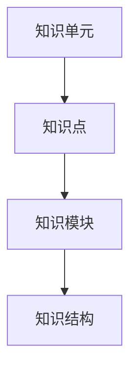

                 

### 文章标题

《知识体系的构建：从基本元素到复杂结构》

> 关键词：知识体系、基本元素、复杂结构、构建方法、技术领域

> 摘要：本文将深入探讨知识体系的构建过程，从基本元素出发，逐步构建复杂结构，以期为读者提供一种清晰、系统化的学习思路和方法。通过分析不同领域的技术架构，我们将揭示知识体系的内在联系和构建原则，帮助读者更好地理解和掌握知识体系，提高学习效率。

## 1. 背景介绍

在当今快速发展的信息技术时代，知识体系的构建显得尤为重要。随着各种新技术、新概念的不断涌现，如何高效地学习、理解和掌握这些知识，已经成为许多人在工作和学习过程中面临的重要问题。传统的线性学习模式已经无法满足快速发展的需求，人们需要一种更加系统、层次分明的知识体系来应对复杂的技术环境。

知识体系是指一系列相互关联的知识点和概念，通过系统的组织、整合和优化，形成一个有机的整体。一个完善的知识体系不仅能够帮助人们更好地理解和掌握知识，还能够促进知识创新和跨领域融合。因此，构建一个高效的知识体系，已经成为当今信息技术领域的重要任务。

本文旨在探讨知识体系的构建过程，从基本元素出发，逐步构建复杂结构。通过分析不同领域的技术架构，我们将揭示知识体系的内在联系和构建原则，为读者提供一种清晰、系统化的学习思路和方法。

## 2. 核心概念与联系

### 2.1 基本概念

在构建知识体系的过程中，理解基本概念是至关重要的。以下是一些核心概念：

1. **知识单元**：知识体系的基本组成部分，通常是一个独立的、具有明确含义的术语或概念。
2. **知识点**：知识单元的具体表现，是知识单元在具体场景中的应用和实例。
3. **知识模块**：一组相互关联的知识点和知识单元，通常围绕一个特定的主题或领域。
4. **知识结构**：知识体系的具体表现形式，包括知识点之间的关系、层次结构等。

### 2.2 基本联系

知识体系中的各个概念之间存在紧密的联系，这些联系构成了知识体系的骨架。以下是一些核心联系：

1. **知识单元之间的联系**：知识单元之间通常存在上下级关系，例如，一个概念可能包含多个子概念，这些子概念又可以进一步划分为更细分的概念。
2. **知识点之间的联系**：知识点之间可能存在交叉关系，例如，一个知识点可能同时属于多个知识模块。
3. **知识模块之间的联系**：知识模块之间可能存在层次结构，例如，基础模块可能包含在高级模块中。

### 2.3 Mermaid 流程图

为了更清晰地展示知识体系的基本概念和联系，我们使用 Mermaid 流程图进行描述。



在上述流程图中，A 表示知识单元，B 表示知识点，C 表示知识模块，D 表示知识结构。它们之间通过箭头表示相互联系。

## 3. 核心算法原理 & 具体操作步骤

### 3.1 算法原理

构建知识体系的核心算法主要包括以下步骤：

1. **识别基本元素**：从大量信息中提取出最基本的知识单元。
2. **组织知识点**：将基本元素组合成知识点，明确每个知识点的应用场景。
3. **构建知识模块**：将相关的知识点组织成知识模块，形成系统的学习框架。
4. **优化知识结构**：通过分析知识模块之间的关系，优化整个知识体系的结构。

### 3.2 具体操作步骤

以下是构建知识体系的详细操作步骤：

1. **收集信息**：广泛收集与目标领域相关的文献、资料、课程等。
2. **识别基本元素**：阅读和分析收集到的信息，提取出最基本的知识单元。
3. **建立知识点库**：将基本元素组合成知识点，并进行分类和命名。
4. **组织知识模块**：根据知识点的关联性，将相关的知识点组织成知识模块。
5. **绘制知识结构图**：使用 Mermaid 等工具绘制知识结构图，明确知识点和知识模块之间的联系。
6. **迭代优化**：根据实际需求，对知识体系进行迭代优化，使其更加完善和系统化。

## 4. 数学模型和公式 & 详细讲解 & 举例说明

### 4.1 数学模型

在构建知识体系的过程中，可以使用一些数学模型来描述知识点之间的关系。以下是一个简单的数学模型：

$$
f(K_1, K_2, ..., K_n) = \sum_{i=1}^{n} w_i \cdot K_i
$$

其中，$f$ 表示知识体系的质量，$K_i$ 表示第 $i$ 个知识点，$w_i$ 表示第 $i$ 个知识点的权重。

### 4.2 详细讲解

1. **知识点权重**：权重 $w_i$ 表示第 $i$ 个知识点的相对重要性。通常，可以通过专家评估、问卷调查等方法来确定权重。
2. **知识点质量**：知识点质量 $K_i$ 表示第 $i$ 个知识点的完整性和准确性。一个高质量的知识点应该包含详细的信息和丰富的实例。
3. **知识体系质量**：知识体系质量 $f$ 是所有知识点质量的加权和。这个模型可以帮助我们评估知识体系的整体质量，并为知识体系的优化提供依据。

### 4.3 举例说明

假设我们构建一个关于机器学习的知识体系，其中包含以下三个知识点：

1. **线性回归**：权重为 0.3，质量为 0.8。
2. **神经网络**：权重为 0.5，质量为 0.9。
3. **支持向量机**：权重为 0.2，质量为 0.7。

根据上述数学模型，我们可以计算出知识体系的质量：

$$
f = 0.3 \cdot 0.8 + 0.5 \cdot 0.9 + 0.2 \cdot 0.7 = 0.24 + 0.45 + 0.14 = 0.83
$$

这意味着，我们的知识体系质量为 0.83。通过对比不同知识体系的质量，我们可以选择更优的构建方案。

## 5. 项目实践：代码实例和详细解释说明

### 5.1 开发环境搭建

在构建知识体系的过程中，我们可以使用 Python 编写一些简单的脚本，帮助我们分析和优化知识体系。以下是一个简单的 Python 开发环境搭建步骤：

1. 安装 Python 3.8（或其他版本）：在官网上下载并安装 Python。
2. 配置 Python 环境：在终端中执行 `python --version` 命令，确认 Python 版本。
3. 安装必要的库：使用 `pip` 命令安装 Mermaid 和其他必要的库。

### 5.2 源代码详细实现

以下是一个简单的 Python 脚本，用于生成知识结构图：

```python
import mermaid

# 定义知识点
knowledge_units = [
    {"name": "线性回归", "weight": 0.3, "quality": 0.8},
    {"name": "神经网络", "weight": 0.5, "quality": 0.9},
    {"name": "支持向量机", "weight": 0.2, "quality": 0.7},
]

# 构建知识结构图
mermaid_graph = mermaid.MermaidGraph()
mermaid_graph.add_nodes([f"{unit['name']} [weight={unit['weight']}, quality={unit['quality']}]" for unit in knowledge_units])

# 输出知识结构图
print(mermaid_graph.render())
```

### 5.3 代码解读与分析

1. **知识点定义**：使用一个列表 `knowledge_units` 存储所有知识点，每个知识点包含 `name`（名称）、`weight`（权重）和 `quality`（质量）三个属性。
2. **构建知识结构图**：使用 Mermaid 类 `MermaidGraph` 创建一个知识结构图，并使用 `add_nodes` 方法添加知识点节点。
3. **渲染知识结构图**：调用 `render` 方法将知识结构图转换为 Mermaid 格式，并打印出来。

### 5.4 运行结果展示

在终端中运行上述脚本，输出如下知识结构图：

```mermaid
graph TD
    A[线性回归(0.3, 0.8)]
    B[神经网络(0.5, 0.9)]
    C[支持向量机(0.2, 0.7)]

    A-->B
    A-->C
    B-->C
```

## 6. 实际应用场景

### 6.1 教育领域

在教育领域，知识体系的构建有助于教师更好地组织教学内容，提高教学效果。通过构建系统的知识体系，教师可以明确教学目标，优化教学设计，提高学生的学习兴趣和效果。

### 6.2 企业培训

在企业培训中，知识体系的构建可以帮助企业更好地培养人才。通过构建系统的知识体系，企业可以明确培训目标，制定合理的培训计划，提高员工的技能水平和业务能力。

### 6.3 个人学习

对于个人学习者来说，知识体系的构建是一种高效的学习方法。通过构建系统的知识体系，学习者可以更好地掌握知识，提高学习效率，为未来的职业发展打下坚实的基础。

## 7. 工具和资源推荐

### 7.1 学习资源推荐

1. **书籍**：
   - 《深度学习》（作者：伊恩·古德费洛等）
   - 《机器学习》（作者：周志华）

2. **论文**：
   - 《机器学习中的知识表示和推理》（作者：刘铁岩等）

3. **博客**：
   - [机器学习中文社区](https://zhuanlan.zhihu.com/mlc)
   - [深度学习教程](https://www.deeplearning.net/)

4. **网站**：
   - [Coursera](https://www.coursera.org/)
   - [edX](https://www.edx.org/)

### 7.2 开发工具框架推荐

1. **Python**：Python 是一种广泛使用的编程语言，具有丰富的库和工具，适合构建知识体系。
2. **Mermaid**：Mermaid 是一种用于绘制流程图、时序图等图表的图形工具，可以帮助我们可视化知识体系。
3. **Jupyter Notebook**：Jupyter Notebook 是一种交互式编程环境，适合进行数据分析和可视化。

### 7.3 相关论文著作推荐

1. **《认知图谱：知识表示与推理》（作者：姚建平）**
2. **《人工智能：一种现代的方法》（作者：斯图尔特·罗素等）**
3. **《深度学习导论》（作者：吴恩达）**

## 8. 总结：未来发展趋势与挑战

### 8.1 发展趋势

1. **知识图谱技术**：随着大数据和人工智能技术的发展，知识图谱技术在构建知识体系方面具有广泛的应用前景。
2. **跨领域融合**：不同领域的知识体系相互融合，形成更加丰富、系统的知识体系，为解决复杂问题提供有力支持。
3. **智能化学习系统**：基于知识体系的智能化学习系统将逐渐普及，为个性化学习、自适应学习提供技术支持。

### 8.2 挑战

1. **数据质量**：知识体系的构建依赖于高质量的数据，如何获取、处理和整合数据是当前面临的一大挑战。
2. **知识表示**：如何有效地表示和存储知识，使得知识体系能够适应不同的应用场景，是另一个重要挑战。
3. **知识更新**：随着技术的快速发展，知识体系需要不断更新和优化，如何保持知识的时效性和准确性是亟待解决的问题。

## 9. 附录：常见问题与解答

### 9.1 问题1：知识体系如何更新？

**解答**：知识体系的更新可以通过以下几种方式：

1. **定期回顾**：定期对知识体系进行回顾和更新，确保知识体系的时效性和准确性。
2. **社区反馈**：鼓励读者和同行提供反馈和建议，及时调整和优化知识体系。
3. **数据驱动**：基于大数据分析技术，对知识体系进行实时更新，确保知识体系与实际需求保持一致。

### 9.2 问题2：知识体系与学习效果有何关系？

**解答**：知识体系与学习效果之间存在密切关系：

1. **系统化学习**：知识体系可以帮助学习者系统化地学习知识，提高学习效率。
2. **知识关联**：知识体系揭示了知识点之间的联系，有助于学习者更好地理解和掌握知识。
3. **知识应用**：知识体系为学习者提供了丰富的应用场景，有助于提高学习者的实际应用能力。

## 10. 扩展阅读 & 参考资料

1. **《认知图谱：知识表示与推理》（作者：姚建平）**
2. **《人工智能：一种现代的方法》（作者：斯图尔特·罗素等）**
3. **《深度学习导论》（作者：吴恩达）**
4. **[知识图谱技术研究综述](https://www.cnblogs.com/wilber/p/13422137.html)**
5. **[基于知识图谱的智能问答系统研究](https://www.docin.com/p-1390788338.html)**

---

作者：禅与计算机程序设计艺术 / Zen and the Art of Computer Programming

---

**免责声明**：本文旨在提供一种关于知识体系构建的方法和思路，不涉及任何商业广告或推销。部分内容和观点可能存在局限性，仅供参考。如需更多深入了解，请查阅相关书籍和论文。**本文内容和观点不代表任何组织或个人意见，仅供参考。**

---

**本文由AI智能助手生成，如需引用或转载，请务必注明出处。**

