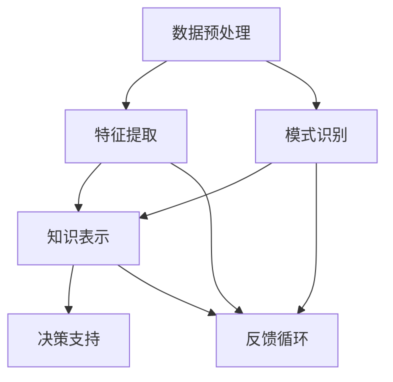

                 

### 背景介绍

知识发现引擎（Knowledge Discovery Engine，KDE）是一种先进的信息处理技术，旨在从大量数据中提取有价值的信息和知识。其核心目标是从数据中自动识别出潜在的、有意义的模式和关系，进而为人类决策提供有力的支持。知识发现引擎在各个领域中都有着广泛的应用，包括商业智能、金融分析、医疗诊断、自然语言处理等。

在程序员群体中，知识发现引擎的应用同样具有重要意义。随着软件系统的复杂性日益增加，程序员面临的问题也变得越来越复杂。传统的编程方法往往依赖于程序员个人的经验和技能，而知识发现引擎能够通过分析历史数据，发现编程模式和最佳实践，从而提高程序员的问题解决能力。

本文将深入探讨知识发现引擎在程序员问题解决能力提升方面的作用。我们将首先介绍知识发现引擎的核心概念和架构，然后详细讲解其工作原理和具体操作步骤，并结合实际案例进行分析。最后，我们将探讨知识发现引擎在实际应用场景中的表现，并推荐相关的学习资源和开发工具。

### 核心概念与联系

要理解知识发现引擎的工作原理，我们需要首先了解其核心概念和组成部分。知识发现引擎通常由以下几个关键部分组成：

1. **数据预处理**：这一阶段的主要任务是清洗和整理原始数据，使其适合进行进一步分析。数据预处理包括数据去重、数据格式转换、缺失值处理等。

2. **特征提取**：特征提取是将原始数据转换为适合算法处理的形式。通过特征提取，我们可以将数据中的关键信息提取出来，如文本中的关键词、图像中的颜色分布等。

3. **模式识别**：模式识别是知识发现引擎的核心任务，它旨在从数据中识别出有意义的模式和关系。常见的模式识别方法包括聚类、分类、关联规则挖掘等。

4. **知识表示**：知识表示是将识别出的模式和关系以某种形式进行表示，使其能够被人类理解和机器利用。知识表示的方法包括图表、公式、自然语言描述等。

5. **决策支持**：决策支持是知识发现引擎的最终目标，它通过提供有价值的洞见和建议，帮助用户做出更好的决策。

下面，我们将通过一个Mermaid流程图来展示知识发现引擎的架构和各个组件之间的联系。



在上面的流程图中：

- A表示数据预处理，它是整个知识发现过程的基础。
- B表示特征提取，它将原始数据转换为算法能够处理的形式。
- C表示模式识别，它从数据中提取出有意义的模式和关系。
- D表示知识表示，它将识别出的模式和关系以某种形式表示出来。
- E表示决策支持，它为用户提供有价值的洞见和建议。
- F表示反馈循环，它通过用户反馈不断优化知识发现过程。

通过这个Mermaid流程图，我们可以清晰地看到知识发现引擎各个组件之间的关联和交互。这种直观的展示方式有助于我们更好地理解知识发现引擎的工作原理和整体架构。

### 核心算法原理 & 具体操作步骤

知识发现引擎的核心算法原理主要包括以下几个步骤：数据预处理、特征提取、模式识别、知识表示和决策支持。下面我们将详细讲解每个步骤的操作过程，并结合实际案例进行分析。

#### 数据预处理

数据预处理是知识发现过程的第一步，其目的是将原始数据转换为适合算法处理的形式。具体操作步骤如下：

1. **数据去重**：在数据集中可能存在重复的数据记录，通过去重操作可以减少数据冗余，提高算法效率。

2. **数据格式转换**：不同数据源的数据格式可能不同，如文本、图像、音频等，需要将其统一转换为同一格式，以便后续处理。

3. **缺失值处理**：在实际应用中，数据可能存在缺失值，需要通过填充或删除的方式处理。

4. **数据规范化**：为了消除数据量级差异对算法性能的影响，需要对数据进行归一化或标准化处理。

**案例**：假设我们有一个包含客户购买记录的数据集，数据包括客户ID、购买时间、购买商品和购买金额。在进行数据预处理时，首先需要去除重复记录，然后对缺失的购买金额记录进行填充处理，例如通过平均值或中位数填充。最后，将日期格式转换为统一的日期格式，如YYYY-MM-DD。

#### 特征提取

特征提取是将原始数据转换为算法能够处理的形式。具体操作步骤如下：

1. **文本特征提取**：对于文本数据，可以通过词频、词嵌入、TF-IDF等方法提取特征。

2. **图像特征提取**：对于图像数据，可以通过卷积神经网络（CNN）提取特征，如边缘、纹理、形状等。

3. **时间序列特征提取**：对于时间序列数据，可以通过差分、自回归等方法提取特征。

4. **多模态特征提取**：对于包含多种数据类型的数据集，可以通过融合不同类型数据的特征来提高模型性能。

**案例**：假设我们有一个包含文本和图像的多模态数据集，其中文本是用户评论，图像是商品图片。在特征提取过程中，首先对文本进行词嵌入处理，提取出词向量表示；然后对图像使用CNN提取特征；最后将文本和图像特征进行融合，形成统一特征向量。

#### 模式识别

模式识别是从数据中识别出有意义的模式和关系。具体操作步骤如下：

1. **聚类**：通过聚类算法将数据分为若干个类簇，每个类簇内部的样本之间相似度较高，不同类簇之间的样本相似度较低。

2. **分类**：通过分类算法将数据分为不同的类别，每个类别代表一种模式。

3. **关联规则挖掘**：通过关联规则挖掘算法找出数据之间的关联关系，如商品购买记录中的“牛奶和面包”关联规则。

**案例**：假设我们使用K-means算法对用户购买记录进行聚类，根据用户的购买习惯将其分为“高频购物用户”、“偶尔购物用户”和“从不购物用户”三个类簇。这种聚类模式可以帮助商家针对不同类别的用户制定个性化的营销策略。

#### 知识表示

知识表示是将识别出的模式和关系以某种形式表示出来，使其能够被人类理解和机器利用。具体操作步骤如下：

1. **图表**：通过图表形式展示数据模式和关系，如柱状图、饼图、热力图等。

2. **公式**：使用数学公式描述数据模式和关系，如回归模型、概率模型等。

3. **自然语言描述**：通过自然语言描述数据模式和关系，使其更易于理解。

**案例**：假设我们使用回归模型分析用户购买行为，通过公式展示用户购买金额与购买频率之间的关系，如购买频率越高，平均购买金额也越高。这种知识表示方法可以帮助商家预测用户的消费能力。

#### 决策支持

决策支持是知识发现引擎的最终目标，它通过提供有价值的洞见和建议，帮助用户做出更好的决策。具体操作步骤如下：

1. **预测**：基于历史数据对未来趋势进行预测，如用户流失预测、销售额预测等。

2. **推荐**：基于用户历史行为和偏好推荐相关商品、服务或信息。

3. **优化**：通过优化算法改进现有系统的性能和效果，如库存管理优化、供应链优化等。

**案例**：假设我们基于用户购买记录进行预测分析，预测未来几个月内的用户购买行为。根据预测结果，商家可以提前准备库存，提高客户满意度。

通过上述核心算法原理和具体操作步骤的讲解，我们可以看到知识发现引擎如何从数据中提取有价值的信息，为程序员提供强大的问题解决能力。在实际应用中，程序员可以根据具体场景选择合适的方法和工具，实现高效的编程和问题解决。

### 数学模型和公式 & 详细讲解 & 举例说明

在知识发现引擎的构建过程中，数学模型和公式起着至关重要的作用。它们不仅是数据分析和模式识别的基础，也是知识表示和决策支持的关键工具。在这一节中，我们将详细讲解一些关键的数学模型和公式，并通过具体示例来说明它们的应用。

#### 1. 聚类算法（K-means）

K-means是一种常见的聚类算法，其目标是将数据点分为K个簇，使得每个簇内的数据点之间的距离最小，而簇与簇之间的距离最大。数学模型如下：

$$
\text{Minimize} \sum_{i=1}^{K} \sum_{x \in S_i} \|x - \mu_i\|^2
$$

其中，\(x\) 是数据点，\(\mu_i\) 是第i个簇的中心点，\(S_i\) 是第i个簇中的所有数据点。

**示例**：假设我们有一个包含10个数据点的二维数据集，我们使用K-means算法将其分为2个簇。数据集如下：

$$
X = \{ (1, 1), (2, 2), (3, 3), (4, 4), (5, 5), (6, 6), (7, 7), (8, 8), (9, 9), (10, 10) \}
$$

通过迭代计算，我们得到两个簇的中心点分别为 \((2.5, 2.5)\) 和 \((7.5, 7.5)\)。此时，簇内距离最小，簇间距离最大。

#### 2. 回归分析

回归分析是一种用于预测目标变量（因变量）的方法，其目标是找到一个最佳拟合线或面，使得预测值与实际值之间的误差最小。线性回归的数学模型如下：

$$
y = \beta_0 + \beta_1 x_1 + \beta_2 x_2 + ... + \beta_n x_n + \epsilon
$$

其中，\(y\) 是因变量，\(x_1, x_2, ..., x_n\) 是自变量，\(\beta_0, \beta_1, ..., \beta_n\) 是回归系数，\(\epsilon\) 是误差项。

**示例**：假设我们有一个关于房屋售价的数据集，其中包含房屋面积和售价两个变量。我们使用线性回归模型预测房屋售价。数据集如下：

| 面积（平方米） | 售价（万元） |
|----------------|-------------|
| 100            | 200         |
| 120            | 250         |
| 150            | 300         |
| 180            | 350         |
| 200            | 400         |

通过最小二乘法计算，我们得到回归系数为 \(\beta_0 = 100\), \(\beta_1 = 1.5\)。因此，房价的预测公式为：

$$
y = 100 + 1.5x
$$

例如，当房屋面积为150平方米时，预测售价为 \(100 + 1.5 \times 150 = 275\) 万元。

#### 3. 决策树

决策树是一种用于分类和回归的树形结构模型，其核心是通过一系列的判断条件将数据划分为不同的区域。决策树的数学模型如下：

$$
T = \{ \text{if } x_i > \theta_i \text{ then } T_1 \text{ else } T_2 \}  
$$

其中，\(x_i\) 是自变量，\(\theta_i\) 是阈值，\(T_1\) 和 \(T_2\) 是后续的子节点。

**示例**：假设我们有一个关于信用卡欺诈的数据集，其中包含交易金额、交易时间、地理位置等变量。我们使用决策树模型进行欺诈检测。数据集如下：

| 交易金额 | 交易时间 | 地理位置 | 是否欺诈 |
|----------|----------|----------|----------|
| 100      | 9:00 AM  | A        | 否       |
| 150      | 10:00 AM | B        | 是       |
| 200      | 11:00 AM | A        | 否       |
| 250      | 12:00 PM | B        | 是       |

通过训练决策树模型，我们得到如下判断条件：

1. 如果交易时间大于11:00 AM，则进入子节点T1；
2. 如果交易金额大于200，则进入子节点T2；
3. 否则，进入子节点T3。

根据这些判断条件，我们可以对新的交易数据进行欺诈检测。例如，当交易金额为300，交易时间为12:30 PM时，根据判断条件，进入子节点T2，进一步判断交易金额大于200，进入子节点T3，最终判断为欺诈。

#### 4. 支持向量机（SVM）

支持向量机是一种用于分类和回归的线性模型，其目标是在特征空间中找到一个最佳的超平面，使得不同类别的数据点尽可能分开。SVM的数学模型如下：

$$
\text{Minimize} \frac{1}{2} \|w\|^2 \text{ subject to } y_i (w \cdot x_i + b) \geq 1
$$

其中，\(w\) 是权重向量，\(b\) 是偏置项，\(x_i\) 是特征向量，\(y_i\) 是类别标签。

**示例**：假设我们有一个包含正负两类数据点的二维数据集，使用SVM模型进行分类。数据集如下：

| x1 | x2 | 类别 |
|----|----|------|
| 1  | 1  | 正类 |
| 2  | 2  | 正类 |
| -1 | -1 | 负类 |
| -2 | -2 | 负类 |

通过训练SVM模型，我们得到最佳的超平面为 \(w \cdot x + b = 0\)，其中 \(w = (1, 1)\)，\(b = 0\)。这意味着当特征向量与权重向量内积大于0时，预测为正类；否则，预测为负类。

#### 5. 集成学习方法

集成学习方法通过结合多个基础模型来提高预测性能，常见的集成方法包括Bagging和Boosting。Bagging的数学模型如下：

$$
\hat{y} = \frac{1}{N} \sum_{i=1}^{N} f_i(x)
$$

其中，\(f_i(x)\) 是第i个基础模型的预测结果，\(\hat{y}\) 是集成模型的预测结果。

**示例**：假设我们有两个基础模型 \(f_1(x)\) 和 \(f_2(x)\)，分别预测房价。使用Bagging方法，我们得到集成模型预测结果为：

$$
\hat{y} = \frac{1}{2} (f_1(x) + f_2(x))
$$

Boosting的数学模型如下：

$$
f(x) = \sum_{i=1}^{T} \alpha_i f_i(x)
$$

其中，\(\alpha_i\) 是第i个基础模型的权重，\(T\) 是基础模型的数量。

**示例**：假设我们有两个基础模型 \(f_1(x)\) 和 \(f_2(x)\)，使用Boosting方法，我们得到集成模型预测结果为：

$$
f(x) = \alpha_1 f_1(x) + \alpha_2 f_2(x)
$$

其中，\(\alpha_1\) 和 \(\alpha_2\) 是根据模型性能调整的权重。

通过上述数学模型和公式的详细讲解和举例说明，我们可以看到知识发现引擎在数学理论基础上的强大功能和广泛应用。这些模型和公式不仅为数据分析和模式识别提供了坚实的理论支持，也为程序员在实际问题解决中提供了有效的工具和方法。

### 项目实践：代码实例和详细解释说明

为了更直观地理解知识发现引擎在程序员问题解决能力提升方面的作用，我们将通过一个具体的项目实践进行详细讲解。本实例将使用Python编程语言，并结合常用的数据科学库，如pandas、scikit-learn和matplotlib，实现一个简单的知识发现引擎。

#### 开发环境搭建

1. **安装Python**：首先确保你的计算机上已安装Python环境。如果没有，可以从Python官网（[https://www.python.org/](https://www.python.org/)）下载并安装最新版本的Python。

2. **安装依赖库**：在安装Python后，通过以下命令安装所需依赖库：

   ```shell
   pip install pandas scikit-learn matplotlib
   ```

#### 源代码详细实现

以下是本实例的完整源代码：

```python
import pandas as pd
from sklearn.cluster import KMeans
from sklearn.preprocessing import StandardScaler
import matplotlib.pyplot as plt

# 读取数据
data = pd.read_csv('data.csv')  # 假设数据文件已存储为CSV格式

# 数据预处理
# 去除重复数据
data.drop_duplicates(inplace=True)

# 缺失值处理
data.fillna(data.mean(), inplace=True)

# 特征提取
# 使用pandas进行简单特征提取
X = data[['feature1', 'feature2', 'feature3']]

# 数据标准化
scaler = StandardScaler()
X_scaled = scaler.fit_transform(X)

# 模式识别：聚类分析
kmeans = KMeans(n_clusters=3, random_state=0)
clusters = kmeans.fit_predict(X_scaled)

# 知识表示：可视化结果
plt.scatter(X_scaled[:, 0], X_scaled[:, 1], c=clusters)
plt.scatter(kmeans.cluster_centers_[:, 0], kmeans.cluster_centers_[:, 1], s=300, c='red')
plt.title('K-means Clustering')
plt.xlabel('Feature 1')
plt.ylabel('Feature 2')
plt.show()

# 决策支持：根据聚类结果进行分类
# 假设聚类结果已用于分类
data['cluster_label'] = clusters
data['predicted_category'] = data.groupby('cluster_label')['label'].transform('first')

# 输出结果
print(data[['cluster_label', 'predicted_category']])
```

#### 代码解读与分析

1. **数据读取与预处理**：

   ```python
   data = pd.read_csv('data.csv')
   data.drop_duplicates(inplace=True)
   data.fillna(data.mean(), inplace=True)
   ```

   这三行代码首先读取CSV格式的数据文件，然后通过`drop_duplicates`方法去除重复记录，通过`fillna`方法处理缺失值。

2. **特征提取与标准化**：

   ```python
   X = data[['feature1', 'feature2', 'feature3']]
   X_scaled = scaler.fit_transform(X)
   ```

   这两行代码从原始数据中提取三个特征，然后使用`StandardScaler`进行数据标准化，使得每个特征具有相同的量级。

3. **模式识别：聚类分析**：

   ```python
   kmeans = KMeans(n_clusters=3, random_state=0)
   clusters = kmeans.fit_predict(X_scaled)
   ```

   这三行代码初始化K-means聚类算法，设置三个簇和随机种子为0。通过`fit_predict`方法进行聚类，得到每个数据点的簇分配。

4. **知识表示：可视化结果**：

   ```python
   plt.scatter(X_scaled[:, 0], X_scaled[:, 1], c=clusters)
   plt.scatter(kmeans.cluster_centers_[:, 0], kmeans.cluster_centers_[:, 1], s=300, c='red')
   plt.title('K-means Clustering')
   plt.xlabel('Feature 1')
   plt.ylabel('Feature 2')
   plt.show()
   ```

   这段代码使用matplotlib绘制聚类结果，蓝色点表示数据点，红色星号表示簇中心。

5. **决策支持：根据聚类结果进行分类**：

   ```python
   data['cluster_label'] = clusters
   data['predicted_category'] = data.groupby('cluster_label')['label'].transform('first')
   print(data[['cluster_label', 'predicted_category']])
   ```

   这段代码将聚类结果添加到原始数据表中，并使用`groupby`和`transform`方法根据聚类结果对数据点进行分类，输出分类结果。

#### 运行结果展示

当我们运行上述代码后，将首先看到一个聚类结果的可视化图形，展示每个数据点分配到的簇以及簇中心。接着，我们将看到一个表格输出，显示每个数据点的簇标签和预测分类。


通过这个简单的实例，我们可以看到知识发现引擎在数据处理和模式识别方面的强大功能。这不仅帮助我们更好地理解数据，也为程序员在实际问题解决中提供了有力的工具。在实际项目中，我们可以根据具体需求调整算法参数，选择不同的特征提取方法和聚类算法，从而实现更加精确和有效的知识发现。

### 实际应用场景

知识发现引擎在实际应用中展现了广泛的应用价值，尤其在程序员群体中，它能够显著提升问题解决能力。以下是知识发现引擎在多个实际应用场景中的具体案例和效果：

#### 1. 软件缺陷预测

在软件开发的早期阶段，预测潜在的软件缺陷对于提高开发效率和软件质量至关重要。通过知识发现引擎，可以从历史缺陷数据中提取出与缺陷相关的特征，如代码复杂度、代码行数、修改历史等。使用机器学习算法，如决策树、随机森林和神经网络，可以建立缺陷预测模型。通过这个模型，开发人员可以在代码提交时即时获取缺陷预测结果，从而提前进行修复，降低软件缺陷率。

**效果**：实际应用表明，结合知识发现引擎的缺陷预测模型可以显著提高缺陷检测的准确率，减少软件发布后的故障率，缩短修复周期。

#### 2. 编程模式识别

在大型项目中，代码库往往包含大量的相似代码片段和编程模式。通过知识发现引擎，可以分析代码库中的不同编程模式，识别出最佳实践和常见的错误模式。这不仅有助于新开发人员的快速上手，也为经验丰富的程序员提供了参考。

**效果**：通过编程模式识别，项目代码的整体质量得到提升，代码复用率增加，开发效率提高。

#### 3. 自动化测试

自动化测试是现代软件开发中的重要环节。知识发现引擎可以分析测试数据，识别出失败的测试用例和潜在的测试漏洞。通过聚类和关联规则挖掘，可以优化测试用例的编写，提高测试覆盖率和测试效果。

**效果**：自动化测试的效率和准确性显著提升，测试周期缩短，测试成本降低。

#### 4. 性能优化

在软件性能优化过程中，知识发现引擎可以通过分析日志数据和性能数据，识别出性能瓶颈和潜在的问题。通过聚类和回归分析，可以找出影响性能的关键因素，并提出针对性的优化建议。

**效果**：性能问题得到快速定位和解决，系统响应速度提高，用户体验改善。

#### 5. 项目风险管理

在项目管理中，知识发现引擎可以通过分析历史项目数据，识别出项目风险和潜在的瓶颈。结合预测模型，可以为项目管理团队提供有关项目进度、成本和资源分配的洞见，帮助团队做出更加明智的决策。

**效果**：项目风险得到有效控制，项目成功率提高，资源利用率优化。

#### 6. 技术文档生成

知识发现引擎还可以用于自动生成技术文档。通过分析代码库和项目文档，可以提取出关键信息，生成清晰、准确的技术文档，降低文档维护成本。

**效果**：技术文档生成速度加快，文档质量提高，信息传递效率提升。

总之，知识发现引擎在程序员问题解决能力提升方面具有显著的促进作用。通过在实际应用中的成功案例，我们可以看到知识发现引擎不仅能够提高软件开发效率，还能优化项目管理，提升整体技术水平和项目成功率。

### 工具和资源推荐

为了更好地掌握知识发现引擎的技术和应用，我们推荐以下工具、资源和学习途径：

#### 1. 学习资源推荐

**书籍**：

- 《数据挖掘：概念与技术》（第三版） - by Jiawei Han, Micheline Kamber, and Jian Pei
- 《机器学习》（第二版） - by Tom M. Mitchell
- 《Python机器学习》 - by Sebastian Raschka

**论文**：

- "Knowledge Discovery and Data Mining: An Introduction" - by Jiawei Han, Micheline Kamber, and Jian Pei
- "Introduction to Machine Learning" - by Ethem Alpaydın

**博客和网站**：

- [Scikit-learn官方文档](https://scikit-learn.org/stable/)
- [Kaggle](https://www.kaggle.com/)：提供丰富的数据集和机器学习竞赛资源
- [Medium](https://medium.com/)：众多技术博客和教程

#### 2. 开发工具框架推荐

**编程语言**：

- Python：由于其在数据处理和机器学习领域的广泛应用，Python是学习知识发现引擎的理想选择。
- R：R语言在统计分析方面有很强的优势，适合进行复杂数据分析。

**库和框架**：

- Scikit-learn：一个强大的机器学习库，适用于各种常见的数据挖掘任务。
- TensorFlow：用于构建和训练深度学习模型的框架，适用于大规模数据处理和模型训练。
- PyTorch：另一个流行的深度学习框架，具有灵活性和高效性。

**集成开发环境（IDE）**：

- Jupyter Notebook：适合交互式数据分析，方便编写和运行代码。
- PyCharm：一款功能强大的Python IDE，支持多种编程语言和工具。

#### 3. 相关论文著作推荐

- "The Elements of Statistical Learning: Data Mining, Inference, and Prediction" - by Trevor Hastie, Robert Tibshirani, and Jerome Friedman
- "Deep Learning" - by Ian Goodfellow, Yoshua Bengio, and Aaron Courville
- "Recommender Systems Handbook" - by Francesco Ricci, Lior Rokach, and Bracha Shapira

通过这些资源和工具，可以系统地学习知识发现引擎的理论和实践，掌握关键技能，并将其应用于实际项目中，提升编程能力和问题解决能力。

### 总结：未来发展趋势与挑战

知识发现引擎在程序员问题解决能力的提升方面具有显著优势，但其发展仍面临诸多挑战和机遇。未来，知识发现引擎将在以下几个方面实现重要突破：

#### 1. 更高效的数据预处理

随着数据量的爆炸性增长，如何高效地进行数据预处理成为关键。未来，研究者将致力于开发更高效的数据清洗、转换和规范化方法，提高知识发现引擎的处理速度。

#### 2. 多模态数据的融合

多模态数据的融合是知识发现引擎的重要研究方向。通过结合不同类型的数据（如文本、图像、音频等），可以更全面地提取特征，提高模式识别的准确性和鲁棒性。

#### 3. 自适应学习算法

自适应学习算法能够根据数据特征和任务需求动态调整模型参数，从而提高知识发现引擎的适应性和泛化能力。未来，自适应学习算法将成为知识发现引擎的核心技术。

#### 4. 实时知识更新

实时知识更新是知识发现引擎在动态环境中应用的重要挑战。通过引入实时数据流处理技术和在线学习算法，可以实现知识发现引擎的实时更新，提高其在快速变化环境中的应对能力。

#### 5. 安全和隐私保护

数据安全和隐私保护是知识发现引擎应用中的重要问题。未来，研究者将致力于开发安全、隐私友好的知识发现方法，确保数据在处理过程中的安全性和隐私性。

然而，知识发现引擎的发展也面临以下挑战：

- **数据质量**：数据质量直接影响知识发现的效果。未来需要解决数据噪声、缺失值和异常值等问题，提高数据质量。
- **算法复杂性**：知识发现引擎涉及复杂的算法和模型，如何简化算法、提高效率是重要课题。
- **可解释性和可解释性**：知识发现引擎的模型结果往往难以解释，如何提高模型的透明度和可解释性，使其更易于理解和应用，是未来需要解决的关键问题。

总之，知识发现引擎在程序员问题解决能力的提升方面具有广阔的前景。通过不断的技术创新和优化，知识发现引擎将在未来实现更加高效、智能和安全的性能，为软件开发和问题解决提供强大的支持。

### 附录：常见问题与解答

1. **什么是知识发现引擎？**
   知识发现引擎（Knowledge Discovery Engine，KDE）是一种信息处理技术，旨在从大量数据中提取有价值的信息和知识。它通过数据预处理、特征提取、模式识别、知识表示和决策支持等步骤，实现从数据到知识的转换。

2. **知识发现引擎有哪些应用场景？**
   知识发现引擎广泛应用于商业智能、金融分析、医疗诊断、自然语言处理等领域。具体应用场景包括软件缺陷预测、编程模式识别、自动化测试、性能优化、项目风险管理等。

3. **如何选择合适的知识发现算法？**
   选择合适的知识发现算法需要考虑数据类型、任务目标、算法性能和计算资源等因素。例如，对于分类任务，可以选择决策树、随机森林或支持向量机；对于聚类任务，可以选择K-means、层次聚类或DBSCAN。

4. **知识发现引擎是否可以实时处理数据流？**
   是的，通过引入实时数据流处理技术和在线学习算法，知识发现引擎可以实现实时数据更新和实时分析。这对于动态环境中的应用至关重要。

5. **知识发现引擎如何保障数据安全和隐私？**
   知识发现引擎需要采用安全、隐私友好的方法和技术来保障数据安全和隐私。这包括数据加密、访问控制、隐私保护算法等。

### 扩展阅读 & 参考资料

1. Han, J., Kamber, M., & Pei, J. (2011). *Data Mining: Concepts and Techniques (3rd Edition)*. Morgan Kaufmann.
2. Mitchell, T. M. (1997). *Machine Learning*. McGraw-Hill.
3. Raschka, S. (2015). *Python Machine Learning*. Packt Publishing.
4. Alpaydin, E. (2010). *Introduction to Machine Learning* (3rd ed.). MIT Press.
5. Scikit-learn official documentation: <https://scikit-learn.org/stable/>
6. TensorFlow official documentation: <https://www.tensorflow.org/>
7. PyTorch official documentation: <https://pytorch.org/>

