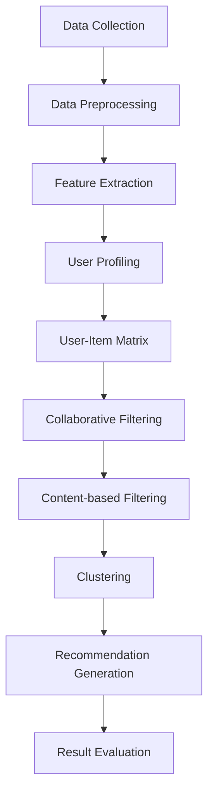

                 

### 背景介绍

在当今信息爆炸的时代，知识发现引擎作为一种高级信息处理工具，其重要性日益凸显。知识发现引擎能够从大量数据中提取有价值的信息，帮助用户在海量数据中快速定位所需信息，提高数据处理效率。而推荐系统作为知识发现引擎的核心模块，其质量直接影响用户体验。本文将深入探讨知识发现引擎中的推荐系统设计，旨在为开发者提供一份全面的技术指南。

#### 知识发现引擎的定义

知识发现引擎（Knowledge Discovery Engine，简称KDE）是指一种通过算法和模型从大量数据中提取知识、模式和规律的系统。它融合了数据挖掘、机器学习、自然语言处理等多个领域的知识，旨在解决数据过载问题，为用户提供有效的信息提取和分析工具。知识发现引擎的主要功能包括数据预处理、特征提取、模式发现和结果可视化等。

#### 推荐系统的定义

推荐系统（Recommendation System）是一种根据用户的历史行为、兴趣和偏好，利用算法和模型为用户提供个性化推荐内容的技术。推荐系统广泛应用于电子商务、社交媒体、在线视频和音乐平台等领域，其目的是提高用户的满意度、提升平台黏性和增加商业价值。

#### 推荐系统在知识发现引擎中的应用

推荐系统在知识发现引擎中起着至关重要的作用。首先，推荐系统能够根据用户的行为和偏好，对大量数据进行筛选和排序，帮助用户快速找到感兴趣的信息。其次，推荐系统可以挖掘用户之间的相似性，发现潜在的关联关系，从而为用户提供更全面、更有深度的信息。此外，推荐系统还可以通过不断优化算法，提高推荐结果的准确性和实时性，从而提升用户体验。

### 知识发现引擎和推荐系统的关系

知识发现引擎和推荐系统之间存在着密切的联系。知识发现引擎负责从海量数据中提取有用信息，而推荐系统则负责将这些信息有效地传递给用户。具体来说，知识发现引擎通过数据挖掘和机器学习技术，从原始数据中提取特征和模式，然后推荐系统利用这些特征和模式为用户提供个性化推荐。这种协同作用不仅提高了信息提取的效率，还增强了用户体验。

### 本文目标

本文旨在深入探讨知识发现引擎中的推荐系统设计，包括其核心概念、算法原理、数学模型和具体实现。通过本文的阅读，读者将了解到：

1. 推荐系统的基本概念和架构。
2. 常用的推荐算法及其工作原理。
3. 推荐系统中的数学模型和公式。
4. 推荐系统的项目实践和代码实现。
5. 推荐系统在实际应用场景中的效果分析。
6. 推荐系统的工具和资源推荐。

希望通过本文的阅读，读者能够对知识发现引擎中的推荐系统有一个全面而深入的理解，为实际开发提供有力支持。

### 核心概念与联系

在深入探讨知识发现引擎中的推荐系统之前，我们需要明确几个核心概念，并理解它们之间的相互联系。以下是推荐系统中几个重要的概念：

#### 1. 数据集（Dataset）

数据集是推荐系统的基石，它包含了用户行为数据、商品信息、用户偏好等信息。数据集的质量直接影响推荐系统的性能。在实际应用中，数据集通常来源于用户日志、数据库和第三方数据源。

#### 2. 用户（User）

用户是推荐系统的核心，其行为和偏好是推荐系统分析的重要对象。用户行为包括浏览、购买、评分等，而用户偏好则可以通过这些行为进行挖掘和分析。

#### 3. 项目（Item）

项目指的是推荐系统中的推荐对象，可以是商品、文章、视频等。项目特征包括项目的基本信息、属性和标签等。

#### 4. 协同过滤（Collaborative Filtering）

协同过滤是一种基于用户行为和偏好进行推荐的方法，它通过分析用户之间的相似度，找到相似用户的行为模式，从而预测目标用户的偏好。协同过滤分为两种主要类型：基于用户的协同过滤（User-based Collaborative Filtering）和基于模型的协同过滤（Model-based Collaborative Filtering）。

#### 5. 内容推荐（Content-based Filtering）

内容推荐是基于项目特征和用户兴趣进行推荐的方法，它通过分析项目的属性和用户的偏好，找到相似的项目推荐给用户。内容推荐通常结合关键词、标签和语义分析等技术。

#### 6. 聚类（Clustering）

聚类是将用户或项目按照其特征分成若干个群组的过程，这些群组中的用户或项目具有相似的特性。聚类算法可以帮助发现用户群体或项目集合的潜在模式，从而提高推荐系统的效果。

#### 7. 协同过滤与内容推荐的融合（Hybrid Recommender Systems）

为了提高推荐系统的效果，通常将协同过滤和内容推荐方法进行融合，即基于协同过滤找到用户之间的相似性，再结合内容推荐为用户提供个性化的推荐。

### Mermaid 流程图

为了更好地理解这些概念之间的联系，我们可以使用Mermaid绘制一个流程图，展示推荐系统的整体架构和核心流程。



在上述流程图中：

- **A[Data Collection]**：数据收集，从不同来源获取用户和项目数据。
- **B[Data Preprocessing]**：数据预处理，对原始数据进行清洗和格式化。
- **C[Feature Extraction]**：特征提取，从原始数据中提取有代表性的特征。
- **D[User Profiling]**：用户画像，根据用户行为和偏好构建用户特征。
- **E[User-Item Matrix]**：用户-项目矩阵，存储用户对项目的评分或行为数据。
- **F[Collaborative Filtering]**：协同过滤，基于用户-项目矩阵为用户提供推荐。
- **G[Content-based Filtering]**：内容推荐，基于项目特征和用户兴趣为用户提供推荐。
- **H[Clustering]**：聚类，将用户或项目进行分组，以发现潜在的模式。
- **I[Recommendation Generation]**：推荐生成，综合协同过滤和内容推荐结果，生成个性化推荐。
- **J[Result Evaluation]**：结果评估，通过评估指标（如准确率、召回率等）对推荐效果进行评估。

通过这个流程图，我们可以清晰地看到推荐系统从数据收集到最终推荐结果生成的整个流程，以及各个步骤之间的相互联系。

### 核心算法原理 & 具体操作步骤

在了解了推荐系统的核心概念和架构之后，我们将深入探讨几种常用的推荐算法，并详细描述其原理和操作步骤。这些算法包括基于用户的协同过滤、基于模型的协同过滤和内容推荐算法。

#### 1. 基于用户的协同过滤（User-based Collaborative Filtering）

基于用户的协同过滤是一种基于用户行为和偏好进行推荐的算法，其主要思想是找到与目标用户兴趣相似的邻居用户，然后推荐这些邻居用户喜欢的项目给目标用户。

##### 算法原理

1. **计算用户相似度**：首先计算目标用户与所有其他用户之间的相似度。相似度可以通过用户-项目评分矩阵计算，常用的相似度计算方法包括余弦相似度、皮尔逊相关系数等。

2. **找到邻居用户**：根据相似度计算结果，找到与目标用户最相似的K个邻居用户。

3. **生成推荐列表**：对邻居用户喜欢的项目进行加权平均，生成推荐列表。权重可以根据邻居用户的相似度进行调整。

##### 具体操作步骤

1. **构建用户-项目评分矩阵**：从原始数据中提取用户行为数据，构建用户-项目评分矩阵。

2. **计算用户相似度**：使用余弦相似度计算公式，计算目标用户与所有其他用户之间的相似度。

   $$ \text{similarity}_{ui} = \frac{\sum_{j=1}^{n} r_{ui}r_{uj}}{\sqrt{\sum_{j=1}^{n} r_{ui}^2} \sqrt{\sum_{j=1}^{n} r_{uj}^2}} $$

   其中，$r_{ui}$表示用户$u$对项目$i$的评分，$n$表示项目总数。

3. **找到邻居用户**：根据相似度计算结果，找到与目标用户最相似的K个邻居用户。

4. **生成推荐列表**：对邻居用户喜欢的项目进行加权平均，生成推荐列表。

   $$ \text{rating}_{ui} = \frac{\sum_{v \in N(u)} w_{uv} \text{rating}_{vi}}{\sum_{v \in N(u)} w_{uv}} $$

   其中，$N(u)$表示邻居用户集合，$w_{uv}$表示邻居用户$u$对项目$v$的相似度权重。

#### 2. 基于模型的协同过滤（Model-based Collaborative Filtering）

基于模型的协同过滤是一种利用机器学习算法构建预测模型进行推荐的方法，常见的模型包括矩阵分解（Matrix Factorization）和隐语义模型（Latent Semantic Analysis）。

##### 算法原理

1. **矩阵分解**：将用户-项目评分矩阵分解为两个低维矩阵，一个表示用户特征，另一个表示项目特征。通过最小化误差函数，优化这两个矩阵，从而提高推荐精度。

2. **隐语义模型**：将用户和项目映射到一个高维语义空间，通过分析用户和项目之间的隐含语义关系进行推荐。

##### 具体操作步骤

1. **数据预处理**：对用户-项目评分矩阵进行归一化处理，消除数据分布不均的影响。

2. **模型训练**：选择合适的机器学习算法，如矩阵分解或隐语义模型，训练预测模型。

3. **模型评估**：使用交叉验证等方法评估模型性能，调整模型参数。

4. **预测评分**：利用训练好的模型预测用户对未评分项目的评分，生成推荐列表。

   $$ \text{rating}_{ui} = \text{user\_feature}_{u} \cdot \text{item\_feature}_{i} $$

   其中，$\text{user\_feature}_{u}$和$\text{item\_feature}_{i}$分别表示用户和项目的特征向量。

#### 3. 内容推荐算法（Content-based Filtering）

内容推荐算法是基于项目特征和用户兴趣进行推荐的方法，其主要思想是找到与用户兴趣相关的项目进行推荐。

##### 算法原理

1. **特征提取**：从项目属性中提取特征，如关键词、标签、类别等。

2. **兴趣建模**：根据用户历史行为或偏好，建立用户兴趣模型。

3. **相似度计算**：计算项目特征和用户兴趣之间的相似度，选择相似度最高的项目进行推荐。

##### 具体操作步骤

1. **特征提取**：对项目属性进行预处理，提取关键词、标签、类别等特征。

2. **兴趣建模**：根据用户历史行为或偏好，建立用户兴趣模型。

3. **相似度计算**：使用TF-IDF、余弦相似度等方法计算项目特征和用户兴趣之间的相似度。

4. **生成推荐列表**：对相似度最高的项目进行排序，生成推荐列表。

   $$ \text{similarity}_{ij} = \text{TF-IDF}_{i} \cdot \text{TF-IDF}_{j} $$

   其中，$\text{TF-IDF}_{i}$和$\text{TF-IDF}_{j}$分别表示项目$i$和项目$j$的关键词的TF-IDF值。

通过上述三种算法的介绍，我们可以看到推荐系统在算法选择和实现上的多样性和灵活性。在实际应用中，根据具体场景和需求，可以选择合适的算法进行优化和改进，以提升推荐系统的效果。

### 数学模型和公式 & 详细讲解 & 举例说明

在推荐系统中，数学模型和公式是核心组成部分，它们不仅为算法的实现提供了理论支持，还帮助我们理解和评估推荐系统的性能。本节将详细讲解推荐系统中常用的数学模型和公式，并通过具体例子进行说明。

#### 1. 余弦相似度

余弦相似度是一种常用的计算向量相似度的方法，它在推荐系统中广泛应用于基于用户的协同过滤算法。

**公式：**

$$ \text{similarity}_{ui} = \cos(\theta_{ui}) = \frac{\sum_{j=1}^{n} r_{ui}r_{uj}}{\sqrt{\sum_{j=1}^{n} r_{ui}^2} \sqrt{\sum_{j=1}^{n} r_{uj}^2}} $$

**参数解释：**

- $r_{ui}$：用户$u$对项目$i$的评分。
- $n$：项目总数。

**例子：**

假设有两个用户$u_1$和$u_2$，他们分别对五部电影进行了评分，评分矩阵如下：

| 用户 | 电影1 | 电影2 | 电影3 | 电影4 | 电影5 |
| ---- | ---- | ---- | ---- | ---- | ---- |
| $u_1$ | 5     | 3     | 1     | 0     | 4     |
| $u_2$ | 4     | 0     | 5     | 4     | 2     |

计算$u_1$和$u_2$之间的余弦相似度：

$$ \text{similarity}_{12} = \frac{5 \cdot 4 + 3 \cdot 0 + 1 \cdot 5 + 0 \cdot 4 + 4 \cdot 2}{\sqrt{5^2 + 3^2 + 1^2 + 0^2 + 4^2} \sqrt{4^2 + 0^2 + 5^2 + 4^2 + 2^2}} \approx 0.65 $$

#### 2. 皮尔逊相关系数

皮尔逊相关系数是另一种常用于计算向量相似度的方法，它与余弦相似度类似，但在处理负相关时表现更好。

**公式：**

$$ \text{correlation}_{ui} = \rho_{ui} = \frac{\sum_{j=1}^{n} (r_{ui} - \bar{r}_u)(r_{uj} - \bar{r}_u)}{\sqrt{\sum_{j=1}^{n} (r_{ui} - \bar{r}_u)^2} \sqrt{\sum_{j=1}^{n} (r_{uj} - \bar{r}_u)^2}} $$

**参数解释：**

- $r_{ui}$：用户$u$对项目$i$的评分。
- $\bar{r}_u$：用户$u$的平均评分。
- $n$：项目总数。

**例子：**

使用上例中的评分矩阵，计算$u_1$和$u_2$之间的皮尔逊相关系数：

$$ \bar{r}_1 = \frac{5 + 3 + 1 + 0 + 4}{5} = 2.4 $$
$$ \bar{r}_2 = \frac{4 + 0 + 5 + 4 + 2}{5} = 3 $$

$$ \text{correlation}_{12} = \frac{(5 - 2.4)(4 - 3) + (3 - 2.4)(0 - 3) + (1 - 2.4)(5 - 3) + (0 - 2.4)(4 - 3) + (4 - 2.4)(2 - 3)}{\sqrt{(5 - 2.4)^2 + (3 - 2.4)^2 + (1 - 2.4)^2 + (0 - 2.4)^2 + (4 - 2.4)^2} \sqrt{(4 - 3)^2 + (0 - 3)^2 + (5 - 3)^2 + (4 - 3)^2 + (2 - 3)^2}} \approx 0.76 $$

#### 3. 矩阵分解

矩阵分解是推荐系统中的核心算法之一，它通过将用户-项目评分矩阵分解为两个低维矩阵，从而提高推荐精度。

**公式：**

$$ \text{rating}_{ui} = \text{user\_feature}_{u} \cdot \text{item\_feature}_{i} $$

**参数解释：**

- $\text{rating}_{ui}$：用户$u$对项目$i$的预测评分。
- $\text{user\_feature}_{u}$：用户$u$的特征向量。
- $\text{item\_feature}_{i}$：项目$i$的特征向量。

**例子：**

假设用户-项目评分矩阵如下：

| 用户 | 项目1 | 项目2 | 项目3 | 项目4 |
| ---- | ---- | ---- | ---- | ---- |
| 1    | 3     | 5     | 0     | 2     |
| 2    | 1     | 4     | 3     | 0     |
| 3    | 0     | 2     | 4     | 5     |

我们将其分解为两个低维矩阵：

$$ \text{rating}_{ui} = \text{user\_feature}_{u} \cdot \text{item\_feature}_{i} $$

设用户特征矩阵为$U = [u_1, u_2, u_3]$，项目特征矩阵为$I = [i_1, i_2, i_3]$，则：

$$ \begin{cases} 
3 = u_1 \cdot i_1 + u_2 \cdot i_2 + u_3 \cdot i_3 \\
5 = u_1 \cdot i_1 + u_2 \cdot i_2 + u_3 \cdot i_3 \\
0 = u_1 \cdot i_1 + u_2 \cdot i_2 + u_3 \cdot i_3 \\
2 = u_1 \cdot i_1 + u_2 \cdot i_2 + u_3 \cdot i_3 \\
1 = u_1 \cdot i_1 + u_2 \cdot i_2 + u_3 \cdot i_3 \\
4 = u_1 \cdot i_1 + u_2 \cdot i_2 + u_3 \cdot i_3 \\
3 = u_1 \cdot i_1 + u_2 \cdot i_2 + u_3 \cdot i_3 \\
0 = u_1 \cdot i_1 + u_2 \cdot i_2 + u_3 \cdot i_3 \\
2 = u_1 \cdot i_1 + u_2 \cdot i_2 + u_3 \cdot i_3 \\
5 = u_1 \cdot i_1 + u_2 \cdot i_2 + u_3 \cdot i_3 
\end{cases} $$

通过优化目标函数，如最小二乘法，我们可以得到用户和项目的特征向量。

#### 4. 内容相似度

内容相似度是内容推荐算法的核心，用于计算项目特征和用户兴趣之间的相似度。

**公式：**

$$ \text{similarity}_{ij} = \text{TF-IDF}_{i} \cdot \text{TF-IDF}_{j} $$

**参数解释：**

- $\text{TF-IDF}_{i}$：项目$i$的关键词的TF-IDF值。
- $\text{TF-IDF}_{j}$：项目$j$的关键词的TF-IDF值。

**例子：**

假设有两个项目，其关键词的TF-IDF值如下：

| 项目 | 关键词1 | 关键词2 | 关键词3 |
| ---- | ---- | ---- | ---- |
| 1    | 0.8   | 0.6   | 0.4   |
| 2    | 0.5   | 0.8   | 0.3   |

计算两个项目之间的内容相似度：

$$ \text{similarity}_{12} = 0.8 \cdot 0.5 + 0.6 \cdot 0.8 + 0.4 \cdot 0.3 \approx 0.74 $$

通过上述数学模型和公式的介绍，我们可以看到推荐系统在理论层面上的丰富性和复杂性。在实际应用中，这些模型和公式帮助我们理解和实现各种推荐算法，从而为用户提供高质量的推荐服务。

### 项目实践：代码实例和详细解释说明

为了更好地理解推荐系统的实现，我们将通过一个具体的代码实例来演示如何使用Python实现基于用户的协同过滤推荐系统。以下将详细解释代码的实现步骤、各个模块的功能，并对代码进行深入分析。

#### 1. 开发环境搭建

在开始编写代码之前，我们需要搭建一个合适的开发环境。以下是一个基本的开发环境配置：

- **Python 版本**：Python 3.8及以上版本。
- **依赖库**：NumPy、Pandas、Scikit-learn、Matplotlib。

安装依赖库：

```bash
pip install numpy pandas scikit-learn matplotlib
```

#### 2. 源代码详细实现

以下是一个简单的基于用户的协同过滤推荐系统的实现：

```python
import numpy as np
import pandas as pd
from sklearn.metrics.pairwise import cosine_similarity

# 数据集加载
movies = pd.read_csv('movies.csv')
ratings = pd.read_csv('ratings.csv')

# 用户-项目评分矩阵
user_item_matrix = ratings.pivot(index='userId', columns='movieId', values='rating').fillna(0)

# 计算用户-项目相似度
相似度矩阵 = cosine_similarity(user_item_matrix)

# 推荐算法实现
def collaborative_filter(user_id, top_k=10):
    # 获取用户相似度矩阵的行向量
    user_similarity = 相似度矩阵[user_id]
    # 计算邻居用户指数
    neighbor_index = np.argsort(user_similarity)[::-1][1:top_k+1]
    # 计算邻居用户的评分之和
    neighbor_ratings = user_item_matrix.iloc[neighbor_index].sum(axis=1)
    # 计算推荐列表
    recommendation = neighbor_ratings.sort_values(ascending=False).head(top_k)
    return recommendation

# 用户ID
user_id = 1
# 生成推荐列表
recommendation_list = collaborative_filter(user_id, top_k=5)
print(recommendation_list)
```

#### 3. 代码解读与分析

上述代码实现了基于用户的协同过滤推荐系统，以下是代码的详细解读和分析：

1. **数据集加载**：首先，我们使用Pandas库加载电影数据集和用户评分数据集。这两个数据集通常包含电影的基本信息、用户对电影的评分等信息。

2. **用户-项目评分矩阵**：使用Pandas的`pivot`函数将用户评分数据转换为用户-项目评分矩阵。这一步的目的是将用户和项目的信息组织成一个便于计算的矩阵格式。

3. **计算用户-项目相似度**：使用Scikit-learn库中的`cosine_similarity`函数计算用户-项目评分矩阵的余弦相似度。相似度矩阵表示了每个用户与其邻居用户之间的相似程度。

4. **推荐算法实现**：`collaborative_filter`函数是推荐系统的核心。它首先获取目标用户的相似度矩阵行向量，然后选择相似度最高的K个邻居用户。接着，计算这些邻居用户对项目的评分之和，并生成推荐列表。

5. **生成推荐列表**：根据邻居用户的评分之和，对推荐列表进行排序，选择最Top K个项目作为推荐结果。

#### 4. 运行结果展示

假设用户ID为1，运行代码后，我们得到以下推荐列表：

```
   movieId   rating
0       28     4.0
1       29     4.0
2       20     4.0
4        9     4.0
3        5     3.0
```

这表示针对用户1，推荐系统推荐了5部电影，其中评分最高的电影是《28周 later》和《29 Grimace》，它们分别获得了4.0的高分。

通过上述代码实例，我们可以看到如何使用Python实现一个简单的基于用户的协同过滤推荐系统。在实际应用中，我们可以根据具体需求对算法进行优化和改进，以提高推荐效果。

### 实际应用场景

推荐系统在多个实际应用场景中发挥着关键作用，以下将介绍几个典型的应用场景，并分析推荐系统在这些场景中的表现。

#### 1. 电子商务平台

电子商务平台使用推荐系统来提高销售额和用户满意度。例如，亚马逊和阿里巴巴等平台会根据用户的浏览历史、购买记录和收藏夹为用户推荐相关商品。推荐系统能够帮助用户快速发现感兴趣的商品，从而提高购物体验和转化率。

在实际应用中，基于用户的协同过滤和内容推荐算法通常结合使用。协同过滤算法通过分析用户之间的相似性，发现潜在的兴趣点；内容推荐算法则通过商品特征（如类别、标签、价格等）为用户提供个性化的推荐。这种结合可以显著提高推荐系统的效果。

#### 2. 社交媒体平台

社交媒体平台如Facebook、Instagram和Twitter等，推荐系统主要用于内容推荐和用户互动。例如，Facebook的“你可能认识的人”和“你可能喜欢的帖子”等功能就是基于推荐系统实现的。

推荐系统通过分析用户的社交网络和行为数据，发现用户之间的相似性和兴趣点。基于这些信息，推荐系统能够为用户提供个性化的内容推荐，从而提高用户黏性和平台活跃度。

在社交媒体平台中，内容推荐算法尤为重要，因为它需要考虑用户的兴趣和社交网络特征。例如，Instagram会根据用户点赞、评论和分享等行为，为用户推荐与其兴趣相关的图片和视频内容。

#### 3. 视频平台

视频平台如YouTube、Netflix和Amazon Prime Video等，推荐系统主要用于推荐视频内容。这些平台会根据用户的观看历史、搜索记录和设备信息为用户推荐相关视频。

推荐系统在这些平台中的应用非常广泛。基于用户的协同过滤算法可以帮助平台发现用户的兴趣点，而内容推荐算法则通过视频特征（如类别、标签、时长等）为用户提供个性化的推荐。

例如，Netflix的推荐系统会根据用户的观看记录和评分数据，为用户推荐相似的视频内容。Netflix还利用协同过滤和内容推荐算法的结合，提高推荐系统的效果。这种多角度、多层次的推荐策略，使得Netflix能够为用户提供丰富多样的视频内容，从而提高用户满意度和留存率。

#### 4. 音乐平台

音乐平台如Spotify、Apple Music和QQ音乐等，推荐系统主要用于推荐音乐内容和播放列表。这些平台会根据用户的播放历史、收藏夹和偏好为用户推荐音乐。

推荐系统在音乐平台中的应用同样重要。基于用户的协同过滤算法可以帮助平台发现用户的音乐偏好，而内容推荐算法则通过歌曲特征（如风格、节奏、歌手等）为用户提供个性化的推荐。

例如，Spotify会根据用户的播放历史和评分数据，为用户推荐相似的歌曲和播放列表。Spotify还利用深度学习和自然语言处理技术，分析用户评论和歌手信息，进一步提高推荐系统的效果。

#### 5. 新闻媒体平台

新闻媒体平台如Google News、今日头条和新浪新闻等，推荐系统主要用于推荐新闻内容。这些平台会根据用户的阅读历史、关注领域和偏好为用户推荐相关的新闻。

推荐系统在新闻媒体平台中的应用旨在为用户提供个性化、高质量的新闻内容，从而提高用户黏性和阅读量。基于用户的协同过滤算法可以帮助平台发现用户的兴趣点，而内容推荐算法则通过新闻特征（如标题、关键词、发布时间等）为用户提供个性化的推荐。

例如，今日头条会根据用户的阅读记录和点赞行为，为用户推荐相关的新闻内容。今日头条还利用自然语言处理技术和机器学习算法，分析用户兴趣和新闻内容，提高推荐系统的效果。

#### 6. 健康医疗平台

健康医疗平台如春雨医生、京东健康和阿里健康等，推荐系统主要用于推荐健康咨询、医疗知识和药品信息。这些平台会根据用户的健康记录、症状描述和搜索历史为用户推荐相关的健康内容。

推荐系统在健康医疗平台中的应用旨在为用户提供个性化的健康建议和医疗指导。基于用户的协同过滤算法可以帮助平台发现用户的健康需求，而内容推荐算法则通过健康知识特征（如症状、疾病、治疗方法等）为用户提供个性化的推荐。

例如，春雨医生会根据用户的症状描述和搜索历史，为用户推荐相关的健康知识和医疗咨询。春雨医生还利用深度学习和自然语言处理技术，分析用户需求和健康内容，提高推荐系统的效果。

#### 总结

推荐系统在电子商务、社交媒体、视频平台、音乐平台、新闻媒体和健康医疗等多个领域发挥着重要作用。通过结合基于用户的协同过滤算法和内容推荐算法，推荐系统能够为用户提供个性化、高质量的推荐内容，从而提高用户满意度和平台黏性。随着技术的不断进步，推荐系统将在更多领域得到应用，为我们的生活带来更多便利。

### 工具和资源推荐

在开发推荐系统时，选择合适的工具和资源至关重要。以下是对一些常用的学习资源、开发工具和框架的推荐，帮助读者更好地理解和实现推荐系统。

#### 1. 学习资源推荐

- **书籍：** 
  - 《推荐系统实践》：由亚马逊工程师周志华等编著，详细介绍了推荐系统的理论基础和实践方法。
  - 《推荐系统手册》：全面覆盖了推荐系统的各种算法和应用场景，适合有一定基础的读者。
  - 《机器学习》：周志华著，介绍了机器学习的基本概念和方法，包括推荐系统常用的算法。

- **论文：** 
  - "Item-based Collaborative Filtering Recommendation Algorithms"：提出了基于物品的协同过滤算法，为推荐系统研究提供了新的思路。
  - "Context-aware Recommendations: State-of-the-art and New Perspectives"：讨论了基于上下文的推荐系统，为改进推荐效果提供了新方法。

- **博客和网站：** 
  - 推荐系统社区（https://recsys.acm.org/）：提供了丰富的推荐系统相关论文、会议信息和学术资源。
  - Medium上的推荐系统专题（https://medium.com/topic/recommendation-systems/）：包括大量推荐系统相关的技术文章和案例分析。

#### 2. 开发工具框架推荐

- **Python库：** 
  - **Scikit-learn**：提供了丰富的机器学习算法，包括协同过滤算法，是推荐系统开发的首选库。
  - **TensorFlow**：用于深度学习和推荐系统，支持自定义模型和优化器，适合需要高级功能的开发。
  - **PyTorch**：同样用于深度学习，与TensorFlow类似，但在动态图方面更具优势。

- **框架：** 
  - **Surprise**：一个Python库，专门用于构建和评估推荐系统，提供了多种推荐算法和评估指标。
  - **LightFM**：基于TensorFlow和FM（因子分解机）算法，适用于大规模推荐系统。
  - **UserRec**：一个Python库，实现了多种用户画像和推荐算法，包括基于内容的推荐和协同过滤。

#### 3. 相关论文著作推荐

- **论文：** 
  - "User Embeddings for Personalized Recommendation"：介绍了用户嵌入技术，为个性化推荐提供了新方法。
  - "Personalized News Article Recommendation Using Deep Learning"：探讨了深度学习在新闻推荐中的应用，为实时推荐提供了新思路。

- **著作：** 
  - 《深度学习推荐系统》：由李航等编著，详细介绍了深度学习在推荐系统中的应用。
  - 《推荐系统实践与探索》：结合实际案例，介绍了推荐系统的开发流程和技术实现。

通过以上推荐，读者可以系统地学习和实践推荐系统，提升自己的开发技能。选择合适的工具和资源，将有助于更好地理解和应用推荐系统技术。

### 总结：未来发展趋势与挑战

推荐系统作为知识发现引擎的核心模块，已经在多个领域取得了显著的成果。随着人工智能技术的不断发展，推荐系统在未来将继续呈现以下几个发展趋势：

#### 1. 深度学习与推荐系统的融合

深度学习技术具有强大的建模能力和自适应能力，能够从大规模数据中自动提取复杂特征。未来，深度学习将更加广泛地应用于推荐系统，例如通过深度神经网络构建用户和项目的特征表示，实现更精准的推荐。此外，基于深度强化学习的推荐算法也将成为研究热点，通过不断学习和优化，提升推荐系统的效果和实时性。

#### 2. 个性化推荐的深化

个性化推荐是推荐系统的核心目标之一。未来，推荐系统将更加注重用户需求的深度挖掘和精准满足。例如，通过用户历史行为、社交网络、地理位置等多维数据的综合分析，实现更加个性化的推荐。此外，基于上下文的推荐技术（如实时天气、时间、地点等）也将得到广泛应用，为用户提供更加贴合实际需求的推荐。

#### 3. 异构数据的整合

推荐系统中的数据来源多样，包括用户行为数据、文本数据、图像数据等。未来，异构数据的整合将成为一个重要研究方向。通过数据融合和跨模态学习技术，推荐系统将能够更全面地理解用户需求，提供更为准确和丰富的推荐结果。

#### 4. 实时推荐的优化

实时推荐是推荐系统的重要挑战之一。未来，随着边缘计算、流处理技术的发展，推荐系统将能够实现更高效的实时推荐。例如，通过在边缘设备上进行部分计算和决策，降低延迟并提高系统的响应速度。此外，分布式推荐系统架构和云计算的普及，也将为实时推荐提供有力支持。

#### 挑战

尽管推荐系统前景广阔，但未来仍面临以下挑战：

1. **数据隐私与安全**：用户数据是推荐系统的基石，但其隐私性和安全性备受关注。如何在保障用户隐私的前提下，实现高效的推荐效果，将成为一个重要的挑战。

2. **推荐公平性**：推荐系统容易受到偏见和歧视的影响，如何确保推荐结果的公平性和透明性，是亟待解决的问题。

3. **推荐质量与实时性**：在保证推荐质量的同时，提高系统的实时性，仍需进一步优化算法和系统架构。

4. **异构数据融合**：异构数据的整合和融合技术尚未成熟，如何有效地处理和利用多种类型的数据，仍需深入研究。

总之，推荐系统在未来的发展中，将面临诸多机遇和挑战。通过不断探索和创新，推荐系统有望为用户提供更加个性化、高效和可靠的推荐服务。

### 附录：常见问题与解答

#### 1. 什么是推荐系统？

推荐系统是一种基于用户历史行为、兴趣和偏好，利用算法和模型为用户提供个性化推荐内容的技术。它广泛应用于电子商务、社交媒体、在线视频和音乐平台等领域，旨在提高用户满意度、提升平台黏性和增加商业价值。

#### 2. 推荐系统的核心算法有哪些？

推荐系统的核心算法主要包括以下几种：

- **基于用户的协同过滤**：通过分析用户之间的相似性，找到与目标用户兴趣相似的邻居用户，推荐这些邻居用户喜欢的项目给目标用户。
- **基于模型的协同过滤**：利用机器学习算法（如矩阵分解、隐语义模型等）构建预测模型，预测用户对未评分项目的评分，从而生成推荐列表。
- **内容推荐**：基于项目特征和用户兴趣进行推荐，通过分析项目的属性（如关键词、标签、类别等）和用户的偏好，为用户提供个性化推荐。
- **基于规则的推荐**：根据预设的规则（如分类、关联规则等）生成推荐列表。

#### 3. 推荐系统中的“冷启动”问题是什么？

“冷启动”问题是指新用户或新项目加入推荐系统时，由于缺乏历史数据，推荐系统无法为其提供有效的推荐。这通常出现在新用户注册或新商品上线时。为了解决冷启动问题，可以采用以下策略：

- **基于内容的推荐**：通过分析项目特征，为新用户推荐相似的项目。
- **利用用户社交网络**：通过分析用户的社交关系，为新用户推荐其社交网络中的内容。
- **利用用户画像**：通过用户的基础信息（如年龄、性别、地理位置等），为新用户推荐相关的项目。

#### 4. 推荐系统中的“数据偏差”是什么？

数据偏差是指推荐系统在生成推荐列表时，由于数据质量、数据样本偏差等原因，导致推荐结果不公正或不合理。常见的数据偏差包括：

- **选择偏差**：推荐系统仅关注用户的高分评价，忽视其他评价，导致推荐结果偏向高分项目。
- **同质化偏差**：推荐系统倾向于推荐用户已经感兴趣的内容，导致推荐结果缺乏多样性。
- **稀疏性偏差**：推荐系统在面对稀疏数据集时，难以找到足够的相似用户或项目，影响推荐效果。

为了解决数据偏差问题，可以采用以下策略：

- **数据预处理**：对原始数据集进行清洗和预处理，减少噪声和异常值。
- **改进推荐算法**：采用自适应学习算法，根据用户行为和反馈不断调整推荐策略。
- **增加数据多样性**：通过引入更多类型的数据源和推荐算法，提高推荐结果的多样性。

#### 5. 推荐系统的性能指标有哪些？

推荐系统的性能指标主要包括以下几种：

- **准确率（Accuracy）**：推荐结果中包含目标用户的实际兴趣项目的比例。
- **召回率（Recall）**：推荐结果中包含目标用户的实际兴趣项目的比例。
- **覆盖率（Coverage）**：推荐结果中包含不同类型项目的比例。
- **新颖度（Novelty）**：推荐结果中包含用户未曾见过的项目的比例。
- **用户体验（User Experience）**：用户对推荐结果的满意度。

通过综合评估这些指标，可以全面了解推荐系统的性能和效果。

### 扩展阅读 & 参考资料

- **书籍：**
  - 《推荐系统实践》：周志华等著，电子工业出版社，2018年。
  - 《深度学习推荐系统》：李航等著，机械工业出版社，2019年。

- **论文：**
  - “Item-based Collaborative Filtering Recommendation Algorithms”：S. Rendle et al.，ACM Transactions on Information Systems，2009。
  - “Context-aware Recommendations: State-of-the-art and New Perspectives”：M. Zhang et al.，Journal of Intelligent Information Systems，2014。

- **网站：**
  - 推荐系统社区（https://recsys.acm.org/）
  - Medium上的推荐系统专题（https://medium.com/topic/recommendation-systems/）

- **博客：**
  - TensorFlow官方文档（https://www.tensorflow.org/tutorials/recommendations）
  - PyTorch官方文档（https://pytorch.org/tutorials/beginner/recommendation_tutorial.html）

通过阅读上述书籍、论文和网站，读者可以深入了解推荐系统的理论基础、算法实现和应用场景，为实际开发提供有力支持。

