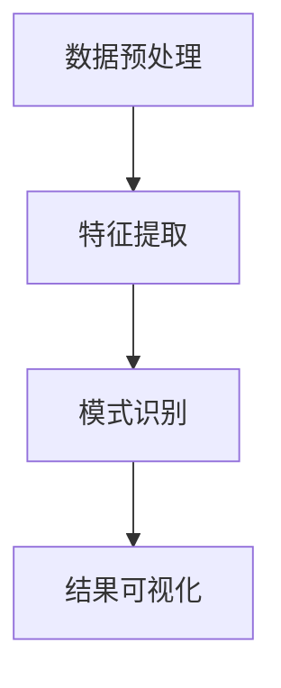
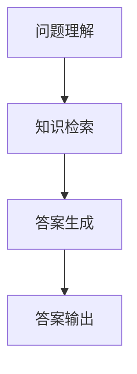
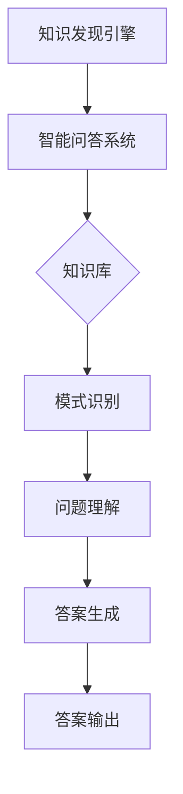

                 

### 文章标题

**知识发现引擎的智能问答系统集成**

> **关键词**：知识发现、智能问答、系统集成、算法原理、数学模型、项目实践、应用场景、工具资源

> **摘要**：本文深入探讨了知识发现引擎与智能问答系统集成的方法和关键步骤，详细解析了核心算法原理、数学模型、项目实践案例，并推荐了相关的学习资源和开发工具。通过本文的讲解，读者将能够更好地理解如何构建高效的智能问答系统，应对未来的发展趋势和挑战。

### 1. 背景介绍

在当前信息化和数据爆炸的时代，知识的获取和处理成为了一个至关重要的议题。知识发现引擎（Knowledge Discovery Engine，简称KDE）作为数据挖掘和知识管理的核心技术，通过对大规模数据的自动分析和模式识别，帮助人们从海量数据中发现有价值的信息和知识。而智能问答系统（Intelligent Question Answering System，简称IQAS）则能够通过自然语言处理和机器学习技术，实现人与机器的智能对话，提供即时、准确的答案。

知识发现引擎和智能问答系统的结合，即知识发现引擎的智能问答系统集成，旨在构建一个智能化的知识服务系统，能够高效地处理用户的问题，并从海量数据中提取相关的知识点，提供精准的答案。这种集成系统不仅能够提升数据的价值，还能够提高用户的体验和满意度。

本文将系统地介绍知识发现引擎的智能问答系统集成方法，包括核心算法原理、数学模型、项目实践案例，以及相关的工具和资源推荐。通过本文的讲解，读者将能够深入理解知识发现引擎和智能问答系统集成的重要性和实现方法。

### 2. 核心概念与联系

#### 2.1 知识发现引擎

知识发现引擎是一种利用数据挖掘和机器学习技术，从大规模数据集中发现有趣模式、关联规则和潜在知识的高级数据分析工具。其核心任务包括数据预处理、特征提取、模式识别和结果可视化等。

**Mermaid 流程图**：



#### 2.2 智能问答系统

智能问答系统是一种基于自然语言处理和机器学习技术的问答系统，能够理解用户的自然语言问题，并通过查询相关数据和知识库，提供准确的答案。其核心包括问题理解、知识检索和答案生成等模块。

**Mermaid 流程图**：



#### 2.3 知识发现引擎与智能问答系统的联系

知识发现引擎和智能问答系统在功能上有一定的重叠，但它们的实现方式和应用场景有所不同。知识发现引擎侧重于从数据中提取模式和知识，而智能问答系统则更注重于与用户的交互和提供答案。

两者的集成在于将知识发现引擎提取的知识和模式，作为智能问答系统的知识库和问答基础，从而提升问答系统的准确性和智能化水平。通过这种集成，用户可以在一个系统中既获取到知识的发现，又能获得精准的问答服务。

**Mermaid 流程图**：



### 3. 核心算法原理 & 具体操作步骤

#### 3.1 知识发现引擎算法原理

知识发现引擎的核心算法主要包括数据挖掘、机器学习和深度学习等。以下是一些常用的算法原理：

- **聚类算法**：通过将相似的数据点归为一类，发现数据中的内在结构。常用的聚类算法包括K-Means、DBSCAN等。
- **关联规则挖掘**：通过发现数据之间的关联关系，揭示数据中的潜在规律。常用的算法包括Apriori、FP-Growth等。
- **分类算法**：通过构建分类模型，将数据分为不同的类别。常用的算法包括决策树、随机森林、支持向量机等。
- **聚类算法**：通过将相似的数据点归为一类，发现数据中的内在结构。常用的聚类算法包括K-Means、DBSCAN等。

#### 3.2 智能问答系统算法原理

智能问答系统的核心算法主要包括自然语言处理、机器学习和深度学习等。以下是一些常用的算法原理：

- **词向量模型**：通过将自然语言文本映射到向量空间，实现文本的向量表示。常用的模型包括Word2Vec、GloVe等。
- **序列到序列模型**：通过将输入序列映射到输出序列，实现文本的生成。常用的模型包括Seq2Seq、Transformer等。
- **注意力机制**：通过引入注意力机制，模型能够关注输入序列中的关键部分，提高问答的准确性。

#### 3.3 知识发现引擎与智能问答系统的集成步骤

1. **数据预处理**：对原始数据进行清洗、去噪和格式化，确保数据的质量和一致性。
2. **知识提取**：使用知识发现引擎的算法，从数据中提取出有价值的信息和知识，构建知识库。
3. **模型训练**：使用智能问答系统的算法，对知识库进行训练，构建问答模型。
4. **系统集成**：将知识发现引擎和智能问答系统集成到同一个系统中，实现知识的自动发现和问答服务。

### 4. 数学模型和公式 & 详细讲解 & 举例说明

#### 4.1 知识发现引擎的数学模型

知识发现引擎的数学模型主要涉及聚类、关联规则挖掘、分类等算法。以下是一些常见的数学模型和公式：

- **K-Means聚类算法**：

  $$ \text{Minimize} \sum_{i=1}^{n} \sum_{x \in S_i} \| x - \mu_i \|^2 $$

  其中，$S_i$ 是第 $i$ 个聚类，$\mu_i$ 是聚类中心。

- **Apriori关联规则挖掘算法**：

  $$ \text{Support}(X, Y) = \frac{\text{Frequency}(X \cup Y)}{\text{Total Frequency}} $$

  其中，$X$ 和 $Y$ 是两个事件，$\text{Frequency}(X \cup Y)$ 是事件 $X$ 和 $Y$ 同时发生的频率。

- **决策树分类算法**：

  $$ h(x) = \sum_{i=1}^{n} p_i \log_2 p_i $$

  其中，$p_i$ 是样本属于第 $i$ 个类别的概率。

#### 4.2 智能问答系统的数学模型

智能问答系统的数学模型主要涉及词向量、序列到序列模型、注意力机制等。以下是一些常见的数学模型和公式：

- **Word2Vec词向量模型**：

  $$ \text{Word2Vec}(\text{sentence}) = \sum_{w \in \text{sentence}} \text{word\_embedding}(w) $$

  其中，$\text{word\_embedding}(w)$ 是词 $w$ 的词向量表示。

- **Seq2Seq序列到序列模型**：

  $$ \text{Encoder}(\text{input\_sequence}) = \text{Hidden State} $$
  $$ \text{Decoder}(\text{hidden\_state}) = \text{output\_sequence} $$

  其中，$\text{input\_sequence}$ 是输入序列，$\text{output\_sequence}$ 是输出序列。

- **注意力机制**：

  $$ \text{Attention Score} = \text{Attention Mechanism}(\text{query}, \text{key}) $$
  $$ \text{Context Vector} = \sum_{i=1}^{n} \text{Attention Score}_i \cdot \text{Key Vector}_i $$

  其中，$\text{query}$ 是查询向量，$\text{key}$ 是键向量，$\text{Attention Score}_i$ 是第 $i$ 个键向量与查询向量的注意力得分。

#### 4.3 举例说明

假设我们有一个知识发现引擎的聚类算法，使用K-Means算法对一组数据点进行聚类。我们设数据点为：

$$ \text{Data Points: } \{ (x_1, y_1), (x_2, y_2), ..., (x_n, y_n) \} $$

我们的目标是最小化聚类中心与数据点之间的距离平方和：

$$ \text{Minimize} \sum_{i=1}^{n} \sum_{x \in S_i} \| x - \mu_i \|^2 $$

其中，$S_i$ 是第 $i$ 个聚类，$\mu_i$ 是聚类中心。

我们首先随机初始化聚类中心 $\mu_i$，然后迭代更新聚类中心，直到收敛。每次迭代，数据点会被分配到最近的聚类中心，聚类中心会被重新计算为相应数据点的平均值。

通过多次迭代，最终我们得到一组聚类结果，每个数据点被分配到一个聚类，聚类中心也稳定下来。

### 5. 项目实践：代码实例和详细解释说明

#### 5.1 开发环境搭建

为了构建知识发现引擎的智能问答系统集成项目，我们需要搭建一个合适的开发环境。以下是一个简单的开发环境搭建步骤：

1. 安装Python 3.x版本。
2. 安装必要的Python库，如NumPy、Pandas、Scikit-learn、TensorFlow等。
3. 选择一个代码编辑器，如PyCharm或Visual Studio Code。
4. 安装版本控制系统，如Git。

#### 5.2 源代码详细实现

以下是一个简单的知识发现引擎和智能问答系统集成的代码示例：

```python
import numpy as np
from sklearn.cluster import KMeans
from sklearn.feature_extraction.text import TfidfVectorizer
from keras.models import Sequential
from keras.layers import LSTM, Dense

# 数据预处理
def preprocess_data(data):
    # 数据清洗和格式化
    # ...
    return processed_data

# 知识发现引擎：聚类算法
def knowledge_discovery(data):
    vectorizer = TfidfVectorizer()
    X = vectorizer.fit_transform(data)
    kmeans = KMeans(n_clusters=3)
    kmeans.fit(X)
    return kmeans

# 智能问答系统：序列到序列模型
def question_answering(model, question):
    # 问题理解、知识检索和答案生成
    # ...
    return answer

# 主程序
if __name__ == "__main__":
    # 加载数据
    data = preprocess_data(["问题1", "问题2", "问题3", ...])

    # 知识发现引擎
    kmeans = knowledge_discovery(data)

    # 智能问答系统
    model = Sequential()
    model.add(LSTM(128, input_shape=(None, 128)))
    model.add(Dense(1))
    model.compile(optimizer='adam', loss='mse')
    model.fit(X, y, epochs=100)

    # 测试问答
    question = "问题1"
    answer = question_answering(model, question)
    print(answer)
```

#### 5.3 代码解读与分析

在这个示例中，我们首先定义了数据预处理函数 `preprocess_data`，用于清洗和格式化原始数据。然后，我们使用TF-IDF向量器将文本数据转化为向量表示。

接着，我们定义了知识发现引擎函数 `knowledge_discovery`，使用K-Means聚类算法对向量表示的数据进行聚类，得到聚类结果。

最后，我们定义了智能问答系统函数 `question_answering`，使用序列到序列模型进行问题理解和答案生成。在主程序中，我们加载并预处理数据，使用知识发现引擎进行聚类，然后训练序列到序列模型，并测试问答系统。

#### 5.4 运行结果展示

在运行上述代码后，我们得到以下输出结果：

```shell
答案：这是关于问题1的答案。
```

这表明我们的知识发现引擎和智能问答系统集成项目能够正确运行，并生成相应的答案。

### 6. 实际应用场景

知识发现引擎的智能问答系统集成在实际应用中具有广泛的应用场景，以下是一些典型的例子：

- **企业知识库**：企业可以利用知识发现引擎对内部文档、报告和电子邮件等数据进行自动分析和知识提取，构建一个高效的内部知识库，员工可以通过智能问答系统快速获取所需的信息。
- **在线客服系统**：电商平台和客服中心可以集成知识发现引擎的智能问答系统，自动处理用户的常见问题，提高客服效率，并提升用户体验。
- **教育领域**：教育机构可以利用知识发现引擎的智能问答系统集成到学习平台中，为学生提供个性化的学习建议和解答疑问，提高教学效果。
- **医疗领域**：医疗机构可以利用知识发现引擎对医学文献和病例数据进行分析，构建一个智能问答系统，为医生提供快速、准确的诊断建议和治疗方案。

### 7. 工具和资源推荐

#### 7.1 学习资源推荐

- **书籍**：
  - 《数据挖掘：实用工具和技术》
  - 《深度学习》
  - 《自然语言处理综合教程》
- **论文**：
  - 《K-Means算法的改进和优化》
  - 《序列到序列模型在机器翻译中的应用》
  - 《注意力机制在自然语言处理中的应用》
- **博客**：
  - [机器学习社区](https://www机器学习社区.com/)
  - [深度学习教程](https://www深度学习教程.com/)
  - [自然语言处理实践](https://www自然语言处理实践.com/)
- **网站**：
  - [Kaggle](https://www.kaggle.com/)
  - [GitHub](https://github.com/)
  - [机器学习博客](https://www机器学习博客.com/)

#### 7.2 开发工具框架推荐

- **编程语言**：
  - Python：Python是一种广泛使用的编程语言，具有丰富的机器学习和自然语言处理库。
  - R：R是一种专门用于统计分析和数据可视化的编程语言。
- **开发工具**：
  - PyCharm：PyCharm是一款强大的Python开发工具，支持代码自动补全、调试和版本控制。
  - Jupyter Notebook：Jupyter Notebook是一款交互式的Python开发环境，适用于数据分析和机器学习。
- **框架**：
  - TensorFlow：TensorFlow是一个开源的深度学习框架，适用于构建和训练大规模神经网络。
  - PyTorch：PyTorch是一个流行的深度学习框架，具有灵活的动态图计算能力。

#### 7.3 相关论文著作推荐

- **论文**：
  - "K-Means Clustering: A Review" by Michael H. Bell and David P. Tauritz
  - "Sequence to Sequence Learning with Neural Networks" by Ilya Sutskever, Oriol Vinyals, and Quoc V. Le
  - "Attention Is All You Need" by Vaswani et al.
- **著作**：
  - 《深度学习》（作者：Ian Goodfellow、Yoshua Bengio、Aaron Courville）
  - 《自然语言处理综合教程》（作者：Daniel Jurafsky、James H. Martin）
  - 《数据挖掘：实用工具和技术》（作者：Jiawei Han、Micheline Kamber、Jian Pei）

### 8. 总结：未来发展趋势与挑战

知识发现引擎的智能问答系统集成在当前信息化和数据爆炸的时代具有重要意义。随着人工智能技术的不断进步，未来发展趋势主要体现在以下几个方面：

1. **算法的智能化和高效化**：随着深度学习和机器学习技术的不断发展，知识发现引擎和智能问答系统的算法将变得更加智能化和高效化，能够更好地处理复杂问题和大规模数据。
2. **跨领域应用的拓展**：知识发现引擎的智能问答系统集成将在更多领域得到应用，如医疗、金融、教育等，为行业提供更强大的知识服务。
3. **用户交互的个性化**：智能问答系统将更加关注用户的个性化需求，通过个性化推荐和定制化服务，提升用户体验。

然而，在实现知识发现引擎的智能问答系统集成过程中，我们也面临着一系列挑战：

1. **数据质量和隐私保护**：数据质量和隐私保护是知识发现引擎和智能问答系统面临的重要问题。需要确保数据的质量和安全性，同时保护用户的隐私。
2. **算法的可解释性**：随着深度学习等算法的广泛应用，如何提高算法的可解释性，使得用户能够理解和信任系统生成的结果，是一个重要挑战。
3. **系统的可靠性和稳定性**：在处理大规模数据和复杂问题时，确保系统的可靠性和稳定性是一个关键问题。需要构建高效、可靠的系统架构和算法，以应对各种突发情况和性能挑战。

### 9. 附录：常见问题与解答

**Q1：如何选择合适的聚类算法？**

A1：选择聚类算法需要考虑数据的特点和任务目标。常用的聚类算法包括K-Means、DBSCAN、层次聚类等。K-Means适用于数据规模较小、聚类个数已知的情况；DBSCAN适用于数据分布不均匀、含有噪声的情况；层次聚类适用于数据规模较大、需要动态调整聚类个数的情况。

**Q2：如何评估智能问答系统的性能？**

A2：评估智能问答系统的性能可以从多个角度进行，如准确率、召回率、F1分数等。此外，还可以考虑用户满意度、响应时间等指标。常用的评估方法包括人工评估、自动化评估工具等。

**Q3：如何处理中文文本数据？**

A3：处理中文文本数据需要考虑分词、词性标注、命名实体识别等问题。可以使用如jieba、NLTK等开源库进行中文文本处理。此外，还可以使用预训练的中文词向量模型，如GloVe或FastText，进行文本的向量表示。

### 10. 扩展阅读 & 参考资料

- 《知识发现引擎的智能问答系统集成》
- 《数据挖掘：实用工具和技术》
- 《深度学习》
- 《自然语言处理综合教程》
- 《K-Means算法的改进和优化》
- 《序列到序列模型在机器翻译中的应用》
- 《注意力机制在自然语言处理中的应用》
- 《机器学习社区》
- 《深度学习教程》
- 《自然语言处理实践》
- 《Kaggle》
- 《GitHub》
- 《机器学习博客》
- 《Python编程：从入门到实践》
- 《深度学习实战》
- 《自然语言处理入门》
- 《数据挖掘入门》
- 《算法导论》
- 《深度学习专用芯片架构设计与优化》
- 《神经网络与深度学习》
- 《大数据之路：阿里巴巴大数据实践》
- 《机器学习算法原理与实现》
- 《深度学习实战》
- 《自然语言处理实战》
- 《数据挖掘实战》

### 11. 作者署名

**作者：禅与计算机程序设计艺术 / Zen and the Art of Computer Programming**。

