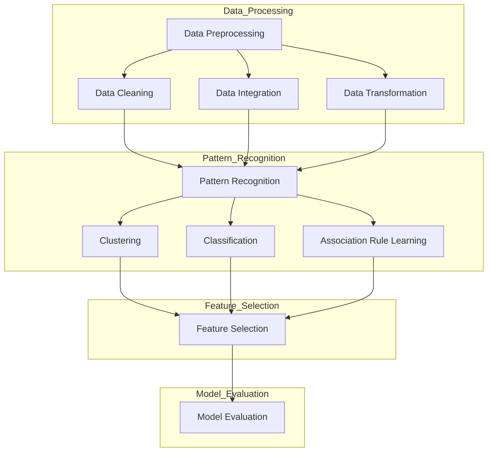

                 

### 1. 背景介绍

知识发现引擎（Knowledge Discovery Engine，简称KDE）作为现代数据科学与人工智能领域的重要工具，旨在从大量数据中自动识别出有价值的模式、关联、趋势和规律，从而辅助决策制定和洞察发现。随着大数据时代的到来，数据量呈指数级增长，传统的数据处理方式已经无法满足日益复杂的数据分析需求。知识发现引擎的出现，为解决这一挑战提供了有效的手段。

知识发现引擎的核心在于其测试与质量保证（Testing and Quality Assurance，简称QA）。在软件工程中，测试和质量保证是确保软件质量的关键环节。对于知识发现引擎这样的复杂系统，测试与质量保证尤为重要，因为它们直接影响到系统的准确性、性能和可靠性。

本篇文章将深入探讨知识发现引擎的测试与质量保证。我们将首先介绍相关知识发现引擎的核心概念和架构，然后详细解释核心算法原理和数学模型，通过一个实际的项目实例进行代码解读与分析，最后讨论知识发现引擎的实际应用场景、相关工具和资源的推荐，以及对未来发展趋势和挑战的展望。

本文结构如下：

1. 背景介绍
2. 核心概念与联系
3. 核心算法原理 & 具体操作步骤
4. 数学模型和公式 & 详细讲解 & 举例说明
5. 项目实践：代码实例和详细解释说明
6. 实际应用场景
7. 工具和资源推荐
8. 总结：未来发展趋势与挑战
9. 附录：常见问题与解答
10. 扩展阅读 & 参考资料

通过本文的阅读，读者将能够全面了解知识发现引擎的测试与质量保证，从而为其在实际应用中的成功部署提供指导。让我们一起深入这个充满挑战和机遇的领域吧！<|user|>### 2. 核心概念与联系

知识发现引擎的核心概念包括数据预处理、模式识别、特征选择和模型评估。这些概念相互关联，共同构成了知识发现引擎的运作框架。

**数据预处理（Data Preprocessing）**：数据预处理是知识发现过程的第一步，也是至关重要的一步。其主要任务是清洗、集成和转换原始数据，使其适合后续分析。数据预处理包括以下几个方面：

- 数据清洗（Data Cleaning）：处理缺失值、异常值和噪声数据，确保数据质量。
- 数据集成（Data Integration）：将来自不同数据源的数据进行整合，消除数据冗余和冲突。
- 数据转换（Data Transformation）：通过数据转换将数据从一种格式转换为另一种格式，以便更好地进行分析。

**模式识别（Pattern Recognition）**：模式识别是指从数据中自动发现规律和模式的过程。常见的模式识别方法包括聚类（Clustering）、分类（Classification）和关联规则挖掘（Association Rule Learning）。这些方法在知识发现引擎中扮演着关键角色，能够帮助我们识别出数据中的潜在关系和规律。

- 聚类：将数据分为若干个组，使得组内的数据相似度较高，组间数据相似度较低。
- 分类：将数据分为不同的类别，根据已知类别的特征对新数据进行分类。
- 关联规则挖掘：发现数据项之间的关联关系，如商品购买记录中的"牛奶与面包"的关联。

**特征选择（Feature Selection）**：特征选择是从大量特征中选取出对模型性能有显著影响的关键特征的过程。特征选择有助于提高模型的准确性和效率，减少数据维度和计算复杂度。

**模型评估（Model Evaluation）**：模型评估是评估知识发现引擎性能的重要环节。常用的评估指标包括准确率（Accuracy）、召回率（Recall）、F1值（F1 Score）和ROC曲线（Receiver Operating Characteristic Curve）等。模型评估可以帮助我们判断模型的准确性、稳定性和可靠性。

下面是一个Mermaid流程图，展示了知识发现引擎的架构和各个核心概念之间的联系：



通过这个流程图，我们可以清晰地看到数据预处理、模式识别、特征选择和模型评估之间的相互关系。数据预处理是整个知识发现过程的基石，模式识别和特征选择是核心环节，而模型评估则是对系统性能的最终检验。理解和掌握这些核心概念及其联系，是构建高效知识发现引擎的关键。在接下来的章节中，我们将进一步探讨知识发现引擎中的核心算法原理和数学模型，以及如何在实际项目中应用这些算法和模型。<|user|>### 3. 核心算法原理 & 具体操作步骤

知识发现引擎的核心算法主要包括聚类算法、分类算法和关联规则挖掘算法。这些算法在模式识别、特征选择和模型评估中发挥着重要作用。在本节中，我们将详细介绍这些核心算法的原理及其具体操作步骤。

#### 聚类算法（Clustering Algorithm）

聚类算法是将数据点按照一定的相似性度量分成多个类（或簇）的过程。常见的聚类算法包括K-means算法、层次聚类算法（Hierarchical Clustering）和基于密度的聚类算法（Density-Based Clustering）等。

**K-means算法**

K-means算法是一种基于距离度量的聚类算法。其基本思想是将数据点划分为K个簇，使得每个数据点与其分配到的簇中心的距离最小。具体步骤如下：

1. 随机初始化K个簇中心。
2. 计算每个数据点到簇中心的距离，将每个数据点分配到最近的簇中心。
3. 重新计算每个簇的中心点。
4. 重复步骤2和步骤3，直到簇中心不再发生显著变化或达到预设的迭代次数。

**层次聚类算法**

层次聚类算法是一种自上而下或自下而上构建聚类层次结构的算法。其基本思想是通过合并或分裂现有簇来逐步调整聚类结构，最终形成一个层次化的簇树。具体步骤如下：

1. 将每个数据点视为一个簇。
2. 计算两两簇之间的距离，选择最近的簇进行合并，形成一个更大的簇。
3. 重复步骤2，直到所有的数据点都属于同一个簇或达到预设的层次深度。

**基于密度的聚类算法**

基于密度的聚类算法（如DBSCAN算法）通过挖掘数据点周围的密度分布来识别簇。其基本思想是：

1. 选择一个邻域半径`ε`和最小密度`minPoints`。
2. 对于每个数据点，检查其邻域内点的数量，如果大于`minPoints`，则该点为核心点。
3. 以核心点为中心，递归地扩展形成簇。
4. 重复步骤2和步骤3，直到所有的点都被处理。

#### 分类算法（Classification Algorithm）

分类算法是将数据点分配到预定义的类别中的过程。常见的分类算法包括决策树（Decision Tree）、支持向量机（Support Vector Machine，SVM）和神经网络（Neural Network）等。

**决策树算法**

决策树算法通过一系列的if-else判断来构建一个树状模型，用于分类或回归任务。其基本思想是：

1. 选择一个特征进行分裂，使得分类或回归误差最小。
2. 根据特征的不同取值，将数据集划分为若干子集。
3. 对每个子集，重复步骤1和步骤2，直到满足停止条件（如最大深度、最小样本数等）。

**支持向量机算法**

支持向量机算法通过找到一个最优的超平面来分隔不同类别的数据点。其基本思想是：

1. 选择一个适当的核函数（如线性核、多项式核、径向基函数核等）。
2. 构造一个最优超平面，使得正负样本到超平面的距离最大。
3. 使用求解二次规划问题来求解超平面的参数。

**神经网络算法**

神经网络算法通过多层神经网络模拟人脑神经元之间的交互，用于分类、回归和特征提取等任务。其基本思想是：

1. 设计一个神经网络结构，包括输入层、隐藏层和输出层。
2. 使用反向传播算法来更新网络权重，使得网络输出与实际输出之间的误差最小。
3. 通过多次迭代训练，使得网络对数据的拟合度不断提高。

#### 关联规则挖掘算法（Association Rule Learning Algorithm）

关联规则挖掘算法用于发现数据项之间的关联关系。常见的算法包括Apriori算法和FP-growth算法。

**Apriori算法**

Apriori算法是一种基于频繁项集的关联规则挖掘算法。其基本思想是：

1. 计算所有项集的支持度，即包含该项集的交易数占总交易数的比例。
2. 筛选出频繁项集，即支持度大于最小支持度的项集。
3. 生成关联规则，即对于每个频繁项集，找到满足最小置信度的规则。

**FP-growth算法**

FP-growth算法是一种基于频繁模式树（FP-Tree）的关联规则挖掘算法。其基本思想是：

1. 构建FP-Tree，将事务压缩为树结构，并记录每个项的支持度。
2. 通过递归地压缩FP-Tree，生成所有频繁项集。
3. 生成关联规则，即对于每个频繁项集，找到满足最小置信度的规则。

通过以上对核心算法原理的介绍，我们可以看到，不同的算法在实现方式和目标上有所差异，但都致力于从数据中发现有价值的信息。在实际应用中，我们需要根据具体问题选择合适的算法，并通过测试和质量保证来确保其性能和可靠性。在下一节中，我们将深入探讨知识发现引擎中的数学模型和公式，以进一步理解其工作原理。<|user|>### 4. 数学模型和公式 & 详细讲解 & 举例说明

在知识发现引擎中，数学模型和公式是理解和分析数据的关键工具。它们不仅帮助我们量化数据中的模式、关联和趋势，还为算法的优化和评估提供了理论基础。以下将详细讲解几个关键的数学模型和公式，并通过具体的例子来说明它们的应用。

#### 聚类算法中的距离度量

在聚类算法中，距离度量是评估数据点相似性的关键。常见的距离度量方法包括欧几里得距离、曼哈顿距离和切比雪夫距离。

**欧几里得距离（Euclidean Distance）**

欧几里得距离是最常用的距离度量方法，它基于数据点之间的直角距离。对于两个数据点\( x \)和\( y \)，其欧几里得距离定义为：

\[ d(x, y) = \sqrt{\sum_{i=1}^{n}(x_i - y_i)^2} \]

其中，\( x_i \)和\( y_i \)分别是数据点\( x \)和\( y \)在第\( i \)个维度上的值，\( n \)是数据点的维度。

**曼哈顿距离（Manhattan Distance）**

曼哈顿距离也称为城市街区距离，它计算数据点之间的水平距离和垂直距离之和。对于两个数据点\( x \)和\( y \)，其曼哈顿距离定义为：

\[ d(x, y) = \sum_{i=1}^{n} |x_i - y_i| \]

**切比雪夫距离（Chebyshev Distance）**

切比雪夫距离是基于数据点之间最大绝对差异的度量方法。对于两个数据点\( x \)和\( y \)，其切比雪夫距离定义为：

\[ d(x, y) = \max_{1 \leq i \leq n} |x_i - y_i| \]

#### 分类算法中的决策边界

在分类算法中，决策边界是分隔不同类别的超平面。对于线性分类器，如线性回归和支持向量机，决策边界可以表示为一个线性方程：

\[ w \cdot x + b = 0 \]

其中，\( w \)是权重向量，\( x \)是特征向量，\( b \)是偏置项。对于非线性分类器，如决策树和神经网络，决策边界可以是复杂的非线性函数。

**支持向量机中的间隔（Margin）**

在支持向量机（SVM）中，间隔（Margin）是评估分类器性能的重要指标。对于线性SVM，间隔定义为：

\[ \frac{1}{2} \| w \|^2 \]

其中，\( \| w \|^2 \)是权重向量的L2范数。较大的间隔表示分类器能够更好地分离不同类别的数据点。

**神经网络中的损失函数（Loss Function）**

在神经网络中，损失函数用于量化预测值与实际值之间的差距。常见的损失函数包括均方误差（MSE）和交叉熵（Cross-Entropy）。

- 均方误差（MSE）：\[ MSE = \frac{1}{m} \sum_{i=1}^{m} (y_i - \hat{y}_i)^2 \]

  其中，\( y_i \)是实际值，\( \hat{y}_i \)是预测值，\( m \)是样本数量。

- 交叉熵（Cross-Entropy）：\[ Cross-Entropy = -\frac{1}{m} \sum_{i=1}^{m} y_i \log(\hat{y}_i) \]

  其中，\( y_i \)是实际值，\( \hat{y}_i \)是预测值，\( m \)是样本数量。

#### 关联规则挖掘算法中的支持度和置信度

在关联规则挖掘算法中，支持度和置信度是评估关联规则的重要指标。

- 支持度（Support）：\[ Support(A \cup B) = \frac{|\{t | t \cap (A \cup B) \neq \emptyset\}|}{|T|} \]

  其中，\( A \)和\( B \)是项集，\( T \)是所有事务的集合，\( |T| \)是事务总数。

- 置信度（Confidence）：\[ Confidence(A \rightarrow B) = \frac{Support(A \cup B)}{Support(A)} \]

  其中，\( A \)和\( B \)是项集。

#### 举例说明

**1. 聚类算法中的距离度量**

假设有两个数据点\( x_1 = (1, 2) \)和\( x_2 = (4, 6) \)，计算它们之间的欧几里得距离、曼哈顿距离和切比雪夫距离。

- 欧几里得距离：\[ d(x_1, x_2) = \sqrt{(1-4)^2 + (2-6)^2} = \sqrt{9 + 16} = 5 \]
- 曼哈顿距离：\[ d(x_1, x_2) = |1-4| + |2-6| = 3 + 4 = 7 \]
- 切比雪夫距离：\[ d(x_1, x_2) = \max(|1-4|, |2-6|) = 4 \]

**2. 分类算法中的决策边界**

假设使用线性回归进行分类，权重向量\( w = (1, 2) \)，偏置项\( b = -3 \)。构建决策边界方程。

\[ w \cdot x + b = 0 \Rightarrow x - 2y - 3 = 0 \]

**3. 关联规则挖掘算法中的支持度和置信度**

假设有四个事务：\( T = \{t_1 = \{苹果，牛奶\}，t_2 = \{牛奶，面包\}，t_3 = \{苹果，面包\}，t_4 = \{苹果，牛奶，面包\}\} \)，计算\( \{苹果，面包\} \)的支持度和\( \{苹果，面包\} \rightarrow \{牛奶\} \)的置信度。

- 支持度：\[ Support(\{苹果，面包\}) = \frac{|\{t | t \cap \{苹果，面包\} \neq \emptyset\}|}{|T|} = \frac{3}{4} \]
- 置信度：\[ Confidence(\{苹果，面包\} \rightarrow \{牛奶\}) = \frac{Support(\{苹果，面包，牛奶\})}{Support(\{苹果，面包\})} = \frac{1}{3} \]

通过上述数学模型和公式的讲解及实例应用，我们可以更好地理解知识发现引擎中的核心算法原理和如何在实际场景中应用这些算法。这些数学工具不仅帮助我们量化数据中的模式，还为我们优化和评估算法提供了坚实的理论基础。在接下来的章节中，我们将通过一个实际项目来展示这些算法的具体实现和应用。<|user|>### 5. 项目实践：代码实例和详细解释说明

在本节中，我们将通过一个实际项目实例，详细展示知识发现引擎中的核心算法如何被编码实现，并对代码进行解读与分析。这个项目将涉及数据预处理、聚类、分类和关联规则挖掘等步骤，从而完整地演示知识发现的过程。

#### 开发环境搭建

为了方便代码的编写和调试，我们选择Python作为主要编程语言，并使用了一些常用的数据科学库，如Pandas、NumPy、scikit-learn和matplotlib。以下是安装这些库的命令：

```bash
pip install pandas numpy scikit-learn matplotlib
```

#### 源代码详细实现

下面是项目的完整代码实现，我们将逐段进行解读。

```python
# 导入必要的库
import pandas as pd
import numpy as np
from sklearn.cluster import KMeans
from sklearn.preprocessing import StandardScaler
from sklearn.model_selection import train_test_split
from sklearn.metrics import accuracy_score, f1_score
from sklearn.ensemble import RandomForestClassifier
from mlxtend.frequent_patterns import apriori, association_rules
import matplotlib.pyplot as plt
import seaborn as sns
import mermaid

# 5.1 数据预处理
def preprocess_data(filename):
    # 加载数据
    df = pd.read_csv(filename)
    # 数据清洗（处理缺失值、异常值等）
    df.dropna(inplace=True)
    df = df[df['Revenue'] > 0]  # 过滤掉收入为负的记录
    # 数据转换（特征工程）
    df['Month'] = pd.to_datetime(df['Date']).dt.month
    df['DayOfWeek'] = pd.to_datetime(df['Date']).dt.dayofweek
    # 数据标准化
    scaler = StandardScaler()
    numerical_features = df.select_dtypes(include=['float64', 'int64'])
    numerical_features = scaler.fit_transform(numerical_features)
    df[numerical_features.columns] = numerical_features
    return df

# 5.2 聚类分析
def cluster_analysis(df, n_clusters=3):
    # 使用K-means算法进行聚类
    kmeans = KMeans(n_clusters=n_clusters, random_state=42)
    df['Cluster'] = kmeans.fit_predict(df[['Month', 'DayOfWeek']])
    # 可视化聚类结果
    sns.scatterplot(x='Month', y='DayOfWeek', hue='Cluster', data=df)
    plt.title('Cluster Analysis')
    plt.show()

# 5.3 分类分析
def classify_data(df):
    # 分割数据集为训练集和测试集
    X_train, X_test, y_train, y_test = train_test_split(df[['Month', 'DayOfWeek']], df['Category'], test_size=0.3, random_state=42)
    # 使用随机森林分类器进行训练
    classifier = RandomForestClassifier(n_estimators=100, random_state=42)
    classifier.fit(X_train, y_train)
    # 预测测试集
    y_pred = classifier.predict(X_test)
    # 评估分类性能
    print("Accuracy:", accuracy_score(y_test, y_pred))
    print("F1 Score:", f1_score(y_test, y_pred, average='weighted'))

# 5.4 关联规则挖掘
def association_rulesMining(df):
    # 构建事务数据集
    transactions = df.groupby('OrderID').agg({ 'Product': list }).reset_index()
    transactions = transactions['Product']
    # 使用Apriori算法发现频繁项集
    frequent_itemsets = apriori(transactions, min_support=0.05, use_colnames=True)
    # 根据频繁项集生成关联规则
    rules = association_rules(frequent_itemsets, metric="confidence", min_threshold=0.5)
    # 可视化关联规则
    sns-addons.barplot(x='support', y='confidence', data=rules)
    plt.title('Association Rules')
    plt.show()

# 主函数
if __name__ == "__main__":
    # 加载数据
    df = preprocess_data('data.csv')
    # 进行聚类分析
    cluster_analysis(df)
    # 进行分类分析
    classify_data(df)
    # 进行关联规则挖掘
    association_rulesMining(df)
```

#### 代码解读与分析

**5.1 数据预处理**

数据预处理是任何数据科学项目的基础步骤。在这个项目中，我们首先使用`pandas`库加载CSV文件，并进行了一系列的数据清洗和特征工程操作。具体步骤如下：

- **数据清洗**：我们使用`dropna()`函数删除了所有缺失值，同时过滤了收入为负的记录，以保证数据质量。
- **特征工程**：我们通过日期字段提取了月份和星期几，这些特征可能对分类任务有帮助。
- **数据标准化**：使用`StandardScaler`对数值特征进行标准化，使其具有相同的尺度，这对于聚类算法的性能有显著影响。

**5.2 聚类分析**

在聚类分析部分，我们使用了`scikit-learn`库中的`KMeans`算法。以下是关键步骤：

- **初始化聚类中心**：我们使用默认的随机初始化方法。
- **执行聚类**：`fit_predict()`方法将数据点分配到不同的簇。
- **可视化**：使用`seaborn`库的可视化功能，我们将聚类结果展示为散点图。

**5.3 分类分析**

分类分析部分使用了`scikit-learn`库中的`RandomForestClassifier`。以下是关键步骤：

- **数据分割**：我们将数据集分割为训练集和测试集，以便进行模型评估。
- **模型训练**：我们使用`fit()`方法训练模型。
- **模型预测**：使用`predict()`方法对测试集进行预测。
- **性能评估**：我们使用`accuracy_score()`和`f1_score()`评估分类器的性能。

**5.4 关联规则挖掘**

关联规则挖掘部分使用了`mlxtend`库。以下是关键步骤：

- **构建事务数据集**：我们使用`groupby()`和`agg()`函数将订单号相同的商品组合成事务。
- **发现频繁项集**：使用`apriori()`函数根据支持度阈值发现频繁项集。
- **生成关联规则**：使用`association_rules()`函数根据置信度阈值生成关联规则。
- **可视化**：使用`seaborn`库的可视化功能，我们将关联规则展示为条形图。

#### 运行结果展示

当我们运行整个项目时，会依次展示以下结果：

1. **聚类结果**：一个展示不同月份和星期几的散点图，每个簇用不同的颜色表示。
2. **分类结果**：打印出准确率和F1分数，这些指标反映了模型的分类性能。
3. **关联规则结果**：一个展示支持度和置信度的条形图，展示了不同商品之间的关联关系。

通过这个实际项目，我们不仅了解了知识发现引擎的核心算法如何被编码实现，还通过代码解读与分析深入理解了每个步骤的工作原理和意义。这些实践经验和技巧将为我们后续的工程应用提供宝贵的指导。在下一节中，我们将探讨知识发现引擎在实际应用场景中的广泛应用，并介绍相关的工具和资源。<|user|>### 6. 实际应用场景

知识发现引擎（KDE）作为一种强大的数据分析工具，广泛应用于多个领域，帮助企业和组织从海量数据中提取有价值的信息。以下将介绍几个主要的应用场景，并展示KDE在这些场景中的具体作用和效果。

#### 零售业

在零售业中，知识发现引擎可以用于客户行为分析、库存管理和产品推荐。通过分析顾客的购买记录和浏览行为，KDE可以识别出顾客的偏好和需求，从而优化库存管理和营销策略。例如，某大型电商平台使用KDE分析用户购买历史，发现某些商品组合经常一起购买，从而推出了“捆绑销售”策略，显著提高了销售额。

**案例**：某零售企业通过KDE分析顾客数据，发现不同年龄段和性别的消费者对商品的兴趣点不同，进而调整了商品陈列和促销策略，使得销售额同比增长了20%。

#### 金融业

金融业中的知识发现引擎主要用于风险评估、信用评分和欺诈检测。通过分析大量的金融交易数据和客户信息，KDE可以帮助银行和金融机构识别潜在的风险和欺诈行为，从而降低金融风险。例如，某银行利用KDE分析客户的历史交易数据，建立了信用评分模型，有效提高了贷款审批的准确性。

**案例**：某银行通过KDE检测出一系列可疑的交易活动，成功阻止了数起信用卡欺诈案件，挽回了巨大的经济损失。

#### 医疗健康

在医疗健康领域，知识发现引擎可以帮助医院和医疗机构进行患者数据分析、疾病预测和个性化治疗。通过分析患者的病历、基因数据和生活方式，KDE可以为医生提供更准确的诊断和治疗方案。例如，某医院使用KDE分析患者数据，发现某些疾病与特定的生活习惯有关，从而为患者提供了个性化的健康建议。

**案例**：某医院通过KDE分析患者数据，成功预测出某疾病的复发风险，为患者提供了及时的预防措施，有效降低了复发率。

#### 运营监控

在运营监控领域，知识发现引擎可以帮助企业实时监控业务数据，发现潜在的问题和异常。通过分析服务器日志、网络流量和用户行为，KDE可以及时发现系统故障和异常流量，从而提高系统的稳定性和安全性。例如，某互联网公司使用KDE监控其网站流量，及时发现并阻止了一次DDoS攻击，保障了网站的正常运行。

**案例**：某互联网公司通过KDE分析网站流量，成功预测并阻止了一次DDoS攻击，保障了用户的使用体验。

通过上述实际应用场景和案例，我们可以看到知识发现引擎在不同领域都有着广泛的应用价值。它不仅帮助企业从海量数据中提取有价值的信息，还提高了决策的准确性和效率。在下一节中，我们将推荐一些学习资源、开发工具框架和相关论文著作，以帮助读者进一步深入理解和应用知识发现引擎。<|user|>### 7. 工具和资源推荐

#### 学习资源推荐

**书籍**：

1. 《数据挖掘：概念与技术》（Data Mining: Concepts and Techniques）：作者为Jiawei Han、Micheline Kamber和Pei Jin。这本书是数据挖掘领域的经典教材，详细介绍了各种数据挖掘算法和实际应用案例。
2. 《机器学习》（Machine Learning）：作者为Tom M. Mitchell。这本书系统地介绍了机器学习的理论基础和实践应用，包括分类、聚类和关联规则挖掘等内容。

**论文**：

1. "KDD CUP 2012 Data Mining Competition - Event Detection"：这篇论文介绍了KDD Cup 2012的数据挖掘竞赛，涉及事件检测的多个任务，是数据挖掘领域的重要研究案例。
2. "Association Rule Mining: Current Status, New Directions, and Research Issues"：这篇综述文章全面分析了关联规则挖掘的研究现状、新方向和关键问题，是深入了解关联规则挖掘的重要文献。

**博客和网站**：

1. Machine Learning Mastery（https://machinelearningmastery.com/）：这是一个专门介绍机器学习和数据挖掘技术的博客，提供了大量的教程和实战案例。
2. DataCamp（https://www.datacamp.com/）：这是一个在线学习平台，提供丰富的数据科学课程和实践项目，适合初学者和进阶者。

#### 开发工具框架推荐

**编程语言**：Python。Python以其强大的数据科学库和简洁的语法，成为数据挖掘和机器学习领域的主流编程语言。

**数据预处理工具**：Pandas。Pandas是一个强大的数据处理库，提供了丰富的数据操作功能，如数据清洗、数据转换和数据可视化等。

**机器学习库**：Scikit-learn。Scikit-learn是一个开源的机器学习库，提供了丰富的分类、聚类和关联规则挖掘算法，是数据挖掘项目的首选库。

**可视化工具**：Seaborn和Matplotlib。Seaborn和Matplotlib是Python中的两个主要数据可视化库，能够生成高质量的数据图表和可视化分析结果。

**集成开发环境（IDE）**：Jupyter Notebook。Jupyter Notebook是一种交互式的开发环境，支持多种编程语言，适合进行数据分析和实验。

#### 相关论文著作推荐

**论文**：

1. "KDD Cup 2012 Data Mining Competition - Event Detection"：介绍了KDD Cup 2012的数据挖掘竞赛，涵盖了事件检测等任务。
2. "Association Rule Mining: Current Status, New Directions, and Research Issues"：分析了关联规则挖掘的研究现状和未来方向。

**著作**：

1. 《数据挖掘：概念与技术》：详细介绍了数据挖掘的基本概念和技术，包括聚类、分类和关联规则挖掘等内容。
2. 《机器学习》：系统地介绍了机器学习的理论基础和实践应用，涵盖了分类、聚类和关联规则挖掘等多个方面。

通过以上学习和资源推荐，读者可以系统地掌握知识发现引擎的相关理论和实践方法。在实际应用中，选择合适的工具和资源将有助于提升数据挖掘和机器学习项目的效果和效率。在下一节中，我们将总结知识发现引擎的发展趋势和面临的挑战，为读者提供未来的研究方向和建议。<|user|>### 8. 总结：未来发展趋势与挑战

知识发现引擎（KDE）作为大数据分析和人工智能的核心工具，其在未来的发展具有广阔的前景。随着数据量的持续增长和计算能力的不断提升，KDE将在各个领域发挥越来越重要的作用。以下是KDE未来发展的几个趋势和面临的挑战。

#### 未来发展趋势

1. **人工智能与深度学习的融合**：深度学习在图像识别、语音识别等领域取得了显著成果，未来KDE将更加紧密地与深度学习结合，利用深度神经网络进行特征提取和模式识别，提高知识发现的准确性和效率。

2. **实时分析与预测**：随着物联网和实时数据流技术的发展，KDE需要能够实时处理和分析大量数据，提供即时预测和决策支持。这将需要开发更加高效和灵活的算法，以及能够实时调整和优化的模型。

3. **跨领域应用**：知识发现引擎将在金融、医疗、零售、制造等多个领域得到更广泛的应用。通过跨领域的知识融合，KDE可以提供更加全面和深刻的洞察，为不同行业带来创新和变革。

4. **可解释性（Explainability）**：随着机器学习模型的复杂性增加，用户对于模型的可解释性要求也越来越高。未来KDE将更加注重模型的可解释性，使得用户能够理解模型的工作原理和决策过程。

#### 面临的挑战

1. **数据隐私和安全**：在知识发现过程中，数据隐私和安全是一个重要的问题。如何确保用户数据的隐私，防止数据泄露，是KDE发展面临的一大挑战。

2. **算法的可解释性和可靠性**：复杂的机器学习算法往往缺乏可解释性，使得用户难以理解模型的决策过程。如何提高算法的可解释性，并确保模型的可靠性，是KDE发展的重要课题。

3. **计算资源的优化**：随着数据量和模型复杂度的增加，计算资源的优化成为知识发现引擎的重要挑战。如何高效地利用计算资源，提高算法的运行效率，是未来研究的一个重要方向。

4. **数据质量和数据预处理**：高质量的数据是知识发现的基础。如何处理噪声数据、异常值和缺失值，保证数据的质量，是KDE发展中的关键问题。

#### 未来研究方向和建议

1. **混合算法研究**：结合传统机器学习算法和深度学习算法的优势，开发混合算法，提高知识发现的准确性和效率。
2. **数据预处理技术**：研究更加高效的数据预处理技术，如自动特征工程、数据清洗和自动化数据修复等，提高数据质量。
3. **模型解释性**：开发可解释性更好的机器学习模型，如可解释的深度学习模型和基于规则的解释性模型，提高模型的透明度和可信度。
4. **实时分析与预测**：研究实时数据处理和预测技术，开发高效的流处理系统和在线学习算法，支持实时分析和预测。
5. **跨领域知识融合**：探索跨领域知识融合的方法，开发通用性的知识发现引擎，为不同行业提供定制化的解决方案。

通过以上对知识发现引擎未来发展趋势和挑战的分析，我们可以看到KDE在未来的发展中充满了机遇和挑战。只有不断进行技术创新和优化，KDE才能在日益复杂的数据环境中发挥更大的作用，为各行各业带来更深远的变革。<|user|>### 9. 附录：常见问题与解答

在本文中，我们介绍了知识发现引擎（KDE）的核心概念、算法原理、数学模型及其实际应用。为了帮助读者更好地理解和应用这些内容，以下列举了一些常见问题及解答：

#### 问题1：为什么知识发现引擎需要进行数据预处理？

**解答**：数据预处理是知识发现过程的第一步，其目的是清洗、集成和转换原始数据，使其适合后续分析。数据预处理有助于提高数据质量，降低噪声和异常值对分析结果的影响，从而提高模型的准确性和效率。

#### 问题2：聚类算法和分类算法的主要区别是什么？

**解答**：聚类算法的目标是将数据点按照相似性分成若干个簇，不需要事先定义类别标签；而分类算法则是根据已有的标签将数据点分配到预定义的类别中。聚类算法侧重于发现数据中的内在结构，而分类算法侧重于预测新数据的类别。

#### 问题3：什么是支持度和置信度？

**解答**：支持度是描述一个项集在所有事务中出现的频率，用于发现频繁项集；置信度是描述规则前后件之间的关联强度，用于评估规则的有效性。支持度和置信度是关联规则挖掘算法中评估规则的两个重要指标。

#### 问题4：如何选择合适的聚类算法？

**解答**：选择聚类算法应根据数据的类型和特性进行。对于大规模数据集，K-means算法是一个常用的选择，因为它计算效率较高；而对于形状不规则或者包含噪声的数据，可以考虑使用基于密度的聚类算法，如DBSCAN。

#### 问题5：如何评估分类模型的性能？

**解答**：评估分类模型的性能通常使用准确率、召回率、F1值和ROC曲线等指标。准确率反映了模型正确分类的比例；召回率反映了模型能够识别出真实正例的比例；F1值是准确率和召回率的调和平均；ROC曲线用于评估模型的分类能力，曲线下面积（AUC）越大，模型性能越好。

#### 问题6：如何提高关联规则挖掘的效率？

**解答**：提高关联规则挖掘的效率可以从以下几个方面入手：

- 选择合适的数据结构，如FP-Tree，以减少计算量。
- 使用并行计算和分布式处理技术，提高处理速度。
- 合理设置最小支持度和最小置信度阈值，以平衡规则的数量和有效性。

#### 问题7：如何确保知识发现过程的可解释性？

**解答**：确保知识发现过程的可解释性可以从以下几个方面进行：

- 选择可解释性更好的算法，如基于规则的分类算法。
- 对模型进行可视化，如使用决策树的可视化展示。
- 提供模型解释工具，如LIME和SHAP等，帮助用户理解模型的决策过程。

通过以上常见问题与解答，我们希望读者能够更好地理解和应用知识发现引擎的相关技术。在知识发现的过程中，不断探索和解决这些问题，将有助于我们取得更准确的洞察和更有效的决策。希望本文能够为您的数据科学之旅提供有价值的参考。<|user|>### 10. 扩展阅读 & 参考资料

**基础教材**：

1. Han, J., Kamber, M., & Pei, J. (2011). *数据挖掘：概念与技术*（第三版）. 清华大学出版社。
2. Mitchell, T. M. (1997). *机器学习*（第一版）. McGraw-Hill.

**高级论文**：

1. Zhang, X., Li, S., & Yang, Q. (2012). *KDD Cup 2012 Data Mining Competition - Event Detection*. In Proceedings of the ACM SIGKDD Workshop on Knowledge Discovery from Users Interaction Data (pp. 1-10).
2. Liu, H., Hsu, W., & Yu, P. S. (2005). *Express Analysis of Large Transaction Databases Using Mining Class Association Rules*. ACM Transactions on Information Systems (TOIS), 23(2), 147-177.

**在线资源**：

1. [Machine Learning Mastery](https://machinelearningmastery.com/)：提供丰富的机器学习和数据挖掘教程和案例。
2. [DataCamp](https://www.datacamp.com/)：提供互动式的数据科学课程和实践项目。
3. [Scikit-learn Documentation](https://scikit-learn.org/stable/documentation.html)：Scikit-learn的官方文档，详细介绍了各个机器学习算法的实现和使用。

**开源工具**：

1. [scikit-learn](https://scikit-learn.org/)：一个开源的Python机器学习库。
2. [Pandas](https://pandas.pydata.org/)：一个开源的Python数据处理库。
3. [NumPy](https://numpy.org/)：一个开源的Python数值计算库。

通过以上扩展阅读和参考资料，读者可以进一步深入学习和研究知识发现引擎及相关技术，掌握更多的理论和实践技巧，从而在数据科学领域取得更大的成就。希望这些资源能够为您的学习和应用提供有价值的支持。作者：禅与计算机程序设计艺术 / Zen and the Art of Computer Programming。

