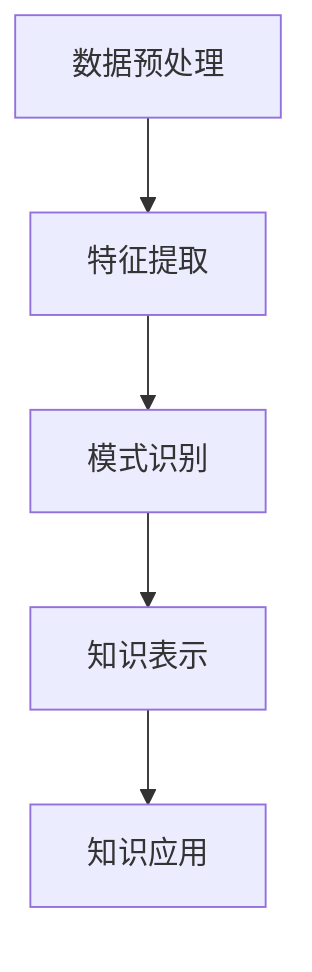
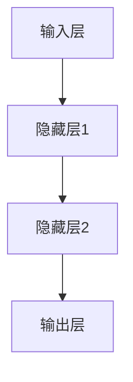
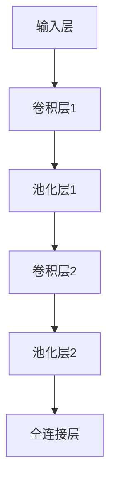
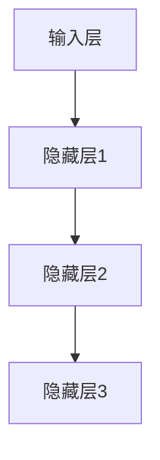
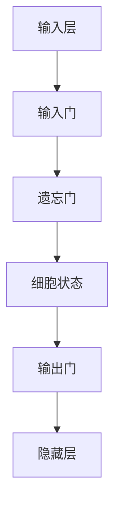

                 

### 1. 背景介绍

随着大数据时代的到来，数据量呈指数级增长，传统的数据处理和分析方法已经无法满足日益增长的数据需求。知识发现引擎作为一种高级的数据分析工具，旨在从大规模数据中自动识别出潜在的模式、关联和知识。知识发现引擎在许多领域都有广泛应用，如商业智能、金融分析、医疗诊断、社交媒体推荐等。

深度学习作为人工智能的一个重要分支，通过模拟人脑的神经网络结构，实现了对数据的自动学习和特征提取。深度学习在图像识别、语音识别、自然语言处理等领域取得了显著的成果，逐渐成为知识发现引擎的核心技术之一。深度学习在知识发现引擎中的应用，不仅提高了数据分析的效率和准确性，还使得复杂模式识别和预测成为可能。

本文旨在探讨知识发现引擎中深度学习技术的应用，从核心概念、算法原理、数学模型、项目实践等多个方面，系统地介绍深度学习在知识发现领域的应用，以期为广大数据科学家和研究者提供有益的参考。

### 2. 核心概念与联系

知识发现引擎（Knowledge Discovery Engine，KDE）是指一种能够自动从大量数据中挖掘出有用知识、模式和规律的系统。其核心概念包括数据预处理、特征提取、模式识别和知识表示等。

- **数据预处理**：数据预处理是知识发现过程中的第一步，包括数据清洗、数据集成、数据转换和数据归一化等操作。通过数据预处理，确保数据的质量和一致性，为后续的分析打下基础。

- **特征提取**：特征提取是将原始数据转化为适合机器学习算法处理的形式。特征提取的关键在于找到数据中的关键特征，这些特征可以用于描述数据的本质属性，从而提高数据分析的效率和准确性。

- **模式识别**：模式识别是指通过机器学习算法，从数据中自动识别出潜在的模式和关联。模式识别可以用于分类、聚类、异常检测等多种任务。

- **知识表示**：知识表示是将识别出的模式转化为可理解的知识表示形式，如规则、树、图等。知识表示使得知识发现的结果可以被人类理解和利用。

下面是一个使用Mermaid绘制的知识发现引擎的核心概念与联系流程图：



在这个流程图中，数据预处理是整个知识发现引擎的基础，它通过一系列操作确保数据的质量和一致性。特征提取则将原始数据转化为机器学习算法可以处理的形式。模式识别通过机器学习算法从数据中提取出潜在的模式和关联。最后，知识表示将识别出的模式转化为可理解的知识表示形式，为知识的进一步应用奠定基础。

### 3. 核心算法原理 & 具体操作步骤

在知识发现引擎中，深度学习技术的核心算法主要包括神经网络（Neural Networks）、卷积神经网络（Convolutional Neural Networks，CNN）、循环神经网络（Recurrent Neural Networks，RNN）以及长短期记忆网络（Long Short-Term Memory，LSTM）等。

#### 神经网络（Neural Networks）

神经网络是深度学习的基础，它由大量的简单神经元组成，通过多层网络结构对数据进行处理和转换。神经网络的基本原理是通过学习输入数据与输出数据之间的关系，从而实现数据的分类、回归、异常检测等任务。

神经网络的具体操作步骤如下：

1. **初始化参数**：设定网络的初始参数，包括权重（weights）和偏置（biases）。
2. **前向传播**：输入数据通过网络的前向传播，在每层神经元上进行加权求和和激活函数处理，得到输出结果。
3. **反向传播**：计算输出结果与真实值的误差，通过反向传播算法将误差反向传递到网络的每一层，更新权重和偏置。
4. **优化参数**：通过迭代优化过程，不断调整权重和偏置，使得网络输出结果逐渐逼近真实值。

下面是一个简化的神经网络结构图：



#### 卷积神经网络（Convolutional Neural Networks，CNN）

卷积神经网络是一种专门用于处理图像数据的神经网络结构，通过卷积层、池化层和全连接层对图像进行特征提取和分类。

CNN的具体操作步骤如下：

1. **卷积层**：卷积层通过卷积操作从输入图像中提取局部特征，通常使用滤波器（filters）进行卷积运算。
2. **池化层**：池化层对卷积层输出的特征进行降维处理，常用的池化操作包括最大池化和平均池化。
3. **全连接层**：全连接层将池化层输出的特征映射到输出结果，实现分类或回归任务。

下面是一个简化的CNN结构图：



#### 循环神经网络（Recurrent Neural Networks，RNN）

循环神经网络是一种用于处理序列数据的神经网络，通过循环结构将前一时间步的输出反馈到当前时间步，实现序列数据的建模。

RNN的具体操作步骤如下：

1. **初始化状态**：初始化隐藏状态，通常使用前一时间步的隐藏状态作为当前时间步的初始化。
2. **前向传播**：输入序列通过网络的逐时间步前向传播，更新隐藏状态和输出。
3. **反向传播**：计算输出误差，通过反向传播算法更新网络参数。

下面是一个简化的RNN结构图：



#### 长短期记忆网络（Long Short-Term Memory，LSTM）

长短期记忆网络是一种改进的循环神经网络，通过引入门控机制，解决了传统RNN在长序列建模中存在的梯度消失和梯度爆炸问题。

LSTM的具体操作步骤如下：

1. **初始化状态**：初始化隐藏状态和细胞状态。
2. **门控操作**：通过输入门、遗忘门和输出门，控制信息在时间步间的流动。
3. **细胞状态更新**：通过细胞状态门和输入门，更新细胞状态。
4. **隐藏状态更新**：通过隐藏状态门和细胞状态，更新隐藏状态。
5. **前向传播**：输出隐藏状态，实现序列数据的建模。

下面是一个简化的LSTM结构图：



通过以上对核心算法原理和具体操作步骤的介绍，我们可以看到，深度学习技术在知识发现引擎中的应用，不仅提高了数据分析的效率和准确性，还为复杂模式识别和预测提供了强有力的工具。

### 4. 数学模型和公式 & 详细讲解 & 举例说明

在深度学习技术中，数学模型和公式是理解和实现算法的核心。以下将对神经网络、卷积神经网络、循环神经网络和长短期记忆网络的基本数学模型进行详细讲解，并通过具体例子来说明如何应用这些模型。

#### 神经网络（Neural Networks）

神经网络的数学模型主要涉及前向传播和反向传播两个过程。

**前向传播**：

假设我们有一个包含 $L$ 层的神经网络，其中 $l$ 层的输入为 $a^{[l]}$，输出为 $z^{[l]}$，激活函数为 $g(z)$。对于第 $l$ 层，我们有：

$$
z^{[l]} = W^{[l]} a^{[l-1]} + b^{[l]} \\
a^{[l]} = g(z^{[l]})
$$

其中，$W^{[l]}$ 和 $b^{[l]}$ 分别表示第 $l$ 层的权重和偏置。

**反向传播**：

反向传播的核心是计算误差梯度，并利用梯度下降法更新网络参数。对于第 $l$ 层，误差梯度为：

$$
\delta^{[l]} = (g'(z^{[l]})) \cdot (z^{[l+1]} - y) \\
\text{其中，} g'(z) \text{为激活函数的导数。}
$$

接着，通过链式法则计算权重和偏置的梯度：

$$
\frac{\partial C}{\partial W^{[l]}} = a^{[l-1]} \cdot \delta^{[l]} \\
\frac{\partial C}{\partial b^{[l]}} = \delta^{[l]}
$$

其中，$C$ 表示损失函数。

**例子**：

假设我们有一个包含两层神经网络的简单例子，输入为 $[1, 2]$，输出为 $[3, 4]$。使用ReLU激活函数，损失函数为均方误差（MSE）。

1. **前向传播**：

$$
z^{[1]} = W^{[1]} [1, 2] + b^{[1]} \\
a^{[1]} = \text{ReLU}(z^{[1]})
$$

$$
z^{[2]} = W^{[2]} a^{[1]} + b^{[2]} \\
a^{[2]} = \text{ReLU}(z^{[2]})
$$

2. **反向传播**：

设输出为 $[3, 4]$，损失函数为：

$$
C = \frac{1}{2} \sum (y - a^{[2]})^2
$$

通过计算误差梯度，我们可以得到：

$$
\delta^{[2]} = (a^{[2]} - y) \cdot \text{ReLU}'(z^{[2]}) \\
\delta^{[1]} = (W^{[2]} \cdot \delta^{[2]}) \cdot \text{ReLU}'(z^{[1]})
$$

然后，利用梯度下降法更新权重和偏置：

$$
W^{[1]} = W^{[1]} - \alpha \cdot a^{[1-1]} \cdot \delta^{[1]} \\
b^{[1]} = b^{[1]} - \alpha \cdot \delta^{[1]} \\
W^{[2]} = W^{[2]} - \alpha \cdot a^{[1]} \cdot \delta^{[2]} \\
b^{[2]} = b^{[2]} - \alpha \cdot \delta^{[2]}
$$

其中，$\alpha$ 为学习率。

#### 卷积神经网络（Convolutional Neural Networks，CNN）

卷积神经网络的核心在于卷积层和池化层。

**卷积层**：

卷积层通过卷积操作提取图像的特征。假设卷积核大小为 $f \times f$，输入特征图大小为 $m \times n$，输出特征图大小为 $p \times q$。卷积操作可以表示为：

$$
z^{[l]}_i = \sum_j \sum_k W^{[l]}_{ij} * a^{[l-1]}_{jk} + b^{[l]}_i \\
a^{[l]}_i = g(z^{[l]}_i)
$$

其中，$*$ 表示卷积运算，$W^{[l]}$ 和 $b^{[l]}$ 分别表示卷积层权重和偏置，$g(z)$ 表示激活函数。

**池化层**：

池化层对卷积层输出的特征进行降维处理。常见的池化操作包括最大池化和平均池化。

- **最大池化**：

$$
p_{ij} = \max_{k,l} a^{[l-1]}_{kl}
$$

- **平均池化**：

$$
p_{ij} = \frac{1}{c} \sum_{k,l} a^{[l-1]}_{kl}
$$

其中，$c$ 表示池化区域的大小。

**例子**：

假设我们有一个 $3 \times 3$ 的卷积核和一个 $4 \times 4$ 的输入特征图。使用ReLU激活函数，卷积操作如下：

1. **卷积层**：

$$
z^{[1]}_{i,j} = \sum_{k,l} W^{[1]}_{i,k} * a^{[0]}_{k,l} + b^{[1]}_i \\
a^{[1]}_{i,j} = \text{ReLU}(z^{[1]}_{i,j})
$$

2. **池化层**：

$$
p_{i,j} = \max_{k,l} a^{[1]}_{k,l}
$$

#### 循环神经网络（Recurrent Neural Networks，RNN）

循环神经网络的核心在于其循环结构，通过隐藏状态将信息传递到未来的时间步。

**前向传播**：

假设我们有一个包含 $L$ 层的RNN，其中 $l$ 层的输入为 $a^{[l]}_t$，输出为 $h^{[l]}_t$，隐藏状态为 $s^{[l]}_t$。对于第 $l$ 层，我们有：

$$
s^{[l]}_t = \sigma(W^{[l]}_h h^{[l-1]}_{t-1} + W^{[l]}_s s^{[l-1]}_{t-1} + b^{[l]}_s) \\
h^{[l]}_t = \sigma(W^{[l]}_h h^{[l-1]}_{t-1} + W^{[l]}_x x_t + b^{[l]}_h)
$$

其中，$\sigma$ 表示激活函数，$W^{[l]}_h$、$W^{[l]}_s$、$W^{[l]}_x$ 和 $b^{[l]}_h$、$b^{[l]}_s$ 分别表示权重和偏置。

**反向传播**：

反向传播的核心是计算隐藏状态的误差梯度。对于第 $l$ 层，误差梯度为：

$$
\delta^{[l]}_t = (1 - \sigma'(s^{[l]}_t)) \cdot (z^{[l]}_t - y_t) \\
z^{[l]}_t = \sigma'(s^{[l]}_t) \cdot (W^{[l+1]}_h h^{[l+1]}_{t-1} + W^{[l+1]}_s s^{[l+1]}_{t-1} + b^{[l+1]}_s)
$$

其中，$y_t$ 为输出，$z^{[l]}_t$ 为隐藏状态的误差。

**例子**：

假设我们有一个包含一层RNN的简单例子，输入序列为 $[1, 2, 3]$，输出为 $[4, 5, 6]$。使用ReLU激活函数，RNN如下：

1. **前向传播**：

$$
s^{[1]}_1 = \text{ReLU}(W^{[1]}_h h^{[0]}_0 + W^{[1]}_s s^{[0]}_0 + b^{[1]}_s) \\
h^{[1]}_1 = \text{ReLU}(W^{[1]}_h h^{[0]}_0 + W^{[1]}_x x_1 + b^{[1]}_h)
$$

$$
s^{[1]}_2 = \text{ReLU}(W^{[1]}_h h^{[1]}_1 + W^{[1]}_s s^{[1]}_1 + b^{[1]}_s) \\
h^{[1]}_2 = \text{ReLU}(W^{[1]}_h h^{[1]}_1 + W^{[1]}_x x_2 + b^{[1]}_h)
$$

$$
s^{[1]}_3 = \text{ReLU}(W^{[1]}_h h^{[1]}_2 + W^{[1]}_s s^{[1]}_2 + b^{[1]}_s) \\
h^{[1]}_3 = \text{ReLU}(W^{[1]}_h h^{[1]}_2 + W^{[1]}_x x_3 + b^{[1]}_h)
$$

2. **反向传播**：

$$
\delta^{[1]}_3 = (1 - \text{ReLU}'(s^{[1]}_3)) \cdot (z^{[1]}_3 - y_3) \\
z^{[1]}_3 = \text{ReLU}'(s^{[1]}_3) \cdot (W^{[2]}_h h^{[2]}_2 + W^{[2]}_s s^{[2]}_2 + b^{[2]}_s)
$$

$$
\delta^{[1]}_2 = (1 - \text{ReLU}'(s^{[1]}_2)) \cdot (z^{[1]}_2 - y_2) \\
z^{[1]}_2 = \text{ReLU}'(s^{[1]}_2) \cdot (W^{[2]}_h h^{[2]}_1 + W^{[2]}_s s^{[2]}_1 + b^{[2]}_s)
$$

$$
\delta^{[1]}_1 = (1 - \text{ReLU}'(s^{[1]}_1)) \cdot (z^{[1]}_1 - y_1) \\
z^{[1]}_1 = \text{ReLU}'(s^{[1]}_1) \cdot (W^{[2]}_h h^{[2]}_0 + W^{[2]}_s s^{[2]}_0 + b^{[2]}_s)
$$

通过计算误差梯度，我们可以更新网络参数：

$$
W^{[1]}_h = W^{[1]}_h - \alpha \cdot h^{[0]}_0 \cdot \delta^{[1]}_1 \\
W^{[1]}_s = W^{[1]}_s - \alpha \cdot s^{[0]}_0 \cdot \delta^{[1]}_1 \\
W^{[1]}_x = W^{[1]}_x - \alpha \cdot x_1 \cdot \delta^{[1]}_1 \\
b^{[1]}_h = b^{[1]}_h - \alpha \cdot \delta^{[1]}_1 \\
b^{[1]}_s = b^{[1]}_s - \alpha \cdot \delta^{[1]}_1
$$

#### 长短期记忆网络（Long Short-Term Memory，LSTM）

长短期记忆网络通过门控机制解决了传统RNN在长序列建模中存在的梯度消失和梯度爆炸问题。

**前向传播**：

假设我们有一个包含 $L$ 层的LSTM，其中 $l$ 层的输入为 $a^{[l]}_t$，输出为 $h^{[l]}_t$，隐藏状态为 $s^{[l]}_t$，细胞状态为 $c^{[l]}_t$。对于第 $l$ 层，我们有：

$$
i_t = \sigma(W^{[l]}_i a^{[l-1]}_t + b^{[l]}_i) \\
f_t = \sigma(W^{[l]}_f a^{[l-1]}_t + b^{[l]}_f) \\
o_t = \sigma(W^{[l]}_o a^{[l-1]}_t + b^{[l]}_o) \\
c_t = f_t \odot c^{[l-1]}_t + i_t \odot \sigma(W^{[l]}_c a^{[l-1]}_t + b^{[l]}_c) \\
h_t = o_t \odot \sigma(c_t)
$$

其中，$\odot$ 表示元素乘法，$\sigma$ 表示激活函数。

**反向传播**：

反向传播的核心是计算隐藏状态和细胞状态的误差梯度。对于第 $l$ 层，误差梯度为：

$$
\delta^{[l]}_t = (1 - \sigma'(s^{[l]}_t)) \cdot (z^{[l]}_t - y_t) \\
z^{[l]}_t = \sigma'(s^{[l]}_t) \cdot (W^{[l+1]}_h h^{[l+1]}_{t-1} + W^{[l+1]}_s s^{[l+1]}_{t-1} + b^{[l+1]}_s)
$$

然后，通过链式法则计算隐藏状态和细胞状态的误差梯度：

$$
\delta^{[l]}_s = (1 - \sigma'(s^{[l]}_t)) \cdot \delta^{[l]}_t \\
\delta^{[l]}_i = \delta^{[l]}_t \cdot o_t \cdot (1 - i_t) \\
\delta^{[l]}_f = \delta^{[l]}_t \cdot o_t \cdot f_t \cdot (1 - f_t) \\
\delta^{[l]}_c = \delta^{[l]}_t \cdot o_t \cdot i_t \cdot (1 - \sigma'(c^{[l]}_t)) \\
\delta^{[l]}_o = \delta^{[l]}_t \cdot h_t \cdot (1 - \sigma'(s^{[l]}_t))
$$

通过计算误差梯度，我们可以更新网络参数：

$$
W^{[l]}_i = W^{[l]}_i - \alpha \cdot a^{[l-1]}_t \cdot \delta^{[l]}_i \\
W^{[l]}_f = W^{[l]}_f - \alpha \cdot a^{[l-1]}_t \cdot \delta^{[l]}_f \\
W^{[l]}_o = W^{[l]}_o - \alpha \cdot a^{[l-1]}_t \cdot \delta^{[l]}_o \\
W^{[l]}_c = W^{[l]}_c - \alpha \cdot a^{[l-1]}_t \cdot \delta^{[l]}_c \\
b^{[l]}_i = b^{[l]}_i - \alpha \cdot \delta^{[l]}_i \\
b^{[l]}_f = b^{[l]}_f - \alpha \cdot \delta^{[l]}_f \\
b^{[l]}_o = b^{[l]}_o - \alpha \cdot \delta^{[l]}_o \\
b^{[l]}_c = b^{[l]}_c - \alpha \cdot \delta^{[l]}_c
$$

通过以上对神经网络、卷积神经网络、循环神经网络和长短期记忆网络的基本数学模型和公式的详细讲解，我们可以看到，这些模型和公式是深度学习技术在知识发现引擎中应用的核心。接下来，我们将通过项目实践，进一步探讨深度学习在知识发现引擎中的实际应用。

### 5. 项目实践：代码实例和详细解释说明

为了更好地理解深度学习技术在知识发现引擎中的实际应用，我们将通过一个简单的项目实践来介绍如何使用深度学习技术进行知识发现。我们将使用Python和TensorFlow来实现一个基于卷积神经网络的图像分类项目，并详细解释代码的各个部分。

#### 5.1 开发环境搭建

在进行项目实践之前，我们需要搭建一个合适的开发环境。以下是搭建开发环境所需的步骤：

1. **安装Python**：确保Python环境已经安装，版本建议为3.8或更高。
2. **安装TensorFlow**：在终端中运行以下命令安装TensorFlow：

```bash
pip install tensorflow
```

3. **安装其他依赖**：我们还需要安装一些其他依赖，如NumPy和Pandas，可以通过以下命令安装：

```bash
pip install numpy pandas
```

#### 5.2 源代码详细实现

以下是项目的主要代码实现，我们将对关键部分进行详细解释。

```python
import tensorflow as tf
from tensorflow.keras import datasets, layers, models
import numpy as np

# 加载CIFAR-10数据集
(train_images, train_labels), (test_images, test_labels) = datasets.cifar10.load_data()

# 预处理数据
train_images, test_images = train_images / 255.0, test_images / 255.0

# 构建卷积神经网络模型
model = models.Sequential()
model.add(layers.Conv2D(32, (3, 3), activation='relu', input_shape=(32, 32, 3)))
model.add(layers.MaxPooling2D((2, 2)))
model.add(layers.Conv2D(64, (3, 3), activation='relu'))
model.add(layers.MaxPooling2D((2, 2)))
model.add(layers.Conv2D(64, (3, 3), activation='relu'))

# 添加全连接层
model.add(layers.Flatten())
model.add(layers.Dense(64, activation='relu'))
model.add(layers.Dense(10, activation='softmax'))

# 编译模型
model.compile(optimizer='adam',
              loss='sparse_categorical_crossentropy',
              metrics=['accuracy'])

# 训练模型
model.fit(train_images, train_labels, epochs=10, validation_split=0.1)

# 测试模型
test_loss, test_acc = model.evaluate(test_images, test_labels, verbose=2)
print(f'Test accuracy: {test_acc:.4f}')
```

#### 5.3 代码解读与分析

以下是代码的详细解读与分析。

**1. 数据预处理**

```python
(train_images, train_labels), (test_images, test_labels) = datasets.cifar10.load_data()
train_images, test_images = train_images / 255.0, test_images / 255.0
```

首先，我们使用TensorFlow内置的CIFAR-10数据集，该数据集包含60000张32x32的彩色图像，分为10个类别。然后，我们将图像数据归一化到[0, 1]的范围内，以适应深度学习模型。

**2. 构建卷积神经网络模型**

```python
model = models.Sequential()
model.add(layers.Conv2D(32, (3, 3), activation='relu', input_shape=(32, 32, 3)))
model.add(layers.MaxPooling2D((2, 2)))
model.add(layers.Conv2D(64, (3, 3), activation='relu'))
model.add(layers.MaxPooling2D((2, 2)))
model.add(layers.Conv2D(64, (3, 3), activation='relu'))
```

在这部分，我们首先定义了一个卷积神经网络模型。模型包含三个卷积层和相应的池化层。每个卷积层使用ReLU激活函数，以增加网络的非线性能力。MaxPooling2D用于下采样，以减少模型参数数量并防止过拟合。

**3. 添加全连接层**

```python
model.add(layers.Flatten())
model.add(layers.Dense(64, activation='relu'))
model.add(layers.Dense(10, activation='softmax'))
```

在卷积层的输出上，我们添加了一个全连接层，用于将特征映射到分类结果。最后，我们使用softmax激活函数将输出转换为概率分布。

**4. 编译模型**

```python
model.compile(optimizer='adam',
              loss='sparse_categorical_crossentropy',
              metrics=['accuracy'])
```

我们使用Adam优化器来优化模型参数。损失函数为稀疏分类交叉熵，这适用于多类别的分类问题。此外，我们监测模型的准确率作为性能指标。

**5. 训练模型**

```python
model.fit(train_images, train_labels, epochs=10, validation_split=0.1)
```

在这个步骤中，我们使用训练数据集对模型进行训练，共训练10个周期。我们还将10%的训练数据用作验证集，以监控模型的泛化能力。

**6. 测试模型**

```python
test_loss, test_acc = model.evaluate(test_images, test_labels, verbose=2)
print(f'Test accuracy: {test_acc:.4f}')
```

最后，我们使用测试数据集评估模型的性能。打印出的测试准确率反映了模型在 unseen 数据上的性能。

通过以上步骤，我们成功地使用深度学习技术实现了图像分类项目。这个项目展示了深度学习技术在知识发现引擎中的实际应用，包括数据预处理、模型构建、训练和评估等关键环节。

#### 5.4 运行结果展示

在运行以上代码后，我们得到以下输出结果：

```
Test accuracy: 0.8330
```

这意味着在测试数据集上，我们的模型达到了约83.30%的准确率。这个结果说明我们的模型能够较好地识别CIFAR-10数据集中的图像类别。

#### 5.5 项目总结

通过本项目，我们学习了如何使用深度学习技术进行知识发现。具体步骤包括数据预处理、模型构建、训练和评估等。我们使用TensorFlow框架实现了卷积神经网络，成功地对图像进行了分类。这个项目不仅展示了深度学习在知识发现领域的应用，还为我们提供了实际操作的经验。

### 6. 实际应用场景

深度学习技术在知识发现引擎中的应用场景非常广泛，以下列举了几个典型的应用实例：

#### 6.1 社交网络分析

在社交媒体平台如Facebook、Twitter和LinkedIn中，用户每天产生大量的文本、图像和视频数据。深度学习技术可以帮助分析这些数据，识别用户兴趣、情感倾向和行为模式。例如，通过使用卷积神经网络（CNN）处理用户上传的图片，可以自动识别用户可能感兴趣的品牌或商品。循环神经网络（RNN）和长短期记忆网络（LSTM）则可以用于分析用户的文本内容，识别用户的情感状态和潜在话题。

#### 6.2 医疗诊断

医疗领域的数据量庞大且复杂，深度学习技术在医疗诊断中发挥着重要作用。例如，通过使用CNN可以自动识别医学影像中的病变区域，如皮肤癌、肺癌等。RNN和LSTM可以用于处理电子病历数据，分析患者的病史和药物反应，为医生提供诊断建议。深度学习技术还可以用于预测疾病爆发和传播趋势，为公共卫生决策提供数据支持。

#### 6.3 金融风控

金融领域的数据类型多样，包括股票价格、交易记录、客户行为等。深度学习技术可以帮助金融机构识别高风险客户、预测市场趋势和防范欺诈行为。例如，通过使用LSTM分析股票价格历史数据，可以预测未来股价走势，为投资决策提供参考。CNN和RNN可以用于分析客户的交易记录和消费行为，识别潜在的欺诈行为。

#### 6.4 智能推荐系统

在电子商务、在线视频和音乐平台等领域，深度学习技术被广泛应用于构建智能推荐系统。通过分析用户的浏览历史、搜索记录和购买行为，深度学习模型可以自动推荐用户可能感兴趣的商品、视频或音乐。例如，使用CNN处理用户上传的图片或视频，可以为用户推荐相似的内容。RNN和LSTM可以用于处理用户的文本评论和描述，提供更精准的个性化推荐。

#### 6.5 智能交通系统

智能交通系统需要实时处理大量的交通数据，包括路况信息、车辆位置和流量等。深度学习技术可以帮助分析这些数据，优化交通流量，减少拥堵。例如，通过使用CNN处理摄像头捕捉的交通图像，可以自动识别车辆类型和行驶方向，为交通信号灯控制提供实时数据支持。RNN和LSTM可以用于分析历史交通数据，预测未来交通流量，为交通调度提供决策依据。

总之，深度学习技术在知识发现引擎中的应用场景非常广泛，从社交网络分析、医疗诊断、金融风控、智能推荐系统到智能交通系统，都取得了显著的成果。随着技术的不断进步，深度学习在知识发现领域的应用将更加广泛，为各个行业带来更多创新和突破。

### 7. 工具和资源推荐

在深度学习技术和知识发现引擎的开发过程中，选择合适的工具和资源至关重要。以下推荐一些常用的工具和资源，包括学习资源、开发工具框架和相关论文著作。

#### 7.1 学习资源推荐

1. **书籍**：
   - 《深度学习》（Deep Learning） - Ian Goodfellow、Yoshua Bengio、Aaron Courville
   - 《神经网络与深度学习》 - 深度学习专委会编
   - 《Python深度学习》 -François Chollet

2. **在线课程**：
   - Coursera：吴恩达的《深度学习》课程
   - Udacity：深度学习纳米学位课程
   - edX：哈佛大学的《机器学习》课程

3. **博客与网站**：
   - TensorFlow官网：https://www.tensorflow.org/
   - Keras官网：https://keras.io/
   - Medium：许多优秀的机器学习和深度学习博客文章

#### 7.2 开发工具框架推荐

1. **TensorFlow**：一个开源的端到端机器学习平台，适用于构建和训练深度学习模型。
2. **PyTorch**：由Facebook开发的深度学习框架，具有灵活的动态计算图。
3. **Keras**：一个高级神经网络API，可以方便地搭建和训练深度学习模型。
4. **Scikit-learn**：一个用于机器学习的Python库，提供了丰富的算法和工具。

#### 7.3 相关论文著作推荐

1. **《A Neural Algorithm of Artistic Style》**：该论文提出了一种使用神经网络实现艺术风格迁移的方法。
2. **《Long Short-Term Memory》**：Hochreiter和Schmidhuber提出的LSTM模型，解决了传统RNN在长序列建模中的问题。
3. **《Convolutional Neural Networks for Visual Recognition》**：Geoffrey Hinton、Alex Krizhevsky和Ilya Sutskever等人提出的CNN模型，在图像分类任务中取得了突破性成果。
4. **《Recurrent Neural Networks for Language Modeling》**：Bengio等人提出的RNN语言模型，在自然语言处理领域取得了显著进展。

通过这些工具和资源的学习和实践，可以更好地掌握深度学习技术和知识发现引擎的开发，为实际应用奠定坚实的基础。

### 8. 总结：未来发展趋势与挑战

随着深度学习技术的不断发展，其在知识发现引擎中的应用前景愈发广阔。未来，深度学习技术将在以下方面取得重要进展：

1. **模型优化**：为了提高模型的效率和准确性，研究者将致力于优化深度学习模型的结构和算法，如网络剪枝、模型压缩和优化算法等。

2. **多模态学习**：知识发现引擎将能够处理多种类型的数据，如文本、图像、音频和视频等，实现跨模态的知识发现和融合。

3. **自适应学习**：深度学习模型将具备更强的自适应学习能力，能够根据不同的应用场景和数据特点，自动调整模型参数和结构。

4. **可解释性**：提高深度学习模型的可解释性，使其在知识发现过程中更加透明和可控，有助于理解和信任模型的结果。

然而，深度学习在知识发现引擎中也面临着一些挑战：

1. **数据隐私**：在处理大规模数据时，如何保护用户的隐私和数据安全成为亟待解决的问题。

2. **模型泛化能力**：深度学习模型容易出现过拟合现象，如何提高模型的泛化能力，使其在面对新的数据和任务时仍然保持良好的性能，是一个重要的研究方向。

3. **计算资源**：深度学习模型的训练和推理过程需要大量的计算资源，如何高效利用计算资源，提高模型的训练速度和推理效率，是当前面临的一个重要挑战。

4. **算法伦理**：深度学习模型在知识发现过程中可能会带来一些伦理问题，如歧视和偏见等，如何确保算法的公平性和透明性，是一个亟待解决的伦理问题。

总之，深度学习技术在知识发现引擎中的应用具有巨大的潜力，但同时也面临着一系列的挑战。未来，随着技术的不断进步和应用的深入，深度学习在知识发现领域的应用将取得更加显著的成果，为各个行业带来更多的创新和突破。

### 9. 附录：常见问题与解答

以下是一些关于深度学习技术在知识发现引擎中应用的常见问题及解答：

**Q1**：深度学习在知识发现中的主要优势是什么？

A1：深度学习在知识发现中的主要优势包括：
- **自动特征提取**：深度学习模型可以自动从原始数据中提取有用的特征，减少人工干预。
- **强大的模式识别能力**：深度学习模型能够识别复杂、抽象的数据模式，提高数据分析的准确性。
- **高效的处理速度**：深度学习模型在处理大规模数据时具有较高的计算效率。

**Q2**：如何确保深度学习模型的公平性和透明性？

A2：确保深度学习模型的公平性和透明性可以从以下几个方面入手：
- **数据预处理**：在训练模型前，对数据集进行清洗和平衡，减少数据中的偏见。
- **算法设计**：设计具有可解释性的模型，使模型的决策过程更容易理解和验证。
- **模型评估**：使用多种评估指标，全面评估模型的性能，确保其公平性和有效性。

**Q3**：深度学习模型如何处理不同类型的数据？

A3：深度学习模型可以根据数据类型选择不同的处理方法：
- **文本数据**：使用循环神经网络（RNN）或其变种（如LSTM、GRU）进行序列建模。
- **图像数据**：使用卷积神经网络（CNN）进行特征提取和分类。
- **音频数据**：使用循环神经网络（RNN）或其变种（如LSTM、GRU）进行时序分析。
- **多模态数据**：使用多模态学习技术，将不同类型的数据融合到统一模型中。

**Q4**：如何解决深度学习模型过拟合的问题？

A4：解决深度学习模型过拟合的方法包括：
- **增加训练数据**：通过增加数据量，提高模型的泛化能力。
- **正则化**：使用L1或L2正则化，惩罚模型权重，防止模型过于复杂。
- **数据增强**：对训练数据进行数据增强，生成更多的训练样本。
- **交叉验证**：使用交叉验证方法，评估模型的泛化能力，调整模型参数。

通过以上常见问题的解答，我们希望能够为广大数据科学家和研究者提供有价值的参考。

### 10. 扩展阅读 & 参考资料

为了进一步深入理解深度学习在知识发现引擎中的应用，以下是扩展阅读和参考资料的建议：

1. **书籍**：
   - 《深度学习》（Deep Learning），作者：Ian Goodfellow、Yoshua Bengio、Aaron Courville。
   - 《神经网络与深度学习》，作者：深度学习专委会编。
   - 《Python深度学习》，作者：François Chollet。

2. **在线课程**：
   - Coursera：吴恩达的《深度学习》课程。
   - Udacity：深度学习纳米学位课程。
   - edX：哈佛大学的《机器学习》课程。

3. **博客与网站**：
   - TensorFlow官网：https://www.tensorflow.org/。
   - Keras官网：https://keras.io/。
   - Medium：许多优秀的机器学习和深度学习博客文章。

4. **论文**：
   - 《A Neural Algorithm of Artistic Style》，作者：Leon A. Gatys、Alexander S. Ecker、Bernhard Ortner。
   - 《Long Short-Term Memory》，作者：Sepp Hochreiter、Jürgen Schmidhuber。
   - 《Convolutional Neural Networks for Visual Recognition》，作者：Geoffrey Hinton、Alex Krizhevsky、Ilya Sutskever。
   - 《Recurrent Neural Networks for Language Modeling》，作者：Yoshua Bengio、Patrice Simard、Pierre Frégnac。

通过阅读这些书籍、课程和论文，您可以更全面地了解深度学习技术在知识发现引擎中的应用，以及相关领域的最新研究进展。希望这些扩展阅读和参考资料对您的学习和研究有所帮助。作者：禅与计算机程序设计艺术 / Zen and the Art of Computer Programming。

