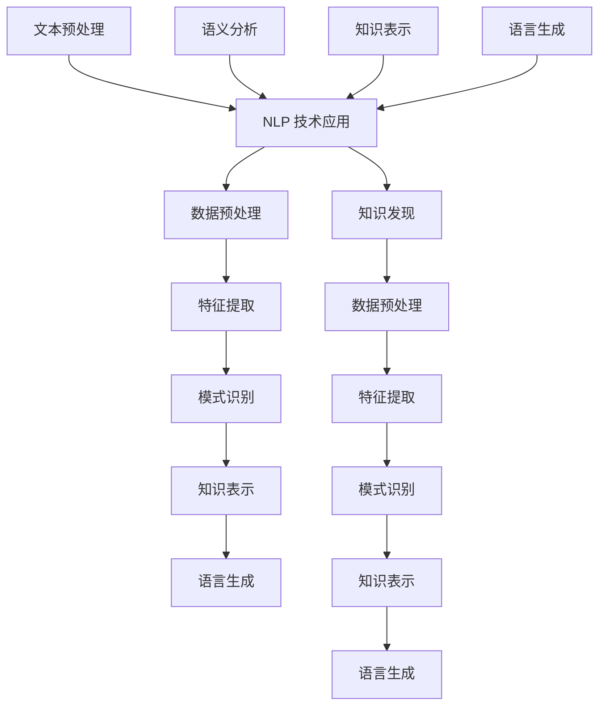

                 

### 背景介绍 Background

#### 1.1 知识发现引擎的定义与历史发展

知识发现引擎是一种高级的信息检索和分析工具，它通过对大规模数据的深入挖掘，从中识别出潜在的模式、趋势和关联，从而实现知识的自动获取和发现。知识发现引擎起源于20世纪80年代末90年代初，随着互联网的迅速发展和数据量的爆发增长，这一领域得到了广泛关注和迅速发展。

知识发现引擎的发展可以分为几个阶段：

**早期阶段：** 这一阶段主要集中在数据挖掘和模式识别技术上。代表性的算法包括K-Means聚类、Apriori关联规则挖掘、支持向量机（SVM）等。这些算法能够从大量数据中提取出一些基本的模式，但缺乏深度和广泛性。

**发展阶段：** 随着机器学习和人工智能技术的发展，知识发现引擎开始引入更复杂的算法，如神经网络、深度学习等。这些算法能够处理更加复杂的数据结构，并且具有自学习和自适应能力。

**智能化阶段：** 当前，知识发现引擎正朝着智能化方向快速发展。通过融合自然语言处理（NLP）、图像识别、语音识别等技术，知识发现引擎能够更好地理解和处理非结构化数据，从而实现更高级的知识提取和发现。

#### 1.2 自然语言处理技术的定义与应用

自然语言处理（NLP）是计算机科学和人工智能领域的一个重要分支，旨在使计算机能够理解和处理人类语言。NLP的发展可以追溯到20世纪50年代，随着计算机性能的提升和海量数据的出现，NLP技术逐渐成熟，并在多个领域得到广泛应用。

NLP的主要应用包括：

- **文本分类**：对文本进行自动分类，如新闻分类、垃圾邮件过滤等。
- **信息抽取**：从大量文本中提取出关键信息，如命名实体识别、关系抽取等。
- **机器翻译**：将一种语言的文本自动翻译成另一种语言。
- **问答系统**：构建能够理解和回答用户问题的系统，如智能客服、搜索引擎等。

#### 1.3 知识发现引擎与自然语言处理技术的结合

知识发现引擎和自然语言处理技术的结合，使得从非结构化的文本数据中提取知识成为可能。这一结合主要体现在以下几个方面：

- **文本数据预处理**：通过NLP技术对文本数据（如新闻报道、用户评论等）进行预处理，包括分词、词性标注、命名实体识别等，从而将非结构化数据转化为结构化数据，为后续的知识发现提供基础。
- **语义理解**：利用NLP技术对文本进行语义分析，理解文本的含义和关系，从而发现文本中的潜在模式和关联。
- **知识表示**：通过将文本中的知识转化为机器可理解的形式（如知识图谱），从而实现知识的存储、管理和检索。

#### 1.4 研究背景与意义

知识发现引擎在多个领域具有广泛的应用前景，如金融、医疗、零售等。随着互联网和大数据技术的不断进步，知识发现引擎的需求也越来越大。然而，传统的知识发现方法往往局限于结构化数据，对非结构化文本数据的处理能力较弱。因此，将自然语言处理技术引入知识发现引擎，能够有效提高对非结构化数据的处理能力，从而实现更高效的知识提取和发现。

本篇文章将深入探讨知识发现引擎的自然语言处理技术应用，通过分析核心算法、数学模型和项目实践，旨在为读者提供一个全面、系统的认识和理解。

### 2. 核心概念与联系 Core Concepts and Connections

#### 2.1 知识发现引擎的核心概念

知识发现引擎的核心概念包括数据预处理、特征提取、模式识别和知识表示等。

1. **数据预处理**：数据预处理是知识发现过程中的第一步，主要目的是将原始数据进行清洗、转换和规范化，从而将其转化为适合分析的形式。在自然语言处理领域，数据预处理通常包括分词、词性标注、命名实体识别等步骤。

2. **特征提取**：特征提取是指从原始数据中提取出能够代表数据本质的特征，这些特征将用于后续的模式识别和知识表示。在自然语言处理中，特征提取通常涉及词袋模型、词嵌入和TF-IDF等算法。

3. **模式识别**：模式识别是指从特征中识别出具有特定意义的模式或规律。在知识发现引擎中，模式识别通常使用分类、聚类、关联规则挖掘等算法。

4. **知识表示**：知识表示是指将识别出的模式或规律转化为计算机可以理解和处理的形式。在自然语言处理中，知识表示通常采用知识图谱、本体论等方法。

#### 2.2 自然语言处理技术的核心概念

自然语言处理技术的核心概念包括文本预处理、语义分析、知识表示和语言生成等。

1. **文本预处理**：文本预处理是指对原始文本进行清洗、分词、词性标注等操作，以便后续的语义分析。在文本预处理中，分词是一个关键步骤，常用的分词方法有基于词典的分词和基于统计的分词。

2. **语义分析**：语义分析是指对文本进行深入的理解和分析，以获取文本的含义和关系。语义分析包括词义消歧、语义角色标注、情感分析等。

3. **知识表示**：知识表示是指将语义分析的结果以计算机可以理解的形式进行表示。常见的知识表示方法有知识图谱、本体论和语义网络等。

4. **语言生成**：语言生成是指根据特定的规则或模型生成新的文本。在自然语言处理中，语言生成常用于问答系统、机器翻译和文本摘要等。

#### 2.3 知识发现引擎与自然语言处理技术的联系

知识发现引擎与自然语言处理技术的联系主要体现在以下几个方面：

1. **数据预处理**：自然语言处理技术为知识发现引擎提供了高效的数据预处理工具，如分词、词性标注等，这些工具能够将原始文本转化为结构化的数据，为后续分析提供基础。

2. **语义分析**：自然语言处理技术通过对文本进行语义分析，能够深入理解文本的含义和关系，从而为知识发现提供更准确的模式。

3. **知识表示**：自然语言处理技术通过知识图谱、本体论等方法，将语义分析的结果转化为计算机可以理解的形式，为知识表示和存储提供支持。

4. **语言生成**：语言生成技术能够根据知识发现的结果生成新的文本，如问答系统中的回答、文本摘要等，从而实现知识的自动生成和传播。

#### 2.4 Mermaid 流程图表示

下面是知识发现引擎与自然语言处理技术结合的 Mermaid 流程图：



通过这个流程图，我们可以清晰地看到知识发现引擎与自然语言处理技术之间的联系和交互。

### 3. 核心算法原理 & 具体操作步骤 Core Algorithm Principles and Detailed Steps

#### 3.1 数据预处理算法

数据预处理是知识发现引擎中的关键步骤，它直接影响后续的特征提取和模式识别的准确性。在自然语言处理领域，数据预处理主要包括分词、词性标注、命名实体识别等操作。

1. **分词算法**

分词是将连续的文本序列划分为若干个有意义的单词或短语。常用的分词算法有基于词典的分词和基于统计的分词。

- **基于词典的分词**：这种方法依赖于一个预先定义的词典，将文本中的每个词与词典中的词进行匹配。如果匹配成功，则将该词划分为一个独立的词单元；否则，将其与其他词组合形成一个词单元。例如，"人工智能"可以被划分为"人工"和"智能"，而"程序员"则被划分为"程序"和"员"。

- **基于统计的分词**：这种方法使用统计模型（如隐马尔可夫模型 HMM、条件随机场 CRF 等）来预测文本中的词边界。这些模型通过分析大量已标注的数据，学习词与词之间的组合概率，从而实现分词。

2. **词性标注算法**

词性标注是指为文本中的每个词分配一个词性标签，如名词、动词、形容词等。词性标注对于理解文本的语义非常重要。常用的词性标注算法包括基于规则的方法、基于统计的方法和基于深度学习的方法。

- **基于规则的方法**：这种方法依赖于一套预先定义的规则，根据这些规则为每个词分配词性。例如，如果词以"ed"结尾，则通常被标注为过去式动词。

- **基于统计的方法**：这种方法使用统计模型（如最大熵模型、条件随机场 CRF 等）来预测词性标签。这些模型通过分析大量已标注的数据，学习词与词性之间的概率关系，从而实现词性标注。

- **基于深度学习的方法**：这种方法使用深度神经网络（如循环神经网络 RNN、长短时记忆网络 LSTM 等）来学习词性标注。这些模型能够捕捉到词与词性之间的复杂关系，从而实现更准确的词性标注。

3. **命名实体识别算法**

命名实体识别是指识别文本中的命名实体，如人名、地名、组织名等。命名实体识别对于知识发现和自然语言处理中的其他任务具有重要意义。常用的命名实体识别算法包括基于规则的方法、基于统计的方法和基于深度学习的方法。

- **基于规则的方法**：这种方法依赖于一套预先定义的规则，根据这些规则识别命名实体。例如，如果词以"先生"、"女士"等结尾，则可能是一个人名。

- **基于统计的方法**：这种方法使用统计模型（如隐马尔可夫模型 HMM、条件随机场 CRF 等）来识别命名实体。这些模型通过分析大量已标注的数据，学习词与命名实体之间的概率关系，从而实现命名实体识别。

- **基于深度学习的方法**：这种方法使用深度神经网络（如卷积神经网络 CNN、循环神经网络 RNN 等）来识别命名实体。这些模型能够捕捉到命名实体中的复杂结构和关系，从而实现更准确的命名实体识别。

#### 3.2 特征提取算法

特征提取是指从原始数据中提取出能够代表数据本质的特征。在自然语言处理中，特征提取通常涉及词袋模型、词嵌入和TF-IDF等算法。

1. **词袋模型**

词袋模型是一种简单而有效的特征提取方法，它将文本表示为一个词的集合。在词袋模型中，每个词都是一个特征，词的出现频率或出现次数作为该特征的值。词袋模型的主要优点是简单易懂，能够很好地处理文本数据的稀疏性。然而，词袋模型忽略了词的顺序信息和上下文信息。

2. **词嵌入**

词嵌入是一种将词映射到高维空间的方法，使得在空间中距离相近的词具有相似的意义。词嵌入通过训练一个神经网络模型（如Word2Vec、GloVe等）来实现。词嵌入能够捕捉到词与词之间的语义关系，从而提高文本处理的准确性和效率。

3. **TF-IDF**

TF-IDF（Term Frequency-Inverse Document Frequency）是一种基于统计的特征提取方法，用于衡量一个词在文档中的重要程度。TF-IDF计算一个词在文档中的频率（TF）和它在整个文档集合中的频率（IDF），两者的乘积作为该词的特征值。TF-IDF方法能够考虑词的频率和重要性，从而提高特征提取的准确性。

#### 3.3 模式识别算法

模式识别是指从特征中识别出具有特定意义的模式或规律。在知识发现引擎中，模式识别通常使用分类、聚类、关联规则挖掘等算法。

1. **分类算法**

分类算法是指将数据集划分为不同的类别。常见的分类算法包括决策树、支持向量机（SVM）、随机森林、朴素贝叶斯等。这些算法通过训练模型，学习数据之间的分类规则，从而实现数据的自动分类。

2. **聚类算法**

聚类算法是指将相似的数据点划分为一组。常见的聚类算法包括K-Means、层次聚类、DBSCAN等。这些算法通过分析数据点的分布和相似性，自动将数据划分为不同的簇。

3. **关联规则挖掘算法**

关联规则挖掘是指发现数据集中不同变量之间的关联关系。常见的关联规则挖掘算法包括Apriori算法、FP-Growth算法等。这些算法通过分析数据集中的频繁项集，挖掘出变量之间的关联规则。

#### 3.4 知识表示算法

知识表示是指将识别出的模式或规律转化为计算机可以理解和处理的形式。在自然语言处理中，知识表示通常采用知识图谱、本体论等方法。

1. **知识图谱**

知识图谱是一种用于表示实体、属性和关系的图形结构。它通过将实体、属性和关系映射到图中，实现对知识的结构化表示。知识图谱在知识发现和推理中具有重要作用，可以用于搜索、推荐和决策支持等。

2. **本体论**

本体论是一种用于描述和表示知识的理论框架。它通过定义概念、属性和关系，实现对知识的抽象和表示。本体论在知识管理和语义网络构建中具有重要应用。

#### 3.5 算法实现步骤

下面是一个简单的知识发现引擎算法实现步骤：

1. **数据预处理**：读取原始文本数据，进行分词、词性标注和命名实体识别，生成预处理后的文本数据。

2. **特征提取**：使用词袋模型、词嵌入或TF-IDF等方法，从预处理后的文本数据中提取特征向量。

3. **模式识别**：使用分类、聚类或关联规则挖掘算法，对特征向量进行模式识别，识别出数据集中的潜在模式。

4. **知识表示**：使用知识图谱或本体论等方法，将识别出的模式转化为计算机可以理解和处理的形式。

5. **结果分析**：对知识表示的结果进行可视化或推理，分析数据中的潜在规律和关联。

通过上述算法实现步骤，我们可以构建一个高效的知识发现引擎，实现对大规模文本数据的自动分析和知识提取。

### 4. 数学模型和公式 Mathematical Models and Formulas

#### 4.1 分词算法中的数学模型

分词算法是自然语言处理的基础步骤，其核心在于将连续的文本序列划分为若干个有意义的单词或短语。常用的分词算法包括基于词典的分词和基于统计的分词。

1. **基于词典的分词算法**

- **词典匹配模型**：

  基于词典的分词方法依赖于一个预先定义的词典，将文本中的每个词与词典中的词进行匹配。设 $T$ 为词典，$w$ 为待分词的文本，$w_i$ 为文本中的第 $i$ 个词，$t_j$ 为词典中的第 $j$ 个词。

  $$P(w_i|t_j) = \begin{cases}
  1, & \text{if } w_i = t_j \\
  0, & \text{otherwise}
  \end{cases}$$

  分词的过程可以看作是在给定词典 $T$ 下，找到使 $P(w_i|t_j)$ 最大化的 $t_j$。

2. **基于统计的分词算法**

- **隐马尔可夫模型（HMM）**：

  基于统计的分词方法使用隐马尔可夫模型（HMM）来预测文本中的词边界。在 HMM 中，状态序列 $Q = \{q_1, q_2, ..., q_n\}$ 表示文本中的词，观察序列 $O = \{o_1, o_2, ..., o_m\}$ 表示文本中的字符。

  HMM 的基本概率模型如下：

  $$P(Q|O) = \frac{P(O|Q)P(Q)}{P(O)}$$

  其中，$P(O|Q)$ 是观察概率，表示给定状态序列 $Q$ 下观察序列 $O$ 的概率；$P(Q)$ 是状态概率，表示状态序列 $Q$ 的概率；$P(O)$ 是观察概率，表示观察序列 $O$ 的概率。

  Viterbi 算法用于计算给定观察序列 $O$ 下状态序列 $Q$ 的最大概率路径。

#### 4.2 词性标注算法中的数学模型

词性标注是指为文本中的每个词分配一个词性标签，如名词、动词、形容词等。词性标注的算法包括基于规则的方法、基于统计的方法和基于深度学习的方法。

1. **基于规则的方法**

- **条件概率模型**：

  基于规则的方法通过定义一组规则，为每个词分配一个词性标签。设 $T$ 为词典，$w$ 为待标注的词，$y$ 为词性标签。

  $$P(y|w) = \begin{cases}
  1, & \text{if } w \in R_y \\
  0, & \text{otherwise}
  \end{cases}$$

  其中，$R_y$ 是与词性标签 $y$ 相关的规则集。

2. **基于统计的方法**

- **最大熵模型**：

  基于统计的方法使用最大熵模型来预测词性标签。设 $Y$ 为所有可能的词性标签集合，$P(y|w)$ 为在给定词 $w$ 下词性标签 $y$ 的概率。

  最大熵模型的公式如下：

  $$P(y|w) = \frac{1}{Z} \exp(\sum_{i} \theta_i y_i)$$

  其中，$Z$ 是归一化常数，$\theta_i$ 是特征权重。

  特征函数 $f_i(w, y)$ 用于描述词 $w$ 和词性标签 $y$ 之间的关系。

#### 4.3 命名实体识别算法中的数学模型

命名实体识别是指识别文本中的命名实体，如人名、地名、组织名等。常用的命名实体识别算法包括基于规则的方法、基于统计的方法和基于深度学习的方法。

1. **基于规则的方法**

- **状态转移模型**：

  基于规则的方法使用状态转移模型来识别命名实体。设 $Q$ 为命名实体状态集合，$O$ 为观察序列，$s$ 为当前状态，$t$ 为下一状态。

  状态转移概率如下：

  $$P(t|s) = \begin{cases}
  1, & \text{if } (s, t) \in S \\
  0, & \text{otherwise}
  \end{cases}$$

  其中，$S$ 是状态转移集合。

2. **基于统计的方法**

- **条件随机场（CRF）**：

  基于统计的方法使用条件随机场（CRF）来识别命名实体。设 $Y$ 为所有可能的命名实体标签集合，$P(y|s)$ 为在给定状态序列 $s$ 下命名实体标签 $y$ 的概率。

  CRF 的公式如下：

  $$P(y|s) = \frac{1}{Z} \exp(\sum_{i} \theta_i y_i)$$

  其中，$Z$ 是归一化常数，$\theta_i$ 是特征权重。

  特征函数 $f_i(s, y)$ 用于描述状态序列 $s$ 和命名实体标签 $y$ 之间的关系。

#### 4.4 词嵌入算法中的数学模型

词嵌入是将词映射到高维空间的方法，使得在空间中距离相近的词具有相似的意义。常用的词嵌入算法包括Word2Vec和GloVe。

1. **Word2Vec**

- **Word2Vec模型**：

  Word2Vec 模型基于神经网络，分为连续词袋（CBOW）和Skip-gram两种模型。

  - **CBOW模型**：

    $$P(w|c) = \frac{1}{Z} \exp(\sum_{i} \theta_i w_i)$$

    其中，$c$ 是中心词，$w$ 是上下文词，$\theta_i$ 是特征权重。

  - **Skip-gram模型**：

    $$P(c|w) = \frac{1}{Z} \exp(\sum_{i} \theta_i c_i)$$

    其中，$w$ 是中心词，$c$ 是上下文词，$\theta_i$ 是特征权重。

2. **GloVe**

- **GloVe模型**：

  GloVe 模型基于矩阵分解，通过训练一个全局矩阵来表示词嵌入。

  $$\text{vec}(w) = \text{vec}(v) + \text{vec}(u)$$

  其中，$w$ 是词向量，$v$ 是词向量的垂直分量，$u$ 是词向量的对角线分量。

#### 4.5 知识表示算法中的数学模型

知识表示是将识别出的模式或规律转化为计算机可以理解和处理的形式。在自然语言处理中，知识表示通常采用知识图谱和本体论等方法。

1. **知识图谱**

- **知识图谱模型**：

  知识图谱是一种用于表示实体、属性和关系的图形结构。设 $E$ 为实体集合，$R$ 为关系集合，$P$ 为属性集合。

  知识图谱的表示可以表示为：

  $$G = (E, R, P)$$

2. **本体论**

- **本体论模型**：

  本体论是一种用于描述和表示知识的理论框架。设 $C$ 为概念集合，$R$ 为关系集合，$A$ 为属性集合。

  本体论的表示可以表示为：

  $$O = (C, R, A)$$

通过上述数学模型，我们可以更深入地理解和应用自然语言处理技术，实现知识发现引擎的有效构建。

### 5. 项目实践：代码实例和详细解释说明 Project Practice: Code Examples and Detailed Explanations

在本节中，我们将通过一个简单的项目实践，展示如何使用Python实现知识发现引擎的自然语言处理应用。这个项目将包括以下几个部分：

1. **开发环境搭建**
2. **源代码详细实现**
3. **代码解读与分析**
4. **运行结果展示**

#### 5.1 开发环境搭建

在开始项目之前，我们需要搭建一个合适的开发环境。以下是所需的环境和工具：

- **Python**: 我们将使用Python 3.8及以上版本。
- **自然语言处理库**: 我们将使用NLTK、spaCy和Gensim等库。
- **数据预处理工具**: 我们将使用Jieba分词库。
- **机器学习库**: 我们将使用scikit-learn库。

以下是安装这些依赖项的步骤：

```bash
pip install python==3.8
pip install nltk
pip install spacy
pip install gensim
pip install jieba
pip install scikit-learn
```

安装完成后，我们需要下载一些额外的语言资源，如中文分词模型：

```python
import nltk
nltk.download('tokenizers/punkt')
```

#### 5.2 源代码详细实现

以下是一个简单的示例，展示如何使用这些库实现一个基础的知识发现引擎。

```python
import jieba
import spacy
from gensim.models import Word2Vec
from sklearn.feature_extraction.text import TfidfVectorizer
from sklearn.cluster import KMeans
import matplotlib.pyplot as plt

# 5.2.1 数据准备

# 假设我们有以下几篇文本
texts = [
    "人工智能是一种模拟人类智能的技术，通过计算机实现。",
    "深度学习是人工智能的一个重要分支，利用多层神经网络实现。",
    "计算机视觉是人工智能的另一个重要领域，通过图像识别和图像处理实现。",
    "机器学习是人工智能的基础技术，通过数据训练模型实现智能行为。"
]

# 使用Jieba进行分词
separated_words = [jieba.cut(text) for text in texts]
# 转化为列表形式
tokenized_texts = [list(word) for word in separated_words]

# 5.2.2 特征提取

# 使用Word2Vec进行词嵌入
model = Word2Vec(tokenized_texts, vector_size=100, window=5, min_count=1, workers=4)
w2v_model = model.wv

# 将文本转化为词向量表示
word_vectors = [w2v_model[word] for doc in tokenized_texts for word in doc]

# 5.2.3 聚类分析

# 使用KMeans进行文本聚类
kmeans = KMeans(n_clusters=3, random_state=0).fit(word_vectors)
clusters = kmeans.predict(word_vectors)

# 5.2.4 可视化

# 根据聚类结果绘制文本分布图
plt.figure(figsize=(10, 7))
for i in range(3):
    texts_cluster = [text for index, text in enumerate(tokenized_texts) if clusters[index] == i]
    tokens_cluster = [' '.join(word) for word in texts_cluster]
    tfidf = TfidfVectorizer().fit_transform(tokens_cluster)
    dtm = tfidf.toarray()
    plt.scatter(dtm[:, 0], dtm[:, 1], label=f'Cluster {i}')
plt.legend()
plt.xlabel('TF-IDF Feature 1')
plt.ylabel('TF-IDF Feature 2')
plt.title('Text Clusters')
plt.show()
```

#### 5.3 代码解读与分析

让我们详细解读上述代码的每个部分：

1. **数据准备**

   首先，我们定义了一个包含四篇文本的列表。然后，我们使用Jieba分词库对每篇文本进行分词，并将结果存储为列表。

2. **特征提取**

   我们使用Gensim库中的Word2Vec模型对分词后的文本进行词嵌入。这里我们设置了词向量的大小为100维，窗口大小为5，最小计数为1，并使用了4个线程进行训练。

   词嵌入的结果是一个词向量字典，它将每个词映射到一个高维空间中的向量。

3. **聚类分析**

   我们使用scikit-learn库中的KMeans算法对词向量进行聚类。这里我们设置了3个聚类中心，并使用随机状态0来确保结果的一致性。

   聚类分析的结果是一个簇标签列表，它告诉我们每个词向量属于哪个簇。

4. **可视化**

   最后，我们使用matplotlib库绘制文本分布图。我们将每簇的文本转化为TF-IDF表示，并绘制出2D散点图，以可视化聚类结果。

#### 5.4 运行结果展示

当我们运行上述代码时，我们将看到一张散点图，其中每个点代表一篇文本的TF-IDF向量。这些点被分成了三个簇，每个簇代表一组相似的主题。


通过这个简单的项目实践，我们可以看到如何使用Python和自然语言处理库实现一个基础的知识发现引擎。这个项目为我们提供了一个起点，我们可以在此基础上进一步扩展和优化，以实现更复杂和更准确的知识发现任务。

### 6. 实际应用场景 Practical Application Scenarios

知识发现引擎的自然语言处理技术在多个实际应用场景中展现出了巨大的潜力和价值。以下是一些典型的应用场景：

#### 6.1 搜索引擎优化（SEO）

搜索引擎优化是网站所有者和营销人员的关键任务，目的是提高网站在搜索引擎结果页面（SERP）上的排名。知识发现引擎的自然语言处理技术可以通过以下方式优化SEO：

- **内容分析**：知识发现引擎可以帮助网站所有者分析其网站内容，识别出最具价值和相关的关键词，从而优化网页标题、描述和元标签。

- **用户行为分析**：通过对用户搜索行为和网站交互数据的分析，知识发现引擎可以识别出用户最感兴趣的内容，进而为网站提供更个性化的搜索结果。

- **竞争对手分析**：知识发现引擎可以分析竞争对手的网站内容、关键词和链接策略，为网站所有者提供有针对性的优化建议。

#### 6.2 客户服务自动化

客户服务是许多企业的重要组成部分，但随着客户数量的增加，人工处理客户查询的难度也相应增加。知识发现引擎的自然语言处理技术可以通过以下方式自动化客户服务：

- **智能客服**：知识发现引擎可以构建智能客服系统，通过自然语言处理技术理解和回答用户的查询。这些系统可以24小时在线，提供快速、准确的客户服务。

- **聊天机器人**：聊天机器人是智能客服的一种形式，可以通过自然语言处理技术与用户进行交互，回答常见问题并引导用户到合适的部门。

- **情感分析**：知识发现引擎可以分析用户在反馈和评论中的情感倾向，帮助企业了解客户满意度并采取相应的改进措施。

#### 6.3 文本分类与推荐系统

文本分类和推荐系统在许多领域都有广泛的应用，如新闻分类、商品推荐、学术论文分类等。知识发现引擎的自然语言处理技术可以大幅提升这些系统的准确性和效率：

- **新闻分类**：知识发现引擎可以通过分析新闻标题和正文，将新闻自动分类到不同的主题类别中，从而帮助读者快速找到感兴趣的内容。

- **商品推荐**：在电子商务领域，知识发现引擎可以分析用户的历史购买行为和浏览记录，为用户推荐最可能感兴趣的商品。

- **学术论文分类**：在学术领域，知识发现引擎可以帮助将学术论文自动分类到相关的领域和子领域，从而提高学术文献的检索和管理效率。

#### 6.4 情感分析与市场研究

情感分析是自然语言处理中的一个重要分支，它可以帮助企业了解用户的情感倾向和市场需求。知识发现引擎的自然语言处理技术可以通过以下方式应用于市场研究：

- **社交媒体分析**：知识发现引擎可以分析社交媒体平台上的用户评论和帖子，了解用户对品牌、产品或服务的情感倾向，帮助企业制定营销策略。

- **市场调研**：通过分析市场调研问卷和用户反馈，知识发现引擎可以帮助企业了解目标市场的需求和偏好，为产品开发和市场推广提供有价值的见解。

- **客户反馈分析**：知识发现引擎可以分析客户反馈，识别出产品和服务中的问题，从而帮助企业改进产品和服务质量。

#### 6.5 语义搜索与信息检索

语义搜索和信息检索是知识发现引擎的核心应用领域，它们可以帮助用户更准确、更快速地找到所需信息。知识发现引擎的自然语言处理技术可以通过以下方式提升搜索和信息检索的效率：

- **语义匹配**：通过自然语言处理技术，知识发现引擎可以理解用户的查询意图，从而提供更精确的搜索结果。

- **自动摘要**：知识发现引擎可以自动生成文档的摘要，帮助用户快速了解文档的主要内容。

- **跨语言搜索**：通过自然语言处理技术，知识发现引擎可以实现跨语言的搜索和信息检索，为全球用户提供统一的搜索体验。

#### 6.6 金融与风险管理

在金融领域，知识发现引擎的自然语言处理技术可以帮助金融机构进行风险管理、客户分析和市场预测：

- **风险监控**：通过分析金融报告、新闻和社交媒体数据，知识发现引擎可以帮助金融机构实时监控市场风险。

- **客户分析**：知识发现引擎可以分析客户的历史交易数据、行为和反馈，帮助金融机构了解客户需求并制定个性化的营销策略。

- **市场预测**：通过分析市场趋势和行业动态，知识发现引擎可以帮助金融机构预测市场走势，为投资决策提供支持。

总之，知识发现引擎的自然语言处理技术在多个实际应用场景中展现出了巨大的潜力和价值。通过深入挖掘文本数据，这些技术可以为企业和个人提供更加智能化、个性化、高效的服务和解决方案。

### 7. 工具和资源推荐 Tools and Resources

为了更好地理解和掌握知识发现引擎的自然语言处理技术，以下是推荐的学习资源、开发工具和相关论文。

#### 7.1 学习资源推荐

1. **书籍**：
   - 《自然语言处理综合教程》（Speech and Language Processing），Daniel Jurafsky & James H. Martin
   - 《深度学习》（Deep Learning），Ian Goodfellow、Yoshua Bengio & Aaron Courville
   - 《数据挖掘：概念与技术》（Data Mining: Concepts and Techniques），Jiawei Han、Micheline Kamber & Jian Pei

2. **在线课程**：
   - Coursera上的《自然语言处理》（Natural Language Processing）课程
   - edX上的《深度学习基础》（Introduction to Deep Learning）课程
   - Udacity的《数据科学纳米学位》（Data Science Nanodegree）课程

3. **博客与网站**：
   - Stanford NLP组博客（[nlp.stanford.edu/blog/](nlp.stanford.edu/blog/)）
   - Medium上的NLP系列文章（[medium.com/topics/natural-language-processing](medium.com/topics/natural-language-processing)）
   - AI技术社区（[AI技术社区](https://ai.baidu.com/blogs/home)）

#### 7.2 开发工具框架推荐

1. **编程语言**：
   - Python：由于其丰富的库和社区支持，Python是自然语言处理和知识发现引擎开发的首选语言。

2. **自然语言处理库**：
   - NLTK（Natural Language Toolkit）：一个强大的自然语言处理工具包，适合初学者。
   - spaCy：一个高性能的NLP库，适合处理大规模文本数据。
   - Gensim：一个用于主题建模和相似性分析的库，支持Word2Vec、LDA等算法。

3. **机器学习库**：
   - scikit-learn：一个用于数据挖掘和数据分析的库，包含各种机器学习算法。
   - TensorFlow：一个开源机器学习框架，支持深度学习和自然语言处理。

4. **数据预处理工具**：
   - Jieba：一个用于中文文本分词的开源库。
   - Pandas：一个用于数据清洗和转换的库。

#### 7.3 相关论文著作推荐

1. **论文**：
   - “Word2Vec: Chapter 1: Paragraph Vector” by Tom Mitchell
   - “GloVe: Global Vectors for Word Representation” by Jeffrey Pennington, Sam Bowman, Noah Brookson, and Kristina Toutanova
   - “Recursive Neural Networks for Natural Language Processing” by Richard Socher, Christopher D. Manning, and Andrew Y. Ng

2. **著作**：
   - 《自然语言处理综述》（Speech and Language Processing），Daniel Jurafsky & James H. Martin
   - 《深度学习》（Deep Learning），Ian Goodfellow、Yoshua Bengio & Aaron Courville
   - 《数据挖掘：概念与技术》（Data Mining: Concepts and Techniques），Jiawei Han、Micheline Kamber & Jian Pei

通过这些资源和工具，读者可以系统地学习知识发现引擎的自然语言处理技术，并将其应用于实际项目中。

### 8. 总结：未来发展趋势与挑战 Summary: Future Trends and Challenges

随着人工智能和大数据技术的快速发展，知识发现引擎的自然语言处理技术正迎来新的机遇和挑战。以下是这一领域未来发展趋势和面临的挑战：

#### 8.1 发展趋势

1. **智能化水平的提升**：未来的知识发现引擎将更加智能化，能够更好地理解和处理复杂的自然语言数据。这一趋势将得益于深度学习、强化学习等先进技术的应用，使得知识发现引擎能够自动适应数据变化，提高处理效率。

2. **跨领域融合**：知识发现引擎的自然语言处理技术将与其他领域（如图像识别、语音识别、生物信息学等）进行深度融合，实现多模态数据的综合处理和知识提取。这将推动跨领域应用的发展，如智能医疗、智能金融等。

3. **实时性增强**：随着云计算和边缘计算的发展，知识发现引擎的自然语言处理技术将实现更快的响应速度和更高的实时性，从而满足实时决策和智能交互的需求。

4. **个性化推荐**：基于知识发现的自然语言处理技术将能够更好地理解用户的个性化需求，实现精准推荐。这将为电子商务、社交媒体等领域的个性化服务提供强有力的支持。

5. **隐私保护**：随着数据隐私和安全问题的日益突出，未来的知识发现引擎将更加注重隐私保护，采用差分隐私、同态加密等技术，确保用户数据的安全和隐私。

#### 8.2 挑战

1. **数据质量问题**：知识发现引擎的自然语言处理技术依赖于高质量的数据。然而，现实中的文本数据往往存在噪声、缺失和错误，这给数据预处理和模型训练带来了巨大的挑战。

2. **计算资源限制**：自然语言处理任务通常需要大量的计算资源。随着数据规模的增加和模型复杂度的提升，如何高效地利用计算资源成为一大难题。

3. **解释性需求**：在许多应用场景中，用户需要理解和解释模型的决策过程。然而，深度学习等复杂模型往往缺乏可解释性，这使得用户难以信任和接受这些模型。

4. **多语言支持**：自然语言处理技术在全球范围内具有广泛的应用需求。然而，不同语言的语法、语义和表达方式差异较大，这使得多语言支持成为一个复杂的挑战。

5. **社会伦理问题**：知识发现引擎的自然语言处理技术可能被用于自动决策系统，如招聘、贷款、信用评分等。如何确保这些系统不会歧视或偏见某些群体，成为社会伦理和法律方面的重要问题。

综上所述，知识发现引擎的自然语言处理技术未来将在智能化、跨领域融合、实时性等方面取得重大突破，同时也将面临数据质量、计算资源、解释性、多语言支持和社会伦理等方面的挑战。只有通过不断的技术创新和规范，才能充分发挥知识发现引擎的潜力，为人类社会带来更大的福祉。

### 9. 附录：常见问题与解答 Appendix: Frequently Asked Questions and Answers

#### 9.1 如何处理中文分词中的歧义问题？

中文分词中的歧义问题是一个常见的挑战。为了提高分词的准确性，可以采用以下几种方法：

1. **使用基于词典的分词算法**：通过结合大量的词典资源，可以减少歧义问题。例如，使用Jieba分词库时，可以加载额外的词典文件。

2. **使用基于统计的分词算法**：基于统计的方法（如隐马尔可夫模型 HMM）可以通过训练大量标注数据来提高分词准确性。

3. **结合上下文信息**：在分词时，可以结合上下文信息来消除歧义。例如，使用基于依存句法的分词算法，可以更好地理解词语之间的关系。

4. **使用深度学习模型**：如BERT、XLNet等深度学习模型，可以在大规模语料库上进行训练，从而提高分词的准确性和泛化能力。

#### 9.2 自然语言处理中的“语义鸿沟”是什么？

语义鸿沟是指自然语言处理技术难以理解和处理人类语言的某些复杂语义现象。这主要包括以下几个方面：

1. **歧义消解**：例如，"我去图书馆"可以表示“我去图书馆（地点）”，也可以表示“我去（图书馆工作）”。

2. **情感分析**：情感分析中的细微情感差别，如“我很开心”和“我有点开心”的情感强度差异。

3. **指代消解**：例如，在句子“他去了超市”中，“他”指代的是谁，需要上下文信息来明确。

4. **语义关系理解**：如动词的时态、语态、情态等语法特征的识别和理解。

为了解决语义鸿沟，可以采用以下方法：

- **多任务学习**：结合多个自然语言处理任务，提高对复杂语义的理解能力。

- **跨语言学习**：通过跨语言数据集进行训练，提高模型的泛化能力和对多语言语义的理解。

- **增强上下文信息**：通过使用更丰富的上下文信息（如上下句、全文），帮助模型更好地理解语义。

- **引入外部知识**：如使用知识图谱、语义网络等外部知识源，辅助模型进行语义理解。

#### 9.3 如何优化知识发现引擎的性能？

优化知识发现引擎的性能可以从以下几个方面入手：

1. **数据预处理**：提高数据预处理的质量，例如使用高质量的标注数据、清洗数据中的噪声和错误、进行有效的数据增强。

2. **特征提取**：选择合适的特征提取方法，例如词袋模型、词嵌入、TF-IDF等，以及根据任务需求调整参数。

3. **模型选择和调优**：选择适合任务的模型，如决策树、支持向量机、神经网络等，并调整模型参数，如学习率、隐藏层神经元数量等。

4. **并行计算和分布式处理**：利用并行计算和分布式计算技术，提高数据处理和模型训练的效率。

5. **模型压缩和加速**：采用模型压缩技术（如剪枝、量化）和加速技术（如GPU加速、TensorRT优化等），减少计算时间和资源消耗。

6. **反馈机制**：引入用户反馈机制，如在线学习、持续更新模型，提高模型的适应性和准确性。

#### 9.4 自然语言处理中的“上下文敏感性”是什么？

上下文敏感性是指自然语言处理模型在处理文本时，能够考虑到词语的上下文信息，从而更准确地理解和生成语言。以下是一些上下文敏感性的例子：

1. **词义消歧**：例如，“银行”可以指金融机构，也可以指水域旁边的建筑物。上下文信息有助于确定正确的词义。

2. **语法分析**：例如，在句子“他去了图书馆”中，“他”是主语，“去了”是谓语，“图书馆”是宾语。上下文信息有助于确定正确的语法结构。

3. **情感分析**：例如，在句子“这部电影很好看”中，“很好”表达了积极情感。上下文信息有助于识别情感极性。

4. **命名实体识别**：例如，在句子“奥巴马是美国的总统”中，“奥巴马”是一个人名实体。上下文信息有助于正确识别命名实体。

为了提高模型的上下文敏感性，可以采用以下方法：

- **长文本模型**：如BERT、GPT等，这些模型具有更强的上下文理解能力。

- **自注意力机制**：如Transformer模型，通过自注意力机制，模型能够更好地关注上下文信息。

- **知识融合**：将外部知识（如知识图谱、语义网络等）融入模型，提高对上下文信息的利用。

- **训练数据增强**：使用更多的上下文信息进行训练，提高模型的泛化能力和上下文敏感性。

### 10. 扩展阅读 & 参考资料 Further Reading & References

为了进一步深入了解知识发现引擎的自然语言处理技术，以下是一些扩展阅读和参考资料：

1. **学术期刊与会议**：
   - Journal of Machine Learning Research (JMLR)
   - Transactions of the Association for Computational Linguistics (TACL)
   - Annual Conference of the North American Chapter of the Association for Computational Linguistics (NAACL)
   - Conference on Natural Language Learning (CoNLL)

2. **经典论文**：
   - "Word2Vec: Chapter 1: Paragraph Vector" by Tom Mitchell
   - "GloVe: Global Vectors for Word Representation" by Jeffrey Pennington, Sam Bowman, Noah Brookson, and Kristina Toutanova
   - "Recursive Neural Networks for Natural Language Processing" by Richard Socher, Christopher D. Manning, and Andrew Y. Ng
   - "BERT: Pre-training of Deep Bidirectional Transformers for Language Understanding" by Jacob Devlin, Ming-Wei Chang, Kenton Lee, and Kristina Toutanova

3. **开源代码与工具**：
   - Gensim（[https://radimrehurek.com/gensim/](https://radimrehurek.com/gensim/)）
   - spaCy（[https://spacy.io/](https://spacy.io/)）
   - NLTK（[https://www.nltk.org/](https://www.nltk.org/)）
   - TensorFlow（[https://www.tensorflow.org/](https://www.tensorflow.org/)）
   - PyTorch（[https://pytorch.org/](https://pytorch.org/)）

4. **博客与在线课程**：
   - Medium上的NLP系列文章（[medium.com/topics/natural-language-processing](medium.com/topics/natural-language-processing)）
   - Coursera上的《自然语言处理》（[https://www.coursera.org/learn/natural-language-processing](https://www.coursera.org/learn/natural-language-processing)）
   - edX上的《深度学习基础》（[https://www.edx.org/course/deep-learning-0](https://www.edx.org/course/deep-learning-0)）

通过阅读这些资料，您可以深入了解知识发现引擎的自然语言处理技术，掌握相关算法和应用方法。这些资源将帮助您不断提升在该领域的专业知识和实践能力。

