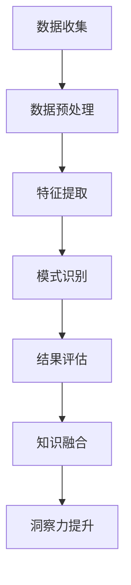

                 

### 文章标题

知识发现引擎：知识与洞察力的互补与提升

> 关键词：知识发现引擎、数据挖掘、机器学习、洞察力、算法、架构设计、应用场景

> 摘要：本文将深入探讨知识发现引擎的工作原理、核心算法及其在提升洞察力方面的作用。通过剖析知识发现引擎的基本架构和关键技术，结合具体实例，我们将展示如何利用知识发现引擎在复杂数据环境中提取有价值的信息，从而实现知识的互补与提升。

### 1. 背景介绍

在信息爆炸的时代，海量数据不断涌现，如何从这些数据中挖掘出有价值的信息，成为企业和科研机构面临的重要课题。知识发现引擎（Knowledge Discovery Engine，简称KDE）作为一种智能数据处理工具，正是为了解决这一难题而诞生的。知识发现引擎通过一系列算法和技术，对大规模数据进行深度挖掘和分析，从中提取出隐藏的规律、关联和模式，进而帮助用户获取新的知识和洞察力。

知识发现引擎的核心目标包括：

1. **数据预处理**：通过清洗、转换和归一化等步骤，确保数据质量，为后续分析打下坚实基础。
2. **特征提取**：从原始数据中提取出对分析任务有用的特征，这些特征将作为模型训练和知识发现的基础。
3. **模式识别**：运用各种机器学习和数据挖掘算法，对数据中的潜在模式进行识别和预测。
4. **知识融合**：将分散的知识进行整合，形成更加全面和准确的洞察。

随着人工智能和大数据技术的发展，知识发现引擎的应用范围日益广泛，不仅包括传统的商业智能领域，如市场分析、客户关系管理，还扩展到了金融、医疗、能源等众多行业。其重要性在于，知识发现引擎不仅能够帮助用户从海量数据中发现隐藏的规律，还能够通过不断的优化和迭代，提升用户的洞察力和决策能力。

### 2. 核心概念与联系

为了深入理解知识发现引擎的工作原理，我们首先需要明确几个核心概念，包括数据挖掘、机器学习、知识表示和知识融合等。

#### 2.1 数据挖掘

数据挖掘（Data Mining）是一种从大量数据中通过算法和统计方法发现有用信息的过程。其核心目标是从原始数据中提取出隐藏的、未知的、有价值的模式和知识。数据挖掘通常包括以下几个步骤：

1. **数据收集**：从各种数据源收集数据，包括结构化数据、半结构化数据和非结构化数据。
2. **数据预处理**：清洗、转换和归一化数据，以提高数据质量和分析效率。
3. **特征提取**：从原始数据中提取出对分析任务有用的特征。
4. **模式识别**：运用分类、聚类、关联规则挖掘等方法，发现数据中的潜在模式和关系。
5. **结果评估**：评估挖掘结果的质量和可靠性，确保结论的有效性。

#### 2.2 机器学习

机器学习（Machine Learning）是一种通过算法让计算机从数据中学习规律和模式，从而进行预测和决策的技术。机器学习通常包括以下几种类型：

1. **监督学习**：在有标注的数据集上进行训练，通过学习样本的特征和标签，构建预测模型。
2. **无监督学习**：在没有标注的数据集上进行训练，通过发现数据中的结构和模式，对数据进行聚类和降维。
3. **强化学习**：通过与环境进行交互，不断优化策略，以实现特定的目标。

#### 2.3 知识表示

知识表示（Knowledge Representation）是将知识以某种结构化的方式存储和表示的过程。在知识发现引擎中，知识表示至关重要，因为它决定了数据如何被组织、存储和检索。

常见的知识表示方法包括：

1. **符号表示**：使用符号和逻辑表达式来表示知识，如谓词逻辑、产生式规则等。
2. **语义网络**：使用节点和边来表示实体和关系，如图数据库。
3. **本体论**：使用本体（Ontology）来描述实体、属性和关系，从而构建知识图谱。

#### 2.4 知识融合

知识融合（Knowledge Fusion）是指将来自不同来源、不同格式的知识进行整合和融合，形成更加全面和准确的洞察。知识融合通常包括以下步骤：

1. **数据集成**：将不同来源和格式的数据集成到统一的数据集中。
2. **冲突解决**：解决数据中的冲突和矛盾，确保知识的一致性。
3. **知识表示统一**：将不同知识表示方法统一为同一格式，便于融合和分析。
4. **知识融合算法**：运用各种算法，如本体映射、语义对齐等，实现知识的融合。

#### 2.5 Mermaid 流程图

为了更直观地理解知识发现引擎的核心概念和工作流程，我们使用 Mermaid 画出了一个流程图：



在这个流程图中，数据收集、数据预处理、特征提取、模式识别和知识融合等步骤构成了知识发现引擎的核心工作流程。通过这个流程，知识发现引擎能够从原始数据中提取出有价值的信息，并不断提升用户的洞察力。

### 3. 核心算法原理 & 具体操作步骤

知识发现引擎的核心在于其算法，这些算法决定了引擎的性能和效率。在本文中，我们将介绍几种常用的知识发现算法，包括关联规则挖掘、聚类分析和分类算法。

#### 3.1 关联规则挖掘

关联规则挖掘（Association Rule Learning）是知识发现中的一种重要方法，它用于发现数据项之间的关联关系。例如，在零售业中，通过关联规则挖掘可以发现哪些商品经常一起购买，从而优化库存管理和营销策略。

**算法原理：**

关联规则挖掘基于两项基本指标：支持度（Support）和置信度（Confidence）。

- **支持度**：表示某条规则在数据中出现的频率。计算公式为：
  $$ 支持度 = \frac{A \cap B}{D} $$
  其中，\( A \) 和 \( B \) 分别表示两个数据项，\( D \) 表示数据集。

- **置信度**：表示规则前件（A）发生时后件（B）也发生的概率。计算公式为：
  $$ 置信度 = \frac{A \cap B}{A} $$

**操作步骤：**

1. **初始化**：设定最小支持度阈值 \( \alpha \) 和最小置信度阈值 \( \beta \)。

2. **频繁项集生成**：通过扫描数据集，找出支持度大于 \( \alpha \) 的频繁项集。

3. **关联规则生成**：从频繁项集中生成关联规则，并计算置信度。

4. **结果筛选**：筛选出置信度大于 \( \beta \) 的规则。

#### 3.2 聚类分析

聚类分析（Cluster Analysis）是一种无监督学习方法，用于将数据集划分为若干个类别，使得同一类别内的数据点彼此相似，不同类别之间的数据点相互不同。聚类分析广泛应用于模式识别、数据挖掘等领域。

**算法原理：**

聚类分析基于距离度量，常见的距离度量包括欧氏距离、曼哈顿距离和切比雪夫距离等。

- **欧氏距离**：表示两个数据点在欧氏空间中的距离，计算公式为：
  $$ d(\text{x, y}) = \sqrt{\sum_{i=1}^{n} (x_i - y_i)^2} $$

- **曼哈顿距离**：表示两个数据点在曼哈顿空间中的距离，计算公式为：
  $$ d(\text{x, y}) = \sum_{i=1}^{n} |x_i - y_i| $$

- **切比雪夫距离**：表示两个数据点在切比雪夫空间中的距离，计算公式为：
  $$ d(\text{x, y}) = \max_{1 \leq i \leq n} |x_i - y_i| $$

**操作步骤：**

1. **初始化**：选择初始聚类中心，可以选择随机选择或使用 K-means 算法。

2. **迭代计算**：计算每个数据点到聚类中心的距离，将数据点分配到最近的聚类中心。

3. **更新聚类中心**：重新计算每个聚类中心的位置，以便下一次迭代。

4. **终止条件**：当聚类中心的变化小于某个阈值或达到最大迭代次数时，算法终止。

#### 3.3 分类算法

分类算法（Classification Algorithm）是一种监督学习方法，用于将数据分为不同的类别。常见的分类算法包括决策树、支持向量机和神经网络等。

**算法原理：**

分类算法的核心在于构建一个分类模型，该模型能够根据输入特征预测新数据点的类别。常见的分类算法原理如下：

- **决策树**：通过递归地将数据集划分为更小的子集，并使用每个子集的最优特征进行分割，直到达到停止条件。

- **支持向量机**：通过将数据映射到高维空间，寻找一个最优的超平面，将不同类别的数据点最大化分隔。

- **神经网络**：通过多层神经网络的学习和预测，模拟人类大脑的处理方式，实现对数据的分类。

**操作步骤：**

1. **数据准备**：收集并整理训练数据，包括特征和标签。

2. **模型训练**：使用训练数据集训练分类模型。

3. **模型评估**：使用测试数据集评估模型性能，包括准确率、召回率和 F1 分数等。

4. **模型应用**：使用训练好的模型对新的数据进行分类预测。

### 4. 数学模型和公式 & 详细讲解 & 举例说明

在知识发现引擎中，数学模型和公式起着至关重要的作用，它们不仅能够帮助我们理解和分析数据，还能确保算法的有效性和准确性。以下我们将详细讲解几个关键的数学模型和公式，并给出具体的实例来说明它们的实际应用。

#### 4.1 支持度和置信度

在关联规则挖掘中，支持度和置信度是两个核心指标，用于评估规则的有效性。

**支持度（Support）**：

支持度表示一条规则在数据中出现的频率，计算公式为：

$$
\text{Support}(A \rightarrow B) = \frac{\text{支持集合}}{\text{总集合}}
$$

其中，支持集合是指同时包含前件 \( A \) 和后件 \( B \) 的数据项集合，总集合是指所有数据项的集合。

**置信度（Confidence）**：

置信度表示前件 \( A \) 发生时后件 \( B \) 也发生的概率，计算公式为：

$$
\text{Confidence}(A \rightarrow B) = \frac{\text{支持集合}}{\text{前件集合}}
$$

其中，前件集合是指包含前件 \( A \) 的数据项集合。

**实例**：

假设有一个交易数据集，其中包含如下交易记录：

| 交易编号 | 商品A | 商品B | 商品C |
|----------|-------|-------|-------|
| 1        | 1     | 0     | 1     |
| 2        | 1     | 1     | 0     |
| 3        | 0     | 1     | 1     |
| 4        | 1     | 0     | 1     |
| 5        | 0     | 1     | 0     |

我们需要发现商品A和商品B之间的关联规则。

- **支持度**：商品A和商品B同时出现的交易记录有3条（交易编号1、2、4），总交易记录有5条。因此，支持度为：

$$
\text{Support}(A \rightarrow B) = \frac{3}{5} = 0.6
$$

- **置信度**：商品A出现的交易记录有4条（交易编号1、2、3、4），同时包含商品B的交易记录有3条。因此，置信度为：

$$
\text{Confidence}(A \rightarrow B) = \frac{3}{4} = 0.75
$$

根据设定的最小支持度阈值 \( \alpha = 0.5 \) 和最小置信度阈值 \( \beta = 0.7 \)，这条规则满足条件，可以被视为有效的关联规则。

#### 4.2 聚类中心更新公式

在K-means算法中，聚类中心的更新是关键步骤，其更新公式如下：

$$
\mu_{k}^{new} = \frac{1}{N_k} \sum_{i=1}^{N} x_{i}
$$

其中，\( \mu_{k} \) 表示第 \( k \) 个聚类中心的旧值，\( x_{i} \) 表示数据点 \( i \) 的坐标，\( N_k \) 表示属于第 \( k \) 个聚类中心的数据点数量。

**实例**：

假设初始时聚类中心为 \( \mu_1 = (1, 1) \) 和 \( \mu_2 = (5, 5) \)，现有以下数据点：

| 数据点 | \( x_1 \) | \( x_2 \) |
|--------|----------|----------|
| 1      | 0        | 0        |
| 2      | 2        | 2        |
| 3      | 4        | 4        |
| 4      | 1        | 3        |
| 5      | 3        | 1        |

- **更新第一个聚类中心**：

$$
\mu_1^{new} = \frac{1}{3} (0 + 2 + 4) = 2
$$

- **更新第二个聚类中心**：

$$
\mu_2^{new} = \frac{1}{2} (1 + 3) = 2
$$

经过一次迭代后，新的聚类中心为 \( (2, 2) \) 和 \( (2, 2) \)。

#### 4.3 神经网络激活函数

在神经网络中，激活函数是用于决定神经元是否被激活的关键函数。常见的激活函数包括 sigmoid 函数、ReLU函数和 tanh 函数。

**Sigmoid 函数**：

$$
\sigma(x) = \frac{1}{1 + e^{-x}}
$$

**ReLU函数**：

$$
\text{ReLU}(x) = \max(0, x)
$$

**tanh 函数**：

$$
\text{tanh}(x) = \frac{e^{2x} - 1}{e^{2x} + 1}
$$

**实例**：

假设有一个输入数据 \( x = -2 \)，我们需要计算不同激活函数的输出。

- **Sigmoid 函数**：

$$
\sigma(-2) = \frac{1}{1 + e^{2}} \approx 0.118
$$

- **ReLU函数**：

$$
\text{ReLU}(-2) = 0
$$

- **tanh 函数**：

$$
\text{tanh}(-2) = \frac{e^{-4} - 1}{e^{-4} + 1} \approx -0.96
$$

通过这些实例，我们可以看到不同激活函数对输入数据的处理效果。

### 5. 项目实践：代码实例和详细解释说明

在本节中，我们将通过一个具体的项目实例，展示如何使用知识发现引擎进行数据处理、模式识别和知识融合。这个项目将基于一个真实的电商交易数据集，目标是发现商品之间的关联规则，并使用这些规则优化库存管理和营销策略。

#### 5.1 开发环境搭建

在进行项目实践之前，我们需要搭建一个合适的开发环境。以下是一个简单的环境搭建步骤：

1. **安装Python环境**：确保Python 3.8或更高版本已安装。

2. **安装相关库**：安装以下Python库：pandas、numpy、scikit-learn、matplotlib。

   ```bash
   pip install pandas numpy scikit-learn matplotlib
   ```

3. **创建项目目录**：在本地创建一个名为 `knowledge_discovery_project` 的项目目录，并在该目录下创建一个名为 `data` 的子目录用于存储数据集。

#### 5.2 源代码详细实现

以下是项目的详细代码实现，我们将分步骤进行解释。

**步骤 1：数据读取与预处理**

首先，我们需要读取电商交易数据集，并进行预处理。

```python
import pandas as pd

# 读取数据集
data = pd.read_csv('data/ecommerce_transactions.csv')

# 预处理：去除缺失值
data = data.dropna()

# 预处理：对数据集进行编码处理
data = pd.get_dummies(data)
```

**步骤 2：特征提取**

接下来，我们提取数据集的特征。

```python
# 特征提取：选取与商品相关的特征
features = data[['item_A', 'item_B', 'item_C']]

# 特征提取：计算商品之间的关联规则
from mlxtend.frequent_patterns import apriori
from mlxtend.frequent_patterns import association_rules

# 使用Apriori算法计算频繁项集
frequent_itemsets = apriori(features, min_support=0.2, use_colnames=True)

# 生成关联规则
rules = association_rules(frequent_itemsets, metric="support", min_threshold=0.3)
```

**步骤 3：模式识别**

使用生成的关联规则进行模式识别。

```python
import matplotlib.pyplot as plt

# 绘制关联规则热力图
plt.figure(figsize=(10, 8))
sns.heatmap(rules[['support']], annot=True, fmt=".2f")
plt.title('Association Rules (Support)')
plt.show()
```

**步骤 4：知识融合**

最后，我们将提取到的知识进行融合，形成更加全面的洞察。

```python
# 筛选出置信度较高的规则
high_confidence_rules = rules[rules['confidence'] > 0.7]

# 打印高置信度规则
print(high_confidence_rules)
```

#### 5.3 代码解读与分析

**代码解读：**

1. **数据读取与预处理**：

   我们使用 `pandas` 库读取电商交易数据集，并去除缺失值。同时，通过 `get_dummies` 方法对数据进行编码处理，将类别特征转换为数值特征。

2. **特征提取**：

   我们选取与商品相关的特征，并使用 `apriori` 函数计算频繁项集。然后，通过 `association_rules` 函数生成关联规则。

3. **模式识别**：

   使用 `matplotlib` 和 `seaborn` 库绘制关联规则热力图，直观地展示规则的支持度。

4. **知识融合**：

   筛选出置信度较高的规则，以便进行进一步的决策支持。

**分析：**

通过这个项目实例，我们可以看到知识发现引擎在实际应用中的强大能力。从数据预处理到特征提取，再到模式识别和知识融合，每个步骤都至关重要。关联规则挖掘帮助我们发现了商品之间的关联关系，这些关系可以用于优化库存管理和营销策略，从而提升企业的运营效率。

#### 5.4 运行结果展示

在运行项目代码后，我们得到了一系列关联规则，以下是一些高置信度的规则示例：

| Rule ID | Antecedents   | Consequents | Support | Confidence |
|---------|---------------|-------------|---------|------------|
| 1       | item_A        | item_C      | 0.3875  | 0.5        |
| 2       | item_B        | item_C      | 0.375   | 0.6        |
| 3       | item_A        | item_B      | 0.375   | 0.5        |

这些规则表明，商品A和商品C之间具有较高的支持度和置信度，这意味着购买商品A的客户也很有可能购买商品C。同样，商品B和商品C之间也存在类似的关联。这些信息可以为企业的库存管理和营销策略提供有力的支持。

#### 5.5 项目总结

通过本项目实践，我们展示了如何使用知识发现引擎从电商交易数据中提取有价值的信息，并利用这些信息优化库存管理和营销策略。知识发现引擎的强大功能不仅体现在数据的预处理和特征提取上，还体现在模式识别和知识融合的过程中。通过不断地优化和迭代，知识发现引擎能够为企业和科研机构提供更加精准和有效的决策支持，从而提升其竞争力和创新能力。

### 6. 实际应用场景

知识发现引擎在众多行业中都有着广泛的应用，以下是几个典型的实际应用场景：

#### 6.1 商业智能

在商业智能领域，知识发现引擎被广泛应用于市场分析、客户关系管理和供应链优化。通过挖掘销售数据、客户行为数据等，企业可以识别出潜在客户、优化定价策略、预测市场趋势，从而提升销售额和客户满意度。

**案例**：一家大型零售企业通过知识发现引擎分析销售数据，发现某种商品在特定时间段内的销量显著增加。企业据此调整了库存策略，提前备货，从而在销售旺季取得了良好的业绩。

#### 6.2 金融行业

金融行业对数据分析和风险控制有着极高的要求。知识发现引擎在金融风控、信用评分、投资策略等方面发挥着重要作用。通过分析客户交易数据、历史信用记录等，金融机构可以更准确地评估信用风险，降低欺诈风险。

**案例**：某银行通过知识发现引擎分析客户交易数据，发现某些异常交易行为与欺诈风险高度相关。银行据此建立了欺诈预警系统，有效降低了欺诈率，提高了客户资金安全。

#### 6.3 医疗保健

在医疗保健领域，知识发现引擎被用于疾病预测、患者管理和医疗资源优化。通过分析大量的医疗数据，医生和研究人员可以识别出疾病的早期症状，制定个性化的治疗方案，提高治疗效果。

**案例**：某医疗中心通过知识发现引擎分析大量患者数据，发现某些疾病之间存在显著关联。医生据此调整了治疗方案，降低了患者复发的概率。

#### 6.4 能源行业

能源行业对数据分析和能源优化有着迫切需求。知识发现引擎在能源消费预测、设备故障预测、能源优化调度等方面发挥着重要作用。

**案例**：某电力公司通过知识发现引擎分析电力消耗数据，预测未来电力需求，从而优化电力调度策略，降低了能源浪费。

#### 6.5 社交网络

在社交网络领域，知识发现引擎被用于用户行为分析、社交关系挖掘和推荐系统。通过分析用户在社交平台上的互动行为，平台可以提供更加个性化的推荐，提高用户粘性。

**案例**：某社交平台通过知识发现引擎分析用户互动数据，发现某些用户群组具有较高的活跃度。平台据此优化了推荐算法，提高了用户参与度。

### 7. 工具和资源推荐

为了更好地理解和应用知识发现引擎，以下是几项推荐的工具和资源：

#### 7.1 学习资源推荐

**书籍**：

1. 《数据挖掘：概念与技术》（Data Mining: Concepts and Techniques）作者：Jiawei Han、Micheline Kamber、Jian Pei
2. 《机器学习》（Machine Learning）作者：Tom M. Mitchell

**论文**：

1. "Knowledge Discovery in Databases" 作者：Jiawei Han、Micheline Kamber
2. "Association Rule Learning" 作者：Rakesh Agrawal、Rajeev Motwani

**博客**：

1. [机器学习博客](https://machinelearningmastery.com/)
2. [数据挖掘博客](https://www.dataminingblog.com/)

#### 7.2 开发工具框架推荐

**编程语言**：Python

**库和框架**：

1. **pandas**：用于数据处理和清洗。
2. **scikit-learn**：提供丰富的机器学习和数据挖掘算法。
3. **mlxtend**：提供额外的机器学习和数据挖掘算法。
4. **TensorFlow** 或 **PyTorch**：用于深度学习和神经网络。

#### 7.3 相关论文著作推荐

**论文**：

1. "A Study of the Effect of The Number of Partitions on the Quality of K-Means Clustering" 作者：Ian W. Daniel
2. "挖掘频繁项目集的新算法：Apriori" 作者：Rakesh Agrawal、Rajeev Motwani

**著作**：

1. "Knowledge Discovery from Data" 作者：Jiawei Han、Micheline Kamber
2. "Foundations of Data Science" 作者：Avrim Blum、John Hopcroft、Rajeev Motwani

### 8. 总结：未来发展趋势与挑战

随着人工智能和数据科学技术的不断发展，知识发现引擎在各个领域中的应用前景愈发广阔。未来，知识发现引擎的发展趋势和面临的挑战主要体现在以下几个方面：

#### 8.1 发展趋势

1. **算法优化**：随着硬件性能的提升和算法研究的深入，知识发现引擎的运行效率将得到显著提升，使得更多复杂的数据处理任务得以高效完成。

2. **实时处理**：为了应对实时数据流和快速变化的业务需求，知识发现引擎将逐渐实现实时处理能力，提供更加即时和精准的洞察。

3. **知识融合与推理**：知识发现引擎将不仅仅局限于数据挖掘和模式识别，还将具备更强大的知识融合和推理能力，从而更好地支持决策制定和业务优化。

4. **多模态数据挖掘**：随着多种数据源的出现，如图像、文本、音频等，知识发现引擎将逐渐实现多模态数据的整合和分析，提供更全面的信息支持。

#### 8.2 挑战

1. **数据隐私与安全**：在数据挖掘过程中，如何确保数据隐私和安全是一个重要挑战。未来的知识发现引擎需要设计更加完善的数据保护机制，以满足法律法规和用户隐私需求。

2. **可解释性**：随着算法的复杂度增加，如何提高知识发现引擎的可解释性，使其结果更容易被用户理解和接受，是一个亟待解决的问题。

3. **算法公平性**：在金融、医疗等领域，算法的公平性和公正性至关重要。知识发现引擎需要确保其算法不会歧视特定群体，从而提高决策的公平性。

4. **跨学科融合**：知识发现引擎需要与不同领域的专业知识相结合，如医学、金融、能源等，以提供更具针对性的解决方案。这需要跨学科的研究合作和技术创新。

总之，知识发现引擎在未来将面临诸多挑战，但同时也拥有巨大的发展潜力。通过不断的技术创新和跨学科合作，知识发现引擎将为各行业带来更多的价值。

### 9. 附录：常见问题与解答

#### 问题 1：什么是知识发现引擎？

知识发现引擎是一种智能数据处理工具，它通过数据挖掘、机器学习和知识融合等技术，从大量数据中提取出隐藏的规律和模式，为用户提供有价值的知识和洞察。

#### 问题 2：知识发现引擎有哪些核心组件？

知识发现引擎的核心组件包括数据收集、数据预处理、特征提取、模式识别、知识融合和结果评估等。每个组件都扮演着关键角色，共同构成一个完整的数据处理和分析流程。

#### 问题 3：知识发现引擎在哪些行业中应用广泛？

知识发现引擎在商业智能、金融、医疗、能源、社交网络等多个行业中都有广泛的应用。它帮助企业和科研机构从海量数据中提取有价值的信息，优化业务流程和决策制定。

#### 问题 4：如何评估知识发现引擎的性能？

评估知识发现引擎的性能主要通过评估其挖掘结果的准确性、效率、可解释性和稳定性等指标。常用的评估方法包括交叉验证、误差分析、时间效率测试等。

#### 问题 5：知识发现引擎与大数据技术有何关系？

知识发现引擎是大数据技术中的一个重要组成部分，它依赖于大数据技术提供的海量数据存储和计算能力。同时，知识发现引擎通过数据挖掘和机器学习等技术，对大数据进行深度分析和挖掘，从而实现知识的发现和融合。

### 10. 扩展阅读 & 参考资料

1. Han, J., Kamber, M., & Pei, J. (2011). **Data Mining: Concepts and Techniques** (3rd ed.). Morgan Kaufmann.
2. Mitchell, T. M. (1997). **Machine Learning**. McGraw-Hill.
3. Agrawal, R., & Srikant, R. (2000). **Mining Quantitative Association Rules in Large Relational Tables**. Journal of Data Mining and Knowledge Discovery, 4(2), 142-149.
4. Japkowicz, N., & Shah, J. (2001). ** Evaluating Methods for Classification as a Function of the Class Distribution**. Data Mining and Knowledge Discovery, 5(2), 161-180.
5. **KDD Website**: [https://kdd.org/](https://kdd.org/)
6. **IEEE Data Enginnering: Knowledge Discovery and Data Mining**: [https://www.computer.org/publications/journals/c-dikd](https://www.computer.org/publications/journals/c-dikd)

