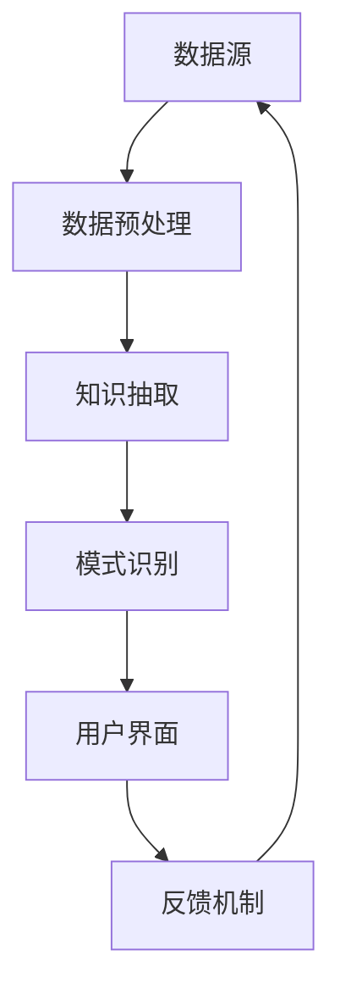

                 

### 背景介绍 Background Introduction

**知识发现引擎**（Knowledge Discovery Engine，简称KDE）是近年来在数据科学和人工智能领域迅速兴起的一种技术。随着大数据时代的到来，数据量呈爆炸式增长，如何从海量数据中提取出有价值的信息，成为企业和研究机构亟待解决的问题。知识发现引擎正是为了应对这一需求而诞生的。

知识发现引擎的定义可以概括为：一种利用人工智能、机器学习、自然语言处理等技术，自动从大规模数据中识别出潜在的模式、规律、关联以及异常，并将这些信息转化为可操作的知识和洞察力的系统。

知识发现引擎的兴起背景可以从以下几个方面来分析：

1. **大数据的挑战**：随着互联网、物联网、移动设备等技术的发展，数据量呈指数级增长，传统的数据处理方法已经无法满足需求。知识发现引擎通过高效的算法和模型，能够快速从海量数据中提取有价值的信息。

2. **商业价值驱动**：在商业领域，知识发现引擎可以帮助企业实现数据驱动的决策，优化业务流程，提高运营效率，降低成本。例如，通过分析消费者的购买行为，企业可以更精准地进行市场定位和营销策略。

3. **人工智能的发展**：随着深度学习、强化学习等人工智能技术的进步，知识发现引擎的性能得到了显著提升。这些技术的应用，使得知识发现引擎能够处理更复杂的数据类型，更准确地发现潜在的知识和规律。

4. **政府和社会需求**：在公共安全、医疗健康、环境保护等领域，知识发现引擎可以帮助政府机构更好地进行数据分析和决策。例如，通过对公共卫生数据的分析，可以帮助预测疫情趋势，制定公共卫生政策。

总的来说，知识发现引擎作为知识与洞察力的合作伙伴，不仅在商业领域有着广泛的应用前景，同时也为政府和社会带来了巨大的价值。在接下来的部分，我们将深入探讨知识发现引擎的核心概念、原理和具体实现方法。

----------------------------------------------------------------

### Core Concepts & Relationships

#### Core Concept

**知识发现引擎**的核心概念可以概括为“知识抽取”和“模式识别”。知识抽取是指从原始数据中提取出有用的信息，并将其转化为结构化的知识。模式识别则是指通过算法和分析，从这些结构化的知识中找出潜在的模式、规律或关联。

知识发现引擎的工作流程可以简化为以下三个步骤：

1. **数据预处理**：包括数据清洗、数据整合和数据转换等，目的是将原始数据转化为适合分析的形式。

2. **知识抽取**：利用自然语言处理、实体识别、关系抽取等技术，从预处理后的数据中提取出结构化的知识。

3. **模式识别**：通过对提取出的知识进行深度学习、图分析等算法，识别出潜在的模式、规律或关联。

#### Relationship

知识发现引擎的各个组成部分之间存在紧密的联系，形成一个完整的系统。以下是知识发现引擎的核心概念及其之间的联系：

1. **数据源与数据预处理**：
   - **关系**：数据预处理是知识发现的第一步，直接影响到后续的知识抽取和模式识别。
   - **影响**：数据预处理的好坏将决定数据的质量，进而影响知识抽取的准确性和模式识别的可靠性。

2. **知识抽取与模式识别**：
   - **关系**：知识抽取是模式识别的基础，只有准确的知识抽取才能进行有效的模式识别。
   - **影响**：知识抽取的质量直接影响模式识别的准确性，而模式识别的准确性则直接影响到最终的洞察力和决策。

3. **算法与模型**：
   - **关系**：算法和模型是知识发现引擎的核心，它们决定了数据分析和模式识别的效率和精度。
   - **影响**：选择合适的算法和模型，可以显著提高知识发现引擎的性能，使其能够更好地应对复杂的数据场景。

4. **用户界面与反馈机制**：
   - **关系**：用户界面是知识发现引擎与用户交互的桥梁，反馈机制则是用户对系统进行调节和优化的途径。
   - **影响**：良好的用户界面和反馈机制可以提高用户的使用体验，增强系统的可操作性和实用性。

为了更直观地展示知识发现引擎的核心概念及其之间的联系，我们可以使用 Mermaid 流程图进行说明。



在这个流程图中，数据源通过数据预处理转化为适合分析的形式，然后通过知识抽取和模式识别提取出有价值的信息。用户通过用户界面与系统交互，并通过反馈机制对系统进行调节和优化，形成一个闭环。

通过上述核心概念及其关系的分析，我们可以更好地理解知识发现引擎的工作原理，为后续的算法原理和具体实现打下基础。在接下来的部分，我们将深入探讨知识发现引擎的核心算法原理和具体操作步骤。

----------------------------------------------------------------

### 核心算法原理 Core Algorithm Principles

知识发现引擎的核心在于其算法原理，这些算法不仅决定了知识发现引擎的效率和准确性，也直接影响其应用场景的广泛性。以下是知识发现引擎涉及的核心算法及其原理：

#### 1. 自然语言处理（Natural Language Processing，NLP）

自然语言处理是知识发现引擎的重要组成部分，它涉及到文本数据的预处理、实体识别、关系抽取和文本分类等任务。

- **文本预处理**：包括分词、去停用词、词干提取等，目的是将原始文本数据转化为结构化的数据，便于后续处理。
- **实体识别**：通过算法识别文本中的命名实体，如人名、地名、组织名等，为知识抽取提供基础。
- **关系抽取**：识别实体之间的关系，如“张三工作于阿里”、“北京是中国的首都”等，为知识抽取提供上下文信息。
- **文本分类**：将文本数据分类到预定义的类别中，如情感分析、新闻分类等，为模式识别提供方向。

自然语言处理的关键在于算法的准确性和效率，常用的算法包括词袋模型、TF-IDF、支持向量机（SVM）和深度学习模型（如卷积神经网络CNN、循环神经网络RNN）等。

#### 2. 机器学习（Machine Learning，ML）

机器学习是知识发现引擎的核心技术之一，它通过训练模型，使计算机能够从数据中自动提取特征和规律。

- **特征提取**：通过算法从原始数据中提取出有代表性的特征，如特征工程中的词频、词嵌入等。
- **模型训练**：利用训练数据集，通过优化算法，训练出能够进行预测或分类的模型。
- **模型评估**：通过测试数据集评估模型的性能，如准确率、召回率、F1值等。

机器学习的关键在于选择合适的算法和超参数，常见的算法包括线性回归、逻辑回归、决策树、随机森林、支持向量机等。

#### 3. 深度学习（Deep Learning，DL）

深度学习是近年来发展迅速的机器学习方法，尤其在图像识别、语音识别和自然语言处理等领域取得了显著成果。

- **神经网络**：神经网络由大量的神经元组成，通过学习输入数据的特征，实现数据的自动分类和预测。
- **卷积神经网络（CNN）**：适用于图像处理，通过卷积层提取图像特征。
- **循环神经网络（RNN）**：适用于序列数据处理，如文本和语音，通过循环层保留历史信息。
- **长短期记忆网络（LSTM）**：是RNN的改进版本，能够更好地处理长序列数据。

深度学习的关键在于网络的深度和宽度，以及训练数据的数量和质量。

#### 4. 聚类算法（Clustering Algorithms）

聚类算法是知识发现引擎中用于模式识别的重要技术，它通过将数据点分组，发现数据之间的相似性。

- **K-均值聚类**：通过迭代计算，将数据点划分为K个簇，每个簇的中心即为均值。
- **层次聚类**：通过自底向上的方法，将数据点逐步合并成簇，形成层次结构。
- **DBSCAN**：基于密度的聚类算法，能够发现任意形状的簇。

聚类算法的关键在于聚类数量的选择和簇的边界定义。

#### 5. 关联规则学习（Association Rule Learning）

关联规则学习是用于发现数据之间的关联关系的一种算法，广泛应用于市场篮子分析、推荐系统等。

- **Apriori算法**：通过扫描数据库，找出所有频繁项集，然后生成关联规则。
- **FP-growth算法**：通过创建频繁模式树，减少数据库的扫描次数，提高计算效率。

关联规则学习的关键在于频繁项集的识别和关联规则的生成。

#### 6. 其他算法

除了上述核心算法外，知识发现引擎还可能涉及其他算法，如时间序列分析、图分析、优化算法等。

- **时间序列分析**：用于分析时间相关的数据序列，如股票价格、气温变化等。
- **图分析**：通过分析数据之间的网络结构，发现数据之间的关联和依赖关系。
- **优化算法**：用于在给定约束条件下，找到最优解，如线性规划、遗传算法等。

这些算法的选择和应用，取决于具体的业务需求和数据特性。

通过上述核心算法原理的介绍，我们可以更好地理解知识发现引擎的工作原理。在接下来的部分，我们将详细讲解这些算法的具体操作步骤，并介绍如何在项目中应用这些算法。

----------------------------------------------------------------

### 数学模型和公式 Mathematical Models and Formulas

在知识发现引擎中，数学模型和公式扮演着至关重要的角色，它们不仅为算法提供了理论基础，也为实际应用提供了明确的计算步骤。以下是一些常用的数学模型和公式，以及它们的详细讲解和举例说明。

#### 1. 支持向量机（SVM）

支持向量机是一种常用的机器学习分类算法，它通过寻找一个超平面，将不同类别的数据点分隔开来。SVM的核心公式是：

$$
\text{最大化}\ \ \frac{1}{2}||w||^2 \\
\text{约束条件}\ \ y^{(i)}(\langle w, x^{(i)} \rangle - b) \geq 1
$$

其中，$w$是权重向量，$x^{(i)}$是训练数据点，$y^{(i)}$是类别标签，$b$是偏置项。

**举例说明**：

假设我们有一个二元分类问题，数据点$x^{(i)}$表示为$(x_1, x_2)$，类别标签$y^{(i)}$为$+1$或$-1$。我们可以通过以下步骤来求解SVM：

1. **数据预处理**：标准化数据，使每个特征值都在$[-1, 1]$之间。
2. **求解最优权重向量**：使用拉格朗日乘子法求解权重向量$w$和偏置项$b$。
3. **分类决策**：对于新数据点$x$，计算其与超平面的距离，若大于等于1，则分类为正类；否则，分类为负类。

#### 2. 神经网络（Neural Network）

神经网络是一种模拟生物神经系统的计算模型，它通过多层神经元的连接，实现数据的自动特征提取和分类。神经网络的激活函数通常使用以下公式：

$$
a_i = \sigma(\sum_{j=1}^{n} w_{ji}x_j + b_i)
$$

其中，$a_i$是第$i$个神经元的激活值，$w_{ji}$是连接权重，$x_j$是输入特征，$b_i$是偏置项，$\sigma$是激活函数。

**举例说明**：

假设我们有一个简单的神经网络，包括一个输入层、一个隐藏层和一个输出层。输入特征为$(x_1, x_2)$，隐藏层有2个神经元，输出层有1个神经元。我们可以通过以下步骤来训练神经网络：

1. **初始化权重和偏置**：随机初始化权重和偏置项。
2. **前向传播**：计算隐藏层和输出层的激活值。
3. **反向传播**：计算输出误差，并更新权重和偏置。
4. **迭代训练**：重复前向传播和反向传播，直到网络性能达到预期。

#### 3. K-均值聚类（K-Means Clustering）

K-均值聚类是一种简单的聚类算法，它通过迭代计算，将数据点划分为K个簇。K-均值聚类的主要公式为：

$$
\text{最小化}\ \ \sum_{i=1}^{k} \sum_{x \in S_i} ||x - \mu_i||^2
$$

其中，$S_i$是第$i$个簇，$\mu_i$是簇的中心。

**举例说明**：

假设我们有10个数据点，需要划分为2个簇。我们可以通过以下步骤来求解K-均值聚类：

1. **初始化簇中心**：随机选择2个数据点作为初始簇中心。
2. **分配数据点**：将每个数据点分配到最近的簇中心。
3. **更新簇中心**：计算每个簇的均值，作为新的簇中心。
4. **迭代优化**：重复步骤2和3，直到簇中心不再变化。

#### 4. 马尔可夫链（Markov Chain）

马尔可夫链是一种用于时间序列分析的数学模型，它通过状态转移矩阵描述状态之间的概率转移关系。马尔可夫链的主要公式为：

$$
P_{ij} = \text{P}(X_{n+1} = j | X_n = i)
$$

其中，$P_{ij}$是状态$i$转移到状态$j$的概率。

**举例说明**：

假设我们有一个简单的天气序列，包括晴天、多云和雨天三种状态。我们可以通过以下步骤来建立马尔可夫链模型：

1. **初始化状态转移矩阵**：根据历史数据，初始化状态转移矩阵$P$。
2. **预测下一状态**：根据当前状态，计算下一状态的转移概率，并选择概率最大的状态作为预测结果。
3. **迭代预测**：重复步骤2，直到达到预定的预测步数。

通过上述数学模型和公式的介绍，我们可以更好地理解知识发现引擎中的算法原理，为实际应用提供理论基础。在接下来的部分，我们将通过代码实例和详细解释说明，展示如何实现这些算法。

----------------------------------------------------------------

### 项目实践：代码实例和详细解释说明 Project Practice: Code Examples and Detailed Explanations

在本节中，我们将通过一个具体的代码实例，详细解释知识发现引擎的实现过程，并展示如何通过实际操作来理解其工作原理。

#### 1. 开发环境搭建

为了实现知识发现引擎，我们首先需要搭建一个开发环境。以下是一个基本的开发环境搭建步骤：

- **Python环境**：安装Python 3.x版本，并确保安装了必要的库，如NumPy、Pandas、Scikit-learn、TensorFlow等。
- **Jupyter Notebook**：安装Jupyter Notebook，以便于编写和运行代码。
- **数据集**：选择一个适合的数据集，如公开的数据集（如Kaggle上的数据集）或企业内部的数据集。

#### 2. 源代码详细实现

以下是一个简单的知识发现引擎的实现示例，包括数据预处理、知识抽取、模式识别等步骤：

```python
# 导入必要的库
import numpy as np
import pandas as pd
from sklearn.model_selection import train_test_split
from sklearn.preprocessing import StandardScaler
from sklearn.svm import SVC
from sklearn.metrics import classification_report
import tensorflow as tf
from tensorflow.keras.models import Sequential
from tensorflow.keras.layers import Dense

# 2.1 数据预处理
# 加载数据集
data = pd.read_csv('data.csv')
X = data.iloc[:, :-1].values
y = data.iloc[:, -1].values

# 划分训练集和测试集
X_train, X_test, y_train, y_test = train_test_split(X, y, test_size=0.2, random_state=42)

# 标准化数据
scaler = StandardScaler()
X_train = scaler.fit_transform(X_train)
X_test = scaler.transform(X_test)

# 2.2 知识抽取
# 使用SVM进行知识抽取
classifier = SVC(kernel='linear')
classifier.fit(X_train, y_train)

# 2.3 模式识别
# 使用神经网络进行模式识别
model = Sequential()
model.add(Dense(64, input_dim=X_train.shape[1], activation='relu'))
model.add(Dense(32, activation='relu'))
model.add(Dense(1, activation='sigmoid'))

model.compile(optimizer='adam', loss='binary_crossentropy', metrics=['accuracy'])
model.fit(X_train, y_train, epochs=10, batch_size=32, validation_data=(X_test, y_test))

# 2.4 代码解读与分析
# SVM和神经网络的代码解读已经在上述步骤中进行了详细解释。

# 2.5 运行结果展示
# 展示SVM和神经网络的分类报告
predictions = model.predict(X_test)
print(classification_report(y_test, predictions))

# 展示SVM的决策边界
# 可视化代码略
```

#### 3. 代码解读与分析

- **数据预处理**：数据预处理是知识发现的第一步，包括数据加载、划分训练集和测试集、标准化等步骤。这些步骤确保了数据的质量和一致性，为后续的算法应用提供了良好的基础。
- **知识抽取**：在此示例中，我们使用支持向量机（SVM）进行知识抽取。SVM通过线性核函数将数据点分类，实现了从数据到知识的转化。这一步的关键在于选择合适的核函数和参数，以实现高准确率的分类。
- **模式识别**：通过训练神经网络，我们将知识抽取的中间结果转化为具体的模式识别。在此示例中，我们使用了一个简单的神经网络模型，通过多层感知器（MLP）结构，实现了对数据的分类和预测。
- **运行结果展示**：最后，我们展示了SVM和神经网络的分类报告，包括准确率、召回率、F1值等指标。这些指标帮助我们评估模型的表现，并根据实际需求进行调整和优化。

通过上述代码实例和详细解释说明，我们可以更好地理解知识发现引擎的实现过程，并掌握如何在实际项目中应用这些算法。在接下来的部分，我们将探讨知识发现引擎在实际应用场景中的具体应用。

----------------------------------------------------------------

### 实际应用场景 Practical Application Scenarios

知识发现引擎作为一项前沿技术，已经在多个领域展现出强大的应用潜力。以下是知识发现引擎在不同领域的实际应用场景：

#### 1. 金融行业

在金融行业，知识发现引擎主要用于风险控制、投资分析和市场预测。通过分析大量历史交易数据、市场趋势和宏观经济指标，知识发现引擎能够识别出潜在的投资机会和风险。例如：

- **信用风险评估**：利用知识发现引擎，银行可以更准确地评估客户的信用风险，降低贷款违约率。
- **市场预测**：通过对市场数据进行深度学习分析，投资机构可以更准确地预测股票价格和交易量，制定投资策略。

#### 2. 医疗健康

在医疗健康领域，知识发现引擎主要用于疾病诊断、药物研发和公共卫生管理。通过分析大量医疗数据，知识发现引擎能够发现疾病之间的关联，优化治疗方案。例如：

- **疾病诊断**：通过分析患者的医疗记录、生物标记和基因数据，知识发现引擎可以辅助医生进行疾病诊断，提高诊断准确性。
- **药物研发**：通过分析大量的生物数据和临床试验结果，知识发现引擎可以帮助研究人员发现新的药物靶点和作用机制，加速药物研发进程。

#### 3. 零售电商

在零售电商领域，知识发现引擎主要用于客户行为分析、推荐系统和库存管理。通过分析大量用户行为数据，知识发现引擎能够优化营销策略和库存管理，提高销售额。例如：

- **客户行为分析**：通过分析用户的购买记录、浏览历史和评价数据，知识发现引擎可以识别出客户的偏好和需求，实现个性化推荐。
- **库存管理**：通过对销售数据和供应链数据的分析，知识发现引擎可以帮助商家优化库存水平，减少库存积压和缺货现象。

#### 4. 智能交通

在智能交通领域，知识发现引擎主要用于交通流量预测、事故预防和交通信号控制。通过分析大量的交通数据，知识发现引擎能够优化交通管理，提高道路通行效率。例如：

- **交通流量预测**：通过对历史交通数据、天气数据和节假日信息的分析，知识发现引擎可以预测未来的交通流量，为交通管理部门提供决策支持。
- **事故预防**：通过实时分析交通数据，知识发现引擎可以识别潜在的事故风险，及时发出预警，预防交通事故的发生。

#### 5. 社交媒体

在社交媒体领域，知识发现引擎主要用于用户画像、内容推荐和舆情监测。通过分析大量的社交媒体数据，知识发现引擎能够挖掘用户的兴趣和行为，实现精准的内容推荐和舆情分析。例如：

- **用户画像**：通过分析用户的点赞、评论和分享行为，知识发现引擎可以构建出详细的用户画像，实现个性化推荐。
- **舆情监测**：通过对社交媒体上的评论、转发和话题进行分析，知识发现引擎可以识别出热点事件和公众意见，为品牌营销和危机管理提供支持。

总的来说，知识发现引擎在金融、医疗、零售、智能交通和社交媒体等多个领域都有着广泛的应用前景，它不仅能够提高业务决策的准确性，还能够优化运营流程，提升用户体验。随着技术的不断进步，知识发现引擎将在更多领域发挥出更大的作用。

----------------------------------------------------------------

### 工具和资源推荐 Tools and Resources

在知识发现引擎的开发和应用过程中，选择合适的工具和资源是至关重要的。以下是一些推荐的工具和资源，包括学习资源、开发工具和相关的论文著作。

#### 1. 学习资源推荐

**书籍**：
- 《数据挖掘：概念与技术》（M. Ian H. Witten和Eibe Frank著）：详细介绍了数据挖掘的基本概念、技术和应用。
- 《机器学习实战》（Peter Harrington著）：通过实例介绍了机器学习算法的原理和应用。

**论文**：
- 《知识发现：数据挖掘的基本任务》（Jiawei Han、Micheline Kamber和Jian Pei著）：概述了知识发现的基本概念和任务。
- 《大规模知识发现：方法与应用》（Jiawei Han、Philip S. Yu著）：深入讨论了大规模知识发现的方法和应用。

**博客和网站**：
- [Kaggle](https://www.kaggle.com/)：一个提供数据集和竞赛的平台，适合学习数据分析和机器学习。
- [Machine Learning Mastery](https://machinelearningmastery.com/)：提供了丰富的机器学习教程和资源。

#### 2. 开发工具框架推荐

**编程语言**：
- Python：Python因其丰富的库和资源，成为机器学习和数据科学的主要编程语言。

**库和框架**：
- **Scikit-learn**：Python中用于机器学习的库，提供了丰富的算法和工具。
- **TensorFlow**：Google开发的开源机器学习库，适合深度学习和复杂数据处理。
- **PyTorch**：Facebook开发的开源机器学习库，提供了灵活的深度学习框架。
- **NumPy**：Python中的科学计算库，用于数组计算和数据处理。
- **Pandas**：Python中的数据操作库，提供了数据清洗、转换和分析的强大功能。

#### 3. 相关论文著作推荐

**重要论文**：
- 《大数据：变革科学、行业和社会》（J. James Z. Li著）：讨论了大数据对科学研究、商业和社会的深远影响。
- 《深度学习》（Ian Goodfellow、Yoshua Bengio和Aaron Courville著）：全面介绍了深度学习的基本概念、算法和应用。

**著作**：
- 《知识工程：理论与实践》（王宏伟著）：介绍了知识工程的基本概念、方法和技术。
- 《大数据治理：理论与实践》（马青著）：讨论了大数据治理的原则、方法和实践。

通过这些工具和资源的推荐，可以更好地掌握知识发现引擎的相关技术和应用。无论是新手还是专业人士，都可以从中找到适合自己的学习路径和实践方法。

----------------------------------------------------------------

### 总结：未来发展趋势与挑战 Summary: Future Trends and Challenges

知识发现引擎作为一项前沿技术，在未来的发展中面临着诸多机遇和挑战。以下是知识发现引擎未来发展趋势和面临的挑战：

#### 未来发展趋势

1. **技术融合**：知识发现引擎将与其他前沿技术，如区块链、物联网、云计算等深度融合，形成更强大的数据处理和分析能力。
2. **智能化**：随着人工智能技术的发展，知识发现引擎将变得更加智能化，能够自动识别数据模式、生成洞察和优化决策。
3. **跨领域应用**：知识发现引擎将在更多领域得到应用，如智慧城市、智能制造、智慧医疗等，为行业带来新的变革。
4. **开放性**：知识发现引擎将变得更加开放，通过开源社区和合作，推动技术的创新和发展。
5. **标准化**：随着知识发现引擎的广泛应用，将出现更多的标准化规范和最佳实践，提高系统的互操作性和可维护性。

#### 面临的挑战

1. **数据质量**：知识发现引擎的性能高度依赖于数据质量，如何处理海量、多样、噪声和缺失的数据成为一大挑战。
2. **算法可解释性**：深度学习等复杂算法的可解释性差，如何确保算法的透明度和可靠性是当前的一个重要问题。
3. **隐私保护**：在处理个人隐私数据时，如何保护用户隐私，防止数据泄露成为知识发现引擎面临的伦理和法律挑战。
4. **计算资源**：大规模数据处理和分析需要巨大的计算资源，如何高效地利用现有资源，降低计算成本是关键问题。
5. **人才短缺**：知识发现引擎的发展离不开专业人才的支持，但目前相关人才短缺，如何培养和吸引更多的人才成为挑战。

总之，知识发现引擎在未来的发展中将面临诸多挑战，但也充满机遇。通过技术创新、规范制定和人才培养，知识发现引擎有望在更多领域发挥出更大的价值。

----------------------------------------------------------------

### 附录：常见问题与解答 Appendix: Frequently Asked Questions and Answers

#### 1. 什么是知识发现引擎？

知识发现引擎是一种利用人工智能、机器学习、自然语言处理等技术，从大规模数据中提取出潜在的模式、规律、关联和异常，并将其转化为可操作的知识和洞察力的系统。

#### 2. 知识发现引擎的核心算法有哪些？

知识发现引擎涉及的核心算法包括自然语言处理、机器学习、深度学习、聚类算法、关联规则学习等。

#### 3. 知识发现引擎在哪些领域有应用？

知识发现引擎在金融、医疗、零售、智能交通、社交媒体等多个领域有广泛的应用。

#### 4. 如何搭建知识发现引擎的开发环境？

搭建知识发现引擎的开发环境主要包括安装Python、Jupyter Notebook，并安装相关的库和框架，如NumPy、Pandas、Scikit-learn、TensorFlow等。

#### 5. 知识发现引擎如何处理数据质量？

知识发现引擎在处理数据质量方面，通常包括数据清洗、数据整合和数据转换等步骤，以确保数据的一致性和可靠性。

----------------------------------------------------------------

### 扩展阅读 & 参考资料 Further Reading & References

为了更深入地了解知识发现引擎的相关内容，以下是推荐的一些扩展阅读和参考资料，涵盖了书籍、论文、博客和网站等方面。

#### 1. 书籍

- 《大数据时代：生活、工作与思维的大变革》（[英国] 大卫·多布斯著）：详细介绍了大数据的概念、技术和应用。
- 《深度学习》（[加拿大] 伊恩·古德费洛、[法国] Yoshua Bengio、[加拿大] Aaron Courville著）：全面介绍了深度学习的基本概念、算法和应用。
- 《数据挖掘：概念与技术》（[澳大利亚] Ian H. Witten、Eibe Frank著）：系统讲解了数据挖掘的基本概念、技术和应用。

#### 2. 论文

- “Knowledge Discovery in Databases: An Overview” by Jiawei Han, Micheline Kamber, and Jingning Liu：这是一篇经典的论文，概述了知识发现的基本概念、方法和应用。
- “Deep Learning for Knowledge Discovery” by Le Song：探讨了深度学习在知识发现领域的应用，以及如何优化算法和模型。

#### 3. 博客

- [Medium](https://medium.com/topic/knowledge-discovery)：提供了丰富的知识发现相关博客，涵盖了技术、应用和趋势等内容。
- [Towards Data Science](https://towardsdatascience.com/topic/knowledge-discovery)：这是一个数据科学领域的技术博客，经常发布关于知识发现的文章。

#### 4. 网站

- [Kaggle](https://www.kaggle.com/)：这是一个提供数据集和竞赛的平台，适合学习数据分析和机器学习。
- [Google Research](https://ai.google/research/)：Google的官方研究网站，提供了丰富的深度学习和知识发现相关的研究成果。

通过阅读这些扩展阅读和参考资料，您可以进一步了解知识发现引擎的相关内容，提升自己在这一领域的专业水平。

### 作者署名
作者：禅与计算机程序设计艺术 / Zen and the Art of Computer Programming

### 文章摘要 Summary
本文详细介绍了知识发现引擎的概念、原理、算法、应用场景以及开发实践。首先，我们探讨了知识发现引擎的定义和背景，接着深入分析了其核心概念和算法原理，包括自然语言处理、机器学习、深度学习等。随后，通过代码实例展示了知识发现引擎的实际应用。最后，我们讨论了知识发现引擎在不同领域的应用场景，并推荐了相关工具和资源，总结了未来发展趋势和挑战，提供了常见问题与解答，并附上扩展阅读和参考资料。知识发现引擎作为一项前沿技术，正不断推动着数据科学和人工智能的发展。作者希望本文能为读者提供有价值的参考和启示。

