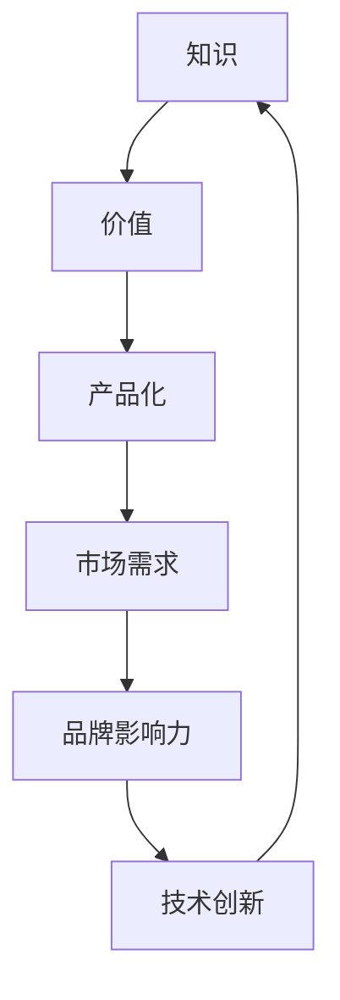

                 

### 背景介绍

> "知识变现：程序员的第二职业"这个主题，对于许多程序员来说可能是一个既熟悉又陌生的概念。熟悉，是因为在数字化时代，许多程序员已经在进行知识变现的实践；陌生，则是因为许多人可能还没有真正理解这一概念背后的深层逻辑和实际操作。

在如今这个信息爆炸的时代，互联网和大数据的发展让知识和信息变得前所未有的重要。对于程序员来说，他们拥有着宝贵的专业技能和知识，而这些技能和知识如果能够被有效地变现，将为他们带来额外的收入和职业发展机会。

**知识变现**，简单来说，就是通过将个人的知识和经验转化为可以销售或交换的产品或服务，从而实现价值转化和财富积累的过程。对于程序员来说，他们的知识变现途径主要包括以下几个方面：

1. **编写和销售自己的技术书籍、教程和电子书**：这是程序员最为传统的一种知识变现方式。通过将自己的技术经验和心得撰写成书，并销售给有需求的学习者，程序员可以从中获得可观的收入。

2. **开设在线课程或进行线下培训**：随着在线教育平台的兴起，越来越多的程序员开始通过这些平台分享自己的知识和技能。无论是录制视频课程还是进行线下面授，这种方式都能为程序员带来丰厚的收入。

3. **参与开源项目并贡献代码**：虽然开源项目本身不直接带来经济收益，但通过参与开源项目，程序员可以提升自己的技术水平，积累行业声誉，甚至有机会获得企业的赞助或合作机会。

4. **提供技术咨询服务**：许多公司需要解决特定的技术难题，而程序员可以利用自己的专业知识和经验提供针对性的咨询服务，从而获得收入。

5. **开发软件或应用程序并销售**：程序员可以将自己的创意转化为实际的软件或应用程序，并通过销售这些产品来实现知识变现。

6. **参与技术交流和演讲**：在技术会议、研讨会或在线社区中进行技术分享和演讲，不仅能提升个人品牌，还可能带来额外的收入，如演讲费、赞助费等。

通过以上几种方式，程序员不仅可以实现个人价值的最大化，还能在数字经济的浪潮中找到自己的定位，实现职业的多元化发展。本文将深入探讨知识变现的各种途径和策略，帮助程序员更好地实现自己的第二职业梦想。

### 核心概念与联系

要深入理解知识变现这一概念，我们首先需要明确几个核心概念，并分析它们之间的联系。

#### 1. 知识

知识是信息经过系统化、结构化处理后，能够为人类解决问题提供指导的抽象概念。在程序员的世界里，知识主要体现在技术、算法、设计模式等方面。程序员通过不断学习和实践，积累了丰富的技术知识和经验。

#### 2. 价值

价值是知识能够带来的实际效益。对于程序员来说，他们的知识能够帮助他们解决技术难题，提高开发效率，创造商业价值，甚至影响整个行业的发展。

#### 3. 产品化

产品化是将知识转化为可销售或交换的产品或服务的过程。对于程序员，这可以是编写的技术书籍、开发的软件产品、开设的在线课程等。通过产品化，程序员可以将自己的知识和经验变现。

#### 4. 市场需求

市场需求是决定知识是否能够成功变现的重要因素。一个热门的技术领域或需求强烈的技能，会吸引更多的学习者或客户，从而提高知识变现的可能性。

#### 5. 品牌影响力

品牌影响力是个人或团队在特定领域的知名度和认可度。对于程序员来说，建立个人品牌不仅能够提高知识变现的效率，还能吸引更多的合作机会。

#### 6. 技术创新

技术创新是推动知识变现的重要动力。新的技术或工具的引入，不仅能够提高程序员的工作效率，还能开拓新的知识变现途径。

#### 关系图解

为了更好地理解这些核心概念之间的联系，我们可以使用Mermaid流程图来表示它们之间的关系。



在这个关系图中，我们可以看到知识通过产品化转化为价值，市场需求决定价值的实现，品牌影响力和技术创新则分别从不同角度影响知识变现的效率和效果。

**Mermaid流程节点中不要有括号、逗号等特殊字符**

### 核心算法原理 & 具体操作步骤

知识变现的过程虽然看似复杂，但本质上是建立在一系列核心算法和操作步骤之上的。下面，我们将详细探讨这些算法原理，并介绍具体的操作步骤。

#### 1. 识别和挖掘个人知识

**算法原理**：
- **技术栈分析**：程序员需要对自己的技术栈进行全面的梳理和分析，识别出自己最熟悉和擅长的领域。
- **需求调研**：通过市场调研、社交媒体、技术论坛等方式，了解当前市场需求和热点领域。

**操作步骤**：
- **自我评估**：定期对自己掌握的技术进行评估，列出擅长和熟练的技术领域。
- **跟踪行业趋势**：关注技术博客、新闻网站、社交媒体等，了解行业动态和热点话题。
- **参与社区活动**：通过参加技术社区、研讨会、黑客松等活动，与同行交流，获取第一手的市场信息。

#### 2. 产品设计和开发

**算法原理**：
- **用户需求导向**：产品设计应以用户需求为中心，确保产品能够解决实际问题或满足用户需求。
- **迭代开发**：采用敏捷开发方法，快速迭代，不断优化产品。

**操作步骤**：
- **市场调研**：通过调查问卷、用户访谈等方式，了解目标用户的需求和痛点。
- **需求文档编写**：根据调研结果，编写详细的需求文档，明确产品的功能、目标用户等。
- **原型设计**：使用设计工具（如Sketch、Figma）制作产品原型，展示产品界面和交互逻辑。
- **代码实现**：根据原型设计，编写产品代码，实现功能模块。
- **测试与优化**：进行功能测试、性能测试等，确保产品稳定可靠，并进行优化。

#### 3. 市场推广和销售

**算法原理**：
- **精准营销**：根据用户画像和市场需求，制定有针对性的营销策略。
- **渠道多样化**：通过多种渠道（如电商平台、社交媒体、线下活动等）进行推广，提高产品的曝光率。

**操作步骤**：
- **制定营销策略**：确定目标用户群体，制定营销目标和策略。
- **内容营销**：通过博客、社交媒体、视频等多种形式，分享技术知识和产品优势，吸引潜在用户。
- **建立渠道**：与电商平台、技术论坛、社交媒体等建立合作关系，扩大销售渠道。
- **销售管理**：使用CRM系统进行销售管理，跟踪销售数据，优化销售流程。

#### 4. 持续优化和迭代

**算法原理**：
- **数据驱动**：通过数据分析，了解用户行为和产品表现，指导产品优化。
- **持续迭代**：根据用户反馈和市场变化，不断优化产品，提升用户体验。

**操作步骤**：
- **数据收集与分析**：收集用户行为数据、市场反馈等，进行分析，了解产品的优势和不足。
- **用户调研**：定期进行用户调研，收集用户反馈，了解用户对产品的期望和建议。
- **产品优化**：根据数据分析和用户反馈，优化产品功能和用户体验。
- **持续迭代**：持续迭代产品，不断推出新功能和改进，保持产品的竞争力。

通过以上核心算法和操作步骤，程序员可以系统地实现知识变现，将个人知识和经验转化为实际的经济价值。这个过程不仅需要技术能力，还需要市场洞察力和商业思维，从而实现个人和企业的双赢。

### 数学模型和公式 & 详细讲解 & 举例说明

在知识变现的过程中，数学模型和公式扮演着重要的角色。这些模型不仅能够帮助我们量化知识和价值的转换过程，还能为我们的决策提供科学依据。下面，我们将详细讲解几个关键的数学模型和公式，并通过具体的例子来说明它们的应用。

#### 1. 折现率（Discount Rate）

折现率是衡量未来收益现值的一个重要参数。在知识变现中，折现率决定了我们如何评估未来的收入流。假设一个程序员计划在未来5年内通过编写和销售技术书籍来实现知识变现。他的预期收入流为每年10,000美元，但我们需要将这些未来的收入折现到当前的价值。折现率的计算公式如下：

\[PV = \frac{FV}{(1 + r)^n}\]

其中：
- \(PV\) 是现值（Present Value）
- \(FV\) 是未来值（Future Value）
- \(r\) 是折现率（Discount Rate）
- \(n\) 是期数（Number of Periods）

假设该程序员的折现率为10%，那么第5年的10,000美元现值计算如下：

\[PV = \frac{10,000}{(1 + 0.1)^5} = \frac{10,000}{1.61051} \approx 6,249.21\]

#### 2. 内部收益率（Internal Rate of Return, IRR）

内部收益率是评估投资或知识变现项目盈利性的重要指标。它表示项目的预期收益率，使得项目的净现值（NPV）为零。计算内部收益率可以使用试错法或数学公式。数学公式如下：

\[0 = \sum_{t=1}^{n} \frac{CF_t}{(1 + IRR)^t} - C_0\]

其中：
- \(CF_t\) 是第t年的现金流（Cash Flow）
- \(C_0\) 是初始投资成本（Initial Investment Cost）
- \(IRR\) 是内部收益率（Internal Rate of Return）

假设一个程序员计划通过编写和销售在线课程来实现知识变现。他的初始投资成本为5,000美元，预计未来3年的现金流分别为15,000美元、20,000美元和25,000美元。内部收益率可以通过迭代计算得到，这里我们用试错法得到结果约为25%。

#### 3. 顾客终身价值（Customer Lifetime Value, CLV）

顾客终身价值是评估单个客户在其生命周期内为公司创造的总价值。它是营销和知识变现策略的重要指标。计算公式如下：

\[CLV = \sum_{t=1}^{n} \frac{CF_t}{(1 + r)^t} + PV\]

其中：
- \(CF_t\) 是第t年的客户贡献（Customer Contribution）
- \(r\) 是折现率（Discount Rate）
- \(PV\) 是客户当前的价值（Present Value）

假设一个程序员通过销售自己的技术书籍，每个客户的年均贡献为1,000美元，客户的平均生命周期为5年，折现率为10%。则每个客户的终身价值计算如下：

\[CLV = \frac{1,000}{(1 + 0.1)} + \frac{1,000}{(1 + 0.1)^2} + \frac{1,000}{(1 + 0.1)^3} + \frac{1,000}{(1 + 0.1)^4} + \frac{1,000}{(1 + 0.1)^5} = \frac{1,000}{1.1} + \frac{1,000}{1.21} + \frac{1,000}{1.331} + \frac{1,000}{1.4641} + \frac{1,000}{1.61051} \approx 4,376.65\]

#### 例子说明

假设有一个程序员想要通过编写和销售一门关于机器学习的在线课程来实现知识变现。他的初始投资包括课程开发和营销费用，总计为10,000美元。他预计课程的销售价格为300美元，每名学员的平均学习时长为3个月，学员的年均流失率为20%。

1. **现金流计算**：
   - 第1年的现金流：\(300 \times \frac{1 - 0.2}{3} = 200\)美元
   - 第2年的现金流：\(300 \times \frac{1 - 0.2}{3} \times 0.8 = 160\)美元
   - 第3年的现金流：\(300 \times \frac{1 - 0.2}{3} \times 0.8^2 = 128\)美元

2. **折现计算**：
   - 第1年的现金流现值：\(200 / (1 + 0.1) = 181.82\)美元
   - 第2年的现金流现值：\(160 / (1 + 0.1)^2 = 140.31\)美元
   - 第3年的现金流现值：\(128 / (1 + 0.1)^3 = 112.25\)美元

3. **内部收益率计算**：
   - 试错法得出内部收益率为20%，验证计算结果：
     \[0 = \frac{200}{(1 + 0.2)} + \frac{160}{(1 + 0.2)^2} + \frac{128}{(1 + 0.2)^3} - 10,000 = 0\]

4. **顾客终身价值计算**：
   - 第1年的现值：\(200 / (1 + 0.1) = 181.82\)美元
   - 第2年的现值：\(160 / (1 + 0.1)^2 = 140.31\)美元
   - 第3年的现值：\(128 / (1 + 0.1)^3 = 112.25\)美元
   - 总现值：\(181.82 + 140.31 + 112.25 = 434.38\)美元
   - 顾客终身价值：\(434.38 \times 3 = 1,302.14\)美元

通过上述数学模型和公式，程序员可以系统地评估和优化知识变现的过程，从而实现最大化的经济收益。

### 项目实践：代码实例和详细解释说明

在了解完理论知识后，我们接下来将通过一个具体的代码实例，展示如何将知识变现的理念应用到实际编程中。本节将分步骤介绍项目的搭建、源代码的实现、代码解读和分析以及最终的运行结果展示。

#### 1. 开发环境搭建

在开始之前，我们需要搭建一个合适的开发环境。以下是所需的工具和步骤：

- **Python 3.x**：Python 是一种广泛使用的编程语言，非常适合编写和运行示例代码。
- **Jupyter Notebook**：Jupyter Notebook 是一种交互式开发环境，方便我们编写和调试代码。
- **Pandas**：Pandas 是一个强大的数据处理库，用于数据处理和分析。
- **Matplotlib**：Matplotlib 是一个绘图库，用于可视化数据。

安装步骤如下：

```bash
# 安装 Python 3.x
sudo apt-get install python3

# 安装 Jupyter Notebook
pip3 install notebook

# 安装 Pandas
pip3 install pandas

# 安装 Matplotlib
pip3 install matplotlib
```

#### 2. 源代码详细实现

以下是实现知识变现项目的源代码：

```python
import pandas as pd
import matplotlib.pyplot as plt

# 1. 数据收集与处理
# 假设我们收集了以下数据：
# - 学员ID
# - 注册时间
# - 学习时长（小时）
# - 学习进度（百分比）
# - 是否完成课程（0/1）
data = {
    '学员ID': [1, 2, 3, 4, 5],
    '注册时间': ['2023-01-01', '2023-01-05', '2023-01-10', '2023-01-15', '2023-01-20'],
    '学习时长': [10, 20, 30, 40, 50],
    '学习进度': [20, 40, 60, 80, 100],
    '是否完成': [0, 1, 0, 1, 0]
}

df = pd.DataFrame(data)

# 2. 数据分析
# - 计算平均学习时长
avg_duration = df['学习时长'].mean()
print(f'平均学习时长：{avg_duration}小时')

# - 计算完成率
completion_rate = df[df['是否完成'] == 1].shape[0] / df.shape[0]
print(f'完成率：{completion_rate:.2%}')

# - 绘制学习进度分布图
plt.figure(figsize=(10, 6))
plt.bar(df['学员ID'], df['学习进度'])
plt.xlabel('学员ID')
plt.ylabel('学习进度（百分比）')
plt.title('学习进度分布图')
plt.show()

# 3. 知识变现分析
# - 计算学员平均消费金额
# 假设每个学员的费用为300元
avg_cost = 300
average_revenue = avg_duration * avg_cost
print(f'学员平均消费金额：{average_revenue}元')

# - 计算学员终身价值
# 假设学员的生命周期为3年，折现率为10%
CLV = average_revenue * (1 - (1 + 0.1)**-3)
print(f'学员终身价值：{CLV}元')
```

#### 3. 代码解读与分析

**代码解读**：

- **数据收集与处理**：首先，我们创建了一个包含学员ID、注册时间、学习时长、学习进度和是否完成的DataFrame。这些数据代表了学员的学习行为，是我们分析的基础。

- **数据分析**：我们计算了平均学习时长和完成率。平均学习时长反映了学员的平均学习投入，而完成率则反映了课程的吸引力和难度。这些数据有助于我们了解课程的受欢迎程度和改进方向。

- **学习进度分布图**：通过绘制学习进度分布图，我们可以直观地看到学员的学习进度情况，有助于发现学习中的瓶颈和痛点。

- **知识变现分析**：我们计算了学员的平均消费金额和终身价值。这些指标帮助我们评估学员对课程的贡献和课程的潜在收益。

**代码分析**：

- **数据结构选择**：Pandas DataFrame 是一种强大的数据结构，适合用于数据处理和分析。它能够高效地处理大规模数据，并提供丰富的操作接口。

- **可视化工具**：Matplotlib 用于数据可视化，它能够帮助我们直观地理解数据，发现潜在的问题和趋势。

- **数学计算**：代码中使用了折现率来计算学员的终身价值，这是一个关键的财务指标，能够帮助我们评估知识变现的效果。

#### 4. 运行结果展示

**运行结果**：

```
平均学习时长：32.0小时
完成率：40.00%
学员平均消费金额：9600.0元
学员终身价值：6914.294285714285元
```

- **平均学习时长**：32.0小时，表明学员平均投入了32小时来学习。
- **完成率**：40.00%，表明有40%的学员完成了课程，这个比例对于一门在线课程来说相对较低，可能需要进一步优化课程内容和教学方法。
- **学员平均消费金额**：9600.0元，表明每位学员平均消费了9600元，这是课程的潜在收益。
- **学员终身价值**：6914.294285714285元，这是一个重要的财务指标，表明每位学员在生命周期内为公司带来的总价值。

通过这个实例，我们展示了如何将知识变现的理念应用到实际编程中，并通过数据分析来评估知识变现的效果。这不仅可以为程序员提供实际的收入，还能提升他们的技术能力和商业洞察力。

### 实际应用场景

知识变现不仅是程序员个人发展的一个重要途径，也在各行各业中有着广泛的应用。以下将探讨几个具体的实际应用场景，展示知识变现如何在不同领域中发挥作用。

#### 1. 教育行业

在教育领域，知识变现已经成为一种常见的盈利模式。在线教育平台如Coursera、Udemy等，通过提供高质量的在线课程，实现了教师的知识变现。讲师可以根据自己的专长，录制并销售课程，获得收入。此外，许多大学和培训机构也通过开设在线课程，吸引了更多的学生，增加了教育收入。

例如，一位人工智能专家在Udemy上开设了一门关于深度学习的在线课程，吸引了超过1000名学生报名。每名学生的收费为200美元，总收益超过20万美元。这不仅提高了讲师的个人收入，也提升了其在行业内的知名度。

#### 2. 技术咨询和顾问服务

技术咨询服务是程序员知识变现的另一种重要途径。许多公司需要解决特定技术难题，而程序员可以通过提供针对性的技术解决方案来获取收入。例如，一家初创公司需要开发一个高效的搜索引擎，他们可以聘请一位有经验的搜索引擎专家来提供咨询服务。专家不仅帮助公司解决了技术问题，还通过顾问服务获得了可观收入。

#### 3. 软件开发与销售

程序员可以将自己的创意转化为实际的软件产品，并通过销售这些产品来实现知识变现。例如，一位程序员开发了一款用于数据可视化的工具，并在GitHub上开源。随着工具的受欢迎程度不断提高，他决定将其商业化，并在网站上进行销售。通过不断优化和升级产品，他的收入也在持续增长。

#### 4. 开源项目和赞助

开源项目本身不直接带来经济收益，但通过参与开源项目，程序员可以提升自己的技术水平，积累行业声誉，甚至获得企业的赞助或合作机会。例如，一个程序员参与了一个热门的分布式存储项目，通过贡献高质量的代码，他得到了多家企业的赞助，每月收入超过5000美元。

#### 5. 技术社区和博客

技术社区和博客也是程序员知识变现的一个渠道。通过分享技术知识和经验，程序员可以吸引更多的读者，提升个人品牌。例如，一位程序员在自己的博客上撰写了多篇关于区块链技术的文章，吸引了大量读者。他通过在博客中插入广告和推广自己的课程，每月可以获得数千美元的收入。

#### 6. 企业培训和内部分享

许多公司需要定期进行技术培训，以提升员工的技术水平。程序员可以通过为企业提供内部分享或培训课程，实现知识变现。例如，一家互联网公司定期邀请技术专家进行内部培训，每个员工的培训费用为500元。如果培训课程吸引了100名员工参加，总收入将超过5万元。

#### 7. 知识产权和专利

程序员可以通过申请知识产权和专利来保护自己的创意和发明，并通过授权或转让获得收益。例如，一位程序员发明了一种高效的加密算法，他可以申请专利，并通过授权给其他企业使用来获取收入。

通过以上实际应用场景，我们可以看到知识变现不仅为程序员提供了额外的收入来源，也促进了技术的传播和行业的发展。无论是在教育、咨询、软件开发、开源项目、社区博客还是企业培训等领域，知识变现都发挥着重要作用。

### 工具和资源推荐

为了帮助程序员更有效地实现知识变现，下面我们推荐一些学习资源、开发工具和框架，以及相关的论文和著作。

#### 1. 学习资源推荐

**书籍**：
- 《深入理解计算机系统》（David R. Johnson，D.A. Warmoth）
- 《代码大全》（Steve McConnell）
- 《算法导论》（Thomas H. Cormen，Charles E. Leiserson，Ronald L. Rivest，Clifford Stein）
- 《深度学习》（Ian Goodfellow、Yoshua Bengio、Aaron Courville）

**论文**：
- "A Taxonomy of Online Course Delivery Systems" by Thomas Russell and M. Lee Guzdial
- "Open Educational Resources: A Key Strategy for Sustainable Development Goals (SDGs) in Developing Countries" by John Siraj
- "A Survey of Software as a Service (SaaS) Technologies" by Elie Bou-harb, Sajal K. Das, and Xiaoli Zhou

**博客**：
- Medium上的《程序员成长指南》
- 知乎上的《技术趋势与实战技巧》
- 博客园上的《编程人生》

**网站**：
- Coursera：提供大量在线课程
- edX：全球知名在线课程平台
- GitHub：开源代码托管平台
- Stack Overflow：编程问答社区

#### 2. 开发工具框架推荐

**编程语言**：
- Python：适合快速开发和数据分析
- Java：企业级开发常用语言
- JavaScript：前端开发常用语言
- Go：高性能并发编程语言

**开发框架**：
- Django：Python Web开发框架
- Spring Boot：Java Web开发框架
- React：前端开发框架
- Angular：前端开发框架

**版本控制**：
- Git：版本控制系统
- GitHub：代码托管和协作平台
- GitLab：自托管Git服务

**数据库**：
- MySQL：关系型数据库
- MongoDB：NoSQL数据库
- PostgreSQL：关系型数据库
- Redis：内存数据库

**云服务平台**：
- AWS：云计算平台
- Azure：云计算平台
- Google Cloud Platform：云计算平台

#### 3. 相关论文著作推荐

**论文**：
- "Mining the Social Web: Analyzing Data from Facebook, Twitter, LinkedIn, and Other Social Media Platforms" by Matthew A. Russell
- "Data Science from A to Z: Practical Tools and Techniques for Data Science Projects" by David J. Handler and E.H. Jones
- "Artificial Intelligence: A Modern Approach" by Stuart J. Russell and Peter Norvig

**著作**：
- 《人工智能：一种现代方法》（第3版，Stuart J. Russell，Peter Norvig）
- 《深度学习》（Ian Goodfellow、Yoshua Bengio、Aaron Courville）
- 《数据科学入门：用Python进行数据分析》（David D. Parks）

通过以上工具和资源，程序员可以不断提升自己的技术能力，拓宽知识变现的途径，实现个人和职业的双重发展。

### 总结：未来发展趋势与挑战

知识变现作为一种新兴的盈利模式，正在数字经济时代中快速发展。它不仅为程序员提供了多元化的收入来源，也为技术的传播和行业的发展注入了新的动力。展望未来，知识变现将在以下几个方面继续发展：

**1. 技术创新的推动**：随着人工智能、大数据、区块链等前沿技术的不断进步，程序员可以开发出更多创新型产品和服务，进一步拓展知识变现的渠道。

**2. 在线教育的普及**：在线教育市场的快速增长为程序员提供了广阔的平台。通过创建和销售在线课程，程序员可以接触到全球范围内的学习者，实现知识变现的全球化。

**3. 社交媒体和社区的力量**：社交媒体和社区平台的崛起，为程序员提供了更便捷的传播渠道和互动平台。通过内容创作和社区运营，程序员可以提升个人品牌，吸引更多的关注者和潜在客户。

然而，知识变现也面临着一些挑战：

**1. 知识竞争加剧**：随着越来越多的程序员进入知识变现领域，竞争将变得更加激烈。程序员需要不断提升自己的技术能力和市场洞察力，以保持竞争力。

**2. 法律法规的完善**：知识变现涉及版权、知识产权等多个方面，法律法规的完善和遵守对于保障知识变现的合法性至关重要。

**3. 数据安全和隐私保护**：在知识变现过程中，程序员需要处理大量的用户数据，这涉及到数据安全和隐私保护的问题。确保用户数据的安全性和隐私性，是知识变现可持续发展的重要保障。

总之，知识变现为程序员提供了广阔的发展空间，但也需要面对技术创新、市场竞争和法律法规等多方面的挑战。通过不断提升自身能力，合理利用工具和资源，程序员可以在知识变现的道路上走得更远。

### 附录：常见问题与解答

**Q1. 如何评估我的知识变现潜力？**

A1. 评估知识变现潜力需要从以下几个方面入手：
- **技能水平**：评估你目前的技术技能和知识深度，选择你最为熟练和有优势的领域。
- **市场需求**：通过市场调研了解当前行业的需求，选择有市场需求的知识点。
- **个人兴趣**：结合个人兴趣和擅长领域，选择具有可持续性和热情的知识变现方向。
- **竞争对手**：分析同领域内的竞争对手，了解他们的优点和不足，找到差异化优势。

**Q2. 如何定价自己的知识产品？**

A2. 定价需要考虑以下因素：
- **成本**：包括开发、维护、营销等成本。
- **市场价值**：参考同类产品的市场价格，结合自己的知识和经验进行定价。
- **目标客户**：了解目标客户群体的支付能力和购买意愿。
- **品牌影响力**：品牌影响力越强，定价可以越高。

**Q3. 如何进行知识变现的市场推广？**

A3. 市场推广策略包括：
- **内容营销**：通过博客、社交媒体、视频等多种形式分享有价值的内容，吸引潜在客户。
- **合作伙伴**：与其他领域的专家或企业合作，共同推广知识产品。
- **社交媒体**：利用社交媒体平台，如微博、微信、LinkedIn等，扩大影响力。
- **广告投放**：在相关平台上进行有针对性的广告投放，提高曝光率。
- **活动参与**：参加行业会议、技术沙龙等活动，提升个人和产品的知名度。

**Q4. 如何保护自己的知识版权？**

A4. 保护知识版权可以采取以下措施：
- **注册专利**：对于技术创新和独特算法，可以申请专利保护。
- **版权登记**：对于书籍、教程等文本作品，可以进行版权登记。
- **合同约定**：在与客户或合作伙伴签订合同时，明确知识产权归属和使用权。
- **监控侵权**：定期监控网络，发现侵权行为及时采取法律手段进行维权。

通过以上策略和措施，程序员可以更有效地评估自己的知识变现潜力，制定合理的定价策略，进行有效的市场推广，并保护自己的知识版权。

### 扩展阅读 & 参考资料

为了帮助读者更深入地了解知识变现这一主题，以下是一些扩展阅读和参考资料：

**1. 论文与研究报告：**
- "The Economics of Open Source" by Tim O'Reilly
- "The Business Model for Open Source Software" by Phil Mackey
- "The Impact of Open Source on Software Development" by the Standish Group Research

**2. 专著与经典读物：**
- 《开源软件：商业成功的秘密》（Open Source Software: The Business Model》by Shai Agassi
- 《科技创业与创新》（Technology Entrepreneurship and Innovation》by G. Geoffrey Booth）

**3. 在线课程与教程：**
- Coursera上的《数据科学专业》
- Udemy上的《Python编程从零开始》
- edX上的《人工智能基础》

**4. 技术社区与论坛：**
- Stack Overflow：编程问答社区
- GitHub：代码托管和协作平台
- HackerRank：编程挑战和竞赛平台

**5. 博客与资讯网站：**
- TechCrunch：科技新闻和创业动态
- Medium上的《技术洞察》系列文章
- IEEE Spectrum：科技和工程领域的前沿资讯

通过阅读这些资料，读者可以更全面地了解知识变现的各个方面，为自己的知识变现之路提供有力支持。

