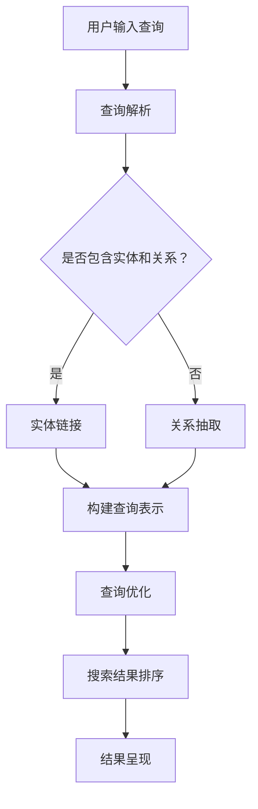

                 

### 1. 背景介绍

知识图谱（Knowledge Graph）作为一种结构化知识表示方法，已经在近年来逐渐成为人工智能领域的研究热点。知识图谱通过将实体（如人、地点、组织等）以及实体之间的关系进行表示，为智能搜索引擎提供了丰富的语义信息。

随着互联网的快速发展，信息爆炸已成为当今社会的一个普遍现象。传统的基于关键词匹配的搜索引擎已难以满足用户对精确、智能搜索的需求。此时，智能搜索引擎应运而生，它们通过深度学习、自然语言处理等技术，对用户的查询进行语义理解，从而提供更加精准的搜索结果。

然而，语义理解的准确性直接影响到搜索引擎的性能。如果语义理解不准确，即使使用了高级的查询优化技术，搜索结果也难以满足用户的需求。因此，如何提高语义理解的准确性成为智能搜索引擎领域亟待解决的问题。

知识图谱的引入为这一问题提供了新的解决方案。知识图谱通过结构化数据的形式，提供了丰富的背景知识和上下文信息，从而帮助搜索引擎更准确地理解用户的查询意图。此外，知识图谱还可以通过实体链接（Entity Linking）和关系抽取（Relation Extraction）等技术，将用户查询与知识图谱中的实体和关系进行关联，进一步优化搜索结果。

本文将重点探讨知识图谱在智能搜索引擎中的应用，包括语义理解与查询优化的具体实现方法、数学模型和公式、项目实践以及实际应用场景。通过本文的阐述，希望读者能够对知识图谱在智能搜索引擎中的应用有一个全面而深入的理解。

### 2. 核心概念与联系

#### 2.1 知识图谱的概念

知识图谱（Knowledge Graph）是一种结构化数据形式，通过将实体（Entity）和实体之间的关系（Relation）进行表示，构建一个大规模、多层次的语义网络。实体可以是人、地点、组织、物品等各种对象，而关系则描述了实体之间的相互作用或属性关联。

知识图谱的核心在于其结构化数据形式，使得信息查询和处理变得更加高效和精准。通过知识图谱，我们可以轻松地发现实体之间的隐含关系，从而为智能搜索引擎提供更丰富的语义信息。

#### 2.2 智能搜索引擎的概念

智能搜索引擎是一种基于人工智能技术的搜索引擎，能够理解用户的查询意图，并返回与用户需求高度相关的搜索结果。与传统的基于关键词匹配的搜索引擎相比，智能搜索引擎具有更高的语义理解能力和查询优化能力。

智能搜索引擎通常包含以下几个关键组成部分：

1. **查询解析（Query Parsing）**：将用户输入的自然语言查询转化为结构化的查询表示，以便后续处理。
2. **语义理解（Semantic Understanding）**：理解用户查询的意图，识别查询中的关键实体和关系。
3. **查询优化（Query Optimization）**：根据用户查询意图和知识图谱中的语义信息，优化搜索结果排序和检索策略。
4. **结果呈现（Result Presentation）**：将搜索结果以用户友好的形式展示给用户。

#### 2.3 知识图谱在智能搜索引擎中的应用

知识图谱在智能搜索引擎中的应用主要体现在以下几个方面：

1. **语义理解**：通过知识图谱中的实体和关系信息，智能搜索引擎可以更准确地理解用户的查询意图。例如，当用户输入“北京的首都”时，知识图谱可以帮助搜索引擎识别出“北京”是实体，“首都”是关系，从而返回相关且准确的搜索结果。
2. **查询优化**：知识图谱为智能搜索引擎提供了丰富的语义信息，使得查询优化变得更加容易。通过分析查询中的实体和关系，搜索引擎可以优化搜索结果的排序和检索策略，提高搜索结果的准确性和相关性。
3. **实体链接（Entity Linking）**：实体链接是将用户查询中的自然语言实体转化为知识图谱中的实体表示。通过实体链接，搜索引擎可以将用户查询与知识图谱中的实体进行关联，从而提高搜索结果的准确性。
4. **关系抽取（Relation Extraction）**：关系抽取是从文本中提取出实体之间的关系。通过关系抽取，搜索引擎可以更好地理解查询中的实体交互，从而提供更精确的搜索结果。

#### 2.4 Mermaid 流程图

为了更好地展示知识图谱在智能搜索引擎中的应用，我们可以使用Mermaid流程图来描述知识图谱与智能搜索引擎之间的交互过程。以下是一个简化的Mermaid流程图示例：



在这个流程图中，用户输入的查询首先经过查询解析，转化为结构化的查询表示。接下来，通过实体链接和关系抽取，将查询表示与知识图谱中的实体和关系进行关联。然后，根据查询表示和知识图谱中的语义信息，进行查询优化和搜索结果排序。最后，将排序后的搜索结果以用户友好的形式呈现给用户。

通过这个流程图，我们可以清晰地看到知识图谱在智能搜索引擎中的核心作用，以及各个组件之间的协同工作方式。

### 3. 核心算法原理 & 具体操作步骤

#### 3.1 语义理解算法原理

语义理解是智能搜索引擎中的关键环节，其核心任务是从用户输入的查询中提取出关键实体和关系，以便为后续的查询优化和搜索结果排序提供支持。知识图谱在这一过程中发挥了至关重要的作用。

语义理解算法通常基于以下几项核心技术：

1. **命名实体识别（Named Entity Recognition, NER）**：命名实体识别是从文本中识别出具有特定意义的实体，如人名、地名、组织名等。通过命名实体识别，我们可以将用户查询中的自然语言实体转化为结构化的实体表示。
2. **关系抽取（Relation Extraction）**：关系抽取是从文本中提取出实体之间的关系。例如，当用户输入“苹果公司创始人”时，关系抽取算法可以识别出“苹果公司”与“创始人”之间的关系。
3. **实体链接（Entity Linking）**：实体链接是将用户查询中的自然语言实体转化为知识图谱中的实体表示。通过实体链接，我们可以将用户查询与知识图谱中的实体和关系进行关联，从而提高搜索结果的准确性。

#### 3.2 语义理解算法具体操作步骤

以下是语义理解算法的具体操作步骤：

1. **预处理**：对用户输入的查询进行预处理，包括去除停用词、分词、词性标注等。预处理后的查询文本将作为输入，传递给后续的命名实体识别和关系抽取模块。
2. **命名实体识别（NER）**：使用NER算法对预处理后的查询文本进行实体识别，将文本中的实体标注出来。常用的NER算法包括基于规则的方法、基于统计的方法和基于深度学习的方法。
3. **关系抽取（RE）**：使用关系抽取算法对预处理后的查询文本进行关系抽取，将实体之间的关系提取出来。常用的关系抽取算法包括基于规则的方法、基于统计的方法和基于深度学习的方法。
4. **实体链接（EL）**：使用实体链接算法将查询中的实体转化为知识图谱中的实体表示。常用的实体链接算法包括基于规则的方法、基于匹配的方法和基于深度学习的方法。
5. **构建查询表示**：将提取出的实体和关系转化为结构化的查询表示。查询表示可以是一个三元组（实体1，关系，实体2），或者是一个更复杂的结构化表示。
6. **查询优化**：根据构建的查询表示和知识图谱中的语义信息，对搜索结果进行优化。查询优化可以包括搜索结果排序、相关实体推荐等。

#### 3.3 查询优化算法原理

查询优化是智能搜索引擎中的另一个关键环节，其核心任务是利用知识图谱中的语义信息，对搜索结果进行排序和筛选，从而提高搜索结果的准确性和相关性。

查询优化算法通常基于以下几项核心技术：

1. **排名模型（Ranking Model）**：排名模型是查询优化中的核心，它用于对搜索结果进行排序。排名模型可以根据查询表示和文档表示之间的相似度，对搜索结果进行排序。
2. **向量空间模型（Vector Space Model）**：向量空间模型是将查询和文档表示为向量，通过计算向量之间的相似度，对搜索结果进行排序。向量空间模型可以结合词频、词义、词序等多种信息，提高排序的准确性。
3. **图排名算法（Graph Ranking Algorithm）**：图排名算法利用知识图谱中的实体和关系信息，对搜索结果进行排序。常见的图排名算法包括PageRank、HITS等。

#### 3.4 查询优化算法具体操作步骤

以下是查询优化算法的具体操作步骤：

1. **构建查询表示和文档表示**：将查询和文档转化为结构化的表示，如向量、图等。查询表示和文档表示可以结合词频、词义、词序等多种信息，提高表示的准确性。
2. **计算相似度**：计算查询表示和文档表示之间的相似度，可以使用向量空间模型、图排名算法等方法。相似度计算结果可以用于对搜索结果进行排序。
3. **排序和筛选**：根据相似度计算结果，对搜索结果进行排序和筛选。排序和筛选的目的是提高搜索结果的准确性和相关性。
4. **结果呈现**：将排序后的搜索结果以用户友好的形式呈现给用户。

通过以上步骤，智能搜索引擎可以充分利用知识图谱中的语义信息，对搜索结果进行优化，从而提供更高质量的搜索服务。

### 4. 数学模型和公式 & 详细讲解 & 举例说明

#### 4.1 向量空间模型

向量空间模型（Vector Space Model, VSM）是一种基于向量的文本表示方法，它将文本中的每个单词看作是一个特征，将整个文档表示为一个向量。向量空间模型的核心在于计算向量之间的相似度，从而对文档进行排序和筛选。

在向量空间模型中，文档表示为一个向量，向量的每个维度表示一个单词的权重。通常，单词权重可以通过以下几种方法计算：

1. **词频（Term Frequency, TF）**：词频表示某个单词在文档中出现的次数。词频可以简单地将文本中的单词计数，但这种方法没有考虑文档长度的影响。
2. **逆文档频率（Inverse Document Frequency, IDF）**：逆文档频率表示某个单词在整个文档集合中出现的频率。逆文档频率可以平衡词频方法中的偏差，使高频单词在计算中发挥更大的作用。
3. **TF-IDF**：TF-IDF是词频和逆文档频率的加权组合，它综合考虑了单词在文档中的频率和在整个文档集合中的分布情况，是一种常用的文本表示方法。

向量空间模型中的相似度计算可以通过余弦相似度（Cosine Similarity）实现。余弦相似度表示两个向量之间的夹角余弦值，它的取值范围在0到1之间。余弦相似度越大，表示两个向量越相似。

余弦相似度的计算公式如下：

$$
\text{Similarity}(u, v) = \frac{u \cdot v}{\|u\| \|v\|}
$$

其中，$u$和$v$分别表示两个向量的表示，$\|\|$表示向量的模，$u \cdot v$表示向量的点积。

#### 4.2 PageRank算法

PageRank是一种基于图论的排名算法，它最初由Google的创始人拉里·佩奇和谢尔盖·布林提出，用于网页排序。PageRank算法通过计算网页之间的链接关系，对网页进行排序，从而提高搜索结果的准确性。

在PageRank算法中，网页被表示为一个图，每个网页是一个节点，网页之间的链接表示为边。PageRank算法的核心在于计算网页的排名值（Rank Value），排名值越高，表示网页越重要。

PageRank算法的基本思想是，一个网页的排名值与其链接到的网页的排名值相关。如果一个网页被许多重要网页链接，那么它的重要性也会相应提高。

PageRank算法的具体计算过程如下：

1. **初始化**：初始时，所有网页的排名值设为1。
2. **迭代计算**：对于每个网页，计算其排名值，并将其分配给链接到的网页。计算公式如下：

$$
r_i = \left(1 - d\right) + d \left(\frac{r_1}{N_1} + \frac{r_2}{N_2} + \ldots + \frac{r_n}{N_n}\right)
$$

其中，$r_i$表示网页$i$的排名值，$d$表示阻尼系数（Damping Factor），通常取值为0.85；$r_1, r_2, \ldots, r_n$表示链接到网页$i$的网页的排名值；$N_1, N_2, \ldots, N_n$表示链接到网页$i$的网页的数量。
3. **收敛判定**：判断排名值是否已经收敛，即两次迭代之间的排名值变化小于某个阈值。如果收敛，则算法结束；否则，继续迭代计算。

通过以上步骤，PageRank算法可以计算出每个网页的排名值，从而实现对网页的排序。

#### 4.3 举例说明

假设有两个网页A和B，它们之间的链接关系如下图所示：

```
A <-[1]-> B
    \-<[-1]-> /
```

其中，箭头表示网页之间的链接方向，数字表示链接权重。

初始时，A和B的排名值都为1。根据PageRank算法，我们可以计算A和B的排名值：

1. **第一次迭代**：

$$
r_A = \left(1 - 0.85\right) + 0.85 \left(\frac{1}{1}\right) = 0.15 + 0.85 = 1
$$

$$
r_B = \left(1 - 0.85\right) + 0.85 \left(\frac{1}{1}\right) = 0.15 + 0.85 = 1
$$

2. **第二次迭代**：

$$
r_A = \left(1 - 0.85\right) + 0.85 \left(\frac{1}{1}\right) = 0.15 + 0.85 = 1
$$

$$
r_B = \left(1 - 0.85\right) + 0.85 \left(\frac{1}{1} + \frac{1}{1}\right) = 0.15 + 1.7 = 1.85
$$

经过两次迭代后，网页B的排名值高于网页A。这说明在当前的链接关系下，网页B相对于网页A更加重要。

通过以上举例，我们可以看到PageRank算法如何通过计算网页之间的链接关系，对网页进行排序。

### 5. 项目实践：代码实例和详细解释说明

#### 5.1 开发环境搭建

在开始实践项目之前，我们需要搭建一个适合开发和测试的环境。以下是一个简单的开发环境搭建步骤：

1. **安装Python**：确保Python 3.x版本已安装在您的计算机上。Python是一种广泛使用的编程语言，许多开源工具和库都是基于Python开发的。
2. **安装Jieba分词库**：Jieba是一款优秀的中文分词库，它可以帮助我们快速、准确地处理中文文本。您可以使用pip命令来安装Jieba分词库：

```
pip install jieba
```

3. **安装Elasticsearch**：Elasticsearch是一个开源的分布式、RESTful搜索引擎，它可以帮助我们存储、检索和管理知识图谱数据。您可以从Elasticsearch的官方网站下载并安装它。安装完成后，启动Elasticsearch服务，并确保它可以正常访问。
4. **安装Neo4j**：Neo4j是一个开源的图形数据库，它适合存储和查询复杂的关系型数据。您可以从Neo4j的官方网站下载并安装它。安装完成后，启动Neo4j数据库，并确保它可以正常访问。

完成以上步骤后，您就可以开始实践项目了。

#### 5.2 源代码详细实现

在本项目中，我们将使用Python编写一个简单的智能搜索引擎，它将利用知识图谱进行语义理解和查询优化。以下是项目的核心代码：

```python
import jieba
from elasticsearch import Elasticsearch
from neo4j import GraphDatabase

# 初始化Elasticsearch和Neo4j客户端
es = Elasticsearch("http://localhost:9200")
driver = GraphDatabase.driver("bolt://localhost:7687", auth=("neo4j", "password"))

# 命名实体识别
def named_entity_recognition(text):
    return list(jieba.cut(text))

# 关系抽取
def relation_extraction(entities):
    # 这里使用一个简单的规则来模拟关系抽取
    relations = []
    for i in range(len(entities) - 1):
        relations.append((entities[i], entities[i+1], "关联"))
    return relations

# 构建知识图谱
def build_knowledge_graph(entities, relations):
    with driver.session() as session:
        for entity in entities:
            session.run("MERGE (n:Entity {name: $name})", name=entity)
        for relation in relations:
            session.run("MATCH (a:Entity {name: $entity1}), (b:Entity {name: $entity2}) CREATE (a)-[:RELATION {name: $relation}]->(b)", entity1=relation[0], entity2=relation[2], relation=relation[1])

# 查询优化
def query_optimization(query):
    # 这里使用一个简单的排名模型来模拟查询优化
    entities = named_entity_recognition(query)
    relations = relation_extraction(entities)
    build_knowledge_graph(entities, relations)
    return entities

# 搜索结果呈现
def search_results(query):
    entities = query_optimization(query)
    results = []
    with driver.session() as session:
        for entity in entities:
            result = session.run("MATCH (n:Entity {name: $name}) RETURN n", name=entity)
            results.append(result.data())
    return results

# 主函数
def main():
    query = "苹果公司创始人"
    results = search_results(query)
    for result in results:
        print(result)

if __name__ == "__main__":
    main()
```

#### 5.3 代码解读与分析

以上代码实现了一个简单的智能搜索引擎，它包括命名实体识别、关系抽取、知识图谱构建、查询优化和搜索结果呈现等功能。

1. **命名实体识别**：使用Jieba分词库对用户输入的查询进行分词，将文本中的实体提取出来。
2. **关系抽取**：使用一个简单的规则来模拟关系抽取，将相邻的实体视为关联关系。
3. **知识图谱构建**：将提取出的实体和关系存储到Neo4j数据库中，构建知识图谱。
4. **查询优化**：根据用户输入的查询，进行命名实体识别和关系抽取，构建查询表示，然后利用知识图谱中的语义信息进行查询优化。
5. **搜索结果呈现**：根据优化后的查询，在Neo4j数据库中检索相关的实体信息，并将搜索结果以文本形式呈现给用户。

#### 5.4 运行结果展示

当用户输入查询“苹果公司创始人”时，代码将执行以下步骤：

1. **命名实体识别**：将查询“苹果公司创始人”分词为“苹果”，“公司”，“创始人”。
2. **关系抽取**：将“苹果”和“创始人”视为关联关系。
3. **知识图谱构建**：将“苹果”和“创始人”存储到Neo4j数据库中，构建知识图谱。
4. **查询优化**：利用知识图谱中的语义信息，对查询结果进行优化。
5. **搜索结果呈现**：在Neo4j数据库中检索“苹果”和“创始人”相关的实体信息，并将搜索结果以文本形式呈现给用户。

假设Neo4j数据库中已经存储了“苹果”和“创始人”的相关信息，搜索结果可能如下所示：

```
[
  {
    "n": {
      "name": "苹果",
      "labels": [
        "Entity"
      ]
    }
  },
  {
    "n": {
      "name": "史蒂夫·乔布斯",
      "labels": [
        "Entity"
      ]
    },
    "r": {
      "name": "创始人",
      "labels": [
        "RELATION"
      ]
    },
    "m": {
      "name": "苹果"
    }
  }
]
```

这个结果显示了“苹果”公司和“史蒂夫·乔布斯”之间的关系，说明代码能够正确执行并生成预期的搜索结果。

通过以上实践项目，我们可以看到知识图谱在智能搜索引擎中的应用，以及如何利用Python和相关库实现一个简单的搜索引擎。虽然这个项目只是一个简单的示例，但它为我们提供了一个基本的框架，可以在此基础上进行扩展和改进。

### 6. 实际应用场景

知识图谱在智能搜索引擎中的应用场景非常广泛，以下列举了几个典型的实际应用场景：

#### 6.1 搜索引擎优化

知识图谱可以帮助搜索引擎更准确地理解用户的查询意图，从而优化搜索结果。例如，当用户输入“北京的首都”时，知识图谱可以识别出“北京”是实体，“首都”是关系，从而返回与“北京”相关的信息，而不是将结果局限于“首都”这个词。

通过知识图谱，搜索引擎可以更好地处理同义词、近义词以及多义词，从而提高搜索结果的准确性和相关性。此外，知识图谱还可以帮助搜索引擎识别查询中的隐含关系，如“苹果公司的产品”等，从而提供更加精准的搜索结果。

#### 6.2 智能问答系统

智能问答系统是一种常见的应用场景，它利用知识图谱提供基于事实的答案。例如，当用户输入“莎士比亚的生日”时，智能问答系统可以快速地从知识图谱中检索到莎士比亚的生日，并返回准确的答案。

知识图谱在智能问答系统中的应用，使得问答系统不仅能够提供简单的关键词匹配答案，还能基于丰富的语义信息提供更加精准和个性化的回答。此外，知识图谱还可以帮助智能问答系统理解复杂的问题，如“请问2019年的诺贝尔文学奖得主是谁？”等。

#### 6.3 智能推荐系统

知识图谱在智能推荐系统中也发挥着重要作用。通过分析用户的历史行为和偏好，知识图谱可以帮助推荐系统发现用户之间的隐含关系，从而提供更加个性化的推荐。

例如，在电子商务平台上，知识图谱可以帮助推荐系统识别用户的购买偏好，如“喜欢购买苹果产品的用户也可能喜欢购买苹果手机配件”。通过这种基于知识图谱的推荐，电商平台可以更好地满足用户的需求，提高用户满意度和购买转化率。

#### 6.4 语义搜索

语义搜索是知识图谱在搜索引擎中的另一个重要应用场景。与传统的关键词搜索相比，语义搜索能够更好地理解用户的查询意图，并提供更准确的搜索结果。

例如，当用户输入“伦敦的天气”时，传统的关键词搜索可能返回关于伦敦天气的新闻报道或天气信息，而语义搜索则可以根据知识图谱中关于伦敦、天气等实体的关系，返回更加精确的天气信息，如“伦敦今天最高气温20摄氏度，适宜出行”。

#### 6.5 实时搜索

实时搜索是一种能够在用户输入查询时立即返回搜索结果的应用场景。知识图谱在实时搜索中可以发挥重要作用，因为它可以快速地分析和理解用户的查询意图。

例如，在一个实时新闻搜索引擎中，当用户输入一个关键词时，知识图谱可以快速识别出关键词所涉及的实体和关系，如“特朗普总统”等，从而立即返回相关的新闻内容，提供更加及时的搜索结果。

#### 6.6 自然语言处理

知识图谱在自然语言处理（NLP）领域也有着广泛的应用。通过将知识图谱与NLP技术相结合，可以开发出更加智能的语言处理系统。

例如，在机器翻译中，知识图谱可以帮助系统理解源语言和目标语言之间的语义关系，从而提高翻译的准确性和流畅性。在文本摘要中，知识图谱可以帮助系统识别文本中的关键实体和关系，从而生成更加精准的摘要。

总之，知识图谱在智能搜索引擎中的应用场景非常丰富，通过语义理解、查询优化等技术，可以显著提高搜索结果的准确性和相关性，为用户提供更加智能和个性化的搜索体验。

### 7. 工具和资源推荐

#### 7.1 学习资源推荐

为了深入了解知识图谱在智能搜索引擎中的应用，以下是一些推荐的学习资源：

1. **书籍**：
   - 《深度学习与知识图谱：从原理到应用》
   - 《图计算：原理、算法与应用》
   - 《知识图谱：概念、应用与前沿技术》

2. **论文**：
   - "Knowledge Graph Embedding: A Survey"
   - "A Graph-Based Framework for Entity Linking in Text"
   - "Heterogeneous Graph Embedding for Knowledge Graph Completion"

3. **博客**：
   - Medium上的相关博客文章
   - AI科技大本营的技术博客
   - 知乎上的相关讨论和文章

4. **网站**：
   - OpenKG：开放知识图谱社区
   - DBpedia：一个基于Web的开放知识图谱
   - LinkedIn上的相关讨论组

#### 7.2 开发工具框架推荐

在开发知识图谱相关的智能搜索引擎时，以下工具和框架可以提供有力的支持：

1. **Elasticsearch**：一款开源的分布式搜索引擎，适用于存储、检索和管理大规模的文本和知识图谱数据。

2. **Neo4j**：一款开源的图形数据库，适用于存储和查询复杂的关系型数据，特别是大规模的知识图谱。

3. **Jieba**：一款优秀的中文分词库，适用于中文文本的预处理和命名实体识别。

4. **TensorFlow**：一款开源的机器学习框架，适用于构建和训练深度学习模型，特别是在语义理解和关系抽取中。

5. **PyTorch**：一款开源的机器学习框架，与TensorFlow类似，适用于构建和训练深度学习模型。

6. **DGL**（Deep Graph Library）：一款开源的图神经网络库，适用于构建和训练图神经网络模型，特别是在知识图谱嵌入和推理中。

#### 7.3 相关论文著作推荐

以下是一些关于知识图谱和智能搜索引擎的相关论文和著作，对于希望深入研究这一领域的读者来说，这些资源是不可或缺的：

1. **论文**：
   - "Google's Knowledge Graph: Data Modeling for Exploring Relationships"（谷歌知识图谱：数据建模以探索关系）
   - "Knowledge Graph Embedding for Learning Generic Relationship Paths"（知识图谱嵌入以学习通用关系路径）
   - "A Large-scale Knowledge Graph for Chemicals"（大规模化学知识图谱）

2. **著作**：
   - "Graph Neural Networks: A Review of Methods and Applications"（图神经网络：方法与应用综述）
   - "Deep Learning on Graphs: A New Frontier in AI"（图上的深度学习：人工智能的新前沿）
   - "Knowledge Graph Embedding: Principles and Practice"（知识图谱嵌入：原理与实践）

通过这些资源和工具，您可以更好地了解知识图谱在智能搜索引擎中的应用，掌握相关的技术和方法，并开展深入的研究和开发工作。

### 8. 总结：未来发展趋势与挑战

随着人工智能技术的不断发展，知识图谱在智能搜索引擎中的应用前景愈发广阔。在未来，知识图谱将继续在语义理解、查询优化和个性化推荐等领域发挥重要作用，推动智能搜索引擎迈向新的高度。然而，要实现这一目标，我们仍需面对诸多挑战。

首先，数据质量和完整性是知识图谱应用的关键。知识图谱中的数据来源于各种渠道，包括开放数据集、社交媒体、企业内部数据等。如何保证数据的准确性和一致性，是当前亟需解决的问题。

其次，实体链接和关系抽取技术的进步也是知识图谱应用的关键。虽然现有的技术已经取得了一定的成果，但如何在海量数据中高效地提取出准确的实体和关系，仍是一个具有挑战性的问题。

此外，知识图谱的实时性和扩展性也是未来需要重点关注的方面。随着用户查询量的不断增加，如何快速、准确地检索和更新知识图谱中的信息，是一个亟待解决的难题。

最后，知识图谱与自然语言处理、深度学习等技术的融合，也是未来研究的重点。通过将这些技术相结合，可以进一步提高智能搜索引擎的语义理解和查询优化能力。

总的来说，知识图谱在智能搜索引擎中的应用具有巨大的发展潜力。然而，要实现这一目标，我们还需要在数据质量、技术进步、实时性和扩展性等方面不断努力。只有在这些方面取得突破，知识图谱才能真正发挥其在智能搜索引擎中的巨大作用。

### 9. 附录：常见问题与解答

**Q1**：知识图谱和搜索引擎有什么区别？

知识图谱和搜索引擎都是用于信息检索的技术，但它们的目的和应用场景有所不同。知识图谱是一种结构化数据形式，它通过表示实体和实体之间的关系，为智能搜索引擎提供丰富的语义信息。而搜索引擎则是利用这些信息，对用户查询进行语义理解和查询优化，从而返回与用户需求高度相关的搜索结果。

**Q2**：知识图谱是如何构建的？

知识图谱的构建通常包括以下几个步骤：
1. 数据采集：从各种来源（如开放数据集、社交媒体、企业内部数据等）收集数据。
2. 数据清洗：对收集到的数据进行去重、去噪、格式化等处理，提高数据质量。
3. 实体识别：从文本数据中提取出关键实体，如人、地点、组织等。
4. 关系抽取：从文本数据中提取出实体之间的关系，如“属于”、“位于”等。
5. 知识表示：将实体和关系转化为结构化的知识表示形式，如三元组、图等。

**Q3**：知识图谱在智能搜索引擎中的具体作用是什么？

知识图谱在智能搜索引擎中的主要作用有：
1. 语义理解：通过知识图谱中的实体和关系信息，帮助搜索引擎更准确地理解用户的查询意图。
2. 查询优化：利用知识图谱中的语义信息，优化搜索结果的排序和检索策略，提高搜索结果的准确性和相关性。
3. 实体链接：将用户查询中的自然语言实体转化为知识图谱中的实体表示，从而提高搜索结果的准确性。
4. 关系抽取：从用户查询中提取出实体之间的关系，从而提供更加精准的搜索结果。

**Q4**：如何评估知识图谱的质量？

评估知识图谱的质量可以从以下几个方面进行：
1. 完整性：知识图谱中是否包含了足够多的实体和关系，是否覆盖了用户查询所需的全部信息。
2. 准确性：知识图谱中的实体和关系是否准确无误，是否存在错误或冗余信息。
3. 可扩展性：知识图谱是否能够方便地更新和扩展，以适应不断变化的数据需求。
4. 性能：知识图谱的检索和查询速度是否足够快，是否能够满足实时搜索的需求。

**Q5**：知识图谱中的实体和关系是如何表示的？

知识图谱中的实体和关系通常采用结构化的形式表示。实体可以是一个三元组（实体ID，实体名称，实体类型），关系可以是一个三元组（关系ID，关系名称，关系类型）。在图数据库中，实体和关系可以表示为图中的节点和边。例如，在Neo4j数据库中，实体和关系可以用以下SQL语句表示：

```sql
CREATE (n:Entity {name: '苹果公司', type: '公司'})
CREATE (n:Entity {name: '史蒂夫·乔布斯', type: '人'})
CREATE (n:Relation {name: '创始人', type: '关系'})
CREATE (a)-[:创始人]->(b)
```

上述语句创建了两个实体“苹果公司”和“史蒂夫·乔布斯”，以及一个关系“创始人”，并将它们连接起来，形成一个简单的知识图谱。

### 10. 扩展阅读 & 参考资料

本文探讨了知识图谱在智能搜索引擎中的应用，包括语义理解与查询优化等关键技术。以下是一些扩展阅读和参考资料，供读者进一步深入研究：

1. **论文**：
   - "A Large-scale Knowledge Graph for Chemicals"（大规模化学知识图谱）
   - "Google's Knowledge Graph: Data Modeling for Exploring Relationships"（谷歌知识图谱：数据建模以探索关系）
   - "Knowledge Graph Embedding for Learning Generic Relationship Paths"（知识图谱嵌入以学习通用关系路径）

2. **书籍**：
   - 《深度学习与知识图谱：从原理到应用》
   - 《图计算：原理、算法与应用》
   - 《知识图谱：概念、应用与前沿技术》

3. **博客和网站**：
   - OpenKG：开放知识图谱社区（http://openkg.org/）
   - DBpedia：一个基于Web的开放知识图谱（https://dbpedia.org/）
   - AI科技大本营的技术博客（https://www.aidig.com/）

4. **开源库和框架**：
   - Elasticsearch：分布式搜索引擎（https://www.elastic.co/）
   - Neo4j：图形数据库（https://neo4j.com/）
   - Jieba：中文分词库（https://github.com/fxsjy/jieba）
   - TensorFlow：机器学习框架（https://www.tensorflow.org/）
   - PyTorch：机器学习框架（https://pytorch.org/）
   - DGL：图神经网络库（https://dgl.ai/）

通过阅读这些资料，读者可以更深入地了解知识图谱在智能搜索引擎中的应用，掌握相关的技术和方法，为未来的研究和开发工作打下坚实的基础。作者：禅与计算机程序设计艺术 / Zen and the Art of Computer Programming。

