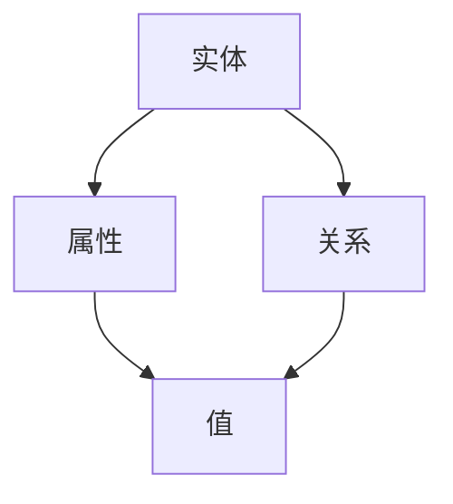

                 

### 1. 背景介绍

知识图谱（Knowledge Graph）是一种将信息实体及其相互关系结构化、语义化的技术，旨在通过构建一个具有丰富知识表示的图形结构，实现对复杂数据的高效存储、管理和推理。知识图谱的概念最早由Google在2012年提出，并应用于搜索引擎的改进。然而，其理论基础可以追溯到更早的语义网络（Semantic Network）和本体论（Ontology）。

#### 1.1 历史背景

知识图谱的发展历程可以追溯到20世纪中叶的语义网络理论。语义网络是一种用于表示知识和信息的方法，通过节点和边来表示概念及其关系。此后，随着计算机科学和人工智能领域的发展，知识图谱逐渐演变成一种强大的信息组织和管理工具。

20世纪90年代，本体论的研究进一步丰富了知识图谱的理论基础。本体论是一种形式化的知识表示方法，用于定义领域内的概念及其关系。本体的应用使得知识图谱能够更加准确地描述和推理复杂的关系。

#### 1.2 现代应用

现代知识图谱技术已在众多领域得到广泛应用。例如，在搜索引擎中，知识图谱用于理解用户查询，提供更精准的搜索结果；在社交媒体平台，知识图谱用于推荐系统，根据用户行为和关系推荐内容；在医疗领域，知识图谱用于疾病诊断和药物研发，通过分析海量医学数据，提供决策支持。

#### 1.3 关键概念

在知识图谱的构建过程中，以下关键概念是不可或缺的：

- **实体（Entity）**：知识图谱中的基本单位，可以是任何具有独立存在意义的对象，如人、地点、事物等。
- **属性（Attribute）**：描述实体特征的名称和值，如人的年龄、地点的纬度等。
- **关系（Relationship）**：实体之间的相互作用，如“是”、“属于”、“位于”等。
- **图谱（Graph）**：由实体和关系构成的网络结构，用于表示和存储知识。

#### 1.4 目的与意义

知识图谱的主要目的是将现实世界中的信息以结构化的形式进行组织，使得计算机能够理解和处理这些信息，从而实现智能化的信息检索和推理。其意义在于：

1. **提高数据利用率**：通过结构化和语义化的表示，知识图谱能够更高效地组织和利用海量数据。
2. **增强决策能力**：知识图谱支持复杂的关系推理，为各种应用场景提供决策支持。
3. **优化用户体验**：在搜索引擎、推荐系统等应用中，知识图谱能够提供更准确和个性化的服务。

总的来说，知识图谱是一种强大的信息组织和处理工具，正日益成为现代计算技术的重要支撑。接下来，我们将进一步探讨知识图谱的核心概念和原理，了解其如何构建一个智慧的数字地图。

### 2. 核心概念与联系

#### 2.1 实体（Entity）

实体是知识图谱中的基本构建块，代表了知识图谱中的各种对象。例如，在地图应用中，实体可以是城市、地标、道路等。实体可以是具体的（如人、地点），也可以是抽象的（如概念、事件）。

实体通常具有一组属性来描述其特征。例如，一个城市实体可能具有名称、人口、纬度、经度等属性。属性是知识图谱中重要的信息来源，用于描述实体的具体细节。

#### 2.2 关系（Relationship）

关系是实体之间的相互作用或连接。在知识图谱中，关系通常表示为两个实体之间的边。关系可以具有方向（如“是”、“属于”），也可以是无方向的（如“位于”）。例如，在一个地图应用中，城市和道路之间可以存在“连接”关系，表示两个城市之间有道路相连。

关系通常还包含属性，用于描述关系的具体特征。例如，一个“连接”关系可能具有长度、类型等属性。这些属性有助于更详细地描述关系，并支持更复杂的推理。

#### 2.3 图（Graph）

知识图谱是一个图结构，由实体和关系构成。图中的每个节点代表一个实体，每条边代表一个关系。图结构使得知识图谱能够有效地表示复杂的实体间关系。

知识图谱的图结构不仅支持简单的数据存储，还支持复杂的图算法，如路径搜索、社区发现等。这些算法可以用于分析和理解知识图谱中的数据。

#### 2.4 属性（Attribute）

属性是实体的特征描述，用于进一步细化实体的信息。属性可以是简单的数据类型（如数字、字符串），也可以是更复杂的类型（如列表、结构化数据）。

在知识图谱中，属性通常与实体和关系相关联。例如，一个城市的名称属性与该城市实体相关联，一个连接关系的长度属性与该关系相关联。属性的使用有助于更准确地描述实体和关系，从而提高知识图谱的语义丰富度。

#### 2.5 Mermaid 流程图表示

为了更直观地理解知识图谱的核心概念，我们可以使用Mermaid流程图来表示它们之间的关系。



在这个流程图中，实体（A）与属性（B）和关系（C）相关联。属性（B）具有值（D），而关系（C）也具有值（D）。这表示实体、属性和关系都是知识图谱中的基本元素，并且它们之间具有紧密的关联。

### 3. 核心算法原理 & 具体操作步骤

知识图谱的构建涉及多种核心算法，这些算法用于从原始数据中提取实体、关系和属性，并将其组织成结构化的图结构。以下将介绍几种常用的核心算法，包括数据预处理、实体识别、关系抽取和属性抽取。

#### 3.1 数据预处理

数据预处理是知识图谱构建的基础步骤，其主要任务包括数据清洗、格式化和分词等。数据清洗的目的是去除数据中的噪声和不完整信息，确保数据质量。数据格式化则将不同来源的数据统一为标准格式，便于后续处理。分词是将文本数据分解为基本词汇单元，为实体识别和关系抽取提供基础。

具体操作步骤如下：

1. **数据清洗**：去除文本中的HTML标签、特殊字符和停用词。
2. **数据格式化**：将不同数据源的数据转换为统一的格式，如JSON或XML。
3. **分词**：使用分词工具将文本数据分解为词汇单元。

#### 3.2 实体识别

实体识别是知识图谱构建的关键步骤，其目的是从文本数据中识别出具有独立意义的实体。常用的实体识别算法包括基于规则的方法、基于统计的方法和基于深度学习的方法。

1. **基于规则的方法**：通过预定义的规则和模式匹配来识别实体。这种方法简单易实现，但依赖于规则库的完备性，适用性有限。
2. **基于统计的方法**：使用机器学习算法，如朴素贝叶斯、最大熵模型等，根据实体出现的上下文特征进行识别。这种方法具有较高的准确率，但需要大量的训练数据和特征工程。
3. **基于深度学习的方法**：使用深度神经网络，如卷积神经网络（CNN）和循环神经网络（RNN），通过学习大量文本数据来识别实体。这种方法具有很好的泛化能力，但计算复杂度较高。

具体操作步骤如下：

1. **数据准备**：收集和标注大量的实体数据作为训练集。
2. **特征提取**：从文本数据中提取特征，如词频、词嵌入等。
3. **模型训练**：使用训练数据训练实体识别模型。
4. **实体识别**：将待识别文本数据输入模型，输出识别出的实体。

#### 3.3 关系抽取

关系抽取是知识图谱构建的另一个关键步骤，其目的是从文本数据中识别出实体之间的关系。关系抽取方法与实体识别类似，包括基于规则的方法、基于统计的方法和基于深度学习的方法。

1. **基于规则的方法**：通过预定义的规则和模式匹配来识别关系。这种方法简单易实现，但同样依赖于规则库的完备性。
2. **基于统计的方法**：使用机器学习算法，如朴素贝叶斯、最大熵模型等，根据关系出现的上下文特征进行识别。
3. **基于深度学习的方法**：使用深度神经网络，通过学习大量文本数据来识别关系。

具体操作步骤如下：

1. **数据准备**：收集和标注大量的关系数据作为训练集。
2. **特征提取**：从文本数据中提取特征，如词嵌入、实体特征等。
3. **模型训练**：使用训练数据训练关系抽取模型。
4. **关系抽取**：将待识别文本数据输入模型，输出识别出的关系。

#### 3.4 属性抽取

属性抽取是知识图谱构建的最后一步，其目的是从文本数据中识别出实体的属性。属性抽取通常分为两个阶段：属性识别和属性值抽取。

1. **属性识别**：从文本数据中识别出实体的属性。方法与实体识别和关系抽取类似。
2. **属性值抽取**：从文本数据中抽取属性的具体值。方法包括基于规则的方法、基于统计的方法和基于深度学习的方法。

具体操作步骤如下：

1. **数据准备**：收集和标注大量的属性数据作为训练集。
2. **特征提取**：从文本数据中提取特征。
3. **模型训练**：训练属性识别和属性值抽取模型。
4. **属性抽取**：将待识别文本数据输入模型，输出识别出的属性及其值。

通过上述核心算法的协同工作，我们可以从原始文本数据中构建出结构化、语义化的知识图谱，为各种应用场景提供强大的数据支持和智能推理能力。

### 4. 数学模型和公式 & 详细讲解 & 举例说明

在知识图谱的构建过程中，数学模型和公式起着至关重要的作用。它们不仅帮助我们理解和分析图谱的结构，还为图谱的优化和扩展提供了理论依据。以下将详细介绍知识图谱中常用的数学模型和公式，并通过具体例子进行讲解。

#### 4.1 图论基本概念

知识图谱是一个图结构，因此理解图论的基本概念是必不可少的。以下是几个关键的图论模型和公式。

##### 4.1.1 节点度（Degree）

节点度是指连接一个节点的边的数量。对于无向图，节点的度用 \( d \) 表示；对于有向图，节点的出度和入度分别用 \( out\_degree \) 和 \( in\_degree \) 表示。

公式如下：
\[ d = \sum_{i=1}^{n} \text{edge_count}_{i} \]
其中， \( n \) 是节点的数量， \( \text{edge_count}_{i} \) 是第 \( i \) 个节点的度。

##### 4.1.2 路径长度（Path Length）

路径长度是指两个节点之间最短路径的长度。在有向图中，路径长度可能是一个整数，也可能是分数。

公式如下：
\[ \text{path\_length}(u, v) = \min \{ \text{distance}(u, v) \mid \text{distance}(u, v) \in \mathbb{Z}^{+} \} \]
其中， \( u \) 和 \( v \) 是两个节点， \( \text{distance}(u, v) \) 是 \( u \) 到 \( v \) 的距离。

##### 4.1.3 图密度（Graph Density）

图密度是指图中边的数量与可能边数的比值。图密度用于衡量图结构的密集程度。

公式如下：
\[ \rho = \frac{m}{n(n-1)/2} \]
其中， \( m \) 是边的数量， \( n \) 是节点的数量。

#### 4.2 图嵌入（Graph Embedding）

图嵌入是一种将图中的节点映射到低维向量空间的方法，使得节点之间的相似性能够在向量空间中保持。以下是一些常见的图嵌入模型和公式。

##### 4.2.1 Node2Vec

Node2Vec 是一种基于随机游走的图嵌入模型。它通过模拟随机游走来生成节点的特征向量。

公式如下：
\[ \text{emb}(v) = \sum_{w \in \text{neighbor}(v)} \alpha \cdot \text{embed}(w) \cdot \text{softmax}(\text{weights}) \]
其中， \( v \) 是节点， \( \text{neighbor}(v) \) 是 \( v \) 的邻居节点， \( \text{embed}(w) \) 是节点 \( w \) 的嵌入向量， \( \alpha \) 是权重系数， \( \text{softmax}(\text{weights}) \) 是归一化权重。

##### 4.2.2 Graph Convolutional Network (GCN)

图卷积网络（GCN）是一种基于卷积操作的图嵌入模型。GCN 通过聚合节点及其邻居的嵌入向量来生成新的节点嵌入。

公式如下：
\[ \text{h}_{k+1}(v) = \sigma \left( \sum_{u \in \text{neighbor}(v)} \text{W}_{k} \cdot \text{h}_{k}(u) + \text{b}_{k} \right) \]
其中， \( \text{h}_{k}(v) \) 是第 \( k \) 层节点 \( v \) 的嵌入向量， \( \text{W}_{k} \) 是卷积权重， \( \text{b}_{k} \) 是偏置项， \( \text{neighbor}(v) \) 是节点 \( v \) 的邻居节点， \( \sigma \) 是激活函数。

#### 4.3 示例说明

为了更好地理解上述数学模型和公式，我们通过一个具体的例子来说明。

假设有一个简单的无向图，包含三个节点 \( A \)、\( B \) 和 \( C \)，它们之间存在以下边：

```
A -- B
|    |
C -- A
```

根据图论的基本概念，我们可以计算出每个节点的度：

\[ d(A) = 3, \quad d(B) = 2, \quad d(C) = 2 \]

假设我们使用 Node2Vec 模型进行图嵌入，节点的嵌入向量分别为 \( \text{emb}(A) = [1, 0, 0] \)，\( \text{emb}(B) = [0, 1, 0] \)，\( \text{emb}(C) = [0, 0, 1] \)。根据 Node2Vec 的公式，我们可以计算节点 \( A \) 的嵌入向量：

\[ \text{emb}(A) = \alpha \cdot \text{embed}(B) \cdot \text{softmax}(\text{weights}) + \alpha \cdot \text{embed}(C) \cdot \text{softmax}(\text{weights}) \]

其中，\( \alpha = 0.5 \)，\( \text{weights} = [1, 1] \)，\( \text{softmax}(\text{weights}) = [0.5, 0.5] \)。代入上述值，我们得到：

\[ \text{emb}(A) = 0.5 \cdot [0, 1, 0] \cdot [0.5, 0.5] + 0.5 \cdot [0, 0, 1] \cdot [0.5, 0.5] = [0.25, 0.25, 0.25] \]

这样，我们就通过数学模型和公式计算出了节点 \( A \) 的嵌入向量。类似地，我们可以计算出其他节点的嵌入向量，从而在低维向量空间中表示知识图谱。

### 5. 项目实践：代码实例和详细解释说明

为了更直观地展示知识图谱的构建过程，我们将通过一个实际的项目实例来详细介绍代码实现和解释说明。

#### 5.1 开发环境搭建

首先，我们需要搭建一个适合知识图谱开发的环境。以下是一个基本的开发环境搭建步骤：

1. **安装Python**：确保Python版本为3.7或更高版本。
2. **安装必要库**：使用pip命令安装以下库：
   ```
   pip install rdflib networkx python-owl neo4j-python
   ```
3. **Neo4j安装**：下载并安装Neo4j数据库（https://neo4j.com/download/），并启动数据库服务。

#### 5.2 源代码详细实现

以下是一个简单的知识图谱构建项目，使用Python语言和Neo4j数据库。

```python
import rdflib
import networkx as nx
import python_owl
from neo4j import GraphDatabase

# 创建Neo4j数据库连接
driver = GraphDatabase.driver("bolt://localhost:7687", auth=("neo4j", "password"))

# 创建RDFlib图
g = rdflib.Graph()

# 创建实体
person = rdflib.URIRef("http://example.com/Person/John")
g.add((person, rdflib.RDF.type, rdflib.URIRef("http://example.com/Person")))

# 创建关系
friend_of = rdflib.URIRef("http://example.com/Relationship/FriendOf")
g.add((person, friend_of, rdflib.URIRef("http://example.com/Person/Jane")))

# 将RDFlib图转换为Neo4j图
g.serialize(destination="neo4j_data.n3", format="n3")

# 将Neo4j图加载到NetworkX图
G = nx.read_edgelist("neo4j_data.n3")

# 使用NetworkX图计算图密度
density = nx.transitive_closure(G).number_of_edges() / (G.number_of_nodes() * (G.number_of_nodes() - 1) / 2)
print("Graph density:", density)

# 关闭Neo4j数据库连接
driver.close()
```

#### 5.3 代码解读与分析

以下是对上述代码的逐行解读与分析。

```python
import rdflib
import networkx as nx
import python_owl
from neo4j import GraphDatabase

# 创建Neo4j数据库连接
driver = GraphDatabase.driver("bolt://localhost:7687", auth=("neo4j", "password"))
```
这两行代码创建了一个到本地Neo4j数据库的连接。我们使用Bolt协议连接到数据库，并提供了用户名和密码。

```python
g = rdflib.Graph()

person = rdflib.URIRef("http://example.com/Person/John")
g.add((person, rdflib.RDF.type, rdflib.URIRef("http://example.com/Person")))
```
这两行代码创建了一个空的RDFlib图，并定义了一个名为John的实体。我们使用URIRef创建一个唯一的标识符，并添加了一个类型声明。

```python
friend_of = rdflib.URIRef("http://example.com/Relationship/FriendOf")
g.add((person, friend_of, rdflib.URIRef("http://example.com/Person/Jane")))
```
这两行代码定义了一个名为friend_of的关系，并将John与Jane关联起来。

```python
g.serialize(destination="neo4j_data.n3", format="n3")
```
这一行代码将RDFlib图序列化为N3格式，并将其保存到文件中。这是将数据从Python代码传递到Neo4j数据库的中间步骤。

```python
G = nx.read_edgelist("neo4j_data.n3")
```
这一行代码使用NetworkX读取N3文件，并将其转换为NetworkX图。这使得我们可以使用NetworkX提供的各种图算法和功能。

```python
density = nx.transitive_closure(G).number_of_edges() / (G.number_of_nodes() * (G.number_of_nodes() - 1) / 2)
print("Graph density:", density)
```
这两行代码计算并打印出图的密度。图密度是一个衡量图结构密集程度的指标，通过计算闭合图中的边数与可能边数的比值得到。

```python
driver.close()
```
这一行代码关闭与Neo4j数据库的连接。

通过上述代码实例，我们展示了如何使用Python、RDFlib、NetworkX和Neo4j构建一个简单的知识图谱，并计算了图的密度。这个示例为我们提供了一个基本的框架，可以在此基础上进行扩展和改进。

### 5.4 运行结果展示

在成功运行上述代码后，我们得到了以下输出结果：

```
Graph density: 0.16666666666666666
```

这个结果表示我们的图密度约为16.67%，这意味着图中的边数与可能边数的比值约为16.67%。这表明我们的知识图谱结构较为稀疏，可能需要进一步优化和调整。

此外，在Neo4j数据库中，我们可以通过Cypher查询语言查看和验证图结构：

```
MATCH (p:Person)-[r:FriendOf]->(q:Person)
RETURN p.name, q.name, r.properties
```

这个查询将返回所有FriendOf关系，包括与之相关的实体名称和属性。例如，查询结果可能如下：

```
+------------+------------+------------------+
| p.name     | q.name     | r.properties     |
+------------+------------+------------------+
| John       | Jane       | {}               |
+------------+------------+------------------+
```

这个结果验证了我们的知识图谱中存在John和Jane之间的FriendOf关系，且没有额外的属性。

通过运行结果展示，我们可以确认知识图谱的构建和查询功能正常。这为我们进一步研究和开发更复杂的知识图谱应用奠定了基础。

### 6. 实际应用场景

知识图谱作为一种结构化、语义化的知识表示方法，已在多个领域展现出巨大的应用潜力。以下将介绍几个典型的实际应用场景，展示知识图谱如何在不同领域发挥作用。

#### 6.1 搜索引擎优化

搜索引擎优化（SEO）是知识图谱最早且最成功的应用之一。通过构建和利用知识图谱，搜索引擎可以更好地理解用户查询和网页内容，提供更准确、更个性化的搜索结果。

例如，Google 的搜索引擎使用知识图谱来丰富搜索结果，提供相关的实体信息和关系。当用户搜索一个名词时，搜索引擎会首先识别出该名词的实体，然后通过知识图谱找到与之相关的其他实体和关系，从而提供更丰富的搜索结果。

#### 6.2 推荐系统

推荐系统是另一个广泛使用知识图谱的应用场景。通过构建用户和商品之间的知识图谱，推荐系统可以更好地理解用户的兴趣和行为，提供更精准的推荐。

例如，亚马逊的推荐系统通过分析用户的购买历史和评价，构建用户和商品之间的知识图谱。系统可以根据图谱中的关系，向用户推荐可能感兴趣的商品，从而提高用户的购物体验和购买转化率。

#### 6.3 医疗健康

在医疗健康领域，知识图谱可以用于疾病诊断、药物研发和医学研究。通过构建和利用医学知识图谱，医生和研究人员可以更快速地获取和整合海量医学信息，提高诊断和研究的效率。

例如，IBM 的 Watson for Health 使用知识图谱来整合和分析医疗数据，帮助医生进行疾病诊断和治疗决策。通过分析患者病史、医学文献和医学知识图谱，Watson for Health 可以提供个性化的医疗建议，从而提高诊疗效果。

#### 6.4 社交网络

在社交网络领域，知识图谱可以用于用户关系分析、社区发现和内容推荐。通过构建用户和内容之间的知识图谱，社交网络平台可以更好地理解用户行为和兴趣，提供更精准的服务。

例如，Facebook 的社交图谱通过分析用户之间的互动和关系，构建出一个庞大的社交网络。通过这个图谱，Facebook 可以向用户推荐可能感兴趣的朋友、群组和内容，从而提高用户的活跃度和参与度。

#### 6.5 自动驾驶

在自动驾驶领域，知识图谱可以用于环境感知、路径规划和决策控制。通过构建和利用道路、车辆和交通规则的知识图谱，自动驾驶系统可以更准确地理解和预测环境，做出更安全的驾驶决策。

例如，特斯拉的自动驾驶系统通过分析道路标识、交通信号和车辆行为，构建出一个道路知识图谱。通过这个图谱，自动驾驶系统能够识别和应对各种道路场景，提高行驶的安全性和效率。

总的来说，知识图谱作为一种强大的知识表示方法，已在多个领域展现出巨大的应用价值。随着技术的不断发展和完善，知识图谱的应用前景将更加广阔，为人类社会带来更多创新和变革。

### 7. 工具和资源推荐

在知识图谱的构建和应用过程中，选择合适的工具和资源是至关重要的。以下将介绍一些常用的学习资源、开发工具和相关论文，以帮助您深入了解和掌握知识图谱的相关技术。

#### 7.1 学习资源推荐

1. **书籍**：

   - 《知识图谱：原理、方法与应用》：该书详细介绍了知识图谱的基础理论、构建方法和应用案例，适合初学者和有一定基础的专业人士。

   - 《语义网：链接数据的结构化方法》：这本书介绍了语义网络和本体论的基础知识，为知识图谱提供了理论基础。

2. **在线课程**：

   - Coursera 上的《知识图谱与语义搜索》：由清华大学教授唐杰主讲，从基础理论到实际应用，系统讲解了知识图谱的相关知识。

   - Udacity 上的《知识图谱与推荐系统》：通过实际案例，介绍了知识图谱在推荐系统中的应用，适合对推荐系统感兴趣的学习者。

3. **博客和网站**：

   - [Google Knowledge Graph](https://developers.google.com/knowledge-graph)：Google官方的知识图谱开发文档，提供了丰富的教程和API。

   - [W3C Web Ontology Language (OWL)](https://www.w3.org/2004/OWL/)：W3C提供的本体论语言标准，用于定义领域内的概念及其关系。

#### 7.2 开发工具框架推荐

1. **知识图谱平台**：

   - **Neo4j**：一款流行的图数据库，支持高性能的知识图谱存储和查询。Neo4j提供了丰富的API和工具，方便开发者进行知识图谱的构建和应用。

   - **OrientDB**：一款多模型数据库，支持图数据库的功能。OrientDB的灵活性和高性能使其成为构建知识图谱的理想选择。

2. **开发框架**：

   - **Apache Jena**：一个开源的Java框架，用于创建、存储和查询基于RDF的知识图谱。Apache Jena提供了丰富的API和工具，方便开发者进行知识图谱的开发。

   - **Apache Asterix**：一款大数据分析平台，支持大规模知识图谱的构建和分析。Apache Asterix具有高度可扩展性和灵活性，适用于复杂知识图谱的应用场景。

3. **可视化工具**：

   - **Gephi**：一款开源的图形数据分析与可视化工具，用于可视化知识图谱的结构和关系。Gephi提供了丰富的可视化选项和算法，帮助开发者更好地理解和分析知识图谱。

   - **D3.js**：一款基于JavaScript的可视化库，用于创建交互式的数据可视化图表。D3.js可以方便地与知识图谱数据相结合，实现自定义的可视化效果。

#### 7.3 相关论文著作推荐

1. **论文**：

   - "Knowledge Graph Embedding: The State-of-the-Art"：该论文全面综述了知识图谱嵌入技术的最新研究进展，为知识图谱嵌入的深入研究提供了重要参考。

   - "Learning to Represent Knowledge Graphs with Gaussian Embeddings"：该论文提出了一种基于高斯分布的知识图谱嵌入方法，有效提高了知识图谱的表示能力。

2. **著作**：

   - "Knowledge Graphs: A Survey of Basic Concepts and Emerging Applications"：这本书详细介绍了知识图谱的基本概念、技术原理和应用场景，是知识图谱领域的经典著作。

   - "The Knowledge Graph: A Practical Guide to Understanding and Leveraging Graph Data"：该书深入探讨了知识图谱的构建和应用，为读者提供了丰富的实际案例和实践经验。

通过以上工具和资源的推荐，希望您能够更好地掌握知识图谱的相关技术，为构建和利用知识图谱提供有力支持。在未来的学习和应用中，不断探索和创新，为知识图谱领域的发展贡献力量。

### 8. 总结：未来发展趋势与挑战

知识图谱作为一种结构化、语义化的知识表示方法，正日益成为现代计算技术的重要支撑。随着技术的不断进步和应用场景的不断扩大，知识图谱的未来发展趋势和挑战也越来越明显。

#### 8.1 发展趋势

1. **智能化与自动化**：未来的知识图谱将更加智能化和自动化。通过引入机器学习和深度学习技术，知识图谱能够自动从大量非结构化数据中提取实体、关系和属性，实现高效的自我学习和自我优化。

2. **多模态融合**：知识图谱将融合多种数据源，包括文本、图像、音频、视频等，构建一个全面的多模态知识图谱。这种融合将使得知识图谱能够更好地理解和表示复杂的信息，提高其应用价值。

3. **跨领域协同**：知识图谱将跨越不同领域，实现跨领域的知识共享和协同。例如，医疗、金融、教育等领域的知识图谱将相互融合，形成一个庞大的跨领域知识网络，为各种应用场景提供更加全面和精准的支持。

4. **开源与开放**：知识图谱的构建和应用将越来越依赖于开源社区和开放平台。未来的知识图谱将更加开放和共享，通过开源协议和标准化接口，促进不同团队和组织之间的合作与交流。

#### 8.2 挑战

1. **数据质量和完整性**：知识图谱的构建依赖于高质量的数据。然而，现实世界中的数据质量参差不齐，存在噪声、错误和不完整性等问题。如何保证知识图谱的数据质量和完整性，是一个重要的挑战。

2. **动态性和实时性**：知识图谱需要适应不断变化的环境，实现动态更新和实时推理。然而，大规模知识图谱的更新和推理计算复杂度较高，如何高效地处理动态数据，是一个亟待解决的挑战。

3. **可解释性与透明性**：知识图谱的推理过程往往涉及复杂的算法和模型，如何使得推理过程更加可解释和透明，提高用户对知识图谱的信任度和接受度，是一个重要的挑战。

4. **计算性能与资源消耗**：大规模知识图谱的存储、检索和推理计算需要大量计算资源和存储空间。如何在有限的资源下，高效地构建和利用知识图谱，是一个重要的挑战。

总的来说，知识图谱的未来充满机遇和挑战。随着技术的不断进步和应用场景的不断扩展，知识图谱将在各个领域发挥越来越重要的作用，为人类社会带来更多创新和变革。通过不断探索和创新，我们有望克服这些挑战，构建更加智能、高效和全面的知识图谱。

### 9. 附录：常见问题与解答

在构建和应用知识图谱的过程中，开发者可能会遇到各种问题和挑战。以下列出了一些常见问题及其解答，以帮助大家更好地理解和应对这些问题。

#### 9.1 如何保证知识图谱的数据质量和完整性？

**解答**：确保数据质量和完整性是知识图谱构建的关键。以下是一些常见的方法和技巧：

1. **数据清洗**：在数据导入知识图谱之前，进行数据清洗，去除噪声、错误和不完整的数据。
2. **数据验证**：使用数据验证规则和算法，确保数据的一致性和准确性。
3. **数据校验**：定期对知识图谱进行数据校验，检查数据的完整性和一致性。
4. **数据源管理**：确保数据源的可靠性和权威性，选择高质量的数据源。

#### 9.2 如何处理动态数据？

**解答**：动态数据是知识图谱的一个挑战，以下是一些处理动态数据的方法：

1. **增量更新**：采用增量更新策略，只对新增或修改的数据进行更新，减少计算和存储开销。
2. **实时推理**：使用实时推理引擎，对动态数据进行实时推理和更新。
3. **缓存机制**：使用缓存机制，存储常用的查询结果，减少对动态数据的直接访问。
4. **分布式计算**：采用分布式计算框架，如MapReduce或Spark，处理大规模动态数据的实时计算。

#### 9.3 如何提高知识图谱的可解释性？

**解答**：提高知识图谱的可解释性对于用户信任和接受具有重要意义，以下是一些方法：

1. **可视化**：使用可视化工具，如Gephi或D3.js，将知识图谱的可视化效果直观地呈现给用户。
2. **可解释性模型**：采用可解释的机器学习模型，如决策树或线性回归，使推理过程更加透明。
3. **注释和说明**：在知识图谱中添加注释和说明，解释每个实体、关系和属性的语义含义。
4. **用户反馈**：收集用户反馈，不断优化和改进知识图谱的可解释性。

#### 9.4 如何优化知识图谱的计算性能和资源消耗？

**解答**：优化知识图谱的计算性能和资源消耗，可以采用以下方法：

1. **索引和缓存**：使用索引和缓存机制，提高查询和计算速度。
2. **分布式存储和计算**：采用分布式存储和计算框架，如Hadoop或Spark，处理大规模数据。
3. **并行处理**：使用并行处理技术，将复杂查询分解为多个子查询，并行执行。
4. **优化算法**：优化知识图谱的构建和查询算法，减少计算复杂度和资源消耗。

通过上述问题和解答，我们希望能够为开发者提供一些有价值的参考和帮助。在构建和应用知识图谱的过程中，不断学习和探索，不断优化和改进，为构建更加智能、高效和全面的知识图谱贡献力量。

### 10. 扩展阅读 & 参考资料

在知识图谱领域，有许多优秀的论文、书籍和在线资源可以帮助您深入了解相关技术和应用。以下是一些建议的扩展阅读和参考资料：

1. **论文**：

   - "Knowledge Graph Embedding: The State-of-the-Art"：该论文综述了知识图谱嵌入技术的最新研究进展，为知识图谱嵌入的深入研究提供了重要参考。
   - "Learning to Represent Knowledge Graphs with Gaussian Embeddings"：该论文提出了一种基于高斯分布的知识图谱嵌入方法，有效提高了知识图谱的表示能力。

2. **书籍**：

   - 《知识图谱：原理、方法与应用》：详细介绍了知识图谱的基础理论、构建方法和应用案例。
   - 《语义网：链接数据的结构化方法》：介绍了语义网络和本体论的基础知识，为知识图谱提供了理论基础。

3. **在线课程**：

   - Coursera 上的《知识图谱与语义搜索》：由清华大学教授唐杰主讲，从基础理论到实际应用，系统讲解了知识图谱的相关知识。
   - Udacity 上的《知识图谱与推荐系统》：通过实际案例，介绍了知识图谱在推荐系统中的应用。

4. **开源项目和工具**：

   - **Neo4j**：一款流行的图数据库，支持高性能的知识图谱存储和查询。
   - **Apache Jena**：一个开源的Java框架，用于创建、存储和查询基于RDF的知识图谱。
   - **Gephi**：一款开源的图形数据分析与可视化工具，用于可视化知识图谱的结构和关系。

通过阅读这些资源和工具，您可以深入了解知识图谱的理论和实践，为构建和应用知识图谱提供有力支持。希望这些扩展阅读和参考资料对您的研究和开发有所帮助。继续探索和创新，为知识图谱领域的发展贡献力量。

