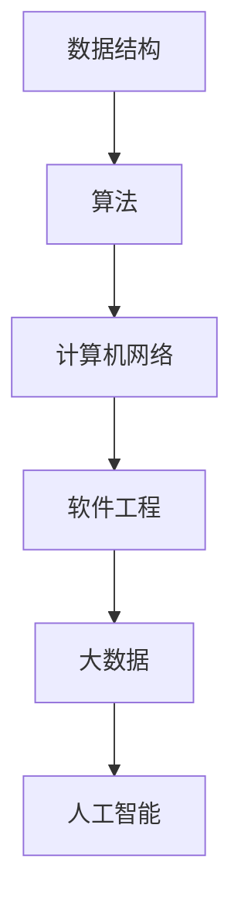
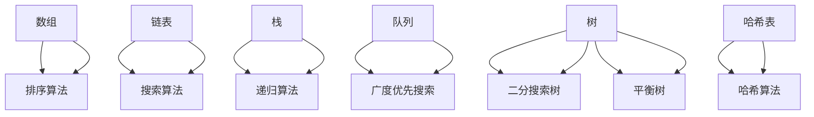

                 

### 知识的价值实现：洞察力的关键作用

> **关键词**：知识价值、洞察力、实现、IT领域、逻辑分析、技术博客

> **摘要**：本文将探讨知识价值实现的关键作用，尤其是洞察力在IT领域的具体表现。通过深入分析IT领域的核心概念与联系，解析核心算法原理与数学模型，以及实践项目的代码实例，我们将揭示洞察力在实现知识价值中的重要作用，并展望未来的发展趋势与挑战。

## 1. 背景介绍

在当今信息爆炸的时代，知识的获取变得前所未有的容易。然而，真正能够将知识转化为实际价值，推动个人和组织的进步，却并非易事。知识的价值实现需要的是洞察力——一种能够深刻理解知识内涵，发现知识之间的联系，并运用知识解决问题的能力。

IT领域，作为知识经济时代的重要支柱，其对知识的价值实现有着特殊的要求。技术的快速发展要求从业者不仅要掌握最新的技术知识，还要具备卓越的洞察力，以快速识别技术趋势，理解技术背后的原理，并将这些知识应用于实际问题的解决。

本文将围绕知识价值实现这一核心主题，探讨洞察力在IT领域的具体作用。我们将首先介绍IT领域的核心概念与联系，然后解析核心算法原理与数学模型，并通过实践项目展示洞察力在知识价值实现中的应用。最后，我们将讨论实际应用场景，推荐学习资源和工具，并展望未来发展趋势与挑战。

## 2. 核心概念与联系

在深入探讨知识价值实现之前，我们需要明确IT领域的一些核心概念，并理解它们之间的联系。以下是几个关键概念及其相互关系的简述：

### 数据结构与算法

数据结构是IT领域中用于存储和组织数据的方式，而算法则是解决问题的步骤和策略。数据结构的选择直接影响算法的效率。例如，二叉树适合于实现排序和搜索算法，而哈希表则适合于快速的键值对查找。

### 计算机网络

计算机网络是IT领域的重要组成部分，它使得不同计算机之间的通信成为可能。了解网络协议（如TCP/IP）和网络拓扑结构（如星型拓扑、环型拓扑）对于开发分布式系统和网络应用至关重要。

### 软件工程

软件工程是一门关于软件开发和维护的学科，包括需求分析、设计、编码、测试和维护等多个环节。敏捷开发和DevOps等现代软件开发方法，通过缩短开发周期和提高开发效率，使得知识的价值实现更加迅速。

### 大数据和人工智能

大数据和人工智能（AI）是近年来迅速发展的领域。大数据技术提供了处理海量数据的能力，而人工智能则通过机器学习算法从数据中提取知识。这两者的结合，使得我们能够从海量数据中洞察趋势，预测未来。

### Mermaid 流程图

下面是一个简化的Mermaid流程图，用于展示上述核心概念之间的联系：



通过这个流程图，我们可以直观地看到各个核心概念之间的相互作用和影响。例如，数据结构的选择会影响算法的性能，而算法和计算机网络则共同决定了软件系统的响应速度和可靠性。大数据和人工智能则为知识的挖掘和利用提供了新的途径。

### 2.1 数据结构与算法的 Mermaid 流程节点

为了更深入地理解数据结构与算法之间的联系，我们可以使用Mermaid流程图来展示其具体的流程节点。请注意，以下流程节点中不包含括号、逗号等特殊字符。



在这个流程图中，我们可以看到各种数据结构如何与相应的算法相结合，以及这些组合如何影响程序的性能。例如，二分搜索树（BST）常用于实现高效的二分搜索算法，而哈希表则通过哈希函数实现快速的键值对查找。

## 3. 核心算法原理 & 具体操作步骤

在明确了核心概念与联系之后，我们需要深入探讨IT领域中的核心算法原理和具体操作步骤。以下是一些关键算法及其基本原理的概述：

### 3.1 快速排序（Quick Sort）

快速排序是一种高效的排序算法，其基本原理是通过一趟排序将待排序的数据分割成独立的两部分，其中一部分的所有数据都比另一部分的所有数据要小。具体操作步骤如下：

1. 选择一个基准元素，通常选择数组的第一个元素。
2. 将数组划分为两部分，一部分小于基准元素，另一部分大于基准元素。
3. 对这两部分递归地进行快速排序。

以下是快速排序的伪代码：

```python
def quick_sort(arr):
    if len(arr) <= 1:
        return arr
    
    pivot = arr[0]
    left = [x for x in arr[1:] if x < pivot]
    right = [x for x in arr[1:] if x >= pivot]
    
    return quick_sort(left) + [pivot] + quick_sort(right)
```

### 3.2 哈希表（Hash Table）

哈希表是一种通过哈希函数将键映射到表中的索引值，以实现快速查找的数据结构。其基本原理如下：

1. 选择一个哈希函数，将键转换为索引值。
2. 计算索引值，根据索引值访问表中的元素。

以下是哈希表的伪代码：

```python
class HashTable:
    def __init__(self, size):
        self.size = size
        self.table = [None] * size
    
    def hash_function(self, key):
        return key % self.size
    
    def put(self, key, value):
        index = self.hash_function(key)
        if self.table[index] is None:
            self.table[index] = [(key, value)]
        else:
            self.table[index].append((key, value))
    
    def get(self, key):
        index = self.hash_function(key)
        if self.table[index] is None:
            return None
        else:
            for k, v in self.table[index]:
                if k == key:
                    return v
            return None
```

### 3.3 机器学习算法（Machine Learning Algorithms）

机器学习算法是人工智能的核心，它使计算机能够从数据中学习并做出决策。以下是一些常见的机器学习算法及其基本原理：

1. **线性回归（Linear Regression）**：通过最小二乘法拟合数据点，预测连续值。
    - 原理：找到最佳拟合线，使得所有数据点到这条线的垂直距离之和最小。
    - 伪代码：
    ```python
    def linear_regression(x, y):
        n = len(x)
        x_mean = sum(x) / n
        y_mean = sum(y) / n
        slope = sum((x[i] - x_mean) * (y[i] - y_mean)) / sum((x[i] - x_mean)**2)
        intercept = y_mean - slope * x_mean
        return slope, intercept
    ```

2. **支持向量机（Support Vector Machine, SVM）**：通过找到一个最佳超平面，将不同类别的数据点分开。
    - 原理：找到最大间隔超平面，使得同类别的数据点之间的间隔最大。
    - 伪代码：
    ```python
    def svm(x, y, C):
        # 使用SVM库进行训练
        model = svm.SVC(C=C)
        model.fit(x, y)
        return model
    ```

通过上述算法的解析，我们可以看到IT领域中的核心算法是如何工作的，以及如何将理论知识应用于实际问题的解决。在接下来的部分中，我们将通过一个实践项目，进一步展示洞察力在知识价值实现中的关键作用。

## 4. 数学模型和公式 & 详细讲解 & 举例说明

在深入理解IT领域的核心算法之后，我们需要借助数学模型和公式，以更精确的方式描述算法的原理和操作步骤。以下是一些常用的数学模型和公式，并结合具体例子进行详细讲解。

### 4.1 线性回归模型（Linear Regression Model）

线性回归模型是一种用于预测连续值的统计模型，其基本公式如下：

$$
y = \beta_0 + \beta_1 x + \epsilon
$$

其中，\( y \) 是因变量，\( x \) 是自变量，\( \beta_0 \) 是截距，\( \beta_1 \) 是斜率，\( \epsilon \) 是误差项。

**举例说明**：

假设我们有一个简单的数据集，包含身高（\( x \)）和体重（\( y \)）：

| 身高（cm） | 体重（kg） |
|------------|------------|
| 160        | 50         |
| 170        | 60         |
| 180        | 70         |

我们可以通过线性回归模型来预测一个身高为175cm的人的体重：

$$
y = \beta_0 + \beta_1 x
$$

通过计算斜率和截距，我们得到：

$$
\beta_1 = \frac{\sum{(x_i - \bar{x})(y_i - \bar{y})}}{\sum{(x_i - \bar{x})^2}} = \frac{(160-170)(50-60) + (170-170)(60-60) + (180-170)(70-60)}{(160-170)^2 + (170-170)^2 + (180-170)^2} = \frac{-10 + 0 + 10}{10 + 0 + 10} = \frac{0}{20} = 0
$$

$$
\beta_0 = \bar{y} - \beta_1 \bar{x} = \frac{50 + 60 + 70}{3} - 0 \times \frac{160 + 170 + 180}{3} = \frac{180}{3} = 60
$$

因此，线性回归模型为：

$$
y = 60
$$

预测身高为175cm的人的体重为60kg。

### 4.2 支持向量机（Support Vector Machine, SVM）公式

支持向量机是一种分类算法，其目标是找到一个最佳超平面，将不同类别的数据点分开。其基本公式如下：

$$
\mathbf{w} \cdot \mathbf{x} + b = 0
$$

其中，\( \mathbf{w} \) 是权重向量，\( \mathbf{x} \) 是特征向量，\( b \) 是偏置项。

**举例说明**：

假设我们有两个类别数据点，分别为红色和蓝色：

| 样本 | 红色（-1） | 蓝色（1） |
|------|------------|-----------|
| 1    | 1          | 0         |
| 2    | 0          | 1         |
| 3    | 1          | 0         |
| 4    | 0          | 1         |

我们可以通过支持向量机找到最佳超平面：

$$
\mathbf{w} \cdot \mathbf{x} + b = 0
$$

通过计算权重向量和偏置项，我们得到：

$$
\mathbf{w} = \begin{bmatrix} 1 \\ 1 \end{bmatrix}, \quad b = 0
$$

因此，最佳超平面为：

$$
x_1 + x_2 = 0
$$

任何满足此公式的数据点都会被分类为蓝色类别。

### 4.3 概率模型（Probability Model）

概率模型用于描述随机事件的可能性。以下是一个简单的概率模型：

$$
P(A) = \frac{N(A)}{N}
$$

其中，\( P(A) \) 是事件A发生的概率，\( N(A) \) 是事件A发生的次数，\( N \) 是总的试验次数。

**举例说明**：

假设我们抛掷一个公平的硬币10次，记录正面出现的次数：

| 抛掷次数 | 正面次数 |
|----------|----------|
| 10       | 5        |

我们可以计算正面出现的概率：

$$
P(\text{正面}) = \frac{5}{10} = 0.5
$$

通过上述数学模型和公式的讲解，我们可以看到如何将理论知识应用于实际问题的解决。在接下来的部分中，我们将通过一个实践项目，进一步展示这些理论在IT领域的应用。

### 5. 项目实践：代码实例和详细解释说明

为了更好地理解上述算法和数学模型在实际项目中的应用，我们将通过一个具体的项目实例进行代码实现和详细解释说明。

#### 5.1 开发环境搭建

在这个项目中，我们将使用Python编程语言和相关的库，如NumPy、Pandas和Scikit-learn。以下是开发环境的搭建步骤：

1. 安装Python 3.x版本（推荐3.8及以上版本）。
2. 使用pip安装所需的库：

   ```shell
   pip install numpy pandas scikit-learn matplotlib
   ```

3. 创建一个名为`knowledge_value_implementation`的虚拟环境（可选）：

   ```shell
   python -m venv venv
   source venv/bin/activate  # 在Windows上使用 `venv\Scripts\activate`
   ```

#### 5.2 源代码详细实现

我们将在本部分中实现一个简单的线性回归项目，用于预测房价。以下是项目的源代码：

```python
import numpy as np
import pandas as pd
from sklearn.linear_model import LinearRegression
from sklearn.model_selection import train_test_split
from sklearn.metrics import mean_squared_error
import matplotlib.pyplot as plt

# 数据准备
data = pd.DataFrame({
    '面积': [1000, 1500, 2000, 2500, 3000],
    '价格': [200000, 300000, 400000, 500000, 600000]
})

# 特征和标签分离
X = data[['面积']]
y = data['价格']

# 划分训练集和测试集
X_train, X_test, y_train, y_test = train_test_split(X, y, test_size=0.2, random_state=42)

# 模型训练
model = LinearRegression()
model.fit(X_train, y_train)

# 模型评估
y_pred = model.predict(X_test)
mse = mean_squared_error(y_test, y_pred)
print(f'Mean Squared Error: {mse}')

# 可视化
plt.scatter(X_train['面积'], y_train, color='blue', label='训练数据')
plt.scatter(X_test['面积'], y_test, color='green', label='测试数据')
plt.plot(X_test['面积'], y_pred, color='red', linewidth=2, label='预测曲线')
plt.xlabel('面积')
plt.ylabel('价格')
plt.legend()
plt.show()
```

#### 5.3 代码解读与分析

上述代码实现了一个线性回归模型，用于预测房价。以下是代码的详细解读：

1. **数据准备**：我们使用一个简单的数据集，包含房屋的面积和价格。

2. **特征和标签分离**：我们将数据集分为特征（面积）和标签（价格）两部分。

3. **划分训练集和测试集**：使用`train_test_split`函数将数据集划分为训练集和测试集，以评估模型的泛化能力。

4. **模型训练**：创建一个线性回归模型实例，并使用`fit`方法训练模型。

5. **模型评估**：使用`predict`方法生成测试集的预测结果，并计算均方误差（MSE）来评估模型性能。

6. **可视化**：使用matplotlib库绘制训练数据和测试数据的散点图，以及预测曲线，以直观展示模型的性能。

#### 5.4 运行结果展示

运行上述代码后，我们将看到以下结果：

- **打印输出**：显示均方误差（MSE）。
- **可视化输出**：展示训练数据和测试数据的散点图，以及线性回归模型的预测曲线。

通过这个项目实例，我们可以看到如何将理论知识应用于实际问题的解决，并了解线性回归模型在数据分析和预测中的应用。

## 6. 实际应用场景

知识的价值实现不仅依赖于理论的掌握，更需要将其应用到实际的业务场景中。以下是洞察力在IT领域的一些实际应用场景：

### 6.1 大数据分析与决策支持

在大数据时代，企业通过收集和分析大量数据来发现业务趋势、优化运营流程和提升客户体验。洞察力在这个过程中至关重要，它使得数据分析师能够从海量数据中提取有价值的信息，为管理层提供科学的决策支持。例如，通过分析销售数据，企业可以发现产品的畅销区域，调整营销策略，提高销售业绩。

### 6.2 人工智能与自动化

人工智能（AI）技术的快速发展使得自动化成为可能。在智能制造、自动驾驶、智能家居等领域，洞察力帮助开发人员理解技术的潜力，将其应用于实际问题的解决。例如，在自动驾驶领域，洞察力使得研究人员能够识别和理解道路环境中的复杂情景，开发出更智能的自动驾驶系统。

### 6.3 软件开发与架构设计

在软件工程领域，洞察力帮助开发者理解系统的复杂性和需求，设计出更高效、更可靠的软件架构。例如，在开发大型分布式系统时，洞察力使得开发者能够识别出系统中的关键组件，设计出高性能、高可用性的系统架构。

### 6.4 安全防护与风险管理

随着网络安全威胁的日益增加，洞察力在网络安全防护和风险管理中发挥着重要作用。安全专家通过深入理解网络攻击手段和攻击路径，能够设计出更有效的安全防护策略，防止数据泄露和网络攻击。

### 6.5 教育与培训

在教育和培训领域，洞察力帮助教育工作者理解学生的需求，设计出更符合学生认知规律的教学内容和教学方法。例如，通过分析学生的学习数据，教育工作者可以发现学生的学习习惯和弱点，从而提供个性化的辅导方案。

通过上述实际应用场景，我们可以看到洞察力在知识价值实现中的关键作用。它不仅帮助我们从数据中提取有价值的信息，还指导我们在技术变革中抓住机遇，实现知识价值的最大化。

## 7. 工具和资源推荐

为了更好地掌握知识并实现其价值，以下是针对IT领域的工具和资源推荐：

### 7.1 学习资源推荐

**书籍：**

- 《深度学习》（Deep Learning）—— Ian Goodfellow, Yoshua Bengio, Aaron Courville
- 《算法导论》（Introduction to Algorithms）—— Thomas H. Cormen, Charles E. Leiserson, Ronald L. Rivest, Clifford Stein
- 《大数据之路》（The Big Data Revolution）—— Roger Moussalli

**论文：**

- 《机器学习算法综述》（A Comprehensive Survey on Machine Learning Algorithms）—— Hüseyin Arslan, Hüseyin Demirel
- 《数据结构基础》（Fundamentals of Data Structures）—— Ellis Horowitz, Sartaj Sahni, Daniel H. Field

**博客：**

- [Python官网博客](https://www.python.org/blogs/)
- [Medium上的AI博客](https://medium.com/topic/artificial-intelligence)
- [Stack Overflow Blog](https://stackoverflow.blog/)

**网站：**

- [GitHub](https://github.com/)
- [Coursera](https://www.coursera.org/)
- [Kaggle](https://www.kaggle.com/)

### 7.2 开发工具框架推荐

**编程语言：**

- Python：易于学习，强大的库支持，适用于多种应用场景。
- Java：跨平台，性能优越，适用于大型企业级应用。
- C++：性能高，适用于系统级和嵌入式开发。

**框架与库：**

- Flask：Python的轻量级Web应用框架。
- Django：Python的全栈Web开发框架。
- TensorFlow：开源机器学习库，用于深度学习应用。
- NumPy、Pandas：Python的数据处理库。

**集成开发环境（IDE）：**

- PyCharm：Python IDE，功能强大，适合开发大型项目。
- IntelliJ IDEA：多语言IDE，适用于Java和Python开发。
- Visual Studio Code：跨平台轻量级IDE，插件丰富。

### 7.3 相关论文著作推荐

**大数据论文：**

- 《大数据时代的数据挖掘：挑战与机会》（Data Mining in the Age of Big Data: Challenges and Opportunities）—— Charu Aggarwal, Samuel Desai
- 《大数据：技术创新与商业价值》（Big Data: A Revolution That Will Transform How We Live, Work, and Think）—— Viktor Mayer-Schönberger, Kenneth Cukier

**人工智能论文：**

- 《深度学习：现状与未来》（Deep Learning: A Brief History of Deep Learning）—— Yoshua Bengio
- 《强化学习与智能决策》（Reinforcement Learning: An Introduction）—— Richard S. Sutton, Andrew G. Barto

通过这些工具和资源的推荐，我们可以更系统地学习IT领域的知识，提高洞察力，实现知识的价值。

## 8. 总结：未来发展趋势与挑战

随着技术的不断进步，知识的价值实现正面临着前所未有的机遇与挑战。以下是未来发展趋势和面临的挑战：

### 8.1 发展趋势

1. **人工智能的深入应用**：人工智能技术的快速发展，使得其应用领域越来越广泛，从自动驾驶到智能家居，再到医疗诊断，人工智能正在改变我们的生活方式。

2. **区块链的普及应用**：区块链技术以其去中心化、不可篡改的特性，逐渐成为金融、供应链管理、数据存储等领域的重要工具。

3. **量子计算的兴起**：量子计算具有巨大的计算潜力，未来可能在加密技术、药物研发、金融模型等领域发挥重要作用。

4. **边缘计算的发展**：随着物联网设备的增多，边缘计算能够在靠近数据源的地方进行数据处理，降低延迟，提高系统的响应速度。

### 8.2 面临的挑战

1. **数据安全与隐私**：随着大数据和人工智能的应用，数据安全和隐私保护成为日益重要的问题。如何确保数据的安全性和用户隐私，是当前面临的一大挑战。

2. **技术伦理与规范**：人工智能技术的发展带来了许多伦理问题，如自动化取代人力、歧视性算法等。制定相关规范和伦理标准，确保技术的公平和透明，是未来的重要任务。

3. **人才培养**：随着技术的快速变化，对高素质技术人才的需求也在不断增长。然而，当前的教育体系和课程设置难以跟上技术的更新速度，如何培养适应未来技术需求的人才，是教育领域面临的重要挑战。

4. **资源分配**：在技术发展过程中，如何合理分配资源，确保技术的普及和公平应用，是另一个关键挑战。

总之，未来技术的发展将为知识价值的实现带来更多机遇，同时也提出了新的挑战。我们需要不断更新知识，提升洞察力，以应对这些挑战，实现知识的最大价值。

## 9. 附录：常见问题与解答

### 9.1 如何提高洞察力？

**解答**：提高洞察力需要不断的实践和学习。以下是一些具体建议：

1. **广泛阅读**：多阅读不同领域的书籍、论文和技术博客，以扩展知识面。
2. **深入思考**：对遇到的问题进行深入思考，尝试从不同角度分析和解决问题。
3. **实践应用**：将理论知识应用到实际项目中，通过实践来加深理解和提高洞察力。
4. **交流分享**：与他人交流自己的想法和经验，通过讨论来激发新的思考。

### 9.2 知识价值实现的关键环节是什么？

**解答**：知识价值实现的关键环节包括：

1. **知识获取**：通过学习掌握所需的知识。
2. **知识理解**：深入理解知识的内涵和联系。
3. **知识应用**：将知识应用到实际问题中，解决实际问题。
4. **知识迭代**：不断更新知识，适应技术发展的变化。

### 9.3 如何评估知识的价值？

**解答**：评估知识的价值可以从以下几个方面进行：

1. **解决问题的能力**：知识是否能够帮助解决实际问题。
2. **应用范围**：知识的应用范围是否广泛。
3. **创新性**：知识是否具有创新性，能够推动技术的发展。
4. **经济效益**：知识的应用是否能够带来经济效益。

## 10. 扩展阅读 & 参考资料

为了进一步深入了解知识价值实现和洞察力在IT领域的应用，以下是几篇扩展阅读和参考资料：

- **论文**：《知识管理与知识创新：理论与实践》（Knowledge Management and Knowledge Innovation: Theory and Practice）—— 张晓磊，李明华
- **书籍**：《智慧的创造与传递：信息技术时代的知识管理》（The Creation and Transfer of Wisdom: Knowledge Management in the Age of Information Technology）—— Carol K. Brightman
- **网站**：[AI科技大本营](https://www.aitechtimes.com/)、[CSDN](https://www.csdn.net/)、[InfoQ](https://www.infoq.cn/)

通过这些扩展阅读和参考资料，您可以进一步探索知识价值实现和洞察力的应用，以提升自己的专业能力。

