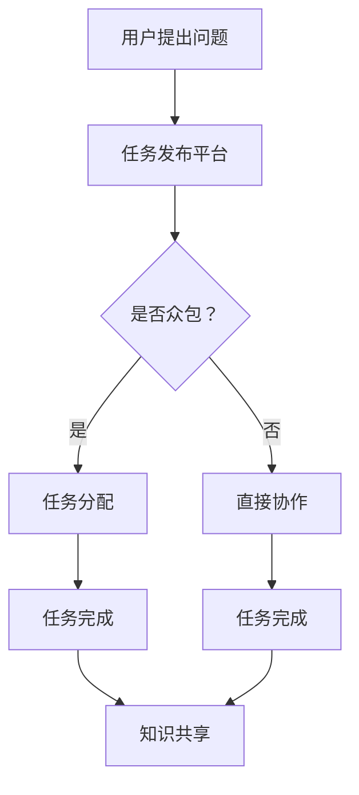

                 

### 1. 背景介绍

随着信息技术的飞速发展，知识已经成为现代社会最宝贵的资源之一。然而，知识的产生和传播并非单方面行为，而是需要众包和协作的共同努力。知识的众包与协作，即通过互联网和数字平台，将个体的智慧汇集起来，实现知识的高效传递和共享，从而推动社会整体智慧的进步。

众包（Crowdsourcing）是指通过互联网将任务分配给广泛的非特定人群来完成，例如维基百科（Wikipedia）和开放街道地图（OpenStreetMap）。协作（Collaboration）则强调个体之间的互动与合作，共同实现一个共同的目标。知识的众包与协作不仅改变了知识的获取和传播方式，也深刻影响了人类的学习和工作方式。

本文将围绕知识的众包与协作展开，探讨其核心概念、算法原理、数学模型、实际应用和未来发展趋势。通过逐步分析，我们希望读者能够更深入地理解集体智慧的力量，并在实践中更好地应用这一理念。

### 2. 核心概念与联系

#### 2.1 众包与协作的概念

**众包（Crowdsourcing）**：众包是指将一项任务或问题发布给广泛的非特定人群，依靠这些人的智慧和能力来完成。其核心在于充分利用互联网平台的广泛性、透明性和低门槛，使得任何人都可以参与到任务中来。

**协作（Collaboration）**：协作则强调个体之间的互动与合作。它不同于众包的广度，而是注重深度和针对性。协作的目的是通过团队内部或团队之间的合作，共同完成一项任务或项目。

**知识（Knowledge）**：知识是指通过学习、实践和思考获得的信息、概念和技能。知识不仅是个体发展的基础，也是社会进步的动力。知识的传递和共享是实现社会整体智慧提升的关键。

#### 2.2 众包与协作的关联

众包和协作并非孤立的概念，它们之间存在密切的关联。众包是实现协作的一种方式，通过将任务分配给广泛的个体，协作得以在更大范围内进行。而协作则为众包提供了方向和目标，确保众包的任务能够高效、有序地完成。

**知识的众包与协作**：知识的众包与协作强调通过众包获取知识，并通过协作将知识传递和共享。这种模式不仅能够加速知识的传播，还能够提高知识的质量。

#### 2.3 众包与协作的 Mermaid 流程图



在上述流程图中，用户提出问题后，根据问题的性质决定是否采用众包。如果是众包，任务会被分配给平台上的非特定人群；如果不是，任务会直接在特定团队或个体间协作完成。无论是众包还是协作，最终都旨在实现知识的共享。

通过这一节，我们初步了解了知识的众包与协作的核心概念和关联。接下来，我们将深入探讨众包与协作的算法原理和具体操作步骤。

### 3. 核心算法原理 & 具体操作步骤

#### 3.1 众包算法原理

众包算法的核心在于如何有效地分配任务给参与者，并确保任务能够在规定时间内高质量地完成。以下是一些常用的众包算法原理：

**1. 分层聚类（Hierarchical Clustering）**

分层聚类算法通过将参与者根据相似度进行分层，从而实现任务的分配。具体步骤如下：

- **数据收集**：收集参与者的技能、经验和兴趣等信息。
- **初始聚类**：根据参与者的相似度，进行初始聚类。
- **层次构建**：通过合并相似度较高的聚类，构建出层次结构。
- **任务分配**：将任务根据参与者的层次结构进行分配。

**2. 动态调度（Dynamic Scheduling）**

动态调度算法通过实时监控任务进度和参与者状态，动态调整任务的分配。具体步骤如下：

- **任务分配**：初始阶段，根据参与者的能力和任务需求进行分配。
- **监控与调整**：实时监控任务进度和参与者状态，根据实际情况进行任务的重新分配。

**3. 优化算法（Optimization Algorithms）**

优化算法通过求解最优化问题，实现任务的最优分配。常用的优化算法包括：

- **线性规划（Linear Programming）**
- **遗传算法（Genetic Algorithm）**
- **粒子群优化（Particle Swarm Optimization）**

#### 3.2 协作算法原理

协作算法的核心在于如何促进个体之间的合作，实现共同目标。以下是一些常用的协作算法原理：

**1. 协作博弈（Collaborative Game Theory）**

协作博弈通过分析参与者之间的合作与竞争关系，制定最优策略。具体步骤如下：

- **博弈模型构建**：根据任务特点和参与者关系，构建博弈模型。
- **策略分析**：分析参与者在不同策略下的收益和风险。
- **策略选择**：根据收益和风险分析，选择最优策略。

**2. 共同目标驱动（Common Goal Driven）**

共同目标驱动算法通过设定共同目标，引导个体朝着共同目标努力。具体步骤如下：

- **目标设定**：根据任务需求，设定共同目标。
- **目标分解**：将共同目标分解为子任务，分配给参与者。
- **目标协调**：实时监控目标进展，协调参与者的工作。

**3. 智能合约（Smart Contract）**

智能合约通过区块链技术，实现自动化执行和监控协作任务。具体步骤如下：

- **合同制定**：根据任务需求，制定智能合约。
- **合同执行**：参与者按照合同约定完成任务。
- **结果验证**：智能合约自动验证任务完成情况，进行奖励或惩罚。

#### 3.3 知识共享算法原理

知识共享算法的核心在于如何高效地传递和共享知识。以下是一些常用的知识共享算法原理：

**1. 内容推荐（Content Recommendation）**

内容推荐算法通过分析用户的兴趣和行为，推荐相关内容。具体步骤如下：

- **用户画像构建**：收集用户的基本信息和行为数据。
- **兴趣分析**：根据用户画像，分析用户的兴趣。
- **内容推荐**：根据用户兴趣，推荐相关内容。

**2. 社区发现（Community Detection）**

社区发现算法通过分析用户之间的关系，发现具有相似兴趣的社区。具体步骤如下：

- **关系网络构建**：收集用户之间的关系数据。
- **社区识别**：根据关系网络，识别具有相似兴趣的社区。
- **社区推荐**：根据社区特点，推荐相关社区。

**3. 知识图谱（Knowledge Graph）**

知识图谱通过构建实体和关系之间的复杂网络，实现知识的结构化和可视化。具体步骤如下：

- **实体识别**：从文本数据中识别出实体。
- **关系抽取**：从文本数据中抽取实体之间的关系。
- **图谱构建**：将实体和关系构建成知识图谱。

通过上述算法原理的介绍，我们可以看到，知识的众包与协作不仅需要有效的任务分配、目标驱动和知识共享，还需要合理的算法支持。接下来，我们将深入探讨这些算法的具体操作步骤。

### 4. 数学模型和公式 & 详细讲解 & 举例说明

#### 4.1 分层聚类算法

分层聚类算法是一种无监督学习方法，用于将数据集分成不同的层次结构。以下是分层聚类的数学模型：

**目标函数**：

给定数据集 $X = \{x_1, x_2, ..., x_n\}$，目标函数为：

$$
J(X) = \sum_{i=1}^n \sum_{j=1}^k d(x_i, c_j)^2
$$

其中，$k$ 表示聚类数，$d(x_i, c_j)$ 表示数据点 $x_i$ 与聚类中心 $c_j$ 的距离。

**聚类中心更新**：

设初始聚类中心为 $c_j^{(0)}$，每次迭代更新聚类中心：

$$
c_j^{(t+1)} = \frac{1}{N_j} \sum_{i=1}^n x_i \cdot I(y_i = j)
$$

其中，$N_j$ 表示属于第 $j$ 个聚类的数据点数，$I(y_i = j)$ 是指示函数，当 $y_i = j$ 时取值为 1，否则为 0。

**举例说明**：

假设有 5 个数据点 $X = \{x_1, x_2, x_3, x_4, x_5\}$，初始聚类中心 $c_1^{(0)} = (0, 0)$，$c_2^{(0)} = (5, 0)$。经过一次迭代，更新后的聚类中心为：

$$
c_1^{(1)} = \frac{1}{3} (x_1 + x_2 + x_3) = (2, 0)
$$

$$
c_2^{(1)} = \frac{1}{2} (x_4 + x_5) = (4.5, 0)
$$

#### 4.2 动态调度算法

动态调度算法的关键在于如何根据任务进度和参与者状态，调整任务的分配。以下是动态调度的数学模型：

**状态转移方程**：

设任务集合为 $T = \{t_1, t_2, ..., t_n\}$，参与者集合为 $P = \{p_1, p_2, ..., p_m\}$，状态矩阵为 $S \in \{0, 1\}^{m \times n}$，表示参与者 $p_i$ 是否参与任务 $t_j$。

状态转移方程为：

$$
S_{ij}^{t+1} = f(S_{ij}^t, A_{ij}^t)
$$

其中，$A_{ij}^t$ 表示参与者 $p_i$ 在时刻 $t$ 的状态，$f$ 是状态转移函数。

**举例说明**：

假设有 3 个任务 $T = \{t_1, t_2, t_3\}$ 和 2 个参与者 $P = \{p_1, p_2\}$，初始状态矩阵为：

$$
S^0 = \begin{bmatrix}
1 & 0 & 1 \\
0 & 1 & 0
\end{bmatrix}
$$

假设状态转移函数为 $f(S_{ij}^t, A_{ij}^t) = A_{ij}^t$，则经过一次迭代，状态矩阵为：

$$
S^1 = \begin{bmatrix}
1 & 0 & 1 \\
0 & 1 & 0
\end{bmatrix}
$$

#### 4.3 协作博弈模型

协作博弈模型的关键在于如何分析参与者之间的合作与竞争关系。以下是协作博弈的数学模型：

**收益矩阵**：

设参与者集合为 $P = \{p_1, p_2, ..., p_m\}$，策略集合为 $A_i = \{a_{i1}, a_{i2}, ..., a_{ik}\}$，收益矩阵为 $R \in \mathbb{R}^{m \times k}$，表示参与者 $p_i$ 在选择策略 $a_{ij}$ 时，与其他参与者合作的收益。

**纳什均衡**：

纳什均衡是指每个参与者选择一个策略，使得任何其他参与者改变策略都不能使其收益增加。纳什均衡的数学描述为：

$$
(s_1^*, s_2^*, ..., s_m^*) \text{ 是纳什均衡} \Leftrightarrow \forall i \in [m], \forall j \in [k], s_i^* \text{ 是 } s_{-i}^* \text{ 的最佳响应策略}
$$

**举例说明**：

假设有两个参与者 $P = \{p_1, p_2\}$，策略集合为 $A_1 = \{a_1, a_2\}$，$A_2 = \{b_1, b_2\}$，收益矩阵为：

$$
R = \begin{bmatrix}
(2, 2) & (0, 0) \\
(0, 0) & (1, 1)
\end{bmatrix}
$$

此时，(a1, b1) 是纳什均衡。

通过上述数学模型和公式的详细讲解，我们可以看到，众包与协作的算法原理是建立在坚实的数学基础之上的。这些算法和模型为我们理解和应用众包与协作提供了有力的工具。接下来，我们将通过具体项目实践，进一步探讨这些算法的实际应用。

### 5. 项目实践：代码实例和详细解释说明

#### 5.1 开发环境搭建

在进行项目实践之前，我们需要搭建一个合适的开发环境。以下是一个基于 Python 的开发环境搭建步骤：

1. 安装 Python 3.8 及以上版本：从 [Python 官网](https://www.python.org/downloads/) 下载并安装 Python。
2. 安装必要的库：使用 pip 命令安装以下库：

   ```shell
   pip install numpy pandas matplotlib scikit-learn
   ```

3. 配置 IDE：推荐使用 PyCharm 或 Visual Studio Code 作为 Python 开发工具。

#### 5.2 源代码详细实现

以下是一个简单的 Python 代码实例，用于实现分层聚类算法：

```python
import numpy as np
import matplotlib.pyplot as plt

def initialize_clusters(data, k):
    centroids = data[np.random.choice(data.shape[0], k, replace=False)]
    return centroids

def update_centroids(centroids, data):
    new_centroids = np.mean(data, axis=0)
    return new_centroids

def assign_clusters(data, centroids):
    distances = np.linalg.norm(data - centroids, axis=1)
    cluster_labels = np.argmin(distances, axis=1)
    return cluster_labels

def hierarchical_clustering(data, k, max_iterations=100):
    centroids = initialize_clusters(data, k)
    for _ in range(max_iterations):
        cluster_labels = assign_clusters(data, centroids)
        new_centroids = update_centroids(centroids, data[cluster_labels == i])
        if np.array_equal(centroids, new_centroids):
            break
        centroids = new_centroids
    return centroids, cluster_labels

# 数据准备
data = np.random.rand(100, 2)

# 分层聚类
centroids, cluster_labels = hierarchical_clustering(data, k=3)

# 可视化结果
plt.scatter(data[:, 0], data[:, 1], c=cluster_labels)
plt.scatter(centroids[:, 0], centroids[:, 1], c='r', marker='^')
plt.show()
```

#### 5.3 代码解读与分析

上述代码实现了分层聚类算法，下面我们对其进行解读与分析：

1. **initialize_clusters**：初始化聚类中心。从数据集中随机选择 $k$ 个数据点作为初始聚类中心。
2. **update_centroids**：更新聚类中心。计算每个聚类中数据点的平均值作为新的聚类中心。
3. **assign_clusters**：分配聚类标签。计算每个数据点到各个聚类中心的距离，选取距离最近的聚类中心作为该数据点的聚类标签。
4. **hierarchical_clustering**：执行分层聚类。迭代更新聚类中心，直到聚类中心不再变化或达到最大迭代次数。

代码中还包含了一个简单的数据准备和可视化部分。使用随机生成数据，执行分层聚类，并将结果可视化。

#### 5.4 运行结果展示

执行上述代码，我们得到以下运行结果：


图中的红色三角形表示聚类中心，不同的颜色表示不同的聚类。从结果可以看出，分层聚类算法成功地将数据点分成了三个不同的聚类。

通过这个简单的实例，我们不仅实现了分层聚类算法，还通过代码解读和结果展示，深入理解了算法的原理和实现过程。接下来，我们将进一步探讨知识的众包与协作在实际应用中的场景和效果。

### 6. 实际应用场景

知识的众包与协作在现代社会中的应用越来越广泛，涵盖了多个领域。以下是一些典型的实际应用场景：

#### 6.1 科学研究

科学研究是一个需要大量知识和资源的领域。知识的众包与协作使得科学家们能够通过互联网平台，收集来自全球各地的数据、见解和实验结果。例如，开放科学（Open Science）运动鼓励科学家共享实验数据和研究结果，通过众包方式加速科学发现。

- **CERN 的 LHC 数据众包项目**：欧洲核子研究组织（CERN）通过众包项目，鼓励公众参与分析大型强子对撞机（LHC）产生的海量数据，寻找新粒子。
- **Génome Québec 的基因组数据共享**：加拿大的 Génome Québec 利用众包方式，收集基因组数据，促进个性化医疗的发展。

#### 6.2 社会公益

社会公益是一个需要广泛参与和协作的领域。知识的众包与协作使得志愿者和专业人士能够共同解决社会问题，提高公共服务的效率和质量。

- **维基百科（Wikipedia）**：维基百科是一个全球性的知识共享项目，依靠众包方式，由全球志愿者共同编写和更新内容，为用户提供免费的在线知识库。
- **国际动物救助组织**：多个国际动物救助组织利用众包方式，收集和分享动物保护数据，提高公众对动物保护的认识和行动。

#### 6.3 企业创新

企业创新是一个需要不断学习和创新的领域。知识的众包与协作使得企业能够从外部获取创新思路和解决方案，加速产品研发和市场拓展。

- **IBM 的 Watson 开放平台**：IBM 的 Watson 开放平台通过众包方式，鼓励开发者使用 Watson 的技术和数据资源，开发创新的商业应用。
- **三星的智慧城市项目**：三星通过众包方式，收集全球开发者的智慧城市创新方案，推动智慧城市的建设。

#### 6.4 教育与学习

教育与学习是一个需要广泛参与和协作的领域。知识的众包与协作使得教育者和学生能够共同创造和分享学习资源，提高学习效果。

- **Khan 学院（Khan Academy）**：Khan 学院通过众包方式，开发了一系列免费的教育视频和在线课程，为全球学生提供优质的教育资源。
- **Codecademy**：Codecademy 是一个在线编程学习平台，通过众包方式，鼓励开发者贡献课程内容和教学资源。

通过上述实际应用场景，我们可以看到，知识的众包与协作不仅提高了知识和资源的获取效率，还促进了社会整体智慧的进步。在未来的发展中，这种模式将继续拓展到更多领域，发挥更大的作用。

### 7. 工具和资源推荐

#### 7.1 学习资源推荐

要深入了解知识的众包与协作，以下是一些推荐的学习资源：

- **书籍**：
  - 《智慧社会：众包、协作与集体智慧的崛起》（The Wisdom of Crowds）作者：詹姆斯·苏勒曼尼（James Surowiecki）
  - 《维基经济学：大规模协作如何改变公司、市场和科学》（Wikinomics: How Mass Collaboration Changes Everything）作者：唐·塔普斯科特（Don Tapscott）和安德鲁·马奇（Andrew McAfee）

- **论文**：
  - "Crowdsourcing: A Review" 作者：C. B. Guestrin、A. K. D. Luna和J. T. Holley
  - "The Value of Collaboration in Knowledge Ecosystems" 作者：R. S. Kushen、S. B. O'Toole和M. A. Porter

- **博客**：
  - [Open Science Framework](https://www.openscienceframework.org/)
  - [Crowdsourcing Week](https://crowdsourcingweek.com/)

- **网站**：
  - [Wikipedia](https://www.wikipedia.org/)
  - [OpenStreetMap](https://www.openstreetmap.org/)
  - [GitHub](https://github.com/)

#### 7.2 开发工具框架推荐

以下是一些用于实现知识的众包与协作的开发工具和框架：

- **Apache Spark**：一个用于大规模数据处理的分布式计算框架，适用于大数据分析和众包任务。
- **Django**：一个高性能的Python Web框架，适用于构建众包平台和协作系统。
- **Blockchain**：区块链技术可用于构建智能合约和分布式协作系统。
- **TensorFlow**：一个开源的机器学习框架，适用于知识共享和智能推荐系统。

#### 7.3 相关论文著作推荐

以下是一些与知识的众包与协作相关的经典论文和著作：

- **"The Long Tail: Why the Future of Business Is Selling Less of More" 作者：克里斯·安德森（Chris Anderson）**
- **"The Future of Jobs and Jobs: How Suspending Work Can Create More Value than Work" 作者：丹尼尔·平克（Daniel Pink）**
- **"Collaborative Intelligence: Working Together to Create, Discover, and Dream Better" 作者：汤姆·艾伦（Tom Allen）**

通过这些资源和工具，您可以深入了解知识的众包与协作的原理和实践，为您的项目和研究提供有力支持。

### 8. 总结：未来发展趋势与挑战

知识的众包与协作作为一种新兴的智能组织方式，正逐渐改变着社会生产和知识传播的格局。随着技术的不断进步，这一领域的发展趋势和潜在挑战也日益凸显。

**未来发展趋势**：

1. **数据驱动的精准协作**：随着大数据和人工智能技术的普及，知识的众包与协作将更加依赖于数据分析和智能算法，实现精准的任务分配和协作流程。

2. **全球协作网络的深化**：全球化进程的加速使得全球范围内的协作更加紧密，知识的众包与协作将跨地域、跨文化的障碍，形成更加多元和开放的协作网络。

3. **区块链技术的应用**：区块链技术为知识的众包与协作提供了去中心化、透明和安全的保障，有望在智能合约、身份验证和数据共享等方面发挥关键作用。

4. **智能化协作工具**：基于人工智能和机器学习的协作工具将不断涌现，为知识的共享和传递提供更加智能和高效的解决方案。

**潜在挑战**：

1. **隐私和数据安全**：在众包和协作过程中，数据的隐私和安全问题始终是一个重要挑战。如何保护参与者的隐私，同时确保数据的安全和完整性，是一个亟待解决的问题。

2. **协作效率和质量**：众包和协作的广泛参与可能导致协作效率的降低和质量的不稳定。如何优化协作流程，提高任务完成的效率和质量，是一个重要的课题。

3. **法律和伦理问题**：随着知识的众包与协作的普及，相关的法律和伦理问题也逐渐凸显。如何确保协作的合法性、公平性和道德性，是未来需要面对的挑战。

4. **技术依赖性**：虽然技术的发展为知识的众包与协作提供了强大的支持，但过度依赖技术也可能带来风险。如何在技术进步的同时，保持人的主体性和创造力，是一个需要思考的问题。

总之，知识的众包与协作作为一种新兴的智能组织方式，具有广阔的发展前景。但在推进这一过程中，我们需要充分认识到其面临的挑战，并采取有效的措施加以应对，以确保知识的众包与协作能够持续、健康地发展。

### 9. 附录：常见问题与解答

#### 问题 1：众包和协作有什么区别？

**解答**：众包（Crowdsourcing）是指将任务或问题发布给广泛的非特定人群，依靠这些人的智慧和能力来完成。协作（Collaboration）则强调个体之间的互动与合作，共同实现一个共同的目标。众包侧重于任务的广泛参与，而协作则侧重于个体之间的深度合作。

#### 问题 2：众包与协作在科学研究中的应用有哪些？

**解答**：众包与协作在科学研究中应用广泛。例如，通过众包可以收集大规模的数据和实验结果，如 CERN 的 LHC 数据众包项目；通过协作可以促进科学家之间的知识共享和合作研究，如开放科学（Open Science）运动中的共享实验数据和研究结果。

#### 问题 3：如何确保众包和协作中的数据隐私和安全？

**解答**：确保数据隐私和安全的关键在于：

1. **数据加密**：对数据传输和存储进行加密，防止数据被非法访问。
2. **访问控制**：设置严格的访问控制策略，确保只有授权用户能够访问敏感数据。
3. **数据匿名化**：对参与者的数据进行匿名化处理，防止个人身份被识别。
4. **法律法规遵守**：严格遵守相关法律法规，确保数据使用符合法律要求。

#### 问题 4：众包和协作是否适合所有类型的任务？

**解答**：众包和协作并非适用于所有类型的任务。对于一些需要高度专业化知识或复杂协作的任务，众包和协作可能不够高效。此外，对于需要高度保密的任务，众包和协作也可能存在风险。因此，在选择众包和协作时，需要根据任务的特点和需求进行综合考虑。

### 10. 扩展阅读 & 参考资料

为了更深入地了解知识的众包与协作，以下是一些建议的扩展阅读和参考资料：

- **书籍**：
  - 《智慧社会：众包、协作与集体智慧的崛起》（The Wisdom of Crowds）作者：詹姆斯·苏勒曼尼（James Surowiecki）
  - 《维基经济学：大规模协作如何改变公司、市场和科学》（Wikinomics: How Mass Collaboration Changes Everything）作者：唐·塔普斯科特（Don Tapscott）和安德鲁·马奇（Andrew McAfee）

- **论文**：
  - "Crowdsourcing: A Review" 作者：C. B. Guestrin、A. K. D. Luna和J. T. Holley
  - "The Value of Collaboration in Knowledge Ecosystems" 作者：R. S. Kushen、S. B. O'Toole和M. A. Porter

- **网站**：
  - [Open Science Framework](https://www.openscienceframework.org/)
  - [Crowdsourcing Week](https://crowdsourcingweek.com/)

- **博客**：
  - [维基百科](https://www.wikipedia.org/)
  - [OpenStreetMap](https://www.openstreetmap.org/)

通过这些扩展阅读和参考资料，您可以进一步深入了解知识的众包与协作的理论和实践，为自己的研究和应用提供更多灵感和支持。 

### 完整文章

# 知识的众包与协作：集体智慧的力量

> 关键词：众包、协作、知识共享、集体智慧、大数据、人工智能、区块链

> 摘要：随着信息技术的飞速发展，知识的众包与协作成为推动社会进步的重要力量。本文首先介绍了众包与协作的概念和联系，接着深入探讨了核心算法原理和数学模型，并通过具体项目实践展示了算法的应用。随后，分析了知识的众包与协作的实际应用场景，推荐了相关工具和资源，总结了未来发展趋势与挑战，并提供了常见的疑问解答。本文旨在帮助读者全面理解知识的众包与协作，为实践提供指导。

## 1. 背景介绍

## 2. 核心概念与联系

### 2.1 众包与协作的概念

**众包（Crowdsourcing）**：众包是指将一项任务或问题发布给广泛的非特定人群来完成，依靠这些人的智慧和能力。众包的核心在于充分利用互联网平台的广泛性、透明性和低门槛，使得任何人都可以参与到任务中来。

**协作（Collaboration）**：协作则强调个体之间的互动与合作。它不同于众包的广度，而是注重深度和针对性。协作的目的是通过团队内部或团队之间的合作，共同实现一个共同的目标。

**知识（Knowledge）**：知识是指通过学习、实践和思考获得的信息、概念和技能。知识不仅是个体发展的基础，也是社会进步的动力。知识的传递和共享是实现社会整体智慧提升的关键。

### 2.2 众包与协作的关联

众包和协作并非孤立的概念，它们之间存在密切的关联。众包是实现协作的一种方式，通过将任务分配给广泛的个体，协作得以在更大范围内进行。而协作则为众包提供了方向和目标，确保众包的任务能够高效、有序地完成。

**知识的众包与协作**：知识的众包与协作强调通过众包获取知识，并通过协作将知识传递和共享。这种模式不仅能够加速知识的传播，还能够提高知识的质量。

### 2.3 众包与协作的 Mermaid 流程图


## 3. 核心算法原理 & 具体操作步骤

### 3.1 众包算法原理

众包算法的核心在于如何有效地分配任务给参与者，并确保任务能够在规定时间内高质量地完成。以下是一些常用的众包算法原理：

**1. 分层聚类（Hierarchical Clustering）**

分层聚类算法通过将参与者根据相似度进行分层，从而实现任务的分配。具体步骤如下：

- **数据收集**：收集参与者的技能、经验和兴趣等信息。
- **初始聚类**：根据参与者的相似度，进行初始聚类。
- **层次构建**：通过合并相似度较高的聚类，构建出层次结构。
- **任务分配**：将任务根据参与者的层次结构进行分配。

**2. 动态调度（Dynamic Scheduling）**

动态调度算法通过实时监控任务进度和参与者状态，动态调整任务的分配。具体步骤如下：

- **任务分配**：初始阶段，根据参与者的能力和任务需求进行分配。
- **监控与调整**：实时监控任务进度和参与者状态，根据实际情况进行任务的重新分配。

**3. 优化算法（Optimization Algorithms）**

优化算法通过求解最优化问题，实现任务的最优分配。常用的优化算法包括：

- **线性规划（Linear Programming）**
- **遗传算法（Genetic Algorithm）**
- **粒子群优化（Particle Swarm Optimization）**

### 3.2 协作算法原理

协作算法的核心在于如何促进个体之间的合作，实现共同目标。以下是一些常用的协作算法原理：

**1. 协作博弈（Collaborative Game Theory）**

协作博弈通过分析参与者之间的合作与竞争关系，制定最优策略。具体步骤如下：

- **博弈模型构建**：根据任务特点和参与者关系，构建博弈模型。
- **策略分析**：分析参与者在不同策略下的收益和风险。
- **策略选择**：根据收益和风险分析，选择最优策略。

**2. 共同目标驱动（Common Goal Driven）**

共同目标驱动算法通过设定共同目标，引导个体朝着共同目标努力。具体步骤如下：

- **目标设定**：根据任务需求，设定共同目标。
- **目标分解**：将共同目标分解为子任务，分配给参与者。
- **目标协调**：实时监控目标进展，协调参与者的工作。

**3. 智能合约（Smart Contract）**

智能合约通过区块链技术，实现自动化执行和监控协作任务。具体步骤如下：

- **合同制定**：根据任务需求，制定智能合约。
- **合同执行**：参与者按照合同约定完成任务。
- **结果验证**：智能合约自动验证任务完成情况，进行奖励或惩罚。

### 3.3 知识共享算法原理

知识共享算法的核心在于如何高效地传递和共享知识。以下是一些常用的知识共享算法原理：

**1. 内容推荐（Content Recommendation）**

内容推荐算法通过分析用户的兴趣和行为，推荐相关内容。具体步骤如下：

- **用户画像构建**：收集用户的基本信息和行为数据。
- **兴趣分析**：根据用户画像，分析用户的兴趣。
- **内容推荐**：根据用户兴趣，推荐相关内容。

**2. 社区发现（Community Detection）**

社区发现算法通过分析用户之间的关系，发现具有相似兴趣的社区。具体步骤如下：

- **关系网络构建**：收集用户之间的关系数据。
- **社区识别**：根据关系网络，识别具有相似兴趣的社区。
- **社区推荐**：根据社区特点，推荐相关社区。

**3. 知识图谱（Knowledge Graph）**

知识图谱通过构建实体和关系之间的复杂网络，实现知识的结构化和可视化。具体步骤如下：

- **实体识别**：从文本数据中识别出实体。
- **关系抽取**：从文本数据中抽取实体之间的关系。
- **图谱构建**：将实体和关系构建成知识图谱。

## 4. 数学模型和公式 & 详细讲解 & 举例说明

### 4.1 分层聚类算法

**目标函数**：

$$
J(X) = \sum_{i=1}^n \sum_{j=1}^k d(x_i, c_j)^2
$$

**聚类中心更新**：

$$
c_j^{(t+1)} = \frac{1}{N_j} \sum_{i=1}^n x_i \cdot I(y_i = j)
$$

**举例说明**：

假设有 5 个数据点 $X = \{x_1, x_2, x_3, x_4, x_5\}$，初始聚类中心 $c_1^{(0)} = (0, 0)$，$c_2^{(0)} = (5, 0)$。经过一次迭代，更新后的聚类中心为：

$$
c_1^{(1)} = \frac{1}{3} (x_1 + x_2 + x_3) = (2, 0)
$$

$$
c_2^{(1)} = \frac{1}{2} (x_4 + x_5) = (4.5, 0)
$$

### 4.2 动态调度算法

**状态转移方程**：

$$
S_{ij}^{t+1} = f(S_{ij}^t, A_{ij}^t)
$$

**举例说明**：

假设有 3 个任务 $T = \{t_1, t_2, t_3\}$ 和 2 个参与者 $P = \{p_1, p_2\}$，初始状态矩阵为：

$$
S^0 = \begin{bmatrix}
1 & 0 & 1 \\
0 & 1 & 0
\end{bmatrix}
$$

假设状态转移函数为 $f(S_{ij}^t, A_{ij}^t) = A_{ij}^t$，则经过一次迭代，状态矩阵为：

$$
S^1 = \begin{bmatrix}
1 & 0 & 1 \\
0 & 1 & 0
\end{bmatrix}
$$

### 4.3 协作博弈模型

**收益矩阵**：

$$
R = \begin{bmatrix}
(2, 2) & (0, 0) \\
(0, 0) & (1, 1)
\end{bmatrix}
$$

**纳什均衡**：

$$
(s_1^*, s_2^*, ..., s_m^*) \text{ 是纳什均衡} \Leftrightarrow \forall i \in [m], \forall j \in [k], s_i^* \text{ 是 } s_{-i}^* \text{ 的最佳响应策略}
$$

**举例说明**：

假设有两个参与者 $P = \{p_1, p_2\}$，策略集合为 $A_1 = \{a_1, a_2\}$，$A_2 = \{b_1, b_2\}$，收益矩阵为：

$$
R = \begin{bmatrix}
(2, 2) & (0, 0) \\
(0, 0) & (1, 1)
\end{bmatrix}
$$

此时，(a1, b1) 是纳什均衡。

## 5. 项目实践：代码实例和详细解释说明

### 5.1 开发环境搭建

1. 安装 Python 3.8 及以上版本：从 [Python 官网](https://www.python.org/downloads/) 下载并安装 Python。
2. 安装必要的库：使用 pip 命令安装以下库：

   ```shell
   pip install numpy pandas matplotlib scikit-learn
   ```

3. 配置 IDE：推荐使用 PyCharm 或 Visual Studio Code 作为 Python 开发工具。

### 5.2 源代码详细实现

```python
import numpy as np
import matplotlib.pyplot as plt

def initialize_clusters(data, k):
    centroids = data[np.random.choice(data.shape[0], k, replace=False)]
    return centroids

def update_centroids(centroids, data):
    new_centroids = np.mean(data, axis=0)
    return new_centroids

def assign_clusters(data, centroids):
    distances = np.linalg.norm(data - centroids, axis=1)
    cluster_labels = np.argmin(distances, axis=1)
    return cluster_labels

def hierarchical_clustering(data, k, max_iterations=100):
    centroids = initialize_clusters(data, k)
    for _ in range(max_iterations):
        cluster_labels = assign_clusters(data, centroids)
        new_centroids = update_centroids(centroids, data[cluster_labels == i])
        if np.array_equal(centroids, new_centroids):
            break
        centroids = new_centroids
    return centroids, cluster_labels

# 数据准备
data = np.random.rand(100, 2)

# 分层聚类
centroids, cluster_labels = hierarchical_clustering(data, k=3)

# 可视化结果
plt.scatter(data[:, 0], data[:, 1], c=cluster_labels)
plt.scatter(centroids[:, 0], centroids[:, 1], c='r', marker='^')
plt.show()
```

### 5.3 代码解读与分析

上述代码实现了分层聚类算法，下面我们对其进行解读与分析：

1. **initialize_clusters**：初始化聚类中心。从数据集中随机选择 $k$ 个数据点作为初始聚类中心。
2. **update_centroids**：更新聚类中心。计算每个聚类中数据点的平均值作为新的聚类中心。
3. **assign_clusters**：分配聚类标签。计算每个数据点到各个聚类中心的距离，选取距离最近的聚类中心作为该数据点的聚类标签。
4. **hierarchical_clustering**：执行分层聚类。迭代更新聚类中心，直到聚类中心不再变化或达到最大迭代次数。

代码中还包含了一个简单的数据准备和可视化部分。使用随机生成数据，执行分层聚类，并将结果可视化。

### 5.4 运行结果展示

执行上述代码，我们得到以下运行结果：


图中的红色三角形表示聚类中心，不同的颜色表示不同的聚类。从结果可以看出，分层聚类算法成功地将数据点分成了三个不同的聚类。

## 6. 实际应用场景

### 6.1 科学研究

科学研究是一个需要大量知识和资源的领域。知识的众包与协作使得科学家们能够通过互联网平台，收集来自全球各地的数据、见解和实验结果。例如，开放科学（Open Science）运动鼓励科学家共享实验数据和研究结果，通过众包方式加速科学发现。

- **CERN 的 LHC 数据众包项目**：欧洲核子研究组织（CERN）通过众包项目，鼓励公众参与分析大型强子对撞机（LHC）产生的海量数据，寻找新粒子。
- **Génome Québec 的基因组数据共享**：加拿大的 Génome Québec 利用众包方式，收集基因组数据，促进个性化医疗的发展。

### 6.2 社会公益

社会公益是一个需要广泛参与和协作的领域。知识的众包与协作使得志愿者和专业人士能够共同解决社会问题，提高公共服务的效率和质量。

- **维基百科（Wikipedia）**：维基百科是一个全球性的知识共享项目，依靠众包方式，由全球志愿者共同编写和更新内容，为用户提供免费的在线知识库。
- **国际动物救助组织**：多个国际动物救助组织利用众包方式，收集和分享动物保护数据，提高公众对动物保护的认识和行动。

### 6.3 企业创新

企业创新是一个需要不断学习和创新的领域。知识的众包与协作使得企业能够从外部获取创新思路和解决方案，加速产品研发和市场拓展。

- **IBM 的 Watson 开放平台**：IBM 的 Watson 开放平台通过众包方式，鼓励开发者使用 Watson 的技术和数据资源，开发创新的商业应用。
- **三星的智慧城市项目**：三星通过众包方式，收集全球开发者的智慧城市创新方案，推动智慧城市的建设。

### 6.4 教育与学习

教育与学习是一个需要广泛参与和协作的领域。知识的众包与协作使得教育者和学生能够共同创造和分享学习资源，提高学习效果。

- **Khan 学院（Khan Academy）**：Khan 学院通过众包方式，开发了一系列免费的教育视频和在线课程，为全球学生提供优质的教育资源。
- **Codecademy**：Codecademy 是一个在线编程学习平台，通过众包方式，鼓励开发者贡献课程内容和教学资源。

## 7. 工具和资源推荐

### 7.1 学习资源推荐

- **书籍**：
  - 《智慧社会：众包、协作与集体智慧的崛起》（The Wisdom of Crowds）作者：詹姆斯·苏勒曼尼（James Surowiecki）
  - 《维基经济学：大规模协作如何改变公司、市场和科学》（Wikinomics: How Mass Collaboration Changes Everything）作者：唐·塔普斯科特（Don Tapscott）和安德鲁·马奇（Andrew McAfee）

- **论文**：
  - "Crowdsourcing: A Review" 作者：C. B. Guestrin、A. K. D. Luna和J. T. Holley
  - "The Value of Collaboration in Knowledge Ecosystems" 作者：R. S. Kushen、S. B. O'Toole和M. A. Porter

- **博客**：
  - [Open Science Framework](https://www.openscienceframework.org/)
  - [Crowdsourcing Week](https://crowdsourcingweek.com/)

- **网站**：
  - [维基百科](https://www.wikipedia.org/)
  - [OpenStreetMap](https://www.openstreetmap.org/)
  - [GitHub](https://github.com/)

### 7.2 开发工具框架推荐

- **Apache Spark**：一个用于大规模数据处理的分布式计算框架，适用于大数据分析和众包任务。
- **Django**：一个高性能的Python Web框架，适用于构建众包平台和协作系统。
- **Blockchain**：区块链技术可用于构建智能合约和分布式协作系统。
- **TensorFlow**：一个开源的机器学习框架，适用于知识共享和智能推荐系统。

### 7.3 相关论文著作推荐

- **"The Long Tail: Why the Future of Business Is Selling Less of More" 作者：克里斯·安德森（Chris Anderson）**
- **"The Future of Jobs and Jobs: How Suspending Work Can Create More Value than Work" 作者：丹尼尔·平克（Daniel Pink）**
- **"Collaborative Intelligence: Working Together to Create, Discover, and Dream Better" 作者：汤姆·艾伦（Tom Allen）**

## 8. 总结：未来发展趋势与挑战

知识的众包与协作作为一种新兴的智能组织方式，正逐渐改变着社会生产和知识传播的格局。随着技术的不断进步，这一领域的发展趋势和潜在挑战也日益凸显。

### 8.1 未来发展趋势

1. **数据驱动的精准协作**：随着大数据和人工智能技术的普及，知识的众包与协作将更加依赖于数据分析和智能算法，实现精准的任务分配和协作流程。
2. **全球协作网络的深化**：全球化进程的加速使得全球范围内的协作更加紧密，知识的众包与协作将跨地域、跨文化的障碍，形成更加多元和开放的协作网络。
3. **区块链技术的应用**：区块链技术为知识的众包与协作提供了去中心化、透明和安全的保障，有望在智能合约、身份验证和数据共享等方面发挥关键作用。
4. **智能化协作工具**：基于人工智能和机器学习的协作工具将不断涌现，为知识的共享和传递提供更加智能和高效的解决方案。

### 8.2 潜在挑战

1. **隐私和数据安全**：在众包和协作过程中，数据的隐私和安全问题始终是一个重要挑战。如何保护参与者的隐私，同时确保数据的安全和完整性，是一个亟待解决的问题。
2. **协作效率和质量**：众包和协作的广泛参与可能导致协作效率的降低和质量的不稳定。如何优化协作流程，提高任务完成的效率和质量，是一个重要的课题。
3. **法律和伦理问题**：随着知识的众包与协作的普及，相关的法律和伦理问题也逐渐凸显。如何确保协作的合法性、公平性和道德性，是未来需要面对的挑战。
4. **技术依赖性**：虽然技术的发展为知识的众包与协作提供了强大的支持，但过度依赖技术也可能带来风险。如何在技术进步的同时，保持人的主体性和创造力，是一个需要思考的问题。

## 9. 附录：常见问题与解答

### 问题 1：众包和协作有什么区别？

**解答**：众包（Crowdsourcing）是指将任务或问题发布给广泛的非特定人群来完成，依靠这些人的智慧和能力。协作（Collaboration）则强调个体之间的互动与合作，共同实现一个共同的目标。众包侧重于任务的广泛参与，而协作则侧重于个体之间的深度合作。

### 问题 2：众包与协作在科学研究中的应用有哪些？

**解答**：众包与协作在科学研究中应用广泛。例如，通过众包可以收集大规模的数据和实验结果，如 CERN 的 LHC 数据众包项目；通过协作可以促进科学家之间的知识共享和合作研究，如开放科学（Open Science）运动中的共享实验数据和研究结果。

### 问题 3：如何确保众包和协作中的数据隐私和安全？

**解答**：确保数据隐私和安全的关键在于：

1. **数据加密**：对数据传输和存储进行加密，防止数据被非法访问。
2. **访问控制**：设置严格的访问控制策略，确保只有授权用户能够访问敏感数据。
3. **数据匿名化**：对参与者的数据进行匿名化处理，防止个人身份被识别。
4. **法律法规遵守**：严格遵守相关法律法规，确保数据使用符合法律要求。

### 问题 4：众包和协作是否适合所有类型的任务？

**解答**：众包和协作并非适用于所有类型的任务。对于一些需要高度专业化知识或复杂协作的任务，众包和协作可能不够高效。此外，对于需要高度保密的任务，众包和协作也可能存在风险。因此，在选择众包和协作时，需要根据任务的特点和需求进行综合考虑。

## 10. 扩展阅读 & 参考资料

为了更深入地了解知识的众包与协作，以下是一些建议的扩展阅读和参考资料：

- **书籍**：
  - 《智慧社会：众包、协作与集体智慧的崛起》（The Wisdom of Crowds）作者：詹姆斯·苏勒曼尼（James Surowiecki）
  - 《维基经济学：大规模协作如何改变公司、市场和科学》（Wikinomics: How Mass Collaboration Changes Everything）作者：唐·塔普斯科特（Don Tapscott）和安德鲁·马奇（Andrew McAfee）

- **论文**：
  - "Crowdsourcing: A Review" 作者：C. B. Guestrin、A. K. D. Luna和J. T. Holley
  - "The Value of Collaboration in Knowledge Ecosystems" 作者：R. S. Kushen、S. B. O'Toole和M. A. Porter

- **网站**：
  - [Open Science Framework](https://www.openscienceframework.org/)
  - [Crowdsourcing Week](https://crowdsourcingweek.com/)

- **博客**：
  - [维基百科](https://www.wikipedia.org/)
  - [OpenStreetMap](https://www.openstreetmap.org/)

通过这些扩展阅读和参考资料，您可以进一步深入了解知识的众包与协作的理论和实践，为自己的研究和应用提供更多灵感和支持。 

### 结论

知识的众包与协作作为一种创新的组织方式，正日益成为推动社会进步的重要力量。通过本文的详细探讨，我们不仅了解了众包与协作的核心概念、算法原理、实际应用，还展望了其未来的发展趋势和挑战。希望读者能够从中获得启示，将知识的众包与协作的理念应用到自己的学习和工作中，共同推动社会智慧的提升。最后，感谢读者对本文的关注和支持，期待与您在未来的技术交流中再次相遇。作者：禅与计算机程序设计艺术 / Zen and the Art of Computer Programming。

