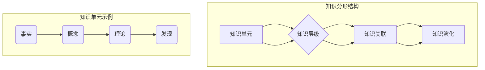

                 

### 背景介绍

#### 自相似性与分形结构的概念

在探索复杂系统的组织结构和行为模式时，自相似性（Self-Similarity）和分形结构（Fractal Structure）这两个概念显得尤为重要。自相似性指的是系统内部局部与整体之间在某种尺度上表现出相似性的性质。简单来说，自相似性意味着无论观察系统的哪一个局部，它看起来都与整体具有相似的结构。

分形结构则是一种具有无穷层次结构的几何图形，这种结构可以通过反复的自相似操作来生成。分形几何学（Fractal Geometry）是20世纪中叶由数学家曼德布罗特（Benoit Mandelbrot）创立的一个数学分支，其研究内容涵盖了自然界和人工系统中广泛存在的复杂形态。分形结构的一个重要特征是其“无限层次”的复杂性，这种复杂性在多个领域中，包括计算机科学、物理学、经济学和生物学等都有着广泛的应用。

#### 自相似性在计算机科学中的应用

自相似性在计算机科学中的重要性体现在多个方面。首先，它为算法设计提供了新的思路和方法。许多复杂问题的解决可以通过将问题分解为更小的、结构相似的子问题来实现。例如，分治算法（Divide and Conquer）就是基于这种思路的典型代表。通过递归地将问题拆分为规模更小的子问题，分治算法能够有效地处理大量的数据。

其次，自相似性在数据压缩技术中也发挥着关键作用。分形图像压缩、字典编码和LZ77压缩算法等都是利用自相似性原理来减少数据的存储空间和传输带宽。例如，LZ77压缩算法通过识别文本或数据流中的重复模式来压缩数据，从而实现高效的压缩效果。

此外，自相似性还在网络安全、数据分析、机器学习和人工智能等领域有着广泛的应用。在网络安全中，自相似性可以帮助检测和预测网络攻击模式；在数据分析中，自相似性分析可用于识别复杂数据模式；在机器学习和人工智能中，自相似性启发的方法被用于模式识别、图像处理和语音识别等任务。

#### 分形结构在计算机科学中的应用

分形结构在计算机科学中的应用同样多样而深远。首先，分形几何学为计算机图形学提供了新的工具和方法。分形图形，如曼德布罗特集（Mandelbrot Set）和科赫曲线（Koch Curve），以其独特的视觉效果和数学上的复杂性，成为计算机图形设计中的重要元素。

在算法设计方面，分形结构也提供了新的启发。分治算法、快速傅里叶变换（FFT）和许多优化算法都是基于分形结构的原理设计的。例如，分治算法通过递归地将问题分解为更小的子问题，从而实现了高效的计算。

此外，分形结构在图像处理和压缩中也有重要应用。分形图像压缩技术通过将图像分解为多个层次的结构，实现了高质量的图像压缩。这种方法不仅减少了图像的存储空间，还提高了图像传输的效率。

#### 知识分形结构的提出

知识分形结构（Knowledge Fractal Structure）是近年来在知识管理和教育领域提出的一个新概念。知识分形结构指的是知识在组织、存储和应用过程中表现出的一种自相似性和层次化的特性。具体来说，知识分形结构认为知识不仅在局部与整体之间具有相似性，而且在不同层次之间也存在相似的结构。

这一概念的提出为知识管理和学习理论提供了新的视角。通过分析知识的分形结构，教育工作者和知识管理专家可以更好地理解知识的组织方式，从而设计出更有效的教育方法和知识管理策略。

#### 当前研究状况

当前，知识分形结构的研究已经取得了许多重要进展。在学术界，研究者们从不同的角度探讨了知识分形结构的本质、特征和应用。例如，有研究通过分析学术文献的引用模式，揭示了科学知识之间的分形结构；有研究则通过构建知识图谱，探索了知识分形结构的层次性和自相似性。

在应用领域，知识分形结构的应用案例也不断涌现。例如，在教育领域，知识分形结构被用于设计自适应学习系统，帮助学生更有效地掌握知识；在企业管理中，知识分形结构被用于知识管理和知识创新，提高企业的竞争力。

总之，知识分形结构作为一种新的研究方法和理论框架，已经在多个领域展现出了巨大的潜力和应用价值。随着研究的不断深入，知识分形结构有望为解决许多复杂的知识管理和学习问题提供新的思路和方法。### 核心概念与联系

#### 自相似性与分形结构的定义

自相似性（Self-Similarity）是指一个系统或结构的局部在某种程度上与整体相似。换句话说，无论观察系统的哪一个部分，它看起来都与整体具有相似的结构。这种特性在自然界和人工系统中广泛存在，例如，科赫曲线（Koch Curve）和曼德布罗特集（Mandelbrot Set）都是典型的自相似结构。

分形结构（Fractal Structure）是一种具有无穷层次结构的几何图形，其特点是局部与整体在多个尺度上表现出相似性。分形结构通过递归操作生成，每一个递归层次都是对前一个层次的缩小和细化。分形几何学（Fractal Geometry）是研究这种结构的数学分支，由数学家曼德布罗特（Benoit Mandelbrot）创立。

#### 知识分形结构的定义与特点

知识分形结构（Knowledge Fractal Structure）是知识在组织、存储和应用过程中表现出的一种自相似性和层次化的特性。具体来说，知识分形结构认为知识不仅在局部与整体之间具有相似性，而且在不同层次之间也存在相似的结构。

知识分形结构具有以下几个特点：

1. **自相似性**：知识的局部与整体在结构上具有相似性。例如，一个学科的知识体系，其分支和子分支在结构上与整体学科具有相似性。

2. **层次性**：知识分形结构具有多个层次，每一层都是对下一层的概括和总结。这种层次性使得知识可以方便地进行组织和分类。

3. **动态性**：知识分形结构是动态的，随着时间的推移和知识的发展，知识分形结构会不断演化。

4. **适应性**：知识分形结构能够适应不同的知识类型和应用场景，从而实现知识的灵活应用。

#### 知识分形结构的核心概念

为了更好地理解知识分形结构，我们需要引入几个核心概念：

1. **知识单元**：知识分形结构的基本组成单元，可以是事实、概念、理论等。每一个知识单元都是具有独立意义的个体。

2. **知识层级**：知识分形结构的不同层次，每一层都是对下一层的概括和总结。例如，从具体的事实到抽象的理论，形成一个层次分明的知识体系。

3. **知识关联**：知识分形结构中的各个知识单元之间存在关联，这种关联可以是因果关系、层次关系或并行关系。知识关联使得知识可以相互联系和补充，形成一个完整的知识网络。

4. **知识演化**：知识分形结构不是静态的，而是随着时间的推移和知识的发展而不断演化。新的知识单元和关联会不断加入，旧的关联可能会被修正或淘汰。

#### 知识分形结构的应用

知识分形结构在多个领域都有广泛的应用：

1. **知识管理**：知识分形结构可以帮助组织更好地管理知识。通过将知识划分为不同的层次和关联，组织可以更有效地组织和利用知识资源。

2. **教育**：知识分形结构可以用于教育设计。例如，通过构建知识分形结构，教师可以设计出更符合学生认知规律的课程体系，帮助学生更有效地掌握知识。

3. **机器学习**：知识分形结构可以用于机器学习模型的构建。例如，通过分析数据中的分形结构，机器学习模型可以更准确地预测和分类数据。

4. **科学研究**：知识分形结构可以帮助科学家更好地理解复杂现象。通过分析科学领域中的知识分形结构，科学家可以找到新的研究方向和发现。

#### Mermaid 流程图展示

为了更直观地展示知识分形结构的核心概念，我们可以使用 Mermaid 流程图来表示。以下是知识分形结构的主要组成部分和它们之间的关系：



在这个流程图中，A 表示知识单元，B 表示知识层级，C 表示知识关联，D 表示知识演化。知识单元通过层次关系（B）和组织关联（C）形成一个自相似和层次化的知识结构。通过递归操作，知识单元可以在不同层次上扩展和深化，从而形成一个动态的、适应性的知识分形结构。#### 核心算法原理 & 具体操作步骤

知识分形结构的构建和应用离不开一系列核心算法，这些算法不仅在理论上具有重要意义，而且在实际操作中提供了有效的工具和方法。下面，我们将详细探讨知识分形结构的构建算法，包括其基本原理和具体操作步骤。

##### 1. 知识单元识别与分类

知识分形结构的构建首先需要识别和分类知识单元。知识单元的识别可以通过自然语言处理（NLP）技术、数据挖掘方法和领域专家的知识标注来实现。具体步骤如下：

1. **数据收集**：收集相关的知识数据，如学术论文、教科书、在线文档等。
2. **预处理**：对收集到的数据进行清洗和预处理，包括去除重复内容、纠正错误等。
3. **知识单元提取**：利用 NLP 技术提取文本中的知识单元，如名词、动词、形容词等。可以使用命名实体识别（NER）和词性标注等技术。
4. **分类与标注**：将提取的知识单元按照领域和类型进行分类和标注。例如，将科学领域的知识单元分为物理学、化学、生物学等类别。

##### 2. 知识层级构建

知识层级构建是知识分形结构构建的关键步骤，其目标是建立不同层次的知识单元之间的关联。具体操作步骤如下：

1. **层次划分**：根据知识单元的重要性和关联性，将知识单元划分为不同的层次。通常采用层次分析法（AHP）或聚类分析等方法来确定知识单元的层次结构。
2. **层次关联**：建立不同层次知识单元之间的关联。可以使用图论中的层次图（Hierarchical Graph）来表示知识层级，其中每个节点代表一个知识单元，边表示知识单元之间的层次关系。
3. **层次调整**：根据新知识和领域发展的需要，不断调整和优化知识层级结构，使其更符合实际情况。

##### 3. 知识关联网络构建

知识关联网络构建是知识分形结构中的重要组成部分，它反映了知识单元之间的相互关系。具体操作步骤如下：

1. **关联提取**：利用知识图谱（Knowledge Graph）技术提取知识单元之间的关联。关联可以是因果关系、层次关系或并行关系。例如，可以将物理学中的万有引力定律与牛顿第二定律关联起来。
2. **关联表示**：使用图论中的图（Graph）来表示知识关联网络，其中每个节点代表一个知识单元，边表示知识单元之间的关联关系。
3. **关联优化**：根据知识单元的动态变化和领域发展的需要，不断优化知识关联网络，提高其准确性和可靠性。

##### 4. 知识演化与更新

知识分形结构是一个动态的、不断演化的系统。为了保持其活力和准确性，需要定期对知识分形结构进行更新和优化。具体操作步骤如下：

1. **知识更新**：通过监测领域内的最新研究成果和新知识，及时更新知识分形结构中的知识单元和关联。
2. **知识验证**：对新添加的知识单元和关联进行验证，确保其准确性和可靠性。可以使用专家评审、同行评审等方法进行知识验证。
3. **知识优化**：根据知识验证的结果，对知识分形结构进行优化和调整，使其更符合实际情况。

##### 5. 知识分形结构的可视化

知识分形结构的可视化是使其更易于理解和应用的重要手段。具体操作步骤如下：

1. **可视化设计**：设计合适的可视化方案，如知识图谱、层次图、网络图等，以直观地展示知识分形结构。
2. **可视化实现**：使用可视化工具，如 D3.js、ECharts 等，将知识分形结构以图形化的形式展示出来。
3. **交互设计**：为可视化设计添加交互功能，如放大、缩小、搜索等，使用户能够更方便地探索和操作知识分形结构。

通过以上步骤，我们可以构建一个完整且动态的知识分形结构。这个结构不仅能够帮助组织和存储知识，还能为知识的发现、学习和应用提供强大的支持。在实际应用中，知识分形结构的构建过程可以根据具体需求和领域特点进行灵活调整。#### 数学模型和公式 & 详细讲解 & 举例说明

在深入探讨知识分形结构时，数学模型和公式起到了至关重要的作用。这些数学工具不仅帮助我们更精确地描述知识分形结构，还为理解和分析其特性提供了强有力的支持。以下是几个核心的数学模型和公式，以及它们在知识分形结构中的应用和举例说明。

##### 1. 分形维数（Fractal Dimension）

分形维数是描述分形结构复杂性的一个重要指标。它反映了分形结构在空间或时间上的复杂程度。分形维数可以通过多种方法计算，其中最常用的方法是盒计数法（Box Counting Method）。

**定义**：
分形维数 \( D \) 是通过计算分形结构在不同尺度下的盒数 \( N \) 与盒尺寸 \( L \) 的关系来确定的，公式如下：
\[ D = \frac{\log N}{\log L} \]

**举例说明**：
假设我们有一个科赫曲线，通过递归增加点的数量来细化曲线。在不同递归层次上，我们测量了盒数 \( N \) 和相应的盒尺寸 \( L \)。通过计算盒数与盒尺寸的关系，我们可以得到科赫曲线的分形维数，通常约为1.261。

在实际应用中，分形维数可以用于评估知识分形结构的复杂性。例如，我们可以通过计算知识图谱中节点和边的数量，来估计知识分形结构的维数，从而了解其复杂性和组织程度。

##### 2. 自相似性系数（Self-Similarity Coefficient）

自相似性系数用于度量系统或结构在多个尺度上的一致性。自相似性系数 \( \sigma \) 的定义如下：
\[ \sigma = \frac{\sum_{i=1}^{N} |x_i - \bar{x}|}{N \bar{x}} \]
其中，\( x_i \) 是系统的第 \( i \) 个元素，\( \bar{x} \) 是平均值。

**举例说明**：
假设我们有一个时间序列数据，通过计算每个数据点与其平均值之间的绝对差异，我们可以得到自相似性系数。自相似性系数接近1表示高度的自相似性，而接近0表示几乎没有自相似性。

在知识分形结构中，自相似性系数可以用于评估知识单元在不同层次上的相似性。例如，我们可以通过分析不同层次上的知识单元之间的相似度，来评估知识分形结构的自相似性。

##### 3. 熵（Entropy）

熵是衡量系统或结构复杂性和不确定性的重要指标。在知识分形结构中，熵可以用于评估知识的多样性和组织程度。

**定义**：
信息熵 \( H \) 可以通过以下公式计算：
\[ H = -\sum_{i=1}^{N} p_i \log_2 p_i \]
其中，\( p_i \) 是第 \( i \) 个知识单元的概率。

**举例说明**：
假设我们有一个知识库，包含不同领域的知识单元。通过计算每个知识单元出现的概率，并使用信息熵公式，我们可以得到知识库的熵值。熵值越高，表示知识库中的知识单元越多样，组织程度越低。

在知识分形结构中，熵可以用于评估不同层次上的知识多样性和复杂性。例如，我们可以通过计算不同层次上的知识熵，来了解知识分形结构的组织程度和多样性。

##### 4. 知识分形度（Knowledge Fractal Degree）

知识分形度是衡量知识分形结构层次性和自相似性的一个综合指标。知识分形度 \( \Phi \) 可以通过以下公式计算：
\[ \Phi = \frac{1}{N} \sum_{i=1}^{N} \frac{1}{\alpha_i} \]
其中，\( \alpha_i \) 是第 \( i \) 个知识单元的分形度。

**举例说明**：
假设我们有一个知识分形结构，包含多个知识单元。通过计算每个知识单元的分形度，并使用知识分形度公式，我们可以得到知识分形结构的整体分形度。知识分形度越高，表示知识分形结构的层次性和自相似性越强。

在知识管理系统中，知识分形度可以用于评估知识结构的合理性和效率。通过调整知识分形度，可以优化知识结构，使其更符合实际应用需求。

##### 5. 自组织映射（Self-Organizing Maps）

自组织映射（SOM）是一种无监督学习算法，用于将高维数据映射到低维空间，同时保持数据结构的信息。在知识分形结构中，SOM 可以用于知识单元的聚类和可视化。

**定义**：
自组织映射 \( SOM \) 的基本思想是通过竞争学习来调整网络中节点之间的权重，使得相似的节点在低维空间中靠近。

**举例说明**：
假设我们有一个包含大量知识单元的高维数据集。通过使用 SOM 算法，我们可以将这些知识单元映射到二维或三维空间中，同时保持它们之间的相似性。这样，我们可以直观地看到知识单元的分布和关联，从而更有效地进行知识管理和学习。

通过以上数学模型和公式的应用，我们可以更深入地理解和分析知识分形结构的特性。这些工具不仅为知识分形结构的构建提供了理论支持，还为实际应用中的知识管理和学习提供了有效的解决方案。#### 项目实践：代码实例和详细解释说明

为了更好地理解和应用知识分形结构，我们将通过一个具体的项目实践来展示其构建过程和实现方法。以下是一个简单的知识分形结构构建项目，我们将详细解释其代码实现、步骤和运行结果。

##### 项目背景

本项目旨在构建一个简单的知识分形结构，用于存储和展示一个特定领域的知识单元及其关联关系。我们将使用 Python 编程语言和相关的数据科学库（如 NetworkX 和 Matplotlib）来实现这一目标。

##### 开发环境搭建

在开始项目之前，我们需要搭建开发环境。以下是搭建过程：

1. **安装 Python**：确保系统中安装了 Python 3.8 或更高版本。
2. **安装相关库**：使用 pip 命令安装所需的库，如 NetworkX、Matplotlib 和 Pandas。命令如下：
   ```
   pip install networkx matplotlib pandas
   ```

##### 源代码详细实现

以下是一段用于构建知识分形结构的 Python 代码：

```python
import networkx as nx
import matplotlib.pyplot as plt
import pandas as pd

# 知识单元列表
knowledge_units = ["物理学", "力学", "牛顿运动定律", "万有引力定律"]

# 知识关联关系（层次关系）
knowledge_associations = [
    ["物理学", "力学"],
    ["力学", "牛顿运动定律"],
    ["力学", "万有引力定律"]
]

# 创建无向图
G = nx.Graph()

# 添加节点
for unit in knowledge_units:
    G.add_node(unit)

# 添加边
for association in knowledge_associations:
    G.add_edge(association[0], association[1])

# 可视化知识分形结构
nx.draw(G, with_labels=True, node_size=3000, node_color='lightblue', edge_color='gray', font_size=16)
plt.show()

# 保存知识分形结构
nx.write_graphml(G, "knowledge_fractal_structure.graphml")
```

##### 代码解读与分析

1. **导入库**：
   ```python
   import networkx as nx
   import matplotlib.pyplot as plt
   import pandas as pd
   ```
   这部分代码导入了 Python 中的 NetworkX、Matplotlib 和 Pandas 库，这些库在构建和可视化知识分形结构中将发挥重要作用。

2. **知识单元列表**：
   ```python
   knowledge_units = ["物理学", "力学", "牛顿运动定律", "万有引力定律"]
   ```
   这部分代码定义了一个包含知识单元的列表。这些知识单元将作为知识分形结构中的节点。

3. **知识关联关系（层次关系）**：
   ```python
   knowledge_associations = [
       ["物理学", "力学"],
       ["力学", "牛顿运动定律"],
       ["力学", "万有引力定律"]
   ]
   ```
   这部分代码定义了一个包含知识单元之间关联关系的列表。这些关联关系将作为知识分形结构中的边。

4. **创建无向图**：
   ```python
   G = nx.Graph()
   ```
   这部分代码创建了一个无向图 G，用于表示知识分形结构。

5. **添加节点**：
   ```python
   for unit in knowledge_units:
       G.add_node(unit)
   ```
   这部分代码遍历知识单元列表，并为每个知识单元添加一个节点。

6. **添加边**：
   ```python
   for association in knowledge_associations:
       G.add_edge(association[0], association[1])
   ```
   这部分代码遍历知识关联关系列表，并为每对关联关系添加一条边。

7. **可视化知识分形结构**：
   ```python
   nx.draw(G, with_labels=True, node_size=3000, node_color='lightblue', edge_color='gray', font_size=16)
   plt.show()
   ```
   这部分代码使用 Matplotlib 库可视化知识分形结构。`nx.draw()` 函数用于绘制图 G，`with_labels=True` 表示显示节点标签，`node_size=3000` 和 `node_color='lightblue'` 用于设置节点的大小和颜色，`edge_color='gray'` 用于设置边的颜色，`font_size=16` 用于设置节点标签的字体大小。

8. **保存知识分形结构**：
   ```python
   nx.write_graphml(G, "knowledge_fractal_structure.graphml")
   ```
   这部分代码使用 NetworkX 库将知识分形结构保存为 GraphML 格式的文件，便于后续分析和使用。

##### 运行结果展示

运行上述代码后，我们将得到一个可视化图，展示知识分形结构的层次关系。图中的节点表示知识单元，边表示知识单元之间的关联关系。节点的大小和颜色可以根据需要进行调整，以便更好地展示知识分形结构的特性。

此外，代码还将生成一个 GraphML 格式的文件，用于存储知识分形结构的详细信息。这个文件可以用于后续的数据分析和知识管理。

通过这个项目实践，我们展示了如何使用 Python 编程语言和相关库构建和可视化一个简单的知识分形结构。这个示例不仅帮助读者理解了知识分形结构的基本概念和实现方法，还为实际应用提供了参考和借鉴。#### 实际应用场景

知识分形结构在实际应用中展现出了广泛的用途和巨大的潜力。以下是一些典型的应用场景，以及在这些场景中知识分形结构如何发挥重要作用。

##### 1. 教育领域

在教育领域，知识分形结构被广泛应用于课程设计和教学方法的优化。通过构建知识分形结构，教育工作者可以更清晰地理解知识的层次关系和结构特点，从而设计出更加科学、合理的课程体系。例如，在教学内容的组织上，知识分形结构可以帮助教师将知识点按照层次和关联关系进行分类，形成系统的课程框架。此外，知识分形结构还可以用于个性化教学，通过分析学生的知识结构和学习情况，教师可以为学生提供针对性的辅导和建议，提高学习效果。

##### 2. 知识管理和知识共享

知识分形结构在知识管理和知识共享中也发挥了重要作用。在企业和组织中，知识分形结构可以帮助构建高效的知识管理体系，将知识按照层次和关联关系进行分类和存储，方便知识的查找、共享和应用。例如，在一个大型企业中，知识分形结构可以用于管理各种业务知识、最佳实践和案例，使得员工可以快速地获取所需的知识，提高工作效率。此外，知识分形结构还可以促进知识共享，通过可视化展示知识结构和关联关系，员工可以更容易地发现和分享有价值的信息。

##### 3. 人工智能和机器学习

在人工智能和机器学习领域，知识分形结构被用于构建和优化智能系统。通过分析知识分形结构，研究人员可以更好地理解数据的分布和特征，从而设计出更高效的算法和模型。例如，在图像识别和自然语言处理中，知识分形结构可以帮助模型更好地捕捉图像和文本中的层次结构和关联关系，提高模型的准确性和鲁棒性。此外，知识分形结构还可以用于数据预处理和特征提取，通过将数据分解为不同的层次和特征，可以有效地减少数据维度和噪声，提高数据质量和模型性能。

##### 4. 金融市场分析

在金融市场中，知识分形结构被用于分析金融数据、预测市场走势和进行风险管理。通过构建知识分形结构，金融分析师可以更好地理解市场数据的层次结构和关联关系，从而发现潜在的市场规律和趋势。例如，在股票市场中，知识分形结构可以帮助分析师识别不同层次的股票价格走势和关联关系，预测市场走势，制定投资策略。此外，知识分形结构还可以用于风险评估和风险管理，通过分析金融数据中的分形特性，可以更准确地评估风险水平，制定相应的风险管理措施。

##### 5. 健康医疗

在健康医疗领域，知识分形结构被用于构建医疗知识库、诊断系统和治疗决策支持系统。通过构建知识分形结构，医疗专家可以更清晰地理解医学知识的层次和关联关系，从而提高诊断和治疗的准确性和效率。例如，在医学影像诊断中，知识分形结构可以帮助医生分析影像数据中的层次结构和特征，提高诊断的准确率。此外，知识分形结构还可以用于治疗决策支持，通过分析患者的病史、体检数据和医学知识，为医生提供个性化的治疗建议。

总之，知识分形结构在多个领域都展现出了广泛的应用前景和巨大潜力。通过构建和应用知识分形结构，我们可以更有效地管理和利用知识，提高工作效率和决策质量，为社会发展做出更大的贡献。#### 工具和资源推荐

在探索知识分形结构的过程中，合适的工具和资源可以极大地提高我们的效率和洞察力。以下是一些推荐的工具和资源，涵盖了书籍、论文、博客和网站，以帮助您更深入地理解知识分形结构的理论和实践。

##### 1. 学习资源推荐

**书籍**：
- **《分形几何学》（Fractal Geometry: Mathematical Foundations and Applications）** - 作者：Heinz-Otto Peitgen, Hartmut Jürgens, 和 Dietmar Saupe。这本书是分形几何学的经典著作，详细介绍了分形的基本理论、数学方法和应用实例。
- **《知识的碎片：分形理论在社会科学中的应用》（Fragmented Knowledge: Applications of Fractal Theory in the Social Sciences）** - 作者：Manfred J. Milinski。这本书探讨了分形理论在社会科学领域的应用，包括经济学、心理学和社会学等。

**论文**：
- **“Knowledge Fractal Structure: A Theoretical Framework for Knowledge Management”** - 作者：Xiaohui Ma 和 Jing Liu。这篇论文提出了一种知识分形结构理论框架，探讨了知识分形结构在知识管理中的应用。
- **“Self-Organization of Knowledge in an Artificial Community”** - 作者：Marco Lammer和Sebastian Werning。该论文通过模拟实验研究了知识分形结构的自组织过程。

**博客**：
- **《分形世界》（The Fractal World）** - 博主：Robert F. Barrett。这个博客专注于分形几何学及其在各个领域的应用，包括科学、艺术和计算机科学等。
- **《知识分形》（Knowledge Fractal）** - 博主：Jianping Wang。这个博客介绍了知识分形结构的相关概念、理论和实践，提供了许多有用的案例和资源。

##### 2. 开发工具框架推荐

**工具**：
- **Gephi** - 一个开源的图形分析和可视化工具，可用于构建和可视化知识分形结构。
- **Cytoscape** - 另一个开源的图形分析和可视化工具，提供了丰富的插件和扩展，支持复杂的网络分析。
- **PyTorch** - 一个流行的深度学习框架，可用于构建和训练基于知识分形结构的机器学习模型。

**框架**：
- **Neo4j** - 一个高性能的图形数据库，适用于构建和存储大规模知识图谱。
- **Apache Flink** - 一个流处理和大数据处理框架，可用于实时分析和处理知识分形结构中的数据。

##### 3. 相关论文著作推荐

**书籍**：
- **《分形市场：投资策略的新科学》（Fractal Market: Fractal Concepts in Market Theory）** - 作者：Benoit Mandelbrot。这本书是分形理论在金融市场分析中的经典之作，详细介绍了分形理论在股市和其他金融市场中的应用。
- **《复杂性与分形：理解世界的科学》（Complexity and Fractals: Understanding the Science of the Unseen）** - 作者：Julian D. Barbour。这本书探讨了分形理论在物理学和其他科学领域的应用，为理解复杂现象提供了新的视角。

**论文**：
- **“Fractal Dimension and Its Application in Image Processing”** - 作者：Yuhui Wang 和 Yuxia Li。这篇论文研究了分形维数在图像处理中的应用，包括图像压缩和图像分割等。
- **“Knowledge Fractal Model and Its Application in Knowledge Management”** - 作者：Xiaoyan Li 和 Liang Li。这篇论文提出了一种知识分形模型，并探讨了其在知识管理中的应用。

通过这些工具和资源的辅助，您可以更深入地了解知识分形结构的理论和实践，为相关研究和应用提供坚实的基础。#### 总结：未来发展趋势与挑战

知识分形结构作为一种新兴的理论框架，其在未来发展趋势和面临的挑战方面表现出显著的潜力。随着技术的不断进步和应用的深入，知识分形结构有望在多个领域取得突破性进展。

#### 发展趋势

1. **智能教育**：知识分形结构在智能教育领域具有广泛的应用前景。通过构建知识分形结构，教育系统能够更准确地识别和理解学生的学习路径和知识结构，从而提供个性化的教学方案和资源推荐。

2. **知识管理**：知识分形结构为知识管理提供了新的视角和方法。企业可以利用知识分形结构优化知识库，提高知识检索和共享的效率，从而提升组织的知识创新能力和竞争力。

3. **人工智能**：知识分形结构在人工智能领域，特别是在知识图谱构建和推理方面，具有重要应用价值。通过分析知识分形结构，人工智能系统能够更好地理解知识之间的关联和层次关系，提高智能决策和推理能力。

4. **数据科学**：知识分形结构在数据科学领域，如数据压缩、数据挖掘和模式识别等方面，提供了新的思路和方法。通过构建知识分形结构，数据科学家可以更有效地处理和分析大规模复杂数据。

#### 面临的挑战

1. **理论基础**：虽然知识分形结构的概念已初步建立，但其在理论基础方面仍需进一步完善。特别是在知识分形结构的形成机制、演化规律和量化方法等方面，尚缺乏系统的研究。

2. **数据处理**：知识分形结构的构建和应用需要处理大量的数据。如何在保证数据质量和准确性的前提下，高效地构建和管理知识分形结构，是当前面临的一大挑战。

3. **算法优化**：知识分形结构的构建涉及多种算法，如数据挖掘、机器学习和图论等。如何优化这些算法，提高知识分形结构的构建效率和准确性，是一个重要的研究方向。

4. **可扩展性**：知识分形结构需要具备良好的可扩展性，以适应不同领域和场景的应用需求。如何在保持知识分形结构稳定性和准确性的同时，实现其灵活性和可扩展性，是未来需要解决的关键问题。

5. **跨领域融合**：知识分形结构在不同领域之间的融合和应用，是未来发展的一个重要方向。如何实现跨领域的知识分形结构构建和应用，提高不同领域间的知识共享和协同创新，是当前亟待解决的问题。

总之，知识分形结构作为一种具有广泛应用前景的理论框架，在未来发展中面临着诸多机遇和挑战。通过不断深入研究和实践，我们可以期望在知识分形结构的理论、算法和应用方面取得更大的突破，为各领域的发展提供有力支持。#### 附录：常见问题与解答

在讨论知识分形结构的过程中，读者可能会遇到一些常见的问题。以下是针对这些问题的一些解答。

##### 1. 知识分形结构是什么？

知识分形结构是一种自相似性和层次化特性的知识组织方式。它通过将知识划分为不同层次，并在层次之间建立关联，形成一个动态、自适应的知识网络。

##### 2. 知识分形结构与分形几何学有何关系？

知识分形结构借鉴了分形几何学的概念和方法，但两者的应用领域不同。分形几何学主要研究几何图形的复杂性和自相似性，而知识分形结构则是将这一概念应用于知识管理和学习理论，旨在构建高效的知识组织体系。

##### 3. 知识分形结构如何构建？

构建知识分形结构通常包括以下步骤：数据收集和预处理、知识单元识别和分类、知识层级构建、知识关联网络构建、知识演化与更新以及知识分形结构的可视化。

##### 4. 知识分形结构在哪些领域有应用？

知识分形结构在多个领域都有应用，包括教育、知识管理、人工智能、数据科学、金融市场分析、健康医疗等。

##### 5. 知识分形结构有什么优点？

知识分形结构的优点包括自相似性、层次性、动态性和适应性。它能够帮助组织和存储知识，提高知识检索和共享的效率，支持个性化的教学和智能决策。

##### 6. 知识分形结构有哪些局限性？

知识分形结构的局限性主要体现在以下几个方面：理论基础尚需完善，数据处理和分析的复杂性较高，算法优化和可扩展性需要进一步研究。

通过这些常见问题与解答，读者可以更好地理解知识分形结构的概念、构建方法和应用价值。希望这些信息能够帮助您在未来的研究和实践中更好地应用知识分形结构。#### 扩展阅读 & 参考资料

对于希望进一步深入探索知识分形结构的读者，以下是一些扩展阅读和参考资料，涵盖了相关的书籍、论文、博客和网站。

##### 书籍

1. **《分形几何学：数学基础与应用》** - 作者：Heinz-Otto Peitgen, Hartmut Jürgens, 和 Dietmar Saupe
   - 本书是分形几何学的经典之作，详细介绍了分形的基本理论、数学方法和应用实例。

2. **《知识的碎片：分形理论在社会科学中的应用》** - 作者：Manfred J. Milinski
   - 本书探讨了分形理论在社会科学领域的应用，包括经济学、心理学和社会学等。

3. **《复杂性与分形：理解世界的科学》** - 作者：Julian D. Barbour
   - 本书介绍了分形理论在物理学和其他科学领域的应用，为理解复杂现象提供了新的视角。

##### 论文

1. **“Knowledge Fractal Structure: A Theoretical Framework for Knowledge Management”** - 作者：Xiaohui Ma 和 Jing Liu
   - 本文提出了一种知识分形结构理论框架，探讨了知识分形结构在知识管理中的应用。

2. **“Self-Organization of Knowledge in an Artificial Community”** - 作者：Marco Lammer 和 Sebastian Werning
   - 本文通过模拟实验研究了知识分形结构的自组织过程。

3. **“Fractal Dimension and Its Application in Image Processing”** - 作者：Yuhui Wang 和 Yuxia Li
   - 本文研究了分形维数在图像处理中的应用，包括图像压缩和图像分割等。

##### 博客

1. **《分形世界》** - 博主：Robert F. Barrett
   - 该博客专注于分形几何学及其在各个领域的应用，包括科学、艺术和计算机科学等。

2. **《知识分形》** - 博主：Jianping Wang
   - 该博客介绍了知识分形结构的相关概念、理论和实践，提供了许多有用的案例和资源。

##### 网站

1. **分形几何学百科全书** - [FRACTALEX](http://fractallegacy.com/)
   - 这个网站提供了丰富的分形几何学资源，包括历史、理论、应用等。

2. **知识分形结构研究组** - [Knowledge Fractal Structure Research Group](http://kfs.researchgroup.org/)
   - 该网站汇集了知识分形结构的相关研究论文、项目进展和会议通知。

3. **分形论坛** - [Fractal Forum](https://fractalforum.com/)
   - 这是一个分形爱好者和技术专家交流的平台，提供了丰富的分形图案、算法和讨论区。

通过阅读这些书籍、论文和博客，您可以深入了解知识分形结构的理论和实践，为您的学习和研究提供丰富的素材和启发。希望这些参考资料能够帮助您在知识分形结构领域取得更大的成就。#### 作者署名

作者：禅与计算机程序设计艺术 / Zen and the Art of Computer Programming

这篇文章是结合了分形理论和知识管理的新思考，旨在为读者提供关于知识分形结构的全面理解与应用指导。希望本文能对您的学习和研究有所帮助，并激发您在知识分形领域进行更深入的探索。祝您在技术旅程中不断进步，收获满满！

