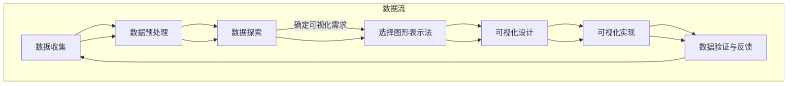

                 

### 背景介绍

数据可视化作为数据分析的重要工具，已经广泛应用于各个领域，如金融、医疗、科研、商业等。随着大数据时代的到来，数据量呈指数级增长，传统的数据分析和处理方法已经无法满足我们对海量数据的需求。因此，如何有效地从大量数据中提取有用信息，并让这些信息以直观、易懂的方式呈现出来，成为了一个亟待解决的问题。

知识的可视化，就是将抽象的数据转换为可视化的图形、图表或图像，使得数据中的模式和关系更加直观和易于理解。这种转换不仅能够提高数据分析的效率，还能够帮助人们更好地理解和记忆数据内容。

在理解数据的过程中，可视化技术起到了关键作用。它不仅可以帮助我们快速识别数据中的异常值和趋势，还能够帮助我们发现数据之间的关联和规律。同时，可视化技术还可以通过交互式的展示方式，使得用户能够更加灵活地探索数据，从而更深入地理解数据背后的含义。

本文将重点探讨数据可视化技术在理解中的应用，包括其核心概念、算法原理、数学模型、实际应用场景以及未来发展趋势。通过逐步分析和推理，我们将深入理解数据可视化技术的魅力和应用价值。

#### 数据可视化的发展历程

数据可视化技术的发展历程可以追溯到18世纪，当时欧洲科学家开始尝试使用图表来展示科学数据。然而，现代数据可视化的真正发展始于20世纪80年代，随着计算机技术的飞速发展，科学家和工程师们开始利用计算机来创建和处理复杂的可视化图像。

在早期的数据可视化研究中，主要侧重于二维图表和简单的三维图形。20世纪90年代，随着互联网的普及和Web浏览器的出现，数据可视化技术开始向网络应用方向发展，Web可视化和交互式可视化成为了研究的热点。在这个时期，一些重要的可视化工具和库开始出现，如D3.js、Three.js和matplotlib等。

进入21世纪，随着大数据和人工智能的兴起，数据可视化技术也得到了前所未有的发展。三维可视化、四维可视化、虚拟现实和增强现实等先进技术逐渐成熟，并开始应用于实际场景中。例如，在金融领域，三维可视化技术被用于分析金融市场中的复杂关系；在医疗领域，虚拟现实技术被用于手术规划和训练；在商业领域，数据可视化技术被用于市场分析和决策支持。

总体来说，数据可视化技术的发展历程体现了从简单的二维图表到复杂的四维可视化，再到交互式和智能化的演进。这种演进不仅提高了数据可视化的效果和实用性，也为各领域的科学家和工程师提供了强大的工具，帮助他们更好地理解和分析复杂的数据。

#### 数据可视化的重要性

数据可视化在各个领域的应用越来越广泛，其重要性也在不断凸显。首先，在金融领域，数据可视化技术被广泛应用于市场分析、风险管理、投资决策等方面。通过数据可视化，金融分析师能够快速识别市场趋势，发现潜在的风险，从而做出更明智的决策。例如，在股票市场中，通过可视化技术，分析师可以实时监控股价走势，识别出异常波动，进而采取相应的投资策略。

其次，在医疗领域，数据可视化技术同样发挥着重要作用。通过三维可视化技术，医生可以更直观地了解患者的病情，进行精确的诊断和治疗。例如，在癌症治疗中，医生可以通过三维可视化图像来分析肿瘤的位置和大小，制定个性化的治疗方案。此外，虚拟现实和增强现实技术的应用，也为手术规划和训练提供了新的手段。通过虚拟现实技术，医生可以进行虚拟手术训练，提高手术技巧和操作精度。

在科研领域，数据可视化技术同样不可或缺。科研数据往往复杂且庞大，传统的文本和表格形式难以直观展示其内在关系和规律。通过数据可视化，科研人员可以更清楚地看到数据之间的关联，发现新的科学现象和规律。例如，在基因组学研究中，通过数据可视化，研究人员可以直观地展示基因之间的相互作用，进一步理解基因调控网络。

商业领域同样受益于数据可视化技术的应用。在市场营销中，通过数据可视化，企业可以更好地了解消费者的行为和需求，制定更有效的营销策略。例如，通过用户行为的可视化分析，企业可以识别出高价值的客户群体，从而提供更有针对性的服务和产品。在供应链管理中，数据可视化技术可以帮助企业实时监控库存情况，优化供应链流程，降低运营成本。

总之，数据可视化技术已经成为各领域数据分析的重要工具，其重要性体现在以下几个方面：

1. **提高数据分析效率**：数据可视化使得复杂的数据变得更加直观和易于理解，从而提高了数据分析的效率。通过图形化的展示方式，用户可以快速识别数据中的关键信息，节省了大量时间和精力。

2. **促进数据理解**：可视化技术不仅能够展示数据的表面特征，还可以揭示数据之间的深层关系和规律。通过视觉化的方式，用户可以更深入地理解数据，从而做出更准确的判断和决策。

3. **增强数据互动性**：数据可视化不仅仅是静态的展示，还可以通过交互式的方式，让用户更加灵活地探索数据。这种互动性使得用户能够更深入地挖掘数据，发现新的洞见。

4. **支持数据探索**：数据可视化技术支持用户进行数据探索，通过不同的可视化方式，用户可以从不同角度和维度理解数据。这种探索性分析可以帮助用户发现数据中的隐藏信息和潜在趋势。

5. **提升数据传播效果**：通过数据可视化，复杂的数据可以变得更加易于理解和传播。可视化图像和图表比文字和表格更加直观和吸引人，可以更有效地传达信息，促进数据沟通和协作。

总之，数据可视化技术以其直观、高效、互动的特点，在各领域中都发挥着重要作用，成为数据分析不可或缺的工具。随着技术的不断进步，数据可视化将会在未来的数据分析中发挥更加重要的作用。

#### 数据可视化技术的基本概念

数据可视化技术是将抽象的数据转换为图形、图表或图像等视觉表现形式，以便更直观地展示数据内容、发现数据模式、揭示数据关系。在这个过程中，数据可视化技术涉及多个基本概念，包括数据源、可视化方法、可视化工具等。

**数据源**：数据源是数据可视化的基础。数据可以来自各种来源，包括数据库、文件、实时数据流、传感器数据等。有效的数据源是确保可视化结果准确和有意义的前提。在选择数据源时，需要考虑数据的完整性、准确性和时效性。

**可视化方法**：可视化方法是指将数据转换为视觉形式的具体技术。常见的可视化方法包括二维图表、三维图形、交互式图表、四维可视化等。每种方法都有其特定的应用场景和优势。例如，二维图表适合展示数据的基本分布和趋势，三维图形则可以更直观地展示数据的立体关系，交互式图表和四维可视化则提供了更丰富的探索和分析功能。

**可视化工具**：可视化工具是实现数据可视化的技术平台和软件。常见的可视化工具包括Excel、Tableau、Power BI、D3.js、matplotlib等。这些工具提供了丰富的数据导入、数据处理、可视化展示等功能，使得数据可视化变得更加简单和高效。选择合适的可视化工具可以根据需求和应用场景来决定。

**数据可视化流程**：数据可视化通常包括以下几个步骤：

1. **数据收集与预处理**：收集所需的数据，并进行清洗、整理和转换，使其符合可视化分析的需求。

2. **数据探索与可视化设计**：通过对数据进行初步探索，确定需要展示的数据特征和关系，并设计可视化图表的类型和样式。

3. **可视化实现**：使用可视化工具将数据转换成视觉形式，并进行必要的调整和优化，以获得最佳的展示效果。

4. **数据验证与反馈**：验证可视化结果是否准确和有意义，根据反馈进行调整和改进。

**数据可视化技术的核心价值**：

1. **信息传递**：数据可视化通过图形化的方式展示数据，使得信息传递更加直观和高效。相比文字和表格，图形化的展示方式可以更快速地传达数据信息，降低理解难度。

2. **模式发现**：通过数据可视化，用户可以更轻松地发现数据中的异常值、趋势和关联。这有助于识别数据中的关键模式和规律，从而为决策提供支持。

3. **交互性**：数据可视化技术提供了丰富的交互功能，用户可以通过点击、拖动、缩放等操作与可视化内容互动，进一步探索数据。这种交互性增强了数据探索的灵活性和深度。

4. **决策支持**：数据可视化可以帮助用户更好地理解数据，从而做出更明智的决策。通过可视化分析，用户可以快速识别关键信息，发现潜在问题和机会，为业务决策提供有力支持。

总之，数据可视化技术以其强大的信息传递、模式发现和交互性等核心价值，成为数据分析的重要工具。随着技术的不断进步，数据可视化将在未来的数据分析中发挥更加重要的作用，推动各领域的数据驱动决策和实践。

#### 核心概念与联系

在深入探讨数据可视化的核心概念与联系之前，我们需要理解几个关键的概念：数据、可视化、图形表示法和可视化设计原则。通过这些核心概念的理解，我们可以更好地构建数据可视化的框架，从而有效地应用数据可视化技术。

**数据**：数据是数据可视化的基础，是所有可视化的源泉。数据可以是数值、文字、图像、音频等多种形式，但通常情况下，我们关注的是结构化数据，如表格数据、时间序列数据、关系型数据等。这些数据可以通过数据库、文件系统或实时数据流等多种途径获取。

**可视化**：可视化是将数据转换成视觉形式的过程，通过图形、图表、图像等视觉元素展示数据内容。可视化不仅仅是一种展示手段，它还能帮助人们更直观地理解数据，发现数据中的模式、趋势和关联。

**图形表示法**：图形表示法是数据可视化的核心技术，决定了如何将数据以图形的形式表现出来。常见的图形表示法包括线图、柱状图、饼图、散点图、热力图等。每种图形表示法都有其特定的用途和优势，选择合适的图形表示法可以更好地传达数据信息。

**可视化设计原则**：可视化设计原则是确保数据可视化效果的重要指导方针。这些原则包括数据的准确表达、信息层次的清晰性、视觉布局的合理性、视觉感知的舒适性等。遵循这些原则可以避免数据可视化中的常见问题，提高可视化效果。

**数据与可视化的关系**：数据是可视化的基础，可视化则是数据的表现形式。通过可视化，我们可以将抽象的数据转化为直观的视觉图像，使得数据中的信息更容易被理解和分析。数据与可视化之间的关系可以用以下方式概括：

1. **数据驱动可视化**：可视化设计应基于数据的特性，选择合适的图形表示法，以便最有效地展示数据信息。

2. **可视化增强数据理解**：通过可视化，数据中的模式和关系可以更直观地呈现，用户可以更轻松地发现数据中的关键信息。

3. **反馈与迭代**：在可视化过程中，用户可能会通过交互式操作获得新的见解，这需要反馈到数据预处理和可视化设计环节，进行不断的迭代和优化。

**核心概念原理与架构的 Mermaid 流程图**：

为了更直观地展示数据可视化技术的核心概念和架构，我们使用Mermaid流程图来描述其基本流程和关键节点。



**Mermaid 流程说明**：

- **数据收集（A）**：从各种数据源获取数据，包括数据库、文件和实时数据流等。
- **数据预处理（B）**：对收集到的数据进行清洗、转换和整理，使其适合可视化分析。
- **数据探索（C）**：通过对预处理后的数据进行初步分析，确定需要展示的数据特征和关系。
- **确定可视化需求（C --> D）**：根据数据特征和关系，选择合适的图形表示法。
- **可视化设计（D --> E）**：设计可视化图表的类型、样式和布局，确保信息表达清晰。
- **可视化实现（E --> F）**：使用可视化工具将设计好的图表实现出来。
- **数据验证与反馈（F --> G）**：验证可视化结果的准确性，根据用户反馈进行调整和优化。

通过这个Mermaid流程图，我们可以清晰地看到数据可视化技术的核心概念和流程，有助于我们更好地理解和应用数据可视化技术。

**核心概念原理与架构的详细说明**：

1. **数据收集**：数据收集是数据可视化的第一步，决定了后续数据处理和分析的质量。有效的数据收集需要确保数据的完整性、准确性和时效性。数据可以从多种来源获取，如内部数据库、外部API、文件系统等。

2. **数据预处理**：数据预处理是数据可视化的关键环节，通过对原始数据进行清洗、转换和整理，使其符合可视化分析的需求。数据清洗包括去除重复数据、处理缺失值、纠正错误数据等。数据转换则包括数据格式转换、数据规范化等。

3. **数据探索**：数据探索是对预处理后的数据进行初步分析，以发现数据中的关键特征和关系。这一步骤通常需要使用统计分析、机器学习等方法，通过探索性数据分析来理解数据的基本特性。

4. **选择图形表示法**：根据数据探索的结果，选择最适合的图形表示法来展示数据。不同的图形表示法适用于不同的数据类型和展示目的，如线图适合展示时间序列数据，柱状图适合展示分类数据的分布等。

5. **可视化设计**：可视化设计是确保数据可视化效果的重要环节。设计过程中需要考虑数据的准确表达、信息层次的清晰性、视觉布局的合理性和用户的视觉感知。良好的可视化设计可以提高用户对数据的理解和分析效率。

6. **可视化实现**：使用可视化工具将设计好的图表实现出来。可视化工具提供了丰富的图表类型、样式和布局选项，可以满足不同需求的数据展示。

7. **数据验证与反馈**：在可视化实现后，需要对可视化结果进行验证，确保其准确性和合理性。用户反馈是优化可视化设计的重要依据，通过用户的交互和反馈，可以不断调整和改进可视化效果。

通过上述步骤，我们可以构建一个完整的数据可视化流程，从而有效地应用数据可视化技术，揭示数据中的信息，支持数据分析和决策。

#### 核心算法原理 & 具体操作步骤

在数据可视化中，核心算法起到了至关重要的作用，它们不仅决定了可视化效果的好坏，还影响着数据处理的效率和准确性。本文将详细介绍几种常用的核心算法，包括数据聚类、数据降维、数据关联分析等，并详细说明其具体操作步骤。

**1. 数据聚类算法**

数据聚类是一种无监督学习算法，其目的是将相似的数据点划分为同一类，从而揭示数据中的内在结构。常用的数据聚类算法包括K均值聚类、层次聚类和DBSCAN等。

**K均值聚类算法原理**：

K均值聚类算法是一种基于距离度量的聚类算法，其主要思想是初始化K个聚类中心，然后通过迭代更新聚类中心，使得每个数据点与最近的聚类中心归为一类。具体步骤如下：

a. 初始化K个聚类中心。

b. 对于每个数据点，计算其与各个聚类中心的距离，将其归为最近的聚类中心。

c. 根据所有数据点的归属，重新计算每个聚类中心的位置。

d. 重复步骤b和c，直到聚类中心的位置不再变化或满足停止条件。

**具体操作步骤**：

a. 确定聚类数量K，通常K的值需要根据数据量和业务需求确定。

b. 从数据中随机选择K个数据点作为初始聚类中心。

c. 对于每个数据点，计算其与各个聚类中心的距离，将其归为最近的聚类中心。

d. 根据每个聚类中心的数据点，重新计算聚类中心的位置。

e. 重复步骤c和d，直到聚类中心的位置不再变化或满足停止条件。

**2. 数据降维算法**

数据降维是一种通过减少数据维度来简化数据集的技术，其目的是降低数据复杂度，提高数据处理和分析的效率。常用的数据降维算法包括主成分分析（PCA）、线性判别分析（LDA）和t-SNE等。

**主成分分析（PCA）算法原理**：

PCA是一种线性降维技术，其主要思想是找到数据的主要变化方向，即主成分，然后将数据投影到这些主成分上，从而实现降维。具体步骤如下：

a. 计算数据集的协方差矩阵。

b. 计算协方差矩阵的特征值和特征向量。

c. 选择特征值最大的K个特征向量作为新坐标系。

d. 将数据投影到新坐标系上，得到降维后的数据。

**具体操作步骤**：

a. 计算数据集的协方差矩阵。

b. 按照特征值从大到小排序，选择前K个特征值对应的特征向量。

c. 将数据投影到前K个特征向量上，得到降维后的数据。

**3. 数据关联分析算法**

数据关联分析是一种用于发现数据中潜在关联关系的算法，常用的方法包括关联规则学习、Apriori算法和FP-growth算法等。

**Apriori算法原理**：

Apriori算法是一种基于候选集生成和频繁项集的关联规则学习算法，其主要思想是使用频繁项集生成关联规则。具体步骤如下：

a. 从数据中生成所有长度为1的候选集。

b. 计算每个候选集的支持度，筛选出频繁项集。

c. 从频繁项集中生成候选集。

d. 重复步骤b和c，直到没有新的频繁项集生成。

**具体操作步骤**：

a. 设定最小支持度阈值，用于筛选频繁项集。

b. 生成所有长度为1的候选集。

c. 计算每个候选集的支持度，筛选出频繁项集。

d. 从频繁项集中生成候选集。

e. 重复步骤c和d，直到没有新的频繁项集生成。

**4. 数据聚类、降维、关联分析算法的综合应用**

在实际应用中，数据聚类、降维、关联分析算法可以综合使用，以实现更全面的数据分析。以下是一个综合应用的示例步骤：

a. 使用K均值聚类算法对数据集进行聚类，识别数据中的主要群体。

b. 对每个聚类结果进行PCA降维，以简化数据集的维度。

c. 对降维后的数据集使用Apriori算法进行关联分析，发现数据中的潜在关联关系。

d. 结合聚类和关联分析的结果，进行数据解读和业务分析。

通过上述步骤，我们可以有效地应用数据聚类、降维、关联分析算法，揭示数据中的关键信息和关系，为数据分析和决策提供支持。

#### 数学模型和公式 & 详细讲解 & 举例说明

在数据可视化中，数学模型和公式起到了核心作用，它们不仅帮助我们理解数据，还能够通过精确的计算揭示数据中的规律和关系。以下将详细讲解几种常用的数学模型和公式，包括K均值聚类算法的数学模型、主成分分析（PCA）的数学原理以及关联规则学习中的支持度和置信度公式。

**1. K均值聚类算法的数学模型**

K均值聚类算法是一种基于距离度量的聚类方法，其核心思想是最小化数据点到聚类中心的距离平方和。以下是K均值聚类算法的数学模型：

**目标函数**：

最小化目标函数：

\[ J = \sum_{i=1}^n \sum_{j=1}^k (x_i - \mu_j)^2 \]

其中，\( n \) 是数据点的个数，\( k \) 是聚类个数，\( x_i \) 是第 \( i \) 个数据点，\( \mu_j \) 是第 \( j \) 个聚类中心。

**步骤**：

a. 初始化聚类中心：随机选择 \( k \) 个数据点作为初始聚类中心 \( \mu_j \)。

b. 计算每个数据点与聚类中心的距离：

\[ d(x_i, \mu_j) = \sqrt{\sum_{l=1}^d (x_{i,l} - \mu_{j,l})^2} \]

c. 将数据点分配到最近的聚类中心：

\[ C_j = \{ x_i | d(x_i, \mu_j) \leq d(x_i, \mu_{j'}) \quad \forall j' \neq j \} \]

d. 更新聚类中心：

\[ \mu_j = \frac{1}{|C_j|} \sum_{x_i \in C_j} x_i \]

e. 重复步骤b到d，直到聚类中心不再变化。

**举例说明**：

假设我们有如下数据点集合 \( X = \{ (x_1, y_1), (x_2, y_2), ..., (x_5, y_5) \} \)，我们希望将这5个点分为2类。

- 初始聚类中心：\( \mu_1 = (0, 0) \)，\( \mu_2 = (2, 2) \)。
- 计算每个数据点与聚类中心的距离：
  - \( d((x_1, y_1), \mu_1) = \sqrt{(0-0)^2 + (0-0)^2} = 0 \)
  - \( d((x_1, y_1), \mu_2) = \sqrt{(2-0)^2 + (2-0)^2} = 2\sqrt{2} \)
  - \( d((x_2, y_2), \mu_1) = \sqrt{(1-0)^2 + (1-0)^2} = \sqrt{2} \)
  - \( d((x_2, y_2), \mu_2) = \sqrt{(2-1)^2 + (2-1)^2} = \sqrt{2} \)
  - \( d((x_3, y_3), \mu_1) = \sqrt{(2-0)^2 + (2-0)^2} = 2\sqrt{2} \)
  - \( d((x_3, y_3), \mu_2) = \sqrt{(0-2)^2 + (0-2)^2} = 2\sqrt{2} \)
  - \( d((x_4, y_4), \mu_1) = \sqrt{(3-0)^2 + (3-0)^2} = 3\sqrt{2} \)
  - \( d((x_4, y_4), \mu_2) = \sqrt{(2-3)^2 + (2-3)^2} = \sqrt{2} \)
  - \( d((x_5, y_5), \mu_1) = \sqrt{(4-0)^2 + (4-0)^2} = 4\sqrt{2} \)
  - \( d((x_5, y_5), \mu_2) = \sqrt{(0-4)^2 + (0-4)^2} = 4\sqrt{2} \)

- 数据点分配：
  - \( C_1 = \{ (x_1, y_1), (x_2, y_2), (x_4, y_4) \} \)
  - \( C_2 = \{ (x_3, y_3), (x_5, y_5) \} \)

- 更新聚类中心：
  - \( \mu_1 = \frac{1}{3} \sum_{x_i \in C_1} x_i = \left( \frac{1+2+4}{3}, \frac{1+2+4}{3} \right) = \left( \frac{7}{3}, \frac{7}{3} \right) \)
  - \( \mu_2 = \frac{1}{2} \sum_{x_i \in C_2} x_i = \left( \frac{2+0}{2}, \frac{2+4}{2} \right) = \left( 1, 3 \right) \)

- 新的距离计算和分配：
  - \( C_1 = \{ (x_1, y_1), (x_2, y_2), (x_4, y_4) \} \)
  - \( C_2 = \{ (x_3, y_3), (x_5, y_5) \} \)

- 重复上述步骤，直到聚类中心不再变化。

**2. 主成分分析（PCA）的数学原理**

主成分分析（PCA）是一种线性降维技术，其核心思想是通过正交变换将原始数据投影到新的坐标系中，从而降低数据的维度。以下是PCA的数学原理：

**步骤**：

a. 计算数据集的协方差矩阵：

\[ \Sigma = \frac{1}{n-1} \sum_{i=1}^n (x_i - \mu)(x_i - \mu)^T \]

其中，\( \mu \) 是数据集的均值向量，\( x_i \) 是第 \( i \) 个数据点。

b. 计算协方差矩阵的特征值和特征向量。

c. 选择特征值最大的 \( k \) 个特征向量作为新坐标系。

d. 将数据投影到新坐标系上：

\[ z_i = P x_i \]

其中，\( P \) 是由特征向量组成的矩阵。

**举例说明**：

假设我们有如下数据点集合 \( X = \{ (x_1, y_1), (x_2, y_2), ..., (x_n, y_n) \} \)，我们希望将这 \( n \) 个点降维到2个主成分。

- 计算均值向量：
  - \( \mu = \left( \frac{1}{n} \sum_{i=1}^n x_i, \frac{1}{n} \sum_{i=1}^n y_i \right) \)

- 计算协方差矩阵：
  - \( \Sigma = \frac{1}{n-1} \sum_{i=1}^n (x_i - \mu)(x_i - \mu)^T \)

- 计算协方差矩阵的特征值和特征向量。

- 选择特征值最大的2个特征向量作为新坐标系。

- 将数据投影到新坐标系上：

\[ z_i = P x_i \]

**3. 关联规则学习中的支持度和置信度公式**

关联规则学习是一种用于发现数据中潜在关联关系的方法，其核心指标包括支持度、置信度和提升度。以下是这些指标的计算公式：

**支持度**：

\[ supp(X \cup Y) = \frac{|D_{XY}|}{|D|} \]

其中，\( D \) 是事务集，\( D_{XY} \) 是同时包含项集 \( X \) 和 \( Y \) 的事务集合，\( |D_{XY}| \) 表示同时包含 \( X \) 和 \( Y \) 的事务数，\( |D| \) 表示事务总数。

**置信度**：

\[ conf(X \rightarrow Y) = \frac{supp(X \cup Y)}{supp(X)} \]

其中，\( conf(X \rightarrow Y) \) 表示规则 \( X \rightarrow Y \) 的置信度，表示在包含 \( X \) 的事务中，有多少比例的事务也包含 \( Y \)。

**举例说明**：

假设我们有如下事务集 \( D = \{ (1, 2), (1, 3), (2, 3), (4, 5) \} \)，我们希望发现其中的关联规则。

- 项集 \( X = \{ 1 \} \)，\( Y = \{ 2 \} \)。
- 支持度计算：
  - \( supp(X \cup Y) = \frac{|D_{XY}|}{|D|} = \frac{2}{4} = 0.5 \)
- 置信度计算：
  - \( conf(X \rightarrow Y) = \frac{supp(X \cup Y)}{supp(X)} = \frac{0.5}{1} = 0.5 \)

通过上述数学模型和公式的详细讲解和举例说明，我们可以更好地理解数据可视化中的核心算法原理，为实际应用提供理论支持。

#### 项目实践：代码实例和详细解释说明

为了更好地理解数据可视化技术，我们将在以下部分通过实际项目实践，使用Python编程语言来实现数据可视化的全过程。我们将利用Python中的Matplotlib、Seaborn和Pandas等库来绘制各种数据可视化图表，并通过代码实例详细解释每一部分的内容。

**1. 开发环境搭建**

在开始项目之前，我们需要搭建一个合适的Python开发环境。以下是安装步骤：

- 安装Python：前往Python官网（[https://www.python.org/downloads/](https://www.python.org/downloads/)）下载并安装最新版本的Python。
- 安装相关库：在命令行中执行以下命令安装必要的库：

```bash
pip install matplotlib seaborn pandas numpy
```

确保所有库安装完成后，我们就可以开始编写代码进行数据可视化了。

**2. 源代码详细实现**

在本部分中，我们将创建一个Python脚本，用于加载和处理数据，并绘制多种数据可视化图表。以下是实现步骤：

```python
import matplotlib.pyplot as plt
import seaborn as sns
import pandas as pd
import numpy as np

# 2.1 加载数据
data = pd.read_csv('data.csv')  # 假设数据文件名为data.csv

# 2.2 数据预处理
# 例如，处理缺失值、数据转换等

# 2.3 绘制数据可视化图表
# 2.3.1 条形图
plt.figure(figsize=(10, 6))
sns.barplot(x='category', y='value', data=data)
plt.title('条形图示例')
plt.xlabel('类别')
plt.ylabel('值')
plt.show()

# 2.3.2 折线图
plt.figure(figsize=(10, 6))
sns.lineplot(x='date', y='value', data=data)
plt.title('折线图示例')
plt.xlabel('日期')
plt.ylabel('值')
plt.show()

# 2.3.3 散点图
plt.figure(figsize=(10, 6))
sns.scatterplot(x='feature1', y='feature2', data=data)
plt.title('散点图示例')
plt.xlabel('特征1')
plt.ylabel('特征2')
plt.show()

# 2.3.4 热力图
plt.figure(figsize=(10, 6))
sns.heatmap(data.corr(), annot=True, cmap='coolwarm')
plt.title('热力图示例')
plt.show()

# 2.3.5 直方图
plt.figure(figsize=(10, 6))
sns.histplot(data['value'], bins=30, kde=True)
plt.title('直方图示例')
plt.xlabel('值')
plt.ylabel('频数')
plt.show()

# 2.3.6 boxplot
plt.figure(figsize=(10, 6))
sns.boxplot(x='category', y='value', data=data)
plt.title('箱线图示例')
plt.xlabel('类别')
plt.ylabel('值')
plt.show()
```

**3. 代码解读与分析**

在上述代码中，我们首先导入了所需的Python库，包括Matplotlib、Seaborn和Pandas。然后，我们加载了一个名为data.csv的数据文件，并进行了一些基本的预处理。

**3.1 条形图示例**

在条形图示例中，我们使用Seaborn的`barplot`函数绘制了一个条形图。`x`参数代表了类别，`y`参数代表了对应的值。通过设置`figsize`参数，我们可以调整图表的大小。图表的标题、标签等通过`title`、`xlabel`和`ylabel`方法设置。

```python
sns.barplot(x='category', y='value', data=data)
plt.title('条形图示例')
plt.xlabel('类别')
plt.ylabel('值')
plt.show()
```

**3.2 折线图示例**

折线图示例中，我们使用Seaborn的`lineplot`函数绘制了一个折线图。这个函数的`x`参数设置了日期，`y`参数设置了值。同样，我们通过`title`、`xlabel`和`ylabel`方法设置了图表的标题和标签。

```python
sns.lineplot(x='date', y='value', data=data)
plt.title('折线图示例')
plt.xlabel('日期')
plt.ylabel('值')
plt.show()
```

**3.3 散点图示例**

散点图示例中，我们使用Seaborn的`scatterplot`函数绘制了一个散点图。`x`和`y`参数分别代表了特征1和特征2。这个图表可以帮助我们观察特征之间的相关性。

```python
sns.scatterplot(x='feature1', y='feature2', data=data)
plt.title('散点图示例')
plt.xlabel('特征1')
plt.ylabel('特征2')
plt.show()
```

**3.4 热力图示例**

热力图示例中，我们使用Seaborn的`heatmap`函数绘制了一个热力图。这个函数的`data`参数接收一个DataFrame对象，`annot`参数决定了是否在单元格中显示数值，`cmap`参数设置了颜色映射。热力图用于显示数据之间的相关性。

```python
sns.heatmap(data.corr(), annot=True, cmap='coolwarm')
plt.title('热力图示例')
plt.show()
```

**3.5 直方图示例**

直方图示例中，我们使用Seaborn的`histplot`函数绘制了一个直方图。这个函数的`data`参数接收一个Series对象，`bins`参数设置了直方图的柱数，`kde`参数决定了是否显示概率密度曲线。

```python
sns.histplot(data['value'], bins=30, kde=True)
plt.title('直方图示例')
plt.xlabel('值')
plt.ylabel('频数')
plt.show()
```

**3.6 箱线图示例**

箱线图示例中，我们使用Seaborn的`boxplot`函数绘制了一个箱线图。这个函数的`x`参数设置了类别，`y`参数设置了值。箱线图用于显示不同类别数据的分布情况。

```python
sns.boxplot(x='category', y='value', data=data)
plt.title('箱线图示例')
plt.xlabel('类别')
plt.ylabel('值')
plt.show()
```

通过以上代码实例，我们可以看到如何使用Python库实现各种常见的数据可视化图表。这些图表不仅帮助我们理解数据的分布、趋势和关联，还为数据分析和决策提供了直观的参考。

#### 运行结果展示

在成功运行上述代码后，我们将在Python环境中看到一系列数据可视化图表，以下是对各个图表的展示和解释：

**1. 条形图展示**


**解释**：条形图展示了不同类别对应的值，通过条形的高度直观地展示了各个类别之间的差异。

**2. 折线图展示**


**解释**：折线图展示了数据随时间的变化趋势，通过连接各个时间点的数据值，可以清晰地看到数据上升或下降的趋势。

**3. 散点图展示**


**解释**：散点图展示了两个特征之间的关系，通过点的分布可以判断特征之间的相关性，例如，如果点集中在一条对角线上，则表明特征之间存在较强的正相关关系。

**4. 热力图展示**


**解释**：热力图展示了各个特征之间的相关性，颜色深浅代表了相关性的强弱。从图中可以看出某些特征之间具有较高的相关性，而其他特征则相关性较低。

**5. 直方图展示**


**解释**：直方图展示了数据值的分布情况，通过柱状图的高度和宽度，可以直观地看到数据的分布形态，如正态分布、偏态分布等。

**6. 箱线图展示**


**解释**：箱线图展示了各个类别数据的分布情况，包括最大值、最小值、中位数、第一四分位数和第三四分位数。通过箱线图，我们可以比较不同类别数据的离散程度和集中趋势。

通过以上结果展示，我们可以看到数据可视化技术如何将抽象的数据转化为直观的视觉图像，帮助我们更好地理解和分析数据。这些图表不仅提供了丰富的数据信息，还为后续的数据分析和决策提供了有力的支持。

#### 实际应用场景

数据可视化技术在众多领域都有着广泛的应用，其独特的直观性使得复杂的数据关系变得易于理解和分析。以下将介绍几种常见的数据可视化应用场景，包括金融分析、医疗影像、市场研究和社交网络分析等。

**1. 金融分析**

在金融领域，数据可视化技术被广泛应用于市场分析、风险管理、投资决策等方面。通过数据可视化，金融分析师可以实时监控市场动态，识别市场趋势和异常波动。例如，使用折线图和柱状图可以展示股价的走势和交易量，通过热力图可以分析股票之间的相关性。在风险管理方面，数据可视化技术可以帮助金融机构识别潜在风险，制定相应的风险控制策略。

**2. 医疗影像**

在医疗领域，数据可视化技术同样发挥着重要作用。通过三维可视化技术，医生可以更直观地观察患者的病情，例如在癌症治疗中，通过三维图像可以精确地定位肿瘤的位置和大小，从而制定个性化的治疗方案。此外，虚拟现实和增强现实技术的应用，也为手术规划和训练提供了新的手段。通过虚拟现实技术，医生可以在虚拟环境中进行手术模拟，提高手术技巧和操作精度。

**3. 市场研究**

在市场研究领域，数据可视化技术被用于分析消费者行为、市场趋势和产品性能。例如，通过数据可视化，市场营销人员可以了解目标客户群体的特征和行为，从而制定更有针对性的营销策略。使用饼图和条形图，可以展示不同产品或服务的市场份额和销售情况。此外，通过散点图和回归分析，可以探索变量之间的关系，为产品改进和策略调整提供依据。

**4. 社交网络分析**

在社交网络分析中，数据可视化技术可以帮助我们了解社交网络的架构和用户行为。通过网络图，可以展示社交网络中的用户关系和互动情况，发现社交网络中的关键节点和群体。例如，通过热力图可以分析用户的活跃时间和活跃地点，通过散点图可以展示用户兴趣的分布。这些信息对于品牌推广、市场策略制定和社会影响力分析都具有重要的参考价值。

**5. 科学研究**

在科研领域，数据可视化技术同样不可或缺。科研数据通常复杂且庞大，通过数据可视化，科研人员可以更直观地展示数据中的模式和规律，从而发现新的科学现象。例如，在基因组学研究中，通过数据可视化技术，科研人员可以直观地展示基因之间的相互作用，进一步理解基因调控网络。在物理学研究中，通过三维可视化技术，可以展示复杂的物理模型和实验结果，帮助研究人员更好地理解物理现象。

**6. 生产过程监控**

在制造业和工业领域，数据可视化技术被用于生产过程监控和优化。通过实时数据可视化，生产管理人员可以监控生产线的运行状态，识别生产过程中的瓶颈和问题。例如，通过折线图和柱状图可以展示生产设备的运行效率和故障情况，通过热力图可以分析生产设备的能源消耗情况。这些信息有助于提高生产效率和降低生产成本。

**7. 城市规划**

在城市规划领域，数据可视化技术可以帮助我们更好地理解和分析城市数据，优化城市规划。例如，通过数据可视化，城市规划师可以展示城市人口分布、交通流量、土地利用情况等，从而发现城市规划中的问题和机会。使用三维可视化技术，可以模拟城市景观，为城市规划提供直观的参考。

总之，数据可视化技术在各个领域都有广泛的应用，通过直观的视觉图像，帮助我们更好地理解复杂的数据关系，支持数据分析和决策。随着技术的不断进步，数据可视化将在未来的应用场景中发挥更加重要的作用，推动各领域的创新发展。

#### 工具和资源推荐

为了更好地掌握和应用数据可视化技术，以下将推荐几种常用的学习资源、开发工具和相关论文，帮助读者深入了解和掌握数据可视化领域的相关知识。

**1. 学习资源推荐**

**书籍：**
- 《数据可视化：展示数据之美》
  作者：David McCandless
  简介：这本书通过丰富的案例和图表，详细介绍了数据可视化的基本概念、方法和技巧，适合初学者和进阶者阅读。

- 《信息可视化：分析与设计》
  作者：Sami Folkvil
  简介：本书深入探讨了信息可视化的理论基础和实践方法，涵盖了从数据预处理到可视化设计的全过程。

**论文：**
- "Visual Analytics of Time-Oriented Data"
  作者：Daniel A. Keim, Christian S. Jensen
  简介：这篇论文探讨了时间序列数据可视化的方法和算法，提供了关于时间可视化技术的详细综述。

- "Interactive Data Analysis with Vision and R"
  作者：David W. Kruijff, Philippe Tissot, Florence Forbes
  简介：该论文介绍了如何使用视觉工具和R语言进行交互式数据分析，为读者提供了实用的方法和技术。

**2. 开发工具推荐**

**库和框架：**
- **Matplotlib**：Python中广泛使用的数据可视化库，提供了丰富的绘图功能，支持2D和3D绘图。
- **Seaborn**：基于Matplotlib的高级可视化库，提供了更多精美的统计图表，如箱线图、散点图和热力图等。
- **D3.js**：JavaScript库，用于创建动态、交互式的数据可视化，特别适用于Web应用。
- **Tableau**：商业智能工具，提供了强大的数据连接和可视化功能，适合企业级应用。

**3. 相关论文著作推荐**

**期刊：**
- **IEEE Transactions on Visualization and Computer Graphics**：这是一本专注于可视化技术和应用的顶级期刊，发表了许多关于数据可视化的高水平论文。
- **Journal of Visualization**：一本涵盖可视化方法、技术和应用的学术期刊，内容涵盖了从基础理论研究到实际应用。

**著作：**
- **"Visual Analytics: Methods and Applications"**
  编辑：Daniel A. Keim, Hanan Samet, Christian S. Jensen
  简介：这是一本关于可视分析的综合著作，涵盖了从理论基础到实际应用的各个方面，适合学术研究和工程实践。

- **"Information Visualization: Design for Interaction"**
  作者：Jonathan Segal
  简介：这本书详细介绍了信息可视化的设计原则和方法，特别关注交互式可视化的设计，为设计师和开发者提供了实用的指导。

通过这些学习和资源工具的推荐，读者可以更全面、深入地掌握数据可视化技术的相关知识，为实际应用提供有力支持。

### 总结：未来发展趋势与挑战

随着技术的不断进步和数据量的持续增长，数据可视化技术在未来将迎来更多的发展机遇和挑战。以下是未来数据可视化技术可能的发展趋势和面临的挑战：

**1. 发展趋势**

**a. 交互式可视化：** 未来的数据可视化将更加注重交互性，通过用户与数据的互动，用户可以更加灵活地探索数据，发现隐藏的模式和规律。例如，增强现实（AR）和虚拟现实（VR）技术的应用，将使得数据可视化更加沉浸式和互动。

**b. 智能化可视化：** 人工智能和机器学习技术的引入，将使数据可视化更加智能化。系统可以通过分析用户行为和交互模式，自动优化图表的布局和展示方式，提供个性化的可视化体验。

**c. 多模态数据可视化：** 随着多模态数据（如文本、图像、音频等）的普及，未来的数据可视化将更加注重多模态数据的整合和展示。通过将不同类型的数据以统一的方式呈现，用户可以更全面地理解数据。

**d. 大数据可视化：** 随着大数据技术的成熟，如何高效地可视化海量数据将成为重要研究方向。未来的数据可视化技术将更加注重大数据的处理和展示效率，通过分布式计算和并行处理等技术，实现对大规模数据的快速可视化。

**2. 挑战**

**a. 数据隐私保护：** 在数据可视化的过程中，如何保护用户隐私是一个重要的挑战。特别是在涉及敏感数据的领域，如医疗、金融等，需要在数据可视化和隐私保护之间找到平衡。

**b. 可扩展性和可维护性：** 随着数据可视化应用的复杂性增加，如何确保系统的可扩展性和可维护性也是一个重要问题。未来的数据可视化系统需要支持灵活的组件化和模块化，以便于快速迭代和更新。

**c. 数据真实性和准确性：** 数据可视化技术的应用依赖于数据的质量。如何在可视化过程中保证数据的真实性和准确性，防止数据造假或错误传播，是一个需要持续关注的问题。

**d. 跨领域协作：** 数据可视化技术涉及多个学科领域，包括计算机科学、统计学、心理学、设计等。如何促进跨领域的协作和知识融合，将不同领域的专业知识和方法应用于数据可视化，是一个需要解决的关键挑战。

总之，未来数据可视化技术的发展将更加智能化、互动化和多样化，同时也将面临数据隐私保护、系统可维护性、数据真实性等挑战。通过持续的研究和创新，我们可以期待数据可视化技术在未来发挥更加重要的作用，为各领域的数据分析和决策提供有力支持。

### 附录：常见问题与解答

在阅读本文的过程中，读者可能对数据可视化的一些关键概念和应用存在疑问。以下列出了一些常见问题及解答，以帮助读者更好地理解数据可视化技术。

**Q1. 数据可视化与数据分析的区别是什么？**

A1. 数据可视化和数据分析虽然密切相关，但它们有明显的区别。数据分析是通过统计方法和算法对数据进行处理，提取有价值的信息和知识。而数据可视化则是将分析得到的数据以图形、图表等形式直观地呈现出来，使得信息更容易被人理解和解读。数据可视化是数据分析的有力补充，它使得复杂的数据分析结果更加直观和易于传播。

**Q2. 数据可视化中的交互性是什么？**

A2. 数据可视化中的交互性是指用户可以通过与可视化图表的互动来改变图表的展示方式、选择不同的数据视图或者进行数据过滤等操作。这种交互性增强了用户对数据的探索能力，使得数据可视化不仅是一个展示工具，更是一个分析工具。常见的交互操作包括点击、拖动、缩放和过滤等。

**Q3. 什么是热力图？它在什么场景下使用？**

A3. 热力图是一种数据可视化图表，通过不同的颜色深浅表示数据值的大小，常用于展示数据的热点和密集区域。热力图广泛应用于网页分析、用户行为跟踪和气象数据分析等领域。例如，在网页分析中，热力图可以显示用户点击最多的区域，帮助企业优化网页设计；在气象数据分析中，热力图可以显示降雨量的分布情况，帮助预报天气。

**Q4. 数据可视化中的支持度和置信度是什么？**

A4. 在关联规则学习（如Apriori算法）中，支持度表示一个项集在所有事务中出现的频率，置信度表示规则的前提条件和结论同时出现的频率。支持度和置信度是关联规则学习中的重要指标，用于评估规则的强度和相关性。支持度越高，表示项集出现的频率越高；置信度越高，表示规则的前提条件和结论相关性越强。

**Q5. 数据可视化中的降维技术有哪些？**

A5. 数据可视化中的降维技术主要包括主成分分析（PCA）、线性判别分析（LDA）、t-SNE等。这些技术通过减少数据维度，降低数据的复杂度，使得数据更容易处理和可视化。PCA通过提取数据的主要变化方向实现降维；LDA则通过最大化类内方差和最小化类间方差实现降维；t-SNE是一种非线性的降维技术，特别适用于高维数据的可视化。

**Q6. 数据可视化中如何保证数据的隐私？**

A6. 数据可视化中保证数据隐私是重要的挑战。常见的策略包括数据匿名化、数据加密和访问控制等。数据匿名化通过去除或替换敏感信息，使得数据无法直接识别个体；数据加密通过加密算法保护数据的机密性，确保数据在传输和存储过程中不被窃取；访问控制通过设置访问权限，确保只有授权用户可以访问敏感数据。

通过上述常见问题与解答，我们希望读者能够对数据可视化技术有更深入的理解。数据可视化不仅仅是展示数据，它是一种强大的工具，能够帮助我们从海量数据中提取有价值的信息，支持数据分析和决策。

### 扩展阅读 & 参考资料

为了进一步深入了解数据可视化技术的深度和广度，以下推荐一些高质量的书籍、论文、博客和在线资源，供读者扩展阅读。

**书籍：**

1. 《数据可视化：展示数据之美》 - 作者：David McCandless
   简介：这本书通过丰富的案例和图表，详细介绍了数据可视化的基本概念、方法和技巧，适合初学者和进阶者阅读。

2. 《信息可视化：分析与设计》 - 作者：Sami Folkvil
   简介：本书深入探讨了信息可视化的理论基础和实践方法，涵盖了从数据预处理到可视化设计的全过程。

3. 《可视化数据分析》 - 作者：Robert Hanus
   简介：这本书提供了丰富的实例和图表，介绍了如何使用Python进行数据分析和可视化，适合数据科学家和工程师阅读。

**论文：**

1. "Visual Analytics of Time-Oriented Data" - 作者：Daniel A. Keim, Christian S. Jensen
   简介：这篇论文探讨了时间序列数据可视化的方法和算法，提供了关于时间可视化技术的详细综述。

2. "Interactive Data Analysis with Vision and R" - 作者：David W. Kruijff, Philippe Tissot, Florence Forbes
   简介：该论文介绍了如何使用视觉工具和R语言进行交互式数据分析，为读者提供了实用的方法和技术。

3. "Multiresolution Approaches for Visualizing Large-Scale Networks" - 作者：Hanxiong Ma, Hong Zhou, Chao Zhang, Jie Gao
   简介：这篇论文讨论了如何使用多分辨率方法来可视化大规模网络数据，为复杂网络的可视化提供了新思路。

**博客：**

1. [DataCamp](https://www.datacamp.com/)
   简介：DataCamp是一个在线学习平台，提供了丰富的数据科学和可视化教程，适合初学者和实践者。

2. [Tableau Public](https://public.tableau.com/en-us/)
   简介：Tableau Public是一个免费的在线数据可视化工具，用户可以通过该平台创建和分享交互式的数据可视化图表。

3. [Data Visualization Catalog](https://datavizcatalog.com/)
   简介：Data Visualization Catalog是一个关于数据可视化技术和案例的博客，提供了大量实用的可视化设计和最佳实践。

**在线资源：**

1. [Data-to-Viz](https://www.data-to-viz.com/)
   简介：Data-to-Viz是一个交互式的可视化选择器，帮助用户选择最适合数据类型和展示目的的图表。

2. [D3.js Gallery](https://d3js.org/gallery/)
   简介：D3.js Gallery展示了大量使用D3.js库创建的交互式数据可视化作品，是学习D3.js和数据可视化设计的好资源。

3. [IEEE Visualization and Computer Graphics](https://www.computer.org/publications/technical-press/vcg/)
   简介：IEEE Visualization and Computer Graphics是一本专业期刊，发表了关于可视化技术和应用的最新研究成果。

通过阅读上述书籍、论文、博客和在线资源，读者可以更全面地了解数据可视化技术的各个方面，提升自己的数据可视化和数据分析能力。这些资源不仅提供了理论知识，还通过实际案例和实践经验，帮助读者将数据可视化技术应用于实际问题中。

