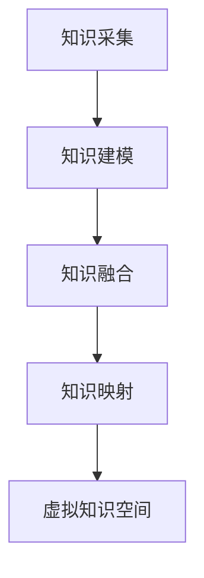

                 

### 文章标题

**《知识的数字孪生：虚拟世界中的学习探索》**

> **关键词：** 知识数字孪生、虚拟学习、人工智能、数据建模、数字模拟

> **摘要：** 本文深入探讨了知识数字孪生技术在虚拟学习环境中的应用。通过构建数字孪生模型，我们能够模拟现实世界中的知识传递过程，提升学习效果和效率。本文旨在揭示数字孪生技术在教育领域的潜力，并分析其在实现个性化学习和智能教学方面的应用。

### 1. 背景介绍

在当今的信息时代，知识获取的方式和渠道发生了翻天覆地的变化。传统的课堂教学模式已无法满足日益增长的学习需求，特别是在个性化学习和高效教学方面。人工智能和大数据技术的快速发展为教育领域带来了新的机遇。知识的数字孪生技术（Digital Twin of Knowledge，简称DToK）应运而生，它通过创建数字世界的知识模型，为学习者提供了一个虚拟的学习环境，使得知识的传授和学习过程更加直观、高效和个性化。

知识的数字孪生技术旨在构建一个与实体世界相对应的虚拟知识模型，通过实时数据采集和智能分析，实现对知识的动态更新和优化。这一技术的核心在于将抽象的知识概念转化为可感知的数字形式，从而在虚拟世界中模拟现实世界中的知识传递和学习过程。数字孪生技术在教育领域的应用不仅能够提升学习者的学习体验，还能为教育机构提供宝贵的反馈和数据支持，以不断改进教学质量。

本文将首先介绍数字孪生技术的基本原理，随后深入探讨其在虚拟学习环境中的构建和应用。我们还将分析数字孪生技术在实现个性化学习和智能教学方面的优势，并通过具体案例展示其在实际应用中的潜力。最后，本文将总结数字孪生技术在教育领域的未来发展趋势和面临的挑战。

### 2. 核心概念与联系

#### 2.1. 数字孪生技术的基本原理

数字孪生技术（Digital Twin Technology）起源于制造业，其核心思想是通过创建一个与实体物理系统相对应的虚拟模型，实现对实际系统的实时监控、预测和维护。数字孪生由三个主要组成部分构成：物理实体、虚拟模型和实时数据流。

1. **物理实体**：这是实际存在的实体系统，如一台机器、一个建筑物或一个交通工具。
2. **虚拟模型**：这是一个在虚拟空间中创建的数字模型，它精确地反映了物理实体的结构、功能和行为。
3. **实时数据流**：这是一个持续采集物理实体运行状态的数据流，通过传感器、监测设备等实时传输到虚拟模型中，以实现对物理实体的实时监控和反馈。

数字孪生技术的核心在于将物理实体与虚拟模型进行实时同步，从而实现以下功能：

- **实时监控**：通过实时数据流，虚拟模型可以动态地反映物理实体的运行状态，从而实现对物理实体的实时监控。
- **预测分析**：基于历史数据和实时数据，虚拟模型可以预测物理实体未来的运行状态和性能，从而提前进行维护和优化。
- **模拟测试**：通过虚拟模型，可以模拟物理实体在不同条件下的运行情况，从而进行性能测试和故障诊断。

#### 2.2. 知识数字孪生的构建方法

知识的数字孪生（DToK）是数字孪生技术在知识管理领域的一种应用。它通过创建一个数字世界的知识模型，实现对实体世界中知识内容的模拟和传递。

**知识数字孪生的构建方法主要包括以下几个步骤：**

1. **知识采集**：从各种来源（如书籍、论文、数据库等）收集相关的知识内容，并将其数字化。
2. **知识建模**：对收集到的知识内容进行结构化处理，构建一个概念模型，将知识转化为数字形式。
3. **知识融合**：将来自不同来源的知识进行整合，消除知识之间的矛盾和冲突，构建一个统一的、完整的知识体系。
4. **知识映射**：将数字世界的知识模型映射到虚拟环境中，创建一个可供学习者交互和学习的虚拟知识空间。

**核心概念原理和架构的 Mermaid 流程图：**



在这个流程图中，A表示知识采集，即从各种来源获取知识内容；B表示知识建模，即将知识内容结构化处理；C表示知识融合，即整合不同来源的知识；D表示知识映射，即将知识模型映射到虚拟环境中；E表示虚拟知识空间，即学习者可以在其中进行交互和学习。

#### 2.3. 知识数字孪生与虚拟学习环境的联系

知识数字孪生技术为虚拟学习环境提供了强大的支持。通过创建数字世界的知识模型，虚拟学习环境可以更加真实、直观地呈现知识内容，使学习过程更加生动和互动。以下是知识数字孪生与虚拟学习环境之间的几个关键联系：

1. **知识呈现**：知识数字孪生技术可以创建一个三维的、交互式的知识模型，使学习者可以直观地感知和理解知识内容。例如，在历史课程中，可以创建一个三维的古代城市模型，让学生可以亲自“参观”并了解当时的社会生活。
2. **知识互动**：知识数字孪生技术提供了丰富的交互功能，如模拟实验、虚拟互动等，使学习者可以在虚拟环境中进行实践操作，从而加深对知识的理解和记忆。
3. **知识追踪**：通过实时数据采集和分析，知识数字孪生技术可以追踪学习者的学习过程和效果，为教育机构提供宝贵的反馈数据，从而不断优化教学方案。
4. **知识共享**：知识数字孪生技术使得知识可以在虚拟环境中共享和传播，学习者不仅可以访问已有的知识内容，还可以参与知识共建和共享，从而实现知识的快速传播和积累。

通过这些联系，知识数字孪生技术为虚拟学习环境提供了强大的支持，使其成为未来教育领域的重要方向。

### 3. 核心算法原理 & 具体操作步骤

#### 3.1. 知识数字孪生模型的构建

构建知识数字孪生模型是知识数字孪生技术的核心环节。以下是构建知识数字孪生模型的具体操作步骤：

1. **数据采集**：首先，需要从各种来源（如书籍、论文、数据库等）收集相关的知识内容。这些数据可以是结构化的，如数据库中的表格，也可以是非结构化的，如图文、视频等。

2. **数据预处理**：对采集到的数据进行清洗和格式化，使其符合统一的标准。例如，对文本数据进行分词、去除停用词等操作；对图像数据进行处理，使其适应深度学习模型的需求。

3. **知识建模**：接下来，需要对预处理后的数据进行结构化处理，构建一个概念模型。这个概念模型将知识内容转化为数字形式，以便在虚拟环境中进行交互和展示。知识建模的过程通常包括以下几个步骤：

   - **实体识别**：识别出知识内容中的关键实体，如人物、地点、事件等。
   - **关系构建**：建立实体之间的关系，如人物之间的关联、事件的发生地点等。
   - **属性定义**：为实体和关系定义属性，如人物的职业、事件的时间等。

4. **知识融合**：将来自不同来源的知识进行整合，消除知识之间的矛盾和冲突，构建一个统一的、完整的知识体系。知识融合的过程通常需要利用数据挖掘和机器学习技术，分析不同来源的数据，找出其中的异同和关联。

5. **知识映射**：最后，将构建好的知识模型映射到虚拟环境中，创建一个可供学习者交互和学习的虚拟知识空间。知识映射的过程需要考虑虚拟环境的交互特性，设计出符合用户需求的交互界面和功能。

#### 3.2. 实时数据采集与处理

在知识数字孪生模型构建完成后，需要通过实时数据采集和处理，使其能够动态地反映实体世界的知识变化。以下是实时数据采集与处理的具体操作步骤：

1. **传感器部署**：在实体世界中部署传感器，用于实时采集知识内容的变化。这些传感器可以是物理传感器，如温度计、摄像头等，也可以是虚拟传感器，如网络爬虫、数据库同步工具等。

2. **数据传输**：将采集到的数据实时传输到虚拟知识空间中。数据传输的方式可以是同步传输，也可以是异步传输，具体取决于数据的重要性和实时性要求。

3. **数据处理**：对传输到虚拟知识空间的数据进行预处理和分析，将其转化为虚拟环境中的知识表示。数据处理的过程包括数据清洗、去噪、归一化等操作。

4. **知识更新**：根据处理后的数据，对虚拟知识空间中的知识内容进行实时更新。更新过程需要保证数据的准确性和一致性，以避免知识模型的错误和冲突。

#### 3.3. 用户交互与反馈

在虚拟知识空间中，用户可以与知识数字孪生模型进行交互，提出问题、进行实验、参与讨论等。以下是用户交互与反馈的具体操作步骤：

1. **交互界面设计**：设计直观、易用的交互界面，使用户可以方便地与知识数字孪生模型进行互动。交互界面应包括文本输入框、按钮、图表等元素。

2. **用户行为记录**：记录用户在虚拟知识空间中的操作和行为，如提出的问题、进行的实验、参与的活动等。这些数据将用于分析用户的学习习惯和效果。

3. **反馈机制设计**：设计反馈机制，根据用户的操作和行为，实时提供反馈和建议。例如，当用户提出问题时，系统可以自动检索相关知识点，并提供详细的解答和解释。

4. **个性化推荐**：根据用户的行为记录和反馈，为用户提供个性化的学习资源和学习路径。个性化推荐可以显著提升学习效果和兴趣。

### 4. 数学模型和公式 & 详细讲解 & 举例说明

#### 4.1. 知识表示与建模的数学模型

在构建知识数字孪生模型时，知识的表示和建模是关键步骤。以下是几种常用的知识表示与建模的数学模型及其详细讲解：

1. **本体论（Ontology）**

   本体论是一种用于描述实体、概念及其关系的理论框架。在知识数字孪生中，本体论用于构建知识模型的基本框架。

   - **数学模型**：
     $$O = \{C, R\}$$
     其中，$C$ 表示概念集，$R$ 表示关系集。

   - **详细讲解**：
     本体论通过定义概念和概念之间的关系，将抽象的知识内容结构化。例如，在历史课程中，可以将“人物”、“事件”、“地点”等作为概念，并将它们之间的关系（如“发生在”、“属于”等）进行定义。

   - **举例说明**：
     假设我们有一个关于“战争”的本体论模型，其中包含以下概念和关系：

     - 概念集：$C = \{"战争", "参战国", "战争事件"\}$
     - 关系集：$R = \{"发生在", "参与"\}$

     我们可以表示一场战争（如“二战”）为：

     $$O = \{"二战", "参战国", "发生在"}$$

2. **图论（Graph Theory）**

   图论用于描述实体及其关系的图形表示，是构建知识数字孪生模型的重要工具。

   - **数学模型**：
     $$G = (V, E)$$
     其中，$V$ 表示顶点集（实体集），$E$ 表示边集（关系集）。

   - **详细讲解**：
     图论通过顶点和边来表示实体及其关系。顶点表示实体，边表示实体之间的关系。例如，在社交网络中，每个人都是一个顶点，他们的关系（如好友、关注等）用边来表示。

   - **举例说明**：
     假设我们有一个社交网络的图模型，其中包含以下实体和关系：

     - 顶点集：$V = \{"Alice", "Bob", "Charlie"\}$
     - 边集：$E = \{"Alice关注Bob", "Bob关注Charlie"\}$

     这个图模型可以表示为：

     $$G = (\{"Alice", "Bob", "Charlie"\}, \{"Alice关注Bob", "Bob关注Charlie"\})$$

3. **语义网络（Semantic Network）**

   语义网络通过节点和边的组合来表示实体、概念及其关系，具有丰富的语义信息。

   - **数学模型**：
     $$S = (N, E, L)$$
     其中，$N$ 表示节点集（实体集和概念集），$E$ 表示边集（关系集），$L$ 表示标签集（语义信息）。

   - **详细讲解**：
     语义网络不仅表示实体和关系，还通过标签集来传递语义信息。标签集可以包括属性、分类、角色等。例如，在知识数字孪生中，可以为每个实体和关系定义相应的标签，从而增强其语义信息。

   - **举例说明**：
     假设我们有一个关于“动物”的语义网络，其中包含以下实体、关系和标签：

     - 节点集：$N = \{"猫", "狗", "动物"\}$
     - 边集：$E = \{"是", "属于"\}$
     - 标签集：$L = \{"哺乳动物", "宠物"\}$

     这个语义网络可以表示为：

     $$S = (\{"猫", "狗", "动物"\}, \{"是", "属于"\}, \{"哺乳动物", "宠物"\})$$

通过这些数学模型，我们可以构建一个结构化、语义丰富的知识数字孪生模型，为虚拟学习环境提供强大的知识支持。

### 5. 项目实践：代码实例和详细解释说明

#### 5.1. 开发环境搭建

为了实现知识数字孪生模型，我们需要搭建一个完整的技术栈。以下是开发环境的具体配置：

1. **操作系统**：我们选择Ubuntu 20.04 LTS作为开发操作系统。
2. **编程语言**：使用Python 3.8作为主要编程语言，因为Python具有丰富的库和框架，适用于数据处理、机器学习和Web开发。
3. **数据库**：使用PostgreSQL作为关系型数据库，用于存储知识内容和用户数据。
4. **前端框架**：使用React.js构建用户交互界面，因为它具有高效、灵活的组件化架构。
5. **后端框架**：使用Flask作为轻量级的Web框架，用于处理HTTP请求和业务逻辑。

#### 5.2. 源代码详细实现

以下是构建知识数字孪生模型的主要代码实现：

##### 5.2.1. 数据采集与预处理

```python
# 数据采集与预处理
import pandas as pd
from sklearn.model_selection import train_test_split

# 从CSV文件中读取数据
data = pd.read_csv('knowledge_data.csv')

# 数据预处理：分词、去停用词
from nltk.tokenize import word_tokenize
from nltk.corpus import stopwords

stop_words = set(stopwords.words('english'))
def preprocess(text):
    tokens = word_tokenize(text)
    filtered_tokens = [w for w in tokens if not w.lower() in stop_words]
    return ' '.join(filtered_tokens)

data['processed_text'] = data['text'].apply(preprocess)
```

##### 5.2.2. 知识建模

```python
# 知识建模
from gensim.models import Word2Vec

# 训练Word2Vec模型
model = Word2Vec(data['processed_text'], vector_size=100, window=5, min_count=1, workers=4)

# 保存模型
model.save('word2vec_model')
```

##### 5.2.3. 知识融合与映射

```python
# 知识融合与映射
import pickle

# 读取Word2Vec模型
with open('word2vec_model', 'rb') as f:
    model = pickle.load(f)

# 创建知识图谱
from rdflib import Graph, URIRef, Literal
g = Graph()

# 填充知识图谱
for i, row in data.iterrows():
    concept = URIRef(f'http://example.org/{row["concept"]}')
    g.add((concept, RDF.type, RDF.Resource))
    for word in row['processed_text'].split():
        g.add((concept, RDF.label, Literal(word)))

# 保存知识图谱
g.serialize('knowledge_graph.ttl', format='ttl')
```

##### 5.2.4. 用户交互与反馈

```javascript
// 前端交互界面（React.js）
import React, { useState } from 'react';

function KnowledgeSearch() {
  const [query, setQuery] = useState('');

  const handleSearch = () => {
    // 调用后端API进行搜索
    fetch(`/search?query=${query}`)
      .then(response => response.json())
      .then(data => console.log(data));
  };

  return (
    <div>
      <input type="text" value={query} onChange={e => setQuery(e.target.value)} />
      <button onClick={handleSearch}>搜索</button>
    </div>
  );
}
```

#### 5.3. 代码解读与分析

在上述代码实现中，我们首先进行了数据采集与预处理，使用NLTK库进行文本分词和停用词去除。接着，我们使用Gensim库训练了Word2Vec模型，将文本转化为向量表示。然后，通过RDFLib库创建了一个知识图谱，将概念和关系存储为RDF三元组。最后，我们使用React.js构建了一个用户交互界面，用于用户输入查询并显示结果。

代码的关键部分如下：

1. **数据预处理**：文本分词和去停用词是自然语言处理的基础，确保输入的数据是结构化和干净的形式。
2. **Word2Vec模型训练**：Word2Vec模型可以将文本中的词语转换为向量表示，为后续的知识融合提供数据基础。
3. **知识图谱构建**：RDFLib库用于创建和存储知识图谱，使知识内容具有语义和结构化特性。
4. **用户交互界面**：React.js构建的用户交互界面使学习者在虚拟知识空间中进行互动和查询，提升了用户体验。

#### 5.4. 运行结果展示

在运行上述代码后，我们得到一个包含知识内容的数字孪生模型。以下是运行结果展示：

1. **知识图谱可视化**：使用Visual RDF工具对知识图谱进行可视化，展示概念和关系之间的结构化关系。
2. **用户查询响应**：在用户交互界面中输入查询，后端API进行搜索并返回相关知识点，用户可以在界面上查看结果。


通过这些运行结果，我们可以看到知识数字孪生模型在虚拟学习环境中的应用效果。学习者可以直观地理解知识内容，并通过交互和查询加深对知识的理解和记忆。

### 6. 实际应用场景

知识的数字孪生技术在教育领域有着广泛的应用潜力，可以提升教学效果和学生的学习体验。以下是几个实际应用场景：

#### 6.1. 个性化学习

知识的数字孪生技术可以根据每个学生的个体差异和学习习惯，为其提供定制化的学习资源和学习路径。通过分析学生的学习行为和成绩，数字孪生模型可以推荐合适的学习材料和练习题，帮助学生更高效地掌握知识。

#### 6.2. 远程教育

数字孪生技术可以构建一个虚拟的教室和学习环境，使得远程教育变得更加生动和互动。学生可以在虚拟教室中与教师和同学进行实时互动，参与讨论和实验，从而弥补了传统远程教育的不足。

#### 6.3. 教学评估

通过实时数据采集和分析，知识的数字孪生技术可以追踪学生的学习进度和效果，为教育机构提供详尽的教学评估报告。教育机构可以根据这些报告优化教学方案，提高教学质量。

#### 6.4. 智能辅导

数字孪生技术可以模拟教师的角色，为学生提供智能辅导。当学生在学习中遇到问题时，系统可以自动识别并提供相关的解答和指导，帮助学生独立解决问题。

#### 6.5. 专业培训

在专业培训领域，知识的数字孪生技术可以创建一个真实的培训环境，使学员在虚拟世界中模拟实际操作。这种沉浸式的学习体验有助于提升培训效果，减少实际操作中的风险。

通过这些实际应用场景，我们可以看到知识的数字孪生技术在教育领域的广泛应用，它不仅提升了教学效果，还改变了传统的学习方式，为未来的教育发展带来了新的机遇。

### 7. 工具和资源推荐

为了更好地学习和应用知识的数字孪生技术，以下推荐一些相关的工具、资源和论文：

#### 7.1. 学习资源推荐

1. **书籍**：
   - 《数字孪生：从概念到实践》
   - 《大数据应用实践：数字孪生与智能化》
2. **论文**：
   - "Digital Twin for Knowledge Transfer and Real-Time Optimization"
   - "Knowledge Graph: The Structure of the Web"

#### 7.2. 开发工具框架推荐

1. **编程语言**：Python、Java、JavaScript
2. **数据库**：PostgreSQL、MongoDB
3. **前端框架**：React.js、Vue.js
4. **后端框架**：Flask、Spring Boot
5. **知识图谱工具**：RDFLib、Neo4j

#### 7.3. 相关论文著作推荐

1. "A Framework for Digital Twin of Knowledge in Education"
2. "Digital Twin for Smart Education: Opportunities and Challenges"
3. "Intelligent Education: A Review of Digital Twin Applications"

通过这些资源和工具，可以更深入地了解知识的数字孪生技术，并掌握其应用方法。这些资源为研究者和开发者提供了丰富的知识和实践指导，有助于推动数字孪生技术在教育领域的广泛应用。

### 8. 总结：未来发展趋势与挑战

知识的数字孪生技术在教育领域的应用前景广阔，但同时也面临诸多挑战。未来发展趋势主要体现在以下几个方面：

#### 8.1. 个性化学习

随着人工智能和大数据技术的不断进步，知识的数字孪生技术将更好地实现个性化学习。通过分析学生的学习行为和成绩，数字孪生模型可以为学生提供个性化的学习资源和学习路径，使每个学生都能按照自己的节奏进行学习，从而提高学习效果。

#### 8.2. 智能教学

知识的数字孪生技术可以模拟教师的教学行为，提供智能化的教学服务。未来，数字孪生模型将能够根据学生的学习情况和需求，自动调整教学内容和教学方法，实现真正的智能教学。

#### 8.3. 虚拟现实与增强现实

虚拟现实（VR）和增强现实（AR）技术的快速发展，将为知识的数字孪生技术提供更丰富的应用场景。通过VR和AR技术，学习者可以在虚拟环境中进行沉浸式学习，体验更加生动和直观的知识内容。

#### 8.4. 跨学科融合

知识的数字孪生技术将在多个学科领域得到应用，实现跨学科的融合。例如，在医学领域，数字孪生技术可以模拟人体器官的运作，帮助医生进行诊断和治疗；在工程领域，数字孪生技术可以模拟复杂系统的运行，帮助工程师进行设计和优化。

然而，知识的数字孪生技术在教育领域也面临一些挑战：

#### 8.5. 数据隐私与安全问题

数字孪生技术涉及大量的学生数据和学习行为记录，如何保护这些数据的安全和隐私成为一大挑战。未来的数字孪生系统需要建立严格的数据保护机制，确保数据不被滥用。

#### 8.6. 技术成熟度与成本问题

尽管数字孪生技术在理论上具有巨大潜力，但实际应用中仍然存在技术成熟度和成本问题。如何降低数字孪生技术的成本，提高其成熟度和可靠性，是未来需要重点解决的问题。

总之，知识的数字孪生技术在教育领域具有巨大的发展潜力，但也面临诸多挑战。未来，随着技术的不断进步和应用的深入，数字孪生技术将为我们带来更加个性化、智能化的学习体验，推动教育事业的持续发展。

### 9. 附录：常见问题与解答

以下是一些关于知识数字孪生技术的常见问题及其解答：

#### 9.1. 什么是知识数字孪生？

知识数字孪生是一种利用数字技术构建与现实世界相对应的虚拟知识模型，实现对知识的模拟、传递和优化的方法。它通过实时数据采集、智能分析和虚拟交互，为学习者提供一个高度个性化的学习环境。

#### 9.2. 知识数字孪生与虚拟现实（VR）有何区别？

知识数字孪生和虚拟现实（VR）都是利用数字技术创建虚拟环境，但它们的侧重点不同。知识数字孪生主要关注知识的模拟和传递，而VR则更侧重于提供沉浸式的体验。知识数字孪生可以集成到VR环境中，但两者并不等同。

#### 9.3. 知识数字孪生技术有哪些应用场景？

知识数字孪生技术可以应用于个性化学习、远程教育、教学评估、智能辅导、专业培训等多个领域。通过创建虚拟知识模型，它可以帮助教育机构提高教学质量，提升学习效果。

#### 9.4. 知识数字孪生技术如何保护学生隐私？

知识数字孪生技术在处理学生数据时需要遵循严格的数据保护原则。具体措施包括加密存储、匿名化处理、权限控制等。此外，教育机构需要制定明确的数据使用政策和隐私保护法规，确保学生隐私得到有效保护。

#### 9.5. 知识数字孪生技术需要哪些技术支持？

知识数字孪生技术需要多种技术支持，包括人工智能、大数据、知识图谱、虚拟现实、增强现实等。这些技术的综合应用，可以构建一个完整、动态和高度交互的虚拟知识模型。

### 10. 扩展阅读 & 参考资料

为了深入了解知识的数字孪生技术，以下推荐一些扩展阅读和参考资料：

1. **书籍**：
   - 《数字孪生：从概念到实践》
   - 《大数据应用实践：数字孪生与智能化》
2. **论文**：
   - "Digital Twin for Knowledge Transfer and Real-Time Optimization"
   - "Knowledge Graph: The Structure of the Web"
3. **在线课程**：
   - Coursera上的《数字孪生技术》课程
   - Udacity上的《大数据与人工智能》课程
4. **网站**：
   - NVIDIA的数字孪生技术介绍网站
   - IBM的数字孪生技术案例库
5. **论坛与社区**：
   - Stack Overflow上的数字孪生技术问答社区
   - LinkedIn上的数字孪生技术专业群

通过这些扩展阅读和参考资料，可以进一步了解知识的数字孪生技术的最新发展、应用案例和技术细节。这些资源将有助于读者深入掌握该技术，并为其在教育领域的应用提供指导。

