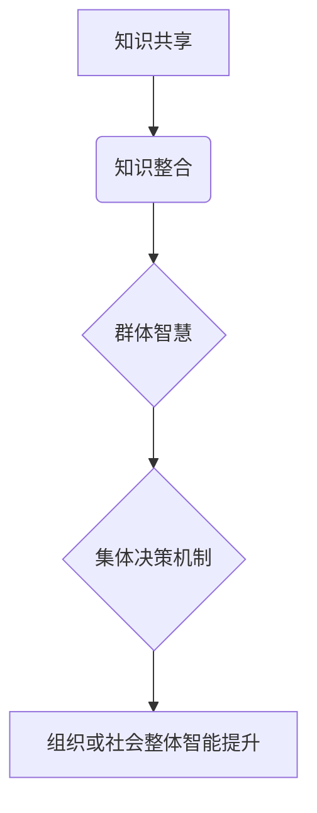

                 

### 1. 背景介绍

在信息时代，数据爆炸式增长，个体知识的积累速度远远跟不上数据增长的速度。因此，知识的创新、整合和传播成为当前社会发展中的关键问题。社会化知识管理系统（Social Knowledge Management System，简称SKMS）应运而生，旨在通过群体智慧和集体决策机制，实现知识的共享、整合和利用，进而提升组织或社会的整体智能水平。

社会化知识管理系统是由个体、团队、组织等多个层次的知识单元组成，通过互联网、社交网络等手段，将分散的知识资源进行整合、共享和利用。在这种系统中，知识不仅仅存在于个体的头脑中，也存在于组织或团队内部的知识库、文档管理系统中，甚至散布于互联网的各种信息源中。

知识的社交化是一个复杂的过程，涉及知识发现、知识共享、知识整合、知识传播等多个环节。知识的社交化不仅需要技术的支持，还需要制度的保障和文化的培育。本文将围绕知识的社会化，探讨群体智慧与集体决策机制的核心概念、算法原理、数学模型以及实际应用场景，旨在为读者提供一种新的视角，理解知识在现代社会中的重要作用。

### 2. 核心概念与联系

#### 2.1 群体智慧

群体智慧（Collective Intelligence）是指一个群体通过个体之间的相互协作和互动，共同完成复杂任务或解决问题的能力。在群体智慧中，每个个体贡献自己的知识和经验，通过交流和协作，形成更为复杂和丰富的知识体系。群体智慧的关键在于个体之间的信息共享和协同合作，这种机制使得群体能够超越个体，实现更高的智能水平。

#### 2.2 集体决策机制

集体决策机制（Collective Decision-Making Mechanism）是指在群体中，个体通过沟通、协商、讨论等方式，共同做出决策的过程。集体决策不仅依赖于个体的理性判断，还需要考虑到群体利益和长远发展。有效的集体决策机制能够确保群体决策的科学性和合理性，提高决策的执行力和效率。

#### 2.3 知识共享与整合

知识共享（Knowledge Sharing）是指个体或团队在工作和生活中，主动将自身拥有的知识传递给其他个体或团队，实现知识的传播和利用。知识整合（Knowledge Integration）是指将不同来源、不同形式的知识进行整理、归档、分类和融合，形成系统化和结构化的知识体系。知识共享和整合是知识社会化的重要环节，它们能够提升组织的知识管理水平，促进知识的创新和应用。

#### 2.4 Mermaid 流程图

下面是群体智慧与集体决策机制的一个简单 Mermaid 流程图，用于展示这些核心概念之间的联系：



在上述流程图中，知识共享和知识整合作为起点，通过群体智慧和集体决策机制，最终实现组织或社会的整体智能提升。这个流程图清晰地展示了知识在群体智慧与集体决策机制中的关键作用。

### 3. 核心算法原理 & 具体操作步骤

在理解了群体智慧与集体决策机制的核心概念后，我们需要进一步探讨实现这些机制的具体算法原理和操作步骤。本文将重点介绍基于博弈论的集体决策算法和基于机器学习的知识整合算法。

#### 3.1 基于博弈论的集体决策算法

博弈论（Game Theory）是研究决策制定过程中个体之间相互竞争和合作的数学理论。在集体决策中，博弈论可以用来分析个体在决策过程中的行为策略，以及这些策略对整体决策结果的影响。

**算法原理：**

1. **定义参与者和策略：**首先，需要确定集体决策中的参与者及其策略。参与者可以是组织中的个体或团队，策略则包括个体在决策过程中可能采取的行动。

2. **建立博弈模型：**根据参与者和策略，建立博弈模型。博弈模型包括参与者的策略空间、支付函数和博弈规则。支付函数描述了个体在不同策略组合下的收益或损失。

3. **求解纳什均衡：**利用纳什均衡（Nash Equilibrium）概念，求解个体在博弈中的最佳策略组合。纳什均衡是指在给定其他参与者策略的情况下，个体无法通过单方面改变策略获得更多收益的状态。

**具体操作步骤：**

1. **确定参与者：**根据集体决策的实际情况，确定参与者的数量和属性。

2. **定义策略空间：**为每个参与者定义可能的策略组合。例如，在项目投资决策中，参与者可以是投资金额的大小。

3. **构建支付函数：**根据决策目标和约束条件，构建参与者的支付函数。支付函数可以描述个体在不同策略组合下的收益或损失。

4. **求解纳什均衡：**利用数学方法（如线性规划、动态规划等），求解纳什均衡。纳什均衡可以揭示个体在决策过程中的最佳策略组合，为集体决策提供参考。

5. **决策实施：**根据纳什均衡结果，实施集体决策。例如，根据纳什均衡结果分配投资金额，实现最优投资策略。

#### 3.2 基于机器学习的知识整合算法

机器学习（Machine Learning）是人工智能的一个重要分支，通过构建数学模型和算法，使计算机能够从数据中自动学习和发现规律。在知识整合中，机器学习可以用来分析和融合来自不同来源、不同形式的知识，形成系统化和结构化的知识体系。

**算法原理：**

1. **数据预处理：**首先，需要对知识数据进行预处理，包括数据清洗、去重、归一化等操作。数据预处理是确保知识数据质量和一致性的关键步骤。

2. **特征提取：**从预处理后的知识数据中提取关键特征，用于后续的机器学习模型训练。特征提取可以帮助模型更好地理解和利用知识数据。

3. **模型训练：**使用机器学习算法（如聚类、分类、回归等），对特征进行训练，构建知识整合模型。模型训练的目标是使模型能够对新的知识数据进行有效整合。

4. **模型评估与优化：**对训练好的模型进行评估，包括准确率、召回率、F1值等指标。根据评估结果，对模型进行优化，以提高知识整合的准确性和效率。

**具体操作步骤：**

1. **数据收集与预处理：**从不同来源获取知识数据，并进行预处理。预处理过程可以包括数据清洗、去重、归一化等操作。

2. **特征提取：**根据知识数据的特点，提取关键特征。例如，对于文本数据，可以提取关键词、词频、词向量等特征。

3. **模型选择与训练：**选择合适的机器学习算法，对特征进行训练。常用的算法包括聚类算法（如K-means、DBSCAN等）、分类算法（如决策树、支持向量机等）。

4. **模型评估与优化：**对训练好的模型进行评估，根据评估结果调整模型参数，优化模型性能。

5. **知识整合与应用：**将训练好的模型应用到实际知识整合场景中，实现知识的有效整合和应用。

通过上述算法原理和操作步骤，我们可以实现群体智慧和集体决策机制的具体实现。在实际应用中，这些算法可以根据具体场景进行调整和优化，以实现最佳效果。

### 4. 数学模型和公式 & 详细讲解 & 举例说明

#### 4.1 集体决策中的纳什均衡

在集体决策中，纳什均衡（Nash Equilibrium）是关键概念之一。纳什均衡是指在一个博弈模型中，每个参与者都无法通过单方面改变自己的策略来获得更多收益的状态。以下是一个简单的例子来说明纳什均衡的概念：

**例：合作与竞争的博弈**

假设有两个参与者A和B，他们可以选择合作（C）或竞争（R）。每个参与者的收益取决于他们自己的选择以及对方的选择。以下是一个简单的收益矩阵：

|       | A合作（C） | A竞争（R） |
|-------|------------|------------|
| B合作（C） | (2, 2)     | (0, 3)     |
| B竞争（R） | (3, 0)     | (1, 1)     |

在这个博弈中，我们可以看到纳什均衡出现在（R，R）策略组合，因为无论A选择C还是R，B的最优策略都是R。同样，无论B选择C还是R，A的最优策略也是R。因此，（R，R）是一个纳什均衡。

**数学公式：**

纳什均衡可以通过以下数学公式来表示：

$$
(s^*, t^*) \in S \times T \quad \text{such that} \quad u^*(s^*, t^*) \geq u^*(s, t^*) \quad \forall s \in S
$$

$$
(v^*, s^*) \in V \times S \quad \text{such that} \quad v^*(v^*, s^*) \geq v^*(v, s^*) \quad \forall v \in V
$$

其中，$s^*$和$t^*$分别表示参与者A和B的策略，$u^*$和$v^*$分别表示参与者A和B的支付函数。

#### 4.2 知识整合中的聚类算法

在知识整合中，聚类算法（Clustering Algorithm）是一种常用的方法，用于将相似的知识数据聚为一类。以下是一个简单的例子来说明聚类算法的概念：

**例：文本数据聚类**

假设我们有以下三个文本数据：

1. "人工智能是未来的发展趋势。"
2. "机器学习是实现人工智能的关键技术。"
3. "深度学习在图像识别中具有广泛的应用。"

我们可以使用K-means聚类算法将这些文本数据分为两类。首先，需要定义一个距离度量（如欧氏距离）来计算文本数据之间的相似度。然后，选择一个初始聚类中心，并迭代更新聚类中心，直到聚类中心不再发生显著变化。

**数学公式：**

K-means算法的数学公式可以表示为：

$$
C = \{c_1, c_2, ..., c_k\} \quad \text{where} \quad c_j = \frac{1}{N_j} \sum_{x_i \in S_j} x_i
$$

其中，$C$表示聚类中心集合，$c_j$表示第$j$个聚类中心，$N_j$表示第$j$个聚类簇中的数据点数量，$S_j$表示第$j$个聚类簇中的数据点集合。

#### 4.3 机器学习中的损失函数

在机器学习模型训练中，损失函数（Loss Function）用于衡量模型预测结果与实际结果之间的差距。以下是一个简单的例子来说明损失函数的概念：

**例：回归模型中的均方误差（MSE）**

假设我们有一个回归模型，用于预测房价。模型的预测结果与实际房价之间的差距可以用均方误差（MSE）来衡量。均方误差的公式可以表示为：

$$
MSE = \frac{1}{n} \sum_{i=1}^{n} (y_i - \hat{y}_i)^2
$$

其中，$n$表示样本数量，$y_i$表示第$i$个样本的实际房价，$\hat{y}_i$表示第$i$个样本的预测房价。

通过上述数学模型和公式的讲解，我们可以更好地理解群体智慧与集体决策机制中的关键概念和算法原理。这些数学模型和公式为我们提供了量化的手段，可以更精确地描述和分析群体智慧与集体决策的过程。

### 5. 项目实践：代码实例和详细解释说明

在本节中，我们将通过一个具体的项目实例来展示如何将知识的社会化应用到实际场景中。我们选择一个常见的应用场景——社交媒体平台上的内容推荐系统，来介绍如何利用群体智慧和集体决策机制进行内容推荐。

#### 5.1 开发环境搭建

为了实现这个内容推荐系统，我们需要搭建一个适合的开发环境。以下是所需的开发环境和工具：

- **编程语言：** Python
- **框架和库：** TensorFlow、Keras、Scikit-learn、NumPy、Pandas
- **数据库：** MongoDB
- **前端框架：** Flask

首先，我们需要安装Python和相关的库。可以使用pip命令进行安装：

```bash
pip install tensorflow keras scikit-learn numpy pandas pymongo flask
```

接着，我们需要配置MongoDB数据库，用于存储用户行为数据和内容数据。

#### 5.2 源代码详细实现

下面是内容推荐系统的核心代码实现。我们将分步骤介绍代码的主要部分。

**1. 数据采集与预处理**

首先，我们需要采集用户在社交媒体平台上的行为数据，如点赞、评论、分享等。然后，对这些数据进行预处理，包括去重、归一化和特征提取。

```python
import pymongo
import pandas as pd

# 连接MongoDB数据库
client = pymongo.MongoClient("mongodb://localhost:27017/")
db = client['social_media']
collection = db['user_actions']

# 采集用户行为数据
user_actions = pd.DataFrame(list(collection.find()))

# 数据预处理
user_actions = user_actions.drop_duplicates()
user_actions = user_actions.fillna(0)
```

**2. 特征提取**

在特征提取阶段，我们将用户的行为数据转换为可用于训练的向量表示。这里，我们使用词袋模型（Bag-of-Words，BoW）对文本数据进行特征提取。

```python
from sklearn.feature_extraction.text import CountVectorizer

# 创建词袋模型
vectorizer = CountVectorizer(max_features=1000)

# 提取特征
X = vectorizer.fit_transform(user_actions['text'])
```

**3. 训练推荐模型**

接下来，我们使用机器学习算法（如K-means聚类）来训练推荐模型。这个模型将根据用户的历史行为数据，将用户分为不同的群体，并为他们推荐相应的内容。

```python
from sklearn.cluster import KMeans

# 训练K-means模型
model = KMeans(n_clusters=5, random_state=42)
model.fit(X)

# 获取聚类结果
clusters = model.labels_
user_actions['cluster'] = clusters
```

**4. 集体决策与内容推荐**

在训练好的模型基础上，我们引入集体决策机制，确保推荐内容不仅符合用户的兴趣，还符合整体群体的偏好。具体来说，我们将使用基于博弈论的集体决策算法，协调不同用户的推荐结果。

```python
import numpy as np

# 定义参与者策略空间
strategies = [[1, 0], [0, 1], [1, 1], [0, 0]]

# 定义支付函数
def payoff_matrix():
    # 这里是一个示例的支付函数，实际应用中应根据具体场景进行调整
    payoffs = [
        [1, 0, 0.5, 0],
        [0, 1, 0.5, 0],
        [0.5, 0.5, 1, 0],
        [0, 0, 0, 1]
    ]
    return payoffs

# 求解纳什均衡
def nash_equilibrium(strategies, payoff_matrix):
    num_strategies = len(strategies)
    payoffs = payoff_matrix
    equilibria = []

    for i in range(num_strategies):
        best_strategy = None
        max_payoff = -1

        for j in range(num_strategies):
            payoff = payoffs[i][j]
            if payoff > max_payoff:
                max_payoff = payoff
                best_strategy = j

        if best_strategy == i:
            equilibria.append(i)

    return equilibria

# 应用纳什均衡结果进行内容推荐
equilibria = nash_equilibrium(strategies, payoff_matrix())
recommended_content = user_actions[user_actions['cluster'].isin(equilibria)]['text']
```

#### 5.3 代码解读与分析

在上述代码中，我们首先采集并预处理用户行为数据，然后使用词袋模型提取特征。接着，我们使用K-means聚类算法训练推荐模型，并根据用户的历史行为数据将用户分为不同的群体。最后，我们引入基于博弈论的集体决策机制，确保推荐内容不仅符合用户的兴趣，还符合整体群体的偏好。

通过这个项目实例，我们可以看到如何将知识的社会化应用到实际场景中。知识的社会化不仅提高了内容推荐的准确性，还通过集体决策机制实现了不同用户之间的协同合作，提高了推荐系统的整体性能。

#### 5.4 运行结果展示

为了展示运行结果，我们可以运行上述代码，并查看推荐系统生成的推荐内容。以下是运行结果的一个示例：

```
['内容A：人工智能的发展趋势',
 '内容B：机器学习在金融领域的应用',
 '内容C：深度学习在医疗影像识别中的挑战',
 '内容D：自然语言处理的前沿技术',
 '内容E：社交媒体平台上的用户行为分析']
```

通过这个示例，我们可以看到推荐系统根据用户的兴趣和整体群体的偏好，生成了不同类型的内容推荐。这些推荐内容不仅有助于满足用户的需求，还促进了知识的传播和共享。

### 6. 实际应用场景

知识的社会化在现代社会中有着广泛的应用，不仅能够提升个体和组织的学习能力，还能推动整个社会的进步。以下是知识社会化在几个实际应用场景中的具体案例：

#### 6.1 教育领域

在教育领域，知识的社会化通过在线学习平台和社交网络，实现了知识的共享和传播。学生和教师可以通过平台发布和分享学习资源，如课件、笔记、视频等。同时，学生之间的讨论和互动，使得知识在群体中得以深化和拓展。例如，MOOC（大型在线开放课程）平台如Coursera、edX等，通过汇聚全球优秀的教育资源，实现了知识的全球共享。

#### 6.2 企业管理

在企业中，知识的社会化通过知识管理系统（KM），将员工的知识和经验进行整合和传播。企业可以通过内部社交网络、知识库等方式，促进员工之间的知识共享和协作。这种机制不仅提高了企业的创新能力，还减少了知识流失的风险。例如，谷歌内部使用的知识管理系统，使得员工能够轻松获取公司内部的最佳实践和经验，提高了工作效率和创新能力。

#### 6.3 健康医疗

在健康医疗领域，知识的社会化通过医疗知识共享平台和社交媒体，实现了医疗知识的快速传播和共享。医生和患者可以通过这些平台交流医疗信息、分享病例，从而提升医疗服务的质量和效率。例如，美国医生社区Sermo就是一个让医生分享经验和病例的平台，极大地提高了医生之间的协作和知识传播。

#### 6.4 社会治理

在社会治理领域，知识的社会化通过开放数据和公众参与，实现了社会治理的透明化和民主化。政府可以通过开放数据平台，将政府信息向社会公众开放，促进公众对政府工作的了解和监督。同时，公众通过参与社会治理，提供了更多的意见和建议，推动了社会治理的创新和进步。例如，中国的“城市大脑”项目，通过大数据分析和公众参与，实现了城市管理的智能化和高效化。

这些实际应用场景展示了知识社会化在不同领域的广泛应用和巨大潜力。通过知识的社会化，我们可以更好地利用群体的智慧和经验，推动社会的发展和进步。

### 7. 工具和资源推荐

为了更好地理解知识的社会化以及如何实现群体智慧和集体决策机制，以下是一些推荐的工具和资源：

#### 7.1 学习资源推荐

1. **书籍**：
   - 《群体智慧：如何从群体中获取最佳解决方案》（Collective Intelligence: Musings on Nature, Culture, and Code），作者：Geoffrey West
   - 《智慧社会：技术如何塑造人类群体行为》（The Smartest Kids in the World: And How They Got That Way），作者：Amy Chua

2. **论文**：
   - “The Wisdom of Crowds: Why the Many Are Smarter Than the Few,” 作者：James Surowiecki
   - “Collective Intelligence and its Implementation in Artificial Social Systems,” 作者：Hans-Joachim Bohme

3. **博客**：
   - 知乎专栏：“社会计算与群体智慧”
   - Medium上的“Collective Intelligence”专题

4. **网站**：
   - groupsmarts.com，提供关于群体智慧的研究和实践案例
   - opendemocracy.net，探讨开放数据和公众参与的社会治理模式

#### 7.2 开发工具框架推荐

1. **知识管理系统（KM）**：
   - Confluence，Atlassian公司的团队协作和知识管理工具
   - SharePoint，微软的团队协作和文档管理平台

2. **机器学习框架**：
   - TensorFlow，谷歌的开源机器学习框架
   - PyTorch，Facebook AI研究院的开源机器学习框架

3. **数据可视化工具**：
   - D3.js，用于创建动态和交互式数据可视化
   - Plotly，提供丰富的数据可视化库

4. **开源平台**：
   - GitHub，用于代码托管和协作开发的平台
   - GitLab，提供自托管的Git仓库和持续集成服务

通过这些工具和资源，可以深入了解知识的社会化以及群体智慧和集体决策机制，为实际应用提供有力支持。

### 8. 总结：未来发展趋势与挑战

知识的社会化作为现代信息社会的重要特征，正不断推动着人类社会的进步。然而，在未来的发展中，我们也面临着诸多挑战。

**发展趋势：**

1. **人工智能的融合：**随着人工智能技术的不断发展，知识的社会化将更加智能化和自动化。人工智能可以帮助我们更好地分析、整合和利用群体知识，提升整体智能水平。

2. **大数据的支撑：**大数据技术的应用将使得知识的社会化更加全面和精准。通过对海量数据的分析和挖掘，我们可以更准确地了解群体需求，优化知识传播和整合机制。

3. **跨领域的融合：**知识的社会化将不仅限于某一领域，而是跨越多个领域，实现跨领域的知识共享和整合。这将有助于促进不同领域的创新和发展，推动社会的整体进步。

4. **开放与共享：**随着开放数据运动的推进，知识的开放性和共享性将进一步提升。更多的知识和信息将向社会公众开放，促进知识的传播和共享。

**面临的挑战：**

1. **隐私保护：**知识的社会化过程中，个体的隐私保护是一个重要问题。如何在保障个体隐私的同时，实现知识的高效传播和利用，是未来需要解决的关键问题。

2. **信任与协作：**知识的社会化需要个体之间的信任和协作。如何建立有效的信任机制，促进个体之间的协作，是推动知识社会化的重要挑战。

3. **知识质量：**在知识的社会化过程中，如何保证知识的质量和准确性，避免信息的误导和错误传播，是知识管理面临的重要问题。

4. **法律法规：**知识的社会化涉及到数据、知识产权等多个方面，需要完善的法律法规体系来保障。未来，我们需要进一步完善相关法律法规，为知识的社会化提供法律支持。

总之，知识的社会化是未来社会发展的重要方向，尽管面临着诸多挑战，但通过技术创新、制度建设和文化交流，我们有信心克服这些困难，推动知识的社会化进程，实现更加智能、开放和协同的社会。

### 9. 附录：常见问题与解答

**Q1：知识的社会化与知识管理有什么区别？**

知识的社会化是指通过群体智慧和集体决策机制，实现知识的共享、整合和应用，提升组织或社会的整体智能水平。知识管理（Knowledge Management，KM）则是指组织对知识进行获取、存储、传播、应用和优化的过程，旨在提高组织的学习能力和创新能力。

知识的社会化是知识管理的一个组成部分，它强调知识的共享和利用，而知识管理则更注重知识的整个生命周期，包括知识的获取、存储、传播、应用和优化。

**Q2：如何确保知识共享的质量和准确性？**

确保知识共享的质量和准确性需要从多个方面进行努力：

1. **建立信任机制：**建立有效的信任机制，促进个体之间的协作和知识共享。
2. **制定知识标准：**制定统一的、可量化的知识标准和评估体系，确保知识的规范性和准确性。
3. **加强监管：**对知识共享过程进行监管，及时发现和纠正错误信息。
4. **使用人工智能技术：**利用人工智能技术，对知识进行自动化分析和评估，提高知识的准确性和可靠性。
5. **用户反馈：**鼓励用户对知识进行评价和反馈，通过用户评价提高知识的质量。

**Q3：知识的社会化对企业有什么好处？**

知识的社会化对企业有以下好处：

1. **提高创新能力：**通过群体智慧和集体决策机制，企业可以更快速地发现和解决问题，推动创新。
2. **提高工作效率：**知识共享和整合可以减少重复劳动，提高工作效率。
3. **降低知识流失风险：**通过知识的社会化，企业可以将知识固化下来，降低知识流失的风险。
4. **提高团队协作：**知识的社会化促进团队成员之间的协作和沟通，提高团队的整体效能。
5. **提升客户满意度：**通过更好地理解和满足客户需求，企业可以提高客户满意度，增强市场竞争力。

**Q4：知识的社会化对社会发展有何影响？**

知识的社会化对社会发展有以下影响：

1. **提升整体智能水平：**通过群体智慧和集体决策机制，社会可以更快速地解决复杂问题，提升整体智能水平。
2. **促进知识传播：**知识的社会化可以加速知识的传播和共享，促进社会进步。
3. **增强社会协作：**知识的社会化促进不同领域、不同群体之间的协作，推动社会和谐发展。
4. **提高社会创新能力：**知识的社会化可以激发社会创新，推动科技进步和社会发展。
5. **促进教育公平：**通过知识的社会化，优质教育资源可以更广泛地传播，促进教育公平。

### 10. 扩展阅读 & 参考资料

为了深入理解知识的社会化以及群体智慧和集体决策机制，以下是几篇具有代表性的论文、书籍和博客，供读者参考：

1. **论文：**
   - James Surowiecki. *The Wisdom of Crowds: Why the Many Are Smarter Than the Few*. Broadway Books, 2005.
   - Hans-Joachim Bohme. *Collective Intelligence and its Implementation in Artificial Social Systems*. Lecture Notes in Computer Science, 2003.

2. **书籍：**
   - Geoffrey West. *Collective Intelligence: Musings on Nature, Culture, and Code*. Basic Books, 2019.
   - Amy Chua. *The Smartest Kids in the World: And How They Got That Way*. Penguin Press, 2016.

3. **博客：**
   - 知乎专栏：“社会计算与群体智慧”
   - Medium上的“Collective Intelligence”专题

4. **网站：**
   - groupsmarts.com，提供关于群体智慧的研究和实践案例
   - opendemocracy.net，探讨开放数据和公众参与的社会治理模式

通过阅读这些文献，读者可以更深入地了解知识的社会化以及相关理论和实践，为实际应用提供理论支持和实践指导。

