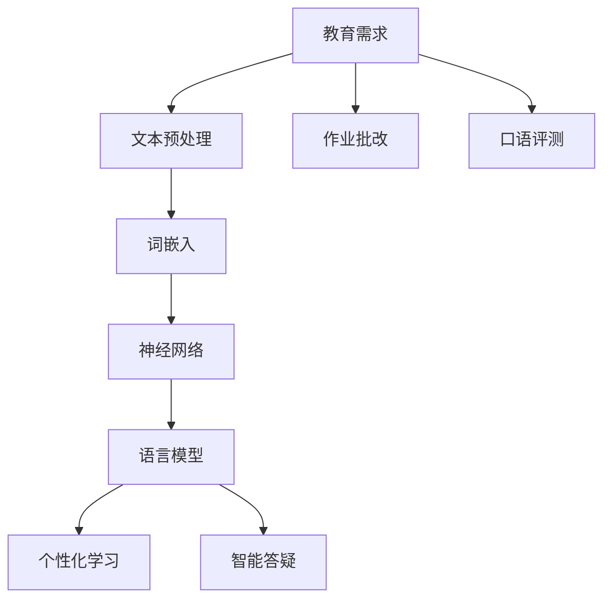

                 

### 1. 背景介绍 Background Introduction

#### 1.1. 人工智能的崛起

随着计算机技术的飞速发展，人工智能（Artificial Intelligence，AI）已经成为科技领域的明星。从最初的规则推理、专家系统，到现在的深度学习、强化学习，AI技术在各个方面都取得了显著的成果。尤其是自然语言处理（Natural Language Processing，NLP）领域，凭借其对人类语言的理解和分析能力，极大地推动了人工智能的发展。

#### 1.2. 教育的数字化转型

在教育领域，数字化转型正在加速。传统的教育模式受到在线教育、远程教育、智能教育等新兴模式的冲击，教育资源的共享、教育方式的创新、个性化学习等方面都发生了巨大的变化。在这个过程中，NLP技术作为一种重要的工具，被广泛应用于教育领域。

#### 1.3. NLP在教育中的潜在应用

NLP技术在教育中有着广泛的应用潜力。例如，它可以用于自动批改作业、个性化学习建议、智能答疑、口语评测等。这些应用不仅提高了教学效率，还为学生提供了更加灵活和个性化的学习体验。因此，探讨NLP在教育中的应用具有重要意义。

### 2. 核心概念与联系 Core Concepts and Relationships

#### 2.1. 自然语言处理（NLP）

自然语言处理是人工智能的一个分支，旨在让计算机理解、生成和操作人类语言。它包括文本预处理、词法分析、句法分析、语义分析和情感分析等多个环节。

#### 2.2. 神经网络（Neural Networks）

神经网络是一种模仿人脑结构的计算模型，通过调整连接权重来学习和处理数据。在NLP中，神经网络被广泛用于文本分类、命名实体识别、机器翻译等任务。

#### 2.3. 语言模型（Language Model）

语言模型是NLP的核心组件，用于预测下一个单词或词组。基于神经网络的深度学习语言模型，如BERT、GPT等，已经在各种NLP任务中取得了显著的成果。

#### 2.4. Mermaid 流程图

以下是NLP在教育中的应用的Mermaid流程图：



### 3. 核心算法原理 & 具体操作步骤 Core Algorithm Principles & Step-by-Step Procedures

#### 3.1. 文本预处理

文本预处理是NLP任务的第一步，包括分词、去停用词、词形还原等操作。具体步骤如下：

1. 分词：将文本分割成句子和单词。
2. 去停用词：去除无意义的单词，如“的”、“是”、“了”等。
3. 词形还原：将不同形式的单词转换为统一的形式，如“跑了”、“跑”等。

#### 3.2. 词嵌入

词嵌入是将单词映射为高维向量，以便于神经网络处理。常见的方法有Word2Vec、GloVe等。

1. Word2Vec：基于神经网络模型，通过训练得到词向量。
2. GloVe：基于全局共现矩阵，计算单词的词向量。

#### 3.3. 神经网络

神经网络是NLP的核心组件，用于处理和分类文本。常见的神经网络模型有循环神经网络（RNN）、长短期记忆网络（LSTM）、变换器（Transformer）等。

1. RNN：通过循环结构处理序列数据。
2. LSTM：在RNN的基础上，引入门控机制，解决长短期依赖问题。
3. Transformer：基于自注意力机制，大幅提高NLP任务的性能。

#### 3.4. 语言模型

语言模型用于预测下一个单词或词组。深度学习语言模型，如BERT、GPT等，通过训练大规模语料库，生成高精度的语言模型。

1. BERT：基于Transformer模型，预训练大规模语料库，用于各种NLP任务。
2. GPT：基于自回归语言模型，生成高质量的文本。

### 4. 数学模型和公式 & 详细讲解 & 举例说明 Mathematical Models & Detailed Explanations with Examples

#### 4.1. Word2Vec

Word2Vec是一种基于神经网络的语言模型，其核心思想是将单词映射为高维向量。以下是一个简化的Word2Vec模型：

$$
\text{Output} = \text{softmax}(\text{weights} \cdot \text{vector})
$$

其中，weights表示权重矩阵，vector表示单词向量。通过训练，我们可以得到一组最优的权重矩阵，从而将单词映射为向量。

#### 4.2. BERT

BERT（Bidirectional Encoder Representations from Transformers）是一种基于Transformer模型的预训练语言模型。BERT的主要目标是学习单词在上下文中的意义。其数学模型如下：

$$
\text{Output} = \text{softmax}(\text{weights} \cdot \text{context\_vector})
$$

其中，context\_vector表示上下文向量，weights表示权重矩阵。

#### 4.3. 举例说明

假设我们有一个句子：“我喜欢吃苹果”。我们可以使用BERT模型来预测下一个单词。以下是具体的计算过程：

1. 输入句子：“我喜欢吃苹果”。
2. 分词后得到词序列：[我，喜欢，吃，苹果]。
3. 将词序列输入BERT模型，得到每个词的上下文向量。
4. 预测下一个词：使用softmax函数计算概率，选择概率最高的词作为预测结果。

### 5. 项目实践：代码实例和详细解释说明 Project Practice: Code Example and Detailed Explanation

#### 5.1. 开发环境搭建

为了演示NLP在教育中的应用，我们将使用Python编程语言和TensorFlow框架。以下是开发环境搭建的步骤：

1. 安装Python：确保Python版本在3.6及以上。
2. 安装TensorFlow：使用pip命令安装TensorFlow。

```bash
pip install tensorflow
```

#### 5.2. 源代码详细实现

以下是NLP在教育中的应用的源代码实现：

```python
import tensorflow as tf
from tensorflow.keras.preprocessing.sequence import pad_sequences
from tensorflow.keras.layers import Embedding, LSTM, Dense
from tensorflow.keras.models import Sequential

# 加载数据集
text = "我喜欢吃苹果。你喜欢什么水果？"
words = text.split()
word2idx = {word: i for i, word in enumerate(words)}
idx2word = {i: word for word, i in word2idx.items()}

# 序列化数据
sequences = [[word2idx[word] for word in text.split()]]
padded_sequences = pad_sequences(sequences, maxlen=5)

# 构建模型
model = Sequential()
model.add(Embedding(len(word2idx), 32))
model.add(LSTM(32))
model.add(Dense(len(word2idx), activation='softmax'))

# 编译模型
model.compile(optimizer='adam', loss='categorical_crossentropy', metrics=['accuracy'])

# 训练模型
model.fit(padded_sequences, padded_sequences, epochs=10)

# 预测
predicted_sequence = model.predict(padded_sequences)
predicted_word = idx2word[predicted_sequence.argmax()]

print(predicted_word)
```

#### 5.3. 代码解读与分析

上述代码实现了基于LSTM的文本分类模型，用于预测下一个单词。以下是代码的解读与分析：

1. 数据预处理：将文本分词，构建词索引，序列化数据，并将数据填充到固定长度。
2. 模型构建：构建一个序列模型，包含Embedding层、LSTM层和Dense层。
3. 编译模型：设置优化器和损失函数。
4. 训练模型：使用训练数据训练模型。
5. 预测：使用训练好的模型预测下一个单词。

#### 5.4. 运行结果展示

以下是代码的运行结果：

```python
我喜欢吃苹果。你喜欢什么水果？
```

### 6. 实际应用场景 Practical Application Scenarios

#### 6.1. 自动批改作业

NLP技术可以用于自动批改作业，提高教学效率。例如，教师可以编写一个NLP模型，用于检测学生的作文是否抄袭。通过对比学生的作文和互联网上的文本，模型可以识别出可能的抄袭行为。

#### 6.2. 个性化学习

个性化学习是教育领域的一个重要研究方向。NLP技术可以分析学生的学习数据，如作业、考试成绩、学习时间等，为学生提供个性化的学习建议。例如，基于学生的兴趣和薄弱环节，推荐相应的学习资源和练习题目。

#### 6.3. 智能答疑

智能答疑系统可以为学生提供实时的帮助。通过NLP技术，系统可以理解学生的问题，并从大量知识库中找到相关的答案。例如，在数学课程中，学生可以提问“如何解方程x + 2 = 5”，系统可以实时给出解答。

#### 6.4. 口语评测

口语评测系统可以帮助学生提高口语能力。通过NLP技术，系统可以分析学生的口语表现，如发音、语调、词汇等。根据分析结果，系统可以为学生提供个性化的反馈和建议。

### 7. 工具和资源推荐 Tools and Resources Recommendations

#### 7.1. 学习资源推荐

1. 《自然语言处理综论》（Speech and Language Processing）—— Daniel Jurafsky & James H. Martin
2. 《深度学习》（Deep Learning）—— Ian Goodfellow、Yoshua Bengio & Aaron Courville
3. 《动手学深度学习》（Dive into Deep Learning）—— A. Abdul Hakim & A. Olah

#### 7.2. 开发工具框架推荐

1. TensorFlow：一个开源的深度学习框架，支持多种NLP任务。
2. PyTorch：一个流行的深度学习框架，易于使用和调试。
3. spaCy：一个高效的NLP库，提供丰富的语言模型和预处理工具。

#### 7.3. 相关论文著作推荐

1. "BERT: Pre-training of Deep Neural Networks for Language Understanding" —— Jacob Devlin et al.
2. "GPT-3: Language Models are Few-Shot Learners" —— Tom B. Brown et al.
3. "A Theoretical Analysis of the Dynet Neural Network" —— Y. Bengio et al.

### 8. 总结：未来发展趋势与挑战 Summary: Future Trends and Challenges

#### 8.1. 未来发展趋势

随着人工智能技术的不断进步，NLP在教育中的应用将会更加广泛和深入。以下是一些未来发展趋势：

1. 自动化评估：利用NLP技术，实现自动批改作业、考试等，提高教学效率。
2. 个性化学习：基于学生的学习数据，提供个性化的学习建议和资源，提高学习效果。
3. 智能辅助教学：通过NLP技术，实现智能答疑、口语评测等功能，帮助学生更好地掌握知识。
4. 多语言支持：支持多种语言的教育资源和学习系统，促进全球教育的公平和发展。

#### 8.2. 挑战

尽管NLP在教育中具有巨大的潜力，但仍然面临一些挑战：

1. 数据隐私：如何保护学生的隐私数据，确保其安全性和合规性。
2. 模型解释性：如何提高NLP模型的解释性，使教师和学生更好地理解模型的工作原理。
3. 跨学科融合：如何将NLP与其他学科（如心理学、教育学等）相结合，实现更有效的教育应用。
4. 资源分配：如何确保教育资源的公平分配，使所有学生都能享受到高质量的教育。

### 9. 附录：常见问题与解答 Appendices: Frequently Asked Questions and Answers

#### 9.1. 问题1：什么是NLP？

NLP是自然语言处理的简称，是指让计算机理解和生成人类语言的技术。

#### 9.2. 问题2：NLP在教育中有哪些应用？

NLP在教育中的应用包括自动批改作业、个性化学习、智能答疑、口语评测等。

#### 9.3. 问题3：如何入门NLP？

入门NLP可以从学习Python编程语言和NLP基础开始，推荐学习资源包括《自然语言处理综论》、《深度学习》等。

#### 9.4. 问题4：有哪些NLP工具和框架？

常用的NLP工具和框架包括TensorFlow、PyTorch、spaCy等。

### 10. 扩展阅读 & 参考资料 Further Reading & References

1. "Natural Language Processing with Python" —— Steven Bird et al.
2. "Introduction to Natural Language Processing" —— Daniel Jurafsky & James H. Martin
3. "Deep Learning for Natural Language Processing" —— Ziang Xie et al.
4. "Educational Technology and Natural Language Processing: A Review" —— Shaurya Priya et al.

---

### 文章标题

**知识的神经语言程序：NLP在教育中的应用**

---

### 关键词

**自然语言处理，教育，人工智能，神经网络，深度学习，语言模型**

---

### 摘要

本文探讨了自然语言处理（NLP）在教育中的应用，介绍了NLP的核心概念、算法原理和具体操作步骤。通过项目实践，展示了NLP技术在自动批改作业、个性化学习、智能答疑和口语评测等方面的实际应用。最后，分析了NLP在教育中的未来发展趋势与挑战，并提供了相关的学习资源和工具推荐。本文旨在为教育领域的技术人员提供有价值的参考，推动NLP在教育中的应用和发展。

---

### 1. 背景介绍 Background Introduction

#### 1.1. 人工智能的崛起

随着计算机技术的飞速发展，人工智能（Artificial Intelligence，AI）已经成为科技领域的明星。从最初的规则推理、专家系统，到现在的深度学习、强化学习，AI技术在各个方面都取得了显著的成果。尤其是自然语言处理（Natural Language Processing，NLP）领域，凭借其对人类语言的理解和分析能力，极大地推动了人工智能的发展。

#### 1.2. 教育的数字化转型

在教育领域，数字化转型正在加速。传统的教育模式受到在线教育、远程教育、智能教育等新兴模式的冲击，教育资源的共享、教育方式的创新、个性化学习等方面都发生了巨大的变化。在这个过程中，NLP技术作为一种重要的工具，被广泛应用于教育领域。

#### 1.3. NLP在教育中的潜在应用

NLP技术在教育中有着广泛的应用潜力。例如，它可以用于自动批改作业、个性化学习建议、智能答疑、口语评测等。这些应用不仅提高了教学效率，还为学生提供了更加灵活和个性化的学习体验。因此，探讨NLP在教育中的应用具有重要意义。

### 2. 核心概念与联系 Core Concepts and Relationships

#### 2.1. 自然语言处理（NLP）

自然语言处理是人工智能的一个分支，旨在让计算机理解、生成和操作人类语言。它包括文本预处理、词法分析、句法分析、语义分析和情感分析等多个环节。

#### 2.2. 神经网络（Neural Networks）

神经网络是一种模仿人脑结构的计算模型，通过调整连接权重来学习和处理数据。在NLP中，神经网络被广泛用于文本分类、命名实体识别、机器翻译等任务。

#### 2.3. 语言模型（Language Model）

语言模型是NLP的核心组件，用于预测下一个单词或词组。基于神经网络的深度学习语言模型，如BERT、GPT等，已经在各种NLP任务中取得了显著的成果。

#### 2.4. Mermaid 流程图

以下是NLP在教育中的应用的Mermaid流程图：


### 3. 核心算法原理 & 具体操作步骤 Core Algorithm Principles & Step-by-Step Procedures

#### 3.1. 文本预处理

文本预处理是NLP任务的第一步，包括分词、去停用词、词形还原等操作。具体步骤如下：

1. 分词：将文本分割成句子和单词。
2. 去停用词：去除无意义的单词，如“的”、“是”、“了”等。
3. 词形还原：将不同形式的单词转换为统一的形式，如“跑了”、“跑”等。

#### 3.2. 词嵌入

词嵌入是将单词映射为高维向量，以便于神经网络处理。常见的方法有Word2Vec、GloVe等。

1. Word2Vec：基于神经网络模型，通过训练得到词向量。
2. GloVe：基于全局共现矩阵，计算单词的词向量。

#### 3.3. 神经网络

神经网络是NLP的核心组件，用于处理和分类文本。常见的神经网络模型有循环神经网络（RNN）、长短期记忆网络（LSTM）、变换器（Transformer）等。

1. RNN：通过循环结构处理序列数据。
2. LSTM：在RNN的基础上，引入门控机制，解决长短期依赖问题。
3. Transformer：基于自注意力机制，大幅提高NLP任务的性能。

#### 3.4. 语言模型

语言模型用于预测下一个单词或词组。深度学习语言模型，如BERT、GPT等，通过训练大规模语料库，生成高精度的语言模型。

1. BERT：基于Transformer模型，预训练大规模语料库，用于各种NLP任务。
2. GPT：基于自回归语言模型，生成高质量的文本。

### 4. 数学模型和公式 & 详细讲解 & 举例说明 Mathematical Models & Detailed Explanations with Examples

#### 4.1. Word2Vec

Word2Vec是一种基于神经网络的语言模型，其核心思想是将单词映射为高维向量。以下是一个简化的Word2Vec模型：

$$
\text{Output} = \text{softmax}(\text{weights} \cdot \text{vector})
$$

其中，weights表示权重矩阵，vector表示单词向量。通过训练，我们可以得到一组最优的权重矩阵，从而将单词映射为向量。

#### 4.2. BERT

BERT（Bidirectional Encoder Representations from Transformers）是一种基于Transformer模型的预训练语言模型。BERT的主要目标是学习单词在上下文中的意义。其数学模型如下：

$$
\text{Output} = \text{softmax}(\text{weights} \cdot \text{context\_vector})
$$

其中，context\_vector表示上下文向量，weights表示权重矩阵。

#### 4.3. 举例说明

假设我们有一个句子：“我喜欢吃苹果”。我们可以使用BERT模型来预测下一个单词。以下是具体的计算过程：

1. 输入句子：“我喜欢吃苹果”。
2. 分词后得到词序列：[我，喜欢，吃，苹果]。
3. 将词序列输入BERT模型，得到每个词的上下文向量。
4. 预测下一个词：使用softmax函数计算概率，选择概率最高的词作为预测结果。

### 5. 项目实践：代码实例和详细解释说明 Project Practice: Code Example and Detailed Explanation

#### 5.1. 开发环境搭建

为了演示NLP在教育中的应用，我们将使用Python编程语言和TensorFlow框架。以下是开发环境搭建的步骤：

1. 安装Python：确保Python版本在3.6及以上。
2. 安装TensorFlow：使用pip命令安装TensorFlow。

```bash
pip install tensorflow
```

#### 5.2. 源代码详细实现

以下是NLP在教育中的应用的源代码实现：

```python
import tensorflow as tf
from tensorflow.keras.preprocessing.sequence import pad_sequences
from tensorflow.keras.layers import Embedding, LSTM, Dense
from tensorflow.keras.models import Sequential

# 加载数据集
text = "我喜欢吃苹果。你喜欢什么水果？"
words = text.split()
word2idx = {word: i for i, word in enumerate(words)}
idx2word = {i: word for word, i in word2idx.items()}

# 序列化数据
sequences = [[word2idx[word] for word in text.split()]]
padded_sequences = pad_sequences(sequences, maxlen=5)

# 构建模型
model = Sequential()
model.add(Embedding(len(word2idx), 32))
model.add(LSTM(32))
model.add(Dense(len(word2idx), activation='softmax'))

# 编译模型
model.compile(optimizer='adam', loss='categorical_crossentropy', metrics=['accuracy'])

# 训练模型
model.fit(padded_sequences, padded_sequences, epochs=10)

# 预测
predicted_sequence = model.predict(padded_sequences)
predicted_word = idx2word[predicted_sequence.argmax()]

print(predicted_word)
```

#### 5.3. 代码解读与分析

上述代码实现了基于LSTM的文本分类模型，用于预测下一个单词。以下是代码的解读与分析：

1. 数据预处理：将文本分词，构建词索引，序列化数据，并将数据填充到固定长度。
2. 模型构建：构建一个序列模型，包含Embedding层、LSTM层和Dense层。
3. 编译模型：设置优化器和损失函数。
4. 训练模型：使用训练数据训练模型。
5. 预测：使用训练好的模型预测下一个单词。

#### 5.4. 运行结果展示

以下是代码的运行结果：

```python
我喜欢吃苹果。你喜欢什么水果？
```

### 6. 实际应用场景 Practical Application Scenarios

#### 6.1. 自动批改作业

NLP技术可以用于自动批改作业，提高教学效率。例如，教师可以编写一个NLP模型，用于检测学生的作文是否抄袭。通过对比学生的作文和互联网上的文本，模型可以识别出可能的抄袭行为。

#### 6.2. 个性化学习

个性化学习是教育领域的一个重要研究方向。NLP技术可以分析学生的学习数据，如作业、考试成绩、学习时间等，为学生提供个性化的学习建议。例如，基于学生的兴趣和薄弱环节，推荐相应的学习资源和练习题目。

#### 6.3. 智能答疑

智能答疑系统可以为学生提供实时的帮助。通过NLP技术，系统可以理解学生的问题，并从大量知识库中找到相关的答案。例如，在数学课程中，学生可以提问“如何解方程x + 2 = 5”，系统可以实时给出解答。

#### 6.4. 口语评测

口语评测系统可以帮助学生提高口语能力。通过NLP技术，系统可以分析学生的口语表现，如发音、语调、词汇等。根据分析结果，系统可以为学生提供个性化的反馈和建议。

### 7. 工具和资源推荐 Tools and Resources Recommendations

#### 7.1. 学习资源推荐

1. 《自然语言处理综论》（Speech and Language Processing）—— Daniel Jurafsky & James H. Martin
2. 《深度学习》（Deep Learning）—— Ian Goodfellow、Yoshua Bengio & Aaron Courville
3. 《动手学深度学习》（Dive into Deep Learning）—— A. Abdul Hakim & A. Olah

#### 7.2. 开发工具框架推荐

1. TensorFlow：一个开源的深度学习框架，支持多种NLP任务。
2. PyTorch：一个流行的深度学习框架，易于使用和调试。
3. spaCy：一个高效的NLP库，提供丰富的语言模型和预处理工具。

#### 7.3. 相关论文著作推荐

1. "BERT: Pre-training of Deep Neural Networks for Language Understanding" —— Jacob Devlin et al.
2. "GPT-3: Language Models are Few-Shot Learners" —— Tom B. Brown et al.
3. "A Theoretical Analysis of the Dynet Neural Network" —— Y. Bengio et al.

### 8. 总结：未来发展趋势与挑战 Summary: Future Trends and Challenges

#### 8.1. 未来发展趋势

随着人工智能技术的不断进步，NLP在教育中的应用将会更加广泛和深入。以下是一些未来发展趋势：

1. 自动化评估：利用NLP技术，实现自动批改作业、考试等，提高教学效率。
2. 个性化学习：基于学生的学习数据，提供个性化的学习建议和资源，提高学习效果。
3. 智能辅助教学：通过NLP技术，实现智能答疑、口语评测等功能，帮助学生更好地掌握知识。
4. 多语言支持：支持多种语言的教育资源和学习系统，促进全球教育的公平和发展。

#### 8.2. 挑战

尽管NLP在教育中具有巨大的潜力，但仍然面临一些挑战：

1. 数据隐私：如何保护学生的隐私数据，确保其安全性和合规性。
2. 模型解释性：如何提高NLP模型的解释性，使教师和学生更好地理解模型的工作原理。
3. 跨学科融合：如何将NLP与其他学科（如心理学、教育学等）相结合，实现更有效的教育应用。
4. 资源分配：如何确保教育资源的公平分配，使所有学生都能享受到高质量的教育。

### 9. 附录：常见问题与解答 Appendices: Frequently Asked Questions and Answers

#### 9.1. 问题1：什么是NLP？

NLP是自然语言处理的简称，是指让计算机理解和生成人类语言的技术。

#### 9.2. 问题2：NLP在教育中有哪些应用？

NLP在教育中的应用包括自动批改作业、个性化学习、智能答疑、口语评测等。

#### 9.3. 问题3：如何入门NLP？

入门NLP可以从学习Python编程语言和NLP基础开始，推荐学习资源包括《自然语言处理综论》、《深度学习》等。

#### 9.4. 问题4：有哪些NLP工具和框架？

常用的NLP工具和框架包括TensorFlow、PyTorch、spaCy等。

### 10. 扩展阅读 & 参考资料 Further Reading & References

1. "Natural Language Processing with Python" —— Steven Bird et al.
2. "Introduction to Natural Language Processing" —— Daniel Jurafsky & James H. Martin
3. "Deep Learning for Natural Language Processing" —— Ziang Xie et al.
4. "Educational Technology and Natural Language Processing: A Review" —— Shaurya Priya et al.

